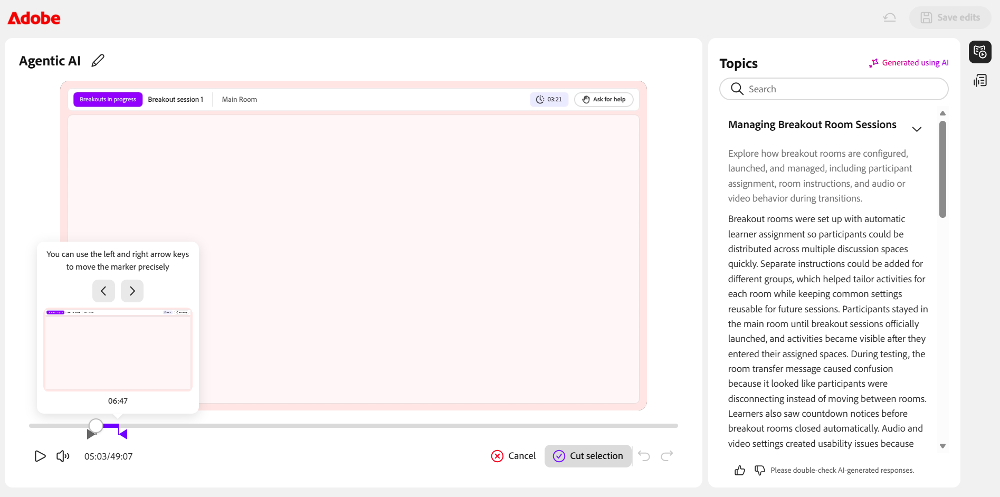
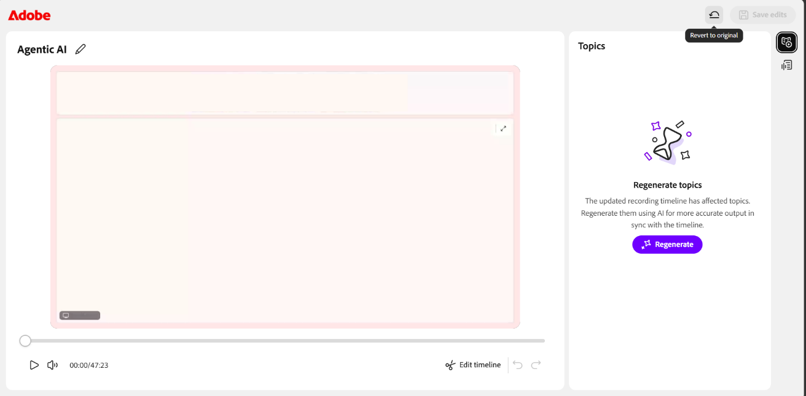
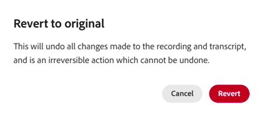

# Eine Sitzung aufzeichnen

Als Kursleiter haben Sie die vollständige Kontrolle darüber, wie eine Sitzung erfasst, verfeinert und freigegeben wird. Sie können eine Aufzeichnung während einer Live-Sitzung starten, sie verwalten, während sie ausgeführt wird, und die automatisch generierten Themen, die Zusammenfassung und das Transkript überprüfen, sobald die Sitzung endet.

Neben der Aufnahme der Sitzung können Sie die Aufzeichnung bearbeiten, um unnötige Abschnitte zu entfernen, Bilduntertitel zu aktivieren und Transkripte zu erstellen. In den folgenden Abschnitten werden diese Aktionen ausführlich erläutert.

>[!NOTE]
>
>Wenn Sie eine Sitzung aufzeichnen, wird nur die Hauptsitzung in die Aufzeichnung aufgenommen. Die Aufzeichnung wird automatisch angehalten, wenn Teilnehmer in Arbeitsräume wechseln, und fortgesetzt, wenn alle zur Hauptsitzung zurückkehren. Daher werden Arbeitsraumaktivitäten nicht aufgezeichnet.

## Eine Sitzung aufzeichnen

1. Navigieren Sie zum Menü &quot;**Weitere Aktionen**&quot;.

1. **Aufzeichnung starten** auswählen.   Ein Bestätigungs-Popup wird angezeigt, das darauf hinweist, dass &quot;**Die Sitzung wird jetzt aufgezeichnet**&quot;.

   
   *Wählen Sie im Menü &quot;Weitere Aktionen&quot; die Option &quot;Aufzeichnen&quot; aus, um mit dem Aufzeichnen der Sitzung zu beginnen.*

## Aufzeichnung beenden, anhalten und fortsetzen

Wenn eine Sitzung aufgezeichnet wird, wird in der oberen Ecke des virtuellen Klassenzimmers ein Aufnahmeanzeiger angezeigt. Sie können die Aufnahme starten, anhalten und fortsetzen.

### Aufzeichnung beenden

1. Wählen Sie den Aufzeichnungsindikator aus.   Ein Popup-Fenster mit Aufzeichnungsaktionen wird geöffnet.

   
   *Verwenden Sie während der Aufzeichnung die Optionen &quot;Aufzeichnung läuft&quot;, um die Sitzung anzuhalten oder zu beenden.*

1. Wählen Sie **Aufzeichnung beenden**.   Eine Bestätigungsmeldung wird angezeigt, dass die Sitzung nicht mehr aufgezeichnet wird.

### Aufzeichnung anhalten

So halten Sie die Aufzeichnung an:

1. Wählen Sie den Aufzeichnungsindikator aus.

1. Wählen Sie **Aufzeichnung anhalten**.   Es wird eine Bestätigungsmeldung mit **Aufzeichnung und Transkription angehalten** angezeigt.

### Aufzeichnung fortsetzen

Sobald Sie die Aufzeichnung angehalten haben, wird die Option &quot;Aufzeichnung fortsetzen&quot; angezeigt. Wählen Sie **Aufzeichnung fortsetzen**, um die angehaltene Aufzeichnung fortzusetzen.

*Wenn die Aufzeichnung angehalten wurde, können Sie die Aufzeichnung fortsetzen oder anhalten, indem Sie die Optionen für &quot;Aufzeichnung angehalten&quot; auswählen.*

## Auf eine Aufzeichnung zugreifen

Aufgezeichnete Sitzungen sind auf der Seite **Sitzungsübersicht** für jede Sitzung verfügbar. Von hier aus können Sie eine Aufnahme wiedergeben oder im Bearbeitungsmodus öffnen, um das Schnittfenster und das Transkript zu optimieren.

So greifen Sie auf eine Aufzeichnung zu:

1. Navigieren Sie zum gewünschten Kurs und öffnen Sie die Sitzung.

1. Scrollen Sie auf der Seite **Sitzungsübersicht** zum Abschnitt **Live hub** .

1. Führen Sie auf der Karte **Aufzeichnung anzeigen** einen der folgenden Schritte aus:

   * Wählen Sie **Aufzeichnung anzeigen** aus, um die Aufzeichnung im Wiedergabemodus zu öffnen.

   * Wählen Sie **Bearbeiten** aus, um die Aufzeichnung im Bearbeitungsmodus zu öffnen.

   
   *Die Aufzeichnungskarte im Abschnitt &quot;Live-Hub&quot; anzeigen, auf der Sie eine Aufzeichnung abspielen oder bearbeiten.*

## Aufzeichnung abspielen

Wenn Sie Aufzeichnung anzeigen auswählen, wird die Aufzeichnung im Aufzeichnungs-Player geöffnet. Der Player zeigt das Sitzungsvideo, die Miniaturansichten der Teilnehmer und das Transkript an.

So spielen Sie eine Aufzeichnung ab:

1. Navigieren Sie zur Seite **Sitzungsübersicht**.

1. Wählen Sie im Abschnitt **Live Hub** die Option **Aufzeichnung anzeigen** aus. 4  Die Aufzeichnung wird im Wiedergabemodus geöffnet.

   
   *Der Wiedergabe-Player befindet sich im Wiedergabemodus und zeigt das Sitzungsvideo und das Bedienfeld &quot;Transkript&quot; an.*

1. Verwenden Sie die folgenden Steuerelemente für die Wiedergabe, um das Anwendererlebnis anzupassen:

| **Steuerelement** | **Beschreibung** |
|----|----|
| Abspielen oder Anhalten | Startet die Wiedergabe oder hält sie an. |
| Lautstärke | Passt den Audiopegel an. |
| Fortschrittsleiste | Ziehen Sie das Werkzeug, um einen bestimmten Punkt in der Aufnahme anzuzeigen. Die verstrichene Zeit und die Gesamtzeit werden neben den Steuerelementen angezeigt. |
| Wiedergabegeschwindigkeit | Die Wiedergabe wird verlangsamt oder beschleunigt. Verfügbare Optionen sind **0.25x**, **0.5x**, **0.75x**, **1x**, **1.25x**, **1.5x** und **2x**. |
| CC (Bilduntertitel) | Schaltet Untertitel während der Wiedergabe ein oder aus. Wählen Sie den Pfeil neben der Schaltfläche &quot;CC&quot;, um die Untertitel anzupassen. Wählen Sie eine Schriftgröße aus **Klein**, **Mittel** oder **Groß** und einen Untertitelstil aus **Schwarz auf Weiß**, **Gelb auf Schwarz**, **Weiß auf Schwarz**, **Dunkel auf Gelb** oder **Gelb auf Blau**. |
| Vollbild | Erweitert den Aufnahme-Player. |

## Generieren von Themen in der Aufzeichnung

Themen unterteilen Aufzeichnungen basierend auf dem Fluss der Sitzungsdiskussion automatisch in aussagekräftige Abschnitte. Sie helfen, längere Aufzeichnungen zu organisieren und die Navigation zu verbessern. Sie können auch mithilfe von Schlüsselwörtern nach einem Thema suchen, um schnell zum entsprechenden Abschnitt der Aufzeichnung zu navigieren.

## Anzeigen von Themen in der Aufzeichnung

Nachdem die Themen generiert wurden, können Sie sie durchsuchen und durch sie navigieren. Die Themen sind als **Mit AI generiert** markiert. Überprüfen Sie den Inhalt, da KI-generierte Antworten doppelt geprüft werden sollten.

So zeigen Sie Themen an und navigieren zu ihnen:

1. Durchsuchen Sie im Bereich **Themen** die Liste der Themen, oder verwenden Sie das Feld **Suchen**, um ein Thema mithilfe von Schlüsselwörtern zu suchen.

1. Wählen Sie ein Thema aus, um es zu erweitern und seine Zusammenfassung, Details und Gesamtdauer anzuzeigen.

1. Wählen Sie **Thema abspielen**.   Die Aufnahme wird ab dem ausgewählten Themenabschnitt abgespielt.

   Bereich &quot;
   *Der Themenbereich, in dem AI-generierte Themen bei der Navigation in der Aufzeichnung helfen.*

## Transkript anzeigen

Das Transkript enthält eine Version der Sitzung mit Zeitstempel, die Sie neben der Aufzeichnung lesen können. Jeder Eintrag enthält den Namen des Sprechers und den Zeitpunkt, zu dem der Text gesprochen wurde.

Anzeigen des Transkripts

1. Wählen Sie das Symbol **Transkript** aus dem Bedienfeld auf der rechten Seite des Players aus. 2  Der Bereich **Transkript** wird geöffnet und zeigt das mit einem Zeitstempel versehene Transkript an.

1. (Optional) Verwenden Sie das Feld **Suchen**, um bestimmte Wörter oder Sätze im Transkript zu finden.

Um zu einem bestimmten Teil der Aufzeichnung zu navigieren, wählen Sie einen Transkripteintrag aus. Die Aufzeichnung springt zum entsprechenden Zeitstempel und beginnt ab diesem Punkt mit der Wiedergabe.

*Das Bedienfeld &quot;Transkript&quot;, in dem jeder Eintrag mit seinem Punkt in der Aufzeichnung verknüpft ist.*

### Ändern der Größe des Transkripttexts

Sie können die Größe des Transkripttexts anpassen, um das Lesen zu erleichtern.

Ändern der Textgröße:

1. Wählen Sie im Bereich **Transkript** das Symbol **Textgröße** neben der Überschrift **Transkript** aus.

1. Wählen Sie eine Textgröße aus der Liste aus. Es sind 12, 14, 16, 18, 20, 24, 30 und 36 erhältlich. Die Standardgröße ist 14. Der Transkripttext wird auf die ausgewählte Größe aktualisiert.

   Option 
   *Wählen Sie eine Größe für den Transkripttext aus, um das Lesen von Einträgen zu erleichtern.*

## Aufzeichnung bearbeiten

Wenn Sie eine Aufzeichnung in Live Hub bearbeiten, können Sie den Inhalt verfeinern, bevor Sie ihn für die Teilnehmer freigeben. Sie können die Zeitleiste zuschneiden, um unnötige Abschnitte zu entfernen und die Klarheit zu verbessern. Durch Bearbeitungen wird die ursprüngliche Aufzeichnung erst geändert, wenn Sie sie speichern.

So bearbeiten Sie eine Aufzeichnung:

1. Navigieren Sie zu **Sitzungsübersicht** > **Live-Hub** > **Aufzeichnung anzeigen** und wählen Sie **Bearbeiten** aus.   Die Aufzeichnung wird im Bearbeitungsmodus geöffnet.

1. (Optional) Um die Aufzeichnung umzubenennen, wählen Sie das Symbol **Bearbeiten (Bleistift)** neben dem Aufzeichnungstitel aus und geben Sie einen neuen Namen ein.

1. Wählen Sie **Zeitleiste bearbeiten** am unteren Rand des Aufzeichnungsplayers aus. 2  Eine ziehbare Fortschrittsleiste wird in der Zeitleiste der Aufzeichnung angezeigt.

1. Platzieren Sie die Marke auf der Fortschrittsleiste, um das Segment auszuwählen, das Sie entfernen möchten.

1. Ziehen Sie die Marke oder verwenden Sie die Pfeiltasten nach links und rechts, um sie präzise zu verschieben. Mithilfe einer Vorschauminiatur und eines Zeitstempels können Sie den genauen Punkt finden.

   
   *Positionieren Sie die Marke, um das Zeitleistensegment auszuwählen, das Sie entfernen möchten.*

1. Wählen Sie **Auswahl ausschneiden**. Der ausgewählte Abschnitt der Aufzeichnung wird entfernt.

1. (Optional) Verwenden Sie **Rückgängig** oder **Wiederholen**, um eine Aktion rückgängig zu machen oder erneut anzuwenden, oder wählen Sie **Abbrechen** aus, um die aktuelle Auswahl zu verwerfen.

1. Wählen Sie **Bearbeitungen speichern**.   Die Änderungen werden auf Ihre Aufzeichnung angewendet.

   
   *Nach dem Ausschneiden einer Auswahl werden die Änderungen speichern aktiviert, sodass Sie die Änderung anwenden können.*

Sie können eine Aufzeichnung auch im **Sitzungs-Dashboard** bearbeiten. Weitere Informationen finden Sie unter [Komponenten des Sitzungs-Dashboards](../getting-started-with-live-hub/components-of-the-session-dashboard.md#recordings).

## Themen neu generieren

Wenn Sie das Aufzeichnungszeitfenster bearbeiten, stimmen die vorhandenen Themen nicht mehr mit der aktualisierten Aufzeichnung überein. Sie können die Themen neu generieren, um sie mit dem neuen Schnittfenster synchron zu halten.

So generieren Sie Themen neu:

1. Wählen Sie das Symbol **Themen** aus dem Bedienfeld auf der rechten Seite des Players aus. 2  Der Themenbereich wird angezeigt.

1. Wählen Sie **Regenerieren** aus.   Eine Meldung **Themen werden generiert** wird angezeigt, während die Themen identifiziert werden. Das Identifizieren von Themen kann einige Zeit dauern.

   
   *Verwenden Sie nach der Bearbeitung der Zeitleiste die Eingabeaufforderung, um Themen synchron mit der Aufzeichnung neu zu generieren.*

## Auf Original zurücksetzen

Wenn Sie alle Änderungen verwerfen und den ursprünglichen Zustand der Aufzeichnung wiederherstellen möchten, verwenden Sie die Option Auf Original zurücksetzen .

So kehren Sie zur ursprünglichen Aufzeichnung zurück:

1. Wählen Sie das Symbol **Auf Original zurücksetzen** oben im Player aus. 2  Ein Bestätigungs-Popup **Zurück zum Original** wird angezeigt.

   
   *Im Bestätigungs-Popup wird eine Warnung angezeigt, dass das Zurücksetzen auf das Original nicht rückgängig gemacht werden kann.*

1. Wählen Sie **Zurücksetzen** aus. Dadurch werden alle Änderungen an der Aufzeichnung und dem Transkript rückgängig gemacht. Dies ist eine unumkehrbare Aktion, die nicht rückgängig gemacht werden kann.

1. (Optional) Wählen Sie **Abbrechen**, wenn Sie den Vorgang nicht wiederherstellen möchten.

## Aufzeichnung herunterladen

Sie können eine Aufzeichnung herunterladen, um offline darauf zuzugreifen oder sie außerhalb der Plattform freizugeben.

Das Herunterladen einer Aufzeichnung wird über das Sitzungs-Dashboard verwaltet. Weitere Informationen finden Sie unter [Komponenten des Sitzungs-Dashboards](./components-of-the-session-dashboard.md).
