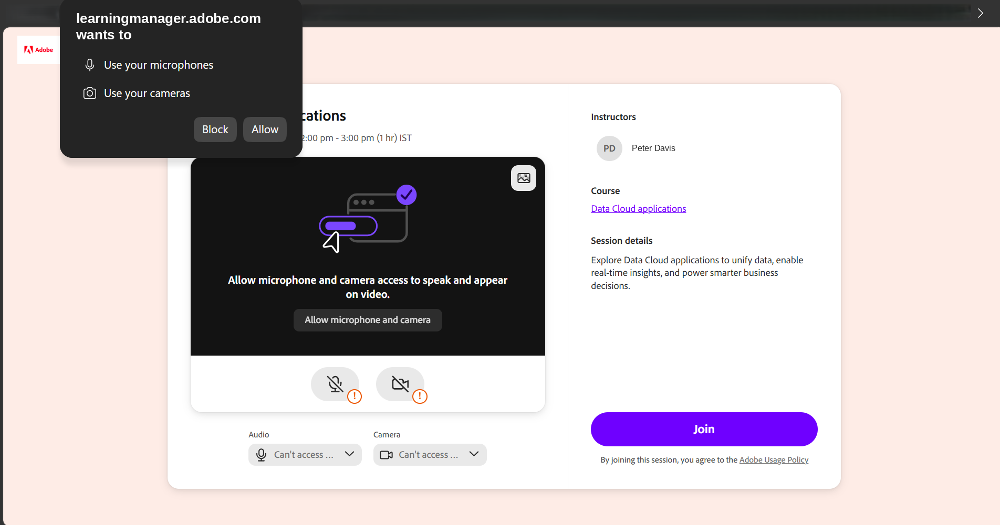
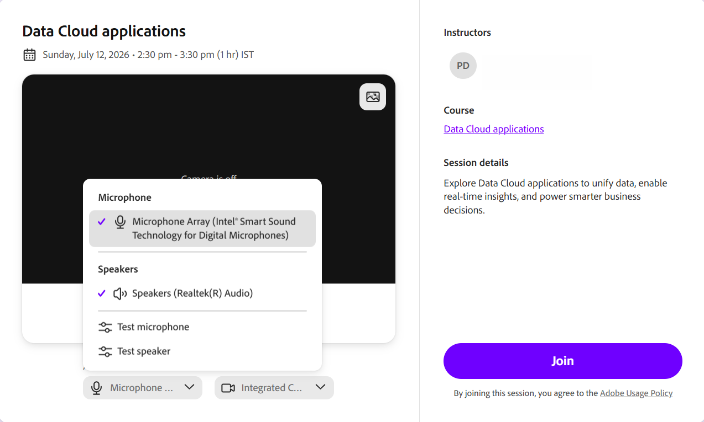
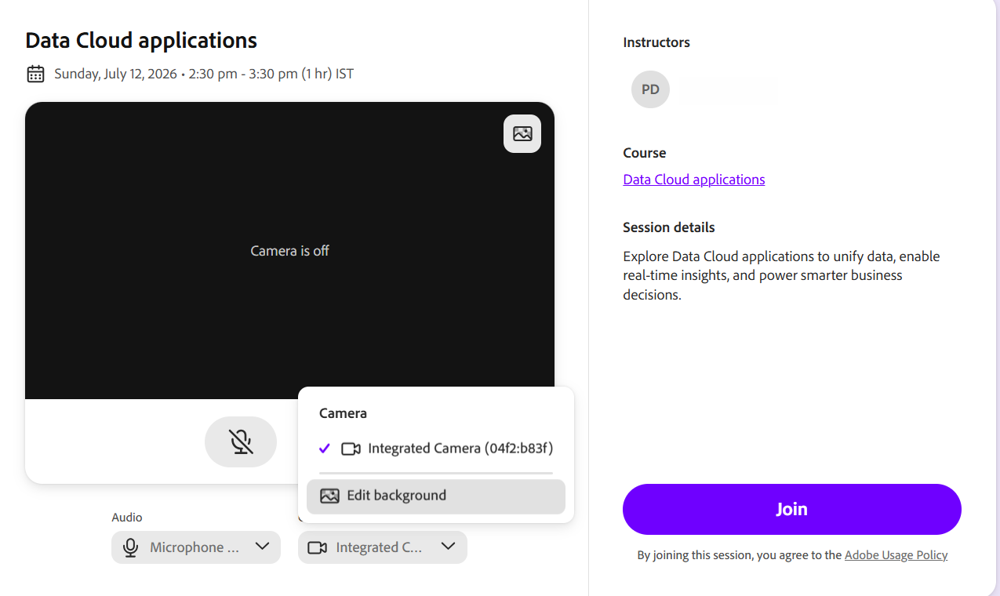

# Vorab-Join-Bildschirm einrichten

Eine Live Hub-Sitzung in Adobe Learning Manager ist eine Live-Schulung mit Kursleiter, an der Kursleiter und Teilnehmer gemeinsam in einem virtuellen Klassenzimmer teilnehmen. Während einer Sitzung können die Teilnehmer sprechen, chatten, auf Umfragen und Tests reagieren, an einem Whiteboard zusammenarbeiten und Arbeitsräume für kleinere Gruppendiskussionen nutzen.

In diesem Artikel wird erläutert, wie eine Sitzung von Anfang bis Ende funktioniert, und es wird die gemeinsame Einrichtung durchlaufen, die für alle unabhängig von der Rolle gilt.

## Was Sie auf dem Bildschirm vor dem Beitritt sehen werden

Auf dem Pre-Join-Bildschirm landen sowohl Kursleiter als auch Teilnehmer, bevor sie den Schulungsraum betreten. Es zeigt die Sitzungsdetails an und bietet Ihnen Audio- und Kamera-Steuerelemente, sodass Sie alles, was zuerst funktioniert, überprüfen können. Wenn der Bildschirm geladen wird, wird möglicherweise eine kurze Ladeanzeige angezeigt, während die Sitzungsinformationen abgerufen werden. Sie können den Sitzungstitel oder den Modulnamen, den Kursleiter, den Kurs und die Sitzungsbeschreibung überprüfen.

### Browserberechtigungen zulassen

Wenn Sie zum ersten Mal über einen neuen Browser oder ein neues Gerät an einer Sitzung teilnehmen, werden Sie aufgefordert, Zugriff auf Ihr Mikrofon und Ihre Kamera zu gewähren. Diese Eingabeaufforderung wird angezeigt, bevor die Audio- und Videovorschau vor dem Beitritt geladen wird. Bis Sie den Zugriff zulassen, werden die Audio- und Kamera-Steuerelemente möglicherweise &quot;**Kein Zugriff auf Mikrofon möglich**&quot; oder &quot;**Kein Zugriff auf die Kamera möglich**&quot; angezeigt.

Wenn Sie von Ihrem Browser dazu aufgefordert werden, wählen Sie **Zulassen**, um den Zugriff auf Ihr Mikrofon und Ihre Kamera zu aktivieren. Sobald die Berechtigung erteilt wurde, können Sie eine Vorschau Ihrer Audio- und Videoeinstellungen anzeigen und konfigurieren, bevor Sie an der Sitzung teilnehmen.

*Wählen Sie Zulassen aus, wenn Ihr Browser Mikrofon- und Kamera-Zugriff anfordert.*

### Konfigurieren von Audiosteuerelementen

Mikrofon und Lautsprecher werden automatisch ausgewählt. Verwenden Sie die Audiosteuerung auf dem Pre-Join-Bildschirm, um zu bestätigen, dass sie funktionieren, oder wechseln Sie zu einem anderen Gerät.

So testen Sie Mikrofon und Lautsprecher:

1. Wählen Sie das **Mikrofon** auf dem Bildschirm vor dem Beitritt aus. Das Dropdown-Menü **Mikrofon** wird angezeigt.

   
   *Wählen Sie die Dropdown-Liste &quot;Mikrofon&quot; aus, um die Geräte zu wechseln oder Ihr Mikrofon und Ihren Lautsprecher zu testen.*

1. (Optional) Wählen Sie **Mikrofon testen**, um zu überprüfen, ob Ihr Mikrofon funktioniert.

1. (Optional) Wählen Sie **Lautsprecher testen**, um die Lautsprecherausgabe zu überprüfen.

### Den Hintergrund einer Kamera ändern.

Verwenden Sie das Menü &quot;**Kamera**&quot; auf dem Bildschirm vor dem Beitritt, um einen virtuellen Hintergrund anzuwenden.

Hintergrund ändern:

1. Wählen Sie das Dropdown-Menü **Kamera** aus. Das Dropdown-Menü **Kamera** wird angezeigt.

   
   *Wählen Sie die Dropdown-Liste &quot;Kamera&quot; aus, und wählen Sie dann &quot;Hintergrund bearbeiten&quot; aus, um einen virtuellen Hintergrund auszuwählen.*

1. Wählen Sie **Hintergrund bearbeiten** und wählen Sie einen virtuellen Hintergrund aus. Die Vorschau wird sofort aktualisiert.
