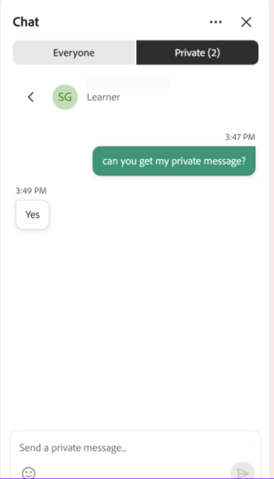

# Verwenden des Chat-Bedienfelds als Teilnehmer

Verwenden Sie das Chat-Bedienfeld, um an Unterhaltungen während einer Live Hub-Sitzung teilzunehmen. Sie können Nachrichten an alle Teilnehmer senden, Fragen stellen und Ihre Chat-Nachrichten verwalten. Wenn Ihr Kursleiter privates Messaging aktiviert hat, können Sie auch direkt mit anderen Teilnehmern chatten. In diesem Artikel werden die für Teilnehmer verfügbaren Chat-Funktionen beschrieben.

## Zugriff auf das Chat-Bedienfeld

Als Teilnehmer können Sie das Chat-Bedienfeld verwenden, um an Diskussionen teilzunehmen, Fragen zu stellen und sich mit anderen während einer Sitzung zu verbinden.

Führen Sie die folgenden Schritte aus, um auf das Chat-Bedienfeld zuzugreifen:

1. Nimm an der Live Hub-Session teil.

1. Wählen Sie in der Steuerungsleiste  aus. Das Chat-Bedienfeld wird standardmäßig mit der Registerkarte **Jeder** geöffnet, sodass Sie an der laufenden Unterhaltung teilnehmen oder ihr folgen können.

1. Wählen Sie eine der folgenden Registerkarten:

   1. Alle

   1. Privat

   
   *Chat-Bedienfeld, das die Registerkarte &quot;Jeder&quot; und &quot;Privat&quot; für die Kommunikation anzeigt.*

1. Geben Sie Ihre Nachricht ein und wählen Sie **Senden**.

## Anpassen des Chat-Bedienfelds

Sie können das Chat-Bedienfeld anpassen, um Benachrichtigungen zu verwalten und die Lesbarkeit von Nachrichten während einer Live Hub-Sitzung zu verbessern.

Chat-Bedienfeld anpassen:

1. Öffnen Sie den Bereich **Chat**.

1. Wählen Sie **Weitere Optionen (⋯)** in der oberen rechten Ecke des Chatbedienfelds aus.

1. Wählen Sie eine der folgenden Optionen aus:

   1. **Benachrichtigungen deaktivieren**: Deaktivieren Sie die Chat-Benachrichtigungen für die aktuelle Sitzung.

   1. **Textgröße ändern**: Vergrößern oder verkleinern Sie Chatnachrichten, um das Lesen zu erleichtern.

   
   *Einstellungen des Chat-Bedienfelds zeigen Optionen zum Deaktivieren von Benachrichtigungen und zum Anpassen der Textgröße von Chat-Nachrichten an.*

## Chatnachrichten verwalten

Sie können mit den Nachrichten interagieren, um die Unterhaltungen organisiert und auf dem neuesten Stand zu halten. Beantworten Sie Nachrichten, reagieren Sie mit Emojis, bearbeiten Sie Nachrichten nach dem Senden oder löschen Sie sie, wenn sie nicht mehr benötigt werden.

So verwalten Sie eine Nachricht im Chat:

1. Bewegen Sie den Mauszeiger über die Meldung, um verfügbare Aktionen anzuzeigen.

1. Wählen Sie die gewünschte Aktion aus.

| **Aktion** | **Beschreibung** |
|----|----|
| **Reagieren** | Fügen Sie eine Emoji-Reaktion hinzu, um eine Nachricht zu bestätigen oder darauf zu antworten, ohne eine neue Chat-Nachricht zu senden. |
| **Antwort** | Antworten Sie auf eine bestimmte Nachricht. Die Antwort enthält einen Verweis auf die ursprüngliche Nachricht, um den Kontext zu verbessern. |
| **Bearbeiten** | Eine Nachricht nach dem Senden aktualisieren. Die bearbeitete Nachricht ersetzt die ursprüngliche Nachricht im Chat. |
| **Löschen** | Entfernen Sie Ihre Nachricht aus dem Chat. Die Beschriftung &quot;Nachricht gelöscht&quot; wird angezeigt, um den Konversationsfluss beizubehalten. |

## Private Nachrichten senden

Mit der Registerkarte **Privat** können Sie während einer Sitzung direkt mit anderen Teilnehmern kommunizieren, ohne Nachrichten im öffentlichen Chat freizugeben.

So starten Sie eine private Unterhaltung:

1. Wählen Sie die Registerkarte **Privat** aus.

1. Wählen Sie einen Teilnehmer aus der Liste aus.

   
   *Die Registerkarte &quot;Privat&quot; zeigt eine persönliche Unterhaltung zwischen einem Teilnehmer und einem anderen Teilnehmer an.*

1. Geben Sie Ihre Nachricht ein und wählen Sie **Senden**.

Eine private Unterhaltung mit dem ausgewählten Teilnehmer wird geöffnet. Nachrichten sind nur für Sie und diesen Teilnehmer sichtbar.

>[!NOTE]
>
> Die Verfügbarkeit eines privaten Chat hängt von den Sitzungseinstellungen ab. Wenn der Kursleiter den privaten Chat deaktiviert, können Sie keine privaten Konversationen starten oder daran teilnehmen.
