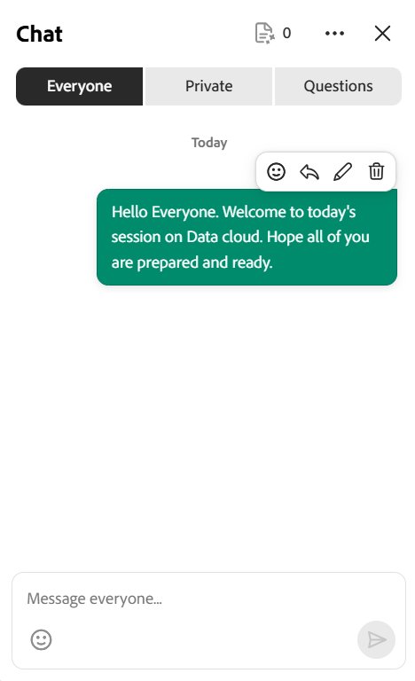
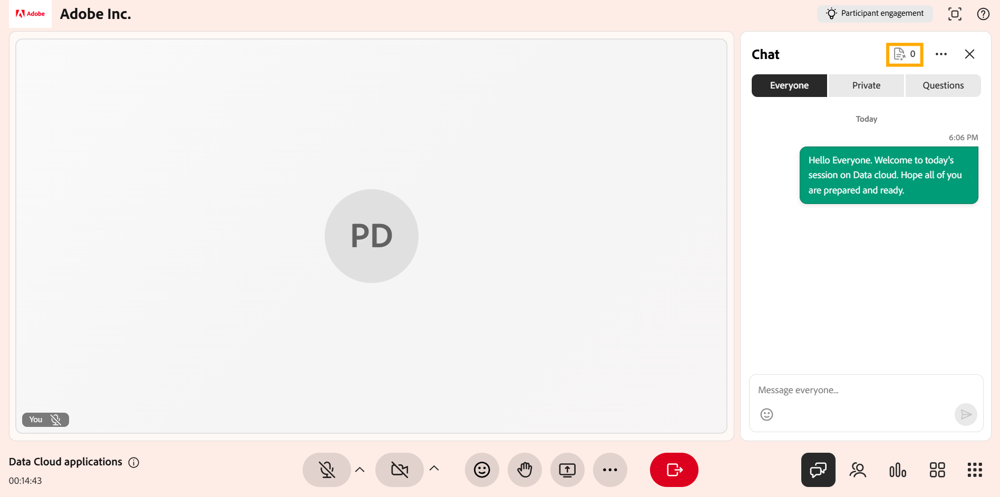

# Verwenden des Chat-Bedienfelds als Kursleiter

Als Kursleiter ist das Chat-Bedienfeld Ihr Hub für die Verwaltung der Kommunikation während einer Live-Hub-Sitzung. In einem einzigen Bedienfeld können Sie die öffentliche Diskussion verfolgen, private Unterhaltungen führen und die Fragen überprüfen, die AI im Chat erkennt. Ihr könnt die Unterhaltung auch moderieren und mithilfe von KI reagieren.

In diesem Artikel werden die Aktionen erläutert, die den Kursleitern im Chat-Bedienfeld zur Verfügung stehen, vom Zugriff auf das Bedienfeld bis hin zur Verwaltung von Nachrichten und Einstellungen.

## Zugriff auf das Chat-Bedienfeld

Verwenden Sie das Chat-Bedienfeld, um Unterhaltungen zu verwalten, Teilnehmern zu antworten und Fragen während einer Sitzung zu überwachen. Das Gremium bietet Zugang zu öffentlichen, privaten und fragenbasierten Diskussionen an einem zentralen Ort.

Führen Sie die folgenden Schritte aus, um auf das Chat-Bedienfeld zuzugreifen:

1. Nimm an der Live Hub-Session teil.

1. Wählen Sie in der Steuerungsleiste  aus. Der Chat-Bereich wird geöffnet, wobei die Registerkarte **Jeder** standardmäßig ausgewählt ist, sodass Sie eine laufende Unterhaltung beginnen oder daran teilnehmen können.

1. Wählen Sie je nach Bedarf eine der folgenden Optionen aus:

   1. Alle

   1. Privat

   1. Fragen

   Registerkarte &quot;Chat-Bereich für alle&quot; 
   *Das Chat-Bedienfeld wird zur Registerkarte &quot;Alle&quot; geöffnet, auf der Sie der öffentlichen Unterhaltung folgen und zu den Registerkarten &quot;Privat&quot; und &quot;Fragen&quot; wechseln können.*

1. Geben Sie Ihre Nachricht ein und wählen Sie **Senden**.

## Einstellungen im Chat-Bedienfeld

Das Chat-Bedienfeld bietet Optionen zum Verwalten von Unterhaltungen und zum Anpassen Ihres Chat-Erlebnisses während einer Sitzung. Sie können Nachrichten löschen, Benachrichtigungen steuern und die Textgröße nach Bedarf anpassen.

Einstellungsmenü des 
*Einstellungsmenü des Chatbedienfelds.*

Die folgenden Optionen sind in den Einstellungen des Chatbedienfelds verfügbar:

| **Option** | **Beschreibung** |
|----|----|
| **Alle Chats löschen** | Entfernt alle Nachrichten aus dem Chat-Bereich. |
| **Chat-Benachrichtigungen deaktivieren** | Deaktiviert Chat-Benachrichtigungen für die Sitzung. |
| **Textgröße** | Passt die Größe der Chat-Nachrichten an, um die Lesbarkeit zu verbessern. Die verfügbaren Optionen sind **Klein**, **Mittel** und **Groß**. |

## Auf Chatnachrichten antworten

Mit der Antwortfunktion können Sie direkt auf eine bestimmte Nachricht antworten, wodurch der Kontext während der Diskussionen beibehalten und die Unterhaltung erleichtert wird.

So antworten Sie auf eine Nachricht im Chat:

1. Bewegen Sie den Mauszeiger über die Nachricht, auf die Sie antworten möchten.

1. Wählen Sie **Antwort** aus.

   
   *Wählen Sie Antwort auf eine Nachricht aus, um direkt darauf zu antworten und die Konversation im Kontext zu halten.*

1. Geben Sie Ihre Antwort in das Nachrichteneingabefeld ein.

1. Wählen Sie **Senden** aus.

Die Antwort zeigt neben Ihrer Antwort einen Ausschnitt der ursprünglichen Nachricht an, damit die Teilnehmer den Kontext der Unterhaltung verstehen können.

### Auf eine Nachricht reagieren

Sie können auch auf Nachrichten reagieren, um sie schnell zu bestätigen oder zu antworten, ohne eine Antwort einzugeben. Bewegen Sie den Mauszeiger über eine Nachricht und wählen Sie eine Reaktion aus. Die ausgewählte Reaktion wird unterhalb der Nachricht angezeigt und ist für andere Teilnehmer im Chat sichtbar.

*Eine Reaktion wird unterhalb der Nachricht angezeigt und ist für alle im Chat sichtbar.*

## Chatnachrichten bearbeiten

Mit der Funktion zum Bearbeiten von Nachrichten können Sie eine Nachricht nach dem Senden aktualisieren und so Ihre Antwort korrigieren oder verfeinern.

Bearbeiten einer Nachricht im Chat:

1. Bewegen Sie den Mauszeiger über die Nachricht, die Sie bearbeiten möchten.

1. Wählen Sie **Bearbeiten**.

   
   *Wählen Sie &quot;Bearbeiten&quot; aus, um eine bereits gesendete Nachricht zu aktualisieren.*

1. Aktualisieren Sie die Nachricht im Eingabefeld.

1. Wählen Sie **Speichern** aus, um die Änderungen anzuwenden, oder **Abbrechen**, um sie zu verwerfen.

Die aktualisierte Nachricht ersetzt die ursprüngliche Nachricht im Chat und wird als **Bearbeitet** markiert.

## Teilnehmer in den Chat-Nachrichten erwähnen

Mit der Tagging-Funktion im Chat-Bedienfeld können Sie einen bestimmten Teilnehmer direkt während einer Sitzung ansprechen. Die Verwendung von Tags lenkt die Aufmerksamkeit auf Ihre Nachricht und verbessert die Sichtbarkeit für den Teilnehmer, den Sie erwähnen, insbesondere während aktiver Diskussionen.

So erwähnen Sie einen Teilnehmer im Chat:

1. Geben Sie im Nachrichteneingabefeld **@** ein.

1. Wählen Sie den Namen des Teilnehmers aus der Liste aus.

   
   *Geben Sie @ ein, um die Teilnehmerliste auszufüllen und den Namen aus der Liste auszuwählen.*

1. Geben Sie Ihre Nachricht ein.

1. Wählen Sie **Senden** aus.

Der markierte Teilnehmer erhält eine Benachrichtigung und sein Name wird in der Nachricht hervorgehoben, um eine bessere Sichtbarkeit zu gewährleisten.

## Privaten Chat starten

Auf der Registerkarte **Privat** im Chat-Bedienfeld können Sie private Nachrichten senden, ohne die öffentliche Diskussion zu unterbrechen. Sie können einen neuen Chat starten, bestehende Unterhaltungen fortsetzen oder mit bestimmten Teilnehmern kommunizieren.

Privaten Chat starten:

1. Wählen Sie die Registerkarte **Privat** aus. Eine Teilnehmerliste wird angezeigt.

   
   *Auf der Registerkarte &quot;Privat&quot; werden Teilnehmer aufgelistet, sodass Sie nur Kursleiter oder einen einzelnen Teilnehmer benachrichtigen können.*

1. Sie haben folgende Möglichkeiten:

   1. Wählen Sie **Nur Kursleiter** oben in der Liste aus, um Nachrichten an andere Kursleiter zu senden. Nachrichten sind nur für Kursleiter sichtbar.

   1. Wählen Sie einen einzelnen Teilnehmer aus, um eine private Unterhaltung zu starten.

1. Geben Sie Ihre Nachricht ein und wählen Sie **Senden**. Nachrichten sind nur für Sie und den ausgewählten Teilnehmer sichtbar.

### Privaten Chat für Teilnehmer deaktivieren

Standardmäßig können Teilnehmer privat mit anderen Teilnehmern chatten. Als Kursleiter können Sie steuern, ob Teilnehmer während einer Sitzung einen privaten Chat verwenden können.

So deaktivieren Sie den privaten Chat für Teilnehmer:

1. Öffnen Sie **Raumeinstellungen**.

1. Wählen Sie **Teilnehmerberechtigungen** aus.

   
   *Deaktivieren Sie &quot;Private Nachrichten senden&quot; in den Teilnehmerberechtigungen, um zu verhindern, dass Teilnehmer privat chatten.*

1. **Private Nachrichten senden** deaktivieren.

1. Wählen Sie **Fertig**.

Nach der Deaktivierung können die Teilnehmer keine privaten Konversationen mehr starten oder daran teilnehmen.

## Entwurf von Antworten auf Teilnehmerfragen mit KI

Die Registerkarte **Fragen** hilft Kursleitern dabei, Teilnehmerfragen effizienter zu verwalten und zu beantworten. AI erkennt automatisch Fragen aus dem Chat und bietet Kursleitern während der Sitzung Antwortvorschläge an.

So generieren Sie eine AI-gestützte Antwort:

1. Navigieren Sie zur Registerkarte **Fragen**.

1. Bewegen Sie den Mauszeiger über die erkannte Frage.

1. Wählen Sie **Entwurfsantwort mit AI** aus.

   
   *Wählen Sie Entwurfsantwort mit AI aus, um eine vorgeschlagene Antwort auf eine erkannte Frage zu generieren.*

1. (Optional) Überprüfen und bearbeiten Sie die vorgeschlagene Antwort.

1. Wählen Sie **Senden** aus.

Die AI-generierte Antwort wird dem Chat hinzugefügt und kann vor dem Senden geändert werden, um Genauigkeit und Relevanz zu gewährleisten.

>[!NOTE]
>Wenn die Frage nicht durch den hochgeladenen Referenzinhalt abgedeckt wird, kann der AI-Assistent eine Fehlermeldung anzeigen, anstatt eine Antwort zu generieren. Weitere Informationen finden Sie im [Leitfaden zur Fehlerbehebung für Live Hub](../kb/troubleshooting-guide-for-live-hub.md#answer-generation-toast-issues).

### Dateien hochladen, um bessere Antworten zu erhalten

Sie können auch Referenzdateien hochladen, um die Genauigkeit und Relevanz KI-generierter Antworten zu verbessern.

Hochladen einer Datei:

1. Navigieren Sie zur oberen rechten Ecke des Chat-Bedienfelds.

   
   *Öffnen Laden Sie Inhaltsreferenzen hoch, um Dateien hinzuzufügen, die AI dabei unterstützen, genauere Antworten zu generieren.*

1. Wählen Sie **Inhaltsreferenzen hochladen**. Ein Popupfenster mit **QnA-Referenzinhalt** wird angezeigt.

1. Wählen Sie **Dateien durchsuchen**.

   
   *Wählen Sie im Fenster &quot;QnA-Referenzinhalt&quot; &quot;Dateien durchsuchen&quot; aus, um eine Referenzdatei von Ihrem System hochzuladen.*

1. Laden Sie die Datei von Ihrem System hoch.

KI verwendet den hochgeladenen Inhalt, um präzisere und relevantere Antworten auf Fragen auf der Registerkarte **Alle** zu generieren.

>[!NOTE]
>Wenn der Upload fehlschlägt oder die Datei abgelehnt wird, finden Sie in [Leitfaden zur Fehlerbehebung für Live Hub](../kb/troubleshooting-guide-for-live-hub.md#upload-content-issues) eine Liste der häufigen Fehlermeldungen und wie diese behoben werden können.

## Nachrichten löschen

Mit der Option &quot;Nachricht löschen&quot; können Sie Nachrichten aus dem Chat entfernen, um Diskussionen zielgerichtet und relevant zu halten. Sie können Ihre eigenen Nachrichten löschen, die für das Thema nicht relevant sind oder die Diskussion stören.

*Löschen Sie Ihre eigenen Nachrichten, um die Diskussion fokussiert und relevant zu halten.*
