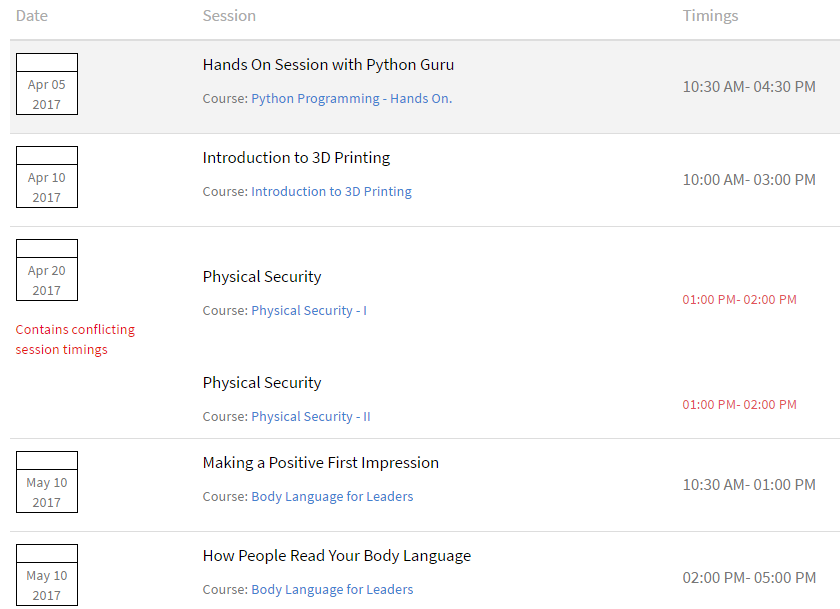
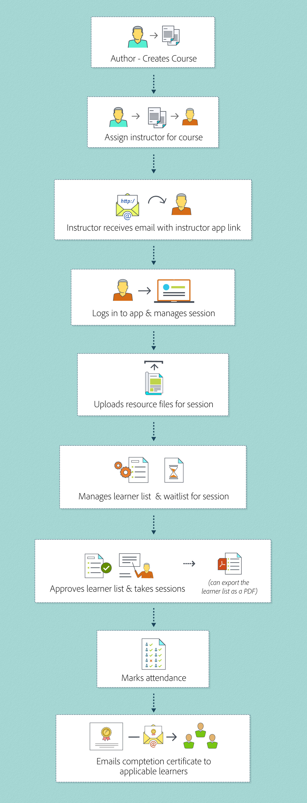

# Erste Schritte als Kursleiter in Learning Manager

In diesem Artikel erfahren Sie, wie Sie als Kursleiter mit Learning Manager beginnen.

## Melden Sie sich als Administrator an {#loginasaninstructor}

Wenn ein Autor Sie als Kursleiter für ein Modul in einem Kurs hinzufügt, erhalten Sie eine E-Mail an Ihre registrierte E-Mail-Adresse. Die E-Mail enthält einen Link zur Kursleiter-App (ACI). Klicken Sie auf den Link, um zur Learning Manager-Anmeldeseite zu wechseln.

1. Melden Sie sich bei Learning Manager an.

   Der Bildschirm zeigt die Startseite der Kursleiter-App an. Sie können die Details über die bevorstehenden Sitzungen sehen.

   

   *Startseite der Kursleiter-App anzeigen*

Administratoren können außerdem einen Benutzer als Autor zum Modul hinzufügen, wenn sie Sitzungsinformationen für eine Kursinstanz eingeben.

## Verwalten von Modulen als Kursleiter {#managingmodulesasaninstructor}

Sehen Sie sich das folgende Bild an, um den Arbeitsablauf für den Kursleiter in Learning Manager zu verstehen:

*Arbeitsablauf eines Kursleiters*
