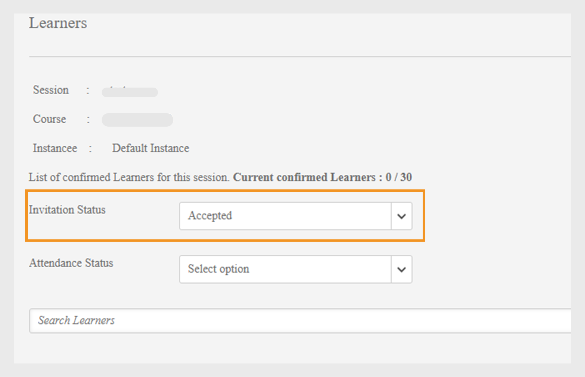

# Verwalten der Teilnehmer für Ihre Sitzung

Lesen Sie den folgenden Artikel, um zu erfahren, wie Sie die Teilnehmer verwalten, kursbezogene E-Mail senden und Erinnerungen für Sitzungen senden können.

## Siehe Sitzungen oder Module mit ausstehenden Überprüfungen {#pending}

Als Kursleiter können Sie die Sitzungen oder Module mit ausstehenden Überprüfungen anzeigen.

Auf der Seite &quot;Sessions/Module&quot; wird die Spalte **Ausstehende Überprüfungen** angezeigt, in der die Anzahl der ausstehenden Überprüfungen für die entsprechende Sitzung/Aktivität angezeigt wird.

## Verwalten der Warteliste für die Sitzung {#managewaitlistforyoursession}

Wenn sich die Teilnehmer für Ihr Modul anmelden, können Sie den aktuellen Status der Einschreibung und die Warteliste auf der Seite „Warteliste“ sehen.

1. Wählen Sie in der Kursleiter-App im linken Navigationsbereich „Geplante Sitzungen“ > „Warteliste“.

   Sie können die maximale Anzahl von Lizenzen, die Anzahl der Lizenzen, die gerade verwendet werden und die freien Lizenzen sehen. In der Tabelle werden außerdem Teilnehmer aufgeführt, die sich auf der Warteliste befinden. Sie ist leer, wenn es keine Warteschlangen auf der Warteliste gibt.

   
   *Teilnehmer auf Warteliste anzeigen*

1. Wählen Sie in der Warteliste-Tabelle den/die Teilnehmer, den/die Sie bestätigten möchten.
1. Wählen Sie „Aktionen“ > „Teilnehmer bestätigen“.

   Die Teilnehmer, die Sie bestätigt haben, werden der Liste „Bestätigte Teilnehmer“ hinzugefügt.

Kursleiter haben die Möglichkeit, die Registrierung von Teilnehmern für Sitzungen aufzuheben. Dadurch wird auch die Registrierung bei den dazugehörigen Lernprogrammen aufgehoben. Wählen Sie die Registerkarte **[!UICONTROL Warteliste]**. Wählen Sie mithilfe der Kontrollkästchen die Teilnehmer aus, deren Registrierung aufgehoben werden soll. Um die Registrierung aufzuheben, wählen Sie **[!UICONTROL Aktionen]** > **[!UICONTROL Registrierung von Teilnehmern aufheben]**.

*Registrierung der Teilnehmer aufheben*

### Wartelistenbericht

Mit dem neuen **[!UICONTROL Wartelistenbericht]** von Adobe Learning Manager können Kursleiter die Liste der auf die Warteliste gesetzten Teilnehmer für alle Instanzen eines Kurses herunterladen. Kursleiter können über den Abschnitt **[!UICONTROL Warteliste]** auf der Seite **[!UICONTROL Sitzungsübersicht]** auf diesen Bericht zugreifen.

Die folgenden Spalten sind im Bericht &quot;Warteliste&quot; verfügbar:

* Kursname
* Instanzname
* Instanzen-ID
* Instanzenstatus
* Benutzername
* E-Mail
* Eindeutige ID des Benutzers
* Registriert am (UTC-Zeitzone)
* Status
* Warteliste Nummer
* Limit für Warteliste
* Maximale Anzahl Lizenzen

So laden Sie den Bericht im Abschnitt &quot;Kursleiter&quot; herunter:

1. Melden Sie sich als **[!UICONTROL Kursleiter]** an.
2. Wählen Sie eine beliebige Sitzung auf der Startseite aus.
3. Wählen Sie die Option **[!UICONTROL Warteliste]** auf der Seite **[!UICONTROL Sitzungsübersicht]** aus.
4. Wählen Sie **[!UICONTROL Aktionen]** > **[!UICONTROL Bericht exportieren]**, um den Bericht **[!UICONTROL Warteliste]** herunterzuladen.

## Vermerken der Teilnahme an Ihrer Sitzung {#markattendanceforyoursession}

Sie können die Anzahl der bestätigten Teilnehmer, die an der Sitzung teilnehmen, deren Namen, deren Teilnahmestatus sowie andere Details auf der Seite „Teilnehmer“ sehen.

1. Klicken Sie im linken Navigationsbereich auf „Geplante Sitzungen“ > „Teilnehmer“.
1. Wählen Sie den/die Teilnehmer aus der Teilnehmerliste aus und führen Sie einen der folgenden Schritte aus:

   * Um die Teilnahme zu vermerken, klicken Sie auf „Aktionen“ > „Teilnahme vermerken“. Sobald der Status als „Teilgenommen“ vermerkt wurde, können Sie den Status nicht mehr ändern.
   * Um den Status als „Nicht-teilgenommen“ zu vermerken, klicken Sie auf „Aktionen“ > „Nicht-teilgenommen“.
   * Um einen Teilnehmer aufgrund einer Absage oder aus anderen Gründen zu löschen, klicken Sie auf &quot;Aktionen&quot; > &quot;Teilnehmer löschen&quot;.

   Ein Teilnehmer kann ein Modul erst abschließen, wenn der Teilnahmestatus „Teilgenommen“ lautet.

   
   *Anwesenheit der Teilnehmer markieren*

## Als erfolgreich markieren

Kursleiter können den Erfolgsstatus jedes Teilnehmers direkt auf der Teilnehmerseite als bestanden oder abgelehnt markieren. Mit dieser Funktion können Kursleiter das Ergebnis von Sitzungen im Klassenzimmer oder virtuellen Klassenzimmer basierend auf der Leistung der Teilnehmer genau aufzeichnen.

So markieren Sie den Erfolg für Teilnehmer:

1. Melden Sie sich bei Adobe Learning Manager als Kursleiter an.
2. Wählen Sie im linken Navigationsbereich **[!UICONTROL Bevorstehende Sitzungen]** aus.
3. Wählen Sie **[!UICONTROL Teilnehmer]** aus.
4. Wählen Sie die Teilnehmer aus und wählen Sie dann **[!UICONTROL Aktionen]**.
5. Wählen Sie eine der folgenden Optionen aus, um den Erfolg für die ausgewählten Teilnehmer zu markieren:

   * **[!UICONTROL Als anwesend markieren und Bestanden]**: Als bestanden markierte Teilnehmer haben das Modul erfolgreich abgeschlossen.
   * **[!UICONTROL Anwesend markieren und fehlgeschlagen]**: Die als &quot;Nicht bestanden&quot; markierten Teilnehmer haben das Modul abgeschlossen, aber nicht bestanden.

   
   _Teilnehmerseite, auf der das Menü &quot;Aktionen&quot; mit markierten Optionen &quot;Teilgenommen markieren&quot; und &quot;Teilgenommen markieren&quot; und &quot;Teilgenommen markieren&quot; und &quot;Fehlgeschlagen&quot; für die Aufzeichnung von Teilnehmerergebnissen markiert ist_

6. Wählen Sie in der Bestätigungsmeldung **[!UICONTROL Ja]** aus.

## Senden Sie eine E-Mail an die Teilnehmer {#sendemailstolearners}

Sie können die E-Mails an bestimmte oder alle Teilnehmer der Sitzung senden. Die Funktion „E-Mail senden“ ist sehr nützlich, wenn Sie die Teilnahme von Teilnehmern bestätigen möchten oder wenn Sie Informationen zu den Sitzungen senden möchten. Sie können auch die Option „E-Mail an alle senden“ nutzen, um Aufgaben- oder Sitzungsmaterial per E-Mail oder allgemeine Informationen an alle Teilnehmer zu schicken.

Um E-Mails von der Teilnehmerseite in der Kursleiter-App an die Teilnehmer zu senden, führen Sie einen der folgenden Schritte aus:

* Um E-Mails an bestimmte Teilnehmer der Sitzung zu senden, wählen Sie den Teilnehmer aus und klicken Sie auf „Aktionen“ > „Senden“ > „E-Mail an Ausgewählte“.
* Um eine E-Mail an alle Teilnehmer zu senden, um Kursmaterial oder eine Aufgabe zu senden, klicken Sie auf „Aktionen“ > „E-Mail an alle senden“.

## Einladungsantworten erfassen

Kursleiter können die Einladungsantworten von Teilnehmern nur erfassen, wenn die Option **[!UICONTROL Antwort einladen]** vom ACAP-Administrator aktiviert wurde. Um diese Funktion zu aktivieren, müssen Administratoren das Supportteam unter [learningmanagersupport@adobe.com](mailto:learningmanagersupport@adobe.com) kontaktieren.

Anschließend können Sie Einladungsantworten im Abschnitt **[!UICONTROL Teilnehmer]** anzeigen. Gehen Sie zu einer beliebigen Sitzung, wählen Sie **[!UICONTROL Teilnehmer]** aus und wählen Sie die Einladungsantwort aus dem Dropdown-Menü aus.

## Exportieren der Teilnehmerliste {#exportinglearnerslist}

Als Kursleiter können Sie die Teilnahme für alle Ihre Teilnehmer ganz einfach vermerke, indem Sie die Liste der eingeladenen Teilnehmer als PDF exportieren. Die Funktion zum Exportieren der Teilnehmerliste finden Sie auf der Seite „Teilnehmer“ im linken Teilfenster. Klicken Sie auf „Aktionen“ > „Teilnehmerliste exportieren (PDF)“.

Nachdem die Teilnehmerliste für Ihre Sitzung bestätigt wurde, können Sie die Liste als PDF-Datei exportieren. In dieser druckerfreundlichen PDF-Datei werden die Teilnehmer als Tabelle angezeigt. Sie können dann die Teilnahme vermerken oder Punktzahlen bereitstellen und Hinweise für Teilnehmer in einer PDF erstellen oder vergeben.

Achten Sie auf den QR-Code in der oberen rechten Ecke dieses PDF-Dokuments. Mit dieser Funktion können einzelne Teilnehmer den Code mithilfe der Learning Manager-Mobilanwendung scannen, damit Teilnehmer ihre Teilnahme vermerken können.

*QR-Code scannen, um Anwesenheit zu vermerken*

## Übertragungen genehmigen oder ablehnen {#approveorrejectsubmissions}

Wenn Teilnehmer Dokumente wie Aufgaben, Berichte oder Bewertungen für Ihre Sitzung hochgeladen haben, können Sie die Dokumente auf der Seite „Übertragungen“ sehen. Sie können die Materialien für die Bewertung des Teilnehmers verwenden und die Übermittlung genehmigen oder. ablehnen.

1. Klicken Sie im linken Bereich entweder auf „Bevorstehende Sitzungen“ oder auf „Letzte Sitzungen“, basierend auf den bereits geplanten Sitzungen.
1. Klicken Sie auf den Kurs, für den Sie die Übertragungen sehen möchten.

   Klicken Sie im linken Teilfenster auf „Übertragungen“.

1. Sie können die Übertragungen von Teilnehmern für diese Sitzung, die Sie ausgewählt haben, ansehen. Wählen Sie die Übertragung aus, die Sie genehmigen oder ablehnen möchten und klicken Sie auf „Genehmigen“ oder „Ablehnen“.

   Der Status der Übertragungen ändert sich je nach Aktion auf „Genehmigen“ oder „Ablehnen“.

## Konfigurierungserinnerungen für Ihre Sitzung {#configureremindersforyoursession}

1. Klicken Sie im linken Teilfenster auf „Bevorstehende Sitzungen“.
1. Klicken Sie auf den Kurs, für den Sie die Erinnerungen festlegen möchten. Klicken Sie im linken Teilfenster auf „Erinnerungen“.
1. Klicken Sie auf der Kachel „Erinnerung auf „Erinnerung festlegen“.

   
   *Konfigurieren Sie Erinnerungen für Ihre Sitzung*

1. Führen Sie folgende Schritte aus:

   * Legen Sie im Dialogfenster „Erinnerungseinstellungen“ die Option fest, wann die Erinnerung an die Teilnehmer gesendet werden soll: Vor dem Termin, Zum Termin oder Nach dem Termin.
   * Legen Sie im Feld „Tage vor dem Termin“ die Anzahl der Tage vor dem Termin fest, wann Sie die Erinnerung an die Teilnehmer senden möchten.
   * Legen Sie die Wiederholung für Ihre Erinnerung fest.

   
   *Erinnerungseinstellungen anzeigen*

1. Führen Sie einen der folgenden Schritte aus:

   * Speichern Sie die Erinnerung, indem Sie das Kontrollkästchen anhaken.
   * Klicken Sie auf das Kreuz, um die Erinnerung abzubrechen.

   Eine automatisierte Kurserinnerung wird an alle Teilnehmer zu dem Datum gesendet, das Sie in den Einstellungen für Ihre Erinnerungen angegeben haben.

   Wenn Sie bereits Erinnerungen zu Ihren Sitzungen festgelegt haben, können Sie diese in den Kacheln „Vorhandene Erinnerungen“ sehen. Darüber hinaus können Sie zusätzliche Erinnerungen Ihren vorhandenen Erinnerungen hinzufügen.

   Um eine vorhandene Erinnerung zu löschen, klicken Sie auf die Erinnerung. Klicken Sie im angezeigten Popup-Menü auf das Symbol „Löschen“ (Papierkorbsymbol), um die Erinnerung zu löschen.
