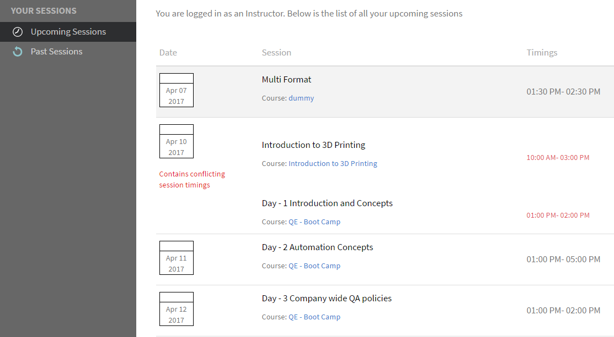
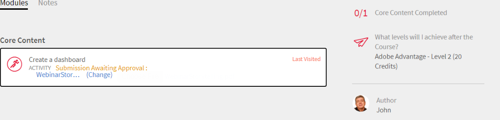

# Module

In diesem Artikel erfahren Sie, wie Sie Module als Kursleiter im Lern-Manager verwalten.

## Sitzungsübersicht anzeigen {#viewsessionoverview}

1. Klicken Sie im linken Teilfenster auf &quot;Bevorstehende Sitzung&quot;.
1. Wählen Sie in der Liste Ihrer bevorstehenden Sitzungen die Sitzung aus, deren Details Sie anzeigen möchten.

   Die App zeigt die Sitzungsübersicht mit Details wie dem Namen der Sitzung, dem Ort, den Zeiten, dem Registrierungslimit, dem Wartelistenlimit usw. an.

   
   *Bevorstehende Sitzungen anzeigen*

## Sitzungsdetails konfigurieren {#configuresessiondetails}

1. Klicken Sie im linken Teilfenster auf &quot;Bevorstehende Sitzung&quot;.
1. Wählen Sie die Sitzung aus, die Sie aktualisieren möchten.
1. Klicken Sie in der rechten oberen Ecke auf Bearbeiten .

   
   *Sitzungsdetails konfigurieren*

1. Auf der Seite &quot;Sitzungsübersicht&quot; können Sie die Sitzungszeiten, das Datum, den Ort usw. bearbeiten. Sie können auch die folgenden Sitzungsdetails bearbeiten oder hinzufügen:

   * Geben Sie das Registrierungslimit an, um die maximale Anzahl von Teilnehmern festzulegen, die für die Sitzung zulässig sind.
   * Geben Sie das Limit für die Warteliste an, wenn Sie die maximale Anzahl von Teilnehmern festlegen möchten, die auf der Warteliste für die Sitzung zugelassen sind.
   * Wählen Sie im Feld &quot;Übertragungen zulassen&quot; die Option &quot;Ja&quot;, um Teilnehmern das Senden von Aufgaben zu ermöglichen. Wenn Sie &quot;Nein&quot; wählen, können Teilnehmer keine Zuweisungsübermittlungen für die Sitzung hochladen.

   
   *Sitzungsdetails bearbeiten*

1. Klicken Sie auf Speichern.

   Sie können das Feld &quot;Kursleiter&quot; auf dieser Seite nicht bearbeiten.

## Ressourcendateien für Ihre Sitzung hochladen {#uploadresourcefilesforyoursession}

Als Kursleiter können Sie Ressourcendateien wie Zuweisungsdateien oder Präsentationen für die Module oder Aktivitätsdateien für das Modul hochladen. Verwenden Sie das Menü Ressourcen, um Ressourcendateien für Ihr Modul oder Ihre Sitzung hinzuzufügen.

1. Klicken Sie in der Kursleiter-App auf bevorstehende Sitzungen > Ressourcen.

   Sie können die Seite Ressourcen anzeigen, die bereits einen Link zu den Ressourcen enthält, die die Autoren für den Kurs hochgeladen haben, der mit Ihrem Modul verknüpft ist. Darüber hinaus können Kursleiter auch Ressourcendateien für Module hochladen.

1. Klicken Sie auf Hinzufügen.

   
   *Fügen Sie eine Ressource für die Sitzung hinzu*

1. Navigieren Sie zu der entsprechenden Datei auf Ihrem Computer. Wählen Sie die Datei aus und klicken Sie auf &quot;Öffnen&quot;.
1. Nachdem die Datei hochgeladen wurde, wird sie zusammen mit dem Datum angezeigt, an dem sie hinzugefügt wurde.

   Teilnehmer, die sich für dieses Modul registriert haben, können Ihre Dateien nach dem Hochladen im Abschnitt Ressourcen unter Kurse sehen.

   Um eine Ressourcendatei zu löschen, wählen Sie die Datei(en) aus, die Sie löschen möchten. Klicken Sie auf der Seite &quot;Ressourcen&quot; auf &quot;Aktionen&quot; > &quot;Datei löschen&quot;.

## Dateiübermittlung für Aktivitätsmodule {#filesubmissionforactivitymodules}

Das Aktivitätsmodul unterstützt den Arbeitsablauf für die Dateiübermittlung. Als Autor erstellen Sie ein Aktivitätsmodul und wählen das  **[!UICONTROL Dateiübermittlung]** aus. Auf diese Weise können Teilnehmer eine Datei übermitteln.

Diese Dateien können vom Kursleiter des Moduls genehmigt/abgelehnt werden. Das Modul wird erst abgeschlossen, nachdem der Kursleiter die Einreichung genehmigt hat.

 
*Dateien genehmigen oder ablehnen*

## Checklistenmodul auswerten {#evaluate-checklist-module}

Nachdem der Teilnehmer den Kurs absolviert hat, sieht der Kursleiter das Checklistenmodul auf der Seite &quot;Einreichungen/Checklisten&quot; im **Module** Abschnitt. Diese Seite enthält alle Aktivitäts-Checklistenmodule sowie die Aktivitätsübermittlungsmodule , für die Überprüfungen fällig sind. Für jedes Modul wird die Anzahl der Teilnehmer angezeigt, für die die Bewertung fällig ist.

Auf der folgenden Seite können Sie Module vom Typ **Einreichung** und **Checkliste**. Für dieses Beispiel verwenden wir das Checklistenmodul.

*Liste der Module anzeigen*

Klicken Sie auf das Checklistenmodul. Im Fenster &quot; **Checkliste** &quot; wird Folgendes angezeigt:

* Der Name des Moduls
* Der Name des Kurses
* Instanz, zu der der Kurs gehört
* Erfüllen von Kriterien, die der Autor festgelegt hat
* Anzahl der Fragen auf der Checkliste

*Checklistenseite anzeigen*

Um einen Teilnehmer zu bewerten, klicken Sie auf **[!UICONTROL Berechnen]** in der &quot; **[!UICONTROL Checkliste]** -Spalte. Sie können auch sehen, dass der Status des Reviews **Ausstehend**.

Bewerten Sie den Teilnehmer und klicken Sie auf **[!UICONTROL Senden]**. Als Kursleiter müssen Sie alle Bewertungsfragen beantworten.

*Checkliste für die Bewertung*

Abhängig von den Kriterien zum Bestehen ist der Status entweder &quot;Nicht bestanden&quot; oder &quot;Bestanden&quot;.

Eine Checkliste kann nach der Auswertung nicht erneut ausgewertet werden.

Ein Kursleiter kann auch die Antworten anzeigen, die von anderen Kursleitern des Moduls eingereicht wurden.

Sie können die Teilnehmer basierend auf dem angewendeten Suchfilter in einer CSV-Datei exportieren.

Nachdem der Kursleiter den Kurs mithilfe der Checkliste ausgewertet hat, sieht der Teilnehmer den Modulstatus als **Bestanden** und Kursstatus als **Abgeschlossen** oder den Modulstatus als **fehlschlagen** und den Kursstatus als **Abgeschlossen**.

## Kursleiterkommentare zur Ablehnung einer Aktivität {#rejection-comments}

Ein Teilnehmer kann den Kommentar eines Kursleiters in der Benachrichtigung sehen, die zur Ablehnung gesendet wird. Der Teilnehmer kann dann erneut senden, indem er weitere Informationen in Form von Kommentaren bereitstellt.

Dies ist der Workflow:

1. Ein Autor erstellt einen Kurs mit einem Aktivitätsmodul, weist einen Kursleiter zu und veröffentlicht dann den Kurs.

1. Ein Teilnehmer absolviert den Kurs und sendet nach Abschluss des Kurses einen Abschlussnachweis.

   
   *Abschlussnachweis einreichen*

1. Der Kursleiter wählt dann das ihm zugewiesene Aktivitätsmodul aus. Auf der Seite &quot;Einreichungen&quot; für das Modul klickt der Kursleiter auf **Bearbeiten**. Er kann dann die Kommentare zur Ablehnung eingeben und die Option &quot;Kommentar anzeigen&quot; aktivieren, damit der Teilnehmer den Kommentar in der Benachrichtigung anzeigen kann.

   
   *Abschlusskommentare eingeben*

1. Der Kursleiter kann auf **Ablehnen**. Der Status der Einreichung ändert sich in **Zur Ablehnung markiert**.

   
   *Einreichung ablehnen*

1. Nach der Übermittlung ändert sich der Status in **abgelehnt**.

   
   *Ablehnungsstatus anzeigen*

1. Der Teilnehmer erhält jetzt eine Benachrichtigung, dass seine Einreichung abgelehnt wurde. Die Kommentare des Kursleiters werden auch in der Benachrichtigung angezeigt.

   
   *Ablehnungsbenachrichtigung erhalten*

Um die Änderungen zu berücksichtigen, hat Adobe die E-Mail-Vorlage für **Einreichung abgelehnt**.

## Hinzufügen von Punktzahlen und Kommentaren für Aktivitätsmodule {#addscoresandcommentsforactivitymodules}

Um Punktzahlen und Kommentare für Aktivitätsmodule hinzuzufügen, die zur Übermittlung gesendet wurden, führen Sie die folgenden Schritte aus:

1. Klicken Sie im linken Teilfenster auf **[!UICONTROL Teilnehmer]**.

   
   *Teilnehmer auswählen*

1. Klicken Sie auf der Teilnehmerseite auf **[!UICONTROL Aktionen]** > **[!UICONTROL Partituren und Kommentare bearbeiten]**.

   
   *Kommentare hinzufügen.*

   Für Teilnehmer, die den Kurs nicht abgeschlossen haben, wird das Eingabefeld für die Punktzahl und Kommentare nicht angezeigt.

   
   *Partituren und Kommentare bearbeiten*

1. Klicken **[!UICONTROL Speichern]**.
