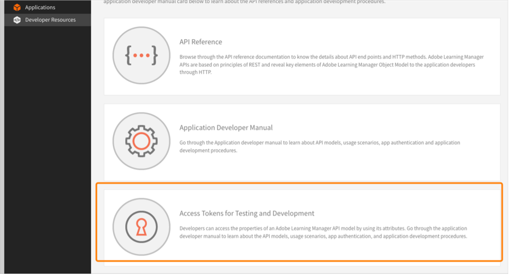
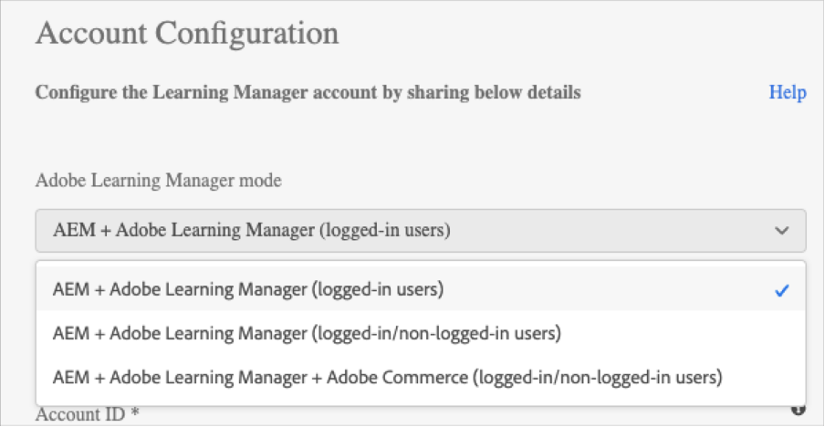
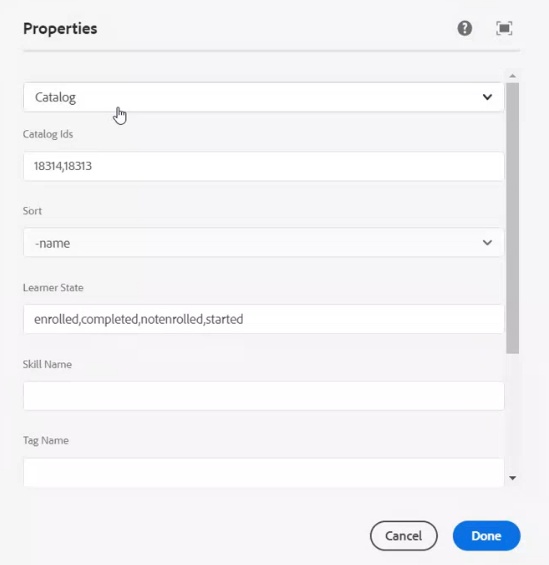

# Adobe Learning Manager mit AEM integrieren

Adobe Learning Manager (ALM) ist in Adobe Experience Manager-Sites (AEM) integriert. So können Sie mit minimalem Programmieraufwand Ihre eigene Website und gut reagierende Mobilgeräteoberflächen für Adobe Learning Manager erstellen. Mit dieser Integration können Sie angepasste Lernbenutzeroberflächen für Ihre Benutzenden erstellen.

Um eine solche Benutzeroberfläche zu erstellen, stellt ALM ein Adobe-Learning Manager-Referenzsite-Paket (ALM-Referenzsite-Paket) für AEM-Sites in Form einer ZIP-Datei bereit, die Sie auf Ihrer AEM-Sites-Instanz installieren können.

Das Paket enthält AEM Sites-Webseitenvorlagen und -Websitekomponenten sowie integrierbare Widgets. Beispiel: Lernkatalog, Kalender, Konformität, Kategorien, Kurse und Pfade usw.

Nachdem Sie das ALM-Referenzsite-Paket installiert haben, können Sie mit dem Erstellen einer Website für Adobe Learning Manager beginnen, die Sie auf Ihrer AEM-Sites-Instanz hosten können. Ihre Benutzenden können dann die Komponenten per Drag &amp; Drop auf die Website ziehen.

>[!IMPORTANT]
>
>Adobe Learning Manager (ALM)-Pakete für AEM Sites bieten einen Quick Start Code Block für die Implementierung. Dieses Paket wurde für Headless-Bereitstellungen entwickelt. Nach der Implementierung der bereitgestellten CodeBase liegt die Verantwortung für die laufende Wartung und Weiterentwicklung bei der implementierenden Partei, wie es bei Headless-Anwendungen auf der Basis von Adobe Learning Manager üblich ist.

## ALM-Referenzsite-Paket installieren

### Voraussetzungen

* Lizenzen für AEM-Sites und Adobe Commerce.
* AEM On-Premise 6.5 oder Adobe Experience Manager - Cloud Service
* Adobe Commerce 2.4.3

Nachdem Sie Ihre AEM-Sites-Umgebung gesichert haben, müssen Sie das ALM-Referenzsite-Paket installieren. Dieses Paket enthält AEM-Webseiten und Websitekomponenten, die das Erstellen der Lernplattform unterstützen.

Das Verweisstandortpaket wird im [**GitHub-Repository**](https://github.com/adobe/adobe-learning-manager-reference-site/releases) gehostet.

Weitere Informationen finden Sie in der README-Datei.

## Herunterladen des Inhaltspakets {#downloadthecontentpackage}

Das Installationsprogramm wird als AEM-Inhaltspaket geliefert. [***Laden Sie das Paket herunter***](https://github.com/adobe/adobe-learning-manager-reference-site).

Das Inhaltspaket ist als ZIP-Datei verfügbar und ist mit AEM 6.4 und AEM 6.5 kompatibel.

## Installieren der Learning Manager-Komponente {#installcaptivateprimecomponent}

Installieren Sie das Learning Manager-Inhaltspaket mit dem AEM Package Manager:

>[!NOTE]
>
>Informationen zum Installieren von Paketen finden Sie unter [***Arbeiten mit Paketen***](https://experienceleague.adobe.com/docs/experience-manager-65/administering/contentmanagement/package-manager.html?lang=en#how-to-work-with-packages).

1. Öffnen Sie als AEM-Autor den AEM Package Manager.
1. Klicken Sie auf die Schaltfläche **[!UICONTROL Paket hochladen]**.
1. Klicken Sie auf **[!UICONTROL Durchsuchen]** und laden Sie das Inhaltspaket hoch.
1. Klicken Sie auf **[!UICONTROL Hochladen]**.
1. Nachdem das Paket hochgeladen wurde, installieren Sie das Inhaltspaket, indem Sie es auswählen und auf **[!UICONTROL Installieren]** klicken.

   

   *Installieren des Inhaltspakets*

## Anwendung in [!DNL Adobe Learning Manager] erstellen

Nach der Installation des AEM-Site-Pakets müssen Sie eine ALM-Anwendung konfigurieren, um Ihr Lernportal mit der AEM-Site zu verbinden.

Dieses Szenario gilt, wenn AEM mit [!DNL Adobe Learning Manager] verwendet wird.

Führen Sie die unten genannten Schritte aus:

1. Klicken Sie als Integrationsadministrator auf **[!UICONTROL Anwendungen]**.
1. Klicken Sie in der rechten oberen Ecke der Seite auf **[!UICONTROL Registrieren]**, um eine neue Anwendung zu erstellen.
1. Geben Sie auf der Seite &quot;Neue Anwendung registrieren&quot; die folgenden Details ein:

   1. **Anwendungsname:** Der Name der Anwendung, die Sie erstellen.
   1. **URL:** Die URL Ihrer Organisation.
   1. **Domänen umleiten:** Die Hostdomänen der AEM Website. Sie können auch Platzhalter angeben.
   1. **Beschreibung:** Die Beschreibung der Anwendung.
   1. **Bereiche:** Wählen Sie Lesezugriff auf Teilnehmerrolle und Schreibzugriff auf Teilnehmerrolle aus.
   1. **Nur für dieses Konto?:** Wählen Sie &quot;Ja&quot; aus, wenn Sie die Anwendung für das vorhandene ALM-Konto verwenden möchten.

1. Nachdem Sie die Änderungen vorgenommen haben, klicken Sie auf **Speichern**.

Notieren Sie sich die angezeigten Anmeldeinformationen der Anwendung.


*Anwendungsanmeldeinformationen*

Klicken Sie zum Genehmigen der Anwendung auf **[!UICONTROL Genehmigen]**.

## Token abrufen

1. Klicken Sie auf der Registerkarte &quot;Entwicklerressourcen&quot; auf **[!UICONTROL Zugriffstoken für Tests und Entwicklung]**.

   

   *Zugriffstoken für Tests und Entwicklung auswählen*

1. Geben Sie die folgenden Details ein:

   
   *Geben Sie die Tokendetails ein*

   1. **OAuth-Code abrufen:** Geben Sie die Client-ID aus dem vorherigen Abschnitt ein und ändern Sie den Umfang. Klicken Sie auf Senden , um den OAuth-Code zu erhalten.
   1. **Aktualisierungstoken abrufen:** Geben Sie die Client-ID und den Schlüssel aus dem vorherigen Abschnitt ein. Geben Sie außerdem den OAuth-Code ein, den Sie aus dem vorherigen Schritt erhalten haben. Klicken Sie auf **Senden**.
   1. **Zugriffstoken abrufen:** Geben Sie die Client-ID und den Schlüssel aus dem vorherigen Abschnitt ein. Geben Sie außerdem das Aktualisierungstoken ein, das Sie aus dem vorherigen Schritt bezogen haben. Klicken Sie auf **Senden**.
   1. **Details zum Zugriffstoken abrufen:** Geben Sie das Zugriffstoken ein, das Sie aus dem vorherigen Schritt abgerufen haben. Klicken Sie auf **Senden**.

1. Sie können die Details aus der folgenden JSON-Antwort abrufen. Die Antwort besteht aus dem Zugriffstoken, dem Aktualisierungstoken, der Benutzerrolle, der Konto-ID, der Benutzer-ID und der Zeit bis zum Ablauf. Notieren Sie sich das Aktualisierungstoken, da Sie es wiederverwenden.

## Konfigurieren des ALM-Kontos in AEM

1. Starten Sie Ihre AEM-Instanz.
1. Klicken Sie auf **Einstellungen** > **Cloud Service**.
1. Klicken Sie auf **Adobe Learning Manager-Konfiguration**.

   
   *Adobe Learning Manager-Konfiguration auswählen*

1. Klicken Sie auf **Erstellen** > **Konfigurationsordner**. Benennen Sie Ihren Ordner.

   
   *Konfiguration erstellen*

1. Wählen Sie im Lernprojekt die Konfiguration aus, die Sie erstellt haben.

1. Geben Sie die Details der Konfiguration ein.

   
   *Konfigurationsordner erstellen*

   1. **Adobe Learning Manager-Modus:** Wählen Sie aus, wie das Lernerlebnis für angemeldete und nicht angemeldete Teilnehmer gestaltet werden soll.
   2. **Adobe Learning Manager-URL:** Geben Sie die URL der ALM-Instanz ein, in der die Lerndienste gehostet werden.
   3. **Konto-ID:** Die ID des ALM-Kontos.
   4. **Client-ID, geheimer Clientschlüssel und Token für die Autorenaktualisierung:** Geben Sie die Anmeldeinformationen ein, die Sie beim Erstellen der Anwendung in ALM erhalten haben.
   5. **Anpassung des Widgets:** Weitere Informationen finden Sie unter [Integration mit AEM](/help/migrated/integrate-aem-learning-manager.md) `.`

1. Speichern und schließen Sie die Konfiguration.

### AEM + Adobe Learning Manager (angemeldete/nicht angemeldete Benutzende)

Mit Adobe Learning Manager können Sie jetzt Ihre Produkte und Schulungen Ihren bestehenden und potenziellen Kunden und Partnern präsentieren, ohne dass eine Kontoerstellung oder Anmeldung erforderlich ist. Diese Funktion unterstützt Sie bei der Einführung von Produkten und Schulungen, indem sie Teilnehmenden eine schnelle und einfache Vorschau der Schulungen bietet, mit der Sie Produktfunktionen hervorheben und für sie werben können. So können Sie Ihre Produkte und Angebote potenziellen Kunden und Partnern effektiv präsentieren und die Produktwahrnehmung steigern. Der einfache Zugriff und die bessere Erreichbarkeit steigern das Interesse, und dies führt zu mehr Registrierungen für Schulungen und einer höheren Akzeptanz von Lernangeboten.

Mit diesem Arbeitsablauf können Teilnehmende eine Vorschau einer Schulung anzeigen, auf Schulungsinformationen zugreifen oder nach einer Schulung suchen, ohne sich bei Adobe Learning Manager anzumelden. Dieser Arbeitsablauf gilt nicht für die native Learning Manager-Benutzeroberfläche. (Er gilt NUR für AEM-Sites und andere Headless-Benutzeroberflächen.)

**Konfigurieren und Aktivieren des Lernplattformkonnektors**

Dieser Abschnitt unterstreicht die Schritte, die zum Konfigurieren und Aktivieren des folgenden Connectors erforderlich sind:

**Zugriff auf Schulungsdaten**

Mit diesem Connector kann Ihre auf AEM-Sites basierende oder sonstige benutzerdefinierte Headless-Benutzeroberfläche Schulungsinformationen abrufen und für die Teilnehmenden rendern und eine nahtlose Suche nach Schulungsinformationen durchführen, bevor oder nachdem sich ein Teilnehmer anmeldet.

Dieser Connector ist nur erforderlich, wenn Sie auf AEM-Sites basierende oder sonstige Headless-Benutzeroberflächen verwenden.

Der Connector exportiert Schulungsmetadaten in eine Datenspeicher- und Abruflösung sowie ein Suchaktivierungssystem. Daher können Sie Ihre auf AEM-Sites basierende oder sonstige benutzerdefinierte Headless-Benutzeroberfläche so konfigurieren, dass diese beiden Dienste verwendet werden können, um Schulungsdaten abzurufen, Webseiten zu rendern und den Teilnehmenden eine optimierte Schulungssuchfunktion zu bieten. Beispielsweise kann eine nicht angemeldete auf AEM-Sites basierende Benutzeroberfläche die exportierten Metadaten verwenden, um Teilnehmenden zu helfen, Seiten mit Schulungsinformationen zu suchen, zu durchsuchen und darauf zuzugreifen.

Aktivieren Sie diesen Connector, um Ihre auf AEM-Sites basierenden Webseiten zu erstellen und zu rendern und Ihren Teilnehmenden sowohl vor als auch nach der Anmeldung benutzerdefinierte Erlebnisse zu bieten. Aktivieren Sie diesen Connector, um Ihre auf AEM-Sites basierenden Webseiten zu erstellen und zu rendern und Ihren Teilnehmenden sowohl vor als auch nach der Anmeldung benutzerdefinierte Erlebnisse zu bieten.

* **Adobe Learning Manager-CDN-Basis-URL:** Geben Sie die Basis-URL des Datenabruf-CDN-Dienstpfads von der Verbindungsseite für den Schulungsdatenzugriff ein.
* **Admin-Aktualisierungstoken:** Geben Sie das Aktualisierungstoken ein, das Sie im vorherigen Abschnitt festgelegt haben.
* **Basis-URL für Schulungsmetadaten:** Geben Sie die Basis-URL der Suchaktivierung und des Dienstpfads zum Abrufen von Suchdaten von der Verbindungsseite für den Schulungsdatenzugriff ein.
* **URL für Adobe Learning Manager-Registrierung:** Geben Sie die vom Integrationsadministrator für das Konto generierte URL für die Selbstregistrierung ein, die von den Teilnehmern für die Registrierung für die Schulung verwendet wird.

### AEM + Adobe Learning Manager + Adobe Commerce (angemeldete/nicht angemeldete Benutzer)

Adobe Learning Manager bietet jetzt Lösungen, mit denen Sie die Lernplattform nahtlos in Adobe Commerce integrieren können. Mit dieser Version können Sie Ihre nativen, auf AEM-Sites basierenden oder sonstigen Headless-Learning Manager-Benutzeroberflächen ganz einfach mit Adobe Commerce verbinden. Mit dieser Integration können Sie E-Commerce-Funktionen innerhalb Ihrer Lernplattform realisieren. Sie können Ihren Kunden und Geschäftspartnern jetzt kostenpflichtige Schulungen anbieten und Schulungskäufe ganz einfach auf nativen und nicht nativen Learning Manager-Benutzeroberflächen ermöglichen. Teilnehmende können auch eine Vorschau einer Schulung anzeigen, auf Schulungsinformationen zugreifen oder nach einer Schulung suchen, ohne sich bei Adobe Learning Manager anzumelden.

Ein Benutzer kann die bereits AEM Anwendung verwenden und sie genehmigen, anstatt eine zu erstellen.

* **Adobe Learning Manager-CDN-Basis-URL:** Geben Sie die Basis-URL des Datenabruf-CDN-Dienstpfads von der Adobe Commerce-Verbindungsseite ein.
* **Adobe Commerce-URL:** Geben Sie die URL der Adobe Commerce-Instanz ein, die Sie verwenden.
* **GraphQL-Proxy-Pfad:** Die clientseitigen Learning Manager-Komponenten greifen direkt auf den Adobe Commerce GraphQL-Endpunkt zu. Daher kann ein CORS-Fehler auftreten. Um diesen Fehler zu vermeiden, müssen alle Aufrufe entweder vom gleichen Endpunkt wie AEM oder über einen Proxy, der CORS-Header hinzufügt, bereitgestellt werden.
* **Name des Adobe Commerce-Speichers:** Geben Sie den Namen des Adobe Commerce-Speichers ein, den Sie im vorherigen Abschnitt festgelegt haben.
* **Adobe Commerce-Kundentoken-Lebensdauer (in Sekunden):** Geben Sie die Kundentoken-Lebensdauer ein, die den vorbestimmten Zeitraum für eine Anmeldesitzung angibt.
* **Admin-Aktualisierungstoken:** Geben Sie das Aktualisierungstoken ein, das Sie im vorherigen Abschnitt festgelegt haben.

## Webseiten anpassen

Passen Sie Ihre Webseiten mithilfe der Website mit den AEM Referenzen und der verfügbaren Widgets an.

1. Starten Sie Ihre AEM-Instanz.
1. Klicken Sie auf **Sites** und öffnen Sie die Konfigurationsseite.
1. Klicken Sie auf **[!UICONTROL Lernsite]** > **[!UICONTROL Sprachmaster]** > **[!UICONTROL Englisch]**. Alle Webseiten des Projekts sind in diesem Ordner enthalten.

   
   *Alle Webseiten anzeigen*

1. Wählen Sie eine beliebige Vorlage aus, und klicken Sie auf **[!UICONTROL Bearbeiten]**.

1. Klicken Sie auf der Seite auf die Schaltfläche für Komponenteneinstellungen und ändern Sie die Eigenschaften der Komponente.

   
   *Schaltfläche &quot;Einstellungen auswählen&quot;*

1. Zeigen Sie eine Vorschau Ihrer Änderungen an oder veröffentlichen Sie die Seite.

## Erstellen von Webseiten

Neben den vom Referenzsite-Paket bereitgestellten Vorlagen, die Sie verwenden können, können Sie auch Webseiten erstellen, die auf den Vorlagen in AEM basieren.

1. Klicken Sie auf der Hauptseite der AEM auf **Erstellen** > **Seite**.

2. Wählen Sie die Vorlage aus, die Sie anpassen möchten. Klicken Sie auf **Weiter**.

3. Geben Sie die Seiteneigenschaften ein.

   
   *Seiteneigenschaften*

4. Klicken Sie zum Erstellen der Seite auf **[!UICONTROL Erstellen]**.

5. Wählen Sie die neue Seite aus, und klicken Sie auf **[!UICONTROL Bearbeiten]**.

6. Fügen Sie der Seite eine Komponente hinzu. Beispiel: **Adobe Learning Manager Widget**.

   
   *Nach Site filtern*

7. Ziehen Sie das **Adobe Learning Manager Widget** auf die Seite, auf der es sich befinden soll.
8. Wählen Sie das Einstellungssymbol aus. Das Popup **Eigenschaften** wird geöffnet.
9. Wählen Sie im Dropdown-Menü ein Widget aus, geben Sie einen Titel und eine Beschreibung ein und wählen Sie dann **Fertig**. Das ausgewählte Widget wird dann der Seite hinzugefügt.

## Adobe Learning Manager-Widget

Adobe Learning Manager Widget ist in Version 2.0.0 und höher in der Komponentengruppe **Lernen - Inhalt** verfügbar. Eine einzelne Komponente enthält alle Homepage-Widgets von ALM, die aus einer Dropdown-Liste im Authoring-Dialog ausgewählt werden können.

Mit dem neuen **Adobe Learning Manager-Widget** können Sie Erlebnisse in AEM Sites erstellen, die mit den nativen Adobe Learning Manager-Seiten &quot;Startseite&quot;, &quot;Katalog&quot;, &quot;Übersicht über Lernobjekte&quot; und benutzerdefinierten Seiten, die mit Widgets wie Kategorien, Kursen und Pfaden erstellt wurden, übereinstimmen.

**Verfügbare Widgets:**

* **Eigenes Lernen** — derzeit eingeschriebene Lernergebnisse
* **Leaderboard** — Gamification-Punkte-Leaderboard
* **Kalender** — Bevorstehende und abgeschlossene Sitzungen, nach Monat organisiert
* **Compliance** - Kurse mit überfälligen oder bevorstehenden Terminen
* **Soziales Lernen** — Beiträge in Soziales Lernen
* **Kategorien** — Karten für Kataloge, Produkte oder Rollen
* **Kurse und Pfade** — kuratierte Listen, quellengesteuert oder handverlesen
* **Lesezeichen** — gespeicherte Kurse des Teilnehmers
* **Admin Recommendations** — von Administratoren festgelegte Inhalte
* **Interessensbereiche, Trending und Discovery Recommendations** - basierend auf Empfehlungseinstellungen auf Kontoebene

### Authoring-Funktionen

* Kataloge, Produkte, Rollen und Kurse können aus durchsuchbaren Dropdown-Listen im Dialogfeld ausgewählt werden.
* Felder mit Mehrfachauswahl unterstützen bis zu 25 Elemente mit Drag-to-Reorder- und Tag-basierter Anzeige.
* Terminologie auf Kontoebene (z. B. benutzerdefinierte Namen für **Katalog** oder **Rolle**) wird automatisch in den Dialogfeldbezeichnungen widergespiegelt.

### Anpassung der Kurskachel

In der ALM-Admin-App vorgenommene Kurskachelanpassungen - unter **Admin** > **Branding** > **Kurskachel** - gelten für jedes Widget, das Kacheln für Kurse, Lernpfade, Zertifizierungen und Arbeitshilfen rendert. Verwenden Sie diese Option, um zu steuern, welche Details (Format, Dauer, Kenntnisse, Bewertung, Name des Autors, Beschreibung, Abschlussstatus und mehr) den Teilnehmern in den neuen Widgets mit einer einzigen Konfiguration angezeigt werden, die überall in Ihrer AEM Sites-basierten Lernakademie propagiert wird.

Informationen zum Anpassen des Adobe Learning Manager-Widgets finden Sie unter [Integrieren mit AEM](/help/migrated/integrate-aem-learning-manager.md).


## Erstellen einer Website aus Blueprint

Das ALM Referenz-Site-Paket bietet einen &quot;Learning Site Blueprint&quot;, mit dem Sie eine Website für Ihre Lernplattform erstellen können. Mit AEM-Blueprints können Sie Webseiten direkt aus AEM-Sites-Komponenten erstellen. Sie müssen keine Vorlagen verwenden.

1. Klicken Sie auf der AEM Startseite auf **[!UICONTROL Sites]**.

1. Klicken Sie auf **[!UICONTROL Erstellen]** > **[!UICONTROL Standort]**.

1. Klicken Sie auf **Lernsite-Blueprint**.

   

   *Site aus Blueprint erstellen*

1. Klicken Sie auf **Weiter**.

1. Geben Sie auf der Eigenschaftenseite die Metadaten für die Seite ein. Klicken Sie auf **Erstellen**.

   
   *Lernsite-Blueprint auswählen*

1. Klicken Sie auf den Hyperlink **Startseite**, um zur Startseite der Website zu navigieren, die Sie erstellt haben. Auf dieser Seite können Sie die Widgets und Katalogkomponenten anpassen.

## Codieren Ihrer Website

Zusätzlich zur Verwendung der integrierten Vorlagen und dem von Grund auf neuen Erstellen einer Website mithilfe der WYSIWYG-Komponenten können Sie auch Code schreiben und die Website erstellen.

Der Code befindet sich im [GitHub-Repository der Referenzsite](https://github.com/adobe/adobe-learning-manager-reference-site).

Die Hauptteile der Vorlage sind:

* `core:` Java-Paket, das alle Kernfunktionen wie OSGi-Dienste, Listener oder Scheduler sowie komponentenbezogenen Java-Code wie Servlets oder Anforderungsfilter enthält.
* `ui.apps:` enthält die /apps (und /etc)-Teile des Projekts, d. h. JS&amp;CSS-Clientlibs, Komponenten, Vorlagen.
* `ui.content:` enthält Beispielinhalte, die die Komponenten aus &quot;ui.apps&quot; verwenden.
* `ui.frontend:` enthält Reaktionskomponenten.

### Anpassen von Adobe Learning Manager Widgets mithilfe von Code

Die **Adobe Learning Manager Widget**-Komponente wird mithilfe von React-Komponenten direkt in das Seiten-DOM gerendert.

**Was bedeutet dies für Ihr Projekt?**

* Widget-Markup, Stile und React-Quelle sind Teil des AEM und für Ihr Projekt verfügbar
* CSS mit Ihrer eigenen Client-Bibliothek überschreiben, ohne das Paket zu berühren
* Wenn Sie Verhaltensänderungen vornehmen, Schaltflächen neu beschriften, bedingte Logik anpassen und die Komponentenausgabe anpassen möchten, bearbeiten Sie die React-Quelle im Modul ui.frontend und führen Sie einen Neuaufbau durch

### Vordefinierte CSS-Klassen für Widgets

Die folgenden vordefinierten CSS-Klassen sind als Ziele für die Formatierung auf Widget-Ebene verfügbar:

| Widget-Name | Container-CSS |
|------------|---------------|
| Kalender | `alm-calendar-widget-container` |
| Kategorie | `alm-category-widget-container` |
| Kategoriekarten | `alm-category-card-container` |
| Compliance | `alm-compliance-container` |
| Kurs und Pfade | `alm-course-path-widget-container` |
| LO-Karten für Kurse und Pfade | `alm-training-card-v2-card` |
| Recommendations (alle) | `alm-course-path-widget-container` |
| Gamification | `alm-leaderboard-container` |
| Soziales Lernen | `alm-social-learning-container` |

Der gesamte Code ist im Repository enthalten, damit Sie sofort loslegen können.

## Importieren von Learning Manager-Komponenten und Hinzufügen zu vorhandenen Webseiten oder Vorlagen

Durch Installieren des AEM-Referenzsite-Pakets werden die Learning Manager-Komponenten Ihrer AEM-Sites-Instanz hinzugefügt. Standardmäßig können Sie diese Komponenten der vordefinierten Learning Site für das Webprojekt (Website) hinzufügen. Diese Komponenten sind auch auf der Website verfügbar, die Sie mit der Learning Site Blueprint erstellen.

Wenn Sie diese neu hinzugefügten Learning Manager-Komponenten jedoch in Ihrem vorhandenen Webprojekt oder Ihrer Website verwenden möchten, sollten Sie sie wie folgt importieren.

1. Installieren Sie das ALM-Referenzsite-Paket.

1. Öffnen Sie das Webprojekt und navigieren Sie zur HTML-Datei (für die Webseite oder Webvorlage, der Sie die Learning Manager-Komponenten hinzufügen möchten).
1. Öffnen Sie die HTML-Datei und fügen Sie der Seitenkomponente die folgenden Codeausschnitte hinzu, damit der Code ausgeführt wird, bevor die auf der Seite vorhandenen Lernkomponenten gerendert werden.

   *`<sly data-sly-use.configModel="com.adobe.learning.core.models.GlobalConfigurationModel"/>`*
   *`<meta name="cp-config" content="${configModel.config}" />`*

   Mit dem vorhergehenden Code wird die zugeordnete Konfiguration dem für das Rendern der Lernkomponenten erforderlichen Meta-Tag der Seite hinzugefügt. Weitere Informationen finden Sie unter [Adobe Learning Manager-Referenzsite](https://github.com/adobe/adobe-learning-manager-reference-site/blob/master/ui.apps/src/main/content/jcr_root/apps/learning/components/page/customheaderlibs.html).

1. Stellen Sie sicher, dass Sie die Konfiguration dem Webprojekt zugeordnet haben.
1. Öffnen Sie die **AEM Sites**-Vorlage, in die Sie die Learning Manager-Komponenten importieren möchten.
1. Navigieren Sie im Vorlagenseiteneditor zum Container **Zulässige Komponenten** und wählen Sie **Richtlinie**.
1. Navigieren Sie auf der Seite **Richtlinie** zu **Eigenschaften** > **Zulässige Komponenten** und wählen Sie die folgenden Komponenten &quot;**Lernen - Inhalt,**&quot; &quot;**Lernen - Formular**&quot; und &quot;**Lernen - Struktur**&quot; aus.

Mit dem folgenden Verfahren kann die Vorlage den Client-Bibliotheksabhängigkeiten der importierten Learning Manager-Komponenten gerecht werden.

Die Webseiten, die diese Komponenten enthalten, sollten diese Bibliotheken laden, damit die Komponenten erfolgreich gerendert und verwendet werden können.

1. Klicken Sie im Vorlagenseiteneditor auf **Seiteninformationen** und dann auf **Seitenrichtlinie**.
1. Navigieren Sie auf der Seite **Richtlinie** zu **Eigenschaften** > **Client-Bibliotheken** und fügen Sie diese zu Ihrer Vorlagenseite hinzu:

   1. learning.site
   1. learning.ui
   1. learning.commerce

Nachdem Sie diese Vorlage gespeichert haben, können Sie die Learning Manager-Komponenten allen Webseiten hinzufügen, die von dieser Vorlage abgeleitet wurden.

## Konfigurieren des Widgets in AEM {#configurethewidgetinaem}

Für die Widgetkonfiguration benötigt der AEM nur das Aktualisierungstoken, das vom Learning Manager-Integrationsadministrator bereitgestellt wird.

Sie können auch mehrere Kontokonfigurationen auf mehreren Seiten festlegen.

1. Klicken Sie auf **[!UICONTROL Tools]** > **[!UICONTROL Cloud Service]** > **[!UICONTROL Konfiguration des Lern-Manager-Widgets]**.
1. Klicken Sie auf **[!UICONTROL Erstellen]**.
1. Geben Sie das Aktualisierungstoken hier ein. Richten Sie die anderen Einstellungen ein.
1. Der Hostname sollte für EU-Regionen in **learningManagereu** geändert werden.
1. Speichern und schließen Sie die Konfiguration.
1. Wählen Sie eine Konfiguration aus und veröffentlichen Sie die Konfiguration.

## AEM-Autor {#aemauthor}

Der AEM-Autor muss zuerst die Komponente in der AEM-Vorlage hinzufügen.

Der AEM-Autor kann dann die Adobe Learning Manager-Komponente per Drag &amp; Drop ziehen und entsprechend konfigurieren.

Für die Lern-Manager-Komponente muss die im obigen Schritt erstellte Konfiguration der **Seite** zugeordnet werden.  Der Autor kann die Konfiguration zuordnen, indem er die Seiteneigenschaften unter **[!UICONTROL Erweitert]** > **[!UICONTROL Konfiguration]** > **[!UICONTROL Cloud-Konfiguration]** bearbeitet und einen Konfigurationspfad bereitstellt. Auf diese Weise kann der Autor Konfigurationen für mehrere Learning Manager-Konten erstellen und jedes Konto verschiedenen Seiten zuordnen. Wenn eine Konfiguration nicht der Seite zugeordnet ist, liest die Komponente die Konfiguration von der übergeordneten Seite rekursiv, bis sie eine findet.

## Teilnehmer {#learner}

Der Teilnehmer kann die Kurse von der Seite aus absolvieren.

Um auf das Learning Manager-Widget zugreifen zu können, muss der Teilnehmer als AEM-Benutzer angemeldet sein. Die Eigenschaft **email** muss im Knoten &quot;/profile&quot; des Knoten rep:User des Teilnehmers vorhanden sein. Diese E-Mail-Adresse muss exakt der E-Mail-Adresse im Learning Manager-Konto entsprechen.

Der Teilnehmer kann die Kurse von der Seite aus absolvieren.

Der Kursfortschritt wird ebenfalls gespeichert.

Die folgenden Widgets werden bereitgestellt:

1. Gamification
1. Lernkalender
1. Sozial-Widget
1. Katalog-Widget
1. Eigenes Lernen
1. Empfehlung auf der Grundlage von Peer Learning
1. Empfehlungen des Administrators
1. Auf den Interessen der Teilnehmer basierende Empfehlung

Wenn keine Empfehlungen vorliegen, wird das Widget leer angezeigt.

## Support für Skyline

Skyline ist die Cloud-Version von AEM. Sie müssen zunächst Skyline über den Paketmanager installieren. Um die Skyline-Komponente in AEM zu verwenden, muss ein Benutzer im Learning Manager-Konto enthalten sein. Mit anderen Worten, die E-Mail-Adresse des Benutzers muss im Konto vorhanden sein.

### Skyline bereitstellen

Die Schritte zum Konfigurieren von Skyline sind im [GitHub-Repository](https://github.com/adobe/captivate-prime-aem-components) aufgeführt.

## Eigenes Lern-Widget

Mit dem **[!UICONTROL Widget &quot;Eigenes Lernen&quot;]** können Sie Schulungen aus einem bestimmten oder einem Satz von Katalogen für einen Benutzer anzeigen.

Wählen Sie im Abschnitt **[!UICONTROL Eigenschaften]** in den Seiteneigenschaften **[!UICONTROL Katalog]** aus den aufgeführten Optionen aus.

<!---->

Die Katalogoptionen enthalten die folgenden Optionen:

* **[!UICONTROL Katalog-IDs]:** Durch Kommas getrennte Katalog-IDs, für die die Schulung angezeigt werden muss.
* **[!UICONTROL Sortieren]:** Sortierreihenfolge für die Schulung. Im Folgenden sind die Sortieroptionen aufgeführt:
   * Name: Sortiert Lernobjekte alphabetisch von A bis Z.
   * -name: Sortiert Lernobjekte alphabetisch von Z nach A.
   * Datum: Sortiert nach Datum in aufsteigender Reihenfolge.
   * -Datum: Sortiert nach Datum in absteigender Reihenfolge (zuletzt zuerst).
   * dateCreated: Sortiert nach dem Erstellungsdatum des Lernobjekts (älteste zuerst).
   * -dateCreated: Sortiert nach Erstellungsdatum (neueste zuerst).
   * dateEnrolled: Sortiert nach dem Registrierungsdatum des Teilnehmers (zuerst frühestens).
   * -dateEnrolled: Sortiert nach Registrierungsdatum (zuletzt zuerst).
   * Bewertung: Sortiert nach Teilnehmerbewertungen (niedrigste bis höchste Bewertung).
   * -Rating: Sortiert nach Bewertungen (von höchster bis niedrigster Qualität).
   * dueDate: Sortiert nach dem Fälligkeitsdatum des Kurses (früheste Frist zuerst).
   * Wirksamkeit: Sortiert basierend auf dem Feedback der Teilnehmer nach Effektivitätswerten.
   * Fortschritt: Sortiert nach Teilnehmerfortschritt (geringster Fortschritt für die meisten).
* **[!UICONTROL Teilnehmerstatus]:** Gibt alle Schulungen zurück, die die folgenden Filter verwenden: Registriert, Begonnen, Abgeschlossen und nicht Registriert. Die Suchergebnisse werden nicht angezeigt, wenn die Sortieroption dateEnrolled, dueDate oder dateEnrolled lautet.
* **[!UICONTROL Qualifikationsname]:** Die für die exakte Filterung der Schulung verwendete Qualifikation.
* **[!UICONTROL Tag-Name]:** Das zum Filtern exakter Ergebnisse verwendete Tag.

Hier sind einige zusätzliche Komponenten, die Sie anpassen können:

**[!UICONTROL Typen des Lernobjekts]:** Filter entsprechend dem Typ des Lernobjekts. Die unterstützten Typen sind: Kurs, Zertifizierung, Arbeitshilfe und Lernprogramm.

In AEM ist der Titel einer Karte in einem Streifen zunächst leer. Geben Sie in den Eigenschaften den Namen des Titels in die Datei widgets.html ein.

**Anpassung**

Sie können das Erscheinungsbild des Layouts mithilfe von widgets.html anpassen. Sie können das Erscheinungsbild der angezeigten Karten ändern und das Design anpassen.

Sie können unter **[!UICONTROL Allgemeine Einstellungen]** die primären und die sekundären Farben für die Karten auswählen und die Eigenschaften zur Anpassung des Designs angeben.

```
{ 
 "globalCssText":"@import url('https://fonts.googleapis.com/css2?family=Grandstander:ital,wght@0,100;0,200;0,300;0,400;0,500;0,600;0,700;0,800;0,900;1,100;1,200;1,300;1,400;1,500;1,600;1,700;1,800;1,900&family=Montserrat:ital,wght@0,100;0,200;0,300;0,400;0,500;0,600;0,700;0,800;0,900;1,100;1,200;1,300;1,400;1,500;1,600;1,700;1,800;1,900&display=swap');", 
 "fontNames":"Grandstander", 
 "cardLayout":{ 
 "cardLayoutName":"compact", 
 "cardPrimaryColor":"#376BA4", 
 "cardSecondaryColor":"#F98EB0", 
 "startedStateTextColor":"#ffffff", 
 "continueStateTextColor":"#ffffff", 
 "revisitStateTextColor":"#ffffff", 
 "startedStateColor":"#a0a0a0", 
 "continueStateColor":"#f9a122", 
 "revisitedStateColor":"#7fbc64", 
 "textPrimaryColor":"#ffffff", 
 "textSecondaryColor":"#d93f3f", 
 "navIconColor":"#a0a0a0" 
 } 
}
```

### Konfigurieren von gespeicherten Kurse-Widgets in AEM Sites

Mit dem Widget &quot;Meine gespeicherten Kurse&quot; können Teilnehmer ihre mit einem Lesezeichen versehenen oder gespeicherten Kurse direkt auf ihren Lernseiten anzeigen und so leicht auf Kurse zugreifen, die sie später erneut aufrufen oder abschließen möchten.

So konfigurieren Sie das **Widget für gespeicherte Kurse** in AEM Sites:

1. Starten Sie die **AEM Sites**.
2. Öffnen Sie die Seite im Modus **[!UICONTROL Bearbeiten]**.
3. Wechseln Sie zum **[!UICONTROL Komponenten-Browser]** und fügen Sie der Seite **[!UICONTROL My Learning-Widget]** hinzu.
4. Wählen Sie die Komponente aus und wählen Sie dann **[!UICONTROL Konfigurieren]**.
5. Wählen Sie im Dropdownmenü in **[!UICONTROL Eigenschaften]** die Option **[!UICONTROL Meine gespeicherten Kurse]** aus.
6. Wählen Sie **[!UICONTROL Fertig]** aus und aktualisieren Sie die Seite im Modus **[!UICONTROL Vorschau]** oder **[!UICONTROL Publish]**.

Teilnehmer können ihre gespeicherten Kurse im Streifen **[!UICONTROL Von mir gespeichert]** auf der Teilnehmer-Startseite anzeigen. Wenn Sie den Streifen **[!UICONTROL Von mir gespeichert]** auswählen, werden die Teilnehmer zur Katalogseite geleitet und die genaue Anzahl der mit einem Lesezeichen versehenen Kurse angezeigt.

Wenn Sie einen anderen Filter im **Katalog** anwenden, werden nur die Ergebnisse angezeigt, die mit diesem Filter übereinstimmen. Mit Lesezeichen versehene Elemente werden nicht automatisch einbezogen.

### Höhere Reihenfolgen-LO-Registrierung ignorieren

Wenn das Kontrollkästchen **Höhere Reihenfolgen-LO-Registrierung ignorieren** aktiviert ist und ein Benutzer direkt bei einem Lernprogramm oder einer Zertifizierung registriert wird, werden die Kurse für diese Zertifizierung oder das Lernprogramm für den Benutzer in den Widgets angezeigt.

Wenn das Kontrollkästchen deaktiviert ist, werden die Kurse im Lernprogramm oder in der Zertifizierung, für die der Benutzer sich nicht direkt registriert hat, nicht angezeigt.


*Aktivieren Sie das Kontrollkästchen &quot;Höhere Reihenfolgen-LO-Registrierung ignorieren&quot;.

Die Einstellung wird dann auf das Widget angewendet.

### Sicherheit

Die Felder **Client-ID** und **Client-Geheimnis** werden hinzugefügt. Zusätzlich dazu wird das Aktualisierungs-Token maskiert. Wenn ein Benutzer die gesamte Konfiguration erstellt hat und der Benutzer die Konfiguration erneut öffnet, um sie zu bearbeiten, oder wenn der Benutzer diese Konfiguration öffnet, wird das Aktualisierungs-Token maskiert.
