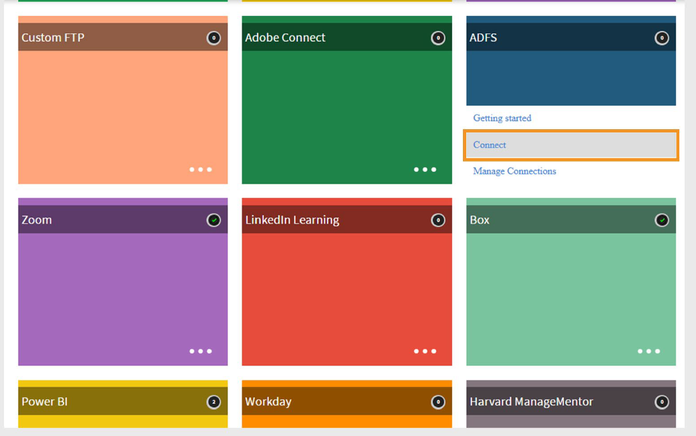
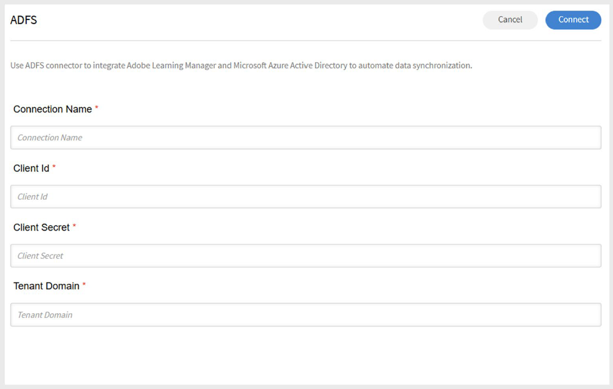

# ADFS-Verbindung in Adobe Learning Manager

## Einführung

Mit der ADFS-Verbindung in Adobe Learning Manager können Sie über ADFS (Active Directory Federation Services) in Microsoft Azure Active Directory integrieren. Diese Integration ermöglicht die automatische Synchronisierung von Benutzerdaten aus Azure AD in Learning Manager. Mit Funktionen wie Attributzuordnung, Benutzerdaten und geplanten Importen trägt die Verbindung zur Optimierung der Benutzerverwaltung bei und stellt sicher, dass die Teilnehmerdaten präzise und auf dem neuesten Stand sind. Dies ist besonders für Organisationen nützlich, die ADFS zur zentralisierten Identitäts- und Zugriffsverwaltung verwenden.

## Voraussetzungen

Bevor Sie die ADFS-Verbindung in Adobe Learning Manager konfigurieren, führen Sie im Azure-Portal die folgenden Schritte aus:

- Registrieren von Anwendungen
- Clientschlüssel generieren
- API-Berechtigungen festlegen

### Registrieren von Anwendungen in Azure

Registrieren einer Anwendung in Azure:

1. Melden Sie sich beim [Azure-Portal](https://portal.azure.com/) an.
2. Navigieren Sie zu **Azure Active Directory**.
3. Wählen Sie **Hinzufügen** und anschließend **App-Registrierung** aus.
4. Geben Sie einen Namen für die Anwendung ein, und wählen Sie **Register**.

### Clientschlüssel generieren

So erstellen Sie einen Clientschlüssel:

1. Wechseln Sie in der neu registrierten App zu **Zertifikate und Geheimnisse**.
2. Wählen Sie **Neuer Clientschlüssel**.
3. Fügen Sie eine Beschreibung hinzu und legen Sie den Ablauftermin auf **24 Monate** fest.
4. Speichern Sie den **geheimen Clientwert** an einem sicheren Speicherort.

### API-Berechtigungen festlegen

So fügen Sie die API-Berechtigung hinzu:

1. Wählen Sie **API-Berechtigungen** aus, und wählen Sie dann **Berechtigung hinzufügen** aus.
2. Wählen Sie **Microsoft Graf** und anschließend **Anwendungsberechtigungen** aus.
3. Suchen Sie nach den folgenden Berechtigungen und wählen Sie sie aus:

   - **Verzeichnis.Read.All** - Verzeichnisdaten lesen
   - **Benutzer.Read.All** - Vollständige Profile aller Benutzer lesen
4. Wählen Sie **Berechtigungen hinzufügen**.
5. **Administratorzustimmung** für die Berechtigungen erteilen.

## Konfigurieren der ADFS-Verbindung im Lern-Manager

Sie können die ADFS-Verbindung in Adobe Learning Manager so konfigurieren, dass Benutzerdaten aus ADFS importiert werden, Benutzerkenntnisse wieder in ADFS exportiert werden und automatisierte Synchronisationen geplant werden, um beide Systeme auf dem neuesten Stand zu halten.

ADFS-Verbindung konfigurieren:

1. Melden Sie sich bei Adobe Learning Manager als Integrationsadministrator an.
2. Bewegen Sie den Mauszeiger über die Kachel der **ADFS**-Verbindung.
3. Wählen Sie **Verbinden**.

   
   _Wählen Sie &quot;Verbinden&quot; aus, um die ADFS-Verbindung zu konfigurieren_

### Verbindungsdetails eingeben

Auf der ADFS-Konfigurationsseite:

1. Geben Sie die folgenden Details ein:

   - Name der Verbindung
   - Client-ID
   - Client-Geheimnis

   
   _Geben Sie die Konfigurationsdetails für die Verbindung mit ADFS ein_

2. Wählen Sie **Verbinden**.
3. Adobe Learning Manager ruft die **Mandanten-ID** und die **primäre Domäne** von Ihrem Azure-Portal ab und füllt sie automatisch aus.

## Importieren von Benutzern aus ADFS

### Attribute zuordnen

- Integrationsadministratoren können ADFS-Attribute den entsprechenden gruppierbaren Attributen in Adobe Learning Manager zuordnen.
- Diese Zuordnung ist eine einmalige Konfiguration und wird für alle nachfolgenden Benutzerimporte wiederverwendet.
- Sie können die Attributzuordnung jederzeit ändern, falls erforderlich.

### Automatischer Benutzerimport

- Adobe Learning Manager ruft Benutzerdaten automatisch in geplanten Intervallen aus ADFS ab.
- Dadurch werden Benutzerdatensätze systemübergreifend synchronisiert.

### Filtern von Benutzern

- Administratoren können Filter anwenden, um importierte Benutzer zu beschränken.
- Importieren Sie beispielsweise nur Benutzer unter bestimmten Managern oder Abteilungen.
