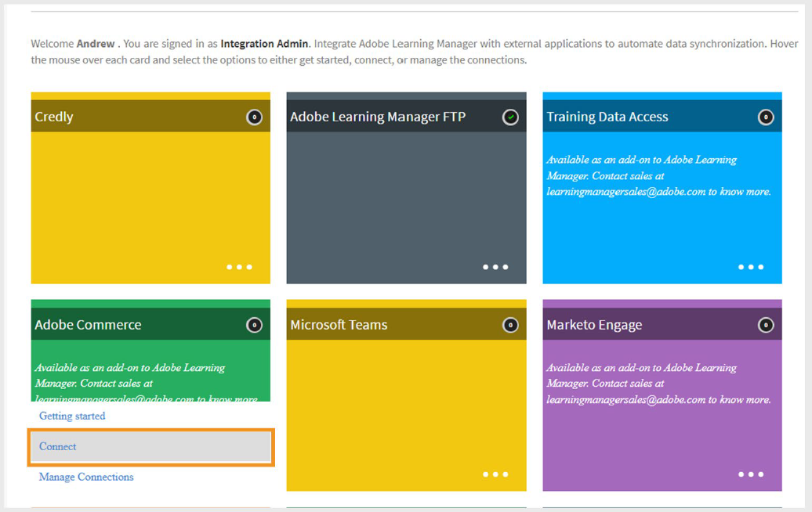
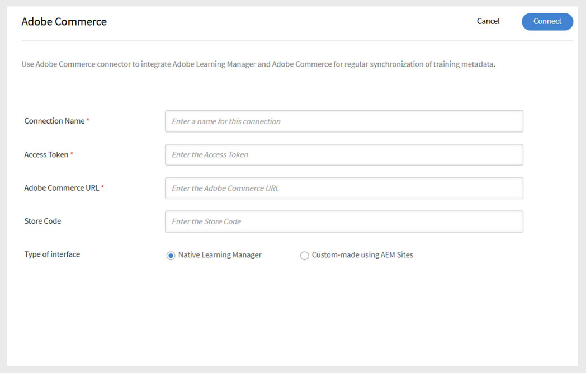
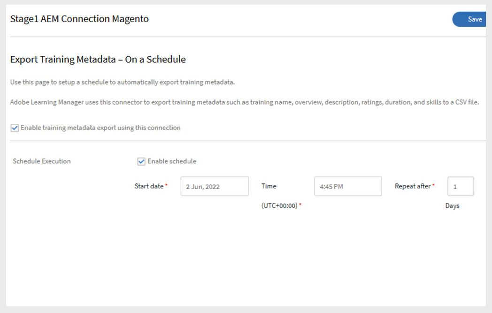
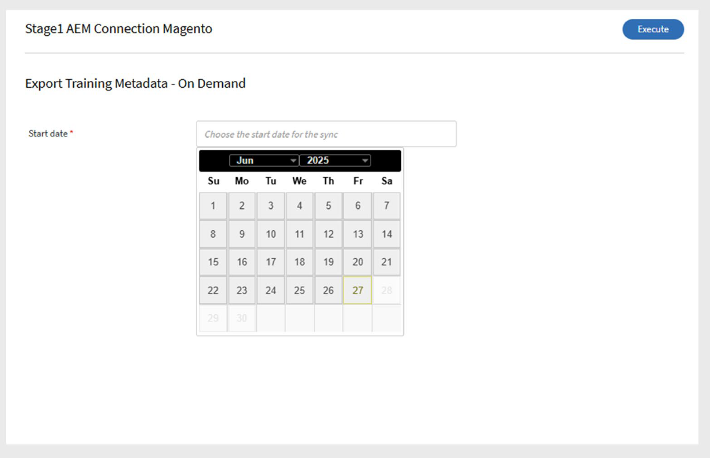

# Adobe Commerce-Verbindung in Adobe Learning Manager

## Adobe Commerce-Connector

>[!NOTE]
>
>Diese Funktion ist nur verfügbar, wenn Adobe Learning Manager als **Add-on** an Adobe Experience Manager verkauft wird. Die Verbindung kann auch für **Testkonten** aktiviert werden.

Adobe Learning Manager ist mit Adobe Commerce integriert, einer erweiterbaren und skalierbaren E-Commerce-Lösung, mit der ihr Multi-Channel-Commerce-Erlebnisse für B2B- und B2C-Kunden bereitstellen könnt. Nutzen Sie die Adobe Commerce-Verbindung, um Adobe Learning Manager mit Adobe Commerce zu verbinden und so kostenpflichtige Schulungs- und E-Commerce-Funktionen innerhalb Ihrer Lernplattform zu ermöglichen.

Wenn die Verbindung aktiviert ist, sendet der Lern-Manager Schulungsdaten an Adobe Commerce, damit Teilnehmer Kurse, Lernpfade oder Zertifizierungen erwerben können. Die Verbindung erfasst auch Kaufinformationen, um Transaktionen zu validieren und Teilnehmern Zugriff auf ihre Schulung zu gewähren.

## Voraussetzungen

Stellen Sie vor dem Einrichten der Adobe Commerce-Verbindung Folgendes sicher:

- Aktivieren Sie [RabbitMQ](https://experienceleague.adobe.com/de/docs/commerce-cloud-service/start/overview) oder einen anderen Messaging-Broker.
- Aktivieren Sie [CRON](https://experienceleague.adobe.com/de/docs/commerce-cloud-service/start/overview#cron_consumers_runner)-Aufträge.

Um diese zu aktivieren, bearbeiten Sie die folgenden Dateien:

- .magento.app.yaml
- .magento/services.yaml
- .magento.env.yaml

Weitere Einrichtungsanforderungen:

- Überschreiben Sie die Optionseinschränkung mit einem benutzerdefinierten Modul. Dieser Schritt ist optional, wird jedoch für große Datensätze empfohlen.
- Aktivieren Sie alle **asynchronen APIs**. Große Schulungsdatensätze werden asynchron exportiert. Wenn Learning Manager Adobe Commerce APIs aufruft, werden Anfragen von einem Verbraucher, der Produkte auf der Commerce-Seite erstellt, in die Warteschlange gestellt und verarbeitet. Die asynchrone Verarbeitung muss aktiviert sein, da sie in Adobe Commerce nicht standardmäßig verfügbar ist.
- Fügen Sie einen **Rückgabelink** zum Learning Manager auf der Seite &quot;Zahlungserfolg&quot; in Adobe Commerce hinzu.
  - Verwenden Sie diese [Rückgabe-URL](https://learningmanager.adobe.com/app/learner#/postPayment):
- Ändern Sie **Indizierung** von **Beim Speichern** in **Geplant**. Weitere Informationen finden Sie in der [Wissensdatenbank](https://experienceleague.adobe.com/de/support?support-tab=home#home).
- Wenden Sie die erforderlichen **Patches** an. Anweisungen finden Sie in [Dokumentation zu Patches anwenden](https://experienceleague.adobe.com/de/docs/commerce-cloud-service/start/overview).
- Konfigurieren Sie **Fastly** für Adobe Commerce in der Cloud-Infrastruktur (Staging und Produktion). Weitere Informationen finden Sie unter [Fastly einrichten](https://devdocs.magento.com/cloud/cdn/configure-fastly.html).

## Konfigurieren des Connectors

Adobe Commerce-Verbindung konfigurieren:

1. Melden Sie sich bei Adobe Learning Manager als Integrationsadministrator an.
2. Bewegen Sie den Mauszeiger über die Kachel der **Adobe Commerce**-Verbindung und wählen Sie **Verbinden** aus.

   
   _Wählen Sie &quot;Verbinden&quot; aus, um die Adobe Commerce-Verbindung zu konfigurieren_

3. Geben Sie die folgenden Details ein:

   - Name der Verbindung
   - Zugriffstoken
   - ADOBE COMMERCE URL
   - Store-Code
4. Wählen Sie einen der folgenden Schnittstellentypen aus:

   - Nativer Learning Manager
   - Individuelle Gestaltung mit AEM Sites

   
   _Geben Sie die erforderlichen Details für die Adobe Commerce-Konfiguration ein_

5. Wählen Sie **Verbinden**.

## Festlegen der Preise für Schulungen

Sobald die Verbindung aktiviert ist:

- Autoren können Preise für Kurse, Lernpfade oder Zertifizierungen festlegen.
- Nach der Veröffentlichung können die Teilnehmer Schulungen über Adobe Learning Manager oder eine benutzerdefinierte AEM erwerben.

## Einkaufsablauf

### Natives Adobe Learning Manager

- Teilnehmer melden sich bei Adobe Learning Manager an, um einen Kurs, einen Lernpfad oder ein Zertifikat zu kaufen.
- Wenn Teilnehmer auf Jetzt kaufen klicken, werden sie zu Adobe Commerce weitergeleitet, um die Zahlung abzuschließen.
- Nach der Zahlung werden die Teilnehmer aufgefordert, zur Adobe Learning Manager zurückzukehren, um die Schulung zu starten.
- Die Teilnehmer müssen sich separat bei Adobe Commerce anmelden, um den Kauf abzuschließen.
- Teilnehmer erhalten Kaufbestätigungs-E-Mails von Learning Manager und Adobe Commerce. Adobe Commerce-E-Mails können bei Bedarf aktiviert oder deaktiviert werden.

### Benutzerdefiniertes AEM Sites

Bei Verwendung benutzerdefinierter AEM:

- Teilnehmer können auf der AEM-Website nach Kursen suchen und diese kaufen.
- Die AEM-Website verwendet von Adobe Learning Manager synchronisierte Metadaten für die Suche und Anzeige.
- Sowohl angemeldete als auch Gastbenutzer können durchsuchen. Sie können jedoch nur von angemeldeten Benutzern erworben werden.
- Nach der Anmeldung können Teilnehmer Kurse zu ihrem Warenkorb hinzufügen, Details in der Vorschau anzeigen und den Kauf abschließen.

## Exportieren des Kurses nach Adobe Commerce

### Export planen

So planen Sie den Export:

1. Wählen Sie **Schulungsmetadaten exportieren** aus, und wählen Sie dann **Zeitplan konfigurieren**.
2. Wählen Sie **Exportieren von Schulungsmetadaten über diese Verbindung aktivieren**.
3. Wählen Sie **Zeitplan aktivieren** und legen Sie das **Startdatum**, **Zeit** und **Intervall** fest.

   
   _Geplanten Export aktivieren_

4. Wählen Sie **Speichern**.

### On Demand-Export

Nachdem die Autoren die Preise für die Schulung festgelegt haben, muss der Integrationsadministrator die Schulungsdaten exportieren:

1. Wählen Sie **Schulungsmetadaten exportieren** und anschließend **On Demand** aus.
2. Wählen Sie den Datumsbereich aus.
3. Wählen Sie **Ausführen** zum Exportieren aus.

   
   _On-Demand-Export erstellen_

4. Nach erfolgreichem Abschluss werden preisgünstige Kurse und Lernpfade zum Kauf in Adobe Commerce verschoben.
