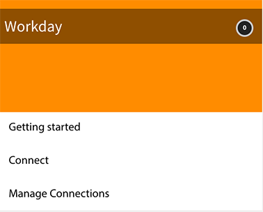
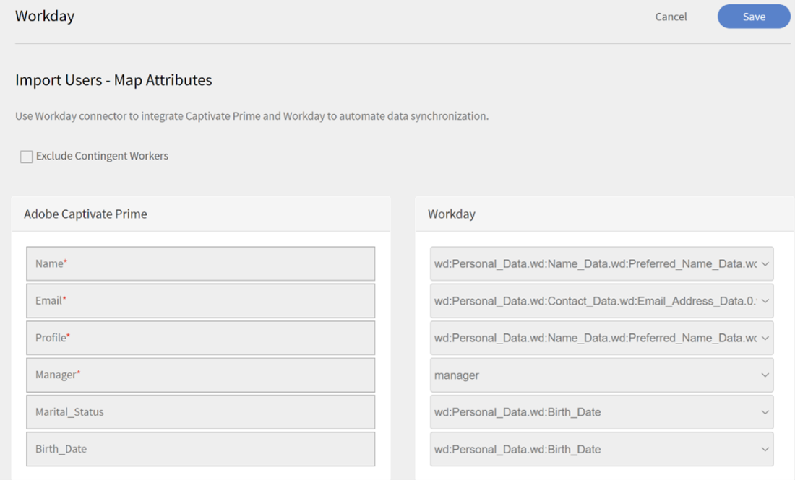
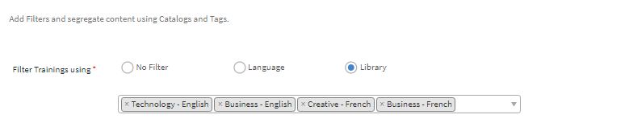
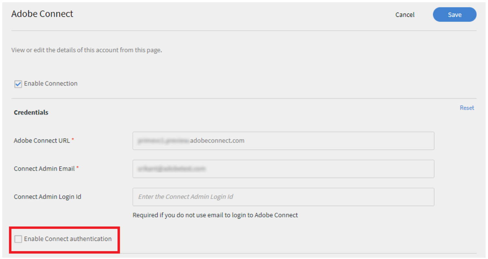
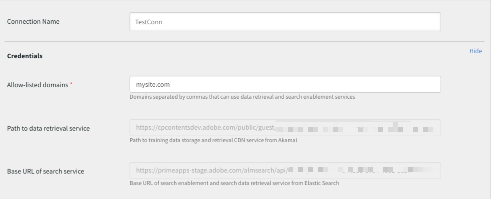

# Learning Manager-Connectors

Unternehmen verfügen über andere Anwendungen und Systeme, die in Learning Manager integriert werden müssen. Connectors sind Dienstprogramme, die die Durchführung datenbasierter Integrationen unterstützen, z. B. das Importieren von Daten in Learning Manager aus externen Systemen.  Es führt auch den Export von Daten in externe Systeme aus Learning Manager durch.

Learning Manager stellt Connectors für Salesforce und FTP bereit. Über den Salesforce-Connector können für die Integration zuständige Administratoren eines Unternehmens ihre Salesforce-Anwendung mit dem Learning Manager integrieren. Als Verantwortlicher für die Integration können Sie außerdem mithilfe des FTP-Connectors Gruppen von Benutzern automatisch in Ihre Unternehmensanwendung importieren.

Learning Manager stellt auch die Lynda-, getAbstract- und Harvard Management System-Connectors bereit. Mit diesen Connectors können Teilnehmer auf Kurse von Lynda.com, getAbstract und Harvard ManageMentor zugreifen und diese absolvieren.

Lesen Sie weiter, um zu erfahren, wie Sie diese Connectors in Learning Manager konfigurieren und verwenden.

<!--
>[!NOTE]
>
>**Update:** December 2020 update of Learning Manager
>
>For **FTP**, **Box**, and **Custom FTP** connectors, while exporting Learner Transcript or xAPI, you can also export the data as a **zip** file, for:
>
>* Learner Transcripts
>* xAPI
-->

>[!NOTE]
>
>Mit der Version November 2022 von Adobe Learning Manager hat Zoom die [JWT-Authentifizierung bis Juni 2023](https://marketplace.zoom.us/docs/guides/auth/jwt/). Dementsprechend funktioniert der Zoom-Connector mit JWT weiterhin bis zum genannten Datum, aber wir empfehlen Benutzern, eine Server-zu-Server-OAuth-App zu erstellen, um die Funktionalität in ihrem Konto zu ersetzen. Für jede neue Verbindung wird standardmäßig die Zoom OAuth-Authentifizierung verwendet.

## Salesforce-Connector {#sfconnector}

Der Salesforce-Connector verbindet Learning Manager- und Salesforce-Konten, um die Datensynchronisierung zu automatisieren. Im Salesforce-Connector stehen die folgenden Funktionen zur Verfügung:

### Attribute zuordnen

Der für die Integration zuständige Administrator kann Spalten in Salesforce wählen und den entsprechenden für Gruppen geeigneten Attributen des Learning Managers zuordnen. Sobald die Zuordnung abgeschlossen ist, wird dieselbe Zuordnung auch für spätere Benutzerimporte verwendet. Wenn der Administrator eine andere Zuordnung zum Importieren von Benutzern benötigt, kann diese neu konfiguriert werden.

### Automatischer Benutzerimport

Beim Importieren von Benutzern hat der Learning Manager-Administrator die Möglichkeit, Mitarbeiterdaten aus Salesforce abzurufen und automatisch in Learning Manager zu importieren. Durch diese Automatisierung entfällt der manuelle Aufwand beim Erstellen und Hochladen von CSV-Dateien in Learning Manager.

### Automatische Zeitplanung

Die automatische Zeitplanung kann zusammen mit dem automatischen Benutzerimport sehr effizient sein. Der Lern-Manager-Administrator kann einen Zeitplan entsprechend den Anforderungen des Unternehmens einrichten. Benutzer in der Learning Manager-Anwendung können gemäß dem Zeitplan auf dem neuesten Stand gehalten werden. Die Synchronisierung kann täglich in der Learning Manager-Anwendung durchgeführt werden.

### Filtern von Benutzern

Der Lern-Manager-Administrator kann die Benutzer vor dem Import filtern. Beispielsweise kann der Lern-Manager-Administrator alle Benutzer in der Hierarchie unter einem oder mehreren bestimmten Managern importieren.

### Salesforce-Connector konfigurieren {#configuresalesforceconnector}

Um Salesforce mit Learning Manager zu integrieren, informieren Sie sich über die entsprechende Vorgehensweise.

#### Voraussetzungen {#prerequisites}

Stellen Sie sicher, dass Sie Ihre Salesforce-Unternehmens-URL zur Hand haben. Wenn der Name Ihrer Organisation beispielsweise **Myorg** klicken, könnte die Salesforce-URL `https://myorg.salesforce.com`. Dies ist die einzige Eingabe, die erforderlich ist, um das Salesforce-Konto mit dem Learning Manager zu verbinden.

Stellen Sie außerdem sicher, dass Sie über die entsprechenden Anmeldedaten verfügen, um sich bei dem Konto anzumelden.

#### Erstellen einer Verbindung {#createaconnection}

1. Bewegen Sie die Maus auf der Startseite des Learning Manager über die Salesforce-Karte/Miniaturansicht. Ein Menü wird angezeigt. Klicken **[!UICONTROL Vernetzen]** im Menü.

   

   *Connect-Option*

1. Ein Dialogfeld wird angezeigt, in dem Sie zur Eingabe der Unternehmens-URL aufgefordert werden. Klicken **[!UICONTROL Vernetzen]** nach Angabe der URL.
1. Nach erfolgreicher Verbindung wird die Übersichtsseite angezeigt.

### Attribute zuordnen {#mapattributes}

Sobald die Verbindung erfolgreich hergestellt wurde, können Sie Salesforce-Spalten zu den entsprechenden Attributen von Learning Manager zuordnen. Dieser Schritt ist obligatorisch.

1. Auf der Zuordnungsseite werden links die Spalten des Learning Managers und rechts die Spalten von Salesforce angezeigt. Wählen Sie den entsprechenden Spaltennamen aus, der dem Spaltennamen des Lern-Managers zugeordnet ist.

   
   *Attribute zuordnen*

   >[!NOTE]
   >
   >Die Spaltendaten des Learning Managers, die auf der linken Seite angezeigt werden, werden von den aktiven Feldern abgerufen. Die **Betriebsleiter** muss dem Feld mit der E-Mail-Adresse zugeordnet werden. Alle Spalten müssen zugeordnet werden, bevor der Connector verwendet werden kann.

1. Klicken **[!UICONTROL Speichern]** nach Abschluss der Zuordnung.
1. Der Connector ist jetzt einsatzbereit. Das Konto, das konfiguriert wurde und als Datenquelle in der Administrator-App angezeigt wird. Der Administrator kann den Import oder die On-Demand-Synchronisierung planen.

## Verwenden des Salesforce-Connector {#usingsalesforceconnector}

Der Salesforce-Connector stellt eine Verbindung zu Salesforce.com her, um die Benutzer als konfiguriert abzurufen und sie dem Learning Manager hinzuzufügen.

### Importieren von Benutzern aus Salesforce-Kontakten {#import-salesforce-contacts}

Learning Manager verbessert den Salesforce-Connector, sodass sowohl Kontakte als auch Salesforce-Benutzer abgerufen und automatisch in Learning Manager importiert werden.

Geben Sie auf der Salesforce-Connector-Seite die Salesforce-URL ein und schließen Sie die Authentifizierung ab. Sobald Sie sich authentifiziert haben, können Sie mit dem Importieren von Benutzern oder Kontakten fortfahren. Wenn Sie die Option Kontakte auswählen, geben Sie die Teilmenge der zu importierenden Kontakte an.

Wählen Sie die Salesforce-Spalten aus und ordnen Sie sie den entsprechenden gruppierbaren Attributen des Lern-Managers zu. Sobald die Zuordnung abgeschlossen ist, wird dieselbe Zuordnung auch für spätere Benutzerimporte verwendet.

1. Melden Sie sich bei Salesforce an.
1. Klicken Sie auf der Verbindungsseite auf **[!UICONTROL Importinterne Benutzer]**.

   
   *Interne Benutzer importieren*

1. Im Fenster &quot; **Benutzer importieren** Seite gibt es eine neue Option, Kontakte. Klicken Sie auf das Optionsfeld **Kontakte** angezeigt und Sie sehen die folgenden Optionen.

   
   *Zuordnen der Kontaktattribute*

1. Wenn Sie auf **[!UICONTROL Ja]** können Sie Folgendes ausführen:

   * **Spalte &quot;Kontakte&quot; auswählen:** Wählen Sie das Feld aus, das Sie in den Lern-Manager importieren möchten.
   * **Werte angeben:** Wählen Sie die Werte aus, die das ausgewählte Feld darstellen.

   
   *Werte angeben*

   * Ordnen Sie die Salesforce-Spalten denen des Learning Managers zu.
   * Um den Import zu starten, klicken Sie auf **[!UICONTROL Speichern]**.

1. Wenn Sie auf **[!UICONTROL Nein. Alle Kontakte importieren]** können Sie die Felder direkt zuordnen, ohne die Kontakte zu filtern. Hier importieren Sie alle Kontakte aus Salesforce.
1. Um den Import zu starten, klicken Sie auf **[!UICONTROL Speichern]**.

## Lerndatensätze exportieren

Learning Manager bietet die Möglichkeit, Lerndatensätze (z. B. Transkript, Benutzerbericht und Kenntnisbericht) nach Salesforce zu exportieren. Sie können festlegen, ob die exportierten Daten mit der Tabelle &quot;Benutzer&quot; oder der Tabelle &quot;Kontakte&quot; in Salesforce verknüpft werden sollen.

*Exportieren von Lerndatensätzen*

### Benutzerdefinierte Objekte in Salesforce

Bevor Sie Lerndatensätze aus dem Lern-Manager exportieren, müssen Sie benutzerdefinierte Objekte in Salesforce erstellen. Benutzerdefinierte Objekte sind Objekte, die Sie zum Speichern von unternehmensspezifischen oder branchenspezifischen Informationen erstellen. Weitere Informationen finden Sie unter [Benutzerdefinierte Salesforce-Objekte](https://trailhead.salesforce.com/en/content/learn/modules/data_modeling/objects_intro).

So erstellen Sie die Objekte:

1. Laden Sie die Pakete herunter und installieren Sie sie, um die benutzerdefinierten Objekte zu erstellen.

   * [Paket 1](https://test.salesforce.com/packaging/installPackage.apexp?p0=04t1k0000008WPJ)
   * [Paket 2](https://test.salesforce.com/packaging/installPackage.apexp?p0=04t1k0000008WPT)
   * [Paket 3](https://test.salesforce.com/packaging/installPackage.apexp?p0=04t1k0000008WPi)

1. Benennen Sie die benutzerdefinierten Objekte in Salesforce um.
1. Wählen Sie die Veranstaltungen aus und klicken Sie auf **[!UICONTROL Speichern]**.

**Veranstaltungen verknüpfen mit:** Wählen Sie den zu exportierenden Abschnitt aus (Benutzer oder Kontakt). Wenn Sie das Kontaktobjekt auswählen, werden Benutzer, die im Lern-Manager, aber nicht in Salesforce vorhanden sind, in Salesforce erstellt.

*Option &quot;Veranstaltungen verknüpfen&quot;*

>[!NOTE]
>
>Sie können mehrere Verbindungen in einem Konto erstellen. Eine einzelne Verbindung kann bis zu drei benutzerdefinierte Objekte in Salesforce bereitstellen. Wenn Sie mehrere Verbindungen für dasselbe Salesforce-Konto erstellen möchten, müssen Sie die drei Pakete installieren. Wir unterstützen bis zu drei Pakete.
>
>Wenn Sie so viele Verbindungen erstellen möchten, müssen Sie so viele Pakete installieren.

>[!NOTE]
>
>Auf der Seite &quot;Ausführungsstatus&quot; für Salesforce kann die Anzahl der verarbeiteten Datensätze nur über Salesforce überprüft werden. Learning Manager zeigt den Status als abgeschlossen an, auch wenn ein teilweiser Export oder ein Fehler in allen Datensätzen vorliegt, die verarbeitet wurden.

## Installieren des Salesforce-Pakets

Learning Manager bietet ein Salesforce-App-Paket. Nach der Installation und Konfiguration in SFDC können Vertriebsmitarbeiter ihre Schulungsaktivitäten im SFDC-Portal durchführen. Mit dieser App können SFDC-Benutzer neue Schulungen durchsuchen, Empfehlungen anzeigen und diese direkt im SFDC-Portal nutzen. Benutzer erhalten auch die Ankündigungen, die von Administratoren in Form von Mastertiteln direkt in der App im SFDC-Portal gesendet werden.

### Einrichten in der Learning Manager-App

1. Melden Sie sich bei Ihrem Learning Manager-Administratorkonto als Integrationsadministrator an.
1. Klicken **[!UICONTROL Anwendungen]** > **[!UICONTROL Highlights]**.
1. Klicken **[!UICONTROL Salesforce]**.
1. Beachten Sie auf der Salesforce-App-Seite die Anwendungs-ID (auch als Client-ID bezeichnet) und das in der Beschreibung erwähnte Client-Secret.
1. Klicken **[!UICONTROL Genehmigen]** und Ihre App muss erfolgreich genehmigt werden.
1. Klicken **[!UICONTROL Ressourcen für Entwickler]** > **[!UICONTROL Zugriffstoken für Tests und Entwicklung]**.
1. Im Abschnitt &quot;Abrufen des OAuth-Codes&quot; müssen die Client-ID und der Umfang auf &quot;admin:read,admin:write&quot; festgelegt werden. Klicken **[!UICONTROL Senden]**.
1. Geben Sie in &quot;Aktualisierungstoken abrufen&quot; die Client-ID und das Client-Secret ein. Klicken **[!UICONTROL Senden]** und notieren Sie das Aktualisierungstoken.

### Konto in der Salesforce-App erstellen

1. Erstellen Sie ein Konto auf der Salesforce-Anmeldeseite. Sie müssen ein Salesforce-Konto in der Entwickler- oder Unternehmensversion erstellen.  [Entwickler-Anmelde-URL](https://developer.salesforce.com/signup). Stellen Sie sicher, dass Sie für die Anmeldung bei Salesforce die E-Mail-ID verwenden, die Sie für Learning Manager verwendet haben.
1. Bestätigen Sie Ihr Konto über die Bestätigungs-E-Mail.
1. Erstellen Sie ein Kennwort und melden Sie sich bei Salesforce an.
1. Notieren Sie sich die Salesforce-URL nach der Anmeldung (z. B. site.lightning.force.com).

### Installieren des Lern-Manager-Pakets

Wenn Sie das Paket installieren möchten, müssen Sie zuerst das vorhandene Paket in Salesforce löschen. Vor der Deinstallation müssen Sie die Einstellungen aktivieren, wie unten gezeigt. Das Anwenden dieser Einstellungen ist obligatorisch, da Sie das Paket sonst nicht installieren können.

>[!NOTE]
>
>Die Adobe Learning Manager-App wird nur in der Salesforce-Lightning-Ansicht unterstützt.

1. Starten Sie die [Lern-Manager-Paket-URL](https://login.salesforce.com/packaging/installPackage.apexp?p0=04t1k0000008WOQ).
1. Im Dialogfeld &quot; **Anmelden** klicken Sie auf **[!UICONTROL Benutzerdefinierte Domäne verwenden]**.
1. Geben Sie die Paket-URL ein und klicken Sie auf **[!UICONTROL Weiter]**. Auf der Installationsseite muss die Option Nur für Administratoren installieren ausgewählt sein. Ändern Sie diese Option nicht.
1. Klicken **[!UICONTROL Installieren]**. Nachdem das Paket installiert wurde, klicken Sie auf **[!UICONTROL Fertig]**. Sie werden zur Seite &quot;Installierte Pakete&quot; geleitet, auf der das installierte Adobe Learning Manager-Paket angezeigt wird.
1. Navigieren Sie zum App Launcher (neben &quot;Einrichtung&quot;) und suchen Sie nach Adobe Learning Manager.
1. Um die App zu konfigurieren, klicken Sie auf **[!UICONTROL Konfigurieren]**.
1. Klicken **[!UICONTROL Neu]** und fügen Sie die folgenden Details hinzu:

   * **Konfiguration:** Geben Sie den gewünschten Namen ein.
   * **ClientID**: Geben Sie den Wert aus dem ersten Abschnitt ein.
   * **ClientSecret:** Geben Sie den Wert aus dem ersten Abschnitt ein.
   * **Token aktualisieren:** Geben Sie den Wert aus dem ersten Abschnitt ein.
   * **LearningManagerBaseURL:** Die URL der Site, auf der der Learning Manager gehostet wird.

### Remotesite-Einstellungen hinzufügen

1. Klicken Sie oben rechts auf der Seite auf **[!UICONTROL Einrichten]**.
1. In **[!UICONTROL Schnellsuche]** nach Remotesite-Einstellungen.
1. Klicken **[!UICONTROL Neue Remotesite]**.
1. Geben Sie die Details ein:

   * **Remotesite-Name:** Geben Sie den gewünschten Namen ein.
   * **Remotesite-URL:** Die URL der Site, auf der der Learning Manager gehostet wird.

1. Starten Sie den Lernmanager.

### Benachrichtigungen für die Learning Manager-App aktivieren

1. Klicken Sie in der oberen rechten Ecke auf **[!UICONTROL Einrichten]**.
1. Suchen Sie nach &quot;Benutzerdefinierte Benachrichtigungen&quot;.
1. Klicken **[!UICONTROL Neu]**.
1. Geben Sie die folgenden Details ein:

   1. **Name der benutzerdefinierten Benachrichtigung:** LearningManagerNotification
   1. **API-Name:** LearningManagerNotification

1. Beide auswählen **Desktop** und **Mobil** als unterstützte Kanäle aus.

1. Klicken **[!UICONTROL Speichern]**.
1. Führen Sie die folgenden Schritte aus, um Push-Benachrichtigungen für mobile Geräte zu aktivieren:

   1. Installieren Sie die Salesforce-App für Mobilgeräte auf Ihrem Mobiltelefon.
   1. Melden Sie sich mit Ihren Anmeldeinformationen bei der App an.
   1. Wechseln zu **Einrichten** > **Einstellungen für die Benachrichtigungszustellung**.
   1. Salesforce für iOS und Android hinzufügen

### Deinstallieren von Learning Manager aus Salesforce

1. Navigieren Sie in der Salesforce-App zu &quot;Installierte Pakete&quot;.
1. Klicken **[!UICONTROL Deinstallieren]**.

## Learning Manager für Salesforce-Benutzer konfigurieren

Die Learning Manager-App steht auch Benutzern zur Verfügung, die in einem beliebigen Salesforce-Konto vorhanden sind. Der Salesforce-Administrator kann Benutzer basierend auf den Profilen hinzufügen. Die Salesforce-Profile ähneln denen im Learning Manager. Beispiel: Administrator, Integrationsadministrator, Kursleiter usw. Der Salesforce-Administrator kann auch ein benutzerdefiniertes Profil erstellen.

Als Salesforce-Administrator können Sie die Profile entweder Benutzern zuweisen oder ein benutzerdefiniertes Profil erstellen.

Bei der Installation des Pakets können Sie den Teilnehmern das Salesforce-Profil zuweisen.

Nach der Installation des Pakets müssen Sie das Profil konfigurieren.

Klicken **[!UICONTROL Konfigurieren]** > **[!UICONTROL Neu]** und fügen Sie dann Folgendes hinzu:

* Konfigurationsname
* ClientID
* ClientSecret
* LearningManagerBaseURL
* Umleitung deaktivieren

>[!NOTE]
>
>Damit Teilnehmer die Learning Manager-App anzeigen können, müssen Sie die App für alle Teilnehmer aktivieren.

Der nächste Schritt besteht darin, die Berechtigung für den Zugriff auf die Learning Manager-App bereitzustellen.

*Festlegen von Berechtigungen für den Zugriff auf die Learning Manager-App*

Wählen Sie die Benutzer aus und weisen Sie die Berechtigungen entsprechend zu. Die Teilnehmer können jetzt auf die Learning Manager-App zugreifen.

Wählen Sie nun ein Profil aus, z. B. Standardprofil eines Benutzers, und klicken Sie auf das Profil. Klicken **[!UICONTROL Bearbeiten]** und in der &quot; **Benutzerdefinierte App-Einstellungen** das Kontrollkästchen **Adobe Learning Manager**. Dadurch wird die App für den Benutzer zugänglich.

Im Dialogfeld &quot; **Benutzerdefinierte Registerkarteneinstellungen** &quot; im Dialogfeld &quot; **Startseite für Teilnehmer** die Option **Standard Ein**.

Sie müssen die App für alle Profile sichtbar machen.

Klicken **[!UICONTROL Speichern]** und die Teilnehmer, die zu allen Profilen gehören, greifen auf die Learning Manager-App zu.

### Änderungen zu Lernpfaden

#### Bestehende Verbindungen

Wenn die Option &quot;Lernpfad&quot; im Administratorkonto deaktiviert ist, werden im Bericht keine Zeilen und Spalten hinzugefügt.

Wenn die Option &quot;Lernpfad&quot; im Admin-Konto aktiviert ist, wird die Spalte &quot;Typ&quot; mit &quot;Lernpfad&quot; ausgefüllt, falls Teilnehmer dafür registriert sind.

>[!NOTE]
>
>Wenn das Flag aktiviert ist und Sie eine vorhandene Verbindung verwenden, fehlen möglicherweise einige Datensätze.

#### Neue Verbindungen

Wenn die Option &quot;Lernpfad&quot; im Administratorkonto deaktiviert ist, besteht der Schulungsbericht aus den folgenden Spalten, enthält jedoch keine Daten.

* **Eingebetteter Pfad** Zeigt den Namen des Lernprogramms an.
* **ID des eingebetteten Pfads:** Zeigt die IDs für das Lernprogramm an.
* **ID des eingebetteten Kurses:** Zeigt die IDs von Kursen an, die sich in einem Lernpfad befinden.

Bei neuen Verbindungen in Konten, bei denen der Lernpfad aktiviert ist, werden außerdem die drei neuen Spalten angezeigt und alle Daten fließen.

Darüber hinaus enthält der Bericht den Spaltentyp &quot;Lernpfad (höhere Ebene)&quot; für alle Teilnehmer, die bei einem Lernpfad registriert sind.

In der Spalte &quot;Typ&quot; wird das Lernprogramm in Lernpfad umbenannt. Bei vorhandenen Verbindungen gibt es keine Änderungen.

## FTP-Connector für Learning Manager {#ftpconnector}

Mithilfe des FTP-Connectors können Sie Learning Manager mit beliebigen externen Systemen integrieren, um Datensynchronisierung zu automatisieren. Es wird erwartet, dass externe Systeme Daten in einem CSV-Format exportieren können und sie in den entsprechenden Ordner des Learning Manager FTP-Kontos zu platzieren. Im FTP-Connector stehen die folgenden Funktionen zur Verfügung:

Sie können den Box-Connector auch für die Datenmigration, den Benutzerimport und den Datenexport verwenden. Weitere Informationen finden Sie unter Box-Connector.

### Datenimport {#dataimport}

Beim Importieren von Benutzern hat der Learning Manager-Administrator die Möglichkeit, Mitarbeiterdaten vom Learning Manager FTP-Dienst abzurufen und automatisch in den Learning Manager zu importieren. Mit dieser Funktion können Sie mehrere Systeme integrieren, indem Sie die CSV, die durch diese Systeme generiert wurden, in die entsprechenden Ordner der FTP-Konten platzieren. Learning Manager übernimmt die CSV-Dateien, führt sie zusammen und importiert die Daten gemäß dem Zeitplan. Weitere Informationen finden Sie unter &quot;Planung&quot;.

**Attribute zuordnen**

Der für die Integration zuständige Administrator kann Spalten in der CSV-Datei auswählen und den für Gruppen geeigneten Attributen des Learning Managers zuordnen. Diese Zuordnung ist eine einmalige Maßnahme. Nachdem diese Zuordnung vorgenommen wurde, wird dieselbe Zuordnung auch für spätere Benutzerimporte verwendet. Die Zuordnung kann neu konfiguriert werden, wenn der Administrator eine andere Zuordnung zum Importieren von Benutzern benötigt.

#### Daten exportieren {#exportdata}

Mit dem Datenexport können Benutzer Benutzerkenntnisse und Teilnehmertranskripte auf einen FTP exportieren, um diese auf einem beliebigen System von Drittanbietern zu integrieren.

#### Planung {#scheduling}

Der Administrator kann Planungsaufgaben einrichten, wie sie für das Unternehmen gewünscht werden, und die Benutzer in der Learning Manager-Anwendung sind entsprechend dem Zeitplan auf dem neuesten Stand. In ähnlicher Weise kann der Integrations-Admin den Export von Kenntnissen zur rechten Zeit planen, um diese in ein externes System zu integrieren. Die Synchronisierung kann täglich in der Learning Manager-Anwendung durchgeführt werden.

### Konfigurieren des FTP-Connectors für Learning Manager {#configurecaptivateprimeftpconnector}

Um FTP Connector mit Learning Manager zu integrieren, informieren Sie sich über die entsprechende Vorgehensweise.

#### Erstellen einer Verbindung {#Createaconnection-1}

1. Bewegen Sie die Maus auf der Startseite des Learning Manager über die FTP-Karte/Miniaturansicht. Ein Menü wird angezeigt. Klicken **[!UICONTROL Vernetzen]** im Menü.

   

   *Connect-Option*

1. Ein Dialogfeld wird angezeigt, in dem Sie zur Eingabe der E-Mail-ID aufgefordert werden. Geben Sie die E-Mail-Adresse der Person an, die für das Verwalten des Learning Manager-FTP-Kontos für das Unternehmen verantwortlich ist. Klicken **[!UICONTROL Vernetzen]** nach Angabe der E-Mail-ID.
1. Learning Manager sendet Ihnen eine E-Mail, in der Sie aufgefordert werden, das Kennwort zurückzusetzen, bevor Sie zum ersten Mal auf den FTP zugreifen können. Der Benutzer muss das Kennwort zurücksetzen und dieses für den Zugriff auf das Learning Manager-FTP-Konto verwenden.

   >[!NOTE]
   >
   >Nur ein Learning Manager-FTP-Konto kann für ein bestimmtes Learning Manager-Konto erstellt werden.

   Auf der Übersichtsseite können Sie den Verbindungsnamen für Ihre Integration angeben. Wählen Sie aus, welche Aktion Sie aus den folgenden Optionen ausführen möchten:

   * Importinterne Benutzer
   * xAPI importieren
   * Benutzerkenntnisse exportieren - Konfigurieren Sie einen Zeitplan
   * Benutzerkenntnisse exportieren - OnDemand
   * Teilnehmertranskripte exportieren - Konfigurieren Sie einen Zeitplan
   * Teilnehmertranskripte exportieren - On Demand

   
   *Exportoptionen*

### Importieren

+++Interner Benutzer

Mit der Option zum Importieren interner Benutzer können Sie die Benutzer bei Bedarf oder nach Planung aus einer CSV-Datei in einen Learning Manager importieren.

+++

+++Attribute zuordnen

Sobald die Verbindung erfolgreich hergestellt wurde, können Sie die Spalten der CSV-Dateien zuordnen. Es wird im FTP-Ordner den entsprechenden Attributen von Learning Manager hinzugefügt. Dieser Schritt ist obligatorisch.

1. Auf der Seite &quot;Attributzuordnung&quot; werden links die erwarteten Spalten des Learning Manager und rechts die Namen der Spalten in der CSV-Datei angezeigt. Auf der rechten Seite wird zunächst ein leeres Auswahlfeld angezeigt. Importieren Sie eine beliebige Vorlagen-CSV, indem Sie auf **Datei auswählen**.
1. Durch den oben beschriebenen Schritt werden alle Spaltennamen aus der CSV-Datei in die Dropdown-Auswahlliste auf der rechten Seite übernommen. Wählen Sie den entsprechenden Spaltennamen aus, der dem Spaltennamen des Lern-Managers zugeordnet ist.

   >[!NOTE]
   >
   >Das Feld &quot;Manager&quot; muss dem Feld mit der E-Mail-Adresse zugeordnet werden. Alle Spalten müssen zugeordnet werden, bevor der Connector verwendet werden kann.

1. Klicken **[!UICONTROL Speichern]** nach Abschluss der Zuordnung.

   Der Connector ist jetzt einsatzbereit. Das konfigurierte Konto wird als Datenquelle innerhalb der Administrator-App angezeigt, sodass der Administrator den Import planen oder die Synchronisierung nach Bedarf starten kann.

+++

+++Verwenden des FTP-Connectors für Learning Manager

1. Die CSV-Dateien aus externen Systemen müssen unter folgendem Pfad abgelegt werden:

   `code $OPERATION$/$OBJECT_TYPE$/$SUB_OBJECT_TYPE$/data.csv`

   >[!NOTE]
   >
   >In der Version vom Juli 2016 ist nur das Importieren von Benutzern zulässig. Um den FTP-Connector daher verwenden zu können, müssen Sie sicherstellen, dass die CSV-Dateien in den folgenden Ordner platziert werden:

   `code Home/import/user/internal/*.csv`

1. Der FTP-Connector übernimmt alle Zeilen aus CSV-Dateien. Es ist wichtig, dass die Zeile, die einem Benutzer in einer CSV entspricht, in keiner anderen CSV erscheint.
1. Alle CSV müssen die in der Zuordnung angegebenen Spalten enthalten.
1. Alle erforderlichen CSV müssen sich in dem Ordner befinden, bevor der Vorgang beginnt.

>[!NOTE]
>
>Beim Importieren von Benutzern in den Lern-Manager muss der Administrator auch wissen, wie Benutzer im Lern-Manager verwaltet werden. Siehe [User Management-Hilfe](migration-manual.md#usermanagement) , um weitere Informationen zu erhalten.

+++

+++Import xAPI

Mit den Optionen für den Import von xAPI können Sie den Import von xAPI-Anweisungen von Drittanbieterservices in Learning Manager on demand planen.

+++

+++Zum Importieren von xAPI erforderliche Konfigurationen

1. Wählen Sie auf der Konfigurationsseite eine vorhandene Konfiguration aus, die in der Konfigurationsliste verfügbar ist, um xAPI-Anweisungen aus der CSV-Datei zu importieren. Klicken Sie auf Bearbeiten oder **Neue Konfiguration hinzufügen** , um zur Seite Importquellen konfigurieren zu navigieren.

   **Konfiguration**

   * Füllen Sie auf der Seite &quot;Importquellen konfigurieren&quot; die beiden Felder aus, d. h. Name und Name der Quelldatei. Der Name der Quelldatei sollte mit dem Dateinamen übereinstimmen, der im FTP-Ordner angegeben ist.
   * Klicken **[!UICONTROL Speichern]** , um Ihre Änderungen zu speichern.

   
   *Konfigurieren*

   **Filter**

   * Klicken Sie im linken Teilfenster auf **[!UICONTROL Filter]**.
   * Füllen Sie auf der Seite &quot;Import-Filter konfigurieren&quot; die Felder Name und Bedingungen aus, um die Datensätze herauszufiltern. Klicken **[!UICONTROL Neuen Filter hinzufügen]** , um einen weiteren Filter hinzuzufügen. Sie können einen Filter speichern oder löschen, indem Sie auf **Speichern** oder **Löschen** in der Spalte Aktionen .

   
   *Filter*

   **Zuordnung**

   * Klicken Sie im linken Teilfenster auf **[!UICONTROL Zuordnung]**.
   * Auf der Seite &quot;xAPI Statements-Configuration-Mapping importieren&quot; sehen Sie auf der linken Seite die Pfadnamen der xAPI-JSON-Felder, die den CSV-Spaltennamen zugeordnet werden müssen.
   * Standardmäßig lauten die drei Namen der JSON-Pfadfelder, die den CSV-Spaltennamen zugeordnet werden müssen **actor.mbox**, **verb.id** und **object.id**. Sie können weitere Felder zur Zuordnung hinzufügen, indem Sie auf **Neue Zuordnung hinzufügen**.

   * Wählen Sie den Typ des Spaltennamens aus, den Sie dem Pfadnamen des Json-Felds zuordnen (ob Zeichenfolge, Zahl, Boolescher Typ oder Datumstyp).
   * Nachdem Sie alle Zuordnungen vorgenommen haben, klicken Sie auf Speichern. Der xAPI-Import kann jetzt nach Zeitplan oder On demand importiert werden.

   
   *Zuordnung*

1. Klicken Sie im linken Teilfenster auf **[!UICONTROL Zeitplan konfigurieren]**. Klicken **[!UICONTROL Zeitplan aktivieren]** , um den Import von xAPI-Anweisungen zu planen.

   Sie können Startzeit und -datum eingeben und dann die Häufigkeit des xAPI-Imports in Tagen festlegen. Aktivieren Sie beispielsweise den xAPI-Import alle 3 Tage.

   
   *Importieren von xAPI-Anweisungen - Zeitplan konfigurieren*

1. Klicken Sie im linken Teilfenster auf **[!UICONTROL Ausführung bei Bedarf]**.

   
   *Importieren Sie xAPI-Anweisungen - On Demand*

1. Klicken Sie im linken Teilfenster auf **[!UICONTROL Ausführungsstatus]** , um die Zusammenfassung aller Ausführungen für diesen Connector in chronologischer Reihenfolge anzuzeigen. Sie können das Startdatum und die Dauer der für den Import von xAPI benötigten Zeit anzeigen, den Importtyp (On Demand oder geplant) und den Status des Imports (ob der Import von xAPI ausgeführt wird oder abgeschlossen wurde oder fehlgeschlagen ist).

   
   *Importieren von xAPI-Anweisungen - Ausführungsstatus*

+++

### Exportieren

+++Skills

Es gibt zwei Möglichkeiten, Berichte zu Benutzerkenntnissen zu exportieren.

**[!UICONTROL Benutzerkenntnisse nach Bedarf]**: Sie können das Startdatum angeben und den Bericht mithilfe der Option exportieren. Der Bericht wird beginnend ab dem eingegebenen Datum bis zum aktuellen Tag extrahiert.

*Export-Option für On Demand*

**[!UICONTROL Konfigurieren von Benutzerkenntnissen]**: Mit dieser Option können Sie die Extrahierung des Berichts planen. Wählen Sie das Kontrollkästchen Zeitplan aktivieren und geben Sie das Startdatum und die Startzeit ein. Sie können auch das Intervall angeben, in dem der Bericht generiert und gesendet werden soll.

*Konfigurieren Sie den Export des Berichts*

+++

Um den Exportordner zu öffnen, in dem die exportierten Dateien platziert werden, öffnen Sie den Link zum FTP-Ordner, der auf der Seite &quot;Benutzerkenntnisse&quot; bereitgestellt ist, wie unten gezeigt.

*FTP-Ordner zum Anzeigen von Dateien*

Die automatisch exportierten Dateien befinden sich im Ordner **Start/Export/&#42;FTP_Speicherort&#42;**

Die automatisch exportierten Dateien sind mit dem Titel **skill_achievements_&#42;Datum ab &#42;_bis_&#42;Datum bis&#42;.csv**

*Exportierte CSV-Datei*

+++Teilnehmertranskript

**Konfigurieren**: Mit dieser Option können Sie die Extrahierung des Berichts planen. Wählen Sie das Kontrollkästchen Zeitplan aktivieren und geben Sie das Startdatum und die Startzeit ein. Sie können auch das Intervall angeben, in dem der Bericht generiert und gesendet werden soll.

+++

Um den Exportordner zu öffnen, in dem die exportierten Dateien in Ihrem FTP-Speicherort platziert werden, öffnen Sie den Link zum FTP-Ordner, der auf der Seite &quot;Teilnehmertranskripte&quot; bereitgestellt ist, wie unten gezeigt.

Die automatisch exportierten Dateien befinden sich im Ordner **Start/Export/&#42;FTP_Speicherort&#42;**

Die automatisch exportierten Dateien sind mit dem Titel **learner_transcript_&#42;Datum ab &#42;_bis_&#42;Datum bis&#42;.csv**

### Unterstützung für manuelle CSV-Felder {#supportformanualcsvfields}

Beim Importieren von Benutzerdaten über FTP muss ein Administrator das gesamte aktive Feld im System dem entsprechenden Feld in der CSV zuordnen.

Dies ist für alle aktiven CSV-Felder obligatorisch. Bei manuellen aktiven Feldern kann der Integrationsadministrator die Option auswählen **DontImportFromSource**.

Wenn Sie diese Option auswählen, werden die manuellen aktiven Feldwerte nicht mit CSV-Import ausgefüllt. Die vom Teilnehmer bereitgestellten Werte bleiben intakt.

>[!NOTE]
>
>Bei der Zuordnung, wenn die Option **DontImportFromSource** für ein CSV-aktives Feld ausgewählt ist, wird dieses Feld aus dem System gelöscht.

*FTP-Connector für aktive Felder*

## Lynda-Connector {#lyndaconnector}

Der Lynda-Connector kann von Unternehmenskunden von Lynda.com verwendet werden, die möchten, dass ihre Teilnehmer Lynda-Kurse innerhalb von Learning Manager entdecken und nutzen. Der Connector kann so konfiguriert werden, dass er regelmäßig Kurse von Lynda.com mit Ihrem API-Schlüssel aufruft. Sobald ein Kurs in Learning Manager erstellt wurde, können Benutzer nach ihnen suchen und sie verwenden. Der Teilnehmerfortschritt kann dann im Lern-Manager verfolgt werden.

### Konfigurieren des Lynda-Connectors {#configurethelyndaconnector}

1. Klicken Sie im integrierten Admin-Dashboard auf &quot;Lynda&quot;.

   Sie sehen die Kachel mit drei Optionen: &quot;Erste Schritte&quot;, &quot;Verbinden&quot; und &quot;Verbindungen verwalten&quot;.

1. Wenn Sie den Lynda-Connector zum ersten Mal konfigurieren, klicken Sie auf &quot;Verbinden&quot;.

   <!--Configure the Exavault FTP account before you configure this connector.-->

1. Geben Sie auf der Verbindungsseite einen Namen für Ihren Connector ein. Geben Sie den App-Schlüssel und den geheimen Schlüssel für Ihre Verbindung ein.

   >[!NOTE]
   >
   >Wenden Sie sich an Ihren Anbieter, um den App-Schlüssel und den geheimen Schlüssel zu erhalten.

1. Klicken Sie auf Speichern.

   Die Konfiguration wird gespeichert und die Lynda-Verbindung für Ihr Konto wurde hinzugefügt. Sie können jetzt auf der Startseite auf &quot;Verbindungen verwalten&quot; klicken und Ihre Konfiguration jederzeit bearbeiten.

1. Wenn Sie bereits über eine Verbindung verfügen, klicken Sie auf &quot;Verbindungen verwalten&quot;, um alle Ihre Verbindungen anzuzeigen.

   >[!NOTE]
   >
   >Die Migrationsfunktion muss für Ihr Konto aktiviert werden, bevor Sie diesen Connector konfigurieren.

1. Klicken Sie auf die Verbindung, die Sie bearbeiten möchten.
1. Klicken Sie im linken Teilfenster auf **[!UICONTROL Konfigurieren]**. Führen Sie einen der folgenden Schritte aus:

   * In diesem Fenster können Sie die Details Ihres Kontos sowie den Synchronisierungszeitplan anzeigen oder bearbeiten. Aktivieren Sie das Kontrollkästchen Verbindung aktivieren, wenn Sie dieses Konto aktivieren möchten.
   * Klicken Sie auf Bearbeiten und bearbeiten Sie Ihre Anmeldeinformationen. Klicken Sie auf &quot;Zurücksetzen&quot;, um die Aktualisierung dieses Felds rückgängig zu machen.
   * Klicken Sie auf Zeitplan aktivieren , um die Synchronisierung zu planen. Sie können Startzeit und -datum eingeben und anschließend die Häufigkeit der Synchronisierung in Tagen festlegen. Aktivieren Sie beispielsweise die Synchronisierung alle drei Tage.

   Klicken **[!UICONTROL Speichern]** , um Ihre Änderungen zu speichern.

   

   *Konfigurieren Sie den Lynda-Connector für Learning Manager*

1. Klicken Sie im linken Teilfenster auf &quot;On-demand-Ausführung&quot;. Mit dieser Option können Sie Benutzer-Feeds und andere relevante Daten aus Lynda importieren. Geben Sie das Startdatum für die On-Demand-Ausführung ein und klicken Sie auf &quot;Ausführen&quot;, um die Synchronisierung auszuführen. Alle Daten vom Startdatum bis zum aktuellen Tag werden importiert.

   * Sie können auf &quot;Zugriff auf den Lern-Manager während der Ausführung deaktivieren&quot; klicken, um die Anwendung während der Synchronisierung auszusetzen.
   * Wenn Sie auf &quot;Zugriff auf Learning Manager während der Ausführung aktivieren&quot; klicken, wird der Dienst während der Synchronisierung nicht unterbrochen.

   

   *Führen Sie On-Demand-Ausführung für den Lynda-Connector durch*

1. Sie können auch jederzeit im linken Teilfenster auf &quot;Ausführungsstatus&quot; klicken, um eine Zusammenfassung aller Ausführungen für diesen Connector in chronologischer Reihenfolge anzuzeigen. Sie können das Startdatum und die Dauer der Synchronisierung anzeigen sowie den Typ der Synchronisierung (ob es sich um eine On-Demand-Synchronisierung handelt) und den Status der Synchronisierung (ob die Synchronisierung läuft oder abgeschlossen ist).

   >[!NOTE]
   >
   >Wenn Sie eine Verbindung löschen und neu erstellen, werden die vorherigen Ausführungen für den Connector wieder angezeigt. Sie können alle Ausführungen anzeigen, bevor Sie die Verbindung gelöscht haben.

   Eine Wiederholung ist nur für die letzte Synchronisierung möglich.

   

   *Zeigen Sie die Zusammenfassung aller Ausführungen an und klicken Sie auf Ausführungsstatus.*

## getAbstract-Connector {#getabstractconnector}

Der getAbstract-Connector kann von Unternehmenskunden von getAbstract.com verwendet werden, die möchten, dass ihre Teilnehmer getAbstract-Kurse entdecken und nutzen. Der Connector kann so konfiguriert werden, dass er regelmäßig Nutzungsdaten aufruft, je nachdem welche Teilnehmerabschlussdatensätze in Learning Manager erstellt werden. Lesen Sie weiter, um zu erfahren, wie Sie diesen Connector in Learning Manager konfigurieren.

### getAbstract-Connector konfigurieren {#configurethegetabstractconnector}

1. Klicken Sie im integrierten Admin-Dashboard auf getAbstract.

   Sie sehen auf der Kachel drei Optionen: &quot;Erste Schritte&quot;, &quot;Verbinden&quot; und &quot;Verbindungen verwalten&quot;.

1. Wenn Sie den getAbstract-Connector zum ersten Mal konfigurieren, klicken Sie auf &quot;Verbinden&quot;.

   <!--Configure the Exavault FTP account before you configure this connector.

   Ensure that you share this FTP credentials with your content provider to access the feeds.-->

1. Geben Sie im Feld &quot;Verbindungsname&quot; einen Namen für die Verbindung ein.

   Geben Sie die entsprechenden Schlüssel in die Felder Client-ID und Client-Geheimnis ein. Wenden Sie sich an Ihren Anbieter, um die entsprechenden Schlüssel für diesen Connector zu erhalten.

   Die Schlüssel sind erforderlich, um die Kurs-Metadaten für die vom Client genutzten Kurse abzurufen.

1. Wenn Sie bereits über eine Verbindung verfügen, klicken Sie auf der Startseite auf &quot;getAbstract&quot; > &quot;Verbindungen verwalten&quot;, um Ihre vorhandene Konfiguration anzuzeigen und zu bearbeiten.

   >[!NOTE]
   >
   >Die Migrationsfunktion muss für Ihr Konto aktiviert werden, bevor Sie diesen Connector konfigurieren.

1. Klicken Sie auf die Verbindung, deren Konfiguration Sie anzeigen oder bearbeiten möchten.

   

   *Konfigurieren Sie den getAbstract-Connector für Learning Manager*

1. Klicken Sie im linken Teilfenster auf &quot;Konfigurieren&quot;. Führen Sie einen der folgenden Schritte aus:

   * In diesem Fenster können Sie die Details Ihres Kontos sowie den Synchronisierungszeitplan anzeigen oder bearbeiten. Aktivieren Sie das Kontrollkästchen Verbindung aktivieren, wenn Sie dieses Konto aktivieren möchten.
   * Klicken Sie auf Bearbeiten und bearbeiten Sie Ihre Anmeldeinformationen. Klicken Sie auf &quot;Zurücksetzen&quot;, um die Aktualisierung dieses Felds rückgängig zu machen.
   * Klicken Sie auf Zeitplan aktivieren , um die Synchronisierung zu planen. Sie können Startzeit und -datum eingeben und anschließend die Häufigkeit der Synchronisierung in Tagen festlegen. Aktivieren Sie beispielsweise die Synchronisierung alle drei Tage.

1. Klicken **[!UICONTROL Speichern]**.

   Die Konfiguration wird gespeichert und die getAbstract-Verbindung für Ihr Konto wird hinzugefügt.

1. Klicken Sie im linken Teilfenster auf &quot;On-demand-Ausführung&quot;. Mit dieser Option können Sie Benutzer-Feeds und andere relevante Daten aus getAbstract importieren. Geben Sie das Startdatum für die On-Demand-Ausführung ein und klicken Sie auf &quot;Ausführen&quot;, um die Synchronisierung auszuführen. Alle Daten vom Startdatum bis zum aktuellen Tag werden importiert.

   * Sie können auf &quot;Zugriff auf den Lern-Manager während der Ausführung deaktivieren&quot; klicken, um die Anwendung während der Synchronisierung auszusetzen.
   * Wenn Sie auf &quot;Zugriff auf Learning Manager während der Ausführung aktivieren&quot; klicken, wird der Dienst während der Synchronisierung nicht unterbrochen.

1. Sie können auch jederzeit im linken Teilfenster auf &quot;Ausführungsstatus&quot; klicken, um eine Zusammenfassung aller Ausführungen für diesen Connector in chronologischer Reihenfolge anzuzeigen. Sie können das Startdatum und die Dauer der Synchronisierung anzeigen sowie den Typ der Synchronisierung (ob es sich um eine On-Demand-Synchronisierung handelt) und den Status der Synchronisierung (ob die Synchronisierung läuft oder abgeschlossen ist).

   >[!NOTE]
   >
   >Wenn Sie eine Verbindung löschen und neu erstellen, werden die vorherigen Ausführungen für den Connector wieder angezeigt. Sie können alle Ausführungen anzeigen, bevor Sie die Verbindung gelöscht haben.

   Eine Wiederholung ist nur für die letzte Synchronisierung möglich.

   Damit jede Art von Synchronisierung funktioniert, muss der Benutzer-Feed für die in der Synchronisierung angegebenen Daten im FTP-Ordner für getAbstract FTP vorhanden sein.

   Das folgende Excel-Arbeitsblatt ist ein Beispiel für einen Benutzer-Feed aus getAbstract. Der Dateiname muss dem folgenden Format entsprechen: **report_export_yyyy_MM_dd_HHmmss.xlsx** oder **report_export_yyyy_MM_dd.xlsx**.
   [getAbstract-Beispiel für Benutzer-Feed-Excel-Tabelle](assets/report-export-20170401175342.xlsx)

## Harvard ManageMentor-Connector {#hmmconnector}

Der Harvard ManageMentor-Connector kann von Unternehmenskunden von Harvard ManageMentor verwendet werden, die möchten, dass ihre Teilnehmer Harvard ManageMentor-Kurse entdecken und nutzen. Der Connector unterstützt Sie beim Erstellen von Kursen im Lern-Manager und kann so konfiguriert werden, dass er regelmäßig Daten zum Teilnehmerfortschritt aufruft. Um diesen Connector zu konfigurieren, führen Sie die folgenden Schritte aus:

### Harvard ManagerMentor-Connector konfigurieren {#configuretheharvardmanagermentorconnector}

1. Klicken Sie im integrierten Admin-Dashboard auf &quot;Harvard ManageMentor&quot;.

   Sie sehen auf der Kachel drei Optionen: &quot;Erste Schritte&quot;, &quot;Verbinden&quot; und &quot;Verbindungen verwalten&quot;.

1. Wenn Sie den Harvard ManageMentor-Connector zum ersten Mal konfigurieren, klicken Sie auf &quot;Verbinden&quot;.

   <!--Configure the Exavault FTP account before you configure this connector.

   Ensure that you share this FTP credentials with your content provider to access the feeds.-->

1. Geben Sie im Feld &quot;Verbindungsname&quot; einen Namen für Ihre Verbindung ein. Klicken Sie auf Verbinden , um diese Verbindung zu speichern.
1. Wenn Sie bereits über eine Verbindung verfügen, klicken Sie auf der Homepage auf &quot;Harvard ManageMentor&quot; > &quot;Verbindungen verwalten&quot;. Klicken Sie auf die Verbindung, deren vorhandene Konfiguration Sie bearbeiten möchten.

   >[!NOTE]
   >
   >Die Migrationsfunktion muss für Ihr Konto aktiviert werden, bevor Sie diesen Connector konfigurieren.

   

   *Konfigurieren Sie den HarvardManage-Mentor-Connector für Learning Manager*

1. Klicken Sie im linken Teilfenster auf &quot;Konfigurieren&quot;. Führen Sie einen der folgenden Schritte aus:

   * In diesem Fenster können Sie die Details Ihres Kontos sowie den Synchronisierungszeitplan anzeigen oder bearbeiten. Aktivieren Sie das Kontrollkästchen Verbindung aktivieren, wenn Sie dieses Konto aktivieren möchten.
   * Klicken Sie auf Zeitplan aktivieren , um die Synchronisierung zu planen. Sie können Startzeit und -datum eingeben und anschließend die Häufigkeit der Synchronisierung in Tagen festlegen. Aktivieren Sie beispielsweise die Synchronisierung alle drei Tage.

1. Klicken Sie im linken Teilfenster auf &quot;On-demand-Ausführung&quot;. Mithilfe dieser Option können Sie Benutzer-Feeds und andere relevante Daten aus Harvard ManageMentor importieren. Geben Sie das Startdatum für die On-Demand-Ausführung ein und klicken Sie auf &quot;Ausführen&quot;, um die Synchronisierung auszuführen. Für diese Verbindung werden alle Daten vom Startdatum bis zum aktuellen Tag importiert.

   * Sie können auf &quot;Zugriff auf den Lern-Manager während der Ausführung deaktivieren&quot; klicken, um die Anwendung während der Synchronisierung auszusetzen.
   * Wenn Sie auf &quot;Zugriff auf Learning Manager während der Ausführung aktivieren&quot; klicken, wird der Dienst während der Synchronisierung nicht unterbrochen.

   Wenn Sie die Synchronisierung alle paar Tage automatisieren möchten, geben Sie die Anzahl der Tage im Feld &quot;Anzahl der Tage wiederholen&quot; an. Durch die Synchronisierung wird sichergestellt, dass Ihr Konto mit der neuesten Version der Abstrakte und Übersichten von Harvard ManageMentor aktualisiert wird.

1. Sie können auch jederzeit im linken Teilfenster auf &quot;Ausführungsstatus&quot; klicken, um eine Zusammenfassung aller Ausführungen für diesen Connector in chronologischer Reihenfolge anzuzeigen. Sie können das Startdatum und die Dauer der Synchronisierung anzeigen sowie den Typ der Synchronisierung (ob es sich um eine On-Demand-Synchronisierung handelt) und den Status der Synchronisierung (ob die Synchronisierung läuft oder abgeschlossen ist).

   >[!NOTE]
   >
   >Wenn Sie eine Verbindung löschen und neu erstellen, werden die vorherigen Ausführungen für den Connector wieder angezeigt. Sie können alle Ausführungen anzeigen, bevor Sie die Verbindung gelöscht haben.

   Eine Wiederholung ist nur für die letzte Synchronisierung möglich.

   Damit die Synchronisierung erfolgreich ausgeführt werden kann, muss mindestens eine der folgenden Dateien im FTP-Ordner für Harvard ManageMentor vorhanden sein:

   hmm12_metadata.xlsx: Diese Datei enthält die Kurs-Metadaten für den Harvard ManageMentor-Connector. Achten Sie darauf, beim Hochladen der Datei die Namenskonvention zu befolgen.

   client_hmm12_20150125.xlsx: Dies ist der Benutzer-Feed für den Harvard ManageMentor-Connector. Die folgende Dateinamenskonvention lautet **client_hmm12_yyyyMMdd.xlsx.**

   Die beiden folgenden Beispieldateien zeigen einen Benutzer-Feed und einen Kurs-Feed für diesen Connector:

   * [Datei mit Kurs-Metadaten für den Harvard ManageMentor-Connector](assets/hmm12-metadata.xlsx)
   * [Benutzer-Feed für den Harvard ManageMentor-Connector](assets/client-hmm12-20170304.xlsx)

## Workday Connector {#workdayconnector}

Mithilfe des Workday-Connectors können Sie Learning Manager mit dem Workday-Mandanten integrieren, um Datensynchronisierung zu automatisieren.

### Importieren

#### Attribute zuordnen

Der für die Integration zuständige Administrator kann Spalten in Workday auswählen und den entsprechenden für Gruppen geeigneten Attributen des Lern-Managers zuordnen. Sobald die Zuordnung abgeschlossen ist, wird dieselbe Zuordnung auch für spätere Benutzerimporte verwendet. Wenn der Administrator eine andere Zuordnung zum Importieren von Benutzern benötigt, kann diese neu konfiguriert werden.

#### Automatischer Benutzerimport

Beim Importieren von Benutzern hat der Learning Manager-Administrator die Möglichkeit, Mitarbeiterdaten aus Workday abzurufen und automatisch in Learning Manager zu importieren.

#### Filtern von Benutzern

Der Lern-Manager-Administrator kann die Benutzer vor dem Import filtern. Beispielsweise kann der Lern-Manager-Administrator alle Benutzer in der Hierarchie unter einem oder mehreren bestimmten Managern importieren.

### Exportieren

Mit dem Export für die Benutzerkenntnisse können Benutzer Benutzerkenntnisse automatisch in Workday exportieren.

>[!NOTE]
>
>Kenntnisse von mehreren Learning Manager-Konten können nicht gleichzeitig mit demselben Workday-Konto exportiert werden.

### Planung {#Scheduling-1}

Der Administrator kann Planungsaufgaben einrichten, wie sie für das Unternehmen gewünscht werden, und die Benutzer in der Learning Manager-Anwendung sind entsprechend dem Zeitplan auf dem neuesten Stand. In ähnlicher Weise kann der Integrations-Admin den Export von Kenntnissen zur rechten Zeit planen, um diese in ein externes System zu integrieren. Die Synchronisierung kann täglich in der Learning Manager-Anwendung durchgeführt werden.

### Workday Connector konfigurieren {#configureworkdayconnector}

>[!PREREQUISITES]
>
>Bitten Sie den Workday-Administrator Ihres Unternehmens, einen Integration System User (ISU) mit den Berechtigungen zu erstellen, die im Dokument ISU_Permissions definiert sind. Laden Sie eine Kopie über den unten stehenden Link herunter.

[Laden Sie eine Kopie der Sicherheit des Integration System User (ISU) herunter.](assets/isu-permissions-v1.pdf) Um Workday Connector mit Learning Manager zu integrieren, informieren Sie sich über die entsprechende Vorgehensweise.

1. Bewegen Sie den Mauszeiger auf der Startseite des Learning Manager über die Kachel Workday. Ein Menü wird angezeigt. Klicken **[!UICONTROL Vernetzen]** im Menü.

   

   *Workday tile*

1. Ein Dialogfeld wird angezeigt, in dem Sie aufgefordert werden, die Anmeldeinformationen für die neue Verbindung einzugeben. Bevor Sie die Verbindung herstellen, geben Sie die folgenden Felder ein.

   * Verbindungsname: Geben Sie einen Verbindungsnamen Ihrer Wahl an.
   * Host-URL: Integrationsadministrator kann die Host URL-Details vom entsprechenden Workday-Administrator abrufen.
   * Mandant: Der Mandant ist für Ihr Unternehmen intern. Ihr Workday-Administrator stellt Ihnen die Mandantendetails bereit.
   * Benutzername und Kennwort: Der Workday-Administrator erstellt einen integrierten Systembenutzer (ISU) mit den erforderlichen Sicherheitsberechtigungen und teilt diese dann mit dem Integrationsadministrator.

>[!NOTE]
>
>   Learning Manager verwendet Version 28.1 der Workday API.

*Workday Connector konfigurieren*

1. Klicken Sie auf &quot;Verbinden&quot;, nachdem Sie Informationen in alle relevanten Felder eingegeben haben.

   >[!NOTE]
   >
   >Sie können auch mehrere Workday-Verbindungen haben, die mit Ihrem Learning Manager-Konto synchronisiert sind.

Auf der Übersichtsseite können Sie den Verbindungsnamen für Ihre Integration angeben. Wählen Sie aus, welche Aktion Sie aus den folgenden Optionen ausführen möchten:

* Importinterne Benutzer
* Benutzerkenntnisse exportieren - Konfigurieren Sie einen Zeitplan
* Benutzerkenntnisse exportieren - OnDemand

*Überblick über Workday*

### Importieren

#### Attribute zuordnen {#MapAttributes-1}

Sie können den Workday-Connector verwenden, um Learning Manager und Workday zu integrieren und die Datensynchronisierung zu automatisieren. Sie können alle aktiven Benutzer aus Workday in den Lernmanager importieren. Benutzer können aus verschiedenen Datenquellen einschließlich FTP und Salesforce importiert werden.

Vor dem Importieren von Benutzern müssen die Benutzerattribute aus dem Lern-Manager und der Workday zugeordnet werden. Verwenden Sie auf der Übersichtsseite die interne Benutzeroption unter &quot;Importieren&quot;, um die Zuordnungsattribute bereitzustellen.

Geben Sie die Anmeldeinformationen für den Adobe-Lernmanager in der Spalte Adobe-Lernmanager ein. Verwenden Sie die Dropdown-Menüs, um die richtigen Anmeldeinformationen für die Spalten unter Workday auszuwählen.

>[!NOTE]
>
>Derzeit unterstützt der Learning Manager den Import von 44 Benutzerattributen aus Workday. Fügen Sie weitere Attribute mithilfe der aktiven Felder im Lern-Manager hinzu.

*Attribute zuordnen*

Wählen Sie das **Eventualarbeitskräfte ausschließen** , um zu verhindern, dass die unter einem Manager verfügbaren temporären Arbeitskräfte importiert werden.

Workday verfügt über vier Hierarchieebenen, während Learning Manager über zwei Ebenen verfügt. Die vier Ebenen in Workday sind Kenntnisprofilkategorie, Kenntnisprofil, Kenntniselementkategorie und Kenntniselement. Ihr Kenntnisname und Ihre Kenntnisstufe vom Lernmanager zusammen werden in Workday unter dem Kenntniselement zugeordnet.

>[!NOTE]
>
>Sie können weitere Workday-Attribute hinzufügen. Wenden Sie sich an Ihren CSAM, um die hinzugefügten Attribute zu erhalten.

+++Liste der unterstützten Workday-Attribute

wd:User_ID\
wd:Worker_ID\
wd:Personal_Data.wd:Name_Data.wd:Preferred_Name_Data.wd:Name_Detail_Data.@wd:Formatted_Name\
wd:Personal_Data.wd:Name_Data.wd:Legal_Name_Data.wd:Name_Detail_Data.@wd:Formatted_Name\
wd:Personal_Data.wd:Name_Data.wd:Legal_Name_Data.wd:Name_Detail_Data.wd:Prefix_Data.wd:Title_Descriptor\
wd:Personal_Data.wd:Name_Data.wd:Preferred_Name_Data.wd:Name_Detail_Data.wd:Prefix_Data.wd:Title_Descriptor\
wd:Personal_Data.wd:Name_Data.wd:Preferred_Name_Data.wd:Name_Detail_Data.wd:First_Name\
wd:Personal_Data.wd:Name_Data.wd:Preferred_Name_Data.wd:Name_Detail_Data.wd:Last_Name\
wd:Personal_Data.wd:Name_Data.wd:Legal_Name_Data.wd:Name_Detail_Data.wd:First_Name\
wd:Personal_Data.wd:Name_Data.wd:Legal_Name_Data.wd:Name_Detail_Data.wd:Last_Name\
wd:Personal_Data.wd:Contact_Data.wd:Address_Data.0.@wd:Formatted_Address\
wd:Personal_Data.wd:Contact_Data.wd:Address_Data.0.wd:Postal_Code\
wd:Personal_Data.wd:Contact_Data.wd:Address_Data.0.wd:Country_Region_Descriptor\
wd:Personal_Data.wd:Contact_Data.wd:Phone_Data.0.@wd:formatted_phone\
wd:Personal_Data.wd:Contact_Data.wd:Phone_Data.0.wd:Country_ISO_Code\
wd:Personal_Data.wd:Contact_Data.wd:Phone_Data.0.wd:International_Phone_Code\
wd:Personal_Data.wd:Contact_Data.wd:Phone_Data.0.wd:Phone_Number\
wd:Personal_Data.wd:Primary_Nationality_Reference.wd:ID.1.$\
wd:Personal_Data.wd:Gender_Reference.wd:ID.1.$\
wd:Personal_Data.wd:Identification_Data.wd:National_ID.0.wd:National_ID_Data.wd:ID\
wd:Personal_Data.wd:Identification_Data.wd:Custom_ID.0.wd:Custom_ID_Data.wd:ID\
wd:User_Account_Data.wd:Default_Display_Language_Reference.wd:ID.1.$\
wd:Role_Data.wd:Organization_Role_Data.wd:Organization_Role.0.wd:Organization_Role_Reference.wd:ID.1.$\
wd:Employment_Data.wd:Worker_Job_Data.0.wd:Position_Data.wd:Position_Title\
wd:Employment_Data.wd:Worker_Job_Data.0.wd:Position_Data.wd:Business_Title\
wd:Employment_Data.wd:Worker_Job_Data.0.wd:Position_Data.wd:Business_Site_Summary_Data.wd:Name\
wd:Employment_Data.wd:Worker_Job_Data.0.wd:Position_Data.wd:Business_Site_Summary_Data.wd:Address_Data.@wd:Formatted_Address\
wd:Employment_Data.wd:Worker_Job_Data.0.wd:Position_Data.wd:Job_Classification_Summary_Data.0.wd:Job_Classification_Reference.wd:ID.1.$\
wd:Employment_Data.wd:Worker_Job_Data.0.wd:Position_Data.wd:Job_Classification_Summary_Data.0.wd:Job_Group_Reference.wd:ID.1.$\
wd:Employment_Data.wd:Worker_Job_Data.0.wd:Position_Data.wd:Work_Space__Reference.wd:ID.1.$\
wd:Employment_Data.wd:Worker_Status_Data.wd:Active\
wd:Employment_Data.wd:Worker_Status_Data.wd:Active_Status_Date\
wd:Employment_Data.wd:Worker_Status_Data.wd:Hire_Date\
wd:Employment_Data.wd:Worker_Status_Data.wd:Original_Hire_Date\
wd:Employment_Data.wd:Worker_Status_Data.wd:Retired\
wd:Employment_Data.wd:Worker_Status_Data.wd:Retirement_Date\
wd:Employment_Data.wd:Worker_Status_Data.wd:Beendet\
wd:Employment_Data.wd:Worker_Status_Data.wd:Termination_Date\
wd:Employment_Data.wd:Worker_Status_Data.wd:Termination_Last_Day_of_Work\
wd:Organization_Data.wd:Worker_Organization_Data.0.wd:Organization_Data.wd:Organization_Code\
wd:Organization_Data.wd:Worker_Organization_Data.0.wd:Organization_Data.wd:Organization_Name\
wd:Organization_Data.wd:Worker_Organization_Data.0.wd:Organization_Data.wd:Organization_Type_Reference.wd:ID.1.$\
wd:Organization_Data.wd:Worker_Organization_Data.0.wd:Organization_Data.wd:Organization_Subtype_Reference.wd:ID.1.$\
wd:Qualification_Data.wd:Education.0.wd:School_Name\
wd:Qualification_Data.wd:External_Job_History.0.wd:Job_History_Data.wd:Job_Title\
wd:Qualification_Data.wd:External_Job_History.0.wd:Job_History_Data.wd:Company\
wd:Management_Chain_Data.wd:Worker_Supervisory_Management_Chain_Data.wd:Management_Chain_Data.0.wd:Manager.Employee_ID

+++

### Exportieren

Sie können alle Kenntnisse exportieren, die ein Benutzer vom Learning Manager in Workday erreicht hat. Es werden nur alle aktiven Benutzerkenntnisse exportiert, und der Lern-Manager exportiert keine veralteten Kenntnisse. Sie können auch mehrere Learning Manager verbinden\
Konten mit demselben Workday Connector verknüpfen. Wenn die Namen der Kenntnisse in zwei Learning Manager-Konten identisch sind, werden sie denselben Kenntnissen in Workday zugeordnet. Vor dem Aktualisieren der Kenntnisse in Workday sollten alle Kenntnisnamen in allen Learning Manager-Konten aktualisiert werden, im Fall, dass zwei Learning Manager-Konten dasselbe Workday-Konto verwenden.

+++Benutzerkenntnisse - Konfigurieren

Mit dieser Option können Sie die Extrahierung des Berichts planen. Stellen Sie sicher, dass das Kontrollkästchen Export für die Benutzerkenntnisse über diese Verbindung aktivieren aktiviert ist. Wählen Sie das Kontrollkästchen Zeitplan aktivieren und geben Sie das Startdatum und die Startzeit ein. Sie können auch das Intervall angeben, in dem der Bericht generiert und gesendet werden soll. Aktivieren Sie das Kontrollkästchen &quot;Zeitplan aktivieren&quot; und geben Sie das Startdatum, die Uhrzeit und die Wiederholung nach n Tagen ein. Klicken Sie abschließend auf Speichern.

*Konfigurieren Sie den Bericht zu Benutzerkenntnissen*

+++

+++Benutzerkenntnisse - On Demand

Sie können das Startdatum angeben und den Bericht mithilfe der Option exportieren. Der Bericht wird beginnend ab dem eingegebenen Datum bis zum aktuellen Tag extrahiert. Geben Sie das Datum ein, ab dem Sie mit der Generierung des Berichts beginnen möchten, und klicken Sie auf &quot;Ausführen&quot;.

*On-Demand-Benutzerkenntnisbericht*

+++

+++Benutzerkenntnisse - Ausführungsstatus

Hier können Sie die Zusammenfassung aller Aufgaben anzeigen und ihren Statusbericht abrufen. Sie können Fehlerberichte herunterladen, indem Sie auf den Link zu den Fehlerberichten klicken.

*Benutzerkenntnisse - Ausführungsbericht*

+++

## miniOrange Connector {#miniorangeconnector}

Mithilfe des miniOrange Connectors können Sie den Learning Manager mit dem miniOrange Tenant integrieren, um die Datensynchronisierung zu automatisieren.

### Importieren

#### Attribute zuordnen

Der für die Integration zuständige Administrator kann miniOrange-Attribute auswählen und den entsprechenden für Gruppen geeigneten Attributen des Learning Managers zuordnen. Sobald die Zuordnung abgeschlossen ist, wird dieselbe Zuordnung auch für spätere Benutzerimporte verwendet. Wenn der Administrator eine andere Zuordnung zum Importieren von Benutzern benötigt, kann diese neu konfiguriert werden.

#### Automatischer Benutzerimport

Beim Importieren von Benutzern hat der Learning Manager-Administrator die Möglichkeit, Mitarbeiterdaten aus miniOrange abzurufen und automatisch in Learning Manager zu importieren.

#### Filtern von Benutzern

Der Lern-Manager-Administrator kann die Benutzer vor dem Import filtern. Beispielsweise kann der Lern-Manager-Administrator alle Benutzer in der Hierarchie unter einem oder mehreren bestimmten Managern importieren.

Wenden Sie sich zum Einrichten des miniOrange-Connectors an das Learning Manager-CSM-Team.

### miniOrange Connector konfigurieren {#configureminiorangeconnector}

1. Bewegen Sie die Maus auf der Startseite des Lernmanagers über die miniOrange-Karte/das Miniaturbild. Ein Menü wird angezeigt. Klicken  **[!UICONTROL Vernetzen]** im Menü auswählen.

   

   *miniOrange Steckerplatte*

1. Klicken **[!UICONTROL Vernetzen]** , um eine neue Verbindung herzustellen. Die miniOrange Connector-Seite wird angezeigt. Geben Sie die Details Ihres Kontos ein, das Sie zuordnen möchten.

   

   *Erstellen einer Verbindung*

1. Wenn Sie miniOrnage-Benutzer direkt als internen Learning Manager-Benutzer importieren möchten, verwenden Sie das Dialogfeld &quot; **[!UICONTROL Importinterne Benutzer]** aus.

   

   *Interne Benutzer importieren*

1. Auf der Zuordnungsseite werden links die Spalten des Learning Managers und rechts die Spalten miniOrnage angezeigt. Wählen Sie den entsprechenden Spaltennamen aus, der dem Spaltennamen des Lern-Managers zugeordnet ist.

   

   *Attribute zuordnen*

1. Klicken Sie zum Anzeigen und Bearbeiten der Datenquelle als Administrator auf **[!UICONTROL Einstellungen > Datenquelle]**.

   Die etablierte miniOrange Quelle wird aufgelistet. Wenn Sie den Filter bearbeiten müssen, klicken Sie auf **[!UICONTROL Bearbeiten]**.

   

   *Datenquelle anzeigen und bearbeiten*

1. Sie erhalten eine Benachrichtigung, wenn der Import abgeschlossen ist. Klicken Sie zum Anzeigen oder Bearbeiten des Importprotokolls auf **[!UICONTROL Benutzer > Protokoll importieren.]**

#### Verbindung löschen {#deleteaconnection}

Führen Sie die folgenden Schritte aus, um eine bestehende miniOrange-Verbindung zu löschen.

## Videokonferenz-Connectors (Meetings Bluejeans und Zoom) {#bluejeansconnector}

Sie können jetzt den Lernmanager mit BlueJeans- und Zoom-Connectors integrieren und zum Hosten von Klassen verwenden.  Mit dem Connector können Sie Videokonferenzen mit den Teilnehmern einrichten.

Um den Connector einzurichten und zu verwenden, führen Sie die folgenden Schritte aus.

1. Bewegen Sie die Maus auf der Startseite des Lernmanagers über die BlueJeans-/Zoom-Miniaturansicht. Ein Menü wird angezeigt. Klicken  **[!UICONTROL Vernetzen]** aus dem Menü.

   

   *Zoom-Connector-Kachel*

1. Die BlueJeans-/Zoom-Connector-Seite wird geöffnet. Geben Sie die Details Ihres Kontos in die entsprechenden Felder ein, um den Benutzer-Feed zu integrieren und zu synchronisieren. Sie können die Details vom Administrator Ihres Connector-Kontos abrufen.

   
   *Mit BlueJeans/Zoom verbinden*

   >[!NOTE]
   >
   >Als Teilnehmer verwenden Sie beim Aktivieren des Connectors dieselbe E-Mail-ID, die für Ihr Learning Manager-Konto verwendet wird, um Benutzer-Feeds in Learning Manager zu aktivieren.

1. Sobald die Verbindung hergestellt ist, erstellen Sie als Autor einen VC-Kurs mit BlueJeans/Zoom als Konferenzsystem.

   

   *Erstellen eines VC-Kurses*

1. Administratoren, Manager und Teilnehmer können Teilnehmer für den erstellten Kurs registrieren. Nach der Registrierung erhält der Teilnehmer eine E-Mail. Der Teilnehmer kann sich bei seinem Learning Manager-Konto anmelden, um die Programmdetails anzuzeigen und den Kurs zu belegen.
1. Wenn der Kurs abgeschlossen ist, wird der Abschlussbericht an den Learning Manager gesendet. Der Administrator kann den Abschlussbericht anzeigen, um die Anwesenheit und die Punktzahl der Teilnehmer zu überprüfen.

   
   *Bericht zur Anwesenheit und Punktzahl*

### Erstellen einer Zoom-OAuth-Anwendung von Server zu Server

Wenn Sie eine Zoom-Server-zu-Server-OAuth-App erstellen, die im Adobe-Lern-Manager verwendet werden soll, müssen Sie beim Erstellen der Verbindung die vom Adobe-Lern-Manager erforderlichen Bereiche hinzufügen.

Adobe Learning Manager erfordert die unten aufgeführten Geltungsbereiche, und die Geltungsbereiche müssen in der OAuth-App ausgewählt sein.

* Alle Benutzer-Meetings/Meetings anzeigen:read:admin
* Alle Benutzermeetings/Meetings anzeigen und verwalten:write:admin
* Berichtsdaten/Bericht anzeigen:read:admin
* Alle Benutzerinformationen/Benutzer anzeigen:read:admin
* Benutzerinformationen anzeigen und Benutzer/Benutzer verwalten:write:admin

## Box-Connector {#boxconnector}

Mithilfe des Box-Connectors können Sie Learning Manager mit willkürlichen externen Systemen integrieren, um Datensynchronisierung zu automatisieren. Es wird erwartet, dass externe Systeme Daten in einem CSV-Format exportieren können und sie in den entsprechenden Ordner des Learning Manager Box-Kontos zu platzieren. Der Box-Connector bietet folgende Funktionen:

Sie können den FTP-Connector auch für die Datenmigration, den Benutzerimport und den Datenexport verwenden. Weitere Informationen: [FTP-Connector für Learning Manager.](connectors.md#main-pars_header_1427405935)

### Datenimport {#DataImport-1}

Beim Importieren von Benutzern hat der Learning Manager-Administrator die Möglichkeit, Mitarbeiterdaten vom Learning Manager Box-Dienst abzurufen und automatisch in den Learning Manager zu importieren. Mit dieser Funktion können Sie mehrere Systeme integrieren, indem Sie die CSV, die durch diese Systeme generiert wurden, in die entsprechenden Ordner der Box-Konten platzieren. Learning Manager übernimmt die CSV-Dateien, führt sie zusammen und importiert die Daten gemäß dem Zeitplan. Weitere Informationen finden Sie unter &quot;Planung&quot;.

**Attribute zuordnen**

Der für die Integration zuständige Administrator kann Spalten in der CSV-Datei auswählen und den für Gruppen geeigneten Attributen des Learning Managers zuordnen. Diese Zuordnung ist eine einmalige Maßnahme. Nachdem diese Zuordnung vorgenommen wurde, wird dieselbe Zuordnung auch für spätere Benutzerimporte verwendet. Die Zuordnung kann neu konfiguriert werden, wenn der Administrator eine andere Zuordnung zum Importieren von Benutzern benötigt.

## Datenexport {#dataexport}

Mit dem Datenexport können Benutzer Benutzerkenntnisse und Teilnehmertranskripte in einen Box-Speicherort exportieren, um diese in ein beliebiges System von Drittanbietern zu integrieren.

## Berichte planen {#schedulereports}

Der Administrator kann Planungsaufgaben einrichten, wie sie für das Unternehmen gewünscht werden, und die Benutzer in der Learning Manager-Anwendung sind entsprechend dem Zeitplan auf dem neuesten Stand. In ähnlicher Weise kann der Integrations-Admin den Export von Kenntnissen zur rechten Zeit planen, um diese in ein externes System zu integrieren. Die Synchronisierung kann täglich in der Learning Manager-Anwendung durchgeführt werden.

## Box-Connector konfigurieren {#configureboxconnector}

Um Box Connector mit Learning Manager zu integrieren, informieren Sie sich über die entsprechende Vorgehensweise.

1. Bewegen Sie die Maus auf der Startseite des Learning Manager über die Box-Karte/Miniaturansicht. Ein Menü wird angezeigt. Klicken Sie auf das Element Verbinden in dem Menü.

   

   *Mit Box verbinden*

1. Ein Dialogfeld wird angezeigt, in dem Sie zur Eingabe der E-Mail-ID aufgefordert werden. Geben Sie die E-Mail-Adresse der Person an, die für das Verwalten des Learning Manager Box-Kontos für das Unternehmen verantwortlich ist. Geben Sie die E-Mail-ID ein und klicken Sie auf Verbinden .
1. Learning Manager sendet Ihnen eine E-Mail, in der Sie aufgefordert werden, das Kennwort zurückzusetzen, bevor Sie zum ersten Mal auf Box zugreifen können. Der Benutzer muss das Kennwort zurücksetzen und dieses für den Zugriff auf das Learning Manager-Box-Konto verwenden.

   >[!NOTE]
   >
   >Nur ein Learning Manager-Box-Konto kann für ein bestimmtes Learning Manager-Konto erstellt werden.

   Auf der Übersichtsseite können Sie den Verbindungsnamen für Ihre Integration angeben. Wählen Sie aus, welche Aktion Sie aus den folgenden Optionen ausführen möchten:

   * Importinterne Benutzer
   * xAPI-Aktivitätsberichte importieren
   * Benutzerkenntnisse exportieren - Konfigurieren Sie einen Zeitplan
   * Benutzerkenntnisse exportieren - OnDemand
   * Teilnehmertranskript exportieren - Konfigurieren Sie einen Zeitplan
   * Teilnehmertranskript exportieren - On Demand

## Importieren

+++Interner Benutzer

Mit der Option zum Importieren interner Benutzer können Sie die Generierung des Benutzerimportberichts automatisch planen. Die generierten Berichte werden Ihnen als CSV-Dateien gesendet.

+++

+++Attribute zuordnen

Sobald eine Verbindung erfolgreich hergestellt wurde, können Sie die Spalten der CSV-Dateien zuordnen, die im Box-Ordner den entsprechenden Attributen des Lern-Managers platziert werden. Dieser Schritt ist obligatorisch.

1. Auf der Seite &quot;Attributzuordnung&quot; werden links die erwarteten Spalten des Learning Manager und rechts die Namen der Spalten in der CSV-Datei angezeigt. Auf der rechten Seite wird zunächst ein leeres Auswahlfeld angezeigt. Importieren Sie eine beliebige Vorlagen-CSV, indem Sie auf Datei auswählen klicken.
1. Durch den oben beschriebenen Schritt werden alle Spaltennamen aus der CSV-Datei in die Dropdown-Auswahlliste auf der rechten Seite übernommen. Wählen Sie den entsprechenden Spaltennamen aus, der dem Spaltennamen des Lern-Managers zugeordnet ist.

   *Das Feld &quot;Manager&quot; muss dem Feld mit der E-Mail-Adresse zugeordnet werden. Alle Spalten müssen zugeordnet werden, bevor der Connector verwendet werden kann.*

1. Nachdem Sie alle Zuordnungen vorgenommen haben, klicken Sie auf Speichern.

   Der Connector ist jetzt einsatzbereit. Das konfigurierte Konto wird als Datenquelle innerhalb der Administrator-App angezeigt, sodass der Administrator den Import planen oder die Synchronisierung nach Bedarf starten kann.

+++

+++xAPI-Aktivitätsbericht

Mit der Option xAPI-Berichtsaktivität können Sie den Import von xAPI-Anweisungen aus den Diensten von Drittanbietern generieren. Die Dateien werden als CSV-Dateien gespeichert und beim Importieren in den Learning Manager in xAPI-Anweisungen konvertiert.

+++

+++Zum Importieren von xAPI erforderliche Konfigurationen

1. Wählen Sie auf der Konfigurationsseite eine vorhandene Konfiguration aus, die in der Konfigurationsliste verfügbar ist, um xAPI-Anweisungen aus der CSV-Datei zu importieren. Klicken Sie auf Bearbeiten oder A **Neue Konfiguration hinzufügen** , um zur Seite &quot;xAPI Statements-Configuration-Quelldatei importieren&quot; zu navigieren.

   

   *Bearbeiten oder Hinzufügen einer neuen Konfiguration*

   **Konfiguration**

   * Füllen Sie auf der Seite &quot;Importquellen konfigurieren&quot; die beiden Felder aus, d. h. Name und Name der Quelldatei. Der Name der Quelldatei sollte mit dem Dateinamen übereinstimmen, der im FTP-Ordner angegeben ist.
   * Klicken **[!UICONTROL Speichern]** , um Ihre Änderungen zu speichern.

   

   *Konfigurieren*

   **Filter**

   * Klicken Sie im linken Teilfenster auf &quot;Filter&quot;
   * Füllen Sie auf der Seite &quot;Import-Filter konfigurieren&quot; das Feld Name und Bedingungen aus, um die Datensätze herauszufiltern. Klicken Sie auf Neuen Filter hinzufügen , um einen weiteren Filter hinzuzufügen. Sie können einen Filter speichern oder löschen, indem Sie in der Spalte &quot;Aktionen&quot; auf die Option &quot;Speichern&quot; oder &quot;Löschen&quot; klicken.

   

   *Filter*

   **Zuordnung**

   * Klicken Sie im linken Teilfenster auf Zuordnung.
   * Auf der Seite &quot;Import-Zuordnung konfigurieren&quot; sehen Sie auf der linken Seite die Pfadnamen der xAPI-JSON-Felder, die den CSV-Spaltennamen zugeordnet werden müssen.
   * Standardmäßig lauten die drei Namen der JSON-Pfadfelder, die den CSV-Spaltennamen zugeordnet werden müssen **actor.mbox**, **verb.id** und **object.id**. Sie können weitere Felder zur Zuordnung hinzufügen, indem Sie auf &quot;Neue Zuordnung hinzufügen&quot; klicken.
   * Wählen Sie den Typ des Spaltennamens aus, den Sie dem Pfadnamen des Json-Felds zuordnen (ob Zeichenfolge, Zahl, Boolescher Typ oder Datumstyp).
   * Nachdem Sie alle Zuordnungen vorgenommen haben, klicken Sie auf Speichern. Der xAPI-Import kann jetzt nach Zeitplan oder On demand importiert werden.

   
   *Zuordnung*

1. Klicken Sie im linken Teilfenster auf **[!UICONTROL Zeitplan konfigurieren]**. Klicken Sie auf Zeitplan aktivieren , um den Import von xAPI-Anweisungen zu planen. Sie können Startzeit und -datum eingeben und dann die Häufigkeit des xAPI-Imports in Tagen festlegen. Aktivieren Sie beispielsweise den xAPI-Import alle 3 Tage.

   
   *Importieren von xAPI-Anweisungen - Zeitplan konfigurieren*

1. Klicken Sie im linken Teilfenster auf **[!UICONTROL Ausführung bei Bedarf]**.

   
   *Importieren von xAPI-Anweisungen - On Demand*

1. Klicken Sie im linken Teilfenster auf **[!UICONTROL Ausführungsstatus]** , um die Zusammenfassung aller Ausführungen für diesen Connector in chronologischer Reihenfolge anzuzeigen. Sie können das Startdatum und die Dauer der für den Import von xAPI benötigten Zeit anzeigen, den Importtyp (On Demand oder geplant) und den Status des Imports (ob der Import von xAPI ausgeführt wird oder abgeschlossen wurde oder fehlgeschlagen ist).

   
   *Importieren von xAPI-Anweisungen - Ausführungsstatus*

+++

+++Verwenden des Lern-Manager-Box-Connectors

1. Die CSV-Dateien aus externen Systemen müssen unter folgendem Pfad abgelegt werden:

   `code $OPERATION$/$OBJECT_TYPE$/$SUB_OBJECT_TYPE$/data.csv`

   >[!NOTE]
   >
   >In der Version vom Juli 2016 ist nur das Importieren von Benutzern zulässig. Um den Box-Connector daher verwenden zu können, müssen Sie sicherstellen, dass die CSV-Dateien in den folgenden Ordner platziert werden:

   `code Home/import/user/internal/*.csv`

1. Der Box-Connector übernimmt alle Zeilen aus CSV-Dateien. Es ist wichtig, dass die Zeile, die einem Benutzer in einer CSV entspricht, in keiner anderen CSV erscheint.
1. Alle CSV müssen die in der Zuordnung angegebenen Spalten enthalten.
1. Alle erforderlichen CSV müssen sich in dem Ordner befinden, bevor der Vorgang beginnt.

Beim Importieren von Benutzern in den Lern-Manager muss der Administrator auch wissen, wie Benutzer im Lern-Manager verwaltet werden. Siehe [User Management-Hilfe](migration-manual.md#usermanagement) , um weitere Informationen zu erhalten.

+++

## Exportieren

+++Skills

Es gibt zwei Möglichkeiten, Berichte zu Benutzerkenntnissen zu exportieren.

Benutzerkenntnisse - On Demand: Sie können das Startdatum angeben und den Bericht mit der Option exportieren. Der Bericht wird beginnend ab dem eingegebenen Datum bis zum aktuellen Tag extrahiert.

**[!UICONTROL Konfigurieren von Benutzerkenntnissen]**: Mit dieser Option können Sie die Extrahierung des Berichts planen. Wählen Sie das Kontrollkästchen Zeitplan aktivieren und geben Sie das Startdatum und die Startzeit ein. Sie können auch das Intervall angeben, in dem der Bericht generiert und gesendet werden soll.

+++

Um den Exportordner zu öffnen, in dem die exportierten Dateien in Ihrem Box-Speicherort platziert werden, öffnen Sie den Link zum Box-Ordner, der auf der Seite &quot;Benutzerkenntnisse&quot; bereitgestellt ist, wie unten gezeigt.

Die automatisch exportierten Dateien befinden sich im Ordner **Start/Export/&#42;Box_location&#42;**

Die automatisch exportierten Dateien sind mit dem Titel **skill_achievements_&#42;Datum ab &#42;_bis_&#42;Datum bis&#42;.csv**

>[!NOTE]
>
>Der Kunde verwaltet die Zugriffsberechtigungen und den Inhalt im Box-Ordner, der vom Learning Manager-Team freigegeben wird.  Der Inhalt des Ordners würde auch physisch in der Region Frankfurt gespeichert.

### Unterstützung für manuelle CSV-Felder {#Supportformanualcsvfields-1}

Beim Importieren von Benutzerdaten über Box muss ein Administrator das gesamte aktive Feld im System dem entsprechenden Feld in der CSV zuordnen.

Dies ist für alle aktiven CSV-Felder obligatorisch. Bei manuellen aktiven Feldern kann der Integrationsadministrator die Option auswählen **DontImportFromSource**.

Wenn Sie diese Option auswählen, werden die manuellen aktiven Feldwerte nicht mit CSV-Import ausgefüllt. Die vom Teilnehmer bereitgestellten Werte bleiben intakt.

>[!NOTE]
>
>Bei der Zuordnung, wenn die Option **DontImportFromSource** für ein CSV-aktives Feld ausgewählt ist, wird dieses Feld aus dem System gelöscht.

*Box-Connector für aktive Felder*

>[!NOTE]
>
>Bei allen Connectors oder Migrationen, die FTP/Box als Datenquelle verwenden, werden alle verarbeiteten CSV-Dateien gelöscht.
>
>Die CSV-Datei für die Inhalts-Connectors wie LinkedIn wird nach sieben Tagen gelöscht, während die CSV-Datei für Importbenutzer sofort gelöscht wird.

## LinkedIn Learning-Connector {#linkedinlearningconnector}

Der LinkedIn Learning-Connector kann von Unternehmenskunden von LinkedIn.com verwendet werden, die möchten, dass ihre Teilnehmer Kurse innerhalb von Learning Manager entdecken und nutzen. Der Connector kann so konfiguriert werden, dass er regelmäßig Kurse mit Ihrem API-Schlüssel aufruft. Sobald ein Kurs in Learning Manager erstellt wurde, können Benutzer nach ihnen suchen und sie verwenden. Der Teilnehmerfortschritt kann dann im Lern-Manager verfolgt werden.

>[!NOTE]
>
>Die in LinkedIn-Lernkursen verbrachte Lernzeit wird von der LinkedIn-Plattform für Inhalte/LinkedIn an die Lernplattform für Learning Manager übermittelt. Wenn die Lernzeit für LinkedIn nicht gesendet wird, kann sie nicht von unserer Lernplattform aufgezeichnet werden. In diesem Fall beträgt die vom Lern-Manager angezeigte Lernzeit null.

### Konfigurieren von Einstellungen im Linkedln-Lernportal {#configuresettingsinlinkedlnlearningportal}

1. Melden Sie sich als Administrator bei Linkedln Learning LMS an.
1. Klicken **[!UICONTROL admin]** im oberen Navigationsbereich.
1. Klicken **[!UICONTROL Einstellungen]** &quot; im nächsten Fenster aus.
1. Auswählen **[!UICONTROL Integration der Wiedergabe]** aus dem linken Navigationsbereich und klicken Sie dann auf **Integration** &quot; ändern.
1. Klicken **[!UICONTROL Einstellungen zum Starten von LMS-Inhalten]** , um seine Einstellungen zu erweitern.
1. Fügen Sie die folgenden drei Hostnamen hinzu: **learningmanager.adobe.com**, **learningmanagerlrs.adobe.com**, **cpcontents.adobe.com**
1. Auswählen **[!UICONTROL AICC-Integration aktivieren]**.

   

   *LinkedIn Learning-Konfiguration*

### LinkedIn Learning-Connector konfigurieren {#configurelinkedinlearningconnector}

1. Klicken Sie im Integrationsadministrator-Dashboard auf [!UICONTROL LinkedIn Learning]. Die Optionen &quot;Erste Schritte&quot;, &quot;Verbinden&quot; und &quot;Verbindungen verwalten&quot; werden angezeigt.
1. Wenn Sie den LinkedIn Learning-Connector zum ersten Mal konfigurieren, klicken Sie auf [!UICONTROL Vernetzen].

   <!--Configure the Exavault FTP account before you configure this connector.

   
   *Configure connection*-->

1. Geben Sie auf der Verbindungsseite einen Namen für Ihren Connector ein. Geben Sie den App-Schlüssel und den geheimen Schlüssel für Ihre Verbindung ein.

   >[!NOTE]
   >
   >Der Unternehmensadministrator kann über das LinkedIn Learning-Admin-Portal eine neue Anwendung generieren, um den App-Schlüssel und den geheimen Schlüssel zu erhalten.

1. Klicken **[!UICONTROL Speichern]**.

   Die Konfiguration wird gespeichert und die Verbindung zu LinkedIn Learning für Ihr Konto wird hinzugefügt. Sie können jetzt auf **[!UICONTROL Verbindungen verwalten]** auf der Startseite und bearbeiten Sie Ihre Konfiguration jederzeit.

1. Wenn Sie bereits über eine Verbindung verfügen, klicken Sie auf **[!UICONTROL Verbindungen verwalten]** Zeige alle deine Verbindungen an.

   >[!NOTE]
   >
   >Die Migrationsfunktion muss für Ihr Konto aktiviert werden, bevor Sie diesen Connector konfigurieren.

1. Klicken Sie auf die Verbindung, die Sie bearbeiten möchten.
1. Klicken Sie im linken Teilfenster auf &quot;Konfigurieren&quot;. Führen Sie einen der folgenden Schritte aus:

   * In diesem Fenster können Sie die Details Ihres Kontos sowie den Synchronisierungszeitplan anzeigen oder bearbeiten. Wählen Sie das **[!UICONTROL Verbindung aktivieren]** Kontrollkästchen, wenn Sie dieses Konto aktivieren möchten.
   * Klicken **[!UICONTROL Bearbeiten]** und Ihre Anmeldedaten bearbeiten. Um die Aktualisierung dieses Felds rückgängig zu machen, klicken Sie auf &quot;Zurücksetzen&quot;.
   * Klicken **[!UICONTROL Zeitplan aktivieren]** , um Ihre Synchronisierung zu planen. Sie können Startzeit und -datum eingeben und anschließend die Häufigkeit der Synchronisierung in Tagen festlegen. Aktivieren Sie beispielsweise die Synchronisierung alle drei Tage.

   Klicken **[!UICONTROL Speichern]** , um Ihre Änderungen zu speichern.

1. Klicken Sie im linken Teilfenster auf **[!UICONTROL On-Demand-Ausführung]**. Mit dieser Option können Sie Benutzer-Feeds und andere relevante Daten aus LinkedIn importieren. Geben Sie das Startdatum für die On-Demand-Ausführung ein und klicken Sie auf &quot;Ausführen&quot;, um die Synchronisierung auszuführen. Alle Daten vom Startdatum bis zum aktuellen Tag werden importiert.

   * Sie können auf **[!UICONTROL Zugriff deaktivieren]** während der Ausführung an den Learning Manager übertragen, wobei die Anwendung während der Synchronisierung eine Ausfallzeit aufweist.
   * Wenn Sie auf **[!UICONTROL Zugriff aktivieren]** während der Ausführung an den Learning Manager übertragen wird, erfolgt keine Unterbrechung des Diensts während der Synchronisierung.

   

   *On-Demand-Ausführung des Berichts*

1. Sie können auch jederzeit im linken Teilfenster auf &quot;Ausführungsstatus&quot; klicken, um eine Zusammenfassung aller Ausführungen für diesen Connector in chronologischer Reihenfolge anzuzeigen. Sie können das Startdatum und die Dauer der Synchronisierung anzeigen sowie den Typ der Synchronisierung (ob es sich um eine On-Demand-Synchronisierung handelt) und den Status der Synchronisierung (ob die Synchronisierung läuft oder abgeschlossen ist).

   

   *Berichtsausführungsstatus*

   >[!NOTE]
   >
   >Wenn Sie eine Verbindung löschen und neu erstellen, werden die vorherigen Ausführungen für den Connector wieder angezeigt. Sie können alle Ausführungen anzeigen, bevor Sie die Verbindung gelöscht haben.

   Eine Wiederholung ist nur für die letzte Synchronisierung möglich.

### Filtern von LinkedIn-Lerninhalten {#filter-linkedin}

Es gibt Filter in LinkedIn-Connectors, um Inhalte basierend auf LinkedIn-Lernbibliotheken zu trennen. Darüber hinaus können Sie Inhalte auch nach Sprache und Bibliothek filtern und nur die Kurse in die erforderlichen Sprachen importieren. Nach dem Import wird der Inhalt basierend auf der Importkonfiguration in mehrere Kataloge aufgeteilt.

Folgende Filter sind verfügbar:

**Schulung filtern mit:** Filtert eine Untergruppe von Kursen aus LinkedIn in den Learning Manager.

* **Basierend auf der Sprache**

*Nach Sprache filtern*

* **Basierend auf der Bibliothek aus LinkedIn Learning**

*Nach Katalog filtern*

**Schulungen importieren in**

*Schulungen in Kataloge importieren*

**Tags importieren**

Es gibt einen Tag-Typ: **Benutzerdefiniertes Tag**, mit dem Sie benutzerdefinierte Tags zu Ihren LinkedIn Learning-Kursen hinzufügen können. Sie können beliebig viele Tags durch Kommas getrennt hinzufügen.

*Benutzerdefinierte Tags hinzufügen*

Der Inhalt wird erst nach der Migration gespeichert. Der Inhalt wird in den entsprechenden Katalogen gespeichert.

## Power BI-Anschluss {#powerbiconnector}

>[!NOTE]
>
>Learning Manager unterstützt die Integration nur mit einer kommerziellen Lizenz für Microsoft Power BI. Es lässt sich nicht in Microsoft Power BI in der Government Cloud integrieren.

Sie können die Integration mit diesem Connector nutzen, um Ihre bestehenden Power BI-Konten zur Analyse und Visualisierung von Lerndaten aus dem Learning Manager in Power BI zu nutzen. Während der Konfiguration kann der Integrationsadministrator seinen Power BI-Arbeitsbereich so einrichten, dass er schrittweise mit zwei Live-Datensätzen gefüllt wird - Teilnehmertranskriptberichte und Berichte zu Benutzerkenntnissen. Sie können dann alle Funktionen und Möglichkeiten von Power BI nutzen, um benutzerdefinierte Dashboards im Unternehmen nach Wunsch zu entwickeln, bereitzustellen und zu verteilen.

### Konfigurieren des Connectors {#configuringtheconnector}

Um den Connector zu konfigurieren, klicken Sie im Dialogfeld &quot; **[!UICONTROL Verbindungen]** &quot; mit dem Mauszeiger über das **[!UICONTROL Power BI]** und klicken Sie auf **[!UICONTROL Vernetzen]**. Die Seite Power BI wird geöffnet. Um eine Verbindung herzustellen, geben Sie die App-Client-ID, das App-Client-Schlüssel, den Mandantennamen und die Arbeitsbereich-ID (optional) an. Führen Sie die folgenden Schritte aus, um diese Anmeldeinformationen abzurufen.

*Konfigurieren des Power BI-Anschlusses*

1. Launch <https://app.powerbi.com/embedsetup>.
1. Klicken **[!UICONTROL Für Ihre Organisation einbetten]** und melden Sie sich bei Ihrem Microsoft-Konto an.
1. Geben Sie den Namen der App ein.
1. Wählen Sie im Abschnitt App-Typ die Option Server-seitige Web-Anwendung aus.
1. Im Dialogfeld &quot; **[!UICONTROL Umleitungs-URL]** die Option **Benutzerdefinierte URL verwenden** (Wählen Sie diese Option, wenn Sie die URL der Zielanwendung kennen.) Geben Sie die folgende URL ein:

   `https://learningmanager.adobe.com/ctr/app/azure/_callback` (Domäne je nach Umgebung aktualisieren)

1. Geben Sie im Feld &quot;Start-URL&quot; die folgende URL ein: `https://learningmanager.adobe.com/`
1. Wählen Sie im Abschnitt Berechtigungen die Option **Gesamten Datensatz lesen** und **Gesamten Datensatz lesen und schreiben**.

   Abrufen des Mandanten: Wenden Sie sich an Ihren Power BI-Administrator, um den Mandantennamen zu erhalten.

   Abrufen der Arbeitsbereich-ID: Die Arbeitsbereichserstellung ist nur für Power BI Pro-Benutzer möglich. Sie können einen Arbeitsplatz im Power BI erstellen und die ID über die URL abrufen.

1. Klicken **[!UICONTROL App registrieren]** und speichern Sie die Client-ID und den Client-Schlüssel.

>[!NOTE]
>
>Wenn Sie die Verbindung erneut autorisieren möchten, müssen Sie eine andere Power App erstellen und die Umleitungs-URL mit dem neuen Branding angeben.

Mit derselben Methode können Sie Teilnehmertranskripte, Benutzerkenntnisse und den xAPI-Aktivitätsbericht exportieren. Wählen Sie im linken Teilfenster &quot;Teilnehmertranskripte/Benutzerkenntnisse&quot; aus. Die Seite Exportieren wird geöffnet.

Aktivieren Sie die **[!UICONTROL Aktivieren Sie den Export für die Benutzerkenntnisse/Teilnehmertranskript mit dieser Verbindung]**. Speichern Sie die Änderungen.

**Exportkonfiguration**: Wenn Sie die Extrahierung des Berichts planen möchten. Wählen Sie das **[!UICONTROL Zeitplan aktivieren]** und geben Sie das Startdatum und die Startzeit ein. Sie können auch das Intervall angeben, in dem der Bericht generiert und gesendet werden soll.

*Exportkonfiguration zum Planen des Berichts*

**On-Demand-Export:** Sie können das Startdatum angeben und den Bericht mithilfe der Option exportieren. Der Bericht wird beginnend ab dem eingegebenen Datum bis zum aktuellen Tag extrahiert.

*On-Demand-Export*

Die exportierten Daten können angezeigt werden, indem Sie sich bei Ihrem Power BI-Konto anmelden. Die exportierten Daten werden unter der Option &quot;Datensätze&quot; aufgelistet.

### Exportieren von xAPI-Aktivitätsberichten im Lern-Manager {#exportxapiactivityreportsincaptivateprime}

Klicken Sie auf der Seite mit den PowerBI-xAPI-Funktionen auf **[!UICONTROL xAPI-Aktivitätsbericht exportieren]**.

*PowerBI - xAPI-Aktivitätsbericht exportieren*

Wählen Sie im linken Teilfenster **Konfiguration** und führen Sie die folgenden Schritte aus:

* Geben Sie das Feld JSON-Pfad ein, der dem Spaltennamen und dem Zeichenfolgentyp entspricht.
* Um weitere JSON-Pfade hinzuzufügen, klicken Sie auf **[!UICONTROL Hinzufügen]**.
* Sie können die Einträge in den Feldern JSON-Pfad bearbeiten, indem Sie auf **[!UICONTROL Bearbeiten]**.
* Klicken **[!UICONTROL Speichern]** , um Ihre Änderungen zu speichern.

**Zeitplan konfigurieren**

Klicken Sie im linken Teilfenster auf **[!UICONTROL Zeitplan konfigurieren]** &quot; an und führen Sie die folgenden Schritte aus:

* Klicken Sie auf &quot;Export von xAPI-Anweisungen über diese Verbindung aktivieren&quot;.
* Klicken Sie auf **[!UICONTROL Zeitplan aktivieren]** und geben Sie das Startdatum und die Startzeit ein. Sie können auch das Intervall von Tagen angeben, an dem der Export wiederholt und gesendet werden soll.
* Klicken Sie auf **[!UICONTROL Speichern]** zum Speichern der Einstellungen für konfigurierte Zeitpläne.

*xAPI-Export Zeitplan konfigurieren*

**On Demand**

Klicken Sie im linken Teilfenster auf **[!UICONTROL On Demand]** und geben Sie das Startdatum auf der Seite xAPi-Anweisungen - On Demand exportieren an.

*xAPI Export On Demand*

Alle exportierten Daten werden in einem Datensatz gespeichert, der durch Adobe in Ihrem Power BI-Konto erstellt wird.

Der xAPI-Export in den Power BI schlägt fehl, wenn einige der xAPI-Anweisungen in LRS keinen json-Pfad haben, der für den Export konfiguriert ist. Für die xAPI-Anweisungen, bei denen der json-Pfad nicht verfügbar ist, sollte der N/A-Konstantenwert hinzugefügt und im Power BI angezeigt werden.

**Ausführungsstatus**

Auswählen **Ausführungsstatus** , um die Zusammenfassung aller Aufgaben in chronologischer Reihenfolge anzuzeigen. Das Warnzeichen weist auf Fehler während der Ausführung hin. Sie können Fehlerberichte herunterladen als **CSV** indem Sie auf den Link Fehlerbericht klicken.

*Ausführungsstatus des xAPI-Exports*

### Einheitliche Berichte. {#unified-reports}

Der Lernmanager bietet eine Möglichkeit, einen Export mit einer Kombination von Berichten wie Benutzerdaten, Teilnehmertranskript, Gamification, Feedbackberichten und mehr als ein einziges Dataset für den Power BI zu erstellen.

Auf diese Weise können Power BI-Anwender die Daten aus mehreren Berichten zusammenführen, um im Power BI sehr leistungsstarke Analysen und Visualisierungen zu präsentieren.

*Einheitliche Power BI-Berichte*

**On Demand-Export**

Geben Sie das Start- und Enddatum an und exportieren Sie den Bericht mithilfe der Option. Der Bericht wird für den angegebenen Datumsbereich extrahiert.

*On Demand-Export*

**Geplanter Export**

Wenn Sie die Extrahierung des Berichts planen möchten. Wählen Sie das **Zeitplan aktivieren** und geben Sie das Startdatum und die Startzeit ein. Sie können auch das Intervall angeben, in dem der Bericht generiert und gesendet werden soll.

*Zeitplan konfigurieren*

Sie können Schulungsberichte auch in den Power BI exportieren.

Schulungsberichte können im Rahmen der Funktion &quot;Einheitliche Berichte&quot; in den Power BI exportiert werden.

Der Schulungsbericht enthält zwei zusätzliche Felder:

* Anzahl der Benutzer, die Feedback zu einem Kurs abgegeben haben
* Durchschnittliche Sternebewertung für einen Kurs

### Filterstatus von Teilnehmertranskripten {#lt-status}

Im Bereich &quot;Vereinheitlichte Berichte&quot; einer Power BI-Verbindung gibt es eine Option, Teilnehmertranskripte basierend auf dem Status der Lernobjekte zu exportieren.

* **Alles auswählen:** Exportieren aller Datensätze oder Aktivitäten auf Modulebene im angegebenen Datumsbereich.
* **Abgeschlossen:** Exportieren aller Datensätze, die im Datumsbereich abgeschlossen sind.
* **In Bearbeitung:** Exportieren aller Datensätze mit dem Status In Bearbeitung.
* **Nicht gestartet:** Ausschließen der Datensätze, die im angegebenen Datumsbereich registriert wurden, aber beim Generieren des Berichts nicht gestartet wurden.

* **Nicht registriert:** Einschließen aller Datensätze, für die die Registrierung im Datumsbereich aufgehoben wurde.

*Filterstatus von Teilnehmertranskripten*

Sie können die erforderliche Liste exportieren und den Bericht später mit Power BI analysieren.

### Power BI-Vorlagen herunterladen {#template}

Learning Manager bietet auch gebrauchsfertige Power BI-Vorlagen. Diese Vorlagen bieten Adobe Learning Manager-Kontoadministratoren bessere Analysefunktionen.

Sie können die Vorlagen herunterladen und relevante Berichte sowie Plotberichte mithilfe dieser verfügbaren Vorlagen einfach exportieren.

*Power BI-Vorlagen herunterladen*

Dadurch können Benutzer diese Vorlagen herunterladen, in der Power BI-Anwendung verwenden und diese weiter anpassen, sodass Ihre Berichte überzeugen.

[**Vorlagen herunterladen**](https://documentcloud.adobe.com/link/track?uri=urn:aaid:scds:US:842bb6a2-cd7d-4c3d-b968-da38bc1cc18a)

<!--<table> 
 <tbody>
  <tr> 
   <td></td> 
   <td>
 
 
<a disablelinktracking="false" href="https://documentcloud.adobe.com/link/track?uri=urn:aaid:scds:US:842bb6a2-cd7d-4c3d-b968-da38bc1cc18a"><strong><em>Download the templates</em></strong></a>
</td> 
  </tr> 
 </tbody>
</table>-->

Sie können die Vorlagen auch manuell über den obigen Link herunterladen. Verwenden Sie die Vorlagen und passen Sie Ihre Berichte entsprechend an.

### Schulungsbericht exportieren

Die Schulungsberichte können im Rahmen der Funktion &quot;Vereinheitlichte Berichte&quot; nach Power BI exportiert werden.

Der Schulungsbericht enthält die folgenden zusätzlichen Felder:

* Anzahl der Benutzer, die Feedback zu einem Kurs abgegeben haben
* Durchschnittliche Sternebewertung für einen Kurs

*Schulungsbericht exportieren*

### Änderungen zu Lernpfaden

#### Administrator: Teilnehmertranskripte und einheitlicher Bericht

**Bestehende Verbindungen**

Wenn die Option &quot;Lernpfad&quot; im Administratorkonto deaktiviert ist, werden in den Berichten keine Zeilen und Spalten hinzugefügt.

Wenn die Option &quot;Lernpfad&quot; im Administratorkonto aktiviert ist, enthält der Bericht den Spaltentyp &quot;Lernpfad (höhere Ebene)&quot; für alle Teilnehmer, die bei einem Lernpfad registriert sind.

**Neue Verbindungen**

Wenn die Option &quot;Lernpfad&quot; im Administratorkonto deaktiviert ist, besteht der Schulungsbericht aus den folgenden Spalten:

* Eingebetteter Pfad: Zeigt den Namen des Lernprogramms an.
* ID des eingebetteten Pfads: Zeigt die IDs für das Lernprogramm an.
* Eingebettete Kurs-ID: Zeigt die IDs von Kursen an, die sich in einem Lernpfad befinden.

Darüber hinaus enthält der Bericht den Spaltentyp &quot;Lernpfad (höhere Ebene)&quot; für alle Teilnehmer, die für einen Lernpfad registriert sind.

In der Spalte &quot;Typ&quot; wird das Lernprogramm in Lernpfad umbenannt. Bei vorhandenen Verbindungen gibt es keine Änderungen. Bei neuen Verbindungen werden die Änderungen jedoch nach 30 Tagen widergespiegelt.

#### Schulungsbericht: Einheitlicher Bericht

**Bestehende Verbindungen**

Wenn die Option &quot;Lernpfad&quot; im Administratorkonto deaktiviert ist, werden in den Berichten keine Zeilen und Spalten hinzugefügt.

Wenn die Option &quot;Lernpfad&quot; im Administratorkonto aktiviert ist, enthält der Bericht die Spalte &quot;Typ&quot;. Die Spalte enthält den neuen Wert &quot;Lernpfad (höhere Ebene), wo immer zutreffend&quot;.

**Neue Verbindungen**

Wenn die Option &quot;Lernpfad&quot; im Administratorkonto deaktiviert ist, besteht der Schulungsbericht aus den folgenden Spalten:

* **Eingebetteter Pfad** Zeigt den Namen des Lernprogramms an.
* **ID des eingebetteten Pfads:** Zeigt die IDs für das Lernprogramm an.
* **ID des eingebetteten Kurses:** Zeigt die IDs von Kursen an, die sich in einem Lernpfad befinden.

Darüber hinaus enthält der Bericht den Spaltentyp &quot;Lernpfad (höhere Ebene)&quot; für alle Teilnehmer, die für einen Lernpfad registriert sind.

In der Spalte &quot;Typ&quot; wird das Lernprogramm in Lernpfad umbenannt. Bei vorhandenen Verbindungen gibt es keine Änderungen. Bei neuen Verbindungen werden die Änderungen jedoch nach 30 Tagen widergespiegelt.

## Benutzerdefiniertes FTP {#custom-ftp}

**Voraussetzungen**

>[!NOTE]
>
>Wenden Sie sich an Ihren CSM, um Ihr benutzerdefiniertes FTP einzurichten. Der CSM stellt die erforderlichen Details zum Einrichten des FTP bereit.
>
>Das Einrichten des FTP erfordert eine Vorlaufzeit und IT-Support, um die Liste der IPs und Ports zuzulassen und auch bestimmte Ordner mit bestimmten Berechtigungen auf Ihrem FTP-Server zu erstellen.

Learning Manager bietet die Möglichkeit, eine Verbindung mit Ihrem benutzerdefinierten FTP-Speicherort herzustellen.

Ihr FTP unterstützt Folgendes:

### Datenimport

Beim Importieren von Benutzern hat der Learning Manager-Administrator die Möglichkeit, Mitarbeiterdaten vom Learning Manager FTP-Dienst abzurufen und automatisch in den Learning Manager zu importieren. Mit dieser Funktion können Sie mehrere Systeme integrieren, indem Sie die CSV, die durch diese Systeme generiert wurden, in die entsprechenden Ordner der FTP-Konten platzieren. Learning Manager übernimmt die CSV-Dateien, führt sie zusammen und importiert die Daten gemäß dem Zeitplan. Weitere Informationen finden Sie unter &quot;Planung&quot;.

**Attribute zuordnen**

Der für die Integration zuständige Administrator kann Spalten in der CSV-Datei auswählen und den für Gruppen geeigneten Attributen des Learning Managers zuordnen. Diese Zuordnung ist eine einmalige Maßnahme. Nachdem diese Zuordnung vorgenommen wurde, wird dieselbe Zuordnung auch für spätere Benutzerimporte verwendet. Die Zuordnung kann neu konfiguriert werden, wenn der Administrator eine andere Zuordnung zum Importieren von Benutzern benötigt.

### Datenexport

Mit dem Datenexport können Benutzer Benutzerkenntnisse und Teilnehmertranskripte in den FTP-Speicherort exportieren, um diese in ein beliebiges System von Drittanbietern zu integrieren.

### Berichte planen

Der Administrator kann Planungsaufgaben einrichten, wie sie für das Unternehmen gewünscht werden, und die Benutzer in der Learning Manager-Anwendung sind entsprechend dem Zeitplan auf dem neuesten Stand. In ähnlicher Weise kann der Integrations-Admin den Export von Kenntnissen zur rechten Zeit planen, um diese in ein externes System zu integrieren. Die Synchronisierung kann täglich in der Learning Manager-Anwendung durchgeführt werden.

Um Ihr eigenes FTP zu konfigurieren, melden Sie sich als Integrationsadministrator an und klicken Sie auf **[!UICONTROL Benutzerdefiniertes FTP]** > **[!UICONTROL Vernetzen]**.

Es gibt zwei Arten von Authentifizierungen:

*Benutzerdefinierte FTP-Authentifizierungsoptionen*

* **Einfach:** Bei der Standardauthentifizierung müssen Sie nur URL, Benutzername und Kennwort der FTP-Domäne angeben. Nachdem Sie die Details angegeben haben, klicken Sie auf Verbinden .
* **Zertifizierung:** Wenn das Kunden-FTP die Zertifikatauthentifizierung unterstützt, können Kunden diese Option auswählen. Nachdem Sie auf &quot;SSH-Schlüssel generieren&quot; geklickt haben, wird der SSH-Schlüssel auf Ihren lokalen Computer heruntergeladen. Beim Öffnen der Datei sieht der Schlüssel wie folgt aus:

*Öffentlicher SSH-Schlüssel*

Sie müssen diesen öffentlichen Schlüssel auf Ihrem FTP-Server platzieren, bevor Sie die folgenden Details hinzufügen. Nachdem Sie den angegebenen Schlüssel als öffentlichen Schlüssel für Ihr FTP festgelegt haben, geben Sie die URL der FTP-Domäne sowie den Benutzernamen an und klicken auf **Vernetzen** zum Einrichten der Verbindung.

Sobald die Verbindung eingerichtet ist, werden automatisch Ordner für Import und Export im FTP-Speicherort erstellt. Anschließend wird die Import-/Exportfunktionalität über benutzerdefiniertes FTP bereitgestellt.

>[!NOTE]
>
>Ein benutzerdefinierter FTP-Connector kann nur mit SFTP-Servern konfiguriert werden.

## ADFS-Connector {#adfsconnector}

Voraussetzungen zum Herstellen einer ADFS-Verbindung:

* Melden Sie sich mit dieser URL bei Ihrem Azure-Portal an:  [https://portal.azure.com/](https://portal.azure.com/) bevor Sie Ihre App registrieren.
* Öffnen Sie Azure Active Directory.

## Schritte zum Registrieren Ihrer Anwendung {#stepstoregisteryourapplication}

1. Klicken Sie auf Azure Active Directory. Klicken **[!UICONTROL Hinzufügen]** > **[!UICONTROL App-Registrierung]**.

   
   *App-Registrierung hinzufügen*

1. Geben Sie den Namen der Anwendung ein.

   
   *Geben Sie den Namen der Anwendung ein*

   Klicken **[!UICONTROL Registrieren]**.

1. Wählen Sie im rechten Bereich **[!UICONTROL Zertifikate und Geheimnisse]**.

   

   *Zertifikate und Schlüssel auswählen*

1. Fügen Sie einen Client-Schlüssel hinzu.

   

   *Clientschlüssel hinzufügen*

1. Fügen Sie dem Schlüssel eine Beschreibung hinzu und legen Sie dessen Ablauf auf 24 Monate fest.

   

   *Beschreibung hinzufügen*

1. Kopieren Sie den Wert und das Geheimnis in z. B. Notepad.

   

   *Wert und geheimen Schlüssel kopieren*

1. Auswählen **API-Berechtigungen**.

   

   *Linker Bereich mit API-Berechtigungen*

1. Auswählen **Berechtigungen hinzufügen**. Aktivieren Sie außerdem die Option **Administratorzustimmung erteilen**.

   

   *Berechtigungen hinzufügen*

1. Auswählen **Microsoft Graph**.

   

   *Microsoft Graph auswählen*

1. Auswählen **Anwendungsrechte**.

   

   *Anwendungsberechtigungen auswählen*

1. Suchen nach *Dateiverzeichnis* und wählen Sie **Verzeichnisdaten lesen**.

   

   *Wählen Sie Verzeichnisdaten lesen .*

1. Eingeben *Anwender* als Suchbegriff ein.

   

   *Suchbegriff eingeben*

1. Auswählen **Vollständige Profile aller Benutzer lesen**.

   

   *Wählen Sie Vollständige Profile aller Benutzer lesen aus.*

1. Auswählen **Berechtigungen hinzufügen**.

   

   *Wählen Sie Berechtigungen hinzufügen .*

1. Geben Sie auf der ADFS-Konfigurationsseite im Adobe Learning Manager die Client-ID und den Client-Schlüssel ein, die Sie zuvor bezogen haben.

   Klicken **[!UICONTROL Vernetzen]**.

1. Anmelden bei **portal.azure.com**. Die Werte werden in die Felder Mandanten-ID und Primäre Domäne eingetragen.

### Importieren

#### Attribute zuordnen

Der Integrationsadministrator kann ADFS-Attribute auswählen und den entsprechenden gruppierbaren Attributen des Learning Managers zuordnen. Sobald die Zuordnung abgeschlossen ist, wird dieselbe Zuordnung auch für spätere Benutzerimporte verwendet. Wenn der Administrator eine andere Zuordnung zum Importieren von Benutzern benötigt, kann diese neu konfiguriert werden.

#### Automatischer Benutzerimport

Beim Importieren von Benutzern hat der Learning Manager-Administrator die Möglichkeit, Mitarbeiterdaten aus ADFS abzurufen und automatisch in Learning Manager zu importieren.

#### Filtern von Benutzern

Der Lern-Manager-Administrator kann die Benutzer vor dem Import filtern. Beispielsweise kann der Lern-Manager-Administrator alle Benutzer in der Hierarchie unter einem oder mehreren bestimmten Managern importieren.

Um den ADFS-Connector einzurichten, wenden Sie sich an das Learning Manager-CSM-Team.

## ADFS-Connector konfigurieren {#configureadfsconnector}

1. Bewegen Sie die Maus auf der Startseite des Learning Manager über die ADFS-Karte/Miniaturansicht. Ein Menü wird angezeigt. Klicken Sie im Menü auf die Option Verbinden .

   

   *ADFS-Miniaturansicht*

1. Klicken Sie auf Verbinden , um eine neue Verbindung herzustellen. Die ADFS-Connector-Seite wird angezeigt. Geben Sie die Details Ihres Kontos ein, das Sie zuordnen möchten.

   

   *Verbindung herstellen*

1. Wenn Sie einen ADFS-Benutzer direkt als internen Learning Manager-Benutzer importieren möchten, verwenden Sie die Option &quot;Interne Benutzer importieren&quot;.

   

   *Benutzer in Learning Manager importieren*

1. Auf der Zuordnungsseite sehen Sie auf der linken Seite die Spalten des Learning Manager und auf der rechten Seite die ADFS-Spalten. Wählen Sie den entsprechenden Spaltennamen aus, der dem Spaltennamen des Lern-Managers zugeordnet ist.

   

   *Attribute zuordnen*

1. Klicken Sie zum Anzeigen und Bearbeiten der Datenquelle als Administrator auf **[!UICONTROL Einstellungen]** > **[!UICONTROL Datenquelle]**.

   Die etablierte ADFS-Quelle wird aufgelistet. Wenn Sie den Filter bearbeiten müssen, klicken Sie auf **[!UICONTROL Bearbeiten]**.

   
   *Datenquelleneinstellung*

1. Sie erhalten eine Benachrichtigung, wenn der Import abgeschlossen ist. Klicken Sie zum Anzeigen oder Bearbeiten des Importprotokolls auf **[!UICONTROL Benutzer]** > **[!UICONTROL Protokoll importieren]**.

### Verbindung löschen {#Deleteaconnection-1}

Führen Sie die folgenden Schritte aus, um eine bestehende miniOrange-Verbindung zu löschen.

## Adobe Connect {#connect}

1. Klicken Sie in Adobe Connect auf die drei Punkte auf der Karte und wählen Sie **Vernetzen**.
1. Klicken Sie auf **Jetzt konfigurieren** im Abschnitt &quot;Adobe Connect-Konfiguration&quot;.
1. Geben Sie den Domänennamen und die Anmeldedaten Ihres Unternehmens für die Adobe Connect an.

   Beispiel-Adobe Connect-URL: ***mycompany.adobeconnect.com***

   Sie müssen die E-Mail-ID des Administrators des Adobe Connect-Kontos angeben.

   >[!NOTE]
   >
   >Nur von Adobe gehostete Connect-Konten werden im Lern-Manager unterstützt. Beispiel; &#39;.adobeconnect.com&#39;.

1. Klicken **[!UICONTROL einbinden]**.

   Nach der Authentifizierung der E-Mail-ID zeigt Learning Manager die Meldung an, dass Connect erfolgreich integriert wurde. Sie können damit beginnen, Ihre Kurse im virtuellen Klassenzimmer automatisch mit Adobe Connect anzuzeigen.

   **Nachdem der Connect-Kontoadministrator seine E-Mail-ID authentifiziert hat, wird die Anfrage zur Genehmigung an das Back-End-Team von Adobe Connect gesendet. Es dauert in der Regel ein oder zwei Tage, bis die Integration genehmigt und eingerichtet ist.**

   >[!NOTE]
   >
   >Der Adobe Connect-Kontoadministrator muss die Nutzungsbedingungen von Adobe Connect akzeptieren. Wenn dies nicht akzeptiert wird, schlägt die Authentifizierung Ihrer Anmeldung möglicherweise fehl. Melden Sie sich nach der Erstellung des Adobe Connect-Kontos einmal bei dem Konto an. Bei der ersten Anmeldung wird eine Seite mit Nutzungsbedingungen angezeigt.

### Informationen für Sitzung im virtuellen Klassenzimmer hinzufügen {#addvirtualclassroomsessioninformation}

Wenn der Autor eines Kurses im virtuellen Klassenzimmer keine Sitzungsinformationen angegeben hat, kann der Administrator die Sitzungsdetails einbeziehen.

Klicken Sie in der Administratoranmeldung auf den VC-Kursnamen. Klicken Sie im linken Bereich auf &quot;Instanzen&quot; und dann auf &quot;Sitzungsdetails&quot;.  Klicken Sie in der rechten Ecke der Seite &quot;Sitzungsdetails&quot; auf das Symbol &quot;Bearbeiten&quot;, um die Sitzungsinformationen hinzuzufügen.

Mit der Integration von Adobe Learning Manager und Adobe Connect zum Erstellen von Modulen oder Sitzungen vom Typ &quot;Virtuelles Klassenzimmer&quot;, sollte Ihr Connect-Konto Meetingräume mit einer ausreichenden Anzahl von Räumen und Benutzer gleichzeitig für Ihren Anwendungsfall unterstützen. Diese Meetingräume werden zum Hosten von Modulen des virtuellen Klassenzimmers in Learning Manager verwendet. Ein neuer Connect-Meetingraum wird vom Learning Manager für jedes Modul oder jede Sitzung eines virtuellen Klassenzimmers in Learning Manager dynamisch erstellt.

>[!NOTE]
>
>Sie müssen Adobe Connect separat erwerben, unabhängig vom Adobe Learning Manager.

### Dauerhafter Adobe Connect-Meetingraum {#persistent}

In Adobe Connect verwenden Kunden vorhandene Meetingräume, die sie bereits in Connect erstellt haben. Alle Meetingräume in Connect sind dauerhaft und die Meetingraumvorlagen wurden sorgfältig eingerichtet, um ein einheitliches Erlebnis für jeden dauerhaften Raum zu bieten.

Sie können eine virtuelle Klassenzimmersitzung mit einem der in Adobe Connect bereits erstellten Räume erstellen.

Mit dem Lern-Manager können Teilnehmer auch mithilfe einer Authentifizierungsmethode den Connect-Raum für ihre virtuelle Sitzung betreten.

*Adobe Connect-Authentifizierung*

Wenn Sie ein VC-Modul mit Adobe Connect erstellen, können Sie einen dauerhaften Raum auswählen. Wenn **Nein** ausgewählt ist, wird wie zuvor ein dynamischer Meetingraum erstellt.

*Auswahl eines dauerhaften Raums*

Sobald ein Teilnehmer einen Kurs über Adobe Connect absolviert und den Kurs nach einer Weile abschließt, wird die Aufzeichnung der Sitzung zusammen mit dem Passcode in der Teilnehmer-App angezeigt.

*Aufzeichnung verbinden*

### Importieren von Quizpunktzahlen aus Adobe Connect {#quiz-adobe-connect}

Importieren Sie Connect-Quizdaten in Learning Manager und integrieren Sie sie in den vorhandenen Berichterstellungs-Workflow, sodass Learning Manager-Benutzer Quizdaten, Benutzerantworten und Punktzahlen aus Adobe Connect-Sitzungen innerhalb eines Berichts erhalten können, wie es für Module mit Quizprogrammen zum Selbststudium möglich ist.

Wenn ein Teilnehmer im Connect-Abschnitt einen Quizkurs oder eine Interaktion absolviert, die Quizweitergabe unterstützt, werden alle Interaktionen der Teilnehmer zusätzlich zum Abschluss verfolgt. Der Kurs muss eine Connect VC-Schulung sein.

Im Folgenden finden Sie einen kurzen Arbeitsablauf des Prozesses.

**Adobe Connect - Veranstalter**

* Der Veranstalter in Connect erstellt einen Kurs und lädt Inhalte hoch, die Quiz enthalten und interaktiv sind.
* Der Veranstalter erstellt ein **Virtuelles Klassenzimmer** Schulung und speichert die VC-Schulung. Der Veranstalter hat die Möglichkeit, den oben erstellten Kurs mit dem VC zu verknüpfen, oder er kann den **Kurs freigeben** in der Connect-App während der Sitzung, um den Kurs freizugeben.

**Learning Manager - Autor**

* Der Autor erstellt einen Kurs im Learning Manager mit dem Modultyp **Virtuelles Klassenzimmer.**
* Im Fenster &quot; **Konferenzsystem** &quot; die Option &quot;Als VC-Anbieter verbinden&quot; aus.
* Wählen Sie den Kurs &quot;Dauerhaftes Meeting&quot; und dann das VC-Klassenzimmer aus, das der Veranstalter in Connect erstellt hat. Wählen Sie den Kursleiter. Speichern und veröffentlichen Sie den Kurs.

**Learning Manager - Teilnehmer**

* Nach Veröffentlichung des Kurses registriert sich der Teilnehmer für den Kurs.
* Der Teilnehmer wird zur Connect VC-Sitzung weitergeleitet, wo er vom Connect-Veranstalter Zugriff auf die VC-Sitzung erhält.

**Adobe Connect - Veranstalter**

* Innerhalb der VC-Sitzung gibt der Connect-Host das Quiz frei, das zuvor freigegeben wurde.

**Adobe Connect - Teilnehmer**

* Der Teilnehmer nimmt das Quiz an und schließt die Sitzung, sobald das Quiz abgeschlossen ist.

**Learning Manager - Teilnehmer**

* Der Teilnehmer schließt die Sitzung und die Sitzung wird automatisch synchronisiert.

**Learning Manager - Administrator**

* Sobald die Sitzung abgelaufen ist, wird der Quizimport-Arbeitsablauf nach der geplanten Dauer ausgelöst.
* Warten Sie, bis der Zeitplan ausgelöst wird und die Verarbeitung abgeschlossen ist. Um den Verarbeitungsstatus von der Integration-Administratorseite aus zu überprüfen, können Sie die Seite **Ausführungsstatus** im Adobe Connect Connector, um den Fortschritt zu überwachen. Sobald die Ausführung erfolgreich ist, ändert sich der Status in **Abgeschlossen**.

* Der Administrator wählt dann den zuvor erstellten Learning Manager-Kurs aus. Der Administrator sieht Folgendes:

   * **Anwesenheit und Punktzahl** - Zeigt die endgültige Quizpunktzahl und den Teilnahmestatus an.
   * **L2 Quizpunktzahl**

      * **Nach Benutzer** - Zeigt die endgültige Quizpunktzahl als **Punkte** und **Prozentsatz**.
      * **Nach Frage** - Zeigt die Quizinformationen als Berichtsdiagramm an.

## Marketo Engage-Anschluss {#marketo}

Learning Manager ist mit Marketo Engage integriert, einer Software zur Automatisierung des Marketings, die die Durchführung von Marketingkampagnen unterstützt.

Der Marketo Engage-Connector wurde zum Hinzufügen von Leads zur Marketo Engage-Datenbank (oder Aktualisieren) entwickelt, wenn ein neuer Benutzer dem Lern-Manager-Konto hinzugefügt wird. Außerdem werden Lernverhalten des Benutzers im Lernmanager (Kursregistrierung, Kursabschluss, Qualifikationszuweisung und Erlangen der Qualifikation) als benutzerdefinierte Objekte mit den entsprechenden Leads auf dem Marketo Engage verknüpft. Dadurch kann ein Marketingspezialist diese Informationen für Zielgruppen basierend auf ihrem Lernverhalten verwenden, das vom Lernmanager erfasst wird, und Funktionen von Marketo Engage wie &quot;Smart Lists&quot; verwenden.

Als Integrations-Admin können Sie Learning Manager mit einer Marketo Engage-Instanz integrieren, um die Datensynchronisierung zu automatisieren. Sie können interne Benutzer exportieren und Schulungsregistrierungen sowie Qualifikationsabschluss-Ereignisse exportieren. Die Vorgänge können nach einem Zeitplan ausgeführt werden, und diese können bei Bedarf konfiguriert werden.

Damit Learning Manager in Ihr Marketo-Konto integriert werden kann, muss Ihr Marketo-Konto über die Möglichkeit verfügen, Schemas über APIs zu erstellen.

Von der Marketo-App können Sie die folgenden drei Berichte herunterladen:

* Benutzerbericht
* Teilnehmertranskript
* Bericht zu Benutzerkenntnissen

Wenn Sie eine Marketo Engage-Verbindung erstellen, müssen Sie die folgenden Details angeben:

* Verbindungsname
* Client-ID
* Geheimer Clientschlüssel
* Marketo Engage-Domäne

*Anmeldeinformationen für Marketo eingeben*

>[!NOTE]
>
>Sie können die Client-ID und das Geheimnis aus der Marketo Engage-App abrufen. In der Marketo-App können Sie die Client-ID und das Geheimnis aus der **LaunchPoint** und die Marketo-Domäne aus dem Fenster &quot; **WebServices** Abschnitt.

Im Fenster &quot; **Einheitliche Berichte** der Marketo Engage-Verbindung in der Learning Manager-App können Sie Kampagnen basierend auf folgenden Voraussetzungen erstellen:

* Ein neuer Benutzer wird dem Learning Manager hinzugefügt
* Ein neuer Benutzer wird für einen Kurs registriert.
* Ein neuer Benutzer hat einen Kurs abgeschlossen.
* Ein Teilnehmer wird für Kenntnisse registriert.
* Ein Teilnehmer hat eine Qualifikation erreicht

Wie bei jedem anderen Connector können Sie Daten nach Bedarf planen und exportieren.

### Spaltenzuordnung auf dem Marketo Engage {#columnmappinginmarketoengage}

In Marketo gibt es zwei Datenbanktypen:

* Lead-Datenbank
* Benutzerdefinierte Objektdatenbank

Die Spaltenzuordnung wird zum Erstellen der Lead-Datenbank verwendet. Leads sind Benutzer, die Sie aus dem Benutzerbericht exportiert haben.

Die Felder aus dem Benutzerbericht werden in der Spalte Adobe Learning Manager aufgelistet. Die Felder unter der Spalte &quot;Marketo&quot; sind das, was Marketo bereitstellt. Mit beiden Spalten können Sie ein beliebiges Feld im Lern-Manager dem Feld in Marketo zuordnen. Über eine Learning Manager-Spalte verknüpfen Sie eine zugehörige Spalte aus Marketo. Nachdem Sie die Spalten verknüpft haben, wird eine Lead-Datenbank erstellt.

Sie können dann alle exportierten Benutzer in Marketo anzeigen.

Im Dialogfeld &quot; **Benutzerdefinierte Marketo-Objekte** in der Marketo-App, können Sie sehen, dass alle drei Berichte vorhanden sind: Teilnehmertranskript, Benutzerkenntnisse und Benutzerbericht. Diese Berichte enthalten die Zeichenfolge **&quot;cp_&quot;** vorangestellt werden. Jeder neue Benutzer, der nach Marketo exportiert wird, gilt als Lead.

### Events

Exportieren Sie Daten aus Lern-Manager-Ereignissen in eine Marketo Engage-Instanz. Wählen Sie die Ereignisse aus, die nach Bedarf oder nach einem Zeitplan in die Marketo Engage-Datenbank exportiert werden sollen.

* Neuer Benutzer hinzugefügt
* Aktualisieren von Benutzermetadaten
* Benutzeraktivität aktualisieren
* Anmeldung für Schulungen
* Selbstregistrierung
* Abschluss der Kenntnisse

## BlueJeans-Veranstaltungen {#bj-events}

Der BlueJeans-Veranstaltungs-Connector verbindet Learning Manager- und BlueJeans-Systeme, um die Datensynchronisierung zu automatisieren. Mit diesem Connector können Sie:

* **Einrichten virtueller Sitzungen mit BlueJeans-Veranstaltungen:** Konfigurieren Sie eine neue Veranstaltung in BlueJeans und richten Sie eine VC-Sitzung im Lernmanager ein, indem Sie die entsprechende BlueJeans-Veranstaltung auswählen. Datums- und Uhrzeitangaben werden automatisch aus den BlueJeans-Veranstaltungen ausgewählt.
* **Automatisierte Benutzerabschlusssynchronisation:** Ein automatisierter Benutzerabschlusssynchronisierungsprozess ermöglicht es dem Learning Manager-Administrator, Abschlussdatensätze für BlueJeans-Veranstaltungen automatisch abzurufen.

Dieser neue Connector erfordert einen separaten Satz von Anmeldedaten, um den Connector zu konfigurieren. Die Anmeldedaten des vorhandenen BlueJeans-Meetings-Connectors funktionieren nicht für den BlueJeans-Veranstaltungen-Connector.

*Anmeldedaten für BlueJeans-Veranstaltungs-Connector*

### Arbeitsablauf {#workflow}

1. Der BlueJeans-Veranstaltungs-Moderator erstellt eine Veranstaltung aus BlueJeans heraus.
1. Der Autor erstellt einen BlueJeans-Veranstaltungs-Kurs mit der BlueJeans-Veranstaltungs-URL, die zu einem späteren Zeitpunkt erstellt wird.
1. Da BlueJeans-Veranstaltungen einen ähnlichen Titel für mehrere Veranstaltungen haben, muss der Autor die Veranstaltungsteilnehmer-URL an den Raumnamen anhängen, damit er die entsprechende Veranstaltung auswählen kann.

   Das Format zum Eingeben der Veranstaltungs-URL: ***Veranstaltungsname - Veranstaltungsteilnehmer-URL***

   Bei dynamischen Räumen ähnelt das Verhalten dem von Adobe Connect.

   
   *BlueJeans-Veranstaltungskonfiguration*

1. Sobald der Autor die BlueJeans-Veranstaltungs-URL aufruft, werden Datum und Uhrzeit automatisch ausgefüllt.
1. Fügen Sie der Veranstaltung einen Kursleiter hinzu. Der Kursleiter hat jetzt erhöhte Rechte als Moderator einer BlueJeans-Veranstaltung.

Administratoren, Manager und Teilnehmer können Teilnehmer für den erstellten Kurs registrieren. Nach der Registrierung erhält der Teilnehmer eine E-Mail. Der Teilnehmer kann sich bei seinem Learning Manager-Konto anmelden, um die Programmdetails anzuzeigen und den Kurs zu belegen.

Wenn der Kurs abgeschlossen ist, wird der Abschlussbericht nach einer geplanten Dauer ausgelöst. Der Administrator kann den Abschlussbericht anzeigen, um die Anwesenheit und die Punktzahl der Teilnehmer zu überprüfen.

Wenn der BlueJeans-Veranstaltungs-Moderator die Aufzeichnung während der Sitzung nach dem Sitzungsende aktiviert, ist die Aufzeichnung in der Teilnehmer-App verfügbar.

*BlueJeans-Veranstaltungskonfiguration*

Wenn Sie das Kontrollkästchen aktivieren **Von anderen Benutzern erstellte Ereignisse abrufen** können Sie dann die Liste der BlueJeans-Veranstaltungsersteller im **Zusätzliche Veranstaltungsersteller** ein. In der Autoren-App können nur Veranstaltungen, die von diesen Benutzern erstellt wurden, über das Type-Ahead-Feld gesucht werden.

Wenn die Option **Zusätzliche Veranstaltungsersteller** leer gelassen wird, sind alle in BlueJeans erstellten Veranstaltungen für die Suche in der Autoren-App verfügbar.

Der Autor wählt dann in der Autoren-App ein Ereignis aus der Liste der verfügbaren Ereignisse aus. Darüber hinaus kann der Autor Kursleiter zur Veranstaltung hinzufügen. Diese Kursleiter im Learning Manager werden die Moderatoren bei BlueJeans-Veranstaltungen.

>[!NOTE]
>
>Alle Benutzer müssen in der App für BlueJeans-Veranstaltungen demselben Unternehmen angehören.

>[!NOTE]
>
>Wir haben einen Caching-Mechanismus hinzugefügt, der das Anwendererlebnis insgesamt verbessert. Dieser Mechanismus kommt zum Einsatz, wenn Sie zusätzliche Veranstaltungsersteller auswählen. In diesem Modus werden die Ereignisse abgerufen, wenn ein Autor zum ersten Mal nach einem Ereignis sucht. Der Cache bleibt 30 Minuten lang bestehen, sodass die Autoren wissen, wie lange sie auf das Abrufen der neuen Ereignisse warten müssen.

## Microsoft Teams Connector

Microsoft® Teams® ist eine beständige Chat-basierte Plattform für die Zusammenarbeit, die die Freigabe von Dokumenten, Online-Meetings und andere Funktionen für die Geschäftskommunikation unterstützt.

Adobe Learning Manager verwendet einen Connector für virtuelle Klassenzimmer, mit dem Microsoft Teams-Meetings in Learning Manager integriert werden können.

Der Microsoft Teams-Connector verbindet den Lernmanager und die Microsoft Teams-Systeme, um eine automatische Datensynchronisierung zu ermöglichen. In der folgenden Liste werden die Funktionen des Microsoft Teams-Connectors beschrieben:

**Einrichten virtueller Sitzungen mit Microsoft Teams**

Dieser Connector unterstützt Sie bei der Integration Ihres Adobe Learning Manager-Kontos in Ihr Microsoft Teams-Konto. Nach der Integration ermöglicht der Connector es einem Autor in Learning Manager, Microsoft Teams als Technologiedienstleister für die in Learning Manager erstellten virtuellen Klassenzimmermodule zu verwenden.

**Microsoft Teams die Authentifizierung von Teilnehmern beim Betreten eines virtuellen Klassenzimmers erlauben**

Ein Meetingveranstalter kann der Lobby die Möglichkeit geben, den Zugang zum Meeting zu beschränken, und die anderen Meetingoptionen gemäß den Microsoft Teams steuern.

**Verwendung der automatisierten Benutzerabschlusssynchronisation**

Der automatisierte Prozess der Synchronisierung des Benutzerabschlusses ermöglicht es einem Learning Manager-Administrator, automatisch die Abschlussdatensätze und die Aufzeichnungs-URL für das Teams-Meeting abzurufen.

Weitere Informationen finden Sie unter  [**Microsoft Teams-Connector im Adobe Learning Manager installieren**](install-microsoft-teams-connector.md).

## Zugriff auf Schulungsdaten

>[!NOTE]
>
>**Diese spezifische Funktion ist nur verfügbar, wenn der Adobe Learning Manager als Add-on zu Adobe Experience Manager verkauft wird.**

Der Connector für den Zugriff auf Schulungsdaten ermöglicht es Ihrer AEM Sites-basierten, maßgeschneiderten Benutzeroberfläche, Schulungsinformationen abzurufen und für Teilnehmer zu rendern, und erleichtert die und schnellere Suche.

Der Connector exportiert Schulungsmetadaten in eine Datenspeicher- und Abruflösung. Sie können dann Ihre AEM Sites-basierte Benutzeroberfläche so konfigurieren, dass diese beiden Dienste verwendet werden, um Schulungsdaten abzurufen, Webseiten zu rendern und den Teilnehmern optimierte Schulungssuchfunktionen bereitzustellen.

Beispielsweise kann eine nicht angemeldete, auf AEM Sites basierende Benutzeroberfläche die exportierten Metadaten verwenden, um einem Teilnehmer beim Suchen, Durchsuchen und Zugreifen auf Schulungsseiten zu helfen, die Schulungsinformationen anzeigen

Aktivieren Sie diesen Connector, um Ihre AEM Sites-basierten Webseiten zu erstellen und zu rendern und Ihren Teilnehmern angepasste Erlebnisse von AEM bereitzustellen, wo die Kursinformationen mithilfe einer öffentlichen API (Headless LMS) abgerufen werden.

### Connector konfigurieren

Verwenden Sie den Connector für den Zugriff auf Schulungsdaten, um Ihr Adobe Learning Manager-Konto mit einem Datenspeicher- und -abrufdienst sowie einem Suchaktivierungssystem zu integrieren, sodass Ihre AEM Sites-basierte Benutzeroberfläche Schulungsdaten abrufen, Webseiten rendern und den Teilnehmern optimierte Schulungssuchfunktionen zur Verfügung stellen kann.

Exportieren Sie Schulungsmetadaten aus dem Adobe Learning Manager in die Dienste zum Abrufen von Daten und Aktivieren der Suche. Sie können auch einen Zeitplan erstellen, um diese Exporte zu automatisieren.

1. Geben Sie den Namen der Verbindung und einen gültigen Domänennamen ein.

   

   *Verbindungs- und Domänennamen eingeben*

1. Klicken **[!UICONTROL Vernetzen]**. Die Basis-URL und die Abruf-URL werden generiert.

   

   *URLs generieren*

1. Aktivieren Sie die Verbindung.

   

   *Verbindung aktivieren*

1. Sobald Sie die Verbindung aktivieren, werden die Bilder aller Kurse, Lernpfade und Zertifikate in das CDN migriert.
1. Exportieren Sie die Metadaten der Kurse, Lernpfade und Zertifikate in den Such- und Abrufdienst.

### Website in AEM erstellen

**Voraussetzung:** Installieren Sie das AEM Paket über den Link  [**GitHub-Repository**](https://github.com/adobe/adobe-learning-manager-reference-site/releases/tag/1.0.0).

1. Verwenden Sie die Basis- und Abruf-URLs, die Client-ID, den Client-Schlüssel und das Admin-Aktualisierungstoken und erstellen Sie eine Konfiguration in AEM.
1. Erstellen Sie die Website mithilfe der AEM Komponenten.
1. Veröffentlichen Sie die Website.

Weitere Informationen finden Sie in diesem  [**Dokument**](../../adobe-learning-manager-integration-aem.md).

### Teilnehmer

Die veröffentlichte Website zeigt eine Liste aller migrierten Kurse, Zertifikate und Lernpfade an, die vom Suchdienst für nicht angemeldete Teilnehmer abgerufen werden.

Wenn ein Teilnehmer auf &quot;Kurs&quot;, &quot;Zertifikat&quot; oder &quot;Lernpfad&quot; klickt, wird die Seite &quot;Übersicht&quot; gestartet. Wenn sich der Teilnehmer auf der Seite registriert, muss er sich zuerst anmelden und dann den Kurs absolvieren.

## Adobe Commerce Connector

>[!NOTE]
>
>Diese spezifische Funktion ist nur verfügbar, wenn der Adobe Learning Manager als Add-on an Adobe Experience Manager verkauft wird.

>[!NOTE]
>
>Dieser Connector kann auch für Testkonten aktiviert werden.

Adobe Learning Manager bietet jetzt die Integration mit Adobe Commerce, einer Plattform zur Erstellung von E-Commerce-Erlebnissen für B2B- und B2C-Kunden.

Adobe Commerce ist eine erweiterbare und skalierbare Commerce-Enablement-Lösung, mit der ihr Multi-Channel-Commerce-Erlebnisse für B2B- und B2C-Kunden auf einer einzigen Plattform erstellen könnt. Verwenden Sie den Adobe Commerce-Connector, um Ihr Adobe Learning Manager-Konto mit Adobe Commerce zu verbinden und E-Commerce-Funktionen auf der Lernplattform zu realisieren.

Aktivieren Sie diesen Connector und nutzen Sie die Adobe Commerce-Funktionen, um die Lernangebote als kostenpflichtige Schulungen bereitzustellen. Beachten Sie, dass Sie Adobe Commerce separat erwerben müssen, bevor Sie es über diesen Connector in den Adobe Learning Manager integrieren können.

Der Connector kann mit Adobe Commerce integriert werden, indem Schulungsdaten an die Commerce-Plattform gesendet werden, wodurch die Teilnehmer in die Lage versetzt werden, eine Zahlungs- und Kaufschulung durchzuführen.

Zusätzlich zur Initiierung eines Kaufs erfasst der Connector auch Kaufdetails von Adobe Commerce, die vom Adobe Learning Manager verwendet werden, um den Kauf zu validieren und den Zugriff auf die Schulung zu ermöglichen.

**Voraussetzungen**

1. Aktivieren  [KaninchenMq](https://devdocs.magento.com/cloud/project/services-rabbit.html) oder einem anderen Messaging-Broker.
1. Aktivieren  [CRON](https://devdocs.magento.com/cloud/env/variables-deploy.html#cron_consumers_runner).
1. Bearbeiten Sie für Schritt 1 und 2 die folgenden Dateien:

   1. .magento.app.yaml
   1. .magento/services.yaml
   1. .magento.env.yaml

1. Überschreibungsoptionslimit über benutzerdefiniertes Modul. Dies ist ein optionaler Schritt, wird jedoch für große Datensätze dringend empfohlen.
1. Aktivieren Sie alle asynchronen APIs auf der Seite. Da möglicherweise viele Daten vorhanden sind, erfolgt der Export asynchron. Die APIs aus Adobe Commerce werden als Anforderung und Nutzlast bezeichnet. Die Anforderung pusht die Nachrichten an eine Warteschlange und es gibt einen Consumer an diese Warteschlange, der diese Nachrichten verarbeitet und Produkte auf der Commerce-Seite erstellt. Adobe Commerce stellt diese asynchrone Verarbeitung standardmäßig nicht zur Verfügung. Aus diesem Grund müssen Sie diese Option aktivieren.
1. Fügen Sie einen Link hinzu, um auf der Seite &quot;Zahlungserfolg&quot; zu ALM zurückzukehren. Diese Rückgabe-URL muss in Adobe Commerce konfiguriert sein. Die URL, die für die Verknüpfung verwendet werden soll. -  `https://learningmanager.adobe.com/app/learner#/postPayment`
1. Ändern Sie die Indizierung von &quot;Beim Speichern&quot; in &quot;Geplant&quot;.  Weitere Informationen finden Sie in diesem  [KB](https://support.magento.com/hc/en-us/articles/360040227191).
1. Wenden Sie die folgenden Patches an. Weitere Informationen finden Sie unter  [Patches anwenden](https://devdocs.magento.com/cloud/project/project-patch.html).
1. Schnelle Konfiguration.  Fastly ist für Adobe Commerce in der Cloud-Infrastruktur erforderlich und wird in Staging- und Produktionsumgebungen verwendet. Weitere Informationen finden Sie unter [Schnelle Einrichtung](https://devdocs.magento.com/cloud/cdn/configure-fastly.html).

### Connector konfigurieren

Klicken Sie als Integrationsadministrator im Adobe Commerce-Connector auf **[!UICONTROL Vernetzen]**.

Geben Sie auf der Konfigurationsseite die folgenden Details ein. Diese Details, die Autorisierungsschlüssel, sind in Adobe Commerce verfügbar. Sobald Sie eine Integration in Adobe Commerce erstellt haben, sind die Anmeldeinformationen dort verfügbar.

*Adobe Commerce Connector konfigurieren*

Sobald die Adobe Commerce-Connector-Verbindung aktiviert ist, kann ein Autor den Preis für einen Kurs, einen Lernpfad oder ein Zertifikat festlegen.

Nachdem der Kurs, der Lernpfad oder das Zertifikat veröffentlicht wurde, kann ein Teilnehmer Kurse in der Teilnehmer-App kaufen.

* **Nativer Learning Manager:** Der Teilnehmer kann einen Kurs, einen Lernplan oder ein Zertifikat in Learning Manager erwerben. Dies gilt nur, wenn der Autor einen Preis hinzugefügt hat.
* **Auf AEM Sites zugeschnitten:** Der Teilnehmer kann einen Kurs von einer AEM Website erwerben.

### Arbeitsablauf

Der Adobe Commerce-Administrator konfiguriert den Lernmanager als Integration.

Der Autor markiert die Kurse, Lernpfade oder Zertifikate als Premium und weist die Preise zu. Diese Option wird nur angezeigt, wenn E-Commerce für das Konto aktiviert ist. Weitere Informationen finden Sie unter [Kurse erstellen](../../authors/feature-summary/courses.md).

Der Kurs oder der Lernpfad kann erst erworben werden, wenn die Daten in Adobe Commerce synchronisiert wurden.

### Kurse nach Adobe Commerce exportieren

Nachdem ein Autor die Preise für verschiedene Kurse, Lernpfade oder Zertifizierungen festgelegt hat, exportieren Sie als Integrationsadministrator die Kurse, Lernpfade oder Zertifizierungen in Adobe Commerce.

1. Klicken **[!UICONTROL Schulungsmetadaten exportieren]** > **[!UICONTROL On Demand]**.

1. Wählen Sie die Daten aus.

1. Klicken **[!UICONTROL Ausführen]**. Nach erfolgreicher Ausführung werden alle Kurse oder Lernpfade, für die ein Preis festgelegt ist, nach Adobe Commerce verschoben. Der Teilnehmer kann den Kurs dann über den Lernmanager kaufen.

### Nativer Learning Manager mit Adobe Commerce

#### Teilnehmer

Als Teilnehmer müssen Sie angemeldet sein, um einen Kurs, ein Zertifikat oder einen Lernpfad zu kaufen.

Um den Kurs zu erwerben, klicken Sie auf Jetzt kaufen. Sie werden zur Adobe Commerce weitergeleitet, um den Kauf abzuschließen. Sobald die Zahlung erfolgreich war, wird eine Meldung angezeigt, in der Sie aufgefordert werden, zum Learning Manager zurückzukehren und den Kurs zu starten. Sie müssen sich auch separat bei Adobe Commerce anmelden, um den Kauf abzuschließen.

Wenn Sie einen Kurs, ein Zertifikat oder einen Lernpfad von ALM Native oder AEM erwerben, erhalten Sie E-Mails von ALM sowie von Adobe Commerce.

Darüber hinaus können Sie auch E-Mails aus Adobe Commerce aktivieren/deaktivieren.

### Websites mit Adobe Commerce AEM

Wenn die Option &quot;Benutzerdefiniert mit AEM Sites&quot; aktiviert ist, können Sie als Teilnehmer Kurse von einer benutzerdefinierten AEM kaufen.

Die AEM-Website enthält alle Metadaten vom Learning Manager für die Aktivierung der Suche über Adobe Commerce. Die Kurse werden in nicht angemeldeten Fällen von Adobe Commerce abgerufen.

Es ist möglich, sowohl angemeldet als auch nicht angemeldet zu sein. Nicht angemeldete Benutzer können den Kurskatalog, den Lernplan und die Zertifikate durchsuchen. Wenn Sie jedoch einen Kurs erwerben möchten, müssen Sie sich bei der AEM anmelden.

Wie beim nativen Learning Manager können Sie nach der Anmeldung einen Kurs zum Warenkorb hinzufügen und dann den Kurs in der Vorschau anzeigen oder kaufen.

### Einrichten des Adobe Commerce-Connectors

#### Voraussetzung

Der Administrator aktiviert das Kontrollkästchen, **Preisgestaltung für Schulungen aktivieren** in **Einstellungen > Allgemein** in der Admin-App. Wenn die Option aktiviert ist, können Autoren Preise für Schulungen angeben. Wenn Sie eine Adobe Commerce-Verbindung hinzufügen, wird dieses Kontrollkästchen automatisch aktiviert und erzwungen.

Adobe Learning Manager unterstützt E-Commerce beim Kauf und Verkauf von Schulungen. Hier können Anwender Schulungen verkaufen, um den Up- und Cross-Selling ihrer Produkte zu fördern.

Mit der Integration von Adobe Commerce unterstützt Adobe Learning Manager den Kauf und Verkauf von Schulungen, um ein umfassenderes Kundenerlebnis in Kundenpartnerbildungsszenarien zu bieten.

Die Hauptziele dieser Integration sind folgende:

* Benutzer können Umsätze generieren, indem sie Kurse über den Adobe Learning Manager oder über eine Headless-Lernschnittstelle verkaufen.
* Aktivieren Sie die Adobe Commerce-Integration für die Plattform, um Kurse mit der nativen Anwendung und dem nativen AEM von Learning Manager zu verkaufen.
* Ermöglichen Sie es Kunden von Learning Manager, formelles Lernen in Form von kostenpflichtigen Kursen anzubieten.
* Geben Sie Teilnehmern die Möglichkeit, Kurse in der Vorschau anzuzeigen, bevor sie sich für den Kauf der Schulung entscheiden.

#### Nativer Adobe Learning Manager

**Integrationsadministrator**

1. Fügen Sie auf der Seite Integrationsadministrator den Adobe Commerce-Connector hinzu. Rufen Sie die Authentifizierungen von der Anwendung ab, die in Adobe Commerce erstellt wurde.
1. Sobald Adobe Commerce aktiviert ist, wird E-Commerce auf dem Adobe Learning Manager aktiviert. Die Daten von Learning Manager zu Adobe Commerce werden gemäß einem Zeitplan synchronisiert. Die Daten umfassen alle Schulungen (kostenpflichtig) zusammen mit den Metadaten (Benutzer, Kenntnisse, Name des Autors, Preis usw.).

>[!NOTE]
>
>Adobe Learning Manager und Adobe Commerce haben unterschiedliche Anmeldungen.

### AEM

In diesem Modus nimmt ein Teilnehmer den Kurs einer AEM-basierten Site an, die mithilfe AEM Vorlagen und Komponenten erstellt wird.

Auf der AEM-Website hat der Teilnehmer Unterstützung für den Warenkorb, die Schaltfläche zum Warenkorb, das Löschen von Kursen aus dem Warenkorb usw.

Wenn der Benutzer nicht angemeldet ist, kann er weiterhin nach Kurskatalogen suchen und Kursdetails anzeigen, aber keinen Kurs erwerben. Als Teilnehmer müssen Sie angemeldet sein, wenn Sie einen Kurs erwerben möchten.

Nachdem der Teilnehmer den Kurs erworben hat, wird er auf die Kursübersichtsseite weitergeleitet, auf der er angemeldet ist und auf der er die erworbene Schulung absolvieren kann.

#### Headless- Nicht angemeldet

Ein Teilnehmer kann:

* Suchen Sie über die Suchleiste nach Schulungen.
* Filtern Sie jede Schulung nach Preisbereich.

Ein Teilnehmer kann nicht:

* Kaufen Sie einen Kurs auf der Seite &quot;Übersicht&quot;.
* Kostenpflichtige Inhalte in der Vorschau anzeigen.

#### Headless- Logged in

Ein Teilnehmer kann:

* Sehen Sie sich kostenpflichtige oder kostenlose Schulungskurse an, suchen Sie nach ihnen und filtern Sie sie.

* Fügen Sie einen Kurs zu einem Warenkorb hinzu und checken Sie dann zum Kauf aus.
* Hinzufügen, Aktualisieren oder Löschen von Schulungskursen im Warenkorb.
* Bezahlen Sie gleichzeitig mehrere Schulungskurse.
* Anzeigen einer Vorschau eines kostenpflichtigen Kurses im Player.
* Sehen Sie sich die Meldungen an, wenn ein Zahlungsfehler vorliegt.

* Zeigen Sie die Rechnung als Anhang in der E-Mail an, nachdem Sie den Kurs erworben haben.

#### On-Demand-Synchronisierung

Die Synchronisierung zwischen Learning Manager und Adobe Commerce erfolgt zweimal täglich. Nachdem der Administrator ein Konto für E-Commerce aktiviert hat, zeigt der **Export von Schulungsmetadaten über diese Verbindung aktivieren** Wenn diese Option aktiviert ist, werden die Bilder des Kurses, des Lernpfads und der Zertifikate in einem öffentlichen CDN gespeichert.

Wenn die Daten nicht synchronisiert sind, werden die Preisinformationen nicht für einen Teilnehmer angezeigt.

Wenn für den nativen Learning Manager der E-Commerce aktiviert und die Synchronisierung zwischen Learning Manager und Adobe Commerce abgeschlossen ist, können die Teilnehmer kostenlose oder kostenpflichtige Schulungen anzeigen oder suchen.

Für AEM gibt es keine Jetzt kaufen, sondern nur eine **In den Warenkorb** klicken. Diese Schaltfläche bleibt auch deaktiviert, wenn die Synchronisierung nicht ausgeführt wird.

#### Häufig gestellte Fragen

+++Welche Kurse können nicht erworben werden?

Kurse wie wiederkehrende Zertifizierungen, Schulungen zum Inhalts-Marketplace, erworbene Schulungen, Schulungen aus Connectors, Arbeitshilfen und vom Manager genehmigte/nominierte Kurse können von einem Teilnehmer nicht erworben werden.
+++

+++Gibt es Änderungen am Teilnehmertranskript und dem Schulungsbericht?

Diese Berichte zeigen den Preis und das Kaufdatum aller erworbenen Schulungen im Konto an.
+++

+++Kann sich ein Teilnehmer für eine kostenlose Schulung anmelden?

Ja, ein Teilnehmer kann sich für eine kostenlose Schulung anmelden. Bei der kostenlosen Schulung wird die Schaltfläche Vorschau anzeigen und Registrieren auf der Seite Schulungsübersicht angezeigt.
+++
