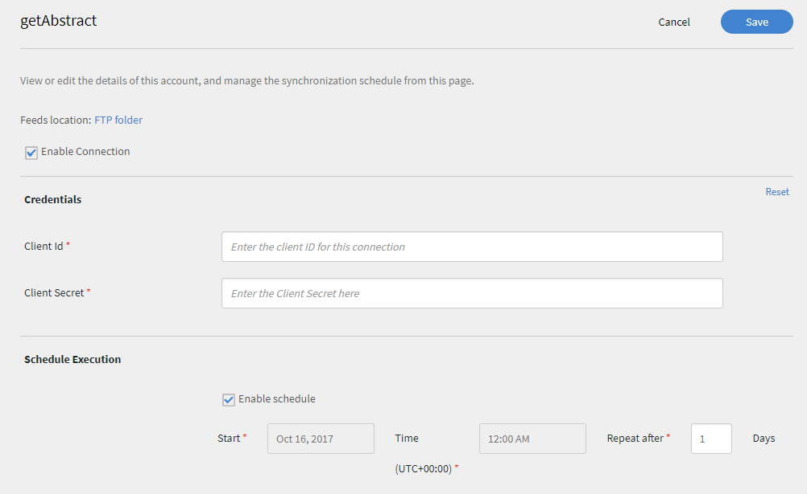
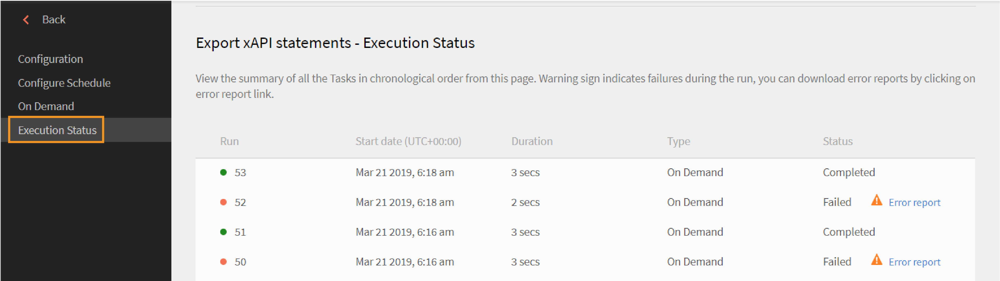
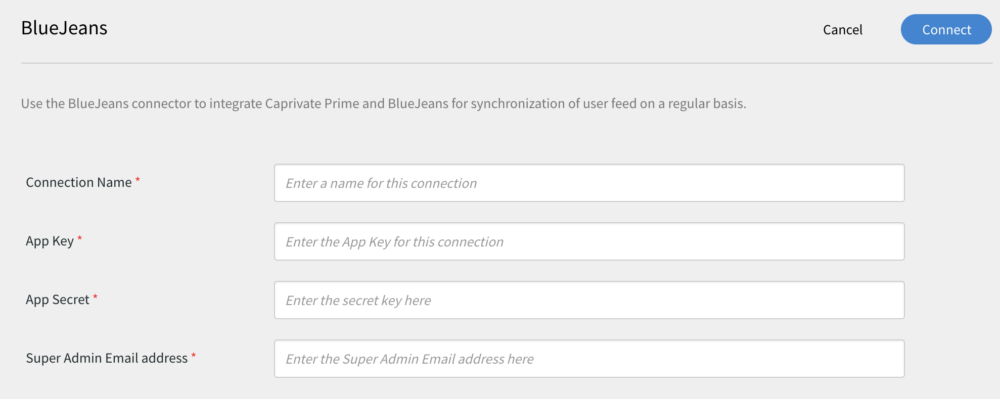

# Learning Manager-Connectors

Unternehmen verfügen über andere Anwendungen und Systeme, die möglicherweise in Learning Manager integriert werden müssen. Connectoren sind Hilfsprogramme, die bei der Durchführung datenbasierter Integrationen helfen, z. B. beim Import von Daten aus externen Systemen in Learning Manager.  Sie führt auch den Export von Daten aus Learning Manager in externe Systeme durch.

Learning Manager bietet Connectors für Salesforce und FTP. Über den Salesforce-Connector können für die Integration zuständige Administratoren eines Unternehmens ihre Salesforce-Anwendung in Learning Manager integrieren. Als Verantwortlicher für die Integration können Sie außerdem mithilfe des FTP-Connectors Gruppen von Benutzern automatisch in Ihre Unternehmensanwendung importieren.

Learning Manager stellt auch die Lynda-, getAbstract- und Harvard Management System-Konnektoren zur Verfügung. Mit diesen Konnektoren können Teilnehmer auf Kurse von Lynda.com, getAbstract und Harvard ManageMentor zugreifen und diese nutzen.

Lesen Sie weiter, um zu erfahren, wie Sie diese Connectors in Learning Manager konfigurieren und nutzen können.

<!--
>[!NOTE]
>
>**Update:** December 2020 update of Learning Manager
>
>For **FTP**, **Box**, and **Custom FTP** connectors, while exporting Learner Transcript or xAPI, you can also export the data as a **zip** file, for:
>
>* Learner Transcripts
>* xAPI
-->

>[!NOTE]
>
>Mit dem November-Release 2022 von Adobe Learning Manager hat Zoom die JWT-Authentifizierung bis Juni 2023](https://marketplace.zoom.us/docs/guides/auth/jwt/) deaktiviert[. Dementsprechend funktioniert der Zoom-Connector mit JWT noch bis zum erwähnten Datum, aber wir empfehlen Benutzern die Erstellung einer Server-zu-Server-OAuth-App, um die Funktionalität in ihrem Konto zu ersetzen. Alle neuen Verbindungen haben standardmäßig eine Zoom-OAuth-Authentifizierung.

## Salesforce-Connector {#sfconnector}

Der Salesforce-Connector stellt eine Verbindung zwischen den Learning Manager- und Salesforce-Konten her, die die Synchronisierung der Daten ermöglicht. Die Connector-Funktionen von Salesforce sind wie folgt:

### Attribute zuordnen

Der für die Integration zuständige Administrator kann Spalten in Salesforce wählen und den entsprechenden für Gruppen geeigneten Attributen in Learning Manager zuordnen. Sobald diese Zuordnung abgeschlossen ist, wird dieselbe Zuordnung auch für spätere Benutzerimporte verwendet. Falls der Administrator eine andere Zuordnung zum Importieren von Benutzern benötigt, kann diese neu konfiguriert werden.

### Automatischer Benutzerimport

Beim Importieren von Benutzenden hat der Learning Manager-Administrator die Möglichkeit, Mitarbeiterdaten aus Salesforce abzurufen und automatisch in Learning Manager zu importieren. Durch diese Automatisierung entfällt der manuelle Aufwand beim Erstellen und Hochladen von CSV-Dateien in Learning Manager.

### Automatische Zeitplanung

Die automatische Zeitplanung kann zusammen mit dem automatischen Benutzerimport sehr effizient sein. Der Learning Manager-Administrator kann Zeitpläne einrichten, wie sie für das Unternehmen benötigt werden. Anwender in der Learning Manager-Anwendung können entsprechend dem Zeitplan immer auf dem neuesten Stand sein. Die Synchronisierung kann täglich in Learning Manager ausgeführt werden.

### Filtern von Benutzern

Der Learning Manager-Administrator kann die Benutzer vor dem Import filtern. Learning Manager-Administratoren können beispielsweise alle Benutzer in der Hierarchie mit einem oder mehreren bestimmten Managern importieren.

### Salesforce-Connector konfigurieren {#configuresalesforceconnector}

Um Salesforce mit Learning Manager zu integrieren, erfahrt ihr mehr über den Prozess.

#### Voraussetzungen {#prerequisites}

Stellen Sie sicher, dass Sie Ihre Salesforce-Unternehmens-URL zur Hand haben. Wenn ihr z. B. myorg **heißt**, könnte Salesforce URL sein`https://myorg.salesforce.com`. Dies ist die einzige Eingabe, die für die Verbindung des Salesforce-Kontos mit Learning Manager erforderlich ist.

Stellen Sie außerdem sicher, dass Sie über die richtigen Anmeldedaten für die Anmeldung bei dem Konto verfügen.

#### Verbindung erstellen {#createaconnection}

1. Zeigen Sie auf der Startseite von Learning Manager mit der Maus auf das Salesforce-Symbol. Ein Menü wird angezeigt. Wählen Sie im Menü den Eintrag **[!UICONTROL Verbinden]**.

   

   *Connect-Option*

1. Ein Dialogfeld wird angezeigt, in dem Sie zur Eingabe der Unternehmens-URL aufgefordert werden. Klicke nach der Bereitstellung der URL auf &quot;Connect ]**&quot;**[!UICONTROL .
1. Nach einer erfolgreichen Verbindung wird die Seite „Übersicht“ angezeigt.

### Attribute zuordnen {#mapattributes}

Sobald die Verbindung hergestellt ist, könnt ihr Salesforce-Spalten den entsprechenden Attributen von Learning Manager zuordnen. Dieser Schritt ist obligatorisch.

1. Auf der Mapping-Seite links sind die Spalten von Learning Manager zu sehen, auf der rechten Seite die Salesforce-Spalten. Wähle den entsprechenden Spaltennamen aus, der dem Spaltennamen des Learning Manager zusprecht.

   
   *Attribute zuordnen*

   >[!NOTE]
   >
   >Die Linksspaltendaten von Learning Manager werden aus den aktiven Feldern abgerufen. Das **Feld &quot;Manager** &quot; muss einem Feld mit E-Mail-Adresse mit Typ zugeordnet werden. Alle Spalten müssen zugeordnet werden, bevor der Connector verwendet werden kann.

1. Klicke nach Abschluss der Zuordnung auf **[!UICONTROL Speichern]** .
1. Der Connector ist jetzt einsatzbereit. Das Konto, das konfiguriert wurde und als Datenquelle in der Administrator-App angezeigt wird. Der Administrator kann den Import oder die On-Demand-Synchronisierung planen.

## Verwendung des Salesforce-Connector {#usingsalesforceconnector}

Der Salesforce-Connector stellt eine Verbindung zu Salesforce.com her, um die Benutzenden als konfiguriert abzurufen und sie Learning Manager hinzuzufügen.

### Importieren von Benutzern aus Salesforce-Kontakten {#import-salesforce-contacts}

Learning Manager verbessert den Salesforce-Connector, sodass sowohl Kontakte als auch Salesforce-Benutzende abgerufen und automatisch in Learning Manager importiert werden.

Gebt auf der Seite &quot;Salesforce Connector&quot; die Salesforce-URL ein, und schließt die Authentifizierung aus. Sobald du dich authentifiziert hast, kannst du anwender- oder kontaktimportieren. Wenn du die Option &quot;Kontakte&quot; auswähst, gib die Untergruppe der kontakte an, die importiert werden sollen.

Wählt die Salesforce-Spalten aus, und passt sie den gruppenfähigen Attributen von Learning Manager an. Sobald die Zuordnung abgeschlossen ist, wird sie auch für spätere Benutzerimporte verwendet.

1. Melde dich bei Salesforce an.
1. Klicke auf der Verbindungsseite auf &quot;Interne Benutzer importieren&quot;****.

   
   *Interne Anwender importieren*

1. Auf der **Seite &quot;Benutzer importieren&quot;** gibt es die neue Option &quot;Kontakte&quot;. Klicke auf das Optionsfeld &quot;Kontakte **&quot;**, um die folgenden Optionen anzuzeigen.

   
   *Zuordnung der Kontaktattribute*

1. Wenn du auf &quot;Ja ]**&quot; klickst**[!UICONTROL , kannst du Folgendes durchführen:

   * **Spalte &quot;Kontakte&quot; auswählen:** Wähle das Feld aus, das du in Learning Manager importieren möchtest.
   * **Werte angeben:** Wähle die Werte aus, die das ausgewählte Feld darstellen.

   
   *Werte angeben*

   * Zuordnung der Salesforce-Spalten mit der von Learning Manager
   * Um mit dem Import zu beginnen, klicke auf **[!UICONTROL Speichern]**.

1. Wenn du auf &quot;Nein&quot; klickst **[!UICONTROL . Importiere alle Kontakte]**. Du kannst die Felder direkt zuordnen, ohne die Kontakte zu filtern. Hier importierst du alle Kontakte aus Salesforce.
1. Um mit dem Import zu beginnen, klicke auf **[!UICONTROL Speichern]**.

## Exportieren von Lerndatensätzen

Learning Manager bietet die Möglichkeit, Lerndatensätze wie Transkript, Anwenderbericht, Kompetenzbericht nach Salesforce zu exportieren. Sie können festlegen, ob die exportierten Daten mit der Tabelle &quot;Benutzer&quot; oder der Tabelle &quot;Kontakte&quot; in Salesforce verknüpft werden sollen.

*Exportieren von Lerndatensätzen*

### Benutzerdefinierte Objekte in Salesforce

Bevor du Lerndaten aus Learning Manager exportierst, musst du benutzerdefinierte Objekte in Salesforce erstellen. Benutzerdefinierte Objekte sind Objekte, die du erstellt hast, um Unternehmens- oder branchenspezifische Informationen zu speichern. Weitere Informationen finden Sie unter [Benutzerdefinierte Salesforce-Objekte](https://trailhead.salesforce.com/en/content/learn/modules/data_modeling/objects_intro).

So erstellen Sie die Objekte:

1. Laden Sie die Pakete herunter und installieren Sie sie, um die benutzerdefinierten Objekte zu erstellen.

   * [Paket 1](https://test.salesforce.com/packaging/installPackage.apexp?p0=04t1k0000008WPJ)
   * [Paket 2](https://test.salesforce.com/packaging/installPackage.apexp?p0=04t1k0000008WPT)
   * [Paket 3](https://test.salesforce.com/packaging/installPackage.apexp?p0=04t1k0000008WPi)

1. Benennen Sie die benutzerdefinierten Objekte in Salesforce um.
1. Wählen Sie die Veranstaltungen aus und klicken Sie auf **[!UICONTROL Speichern]**.

>[!NOTE]
>
>Vergewissere dich, dass allen aktiven Feldern, die nach der Installation des Pakets hinzugefügt wurden, Zugriff auf den Systemadministrator gewährt wurde.

**Verknüpfe Ereignisse mit:** Wähle den Abschnitt aus, den du exportieren möchtest – Anwender oder Kontakt. Wenn du &quot;Kontaktobjekt&quot; auswähst, werden Benutzer, die in Learning Manager, aber nicht in Salesforce vorhanden sind, in Salesforce erstellt.

*Link-Events-Option*

>[!NOTE]
>
>Sie können mehrere Verbindungen in einem Konto erstellen. Eine einzelne Verbindung kann bis zu drei benutzerdefinierte Objekte in Salesforce bereitstellen. Wenn Sie mehrere Verbindungen für ein einziges Salesforce-Konto erstellen möchten, müssen Sie die drei Pakete installieren. Wir bieten Support für bis zu drei Pakete an.
>
>Die Anzahl der zu installierenden Pakete ergibt sich aus der Anzahl der zu erstellenden Verbindungen.

>[!NOTE]
>
>Auf der Seite &quot;Ausführungsstatus&quot; für Salesforce kann die Anzahl der verarbeiteten Datensätze nur über Salesforce überprüft werden. Learning Manager zeigt den Status als abgeschlossen an, selbst wenn in allen verarbeiteten Datensätzen ein teilweiser Export oder Fehler vorliegt.

## Installieren des Salesforce-Pakets

Learning Manager bietet ein Salesforce-App-Paket. Nach der Installation und Konfiguration in SFDC können Vertriebsmitarbeiter ihre Schulungen im SFDC-Portal durchführen. Mit dieser App können SFDC-Benutzer neue Schulungen durchsuchen, Empfehlungen anzeigen und diese direkt im SFDC-Portal nutzen. Anwender erhalten die Benachrichtigungen von Administratoren auch in Form von Briefköpfen direkt in der App innerhalb des SFDC-Portals.

### Einrichten in der Learning Manager-App

1. Melden Sie sich bei Ihrem Learning Manager-Admin-Konto als Integrationsadministrator an.
1. Klicke auf **[!UICONTROL Programme]** > **[!UICONTROL vorgestellten Applikationen]**.
1. Klicke auf **[!UICONTROL Salesforce]**.
1. Notiere dir auf der Salesforce-App-Seite die Applikations-ID (auch Client ID genannt) und das in der Beschreibung erwähnte Kundengeheimnis.
1. Klicke auf **[!UICONTROL Genehmigen]** , und die App muss erfolgreich genehmigt werden.
1. Klicke auf **[!UICONTROL Entwicklerressourcen]** > **[!UICONTROL Zugriffstoken für Tests und Entwicklung]**.
1. Im Abschnitt OAuth-Code abrufen muss die Client-ID und der Umfang auf admin:read, admin:write festgelegt werden. Klicke auf **[!UICONTROL &quot;Absenden&quot;]**.
1. Geben Sie in „Aktualisierungstoken abrufen&quot; die Client-ID und das Client-Secret ein. Klicke auf **[!UICONTROL &quot;Senden&quot;]** , und notiere das Aktualisierungstoken.

### Erstellen eines Kontos in der Salesforce-App

1. Erstellen Sie ein Konto auf der Salesforce-Anmeldeseite. Sie müssen ein Salesforce-Konto in Entwickler- oder Enterprise-Edition erstellen.  [Anmeldung für Entwickler URL](https://developer.salesforce.com/signup). Stellt sicher, dass ihr die E-Mail-ID verwenden müsst, um euch für Salesforce zu registrieren, die ihr für Learning Manager verwendet habt.
1. Bestätigen Sie Ihr Konto über die Bestätigungs-E-Mail.
1. Erstellen Sie ein Kennwort und melden Sie sich bei Salesforce an.
1. Hinweis: Salesforce-URL nach der Anmeldung (z. B. site.lightning.force.com)

### Installieren des Learning Manager-Pakets

Wenn Sie das Paket installieren möchten, müssen Sie zunächst das vorhandene Paket in Salesforce löschen. Vor der Deinstallation müssen Sie die Einstellungen aktivieren, wie unten dargestellt. Das Anwenden dieser Einstellungen ist obligatorisch, da Sie das Paket sonst nicht installieren können.

>[!NOTE]
>
>Adobe Learning Manager wird nur in der Salesforce Lightning-Ansicht unterstützt.

1. Starte die URL](https://login.salesforce.com/packaging/installPackage.apexp?p0=04t1k0000008WOQ) des [Learning Manager-Pakets.
1. Klicke auf der **Anmeldeseite** auf **[!UICONTROL &quot;Benutzerdefinierte Domain verwenden&quot;]**.
1. Gib das Paket URL ein, und klicke auf &quot;Fortfahren&quot;****. Auf der Installationsseite muss die Option &quot;Nur für Administratoren installieren&quot; ausgewählt sein. Ändern Sie diese Option nicht.
1. Klicke auf **[!UICONTROL Installieren]**. Sobald das Paket installiert ist, klicke auf **[!UICONTROL Fertig]**. Sie werden zur Seite „Installierte Pakete“ geleitet, auf der das installierte Adobe Learning Manager-Paket angezeigt wird.
1. Navigieren Sie zum App Launcher (neben „Einrichtung“) und suchen Sie Adobe Learning Manager.
1. Um die App zu konfigurieren, klicke auf **[!UICONTROL Konfigurieren]**.
1. Klicke auf &quot;Neu ]**&quot;**[!UICONTROL , und füge die folgenden Details hinzu:

   * **Konfigurieren:** Geben Sie den gewünschten Namen ein.
   * **ClientID**: Gib den Wert ein, den du aus dem ersten Abschnitt erhalten hast.
   * **Client-Funktion:** Gib den Wert ein, den du aus dem ersten Abschnitt erhalten hast.
   * **RefreshToken:** Gib den Wert ein, den du aus dem ersten Abschnitt erhalten hast.
   * **LearningManagerBaseURL:** Die URL der Website, auf der Learning Manager gehostet wird.

### Hinzufügen von Remotesite-Einstellungen

1. Klicke oben rechts auf der Seite auf **[!UICONTROL Setup]**.
1. Suche **[!UICONTROL unter Schnellsuche]** nach Remote-Site-Einstellungen.
1. Klicke auf **[!UICONTROL Neue Remote-Site]**.
1. Geben Sie die folgenden Details ein:

   * **Remotesite-Name:** Geben Sie den gewünschten Namen ein.
   * **Remotesite-URL:** Die URL der Site, auf der Learning Manager gehostet wird.

1. Starten Sie Learning Manager.

### Benachrichtigungen für die Learning Manager-App aktivieren

1. Klicke oben rechts auf **[!UICONTROL Setup]**.
1. Suchen Sie nach „Benutzerdefinierte Benachrichtigungen“.
1. Klicke auf &quot;Neu ]**&quot;**[!UICONTROL .
1. Geben Sie die folgenden Details ein:

   1. **Benutzerdefinierter Benachrichtigungsname:** LearningManagerNotification
   1. **API Name:** LearningManagerNotification

1. Wähle sowohl Desktop **** als auch **Mobile** als unterstützte Kanäle aus.

1. Klicken Sie auf **[!UICONTROL Speichern]**.
1. Um Push-Benachrichtigungen für Mobilgeräte zu aktivieren, führen Sie die folgenden Schritte aus:

   1. Installieren Sie die Salesforce-App für Mobilgeräte auf Ihrem Mobiltelefon.
   1. Melden Sie sich mit Ihren Anmeldedaten bei der App an.
   1. Gehe zu **Setup** > **Einstellungen** für die Benachrichtigungsbereitstellung.
   1. Fügen Sie Salesforce für iOS und Android hinzu.

### Deinstallieren von Learning Manager aus Salesforce

1. Wähle in der Salesforce-App &quot;Installed packages&quot; (Installierte Pakete).
1. Klicke auf **[!UICONTROL Deinstallieren]**.

## Konfigurieren von Learning Manager für Salesforce-Benutzer

Die Learning Manager-App ist auch für Benutzer verfügbar, die sich in einem beliebigen Salesforce-Konto befinden. Der Salesforce-Administrator kann Benutzer basierend auf den Profilen hinzufügen. Die Salesforce-Profile ähneln denen in Learning Manager. Beispiel: Administrator, Integrationsadministrator, Kursleiter. Der Salesforce-Administrator kann auch ein benutzerdefiniertes Profil erstellen.

Als Salesforce-Administrator können Sie die Profile entweder Benutzern zuweisen oder ein benutzerdefiniertes Profil erstellen.

Beim Installieren des Pakets können Sie den Teilnehmern das Salesforce-Profil zuweisen.

Nach der Installation des Pakets müssen Sie das Profil konfigurieren.

Klicke auf **[!UICONTROL &quot;>**[!UICONTROL  Neu ]**konfigurieren]**&quot;, und füge Folgendes hinzu:

* Konfigurationsname
* Client-ID
* Client-Secret
* LearningManagerBaseURL
* Umleitung deaktivieren

>[!NOTE]
>
>Damit Teilnehmer die Learning Manager-App anzeigen können, musst du die App für alle Teilnehmer aktivieren.

Als Nächstes müssen Sie die Berechtigung für den Zugriff auf die Learning Manager-App bereitstellen.

*Berechtigungen für den Zugriff auf die Learning Manager-App festlegen*

Wählen Sie die Benutzer aus und weisen Sie die Berechtigungen entsprechend zu. Die Teilnehmenden können jetzt auf die Learning Manager-App zugreifen.

Wählen Sie jetzt ein Profil aus, z. B. das Standardprofil eines Benutzers, und klicken Sie auf das Profil. Klicke auf &quot;Bearbeiten ]**&quot;, und aktiviere im** Abschnitt &quot;Benutzerdefinierte App-Einstellungen **&quot; das Häkchen** für Adobe Learning Manager **.**[!UICONTROL  Dadurch können Benutzer auf die App zugreifen.

Wählen Sie im Abschnitt **Benutzerdefinierte Registerkarteneinstellungen** in der Dropdownliste **Teilnehmerstartseite** die Option **Standard an**.

Sie müssen die App für alle Profile sichtbar machen.

Klicke auf **[!UICONTROL &quot;Speichern&quot;]** , und die Teilnehmer erhalten Zugriff auf die Learning Manager-App für alle Profile.

### Änderungen in Zusammenhang mit Lernplänen

#### Bestehende Verbindungen

Wenn im Admin-Konto die Option &quot;Lernpfad&quot; deaktiviert wurde, werden im Bericht keine Zeilen und Spalten hinzugefügt.

Wenn im Admin-Konto die Option &quot;Lernpfad&quot; aktiviert ist, wird die Spalte &quot;Typ&quot; mit dem Lernpfad gefüllt, falls die Teilnehmer dazu angemeldet sind.

>[!NOTE]
>
>Wenn das Flag aktiviert ist und du eine vorhandene Verbindung verwendest, werden möglicherweise einige Datensätze verpasst.

#### Neue Verbindungen

Wenn im Admin-Konto die Option &quot;Lernpfad&quot; deaktiviert wurde, enthält der Schulungsbericht die folgenden Spalten, enthält jedoch keine Daten.

* **Eingebetteter Pfad:** Zeigt den Namen des Lernprogramms an.
* **ID für eingebetteten Pfad:** Zeigt die IDs für das Lernprogramm an.
* **Eingebettete Kurs-ID:** Zeigt die IDs von Kursen an, die sich innerhalb eines Lernpfads befinden.

Bei neuen Verbindungen in Konten, bei denen „Lernplan“ aktiviert ist, werden die drei neuen Spalten angezeigt und alle Daten gehen ein.

Darüber hinaus enthält der Bericht für alle Teilnehmer, die an einem Lernpfad angemeldet sind, den Spaltentyp &quot;Lernpfad&quot;.

In der Spalte &quot;Typ&quot; wird das Lernprogramm in &quot;Lernpfad&quot; umbenannt. Bei bestehenden Verbindungen wird es keine Änderung geben.

## FTP-Connector für Learning Manager {#ftpconnector}

Mithilfe des FTP-Connectors können Sie Learning Manager in beliebige externe Systeme integrieren, um Datensynchronisierung zu automatisieren. Es wird erwartet, dass externe Systeme Daten in einem CSV-Format exportieren und in den entsprechenden Ordner des Learning Manager-FTP-Kontos platzieren können. Die Funktionen für FTP-Connectoren sind wie folgt:

Sie können auch den Box-Connector für Datenmigration, Benutzerimport und Datenexport verwenden. Weitere Informationen findest du unter Box Connector.

### Datenimport {#dataimport}

Beim Importieren von Benutzenden hat der Learning Manager-Administrator die Möglichkeit, Mitarbeiterdaten aus dem Learning Manager-FTP-Dienst abzurufen und automatisch in Learning Manager zu importieren. Mit dieser Funktion können Sie mehrere Systeme integrieren, indem Sie die CSV, die durch diese Systeme generiert wurden, in die entsprechenden Ordner der FTP-Konten platzieren. Learning Manager ruft die CSV-Dateien ab, führt sie zusammen und importiert die Daten gemäß dem Zeitplan. Weitere Informationen finden Sie unter „Planung“.

**Attribute zuordnen**

Der für die Integration zuständige Administrator kann Spalten in CSV-Dateien wählen und den entsprechenden für Gruppen geeigneten Attributen in Learning Manager zuordnen. Diese Zuordnung ist eine einmalige Maßnahme. Nachdem diese Zuordnung vorgenommen wurde, wird dieselbe Zuordnung auch für spätere Benutzerimporte verwendet. Falls der Administrator eine andere Zuordnung zum Importieren von Benutzern benötigt, kann diese neu konfiguriert werden.

#### Daten exportieren {#exportdata}

Durch das Exportieren von Daten können Benutzer Benutzerkenntnisse und Teilnehmertranskripte auf einen FTP exportieren, um diese auf einem beliebigen System von Drittanbietern zu integrieren.

#### Planung {#scheduling}

Der Administrator kann Planungsaufgaben einrichten, wie sie für das Unternehmen gewünscht werden. Die Benutzer in der Learning Manager-Anwendung werden anhand der Planung auf dem neuesten Stand gehalten. Ebenso kann der Integrations-Admin den Export für Kenntnisse planen, damit diese in ein externes System integriert werden. Die Synchronisierung kann täglich in Learning Manager ausgeführt werden.

### Konfigurieren des FTP-Connectors für Learning Manager {#configurecaptivateprimeftpconnector}

Um den FTP-Connector mit Learning Manager zu integrieren, lerne den Prozess kennen.

#### Verbindung erstellen {#Createaconnection-1}

1. Zeigen Sie auf der Startseite von Learning Manager mit der Maus auf die FTP-Karte/-Miniaturansicht. Ein Menü wird angezeigt. Wählen Sie im Menü den Eintrag **[!UICONTROL Verbinden]**.

   

   *Connect-Option*

1. Ein Dialogfeld wird angezeigt, in dem Sie zur Eingabe der Unternehmens-E-Mail-ID aufgefordert werden. Stellt die E-Mail-ID der Person bereit, die für die Verwaltung des FTP-Kontos von Learning Manager für die Organisation verantwortlich ist. Klicke auf **[!UICONTROL Connect]** , nachdem du die E-Mail-ID angezeigt hast.
1. Learning Manager sendet Ihnen eine E-Mail, in der Sie aufgefordert werden, das Kennwort zurückzusetzen, bevor Sie zum ersten Mal auf FTP zugreifen. Benutzende müssen das Kennwort zurücksetzen und dieses für den Zugriff auf das Learning Manager-FTP-Konto verwenden.

   >[!NOTE]
   >
   >Nur ein Learning Manager-FTP-Konto kann für ein bestimmtes Learning Manager-Konto erstellt werden.

   Auf der Übersichtsseite kannst du den Verbindungsnamen für deine Integration angeben. Wähle aus den folgenden Optionen, welche Aktion du ergreifen möchtest:

   * Interne Benutzer importieren
   * Import xAPI
   * Benutzerkenntnisse exportieren - Konfigurieren Sie einen Zeitplan
   * Benutzerkenntnisse exportieren - OnDemand
   * Teilnehmerprotokolle exportieren – Kalender konfigurieren
   * Export teilnehmerbezogener Protokolle – OnDemand

   
   *Exportoptionen*

### Importieren

+++Interner Anwender

Mit der Option &quot;Interner Anwender importieren&quot; könnt ihr die Benutzer aus einer CSV-Datei bei Bedarf oder terminieren in einen Learning Manager importieren.

+++

+++Attribute zuordnen

Sobald die Verbindung erfolgreich hergestellt wurde, können Sie die Spalten der CSV-Dateien zuordnen. Sie werden im FTP-Ordner den entsprechenden Attributen von Learning Manager zugeordnet. Dieser Schritt ist obligatorisch.

1. Auf der Seite Attribute zuordnen kannst du links die erwarteten Spalten von Learning Manager sehen, auf der rechten Seite die Namen der CSV Spalten. Auf der rechten Seite wird eventuell zunächst ein leeres Auswahlfeld angezeigt. Importiere eine Vorlage CSV, indem du auf Datei auswählen klickst ****.
1. Durch den oben beschriebenen Schritt werden alle Spaltennamen aus der CSV-Datei in die Dropdown-Auswahlliste auf der rechten Seite übernommen. Wähle den entsprechenden Spaltennamen aus, der dem Spaltennamen des Learning Manager zusprecht.

   >[!NOTE]
   >
   >Das Feld „Manager“ muss dem Feld mit der E-Mail-Adresse zugeordnet werden. Alle Spalten müssen zugeordnet werden, bevor der Connector verwendet werden kann.

1. Klicke nach Abschluss der Zuordnung auf **[!UICONTROL Speichern]** .

   Der Connector ist jetzt einsatzbereit. Das gerade konfigurierte Konto wird jetzt als Datenquelle innerhalb des Administrator-App angezeigt, sodass der Administrator den Import planen oder die Synchronisierung nach Bedarf starten kann.

+++

+++Ftp-Connector für Learning Manager verwenden

1. Die CSV dateien aus externen Systemen müssen in folgendem Pfad gespeichert werden:

   `code $OPERATION$/$OBJECT_TYPE$/$SUB_OBJECT_TYPE$/data.csv`

   >[!NOTE]
   >
   >Im Juli 2016 Release ist nur der Import von Benutzern gestattet. Stelle daher für den FTP-Connector sicher, dass die CSV Dateien im folgenden Ordner gespeichert sind:

   `code Home/import/user/internal/*.csv`

1. Der FTP-Connector führt alle Zeilen aus CSV Dateien aus. Es ist wichtig, dass die Zeile, die einem Benutzer in einer CSV entspricht, in keiner anderen CSV erscheint.
1. Alle CSVs müssen die im Mapping angegebenen Spalten enthalten.
1. Alle erforderlichen CSVs müssen vor Beginn des Prozesses im Ordner vorhanden sein.

>[!NOTE]
>
>Beim Importieren von Benutzenden in Learning Manager muss der Administrator auch wissen, wie Benutzende in Learning Manager verwaltet werden. Weitere Informationen findest [du in der User Management-Hilfe](migration-manual.md#usermanagement) .

+++

+++XAPI importieren

Mit den xAPI-Importoptionen können Sie den Import von xAPI-Anweisungen von Diensten von Drittanbietern in Learning Manager nach Bedarf planen.

+++

+++Konfigurationen für den Import von xAPI erforderlich

1. Wähle auf der Konfigurationsseite eine vorhandene Konfiguration aus, die in der Konfigurationsliste verfügbar ist, um xAPI-Anweisungen aus dem CSV zu importieren. Klicke auf &quot;Bearbeiten&quot;, oder **füge einen neuen Konfigurationslink** hinzu, um zur Seite &quot;Importquellen konfigurieren&quot; zu navigieren.

   **Konfiguration**

   * Füllen Sie auf der Seite „Importquellen konfigurieren“ die beiden Felder aus, d. h. Name und Name der Quelldatei. Der Quelldateiname sollte mit dem Dateinamen übereinstimmen, der im FTP-Ordner angegeben ist.
   * Klicken Sie auf **[!UICONTROL Speichern]**, um Ihre Änderungen zu speichern.

   
   *Konfigurieren*

   **Filter**

   * Klicken Sie im linken Teilfenster auf **[!UICONTROL Filter]**.
   * Füllen Sie auf der Seite „Import-Filter konfigurieren“ die Felder Name und Bedingungen aus, um die Datensätze herauszufiltern. Klicken Sie auf **[!UICONTROL Neuen Filter hinzufügen]**, um einen weiteren Filter hinzuzufügen. Sie können einen Filter speichern oder löschen, indem Sie in der Spalte „Aktionen“ auf die Option **Speichern** oder **Löschen** klicken.

   
   *Filter*

   **Zuordnung**

   * Klicken Sie im linken Teilfenster auf **[!UICONTROL Zuordnung]**.
   * Auf der Seite „xAPI-Anweisungen-Konfigurations-Mapping importieren“ sehen Sie auf der linken Seite die Pfadnamen der xAPI-JSON-Felder, die den CSV-Spaltennamen zugeordnet werden müssen.
   * Die drei Namen der JSON-Pfadfelder, die den CSV-Spaltennamen zugeordnet werden müssen, lauten standardmäßig **actor.mbox**, **verb.id** und **object.id**. Sie können weitere Felder zur Zuordnung hinzufügen, indem Sie auf **Neue Zuordnung hinzufügen** klicken.

   * Wählen Sie den Typ des Spaltennamens, den Sie mit dem Namen des Json-Feldpfads zuordnen (ob Zeichenfolge, Nummer, Boolescher Typ oder Datumstyp).
   * Klicken Sie auf „Speichern“, nachdem die Zuordnung abgeschlossen wurde. Der xAPI-Import kann jetzt nach „Zeitplan“ oder „On Demand“ importiert werden.

   
   *Zuordnung*

1. Klicken Sie im linken Teilfenster auf **[!UICONTROL Zeitplan konfigurieren]**. Klicken Sie auf **[!UICONTROL Zeitplan aktivieren]**, um den Import von xAPI-Anweisungen zu planen.

   Sie können Startzeit und -datum eingeben und anschließend die Häufigkeit des xAPI-Imports in Tagen festlegen. Aktivieren Sie beispielsweise den xAPI-Import alle 3 Tage.

   
   *xAPI-Anweisungen importieren – Kalender konfigurieren*

1. Klicke im linken Bedienfeld auf &quot;On Demand Execution ]**&quot;**[!UICONTROL .

   
   *xAPI-Anweisungen importieren – On Demand*

1. Außerdem können Sie jederzeit im linken Teilfenster auf **[!UICONTROL Ausführungsstatus]** klicken, um eine Zusammenfassung aller Ausführungen für diesen Connector in chronologischer Reihenfolge anzuzeigen. Sie können das Startdatum und die Dauer der für den Import von xAPI benötigten Zeit anzeigen, die Art des Imports (On Demand oder geplant) und den Status des Imports (ob der Import von xAPI ausgeführt wird oder abgeschlossen wurde oder fehlgeschlagen ist).

   
   *xAPI-Anweisungen importieren – Ausführungsstatus*

+++

### Exportieren

+++Kompetenzen

Es gibt zwei Optionen zum Exportieren von Anwender-Kompetenzberichten.

**[!UICONTROL Anwenderkompetenzen – On-Demand]**: Du kannst das Startdatum angeben und den Report mit der Option exportieren. Der Bericht wird beginnend ab dem eingegebenen Datum bis zum aktuellen Tag extrahiert.

*On-Demand-Exportoption*

**[!UICONTROL Benutzerkenntnisse - Konfigurieren]**: Mit dieser Option können Sie die Extrahierung des Berichts planen. Wählen Sie das Kontrollkästchen „Zeitplan aktivieren“ und geben Sie das Startdatum und die Startzeit ein. Sie können das Intervall festlegen, in dem der Bericht generiert und gesendet werden soll.

*Konfigurieren des Berichtsexports*

+++

Um den Ordner &quot;Exportieren&quot; zu öffnen, in dem die exportierten Dateien platziert werden, öffne den Link zum FTP-Ordner auf der Seite &quot;User Skills&quot;, wie unten gezeigt.

*FTP-Ordner zum Anzeigen von Dateien*

Die automatisch exportierten Dateien befinden sich am Speicherort **Home/Export/&#42;FTP_location&#42;**

Die automatisch exportierten Dateien sind mit dem Titel **&#42;skill_achievements_Date &#42;__&#42;&#42; verfügbar.csv**

*Exportierte .csv datei*

+++Teilnehmer-Transkript

**Konfigurieren**: Mit dieser Option kannst du die Extraktion des Berichts planen. Wählen Sie das Kontrollkästchen „Zeitplan aktivieren“ und geben Sie das Startdatum und die Startzeit ein. Sie können das Intervall festlegen, in dem der Bericht generiert und gesendet werden soll.

+++

Um den Ordner &quot;Exportieren&quot; zu öffnen, in dem die exportierten Dateien an ihrem FTP-Speicherort platziert werden, öffne den Link zum FTP-Ordner auf der Seite &quot;Teilnehmerprotokoll&quot;, wie unten dargestellt

Die automatisch exportierten Dateien befinden sich am Speicherort **Home/Export/&#42;FTP_location&#42;**

Die automatisch exportierten Dateien sind mit dem Titel **&#42;learner_transcript_dest &#42;__&#42;&#42; verfügbar.csv**

### Unterstützung für manuelle CSV-Felder {#supportformanualcsvfields}

Beim Importieren von Benutzerdaten über FTP muss ein Administrator das gesamte aktive Feld im System dem entsprechenden Feld im CSV zuordnen.

Dies ist für alle aktiven CSV-Felder obligatorisch. Bei manuellen aktiven Feldern kann der Integrationsadministrator die Option **DontImportFromSource** auswählen.

Wenn Sie diese Option auswählen, werden die manuellen aktiven Feldwerte nicht mit CSV-Import ausgefüllt. Die vom Teilnehmer bereitgestellten Werte bleiben intakt.

>[!NOTE]
>
>Wenn für das csv-aktive Feld die Option **DontImportFromSource** ausgewählt ist, wird dieses Feld aus dem System gelöscht.

*FTP-Connector für aktive Felder*

## Lynda-Connector {#lyndaconnector}

Der Lynda-Connector kann von Unternehmenskunden von Lynda.com verwendet werden, die möchten, dass ihre Teilnehmenden Lynda-Kurse innerhalb von Learning Manager entdecken und nutzen. Der Connector kann so konfiguriert werden, dass er regelmäßig Kurse von Lynda.com mit Ihrem API-Schlüssel aufruft. Wenn ein Kurs in Learning Manager erstellt wurde, können Benutzende nach ihm suchen und ihn dann nutzen. Der Teilnehmerfortschritt kann dann in Learning Manager verfolgt werden.

### Konfigurieren des Lynda-Connectors {#configurethelyndaconnector}

1. Klicken Sie im integrierten Admin-Dashboard auf „Lynda“.

   Sie sehen die Kachel mit drei Optionen: „Erste Schritte“, „Verbinden“ und „Verbindungen verwalten“.

1. Wenn Sie den Lynda-Connector zum ersten Mal konfigurieren, klicken Sie auf „Verbinden“.

   <!--Configure the Exavault FTP account before you configure this connector.-->

1. Geben Sie auf der Verbindungsseite einen Namen für Ihren Connector ein. Geben Sie den App-Schlüssel und den geheimen Schlüssel für Ihre Verbindung ein.

   >[!NOTE]
   >
   >Wenden Sie sich an Ihren Anbieter, um den App-Schlüssel und den geheimen Schlüssel zu erhalten.

1. Klicken Sie auf „Speichern“.

   Die Konfiguration wird gespeichert und die Lynda-Verbindung für Ihr Konto wurde hinzugefügt. Klicke auf der Startseite auf Verbindungen verwalten, und bearbeite deine Konfiguration jederzeit.

1. Wenn Sie bereits über eine Verbindung verfügen, klicken Sie auf „Verbindungen verwalten“, um alle Ihre Verbindungen anzuzeigen.

   >[!NOTE]
   >
   >Die Migrationsfunktion muss für Ihr Konto aktiviert werden, bevor Sie diesen Connector konfigurieren.

1. Klicken Sie auf die Verbindung, die Sie bearbeiten möchten.
1. Klicke im Bedienfeld links auf **[!UICONTROL Konfigurieren]**. Führen Sie einen der folgenden Schritte aus:

   * Über dieses Fenster können Sie die Details Ihres Kontos sowie den Synchronisierungszeitplan anzeigen oder bearbeiten. Zum Aktivieren dieses Kontos müssen Sie das Kontrollkästchen „Verbindung aktivieren“ aktivieren.
   * Klicken Sie auf „Bearbeiten“ und bearbeiten Sie Ihre Anmeldedaten. Klicken Sie auf „Zurücksetzen“, um Ihre Änderungen in diesem Feld rückgängig zu machen.
   * Klicken Sie „Plan aktivieren“, um die Synchronisierung zu planen. Sie können Startzeit und -datum eingeben und anschließend die Häufigkeit der Synchronisierung in Tagen festlegen, um beispielsweise eine Synchronisierung alle drei Tage zu aktivieren.

   Klicken Sie auf **[!UICONTROL Speichern]**, um Ihre Änderungen zu speichern.

   

   *Konfiguration des Lynda-Connector für Learning Manager*

1. Klicken Sie im linken Teilfenster auf „On-demand-Ausführung“. Mithilfe dieser Option können Sie Benutzer-Feeds und andere relevante Daten aus Lynda importieren. Geben Sie das Startdatum für die On-Demand-Ausführung ein und klicken Sie auf „Ausführen“, um die Synchronisierung auszuführen. Alle Daten ab dem Startdatum bis zum aktuellen Tag werden importiert.

   * Sie können auf „Zugriff auf Learning Manager während der Ausführung deaktivieren“ klicken, um die Anwendung während der Synchronisierung auszusetzen.
   * Wenn Sie auf „Zugriff auf Learning Manager während der Ausführung aktivieren“ klicken, wird der Dienst während der Synchronisierung nicht unterbrochen.

   

   *On-Demand-Ausführung für Lynda-Connector*

1. Außerdem können Sie jederzeit im linken Teilfenster auf „Ausführungsstatus“ klicken, um eine Zusammenfassung aller Ausführungen für diesen Connector in chronologischer Reihenfolge anzuzeigen. Sie können das Startdatum und die Dauer der Synchronisierung anzeigen sowie die Art (ob es sich um eine On-Demand-Synchronisierung handelt) und den Status (ob die Synchronisierung läuft oder abgeschlossen ist) der Synchronisierung.

   >[!NOTE]
   >
   >Wenn Sie eine Verbindung löschen und neu erstellen, werden die vorherigen Ausführungen für den Connector wieder angezeigt. Sie können alle vor dem Löschen der Verbindung erfolgten Ausführungen anzeigen.

   Eine Wiederholung ist nur für die letzte Synchronisierung möglich.

   

   *Übersicht über alle Ausführungen anzeigen und auf Ausführungsstatus klicken*

## getAbstract-Connector {#getabstractconnector}

Der getAbstract-Connector kann von Unternehmenskunden von getAbstract.com verwendet werden, die möchten, dass ihre Teilnehmer getAbstract-Kurse entdecken und nutzen. Der Connector kann so konfiguriert werden, dass er regelmäßig Nutzungsdaten aufruft, je nachdem welche Teilnehmerabschlussdatensätze in Learning Manager erstellt werden. Lesen Sie weiter, um zu erfahren, wie dieser Connector in Learning Manager konfiguriert werden kann.

### getAbstract-Connector konfigurieren {#configurethegetabstractconnector}

1. Klicken Sie im integrierten Admin-Dashboard auf „getAbstract“.

   Sie sehen auf der Kachel drei Optionen: „Erste Schritte“, „Verbinden“ und „Verbindungen verwalten“.

1. Wenn Sie den getAbstract-Connector zum ersten Mal konfigurieren, klicken Sie auf „Verbinden“.

   <!--Configure the Exavault FTP account before you configure this connector.

   Ensure that you share this FTP credentials with your content provider to access the feeds.-->

1. Geben Sie einen Namen für die Verbindung im Feld „Verbindungsname“ ein.

   Geben Sie die entsprechenden Schlüssel in die Felder „Client-ID“ und in „Client-Secret“ ein. Möglicherweise müssen Sie sich an den Hersteller wenden, um die entsprechenden Schlüssel für diesen Connector zu erhalten.

   Diese Schlüssel sind erforderlich, um die Kurs-Metadaten für die vom Client genutzten Kurse abzurufen.

1. Wenn Sie bereits über eine Verbindung verfügen, klicken Sie auf der Startseite auf „getAbstract“ > „Verbindungen verwalten“, um Ihre vorhandene Konfiguration anzuzeigen und zu bearbeiten.

   >[!NOTE]
   >
   >Die Migrationsfunktion muss für Ihr Konto aktiviert werden, bevor Sie diesen Connector konfigurieren.

1. Klicken Sie auf die Verbindung, deren Konfiguration Sie anzeigen oder bearbeiten möchten.

   

   *GetAbstract-Connector für Learning Manager konfigurieren*

1. Klicke im Bedienfeld links auf Konfigurieren. Führen Sie einen der folgenden Schritte aus:

   * Über dieses Fenster können Sie die Details Ihres Kontos sowie den Synchronisierungszeitplan anzeigen oder bearbeiten. Zum Aktivieren dieses Kontos müssen Sie das Kontrollkästchen „Verbindung aktivieren“ aktivieren.
   * Klicken Sie auf „Bearbeiten“ und bearbeiten Sie Ihre Anmeldedaten. Klicken Sie auf „Zurücksetzen“, um Ihre Änderungen in diesem Feld rückgängig zu machen.
   * Klicken Sie „Plan aktivieren“, um die Synchronisierung zu planen. Sie können Startzeit und -datum eingeben und anschließend die Häufigkeit der Synchronisierung in Tagen festlegen, um beispielsweise eine Synchronisierung alle drei Tage zu aktivieren.

1. Klicken Sie auf **[!UICONTROL Speichern]**.

   Die Konfiguration wird gespeichert und die getAbstract-Verbindung für Ihr Konto wird hinzugefügt.

1. Klicken Sie im linken Teilfenster auf „On-demand-Ausführung“. Mithilfe dieser Option können Sie Benutzer-Feeds und andere relevante Daten aus getAbstract importieren. Geben Sie das Startdatum für die On-Demand-Ausführung ein und klicken Sie auf „Ausführen“, um die Synchronisierung auszuführen. Alle Daten ab dem Startdatum bis zum aktuellen Tag werden importiert.

   * Sie können auf „Zugriff auf Learning Manager während der Ausführung deaktivieren“ klicken, um die Anwendung während der Synchronisierung auszusetzen.
   * Wenn Sie auf „Zugriff auf Learning Manager während der Ausführung aktivieren“ klicken, wird der Dienst während der Synchronisierung nicht unterbrochen.

1. Außerdem können Sie jederzeit im linken Teilfenster auf „Ausführungsstatus“ klicken, um eine Zusammenfassung aller Ausführungen für diesen Connector in chronologischer Reihenfolge anzuzeigen. Sie können das Startdatum und die Dauer der Synchronisierung anzeigen sowie die Art (ob es sich um eine On-Demand-Synchronisierung handelt) und den Status (ob die Synchronisierung läuft oder abgeschlossen ist) der Synchronisierung.

   >[!NOTE]
   >
   >Wenn Sie eine Verbindung löschen und neu erstellen, werden die vorherigen Ausführungen für den Connector wieder angezeigt. Sie können alle vor dem Löschen der Verbindung erfolgten Ausführungen anzeigen.

   Eine Wiederholung ist nur für die letzte Synchronisierung möglich.

   Für jede Art von Synchronisierung gilt: Damit sie funktioniert, muss der Benutzer-Feed für die in der Synchronisierung angegebenen Daren im FTP-Ordner für getAbstract FTP vorhanden sein.

   Das folgende Excel-Arbeitsblatt ist ein Beispiel für einen Benutzer-Feed aus getAbstract. Der Dateiname muss dem folgenden Format entsprechen: **report_export_yyyy_MM_dd_HHmmss.xlsx** oder **report_export_yyyy_MM_dd.xlsx**.
   [getAbstract Anwender-Feed Beispiel-Excel-Tabelle](assets/report-export-20170401175342.xlsx)

## Harvard ManageMentor-Connector {#hmmconnector}

Der Harvard ManageMentor-Connector kann von Unternehmenskunden von Harvard ManageMentor verwendet werden, die möchten, dass ihre Teilnehmer Harvard ManageMentor-Kurse entdecken und nutzen. Mit dem Connector können Sie Kurse in Learning Manager erstellen, und sie können dazu konfiguriert werden, regelmäßig Daten zum Teilnehmerfortschritt abzurufen. Um diesen Connector sich zu konfigurieren, müssen Sie folgende Schritte durchführen:

### Harvard ManageMentor-Connector konfigurieren {#configuretheharvardmanagermentorconnector}

1. Klicken Sie im integrierten Admin-Dashboard auf „Harvard ManageMentor“.

   Sie sehen auf der Kachel drei Optionen: „Erste Schritte“, „Verbinden“ und „Verbindungen verwalten“.

1. Wenn Sie den Harvard ManageMentor-Connector zum ersten Mal konfigurieren, klicken Sie auf „Verbinden“.

   <!--Configure the Exavault FTP account before you configure this connector.

   Ensure that you share this FTP credentials with your content provider to access the feeds.-->

1. Geben Sie einen Namen für die Verbindung im Feld „Verbindungsname“ ein. Klicken Sie auf „Verbinden“, um diese Verbindung zu speichern.
1. Wenn Sie bereits über eine Verbindung verfügen, klicken Sie auf der Startseite auf „Harvard ManageMentor“ > „Verbindungen verwalten“. Klicken Sie auf die gewünschte Verbindung, um die vorhandene Konfiguration zu bearbeiten.

   >[!NOTE]
   >
   >Die Migrationsfunktion muss für Ihr Konto aktiviert werden, bevor Sie diesen Connector konfigurieren.

   

   *HarvardManage Mentor-Connector für Learning Manager konfigurieren*

1. Klicke im Bedienfeld links auf Konfigurieren. Führen Sie einen der folgenden Schritte aus:

   * Über dieses Fenster können Sie die Details Ihres Kontos sowie den Synchronisierungszeitplan anzeigen oder bearbeiten. Zum Aktivieren dieses Kontos müssen Sie das Kontrollkästchen „Verbindung aktivieren“ aktivieren.
   * Klicken Sie „Plan aktivieren“, um die Synchronisierung zu planen. Sie können Startzeit und -datum eingeben und anschließend die Häufigkeit der Synchronisierung in Tagen festlegen, um beispielsweise eine Synchronisierung alle drei Tage zu aktivieren.

1. Klicken Sie im linken Teilfenster auf „On-demand-Ausführung“. Mithilfe dieser Option können Sie Benutzer-Feeds und andere relevante Daten aus Harvard ManageMentor importieren. Geben Sie das Startdatum für die On-Demand-Ausführung ein und klicken Sie auf „Ausführen“, um die Synchronisierung auszuführen. Für diese Verbindung werden alle Daten seit dem Startdatum importiert.

   * Sie können auf „Zugriff auf Learning Manager während der Ausführung deaktivieren“ klicken, um die Anwendung während der Synchronisierung auszusetzen.
   * Wenn Sie auf „Zugriff auf Learning Manager während der Ausführung aktivieren“ klicken, wird der Dienst während der Synchronisierung nicht unterbrochen.

   Wenn Sie die Synchronisierung alle paar Tage automatisieren möchten, geben Sie die Anzahl der Tage in das Feld „Anzahl der Tage wiederholen“ ein. Durch die Synchronisierung wird gewährleistet, dass Ihr Konto mit der aktuellen Version der Abstrakte und Übersichten von Harvard ManageMentor aktualisiert wird.

1. Außerdem können Sie jederzeit im linken Teilfenster auf „Ausführungsstatus“ klicken, um eine Zusammenfassung aller Ausführungen für diesen Connector in chronologischer Reihenfolge anzuzeigen. Sie können das Startdatum und die Dauer der Synchronisierung anzeigen sowie die Art (ob es sich um eine On-Demand-Synchronisierung handelt) und den Status (ob die Synchronisierung läuft oder abgeschlossen ist) der Synchronisierung.

   >[!NOTE]
   >
   >Wenn Sie eine Verbindung löschen und neu erstellen, werden die vorherigen Ausführungen für den Connector wieder angezeigt. Sie können alle vor dem Löschen der Verbindung erfolgten Ausführungen anzeigen.

   Eine Wiederholung ist nur für die letzte Synchronisierung möglich.

   Damit die Synchronisierung erfolgreich ausgeführt werden kann, muss mindestens eine der folgenden Dateien im FTP-Ordner für Harvard ManageMentor vorhanden sein:

   hmm12_metadata.xlsx: Diese Datei enthält die Kurs-Metadaten für den Harvard ManageMentor-Connector. Achten Sie darauf, beim Hochladen der Datei die Namenskonvention zu befolgen.

   client_hmm12_20150125.xlsx: Dies ist der Benutzer-Feed für den Harvard ManageMentor-Connector. Die zu befolgende Dateinamenskonvention lautet **client_hmm12_jjjjMMtt.xlsx.**

   Die beiden folgenden Beispieldateien zeigen einen Benutzer-Feed und einen Kurs-Feed für diesen Connector:

   * [Kursmetadatei für den Harvard ManageMentor-Connector](assets/hmm12-metadata.xlsx)
   * [Benutzer-Feed für den Harvard ManageMentor-Connector](assets/client-hmm12-20170304.xlsx)

## Workday Connector {#workdayconnector}

Mithilfe des Workday-Connectors können Sie Learning Manager in den Workday-Mandanten integrieren, um die Datensynchronisierung zu automatisieren.

### Importieren

#### Attribute zuordnen

Der Integrationsadministrator kann Die Spalten von Workday auswählen und den gruppenfähigen Attributen von Learning Manager zuordnen. Sobald diese Zuordnung abgeschlossen ist, wird dieselbe Zuordnung auch für spätere Benutzerimporte verwendet. Falls der Administrator eine andere Zuordnung zum Importieren von Benutzern benötigt, kann diese neu konfiguriert werden.

#### Automatischer Benutzerimport

Beim Importieren von Benutzenden hat der Learning Manager-Administrator die Möglichkeit, Mitarbeiterdaten aus Workday abzurufen und automatisch in Learning Manager zu importieren.

#### Filtern von Benutzern

Der Learning Manager-Administrator kann die Benutzer vor dem Import filtern. Learning Manager-Administratoren können beispielsweise alle Benutzer in der Hierarchie mit einem oder mehreren bestimmten Managern importieren.

### Exportieren

Mit dem Export für die Benutzerkenntnisse können Benutzer Kenntnisse in Workday automatisch exportieren.

>[!NOTE]
>
>Kenntnisse von mehreren Learning Manager-Konten können nicht gleichzeitig mit demselben Workday-Konto exportiert werden.

#### Hinweis:

* Stellt sicher, dass 3D-ID, E-Mail-Adresse und Name des Mitarbeiters über mehrere Workday-Integrationen hinweg einzigartig sind. Falsche Werte führen zu verbindungsfehlern.
* Das 3D-Feld, das einmal über Workday on befüllt wurde, kann nicht von einem Client gelöscht werden, dem LMS-Administrator gegenübersteht. Wenn du den Wert ändern möchtest, wende dich an das Onboarding- oder Support-Team von Adobe Learning Manager.
* Die Option &quot;Benutzerlöschen&quot; funktioniert möglicherweise auch nicht, da &quot;Benutzerlöschung&quot; pro Ausführung nur 50 Anwender unterstützt. Sei äußerst vorsichtig, wenn du die Benutzer über die UUIDs hochlädst.

### Planung {#Scheduling-1}

Der Administrator kann Planungsaufgaben einrichten, wie sie für das Unternehmen gewünscht werden. Die Benutzer in der Learning Manager-Anwendung werden anhand der Planung auf dem neuesten Stand gehalten. Ebenso kann der Integrations-Admin den Export für Kenntnisse planen, damit diese in ein externes System integriert werden. Die Synchronisierung kann täglich in Learning Manager ausgeführt werden.

### Workday Connector konfigurieren {#configureworkdayconnector}

>[!PREREQUISITES]
>
>Fordert den Workday-Administrator eurer Organisation auf, einen ISU (Integration System User) mit den im ISU_Permissions Dokument definierten Berechtigungen zu erstellen. Laden Sie eine Kopie unter dem nachfolgenden Link herunter.

[Lade eine Kopie der ISU-Sicherheit (Integration System User) herunter.](assets/isu-permissions-v1.pdf) Um workday-Connector mit Learning Manager zu integrieren, lerne den Prozess kennen.

1. Halte auf der Startseite von Learning Manager den Mauszeiger über die Workday-Kachel. Ein Menü wird angezeigt. Wählen Sie im Menü den Eintrag **[!UICONTROL Verbinden]**.

   

   *Workday-Kachel*

1. Ein Dialogfeld wird angezeigt. Geben Sie die Anmeldeinformationen für die neue Verbindung ein. Bevor Sie die Verbindung herstellen, füllen Sie die folgenden Felder aus.

   * Verbindungsname: Geben Sie einen Verbindungsnamen Ihrer Wahl an.
   * Host-URL: Integrationsadministrator kann die Host URL-Details vom entsprechenden Workday-Admin erhalten.
   * Mieter: Der Mieter ist unternehmensintern. Ihr Workday-Admin stellt Ihnen die Tenant-Details bereit.
   * Anwendername und Kennwort: Der Workday-Administrator erstellt einen integrierten Systemanwender (ISU) mit den erforderlichen Sicherheitsrechten und gibt ihn an den Integrationsadministrator weiter.

>[!NOTE]
>
>   Learning Manager verwendet Version 40.1 von Workday API.

*Workday-Connector konfigurieren*

1. Klicken Sie auf „Verbinden“, nachdem Sie diese Daten in allen entsprechenden Feldern eingegeben haben.

   >[!NOTE]
   >
   >Sie können auch mehrere Workday-Verbindungen haben, die mit Ihrem Learning Manager-Konto synchronisiert sind.

Auf der Übersichtsseite kannst du den Verbindungsnamen für deine Integration angeben. Wählen Sie aus, welche Aktion Sie aus den folgenden Optionen erfassen möchten:

* Importinterne Benutzer
* Benutzerkenntnisse exportieren - Konfigurieren Sie einen Zeitplan
* Benutzerkenntnisse exportieren - OnDemand

*Workday-Übersicht*

### Importieren

#### Attribute zuordnen {#MapAttributes-1}

Sie können den Workday-Connector verwenden, um Learning Manager und Wordkday zu integrieren, sodass die Datensynchronisierung automatisiert wird. Sie können alle aktiven Benutzer aus Workday in Learning Manager importieren. Benutzer können aus verschiedenen Datenquellen einschließlich FTP und Salesforce importiert werden.

Die Benutzerattribute von Learning Manager und Workday müssen zugeordnet werden, bevor Benutzende importiert werden. Verwenden Sie auf der Übersichtsseite verwenden Sie die interne Benutzeroption unter „Importieren“, um die Zuordnungsattribute bereitzustellen.

Geben Sie die Anmeldeinformationen für Adobe-Learning-Manager in der Spalte &quot;Adobe-Learning-Manager&quot; ein. Verwenden Sie die Dropdown-Menüs, um die korrekten Anmeldedaten für die Spalten unter Workday auszuwählen.

>[!NOTE]
>
>Derzeit unterstützt Learning Manager den Import von 69 Benutzerattributen von Workday. Fügen Sie mehr Attribute mit aktiven Felder in Learning Manager hinzu.

*Attribute zuordnen*

Aktiviert das **Kontrollkästchen &quot;Bedingte Mitarbeiter** ausschließen&quot;, um zu verhindern, dass die vorübergehenden Mitarbeiter, die unter einem Manager verfügbar sind, importiert werden.

Workday hat vier Hierarchieebenen, Learning Manager zwei. Die vier Ebenen in Workday sind Kompetenzprofilkategorie, Kompetenzprofil, Kompetenzelementkategorie und Kompetenzelement. Dein Skill-Name und dein Level aus Learning Manager werden in Workday unter dem Skill-Element zugeordnet.

>[!NOTE]
>
>Sie können weitere Workday-Attribute hinzufügen. Wenden Sie sich an Ihren CSAM, um die hinzugefügten Attribute zu erhalten.

+++Liste der unterstützten Workday-Attribute

wd:User_ID
wd:Worker_ID
Manager
wd:Personal_Data.wd:Name_Data.wd:Preferred_Name_Data.wd:Name_Detail_Data.@wd:Formatted_Name
wd:Personal_Data.wd:Name_Data.wd:Legal_Name_Data.wd:Name_Detail_Data.@wd:Formatted_Name
wd:Personal_Data.wd:Name_Data.wd:Legal_Name_Data.wd:Name_Detail_Data.wd:Prefix_Data.wd:Title_Descriptor
wd:Personal_Data.wd:Name_Data.wd:Preferred_Name_Data.wd:Name_Detail_Data.wd:Prefix_Data.wd:Title_Descriptor
wd:Personal_Data.wd:Name_Data.wd:Preferred_Name_Data.wd:Name_Detail_Data.wd:First_Name
wd:Personal_Data.wd:Name_Data.wd:Preferred_Name_Data.wd:Name_Detail_Data.wd:Last_Name
wd:Personal_Data.wd:Name_Data.wd:Legal_Name_Data.wd:Name_Detail_Data.wd:First_Name
wd:Personal_Data.wd:Name_Data.wd:Legal_Name_Data.wd:Name_Detail_Data.wd:Last_Name
wd:Personal_Data.wd:Contact_Data.wd:Address_Data.0.@wd: Formatted_Address
wd:Personal_Data.wd:Contact_Data.wd:Address_Data.0.wd:Postal_Code
wd:Personal_Data.wd:Contact_Data.wd:Email_Address_Data.0.wd:Email_Address
wd:Personal_Data.wd:Contact_Data.wd:Address_Data.0.wd:Country_Region_Descriptor
wd:Personal_Data.wd:Contact_Data.wd:Phone_Data.0.@wd:Formatted_Phone
wd:Personal_Data.wd:Contact_Data.wd:Phone_Data.0.wd:Country_ISO_Code
wd:Personal_Data.wd:Contact_Data.wd:Phone_Data.0.wd:International_Phone_Code
wd:Personal_Data.wd:Contact_Data.wd:Phone_Data.0.wd:Phone_Number
wd:Personal_Data.wd:Primary_Nationality_Reference.wd:ID.1.$
wd:Personal_Data.wd:Gender_Reference.wd:ID.1.$
wd:Personal_Data.wd:Identification_Data.wd:National_ID.0.wd:National_ID_Data.wd:ID
wd:Personal_Data.wd:Identification_Data.wd:Custom_ID.0.wd:Custom_ID_Data.wd:ID
wd:User_Account_Data.wd:Default_Display_Language_Reference.wd:ID.1.$
wd:Role_Data.wd:Organization_Role_Data.wd:Organization_Role.0.wd:Organization_Role_Reference.wd:ID.1.$
wd:Employment_Data.wd:Worker_Job_Data.0.wd:Position_Data.wd:Position_Title
wd:Employment_Data.wd:Worker_Job_Data.0.wd:Position_Data.wd:Business_Title
wd:Employment_Data.wd:Worker_Job_Data.0.wd:Position_Data.wd:Business_Site_Summary_Data.wd:Name
wd:Employment_Data.wd:Worker_Job_Data.0.wd:Position_Data.wd:Business_Site_Summary_Data.wd:Address_Data.@wd: Formatted_Address
wd:Employment_Data.wd:Worker_Job_Data.0.wd:Position_Data.wd:Job_Classification_Summary_Data.0.wd:Job_Classification_Reference.wd:ID.1.$
wd:Employment_Data.wd:Worker_Job_Data.0.wd:Position_Data.wd:Job_Classification_Summary_Data.0.wd:Job_Group_Reference.wd:ID.1.$
wd:Employment_Data.wd:Worker_Job_Data.0.wd:Position_Data.wd:Work_Space__Reference.wd:ID.1.$
wd:Employment_Data.wd:Worker_Job_Data.0.wd:Position_Data.wd:Job_Profile_Summary_Data.wd:Job_Family_Reference.0.wd:ID.1.$
wd:Employment_Data.wd:Worker_Job_Data.0.wd:Position_Data.wd:Job_Profile_Summary_Data.wd:Job_Profile_Name
wd:Employment_Data.wd:Worker_Job_Data.0.wd:Position_Data.wd:Job_Profile_Summary_Data.wd:Job_Profile_Reference.wd:ID.1.$
wd:Employment_Data.wd:Worker_Job_Data.0.wd:Position_Data.wd:Business_Site_Summary_Data.wd:Address_Data.0.wd:Country_Reference.wd:ID.2.$
wd:Employment_Data.wd:Worker_Job_Data.0.wd:Position_Data.wd:Worker_Type_Reference.wd:ID.1.$
wd:Employment_Data.wd:Worker_Job_Data.0.wd:Position_Data.wd:Business_Site_Summary_Data.wd:Address_Data.0.@wd: Formatted_Address
wd:Employment_Data.wd:Worker_Job_Data.0.wd:Position_Data.wd:Job_Profile_Summary_Data.wd:Management_Level_Reference.wd:ID.1.$
wd:Employment_Data.wd:Worker_Status_Data.wd:Aktiv
wd:Employment_Data.wd:Worker_Status_Data.wd:Active_Status_Date
wd:Employment_Data.wd:Worker_Status_Data.wd:Hire_Date
wd:Employment_Data.wd:Worker_Status_Data.wd:Original_Hire_Date
wd:Employment_Data.wd:Worker_Status_Data.wd:Retired
wd:Employment_Data.wd:Worker_Status_Data.wd:Retirement_Date
wd:Employment_Data.wd:Worker_Status_Data.wd:Beendet
wd:Employment_Data.wd:Worker_Status_Data.wd:Termination_Date
wd:Employment_Data.wd:Worker_Status_Data.wd:Termination_Last_Day_of_Work
wd:Organization_Data.wd:Worker_Organization_Data.0.wd:Organization_Data.wd:Organization_Code
wd:Organization_Data.wd:Worker_Organization_Data.0.wd:Organization_Data.wd:Organization_Name
wd:Organization_Data.wd:Worker_Organization_Data.0.wd:Organization_Data.wd:Organization_Type_Reference.wd:ID.1.$
wd:Organization_Data.wd:Worker_Organization_Data.0.wd:Organization_Data.wd:Organization_Subtype_Reference.wd:ID.1.$
wd:Qualification_Data.wd:Education.0.wd:School_Name
wd:Qualification_Data.wd:External_Job_History.0.wd:Job_History_Data.wd:Job_Title
wd:Qualification_Data.wd:External_Job_History.0.wd:Job_History_Data.wd:Unternehmen
wd:Management_Chain_Data.wd:Worker_Supervisory_Management_Chain_Data.wd:Management_Chain_Data.0.wd:Manager.Employee_ID
Primäre Arbeits-E-Mail
wd:Organization_Type_Reference_Cost_Center_ID
wd:Organization_Type_Reference_Cost_Center_Name
wd:Organization_Type_Reference_Company
wd:Organization_Subtype_Reference_Department
wd:Organization_Subtype_Reference_Division
wd:Universal_ID
wd:Integration_Field_Override_Data.3.wd:Wert
wd:Employment_Data.wd:Worker_Job_Data.0.wd:Position_Data.wd:Business_Site_Summary_Data.wd:Address_Data.0.wd:Country_Region_Descriptor
wd:Employment_Data.wd:Worker_Job_Data.0.wd:Position_Data.wd:Business_Site_Summary_Data.wd:Address_Data.0.wd:Country_Region_Reference.wd:ID.2.$
wd:Personal_Data.wd:Contact_Data.wd:Address_Data.0.wd:Seite verwalten

+++

### Exportieren

Sie können alle Kenntnisse exportieren, die von einem Learning Manager-Benutzer in Workday erreicht wurden. Es werden nur alle aktiven Benutzerkenntnisse exportiert. Learning Manager exportiert keine veralteten Kenntnisse. Sie können auch mehrere Learning Manager verbinden.\
über denselben Workday-Connector verfügen. Falls die Kompetenznamen in zwei Learning Manager-Konten identisch sind, werden sie in Workday derselben Kompetenz zugeordnet. Falls zwei Learning Manager-Konten dasselbe Workday-Konto verwenden, muss vor der Aktualisierung der Fertigkeit in Allen Learning Manager-Konten die Kompetenznamen aktualisiert werden.

+++User Skills – Configure

Mit dieser Option können Sie die Extrahierung des Berichts planen. Stellen Sie sicher, dass das Kontrollkästchen „Export für die Benutzerkenntnisse über diese Verbindung“ aktiviert ist. Wählen Sie das Kontrollkästchen „Zeitplan aktivieren“ und geben Sie das Startdatum und die Startzeit ein. Sie können das Intervall festlegen, in dem der Bericht generiert und gesendet werden soll. Wählen Sie die Option „Zeitplan aktivieren“ und geben Sie das Startdatum, die Uhrzeit und die Wiederholung nach n Tagen ein. Wenn Sie fertig sind, klicken Sie auf „Speichern“.

*Anwenderkompetenzbericht konfigurieren*

+++

+++User Skills – On Demand

Sie können das Startdatum angeben und den Bericht mithilfe der Option exportieren. Der Bericht wird aus dem eingegebenen Datum extrahiert. Geben Sie das Datum ein, von dem Sie mit der Generierung des Berichts beginnen möchten, und klicken Sie auf „Ausführen“.

*On-Demand-Bericht zu Anwenderkompetenzen*

+++

+++Anwenderkompetenz – Ausführungsstatus

Hier können Sie die Zusammenfassung aller Aufgaben anzeigen und ihren Statusbericht abrufen. Sie können Fehlermeldungen herunterladen, indem Sie auf den Link zu den Fehlermeldungen klicken.

*Bericht zur Ausführung von Anwenderkompetenzen*

+++

## miniOrange Connector {#miniorangeconnector}

Mithilfe des miniOrange-Connectors können Sie Learning Manager in den miniOrange-Mandanten integrieren, um die Datensynchronisierung zu automatisieren.

### Importieren

#### Attribute zuordnen

Integrationsadministratoren können MiniOrange-Attribute auswählen und den gruppenfähigen Attributen von Learning Manager zuordnen. Sobald diese Zuordnung abgeschlossen ist, wird dieselbe Zuordnung auch für spätere Benutzerimporte verwendet. Falls der Administrator eine andere Zuordnung zum Importieren von Benutzern benötigt, kann diese neu konfiguriert werden.

#### Automatischer Benutzerimport

Der Anwenderimportprozess ermöglicht es Learning Manager Administrator, Mitarbeiterdaten aus miniOrange abzurufen und automatisch in Learning Manager zu importieren.

#### Filtern von Benutzern

Der Learning Manager-Administrator kann die Benutzer vor dem Import filtern. Learning Manager-Administratoren können beispielsweise alle Benutzer in der Hierarchie mit einem oder mehreren bestimmten Managern importieren.

Um einen MiniOrange-Connector einzurichten, wende dich an das Learning Manager CSM-Team.

### miniOrange Connector konfigurieren {#configureminiorangeconnector}

1. Auf der Startseite von Learning Manager haltest du den Mauszeiger über die MiniOrange-Karte/Miniaturansicht. Ein Menü wird angezeigt. Klicke im Menü auf  **[!UICONTROL &quot;Connect]** &quot;.

   

   *MiniOrange-Connector-Kachel*

1. Klicke auf **[!UICONTROL Connect]** , um eine neue Verbindung aufzubauen. Die Seite für den MiniOrange-Connector wird angezeigt. Geben Sie die Details Ihres Kontos ein, das Sie zuordnen möchten.

   

   *Verbindung erstellen*

1. Wenn du miniOrange-Anwender direkt als interner Learning Manager-Anwender importieren möchtest, verwende die **[!UICONTROL Option &quot;Interne Benutzer]** importieren&quot;.

   

   *Interne Anwender importieren*

1. Auf der Mapping-Seite links sind die Spalten von Learning Manager zu sehen, auf der rechten Seite die MiniOrnage-Spalten. Wähle den entsprechenden Spaltennamen aus, der dem Spaltennamen des Learning Manager zusprecht.

   

   *Attribute zuordnen*

1. Klicken Sie zum Anzeigen und Bearbeiten der Datenquelle als Administrator auf **[!UICONTROL Einstellungen > Datenquelle]**.

   Die etablierte MiniOrange-Quelle würde aufgeführt. Wenn du den Filter bearbeiten möchtest, klicke auf &quot;Bearbeiten&quot;****.

   

   *Datenquelle anzeigen und bearbeiten*

1. Nach Abschluss des Imports erhalten Sie eine Benachrichtigung. Klicken Sie zum Anzeigen oder Bearbeiten des Importprotokolls auf **[!UICONTROL Benutzer > Protokoll importieren.]**

<!-- #### Delete a connection {#deleteaconnection}

To delete an established  miniOrange  connection, follow these steps. -->

## Zoom-Connector {#zoom-connector}

Sie können Learning Manager mit Zoom-Connectoren integrieren und sie zum Hosten von Klassen verwenden.  Über den Connector könnt ihr Videokonferenzen/-kurse mit den Teilnehmern einrichten.

Befolgen Sie diese Schritte, um den Connector einzurichten und zu verwenden.

1. Halte auf der Startseite von Learning Manager den Mauszeiger über die Miniaturansicht &quot;Zoomen&quot;. Ein Menü wird angezeigt. Klicke im Menü auf  **[!UICONTROL &quot;Connect]** &quot;.

   <!-- 

   *Zoom connector tile* -->

1. Die Seite &quot;Zoom-Connector&quot; wird geöffnet. Gib die Details deines Kontos in die entsprechenden Felder ein, um den Benutzer-Feed zu integrieren und zu synchronisieren. Sie können die Details vom Administrator Ihres BlueJeans-Kontos erhalten.

   <!-- 
   *Connect to BlueJeans/ Zoom* -->

   >[!NOTE]
   >
   >Als Teilnehmer verwenden Sie beim Aktivieren des Connectors dieselbe E-Mail-ID, die für Ihr Learning Manager-Konto verwendet wird, um Benutzer-Feeds in Learning Manager zu aktivieren.

1. Sobald die Verbindung hergestellt ist, erstelle als Autor einen VC-Kurs mit Zoom als Konferenzsystem.

   <!-- 
   
   *Create a VC course* -->

1. Administratoren, Manager und Teilnehmer können Teilnehmer für den erstellten Kurs anmelden. Nach der Registrierung erhält der Teilnehmer eine E-Mail. Die Teilnehmenden können sich bei ihrem Learning Manager-Konto anmelden, um die Programmdetails anzuzeigen und den Kurs zu belegen.
1. Wenn der Kurs abgeschlossen ist, wird der Abschlussbericht an Learning Manager gesendet. Der Administrator kann den Abschlussbericht anzeigen, um die Anwesenheit und die Punktzahl der Teilnehmer zu überprüfen.

   
   *Anwesenheits- und Bewertungsbericht*

### OAuth-App mit Zoom-Server erstellen

Wenn du eine OAuth-App für Zoom Server-to-Server erstellst, die in Adobe Learning Manager verwendet werden soll, musst du beim Erstellen der Verbindung die von Adobe Learning Manager erforderlichen Anwendungsbereiche hinzufügen.

Adobe Learning Manager benötigt die unten aufgeführten Bereiche, und die Bereiche müssen in der OAuth-App ausgewählt werden.

* Alle Anwender-Meetings anzeigen `/meeting:read:admin`
* Alle Anwender-Meetings anzeigen und verwalten `/meeting:write:admin`
* Berichtsdaten anzeigen `/report:read:admin`
* Alle Benutzerinformationen anzeigen `/user:read:admin`
* Benutzerinformationen anzeigen und Anwender verwalten `/user:write:admin`

## Box-Connector {#boxconnector}

Mithilfe des Box-Connectors können Sie Learning Manager in beliebige externe Systeme integrieren, um Datensynchronisierung zu automatisieren. Es wird erwartet, dass externe Systeme Daten in einem CSV-Format exportieren und im entsprechenden Ordner des Learning Manager Box-Kontos platzieren können. Box-Connector-Funktionen sind wie folgt:

Sie können auch den FTP-Connector für Datenmigration, Benutzerimport und Datenexport verwenden. Weitere Informationen: [FTP-Connector für Learning Manager](connectors.md#main-pars_header_1427405935).

### Datenimport {#DataImport-1}

Beim Importieren von Benutzenden hat der Learning Manager-Administrator die Möglichkeit, Mitarbeiterdaten aus dem Learning Manager-Box-Dienst abzurufen und automatisch in Learning Manager zu importieren. Mit dieser Funktion können Sie mehrere Systeme integrieren, indem Sie die CSV, die durch diese Systeme generiert wurden, in die entsprechenden Ordner der Box-Konten platzieren. Learning Manager ruft die CSV-Dateien ab, führt sie zusammen und importiert die Daten gemäß dem Zeitplan. Weitere Informationen finden Sie unter „Planung“.

**Attribute zuordnen**

Der für die Integration zuständige Administrator kann Spalten in CSV-Dateien wählen und den entsprechenden für Gruppen geeigneten Attributen in Learning Manager zuordnen. Dieses Mapping ist ein einmaliger Zeitaufwand. Nachdem diese Zuordnung vorgenommen wurde, wird dieselbe Zuordnung auch für spätere Benutzerimporte verwendet. Falls der Administrator eine andere Zuordnung zum Importieren von Benutzern benötigt, kann diese neu konfiguriert werden.

## Datenexport {#dataexport}

Mit dem Datenexport können Benutzer Benutzerkenntnisse und Teilnehmertranskripte in einen Box-Speicherort exportieren, um diese in ein beliebiges System von Drittanbietern zu integrieren.

## Berichte planen {#schedulereports}

Der Administrator kann Planungsaufgaben einrichten, wie sie für das Unternehmen gewünscht werden. Die Benutzer in der Learning Manager-Anwendung werden anhand der Planung auf dem neuesten Stand gehalten. Ebenso kann der Integrations-Admin den Export für Kenntnisse planen, damit diese in ein externes System integriert werden. Die Synchronisierung kann täglich in Learning Manager ausgeführt werden.

## Box-Connector konfigurieren {#configureboxconnector}

Um Box-Connector mit Learning Manager zu integrieren, lerne den Prozess kennen.

1. Auf der Startseite von Learning Manager haltest du den Mauszeiger über die Box-Karte/Miniaturansicht. Ein Menü wird angezeigt. Klicke im Menü auf &quot;Element verbinden&quot;.

   

   *Connect to Box*

1. Ein Dialogfeld wird angezeigt, in dem Sie zur Eingabe der Unternehmens-E-Mail-ID aufgefordert werden. Stellt die E-Mail-ID der Person bereit, die für die Verwaltung des Learning Manager Box-Kontos für die Organisation verantwortlich ist. Klicke auf Connect, nachdem du die E-Mail-ID angezeigt hast.
1. Learning Manager sendet Ihnen eine E-Mail, in der Sie aufgefordert werden, das Kennwort zurückzusetzen, bevor Sie zum ersten Mal auf Box zugreifen. Der Anwender muss das Kennwort zurücksetzen und es für den Zugriff auf das Learning Manager Box-Konto verwenden.

   >[!NOTE]
   >
   >Für ein bestimmtes Learning Manager-Konto kann nur ein Learning Manager Box-Konto erstellt werden.

   Auf der Übersichtsseite kannst du den Verbindungsnamen für deine Integration angeben. Wähle aus den folgenden Optionen, welche Aktion du ergreifen möchtest:

   * Importinterne Benutzer
   * xAPI-Aktivitätsberichte importieren
   * Benutzerkenntnisse exportieren - Konfigurieren Sie einen Zeitplan
   * Benutzerkenntnisse exportieren - OnDemand
   * Teilnehmerprotokoll exportieren – Kalender konfigurieren
   * Export-Teilnehmer-Transkript – OnDemand

## Importieren

+++Interner Anwender

Mit der Option zum Importieren von internen Benutzern können Sie die Generierung des Benutzerimportberichts automatisch planen. Die generierten Berichte werden Ihnen als .CSV-Dateien gesendet.

+++

+++Attribute zuordnen

Sobald eine Verbindung hergestellt wurde, kannst du die Spalten der CSV Dateien, die im Box-Ordner platziert werden, den entsprechenden Attributen von Learning Manager zuordnen. Dieser Schritt ist obligatorisch.

1. Auf der Seite Attribute zuordnen kannst du links die erwarteten Spalten von Learning Manager sehen, auf der rechten Seite die Namen der CSV Spalten. Auf der rechten Seite wird eventuell zunächst ein leeres Auswahlfeld angezeigt. Importiere eine Vorlage CSV, indem du auf Datei auswählen klickst.
1. Durch den oben beschriebenen Schritt werden alle Spaltennamen aus der CSV-Datei in die Dropdown-Auswahlliste auf der rechten Seite übernommen. Wähle den entsprechenden Spaltennamen aus, der dem Spaltennamen des Learning Manager zusprecht.

   *Das Feld &quot;Manager&quot; muss einem Feld mit E-Mail-Adresse mit Typ zugeordnet werden. Alle Spalten müssen zugeordnet werden, bevor der Connector verwendet werden kann.*

1. Klicke nach Abschluss der Zuordnung auf Speichern.

   Der Connector ist jetzt einsatzbereit. Das gerade konfigurierte Konto wird jetzt als Datenquelle innerhalb des Administrator-App angezeigt, sodass der Administrator den Import planen oder die Synchronisierung nach Bedarf starten kann.

+++

+++xAPI-Aktivitätsbericht

Mit der Option xAPI-Berichtsaktivität können Sie den Import von xAPI-Anweisungen aus den Diensten von Drittanbietern generieren. Die Dateien werden als CSV-Dateien gespeichert und beim Import in Learning Manager in xAPI-Anweisungen konvertiert.

+++

+++Konfigurationen für den Import von xAPI erforderlich

1. Wähle auf der Konfigurationsseite eine vorhandene Konfiguration aus, die in der Konfigurationsliste verfügbar ist, um xAPI-Anweisungen aus dem CSV zu importieren. Klicke auf &quot;Bearbeiten&quot; oder &quot;A **dd&quot; auf einen neuen Konfigurationslink** , um zur Seite &quot;xAPI-Anweisungen-Konfiguration-Quelldatei importieren&quot; zu navigieren.

   

   *Neue Konfigurationen bearbeiten oder hinzufügen*

   **Konfiguration**

   * Füllen Sie auf der Seite „Importquellen konfigurieren“ die beiden Felder aus, d. h. Name und Name der Quelldatei. Der Quelldateiname sollte mit dem Dateinamen übereinstimmen, der im FTP-Ordner angegeben ist.
   * Klicken Sie auf **[!UICONTROL Speichern]**, um Ihre Änderungen zu speichern.

   

   *Konfigurieren*

   **Filter**

   * Klicken Sie im linken Teilfenster auf „Filter“.
   * Füllen Sie auf der Seite „Import-Filter konfigurieren“ die Felder Name und Bedingungen aus, um die Datensätze herauszufiltern. Klicken Sie auf „Neuen Filter hinzufügen“, um einen weiteren Filter hinzuzufügen. Sie können einen Filter speichern oder löschen, indem Sie in der Spalte „Aktionen“ auf die Option „Speichern“ oder „Löschen“ klicken.

   

   *Filter*

   **Zuordnung**

   * Klicken Sie im linken Teilfenster auf „Zuordnung“.
   * Auf der Seite „Import-Zuordnung konfigurieren“ sehen Sie auf der linken Seite die Pfadnamen der xAPI-JSON-Felder, die den CSV-Spaltennamen zugeordnet werden müssen.
   * Die drei Namen der JSON-Pfadfelder, die den CSV-Spaltennamen zugeordnet werden müssen, lauten standardmäßig **actor.mbox**, **verb.id** und **object.id**. Sie können weitere Felder zur Zuordnung hinzufügen, indem Sie auf „Neue Zuordnung hinzufügen“ klicken.
   * Wählen Sie den Typ des Spaltennamens, den Sie mit dem Namen des Json-Feldpfads zuordnen (ob Zeichenfolge, Nummer, Boolescher Typ oder Datumstyp).
   * Klicken Sie auf „Speichern“, nachdem die Zuordnung abgeschlossen wurde. Der xAPI-Import kann jetzt nach „Zeitplan“ oder „On Demand“ importiert werden.

   
   *Zuordnung*

1. Klicken Sie im linken Teilfenster auf **[!UICONTROL Zeitplan konfigurieren]**. Klicken Sie auf „Zeitplan aktivieren“, um den Import von xAPI-Anweisungen zu planen. Sie können Startzeit und -datum eingeben und anschließend die Häufigkeit des xAPI-Imports in Tagen festlegen. Aktivieren Sie beispielsweise den xAPI-Import alle 3 Tage.

   
   *xAPI-Anweisungen importieren – Kalender konfigurieren*

1. Klicke im linken Bedienfeld auf &quot;On Demand Execution ]**&quot;**[!UICONTROL .

   
   *xAPI-Anweisungen importieren – On-Demand*

1. Außerdem können Sie jederzeit im linken Teilfenster auf **[!UICONTROL Ausführungsstatus]** klicken, um eine Zusammenfassung aller Ausführungen für diesen Connector in chronologischer Reihenfolge anzuzeigen. Sie können das Startdatum und die Dauer der für den Import von xAPI benötigten Zeit anzeigen, die Art des Imports (On Demand oder geplant) und den Status des Imports (ob der Import von xAPI ausgeführt wird oder abgeschlossen wurde oder fehlgeschlagen ist).

   
   *xAPI-Anweisungen importieren – Ausführungsstatus*

+++

+++Learning Manager Box-Connector verwenden

1. Die CSV dateien aus externen Systemen müssen in folgendem Pfad gespeichert werden:

   `code $OPERATION$/$OBJECT_TYPE$/$SUB_OBJECT_TYPE$/data.csv`

   >[!NOTE]
   >
   >Im Juli 2016 Release ist nur der Import von Benutzern gestattet. Um den Box-Connector zu verwenden, vergewissere dich, dass die CSV Dateien im folgenden Ordner gespeichert sind:

   `code Home/import/user/internal/*.csv`

1. Der Box-Connector führt alle Zeilen aus CSV Dateien aus. Es ist wichtig, dass die Zeile, die einem Benutzer in einer CSV entspricht, in keiner anderen CSV erscheint.
1. Alle CSVs müssen die im Mapping angegebenen Spalten enthalten.
1. Alle erforderlichen CSVs müssen vor Beginn des Prozesses im Ordner vorhanden sein.

Beim Importieren von Benutzenden in Learning Manager muss der Administrator auch wissen, wie Benutzende in Learning Manager verwaltet werden. Weitere Informationen findest [du in der User Management-Hilfe](migration-manual.md#usermanagement) .

+++

## Exportieren

+++Kompetenzen

Es gibt zwei Optionen zum Exportieren von Anwender-Kompetenzberichten.

Benutzerkenntnisse - On Demand: Sie können das Startdatum angeben und den Bericht mit der Option exportieren. Der Bericht wird vom eingegebenen Datum bis heute extrahiert.

**[!UICONTROL Benutzerkenntnisse - Konfigurieren]**: Mit dieser Option können Sie die Extrahierung des Berichts planen. Wählen Sie das Kontrollkästchen „Zeitplan aktivieren“ und geben Sie das Startdatum und die Startzeit ein. Sie können das Intervall festlegen, in dem der Bericht generiert und gesendet werden soll.

+++

Um den Ordner &quot;Exportieren&quot; zu öffnen, in dem die exportierten Dateien am Box-Speicherort platziert werden, öffne den Link zum Box-Ordner, der auf der Seite &quot;Benutzerkompetenz&quot; (User Skills) angezeigt wird.

Die automatisch exportierten Dateien befinden sich am Speicherort **Home/Export/&#42;Box_location&#42;**

Die automatisch exportierten Dateien sind mit dem Titel **&#42;skill_achievements_Date &#42;__&#42;&#42; verfügbar.csv**

>[!NOTE]
>
>Der Kunde verwaltet die Zugriffsrechte und die Inhalte im Box-Ordner, die vom Learning Manager-Team freigegeben werden.  Auch die Inhalte im Ordner würden physisch in der Region Frankfurt gespeichert.

### Unterstützung für manuelle CSV-Felder {#Supportformanualcsvfields-1}

Beim Importieren von Benutzerdaten über Box muss ein Administrator das gesamte aktive Feld im System dem entsprechenden Feld in der CSV zuordnen.

Dies ist für alle aktiven CSV-Felder obligatorisch. Bei manuellen aktiven Feldern kann der Integrationsadministrator die Option **DontImportFromSource** auswählen.

Wenn Sie diese Option auswählen, werden die manuellen aktiven Feldwerte nicht mit CSV-Import ausgefüllt. Die vom Teilnehmer bereitgestellten Werte bleiben intakt.

>[!NOTE]
>
>Wenn für das csv-aktive Feld die Option **DontImportFromSource** ausgewählt ist, wird dieses Feld aus dem System gelöscht.

*Box-Connector für aktive Felder*

>[!NOTE]
>
>Bei allen Connectors oder Migrationen, die FTP/Box als Datenquelle verwenden, werden alle verarbeiteten CSV-Dateien gelöscht.
>
>Die CSV-Datei für die Inhalts-Connectors wie LinkedIn wird nach sieben Tagen gelöscht, während die CSV-Datei für Importbenutzer sofort gelöscht wird.

## LinkedIn Learning-Connector {#linkedinlearningconnector}

Der LinkedIn Learning-Connector kann von Unternehmenskunden von LinkedIn.com verwendet werden, die möchten, dass ihre Teilnehmenden Kurse in Learning Manager entdecken und nutzen. Der Connector kann so konfiguriert werden, dass er regelmäßig Kurse mit Ihrem API-Schlüssel aufruft. Wenn ein Kurs in Learning Manager erstellt wurde, können Benutzende nach ihm suchen und ihn dann nutzen. Der Teilnehmerfortschritt kann dann in Learning Manager verfolgt werden.

>[!NOTE]
>
>Sie erhalten die Unique LO IDs für alle Kurse, die vom LinkedIn Learning Connector zu Adobe Learning Manager importiert wurden.

>[!NOTE]
>
>Die in LinkedIn-Lernkursen verbrachte Lernzeit wird von der LinkedIn-Plattform content/LinkedIn an die Learning Manager-Lernplattform übermittelt. Wenn LinkedIn Learning die Lernzeit nicht sendet, kann sie nicht von unserer Lernplattform aufgezeichnet werden. In einem solchen Fall ist die von Learning Manager verbrachte Lernzeit null.

### Konfigurieren Sie die Einstellungen im Linkedln-Lernportal {#configuresettingsinlinkedlnlearningportal}

1. Melden Sie sich als Administrator bei Linkedln Learning LMS an.
1. Klicke oben im Navigationsfenster auf **[!UICONTROL &quot;Admin]** &quot;.
1. Klicken Sie im nächsten Fenster auf die Registerkarte **[!UICONTROL Einstellungen]**.
1. Wähle **[!UICONTROL im Navigationsfenster links die Option &quot;Integration]** abspielen&quot;, und klicke auf die **Registerkarte &quot;Integration** &quot;.
1. Klicke auf **[!UICONTROL LMS-Einstellungen für]** den Content-Launch, um die Einstellungen zu erweitern.
1. Fügen Sie die folgenden drei Hostnamen hinzu: **learningmanager.adobe.com**, **learningmanagerlrs.adobe.com**, **cpcontents.adobe.com**
1. Wählen Sie **[!UICONTROL AICC-Integration aktivieren]**.

   

   *LinkedIn-Learning-Konfiguration*

### LinkedIn Learning-Connector konfigurieren {#configurelinkedinlearningconnector}

1. Klicke im Dashboard &quot;Integration Admin&quot; auf [!UICONTROL LinkedIn Lernen]. Die Optionen „Erste Schritte“, „Verbinden“ und „Verbindungen verwalten“ werden angezeigt.
1. Wenn du den LinkedIn Learning-Connector zum ersten Mal konfigurieren möchtest, klicke auf [!UICONTROL Connect].

   <!--Configure the Exavault FTP account before you configure this connector.

   
   *Configure connection*-->

1. Geben Sie auf der Verbindungsseite einen Namen für Ihren Connector ein. Geben Sie den App-Schlüssel und den geheimen Schlüssel für Ihre Verbindung ein.

   >[!NOTE]
   >
   >Der Enterprise-Administrator kann über das LinkedIn Learning Admin-Portal eine neue Anwendung generieren, um den Appkey und den Geheimschlüssel zu erhalten.

1. Klicken Sie auf **[!UICONTROL Speichern]**.

   Die Konfiguration wird gespeichert und die LinkedIn Learning-Verbindung für Ihr Konto hinzugefügt. Klicke auf der Startseite auf **[!UICONTROL Verbindungen]** verwalten, und bearbeite deine Konfiguration jederzeit.

1. Wenn du bereits eine Verbindung eingerichtet hast, klicke auf **[!UICONTROL Verbindungen]** verwalten, um alle Verbindungen anzuzeigen.

   >[!NOTE]
   >
   >Die Migrationsfunktion muss für Ihr Konto aktiviert werden, bevor Sie diesen Connector konfigurieren.

1. Klicken Sie auf die Verbindung, die Sie bearbeiten möchten.
1. Klicke im Bedienfeld links auf Konfigurieren. Führen Sie einen der folgenden Schritte aus:

   * Über dieses Fenster können Sie die Details Ihres Kontos sowie den Synchronisierungszeitplan anzeigen oder bearbeiten. Wähle das **[!UICONTROL Kontrollkästchen &quot;Verbindung]** aktivieren&quot;, um dieses Konto zu aktivieren.
   * Klicke auf **[!UICONTROL &quot;Bearbeiten&quot;]** und bearbeite deine Zugangsdaten. Klicken Sie auf „Zurücksetzen“, um Ihre Änderungen in diesem Feld rückgängig zu machen.
   * Klicke auf **[!UICONTROL Kalender]** aktivieren, um die Synchronisierung zu planen. Sie können Startzeit und -datum eingeben und anschließend die Häufigkeit der Synchronisierung in Tagen festlegen, um beispielsweise eine Synchronisierung alle drei Tage zu aktivieren.

   Klicken Sie auf **[!UICONTROL Speichern]**, um Ihre Änderungen zu speichern.

1. Klicke links auf **[!UICONTROL &quot;On-Demand Execution&quot;]**. Mithilfe dieser Option können Sie Benutzer-Feeds und andere relevante Daten aus LinkedIn importieren. Gib das Startdatum für die On-Demand-Ausführung ein, und klicke auf &quot;Ausführen&quot;, um die Synchronisation auszuführen. Alle Daten ab dem Startdatum bis zum aktuellen Tag werden importiert.

   * Sie können auf &quot;Zugriff auf Learning Manager deaktivieren&quot;]**klicken**[!UICONTROL , während der Ausführung, bei der die Anwendung während der Synchronisierung eine Downtime hat.
   * Wenn du während der Ausführung auf &quot;Zugriff auf ]**Learning Manager aktivieren&quot; klickst**[!UICONTROL , wird der Dienst während der Synchronisierung nicht unterbrochen.

   

   *On-Demand-Ausführung des Berichts*

1. Außerdem können Sie jederzeit im linken Teilfenster auf „Ausführungsstatus“ klicken, um eine Zusammenfassung aller Ausführungen für diesen Connector in chronologischer Reihenfolge anzuzeigen. Sie können das Startdatum und die Dauer der Synchronisierung anzeigen sowie die Art (ob es sich um eine On-Demand-Synchronisierung handelt) und den Status (ob die Synchronisierung läuft oder abgeschlossen ist) der Synchronisierung.

   

   *Ausführungsstatus melden*

   >[!NOTE]
   >
   >Wenn Sie eine Verbindung löschen und neu erstellen, werden die vorherigen Ausführungen für den Connector wieder angezeigt. Sie können alle vor dem Löschen der Verbindung erfolgten Ausführungen anzeigen.

   Eine Wiederholung ist nur für die letzte Synchronisierung möglich.

### Filtern von LinkedIn-Lerninhalten {#filter-linkedin}

LinkedIn-Connectors enthalten Filter, um Inhalte basierend auf LinkedIn-Lernbibliotheken zu trennen. Darüber hinaus können Sie Inhalte auch nach Sprache und Bibliothek filtern und nur die Kurse in die erforderlichen Sprachen importieren. Nach dem Import wird der Inhalt basierend auf der Importkonfiguration in mehrere Kataloge aufgeteilt.

Die folgenden Filter sind verfügbar:

**Schulung filtern mit:** Filtert eine Untergruppe von Kursen aus LinkedIn in Learning Manager.

* **Sprachbasiert**

*Nach Sprache filtern*

* **Basierend auf der Bibliothek von LinkedIn Learning**

*Nach Katalog filtern*

**Schulungen importieren in**

*Schulungen in Kataloge importieren*

**Importieren von Tags**

Mit dem Tagtyp **Benutzerdefiniertes Tag** können Sie Ihren LinkedIn Learning-Kursen benutzerdefinierte Tags hinzufügen. Sie können beliebig viele Tags durch Kommas getrennt hinzufügen.

*Benutzerdefinierte Tags hinzufügen*

Der Content wird erst nach der Migration gespeichert. Der Inhalt wird in den entsprechenden Katalogen gespeichert.

## Power BI-Connector {#powerbiconnector}

>[!NOTE]
>
>Learning Manager unterstützt die Integration nur mit einer kommerziellen Lizenz von Microsoft Power BI. Es lässt sich nicht in Microsoft Power BI in der Government Cloud integrieren.

Sie können die Integration mit diesem Connector nutzen, um Ihre vorhandenen Power BI-Konten zu nutzen, um Lerndaten aus Learning Manager innerhalb von Power BI zu analysieren und zu visualisieren. Während der Konfiguration kann der Integrationsadministrator seinen Power BI-Arbeitsbereich so einrichten, dass er schrittweise mit zwei Live-Datensätzen gefüllt wird – Teilnehmertranskriptberichte und Berichte zu Benutzerkenntnissen. Sie können dann alle Funktionen und Möglichkeiten von Power BI nutzen, um benutzerdefinierte Dashboards im Unternehmen nach Wunsch zu entwickeln, bereitzustellen und zu verteilen.

### Konfigurieren des Connector {#configuringtheconnector}

Um den Connector zu konfigurieren, bewege den Mauszeiger auf der **[!UICONTROL Seite &quot;Connectoren]**&quot; über die **[!UICONTROL Power BI]** Kachel, und klicke auf &quot;Verbinden ]**&quot;**[!UICONTROL . Die Power BI-Seite wird geöffnet. Um eine Verbindung herzustellen, geben Sie die App-Client-ID, das App-Client-Schlüssel, den Mandantennamen und die Arbeitsbereich-ID (optional) an. Führen Sie die folgenden Schritte aus, um diese Informationen abzurufen.

*Konfiguration des Power BI-Connector*

1. Starte <https://app.powerbi.com/embedsetup>.
1. Klicke auf **[!UICONTROL &quot;Einbetten&quot; für deine Organisation]** , und melde dich bei deinem Microsoft-Konto an.
1. Gib den Namen der Applikation ein.
1. Wähle im Abschnitt App-Typ die Option Server-seitige Web-App aus.
1. Wähle im **[!UICONTROL Abschnitt &quot;Redirect URL]** &quot; die Option **&quot;Benutzerdefinierte URL** verwenden&quot; aus (wenn du die URL der Zielapplikation kennst). Gib die folgenden URL ein:

   `https://learningmanager.adobe.com/ctr/app/azure/_callback` (Aktualisierung der Domain auf Basis der Umgebung)

1. Gib im Feld &quot;Home URL&quot; die folgenden URL ein: `https://learningmanager.adobe.com/`
1. Wähle im Abschnitt Berechtigungen &quot;Alle Datensätze **lesen&quot;** und **&quot;Alle Datensätze** lesen und schreiben&quot;.

   Abrufen des Mandanten: Wenden Sie sich an Ihren Power BI-Administrator, um den Mandantennamen zu erhalten.

   Abrufen der Arbeitsbereich-ID: Die Arbeitsbereichserstellung ist nur für Pro-Benutzer von Power BI möglich. Sie können einen Arbeitsbereich in Power BI erstellen und die ID über die URL abrufen.

1. Klicke auf **[!UICONTROL &quot;App]** registrieren&quot;, und speichere die Client ID und den Client Secret.

>[!NOTE]
>
>Wenn du die Verbindung erneut autorisieren möchtest, musst du eine andere Power App erstellen und die umgebrandete Weiterleitung URL angeben.

Mit derselben Methode können Sie Teilnehmer-Transkripte, Benutzerkenntnisse und den xAPI-Aktivitätsbericht exportieren. Klicken Sie im linken Teilfenster auf „Teilnehmertranskripte/Benutzerkenntnisse“. Die Seite „Export“ wird geöffnet.

Aktivieren Sie das Kontrollkästchen **[!UICONTROL Export für die Benutzerkenntnisse/Teilnehmertranskript mit dieser Verbindung aktivieren]**. Speichern Sie die Änderungen.

**Exportkonfiguration**: Wenn Sie die Extrahierung des Berichts planen möchten. Wähle das **[!UICONTROL Kontrollkästchen &quot;Kalender]** aktivieren&quot; aus, und gib Startdatum und -uhrzeit an. Sie können das Intervall festlegen, in dem der Bericht generiert und gesendet werden soll.

*Export configure to schedule the report*

**On-Demand-Export:** Du kannst das Startdatum angeben und den Report mit der Option exportieren. Der Bericht wird vom eingegebenen Datum bis zum aktuellen Datum extrahiert.

*On-Demand-Export*

Die exportierten Daten können angezeigt werden, indem Sie sich bei Ihrem Power BI-Konto anmelden. Die exportierten Daten werden unter der Option „Datensätze“ aufgelistet.

### Exportieren von xAPI-Aktivitätsberichten in Learning Manager {#exportxapiactivityreportsincaptivateprime}

Klicke auf der Seite PowerBI-xAPI-Funktionen auf **[!UICONTROL Export xAPI Activity Report (XAPI-Aktivitätsbericht]** exportieren).

*PowerBI – Export xAPI Activity Report*

Wählen Sie im linken Bereich **Konfiguration** und führen Sie die folgenden Schritte aus:

* Füllen Sie das Feld „JSON-Pfad“ aus, das dem Spaltennamen und dem Zeichenfolgentyp entspricht.
* Um weitere JSON-Pfade hinzuzufügen, klicken Sie auf **[!UICONTROL Hinzufügen]**.
* Sie können die Einträge in den Feldern „JSON- Pfad“ bearbeiten, indem Sie auf **[!UICONTROL Bearbeiten]** klicken.
* Klicken Sie auf **[!UICONTROL Speichern]**, um Ihre Änderungen zu speichern.

**Zeitplan konfigurieren**

Klicken Sie im linken Teilfenster auf **[!UICONTROL Zeitplan konfigurieren]** und führen Sie folgende Schritte aus:

* Klicken Sie auf „Export von xAPI-Anweisungen über diese Verbindung aktivieren“.
* Klicken Sie auf das Kontrollkästchen **[!UICONTROL Zeitplan aktivieren]** und geben Sie das Startdatum und die Startzeit ein. Sie können auch das Intervall von Tagen angeben, an dem der Export wiederholt und gesendet werden soll.
* Klicken Sie auf die Schaltfläche **[!UICONTROL Speichern]**, um die Einstellungen für konfigurierte Zeitpläne zu speichern.

*xAPI Export Configure Schedule*

**On Demand**

Klicken Sie im linken Teilfenster auf **[!UICONTROL On Demand]** und geben Sie das Startdatum auf der Seite xAPi-Anweisungen - On Demand exportieren.

*xAPI-Export on demand*

Alle exportierten Daten werden in einem Datensatz gespeichert, der von Adobe in Ihrem Power BI-Konto erstellt wird.

Der Export von xAPI in Power BI schlägt fehl, wenn einige der xAPI-Anweisungen in LRS keinen json-Pfad aufweisen, der für den Export konfiguriert ist. Für die xAPI-Anweisungen, bei denen der Json-Pfad nicht verfügbar ist, sollte der N/A-Konstantenwert hinzugefügt und in Power BI angezeigt werden.

**Ausführungsstatus**

Wählen Sie **Ausführungsstatus**, um die Zusammenfassung aller Aufgaben in chronologischer Reihenfolge anzuzeigen. Das Warnzeichen weist auf Fehler während des Ausführens hin. Lade Fehlerberichte als **CSV** herunter, indem du auf den Link &quot;Fehlerbericht&quot; klickst.

*Ausführungsstatus für xAPI-Export*

### Vereinheitlichte Berichte {#unified-reports}

Learning Manager bietet eine Möglichkeit, den Export mit einer Kombination aus Berichten wie Benutzerdaten, Teilnehmerprotokoll, Gamification, Feedback-Berichten und mehr als ein Datensatz zu erstellen, der Power BI.

Dadurch können Power BI-Benutzer die Daten aus mehreren Berichten zusammenführen, um in Power BI sehr leistungsstarke Analysen und Visualisierungen zu präsentieren.

*Einheitliche Power BI-Berichte*

**On Demand-Export**

Gib Start- und Enddatum an, und exportiere den Bericht mit der Option. Der Bericht wird für den angegebenen Datumsbereich extrahiert.

*On-Demand-Export*

**Geplanter Export**

Wenn Sie die Extrahierung des Berichts planen möchten. Wählen Sie das Kontrollkästchen **Zeitplan aktivieren** und geben Sie das Startdatum und die Startzeit ein. Sie können das Intervall festlegen, in dem der Bericht generiert und gesendet werden soll.

*Kalender konfigurieren*

Sie können Schulungsberichte auch nach Power BI exportieren.

Schulungsberichte können im Rahmen der Funktion „Einheitliche Berichte“ nach Power BI exportiert werden.

Der Schulungsbericht enthält zwei zusätzliche Felder:

* Anzahl der Anwender, die Feedback zu einem Kurs weitergegeben haben
* Durchschnittliche Sternebewertung für einen Kurs

### Filterstatus von Teilnehmertranskripten {#lt-status}

Im Bereich „Einheitliche Berichte“ einer Power BI-Verbindung gibt es eine Option zum Exportieren von Teilnehmertranskripten basierend auf dem Status der Lernobjekte.

* **Alle auswählen:** Exportieren aller Datensätze oder Aktivitäten auf Modulebene im angegebenen Datumsbereich.
* **Abgeschlossen:** Exportieren aller Datensätze, die im Datumsbereich abgeschlossen sind.
* **In Bearbeitung:** Exportiere alle Datensätze mit dem Status &quot;In Bearbeitung&quot;.
* **Nicht gestartet:** Schließt die Datensätze aus, die im angegebenen Datumsbereich angemeldet sind, aber noch nicht mit der Erstellung des Berichts begonnen haben.

* **Registrierung aufgehoben:** Einschließen aller Datensätze, für die die Registrierung im Datumsbereich aufgehoben wurde.

*Status von Lernprotokollen filtern*

Sie können die erforderliche Liste exportieren und den Bericht später mit Power BI analysieren.

### Herunterladen von Power BI-Vorlagen {#template}

Learning Manager bietet auch gebrauchsfertige Power BI-Vorlagen. Diese Vorlagen bieten bessere Analysefunktionen für Account-Administratoren von Adobe Learning Manager.

Mit diesen verfügbaren Vorlagen könnt ihr die Vorlagen herunterladen, relevante Berichte exportieren und Berichte erstellen.

*Vorlagen für Power BI herunterladen*

Auf diese Weise können Benutzer diese Vorlagen herunterladen und in Power BI Anwendung verwenden und diese weiter anpassen und Ihre Berichte zu einer überzeugenden Geschichte erzählen.

[**Templates herunterladen**](https://documentcloud.adobe.com/link/track?uri=urn:aaid:scds:US:842bb6a2-cd7d-4c3d-b968-da38bc1cc18a)

<!--<table> 
 <tbody>
  <tr> 
   <td></td> 
   <td>
 
 
<a disablelinktracking="false" href="https://documentcloud.adobe.com/link/track?uri=urn:aaid:scds:US:842bb6a2-cd7d-4c3d-b968-da38bc1cc18a"><strong><em>Download the templates</em></strong></a>
</td> 
  </tr> 
 </tbody>
</table>-->

Sie können die Vorlagen auch manuell über den obigen Link herunterladen. Passen Sie Ihre Berichte gemäß der Vorlagen an.

### Schulungsbericht exportieren

Die Schulungsberichte können im Rahmen der Funktion „Vereinheitlichte Berichte“ nach Power BI exportiert werden.

Der Schulungsbericht enthält drei zusätzliche Felder:

* Anzahl der Anwender, die Feedback zu einem Kurs weitergegeben haben
* Durchschnittliche Sternebewertung für einen Kurs

*Export-Schulungsbericht*

### Änderungen in Zusammenhang mit Lernplänen

#### Admin: Learning Transcripts und Unified Report

**Vorhandene Verbindungen**

Wenn im Admin-Konto die Option &quot;Lernpfad&quot; deaktiviert wurde, werden in den Berichten keine Zeilen und Spalten hinzugefügt.

Wenn im Admin-Konto die Option &quot;Lernpfad&quot; aktiviert ist, enthält der Bericht für alle Teilnehmer, die an einem Lernpfad angemeldet sind, den Spaltentyp &quot;Lernpfad(en)&quot;.

**Neue Verbindungen**

Wenn im Admin-Konto die Option &quot;Lernpfad&quot; deaktiviert wurde, enthält der Schulungsbericht die folgenden Spalten:

* Eingebetteter Pfad: Zeigt den Namen des Lernprogramms an.
* ID für eingebetteten Pfad: Zeigt die IDs für das Lernprogramm an.
* ID für eingebetteten Kurs: Zeigt die IDs der Kurse an, die sich innerhalb eines Lernplans befinden.

Darüber hinaus enthält der Bericht den Spaltentyp „Lernplan (höhere Stufe)“ für alle Teilnehmer, die sich für einen Lernplan registriert haben.

In der Spalte „Typ“ wird „Lernprogramm“ in „Lernplan“ umbenannt. Bei bestehenden Verbindungen wird es keine Änderung geben. Bei neuen Verbindungen werden sich die Änderungen jedoch nach 30 Tagen widerspiegeln.

#### Schulungsbericht: Einheitlicher Bericht

**Vorhandene Verbindungen**

Wenn im Admin-Konto die Option &quot;Lernpfad&quot; deaktiviert wurde, werden in den Berichten keine Zeilen und Spalten hinzugefügt.

Wenn im Admin-Konto die Option &quot;Lernpfad&quot; aktiviert ist, enthält der Bericht die Spalte &quot;Typ&quot;. Die Spalte enthält den neuen Wert &quot;Lernpfad (Höhere Ebene) wo immer zutreffend&quot;.

**Neue Verbindungen**

Wenn im Admin-Konto die Option &quot;Lernpfad&quot; deaktiviert wurde, enthält der Schulungsbericht die folgenden Spalten:

* **Eingebetteter Pfad:** Zeigt den Namen des Lernprogramms an.
* **ID für eingebetteten Pfad:** Zeigt die IDs für das Lernprogramm an.
* **Eingebettete Kurs-ID:** Zeigt die IDs von Kursen an, die sich innerhalb eines Lernpfads befinden.

Darüber hinaus enthält der Bericht den Spaltentyp „Lernplan (höhere Stufe)“ für alle Teilnehmer, die sich für einen Lernplan registriert haben.

In der Spalte „Typ“ wird „Lernprogramm“ in „Lernplan“ umbenannt. Bei bestehenden Verbindungen wird es keine Änderung geben. Bei neuen Verbindungen werden sich die Änderungen jedoch nach 30 Tagen widerspiegeln.

## Benutzerdefiniertes FTP {#custom-ftp}

**Voraussetzungen**

>[!NOTE]
>
>Wenden Sie sich an Ihren CSM, um Ihr benutzerdefiniertes FTP einzurichten. Der CSM stellt die erforderlichen Details für die FTP-Einrichtung bereit.
>
>Die Einrichtung des FTP-Programms erfordert eine Vorlaufzeit und ERFORDERT IT-Unterstützung, um die Liste der IPs und Ports zu ermöglichen und bestimmte Ordner mit bestimmten Berechtigungen für ihren FTP-Server zu erstellen.

Learning Manager bietet die Möglichkeit, eine Verbindung mit Ihrem benutzerdefinierten FTP-Speicherort herzustellen.

Ihr FTP unterstützt Folgendes:

### Datenimport

Beim Importieren von Benutzenden hat der Learning Manager-Administrator die Möglichkeit, Mitarbeiterdaten aus dem Learning Manager-FTP-Dienst abzurufen und automatisch in Learning Manager zu importieren. Mit dieser Funktion können Sie mehrere Systeme integrieren, indem Sie die CSV, die durch diese Systeme generiert wurden, in die entsprechenden Ordner der FTP-Konten platzieren. Learning Manager ruft die CSV-Dateien ab, führt sie zusammen und importiert die Daten gemäß dem Zeitplan. Weitere Informationen finden Sie unter „Planung“.

**Attribute zuordnen**

Der für die Integration zuständige Administrator kann Spalten in CSV-Dateien wählen und den entsprechenden für Gruppen geeigneten Attributen in Learning Manager zuordnen. Diese Zuordnung ist eine einmalige Maßnahme. Nachdem diese Zuordnung vorgenommen wurde, wird dieselbe Zuordnung auch für spätere Benutzerimporte verwendet. Falls der Administrator eine andere Zuordnung zum Importieren von Benutzern benötigt, kann diese neu konfiguriert werden.

### Datenexport

Durch das Exportieren von Daten können Benutzer Benutzerkenntnisse und Teilnehmertranskripte in einen FTP-Speicherort exportieren, um diese in ein beliebiges System von Drittanbietern zu integrieren.

### Berichte planen

Der Administrator kann Planungsaufgaben einrichten, wie sie für das Unternehmen gewünscht werden. Die Benutzer in der Learning Manager-Anwendung werden anhand der Planung auf dem neuesten Stand gehalten. Ebenso kann der Integrations-Admin den Export für Kenntnisse planen, damit diese in ein externes System integriert werden. Die Synchronisierung kann täglich in Learning Manager ausgeführt werden.

Um dein eigenes FTP zu konfigurieren, melde dich als Integrationsadministrator an, und klicke auf **[!UICONTROL &quot;Benutzerdefiniertes FTP >]** **[!UICONTROL Connect]**&quot;.

Es gibt zwei Arten von Authentifizierungen:.

*Benutzerdefinierte FTP-Authentifizierungsoptionen*

* **Basic:** Bei der einfachen Authentifizierung müsst ihr nur die URL der FTP-Domain, den Benutzernamen und das Kennwort angeben. Klicke nach Angabe der Details auf Connect.
* **Zertifizierung:** Wenn der Kunde die Zertifikatauthentifizierung unterstützt, kann er diese Option wählen. Nachdem du auf &quot;SSH-Schlüssel generieren&quot; geklickt hast, wird der SSH-Schlüssel auf deinen lokalen Rechner heruntergeladen. Beim Öffnen der Datei sieht der Schlüssel wie folgt aus:

*Public Key (SSH)*

Du musst diesen öffentlichen Schlüssel in deinem FTP-Server platzieren, bevor du die unten stehenden Details hinzufühst. Sobald du den angegebenen Schlüssel als öffentlichen Schlüssel für dein FTP festgelegt hast, gib die FTP-Domain-URL und den Benutzernamen an, und klicke auf **&quot;Connect** &quot;, um die Verbindung einzurichten.

Sobald die Einrichtung der Verbindung abgeschlossen ist, werden automatisch Ordner für den Import und Export am FTP-Speicherort erstellt. Danach werden die Import-/Exportfunktionen von Benutzerdefiniertem FTP bereitgestellt.

>[!NOTE]
>
>Ein benutzerdefinierter FTP-Connector kann nur mit SFTP-Servern konfiguriert werden.

## ADFS-Connector {#adfsconnector}

Voraussetzungen zum Einrichten eines ADFS-Connectors:

* Melde dich mit diesem URL:  [https://portal.azure.com/](https://portal.azure.com/) bei Azure Portal an, bevor du dich für dein Programm anmeldest.
* Öffne Azure Active Directory.

## Schritte zum Registrieren Ihrer Anwendung {#stepstoregisteryourapplication}

* Klicken Sie auf Azure Active Directory. Klicke auf **[!UICONTROL &quot;> App hinzufügen]****[!UICONTROL &quot;]**.

  <!---->
  <!-- *Add app registration*-->

* Geben Sie den Namen der Anwendung ein.

  <!---->
  <!--*Enter the name of the application*-->

  Klicken Sie auf **[!UICONTROL Registrieren]**.

* Wählen Sie im rechten Bereich **[!UICONTROL Zertifikate und Geheimnisse]**.

  <!---->

  <!--*Select Certificates and Secrets*-->

* Fügen Sie ein Client-Geheimnis hinzu.

  <!---->

  <!--*Add a client secret*-->

* Fügen Sie dem Geheimnis eine Beschreibung hinzu und legen Sie dessen Ablauf auf 24 Monate fest.

  <!-- -->

  <!--*Add description*-->

* Kopieren Sie den Wert und das Geheimnis, beispielsweise in Notepad.

  <!-- -->

  <!--*Copy value and secret key*-->

* Wählen Sie **API-Berechtigungen**.

  <!---->

  <!-- *Left pane containing API Permissions*-->

* Wählen Sie **API-Berechtigungen**. Aktivieren Sie außerdem die Option **Administratorzustimmung erteilen**.

  

  *Berechtigungen hinzufügen*

* Wählen Sie **Microsoft Graph**.

  <!---->

  <!--*Select Microsoft Graph*-->

* Wählen Sie **Anwendungsberechtigungen**.

  

  *Anwendungsberechtigungen auswählen*

* Suchen Sie nach *Verzeichnis* und wählen Sie **Verzeichnisdaten lesen**.

  

  *Wähle Verzeichnisdaten lesen*

* Geben Sie *Benutzer* als Suchbegriff ein.

  

  *Suchbegriff eingeben*

* Wählen Sie **Vollständige Profile aller Benutzer lesen**.

  

  *Auswählen Vollständige Profile aller Benutzer lesen*

* Wählen Sie **Berechtigungen hinzufügen**.

  <!---->

  <!-- *Select Add Permissions*-->

### Seite &quot;ADFS-Konfiguration&quot;

1. Geben Sie auf der ADFS-Konfigurationsseite in Adobe Learning-Manager die Client-ID und das Client-Geheimnis ein, die Sie zuvor bezogen haben.

   Klicken Sie auf **[!UICONTROL Verbinden]**.

1. Melde dich bei portal.azure.com **an**. Die Werte werden in den Feldern &quot;Tenant ID&quot; und &quot;Primary Domain&quot; befüllt.

### Importieren

#### Attribute zuordnen

Der Integrationsadministrator kann ADFS-Attribute auswählen und den gruppenfähigen Attributen von Learning Manager zuordnen. Sobald diese Zuordnung abgeschlossen ist, wird dieselbe Zuordnung auch für spätere Benutzerimporte verwendet. Sie kann neu konfiguriert werden, wenn der Administrator eine andere Zuordnung für den Import von Benutzern verwenden möchte.

#### Automatischer Benutzerimport

Der Anwenderimportprozess ermöglicht es Learning Manager Administrator, Mitarbeiterdaten aus ADFS abzurufen und automatisch in Learning Manager zu importieren.

#### Filtern von Benutzern

Learning Manager Administrator kann die Benutzer vor dem Import filtern. Learning Manager-Administratoren können beispielsweise alle Benutzer in der Hierarchie mit einem oder mehreren bestimmten Managern importieren.

Um den ADFS-Connector einzurichten, wende dich an das Learning Manager CSM-Team.

## ADFS-Connector konfigurieren {#configureadfsconnector}

1. Auf der Startseite von Learning Manager haltest du den Mauszeiger über die ADFS-Karte/Miniaturansicht. Ein Menü wird angezeigt. Klicke im Menü auf &quot;Connect&quot;.

   

   *ADFS-Miniaturansicht*

1. Klicken Sie auf „Verbinden“, um eine neue Verbindung herzustellen. Die Seite &quot;ADFS-Connector&quot; wird angezeigt. Geben Sie die Details Ihres Kontos ein, das Sie zuordnen möchten.

   

   *Verbindung aufbauen*

1. Wenn du ADFS-Anwender direkt als interner Learning Manager-Anwender importieren möchtest, verwende die Option &quot;Interne Benutzer importieren&quot;.

   

   *Anwender in Learning Manager importieren*

1. Auf der Mapping-Seite links sind die Spalten von Learning Manager zu sehen, auf der rechten Seite die ADFS-Spalten. Wähle den entsprechenden Spaltennamen aus, der dem Spaltennamen des Learning Manager zusprecht.

   

   *Attribute zuordnen*

1. Um die Datenquelle als Administrator anzuzeigen und zu bearbeiten, klicke auf **[!UICONTROL Einstellungen]** > **[!UICONTROL Datenquelle]**.

   Die etablierte ADFS-Quelle würde aufgeführt. Wenn du den Filter bearbeiten möchtest, klicke auf &quot;Bearbeiten&quot;****.

   
   *Datenquelleneinstellung*

1. Nach Abschluss des Imports erhalten Sie eine Benachrichtigung. Um das Importprotokoll anzuzeigen oder zu bearbeiten, klicke auf **[!UICONTROL &quot;Benutzer]** > **[!UICONTROL Importprotokoll]**&quot;.

### Eine Verbindung löschen {#Deleteaconnection-1}

Um eine eingerichtete MiniOrange-Verbindung zu löschen, führe die folgenden Schritte aus.

## Adobe Connect {#connect}

1. Klicken Sie in Adobe Connect auf die drei Punkte auf der Karte und wählen Sie **Verbinden**.
1. **Klicke im Abschnitt &quot;Konfiguration&quot; auf Adobe Connect den Link &quot;Jetzt** konfigurieren&quot;.
1. Geben Sie den Domänennamen und die Anmeldedaten Ihres Unternehmens für Adobe Connect an.

   Eine Beispiel-URL für Adobe Connect: ***mycompany.adobeconnect.com***

   Sie müssen die E-Mail-ID des Administrators des Adobe Connect-Kontos angeben.

   >[!NOTE]
   >
   >Nur von Adobe gehostete Connect-Konten werden in Learning Manager unterstützt. Beispiel; &#39;.adobeconnect.com&#39;.

1. Klicke auf &quot;Integrieren&quot;****.

   Nach der Authentifizierung der E-Mail-ID zeigt Learning Manager die Nachricht an, da Connect erfolgreich integriert ist. Sie können damit beginnen, Ihre Kurse im virtuellen Klassenzimmer automatisch über Adobe Connect anzusehen.

   **Nachdem der Connect-Kontoadministrator seine E-Mail-ID authentifiziert hat, wird die Anfrage zur Genehmigung an das Back-End-Team von Adobe Connect gesendet. Es dauert in der Regel ein oder zwei Tage, bis die Integration genehmigt und eingerichtet ist.**

   >[!NOTE]
   >
   >Der Adobe Connect-Kontoadministrator muss die Bedingungen für die Verwendung von Adobe Connect akzeptieren. Wenn dies nicht akzeptiert wird, schlägt die Authentifizierung der Anmeldung möglicherweise fehl. Nach der Erstellung des Adobe Connect-Kontos, müssen Sie sich bei dem Konto anmelden. Bei dieser erstmaligen Anmeldung wird eine Seite mit den Bedingungen angezeigt.

### Informationen für Sitzung im virtuellen Klassenzimmer hinzufügen {#addvirtualclassroomsessioninformation}

Wenn der Autor eines Kurses im virtuellen Klassenzimmer keine Sitzungsinformationen angegeben hat, kann der Administrator die Sitzungsdetails einbeziehen.

Melden Sie sich als Administrator an und klicken Sie auf den Namen des Kurses im virtuellen Klassenzimmer. Klicke im Bedienfeld links auf &quot;Instanzen&quot; und auf &quot;Session-Details&quot;.  Klicke rechts auf der Seite Session-Details auf das Symbol &quot;Bearbeiten&quot;, um die Session-Informationen hinzuzufügen.

Mit der Integration von Adobe Learning Manager und Adobe Connect für das Erstellen von Modulen oder Sitzungen vom Typ „Virtuelles Klassenzimmer“ muss Ihr Connect-Konto Meetingräume mit einer ausreichenden Anzahl von Räumen und Benutzenden unterstützen. Diese Meetingräume werden zum Hosten von Modulen vom Typ „Virtuelles Klassenzimmer“ in Learning Manager verwendet. Ein neuer Connect-Meetingraum wird von Learning Manager für jedes Modul oder jede Sitzung vom Typ „Virtuelles Klassenzimmer“ dynamisch in Learning Manager erstellt.

>[!NOTE]
>
>Sie müssen Adobe Connect unabhängig von Adobe Learning Manager separat erwerben.

### Dauerhafter Adobe Connect-Meetingraum {#persistent}

In Adobe Connect verwenden Kunden vorhandene Meetingräume, die sie bereits in Connect erstellt haben. Alle Meetingräume in Connect sind dauerhaft und die Meetingraumvorlagen wurden sorgfältig eingerichtet, um eine einheitliche Erfahrung für jeden dauerhaften Raum zu bieten.

Sie können jetzt eine virtuelle Klassenzimmersitzung mit einem der in Adobe Connect bereits erstellten Räume erstellen.

Mit Learning Manager können Teilnehmende jetzt auch mithilfe der SSO-Authentifizierung den Connect-Raum für ihre virtuelle Sitzung betreten.

*Adobe Connect-Authentifizierung*

Wenn Sie ein VC-Modul mit Adobe Connect erstellen, können Sie einen dauerhaften Raum auswählen. Wenn **Nein** ausgewählt ist, wird wie zuvor ein dynamischer Meetingraum erstellt.

*Dauerhafte Raumauswahl*

Wenn ein Teilnehmer einen Kurs über Adobe Connect absolviert und den Kurs nach einer Weile abschließt, wird die Aufzeichnung der Sitzung zusammen mit dem Passcode in der Teilnehmer-App angezeigt.

*Connect-Aufzeichnung*

### Importieren von Quizpunktzahlen aus Adobe Connect {#quiz-adobe-connect}

Importiere Connect-Testdaten in Learning Manager und integriere sie in bestehende Reporting-Workflows, sodass Learning Manager-Anwender Testdaten, Benutzerantworten und Punktzahlen aus Adobe Connect Sitzungen im Report abrufen können, z. B. wie sie für selbstgesteuerte Module mit Tests verfügbar sind.

Wenn ein Teilnehmer im Connect-Abschnitt einen Quizkurs oder eine Interaktion absolviert, die Quizweitergabe unterstützt, werden alle Interaktionen der Teilnehmer zusätzlich zum Abschluss verfolgt. Der Kurs muss ein Connect VC-Kurs sein.

Im Folgenden finden Sie einen kurzen Arbeitsablauf des Prozesses.

**Adobe Connect – Veranstalter**

* Der Veranstalter in Connect erstellt einen Kurs und lädt Inhalte hoch, die Quiz enthalten und interaktiv sind.
* Der Veranstalter erstellt eine **Virtuelles Klassenzimmer**-Schulung und speichert die VC-Schulung. Der Veranstalter hat die Möglichkeit, den oben erstellten Kurs mit dem VC zu verknüpfen, oder er kann die Option **Kurs freigeben** in der Connect-App während der Sitzung verwenden, um den Kurs freizugeben.

**Learning Manager – Autor**

* Der Autor erstellt einen Kurs in Learning Manager mit dem Modultyp als **virtuelles Klassenzimmer.**
* Wählen Sie in der Dropdown-Liste **Konferenzsystem** die Option „Als VC-Anbieter verbinden“ aus.
* Wählen Sie den Kurs „Dauerhaftes Meeting“ und dann das VC-Klassenzimmer aus, das der Veranstalter in Connect erstellt hat. Wählen Sie den Kursleiter. Speichern und veröffentlichen Sie den Kurs.

**Learning Manager – Teilnehmer**

* Nach Veröffentlichung des Kurses registriert sich der Teilnehmer für den Kurs.
* Der Teilnehmer wird zur Connect VC-Sitzung weitergeleitet, wo er vom Connect-Veranstalter Zugriff auf die VC-Sitzung erhält.

**Adobe Connect – Veranstalter**

* Innerhalb der VC-Sitzung gibt der Connect-Host das Quiz frei, das zuvor freigegeben wurde.

**Adobe Connect – Teilnehmer**

* Der Teilnehmer nimmt das Quiz an und schließt die Sitzung, sobald das Quiz abgeschlossen ist.

**Learning Manager – Teilnehmer**

* Der Teilnehmer schließt die Sitzung und die Sitzung wird automatisch synchronisiert.

**Learning Manager – Admin**

* Sobald die Sitzung abgelaufen ist, wird der Quizimport-Arbeitsablauf nach der geplanten Dauer ausgelöst.
* Warten Sie, bis der Zeitplan ausgelöst wird und die Verarbeitung abgeschlossen ist. Um den Verarbeitungsstatus von der Integration-Administratorseite aus zu überprüfen, können Sie den **Ausführungsstatus** im Adobe Connect Connector anzeigen, um den Fortschritt zu überwachen. Sobald die Ausführung abgeschlossen ist, wird der Status in **&quot;Abgeschlossen&quot;** geändert.

* Der Administrator wählt dann den zuvor erstellten Learning Manager-Kurs aus. Der Administrator sieht Folgendes:

   * **Anwesenheit und Punkteanzahl**: Zeigt die endgültige Quizpunktzahl und den Teilnahmestatus an.
   * **L2 Quizpunktzahl**

      * **Nach Anwender** : Zeigt den endgültigen Testwert als **Punkte** und **Prozentsatz an**.
      * **Nach Frage**: Zeigt die Quizinformationen als Berichtsdiagramm an.

## Marketo Engage-Connector {#marketo}

Learning Manager lässt sich mit Marketo Engage integrieren, einer Software für Marketing-Automatisierung, die zur Durchführung von Marketing-Kampagnen beiträgt.

Der Marketo Engage Connector kann Leads in der Marketo Engage-Datenbank hinzufügen (oder aktualisieren), wenn ein neuer Benutzer zum Learning Manager-Konto hinzugefügt wird. Sie ordnet auch das Lernverhalten des Anwenders in Learning Manager (Kursanmeldung, Kursabschluss, Kompetenzzuweisung und Kompetenzzuweisung) als benutzerdefinierte Objekte mit den entsprechenden Leads in Marketo Engage zu. Dies ermöglicht es Marketern, diese Informationen basierend auf ihrem Lernverhalten, das mit Learning Manager erfasst wurde, an Zielgruppen zu richten und Funktionen von Marketo Engage wie &quot;Intelligenten Listen&quot; zu verwenden.

Als Integrations-Administrator können Sie Learning Manager in eine Marketo Engage-Instanz integrieren, um die Datensynchronisierung zu automatisieren. Sie können interne Benutzer exportieren und Schulungsregistrierungen und Qualifikationsabschluss-Ereignisse exportieren. Die Vorgänge können nach einem Zeitplan durchgeführt werden, und diese können bei Bedarf konfiguriert werden.

Damit Learning Manager mit ihrem Marketo-Konto integriert werden kann, muss Ihr Marketo-Konto in der Lage sein, Schemata nach APIs zu erstellen.

Über die Marketo-App können Sie die folgenden drei Berichte herunterladen:

* Benutzerbericht
* Teilnehmertranskript
* Bericht zu Benutzerkenntnissen

Wenn du eine Marketo Engage Verbindung aufbaust, musst du folgende Details angeben:

* Verbindungsname
* Client-ID
* Client-Geheimnis
* Marketo Engage Domain

*Zugangsdaten für Marketo eingeben*

>[!NOTE]
>
>Sie können die Client-ID und das Geheimnis aus der Marketo Engage-App abrufen. Über die Marketo-App erhaltet ihr die Client-ID und das Geheimnis aus dem **LaunchPoint-Abschnitt** und die Marketo-Domain aus dem **Abschnitt &quot;WebServices** &quot;.

**Im Abschnitt &quot;Einheitliche Berichte**&quot; der Markeo Engage-Verbindung in der Learning Manager-App könnt ihr Kampagnen erstellen, die auf folgenden Aspekten basieren:

* Ein neuer Anwender wird zu Learning Manager hinzugefügt.
* Ein neuer Benutzer wird für einen Kurs registriert.
* Ein neuer Benutzer hat einen Kurs abgeschlossen.
* Ein Teilnehmer wird für eine Qualifikation registriert.
* Ein Teilnehmer hat eine Qualifikation erreicht.

Wie bei jedem anderen Connector können Sie Daten nach Bedarf planen und exportieren.

### Spaltenzuordnung in Marketo Engage {#columnmappinginmarketoengage}

In Marketo gibt es zwei Arten von Datenbanken:

* Lead-Datenbank
* Custom Object-Datenbank

Die Spaltenzuordnung wird verwendet, um eine Lead-Datenbank zu erstellen. Leads sind Benutzer, die du aus dem Anwenderbericht exportiert hast.

Die Felder aus dem Benutzerbericht werden in der Spalte „Adobe Learning Manager“ aufgeführt. Die Felder unter der Spalte „Marketo“ sind das, was Marketo bereitstellt. Mit beiden Spalten könnt ihr jedes Feld in Learning Manager von Marketo aus diesem zuordnen. In einer Learning Manager-Spalte wird eine ähnliche Spalte aus Marketo angezeigt. Nachdem Sie die Spalten verknüpft haben, wird eine Lead-Datenbank erstellt.

Sie können dann alle exportierten Benutzer in Marketo anzeigen.

Im Abschnitt **Marketo Custom Objects** der Marketo-App können Sie sehen, dass alle drei Berichte vorhanden sind: Teilnehmertranskript, Benutzerkenntnisse und Benutzerbericht. Für diese Berichte ist jeweils der String **&quot;cp_&quot;** vorgegeben. Jeder neue Benutzer, der nach Marketo exportiert wird, gilt als Lead.

### Veranstaltungen

Exportiere Daten aus Learning Manager-Ereignissen in eine Marketo Engage Instanz. Wählen Sie die Veranstaltungen aus, die nach Bedarf oder nach einem Zeitplan in die Marketo Engage-Datenbank exportiert werden sollen.

* Hinzufügen neuer Benutzender
* Aktualisieren der Benutzendenmetadaten
* Aktualisieren der Benutzendenaktivität
* Schulungsregistrierung
* Selbstregistrierung
* Qualifikationsabschluss

<!--## BlueJeans Events {#bj-events}

BlueJeans Events connector connects Learning Manager and BlueJeans systems to automate data synchronization. Using this connector, you can:

* **Set up virtual sessions using BlueJeans Events:** Configure a new event in BlueJeans and setup a VC session in Learning Manager by selecting the appropriate BlueJeans event. Date and time details are picked automatically from the BlueJeans events.
* **Automated User Completion Syncing:** An Automated user completion syncing process allows the Learning Manager Administrator to fetch completion records for BlueJeans events automatically.

This new connector requires a separate set of credentials to configure the connector. The credentials of the existing BlueJeans Meetings connector will not work for BlueJeans Events connector.

 
*Credentials for BlueJeans Event Connector*

### Workflow {#workflow}

1. The BlueJeans Event moderator creates an event from within BlueJeans.
1. The author creates BlueJeans event course using the BlueJeans event url, which is created in future dates.
1. Since BlueJeans events have a similar title for multiple events, the author must append the event attendee url to the room name, so that he/she can choose the appropriate event.

   The format to enter event url: ***event name--event attendee url***

   For Dynamic rooms, the behavior is similar to that of Adobe Connect.

   
   *BlueJeans Events configuration*

1. Once the author enters the BlueJeans event url, the date and time will be auto populated.
1. Add an instructor to the event. The instructor will now have elevated privileges as a Presenter in a BlueJeans event.

Administrators, managers, and learners can enroll learners to the created course. Upon enrollment, the learner receives an email. The learner can sign in to their Learning Manager account to view the program details and take the course.

When the course is complete, the completion report gets triggered after a scheduled duration. The administrator can see the completion report to check the attendance and score of the learners.

If the BlueJeans Event moderator enables the recording during the session, after session ends, the recording is available in the learner app.

*BlueJeans Events configuration*

When you enable the check-box **Fetch Events created by the other users**, you can then add the list of BlueJeans event creators in the **Additional Event Creators** field. In the Author app, only events created by these users are searchable via the type-ahead field.

If the **Additional Event Creators** field is left blank, all events created in BlueJeans will be available for searching in the Author App.

The Author, in the Author app, then selects an event from the list of available events. In addition, the Author can add instructors to the event. These instructors in Learning Manager would become the presenters within BlueJeans events.

>[!NOTE]
>
>All users must belong to the same enterprise in BlueJeans Events App.

>[!NOTE]
>
>We've added a caching mechanism that improves the overall user experience. It is applicable when you select additional event creators. In this mode, the events are fetched the first time when an author searches for an event. The cache persists for 30 mins so that authors know how long they must wait to fetch the new events.-->

## Microsoft Teams Connector

Microsoft® Teams® ist eine beständige Chat-basierte Plattform für die Zusammenarbeit, die die Freigabe von Dokumenten, Online-Meetings und andere Funktionen für die Geschäftskommunikation unterstützt.

Adobe Learning Manager verwendet einen Connector für virtuelle Klassenzimmer, mit dem Microsoft Teams-Meetings in Learning Manager integriert werden können.

Der Microsoft Teams-Connector stellt eine Verbindung zwischen den Learning Manager- und Microsoft Teams-Systemen her, um automatische Datensynchronisierung zu ermöglichen. Die folgende Liste beschreibt die Funktionen des Microsoft Teams-Connectors:

**Einrichten virtueller Sessions mit Microsoft Teams**

Mit diesem Connector können Sie Ihr Adobe Learning Manager-Konto in Ihr Microsoft Teams-Konto integrieren. Nach der Integration ermöglicht der Connector einem Autoren in Learning Manager, Microsoft Teams als Technologiedienstleister für die in Learning Manager erstellten Module vom Typ „Virtuelles Klassenzimmer“ zu verwenden.

**Ermöglicht Microsoft Teams die Authentifizierung von Teilnehmern beim Betreten des virtuellen Klassenzimmers**

Ein Meetingveranstalter kann einstellen, dass in der Lobby der Zugang zum Meeting beschränkt wird, und die anderen in Microsoft Teams verfügbaren Meetingoptionen steuern.

**Automatische Synchronisation von Anwenderabschlüssen**

Mit der automatisierten Benutzerabschlusssynchronisierung kann ein Learning Manager-Administrator automatisch die Abschlussdatensätze und die Aufzeichnungs-URL für das Teams-Meeting abrufen.

Weitere Informationen findet  [**ihr unter Install Microsoft Teams connector in Adobe Learning Manager**](install-microsoft-teams-connector.md).

## Nicht angemeldete Erlebnisse

Das nicht angemeldete Erlebnis ermöglicht die Erstellung eines Echtzeiterlebnisses für nicht angemeldete Anwender. Beispielsweise dient ein nicht angemeldetes Erlebnis als Landingpage für Marketing-Kampagnen, um Anmeldungen zu fördern.

Das nicht angemeldete Erlebnis in Adobe Learning Manager kann über den **[!UICONTROL Training Data Access-Connector]** konfiguriert werden. Der Connector bietet folgende Angebote:

* Standardangebot
* Premium-Angebot

**Standardangebot**

Das Standardangebot besteht darin, die native Version von Adobe Learning Manager zu entwickeln. Anwender können ein nur für Demonstrationen angemeldetes, nicht angemeldetes Headless-Erlebnis erstellen. Das Headless-Erlebnis ist unkalierbar und sollte nicht in einer Produktionsumgebung verwendet werden.

**Premium-Angebot**

Das Premium-Angebot hilft Anwendern beim Aufbau einer Headless-Benutzeroberfläche, die über den **[!UICONTROL Training Data Access-Connector]** konfiguriert wird. Auf diese Weise können Benutzer Echtzeitdaten zu Kurs- und Lernpfaddetails wie Name, Beschreibung, Autor, Fähigkeiten, Dauer usw. erhalten. Für Blended-Learning-Szenarien erhaltet ihr außerdem In-Time-Seat-Limits, Lizenzen, Waitlist-Limits und Waitlist-Zählungen. Mithilfe dieser APIs können Kunden Such- und Filterfunktionen sowie eine vollständige Kursübersicht für nicht angemeldete Teilnehmer erstellen.

Kunden können ein Premium-Abo erwerben, um dieses hochgradig skalierbare, nicht angemeldete Erlebnis aufzubauen.

>[!NOTE]
>
>Bitte wende dich an das Support-Team oder DAS CSM, um das Premium-Abo zu erwerben.

Nachdem ein Anwender ein Abo gekauft hat, aktiviert das CSM-Team das Premium-Abo für sie. Mit dem Connector &quot;Training Data Access&quot; können Anwender mit den zuvor genannten Funktionen ein nicht angemeldetes Erlebnis einrichten.

### Training Data Access Connector

>[!IMPORTANT]
>
>Diese spezielle Funktion ist nur verfügbar, wenn Adobe Learning Manager als Add-on zu Adobe Experience Manager verkauft wird. Die Kursdaten wären in 24 Stunden veraltet.

>[!NOTE]
>
>Der Abschnitt zeigt auf, wie die Infrastruktur funktioniert. Für den Aufbau eines Headless- oder AEM-basierten, nicht angemeldeten Erlebnisses wende dich bitte an uns. Wir empfehlen Ihnen den richtigen Ansatz für Ihr Nutzungsszenario. Diese Funktion ist derzeit nicht als Selfservice verfügbar.

Mit dem **[!UICONTROL Connector &quot;Training Data Access]** &quot; könnt ihr ein Headless-Erlebnis erstellen. Dieses Erlebnis kann als eigenständiges Erlebnis oder als benutzerdefinierte Benutzeroberfläche auf Basis von AEM Sites erfolgen. Sie hilft beim Abrufen und Anzeigen von Schulungsinformationen für Teilnehmer und ermöglicht das Suchen und Filtern. Sobald der Daten-Connector aktiviert ist, stehen eine Reihe von öffentlichen APIs zur Verfügung, um die Oberfläche zu erstellen, auf der die Kurs- und Lernpfadinformationen den Teilnehmern angezeigt werden.

#### Konfigurieren des Connectors

Mit dem **[!UICONTROL Connector &quot;Training Data Access]** &quot; könnt ihr euer Adobe Learning Manager-Konto mit Datenspeicher- und Suchsystemen integrieren. So erhaltet eure AEM Sites-basierte Benutzeroberfläche Schulungsdaten, zeigt Web-Seiten an und bietet bessere Suchoptionen für Teilnehmer.

Exportiere Mithilfe der APIs Schulungsmetadaten aus Adobe Learning Manager für die Dienste für Datenabruf und Suchfunktionen. Sie können auch einen Zeitplan erstellen, um diese Exporte zu automatisieren.

So konfiguriert ihr den Connector für Schulungsdatenzugriff:

1. Wähle **[!UICONTROL in der Integrations-Admin-App &quot;Training Data Access]** &quot; > **[!UICONTROL Erste Schritte]** aus.
1. Wähle **[!UICONTROL &quot;Weiter]** &quot; auf der **[!UICONTROL seite Erste Schritte]** aus.
1. Gib den Verbindungsnamen und die zulässigen Domänen ein.

   Verbindungsname und Domain-Name eingeben

1. Wähle den **[!UICONTROL Benutzeroberflächentyp]** aus den folgenden Optionen aus:

   * **[!UICONTROL Nativer Lern-Manager]**: Dies ist das Standardangebot, das nur für die native Oberfläche verfügbar ist.
***[!UICONTROL Headless-Schnittstellen]**: Dies ist das Premium-Angebot, mit dem APIs ein nicht angemeldetes Erlebnis erstellen können.

   Arten von Benutzeroberflächen

1. Wähle &quot;Connect&quot; aus ****. Die Basis-URL und die CDN URL werden automatisch generiert.
Sie können diese URLs verwenden, um die Daten mithilfe von APIs abzurufen.

   >[!NOTE]
   >
   >Kunden, die das Premium-Angebot nutzen, erhalten eine andere URL als Kunden, die das Standardangebot nutzen.

1. Wähle **[!UICONTROL auf der Konnektorseite &quot;Schulungsmetadaten]** exportieren&quot;.
1. Wähle mit **[!UICONTROL dieser Verbindung den Export]** von Schulungsmetadaten aktivieren, um die Schulungsdaten zu exportieren.
1. Sobald die Verbindung aktiviert ist, werden die Bilder aller Kurse, Lernpfade und Zertifikate in die CDN migriert.
1. Exportiere die Metadaten der Kurse, Lernpfade und Zertifikate in den Such- und Abrufdienst.
1. Du kannst den Metadatenexport planen, indem du die Option Kalender aktivieren wählst. Der Kalender wird automatisch alle 3 Stunden für das Premium-Abo durchgeführt.
1. Für einen On-Demand-Bericht rufst du On Demand auf **[!UICONTROL , wähle das**[!UICONTROL  Startdatum ]**aus und klicke dann**[!UICONTROL  auf &quot;Ausführen&quot;]**.]**
Sie können den Status der Berichtsausführung auf der Seite Ausführungsstatus **** überprüfen.

### Erstellen der Website in AEM

**Voraussetzung:** Installiere das AEM-Paket aus dem  [**GitHub-Repository**](https://github.com/adobe/adobe-learning-manager-reference-site/releases/tag/1.0.0).

1. Verwenden Sie die Basis- und Abruf-URLs, die Client-ID, das Client-Geheimnis und das Administrator-Aktualisierungstoken und erstellen Sie eine Konfiguration in AEM.
1. Erstellen Sie die Website mithilfe der AEM Komponenten.
1. Veröffentlichen Sie die Website.

Weitere Informationen findest du in diesem  [**Dokument**](../../adobe-learning-manager-integration-aem.md).

### Teilnehmer

Die veröffentlichte Website zeigt eine Liste aller migrierten Kurse, Zertifikate und Lernpfade an, die vom Suchdienst für nicht angemeldete Teilnehmende abgerufen werden.

Wenn Teilnehmende auf &quot;Kurs&quot;, &quot;Zertifikat&quot; oder &quot;Lernpfad&quot; klicken, wird die Seite &quot;Übersicht&quot; aufgerufen. Wenn Teilnehmende sich auf der Seite registrieren,müssen sie sich zuerst anmelden und dann den Kurs absolvieren.

## Adobe Commerce-Connector

>[!NOTE]
>
>Diese spezielle Funktion ist nur verfügbar, wenn Adobe Learning Manager als Add-on zu Adobe Experience Manager verkauft wird.

>[!NOTE]
>
>Dieser Connector kann auch für Testkonten aktiviert werden.

Adobe Learning Manager bietet jetzt die Integration in Adobe Commerce, einer Plattform zum Erstellen von E-Commerce-Benutzeroberflächen für B2B- und B2C-Kunden.

Adobe Commerce ist eine erweiterbare und skalierbare Lösung für den Handel, mit der Sie auf einer einzigen Plattform Mehrkanal-Benutzeroberflächen für den Handel für B2B- und B2C-Kunden erstellen können. Stellen Sie mit dem Adobe Commerce-Connector eine Verbindung Ihres Adobe Learning Manager-Kontos mit Adobe Commerce her und implementieren Sie E-Commerce-Funktionen auf der Lernplattform.

Aktivieren Sie diesen Connector und nutzen Sie die Adobe Commerce-Funktionen, um die Lernangebote als kostenpflichtige Schulungen bereitzustellen. Beachten Sie, dass Sie Adobe Commerce separat erwerben müssen, bevor Sie es über diesen Connector in Adobe Learning Manager integrieren können.

Der Connector wird in Adobe Commerce integriert, indem Schulungsdaten an die Commerce-Plattform gesendet werden, sodass die Teilnehmer eine Zahlung leisten und eine Schulung erwerben können.

Zusätzlich zur Initiierung eines Kaufs erfasst der Connector auch Kaufdetails von Adobe Commerce, die Adobe Learning Manager verwendet, um den Kauf zu validieren und den Zugriff auf die Schulung freizugeben.

**Voraussetzungen**

1. Aktiviert  [RabbitMq](https://devdocs.magento.com/cloud/project/services-rabbit.html) oder einen anderen Messaging-Makler.
1. CRON](https://devdocs.magento.com/cloud/env/variables-deploy.html#cron_consumers_runner) aktivieren[.
1. Bearbeiten Sie für Schritt 1 und 2 die folgenden Dateien:

   1. .magento.app.yaml
   1. .magento/services.yaml
   1. .magento.env.yaml

1. Überschreiben Sie das Optionslimit über das benutzerdefinierte Modul. Dies ist ein optionaler Schritt, der jedoch für große Datasets dringend empfohlen wird.
1. Aktivieren Sie alle asynchronen APIs auf der Seite. Da möglicherweise viele Daten vorhanden sind, erfolgt der Export asynchron. Die APIs von Adobe Commerce werden als &quot;Request Payload&quot; bezeichnet. Die Anfrage verschiebt die Nachrichten an eine Warteschlange, und es gibt einen Verbraucher in dieser Warteschlange, die diese Nachrichten verarbeitet und Produkte auf der Commerce-Seite erstellt. Adobe Commerce bietet diese asynchrone Verarbeitung nicht standardmäßig. Aus diesem Grund musst du diese Option aktivieren.
1. Fügen Sie einen Link hinzu, um auf der Seite zur erfolgreichen Zahlung zu ALM zurückzukehren. Diese Rückkehr-URL muss in Adobe Commerce konfiguriert werden. Die URL für den Link verwendet werden. -  `https://learningmanager.adobe.com/app/learner#/postPayment`
1. Ändere die Indexierung von &quot;On save&quot; in &quot;Scheduled&quot;.  Weitere Informationen findest du in dieser  [KB](https://support.magento.com/hc/en-us/articles/360040227191).
1. Wenden Sie die folgenden Patches an. Weitere Informationen findest du unter  [Patches](https://devdocs.magento.com/cloud/project/project-patch.html) anwenden.
1. Schnelle Konfiguration.  Adobe Commerce wird in der Cloud-Infrastruktur benötigt und in Staging- und Produktionsumgebungen verwendet. Weitere Informationen finden Sie unter [Einrichten von Fastly](https://devdocs.magento.com/cloud/cdn/configure-fastly.html).

### Konfigurieren des Connectors

Klicken Sie als Integrationsadministrator im Adobe Commerce-Connector auf **[!UICONTROL Verbinden]**.

Geben Sie auf der Konfigurationsseite die folgenden Details ein. Diese Angaben, die Autorisierungsschlüssel, sind in Adobe Commerce verfügbar. Sobald du eine Integration in Adobe Commerce erstellt hast, stehen dort die Zugangsdaten zur Verfügung.

*Adobe Commerce Connector konfigurieren*

Sobald die Adobe Commerce-Connector-Verbindung aktiviert ist, kann ein Autor den Preis für einen Kurs, einen Lernpfad oder ein Zertifikat festlegen.

Nachdem der Kurs, der Lernpfad oder das Zertifikat veröffentlicht wurde, können Teilnehmende Kurse in der Teilnehmer-App kaufen.

* **Nativer Learning Manager:** Teilnehmende können einen Kurs, einen Lernplan oder ein Zertifikat in Learning Manager erwerben. Dies gilt nur, wenn der Autor einen Preis hinzugefügt hat.
* **Mit AEM-Sites angepasst:** Teilnehmende können einen Kurs von einer AEM-Site erwerben.

### Workflow

Der Adobe Commerce-Administrator konfiguriert Learning Manager als Integration.

Der Autor markiert die Kurse, Lernpfade oder Zertifikate als Premium und weist die Preise zu. Diese Option wird nur angezeigt, wenn E-Commerce für das Konto aktiviert ist. Weitere Informationen finden Sie unter [Kurse erstellen](../../authors/feature-summary/courses.md).

Der Kurs oder Lernpfad kann erst erworben werden, wenn die Daten in Adobe Commerce synchronisiert sind.

### Exportieren des Kurses nach Adobe Commerce

Nachdem ein Autor die Preise für verschiedene Kurse, Lernpfade oder Zertifizierungen festgelegt hat, exportieren Sie als Integrationsadministrator die Kurse, Lernpfade oder Zertifizierungen in Adobe Commerce.

>[!NOTE]
>
>Im März 2024-Release von Adobe Learning Manager wurde der Support für [Adobe Commerce 2.4.6](https://experienceleague.adobe.com/docs/commerce-operations/release/notes/adobe-commerce/2-4-6.html?lang=en) eingeführt.

1. Klicke auf **[!UICONTROL &quot;Training-Metadaten]** exportieren&quot; > **[!UICONTROL On-Demand]**.

1. Datumsauswahl.

1. Klicken Sie auf **[!UICONTROL Ausführen]**. Nach erfolgreicher Ausführung werden alle Kurse oder Lernpfade, für die ein Preis festgelegt ist, nach Adobe Commerce verschoben. Der Teilnehmer kann dann den Kurs von Learning Manager kaufen.

### Natives Learning Manager mit Adobe Commerce

#### Teilnehmer

Als Teilnehmer müssen Sie angemeldet sein, um einen Kurs, ein Zertifikat oder einen Lernpfad zu kaufen.

Um den Kurs zu erwerben, klicken Sie auf &quot;Jetzt kaufen&quot;. Sie werden zu Adobe Commerce weitergeleitet, um den Kauf abzuschließen. Sobald die Zahlung erfolgreich ist, wird ihnen eine Nachricht angezeigt, in der ihr aufgefordert wird, zu Learning Manager zurückzukehren und den Kurs zu beginnen. Sie müssen sich auch separat bei Adobe Commerce anmelden, um den Kauf abzuschließen.

Wenn Sie einen Kurs, ein Zertifikat oder einen Lernplan von ALM Native oder AEM erwerben, erhalten Sie E-Mails sowohl von ALM als auch von Adobe Commerce.

Darüber hinaus könnt ihr auch E-Mails aus Adobe Commerce aktivieren/deaktivieren.

### AEM Sites mit Adobe Commerce

Wenn die Option &quot;Mit AEM-Sites angepasst&quot; aktiviert ist, können Sie als Teilnehmer Kurse von einer benutzerdefinierten AEM-Site kaufen.

Die AEM-Site enthält alle Metadaten von Learning Manager für die Aktivierung der Suche über Adobe Commerce. Die Kurse werden bei nicht angemeldeten Benutzenden von Adobe Commerce abgerufen.

Es ist möglich, bei der Benutzeroberfläche angemeldet oder nicht angemeldet zu sein. Nicht angemeldete Benutzer können Kurskatalog, Lernplan und Zertifikate suchen und durchsuchen. Wenn Sie jedoch einen Kurs erwerben möchten, müssen Sie sich bei der AEM-Site anmelden.

Wie beim nativen Learning Manager können Sie nach der Anmeldung einen Kurs in den Warenkorb legen und den Kurs dann in der Vorschau anzeigen oder kaufen.

### Einrichten des Adobe Commerce-Connectors

#### Voraussetzung

Der Administrator aktiviert die Kontrollkästchen **&quot;Preise für Schulungen** aktivieren&quot; unter **Einstellungen > Allgemein** in der Admin-Applikation. Wenn die Option aktiviert ist, können Autoren die Preise für Schulungen festlegen. Wenn Sie eine Adobe Commerce-Verbindung hinzufügen, wird dieses Kontrollkästchen automatisch aktiviert und erzwungen.

Adobe Learning Manager unterstützt E-Commerce beim Kauf und Verkauf von Schulungen. Hier können Benutzende Schulungen verkaufen, um das Up-Selling und Cross-Selling ihrer Produkte zu fördern.

Mit der Integration von Adobe Commerce unterstützt Adobe Learning Manager den Kauf und Verkauf von Schulungen, um ein umfassenderes Kundenerlebnis in Kundenpartnerbildungs-Szenarien zu bieten.

Die Hauptziele dieser Integration sind:

* Anwender können Umsätze generieren, indem sie Kurse über Adobe Learning Manager oder über eine Headless-Lernschnittstelle verkaufen.
* Ermöglicht die Integration von Adobe Commerce mit der Plattform, um Kurse mit der nativen App und AEM von Learning Manager zu verkaufen.
* Ermöglicht es Den Kunden von Learning Manager, formelles Lernen in Form von kostenpflichtigen Kursen anzubieten.
* Ermöglicht Teilnehmern die Vorschau von Kursen, bevor sie sich für den Kauf der Schulung entscheiden.

#### Nativer Adobe Learning Manager

**Integrationsadministrator**

1. Fügen Sie auf der Seite &quot;Integrationsadministrator&quot; den Adobe Commerce-Connector hinzu. Rufen Sie die Authentifizierungen von der Anwendung ab, die in Adobe Commerce erstellt wurde.
1. Sobald Adobe Commerce aktiviert ist, wird E-Commerce in Adobe Learning Manager aktiviert. Die Daten werden zwischen Learning Manager und Adobe Commerce nach einem Zeitplan synchronisiert. Die Daten umfassen alle (kostenpflichtigen) Schulungen zusammen mit den Metadaten (Benutzer, Qualifikationen, Name des Autors, Preis usw.).

>[!NOTE]
>
>Adobe Learning Manager und Adobe Commerce haben unterschiedliche Logins.

### AEM

In diesem Modus beziehen Teilnehmende den Kurs von einer Site auf AEM-Basis an, die mithilfe von Vorlagen und Komponenten auf AEM-Basis erstellt wird.

Auf der AEM-Website hat der Teilnehmer Support für den Warenkorb, den Button &quot;Zum Warenkorb hinzufügen&quot;, das Löschen von Kursen aus dem Warenkorb usw.

Wenn der Benutzer nicht angemeldet ist, kann er weiterhin nach Kurskatalogen suchen und Kursdetails anzeigen, aber keinen Kurs erwerben. Als Teilnehmer müssen Sie angemeldet sein, wenn Sie einen Kurs kaufen möchten.

Nachdem Teilnehmende den Kurs erworben haben, werden sie, während sie angemeldet sind, zur Kursübersichtsseite weitergeleitet, wo sie die erworbene Schulung absolvieren können.

#### Headless – nicht angemeldet

Teilnehmende können:

* Über die Suchleiste nach beliebigen Schulungen suchen.
* Alle Schulungen nach dem Preisbereich filtern.

Teilnehmende können nicht:

* Einen Kurs auf der Seite &quot;Übersicht&quot; kaufen.
* Kostenpflichtige Inhalte in der Vorschau anzeigen.

#### Headless – angemeldet

Teilnehmende können:

* Kostenpflichtige oder kostenlose Schulungskurse untersuchen, anzeigen, suchen und filtern.

* Fügen Sie einen Kurs dem Warenkorb hinzu und checken Sie dann zum Kauf aus.
* Schulungskurse dem Warenkorb hinzufügen, sie darin aktualisieren oder löschen.
* Gleichzeitig mehrere Schulungskurse bezahlen.
* Eine Vorschau eines kostenpflichtigen Kurses im Player anschauen.
* Meldungen sehen, wenn ein Zahlungsfehler vorliegt.

* Nach Erwerb des Kurses die Rechnung als Anhang in der E-Mail anzeigen.

#### On-Demand-Synchronisation

Die Synchronisierung zwischen Learning Manager und Adobe Commerce erfolgt zweimal täglich. Nachdem der Administrator ein Konto für E-Commerce aktiviert hat, speichert der Export von **Schulungsmetadaten mit dieser Verbindungsoption** die Bilder des Kurses, des Lernpfads und der Zertifikate in einer öffentlichen CDN.

Wenn die Daten nicht synchronisiert sind, werden die Preisinformationen für einen Teilnehmer nicht angezeigt.

Bei nativem Learning Manager können Teilnehmer kostenlose oder kostenpflichtige Schulungen anzeigen oder durchsuchen, wenn E-Commerce aktiviert ist und die Synchronisation zwischen Learning Manager und Adobe Commerce abgeschlossen ist.

Für AEM gibt es keine Jetzt kaufen, sondern nur eine **Schaltfläche zum Warenkorb** hinzufügen. Diese Schaltfläche bleibt auch deaktiviert, wenn die Synchronisierung nicht ausgeführt wird.

#### Häufig gestellte Fragen

+++Welche Kurse können nicht erworben werden?

Kurse wie wiederkehrende Zertifizierungen, Content Marketplace-Schulungen, bereits erworbene Schulungen, Schulungen von Connectors, Arbeitshilfen und vom Manager genehmigte/nominierte Kurse können von Teilnehmenden nicht erworben werden.
+++

+++Gibt es Änderungen im Teilnehmerprotokoll- und Schulungsbericht?

Diese Berichte zeigen den Preis und das Kaufdatum aller mit diesem Konto erworbenen Schulungen an.
+++

+++Können sich Teilnehmer für eine kostenlose Schulung anmelden?

Ja, Teilnehmende können sich für eine kostenlose Schulung anmelden. Bei kostenlosen Schulungen werden die Schaltflächen &quot;Vorschau&quot; und &quot;Registrieren&quot; auf der Seite &quot;Schulungsübersicht&quot; angezeigt.
+++
