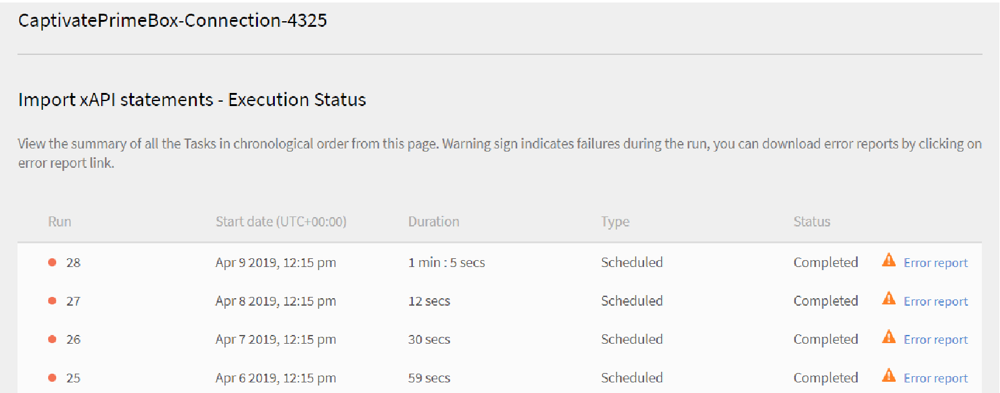
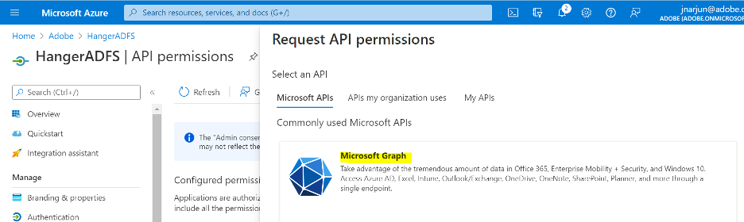
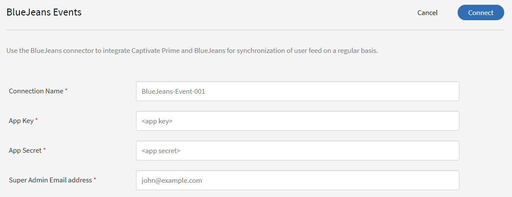

# Learning Manager-Connectors

Unternehmen verfügen über andere Anwendungen und Systeme, die möglicherweise in Learning Manager integriert werden müssen. Connectors sind Dienstprogramme, die die Durchführung datenbasierter Integrationen unterstützen, z. B. das Importieren von Daten in Learning Manager aus externen Systemen.  Es führt auch den Export von Daten in externe Systeme aus Learning Manager durch.

Learning Manager bietet Connectors für Salesforce und FTP. Über den Salesforce-Connector können für die Integration zuständige Administratoren eines Unternehmens ihre Salesforce-Anwendung in Learning Manager integrieren. Als Verantwortlicher für die Integration können Sie außerdem mithilfe des FTP-Connectors Gruppen von Benutzern automatisch in Ihre Unternehmensanwendung importieren.

Learning Manager stellt auch die Lynda-, getAbstract- und Harvard Management System-Konnektoren zur Verfügung. Mit diesen Konnektoren können Teilnehmer auf Kurse von Lynda.com, getAbstract und Harvard ManageMentor zugreifen und diese nutzen.

Lesen Sie weiter, um zu erfahren, wie Sie diese Connectors in Learning Manager konfigurieren und nutzen können.

<!--
>[!NOTE]
>
>**Update:** December 2020 update of Learning Manager
>
>For **FTP**, **Box**, and **Custom FTP** connectors, while exporting Learner Transcript or xAPI, you can also export the data as a **zip** file, for:
>
>* Learner Transcripts
>* xAPI
-->

>[!NOTE]
>
>Mit der Version November 2022 von Adobe Learning Manager hat Zoom die [JWT-Authentifizierung bis Juni 2023](https://marketplace.zoom.us/docs/guides/auth/jwt/). Dementsprechend funktioniert der Zoom-Connector mit JWT noch bis zum erwähnten Datum, aber wir empfehlen Benutzern die Erstellung einer Server-zu-Server-OAuth-App, um die Funktionalität in ihrem Konto zu ersetzen. Alle neuen Verbindungen haben standardmäßig eine Zoom-OAuth-Authentifizierung.

## Salesforce-Connector {#sfconnector}

Der Salesforce-Connector stellt eine Verbindung zwischen den Learning Manager- und Salesforce-Konten her, die die Synchronisierung der Daten ermöglicht. Im Salesforce-Connector stehen die folgenden Funktionen zur Verfügung:

### Attribute zuordnen

Der für die Integration zuständige Administrator kann Spalten in Salesforce wählen und den entsprechenden für Gruppen geeigneten Attributen in Learning Manager zuordnen. Sobald diese Zuordnung abgeschlossen ist, wird dieselbe Zuordnung auch für spätere Benutzerimporte verwendet. Falls der Administrator eine andere Zuordnung zum Importieren von Benutzern benötigt, kann diese neu konfiguriert werden.

### Automatischer Benutzerimport

Beim Importieren von Benutzenden hat der Learning Manager-Administrator die Möglichkeit, Mitarbeiterdaten aus Salesforce abzurufen und automatisch in Learning Manager zu importieren. Durch diese Automatisierung entfällt der manuelle Aufwand beim Erstellen und Hochladen von CSV-Dateien in Learning Manager.

### Automatische Zeitplanung

Die automatische Zeitplanung kann zusammen mit dem automatischen Benutzerimport sehr effizient sein. Der Learning Manager-Administrator kann Zeitpläne einrichten, wie sie für das Unternehmen benötigt werden. Benutzer in der Learning Manager-Anwendung können gemäß dem Zeitplan auf dem neuesten Stand gehalten werden. Die Synchronisierung kann täglich in Learning Manager ausgeführt werden.

### Filtern von Benutzern

Der Learning Manager-Administrator kann die Benutzer vor dem Import filtern. Learning Manager-Administratoren können beispielsweise alle Benutzer in der Hierarchie mit einem oder mehreren bestimmten Managern importieren.

### Salesforce-Connector konfigurieren {#configuresalesforceconnector}

Um Salesforce mit Learning Manager zu integrieren, informieren Sie sich über die entsprechende Vorgehensweise.

#### Voraussetzungen {#prerequisites}

Stellen Sie sicher, dass Sie Ihre Salesforce-Unternehmens-URL zur Hand haben. Wenn der Name Ihrer Organisation beispielsweise **Myorg** klicken, könnte die Salesforce-URL `https://myorg.salesforce.com`. Dies ist die einzige Eingabe, die für die Verbindung des Salesforce-Kontos mit Learning Manager erforderlich ist.

Stellen Sie außerdem sicher, dass Sie über die richtigen Anmeldedaten für die Anmeldung bei dem Konto verfügen.

#### Verbindung erstellen {#createaconnection}

1. Zeigen Sie auf der Startseite von Learning Manager mit der Maus auf das Salesforce-Symbol. Ein Menü wird angezeigt. Wählen Sie im Menü den Eintrag **[!UICONTROL Verbinden]**.

   

   *Connect-Option*

1. Ein Dialogfeld wird angezeigt, in dem Sie zur Eingabe der Unternehmens-URL aufgefordert werden. Klicken **[!UICONTROL Vernetzen]** nach Angabe der URL.
1. Nach einer erfolgreichen Verbindung wird die Seite „Übersicht“ angezeigt.

### Attribute zuordnen {#mapattributes}

Sobald die Verbindung erfolgreich hergestellt wurde, können Sie Salesforce-Spalten zu den entsprechenden Attributen von Learning Manager zuordnen. Dieser Schritt ist obligatorisch.

1. Auf der Zuordnungsseite werden links die Spalten des Learning Managers und rechts die Spalten von Salesforce angezeigt. Wählen Sie den entsprechenden Spaltennamen aus, der dem Spaltennamen des Lern-Managers zugeordnet ist.

   
   *Attribute zuordnen*

   >[!NOTE]
   >
   >Die Spaltendaten des Learning Managers, die auf der linken Seite angezeigt werden, werden von den aktiven Feldern abgerufen. Die **Betriebsleiter** muss dem Feld mit der E-Mail-Adresse zugeordnet werden. Alle Spalten müssen zugeordnet werden, bevor der Connector verwendet werden kann.

1. Klicken **[!UICONTROL Speichern]** nach Abschluss der Zuordnung.
1. Der Connector ist jetzt einsatzbereit. Das Konto, das konfiguriert wurde und als Datenquelle in der Administrator-App angezeigt wird. Der Administrator kann den Import oder die On-Demand-Synchronisierung planen.

## Verwendung des Salesforce-Connector {#usingsalesforceconnector}

Der Salesforce-Connector stellt eine Verbindung zu Salesforce.com her, um die Benutzenden als konfiguriert abzurufen und sie Learning Manager hinzuzufügen.

### Importieren von Benutzern aus Salesforce-Kontakten {#import-salesforce-contacts}

Learning Manager verbessert den Salesforce-Connector, sodass sowohl Kontakte als auch Salesforce-Benutzende abgerufen und automatisch in Learning Manager importiert werden.

Geben Sie auf der Salesforce-Connector-Seite die Salesforce-URL ein und schließen Sie die Authentifizierung ab. Sobald Sie sich authentifiziert haben, können Sie mit dem Importieren von Benutzern oder Kontakten fortfahren. Wenn Sie die Option Kontakte auswählen, geben Sie die Teilmenge der zu importierenden Kontakte an.

Wählen Sie die Salesforce-Spalten aus und ordnen Sie sie den entsprechenden gruppierbaren Attributen des Lern-Managers zu. Sobald die Zuordnung abgeschlossen ist, wird sie auch für spätere Benutzerimporte verwendet.

1. Melden Sie sich bei Salesforce an.
1. Klicken Sie auf der Verbindungsseite auf **[!UICONTROL Importinterne Benutzer]**.

   
   *Interne Benutzer importieren*

1. Im Fenster &quot; **Benutzer importieren** Seite gibt es eine neue Option, Kontakte. Klicken Sie auf das Optionsfeld **Kontakte** angezeigt und Sie sehen die folgenden Optionen.

   
   *Zuordnen der Kontaktattribute*

1. Wenn Sie auf **[!UICONTROL Ja]** können Sie Folgendes ausführen:

   * **Spalte &quot;Kontakte&quot; auswählen:** Wählen Sie das Feld aus, das Sie in den Lern-Manager importieren möchten.
   * **Werte angeben:** Wählen Sie die Werte aus, die das ausgewählte Feld darstellen.

   
   *Werte angeben*

   * Ordnen Sie die Salesforce-Spalten denen des Learning Managers zu.
   * Um den Import zu starten, klicken Sie auf **[!UICONTROL Speichern]**.

1. Wenn Sie auf **[!UICONTROL Nein. Alle Kontakte importieren]** können Sie die Felder direkt zuordnen, ohne die Kontakte zu filtern. Hier importieren Sie alle Kontakte aus Salesforce.
1. Um den Import zu starten, klicken Sie auf **[!UICONTROL Speichern]**.

## Exportieren von Lerndatensätzen

Learning Manager bietet die Möglichkeit, Lerndatensätze (z. B. Transkript, Benutzerbericht und Kenntnisbericht) nach Salesforce zu exportieren. Sie können festlegen, ob die exportierten Daten mit der Tabelle &quot;Benutzer&quot; oder der Tabelle &quot;Kontakte&quot; in Salesforce verknüpft werden sollen.

*Exportieren von Lerndatensätzen*

### Benutzerdefinierte Objekte in Salesforce

Bevor Sie Lerndatensätze aus dem Lern-Manager exportieren, müssen Sie benutzerdefinierte Objekte in Salesforce erstellen. Benutzerdefinierte Objekte sind Objekte, die Sie zum Speichern von unternehmensspezifischen oder branchenspezifischen Informationen erstellen. Weitere Informationen finden Sie unter [Benutzerdefinierte Salesforce-Objekte](https://trailhead.salesforce.com/en/content/learn/modules/data_modeling/objects_intro).

So erstellen Sie die Objekte:

1. Laden Sie die Pakete herunter und installieren Sie sie, um die benutzerdefinierten Objekte zu erstellen.

   * [Paket 1](https://test.salesforce.com/packaging/installPackage.apexp?p0=04t1k0000008WPJ)
   * [Paket 2](https://test.salesforce.com/packaging/installPackage.apexp?p0=04t1k0000008WPT)
   * [Paket 3](https://test.salesforce.com/packaging/installPackage.apexp?p0=04t1k0000008WPi)

1. Benennen Sie die benutzerdefinierten Objekte in Salesforce um.
1. Wählen Sie die Veranstaltungen aus und klicken Sie auf **[!UICONTROL Speichern]**.

**Veranstaltungen verknüpfen mit:** Wählen Sie den zu exportierenden Abschnitt aus (Benutzer oder Kontakt). Wenn Sie das Kontaktobjekt auswählen, werden Benutzer, die im Lern-Manager, aber nicht in Salesforce vorhanden sind, in Salesforce erstellt.

*Option &quot;Veranstaltungen verknüpfen&quot;*

>[!NOTE]
>
>Sie können mehrere Verbindungen in einem Konto erstellen. Eine einzelne Verbindung kann bis zu drei benutzerdefinierte Objekte in Salesforce bereitstellen. Wenn Sie mehrere Verbindungen für ein einziges Salesforce-Konto erstellen möchten, müssen Sie die drei Pakete installieren. Wir bieten Support für bis zu drei Pakete an.
>
>Die Anzahl der zu installierenden Pakete ergibt sich aus der Anzahl der zu erstellenden Verbindungen.

>[!NOTE]
>
>Auf der Seite &quot;Ausführungsstatus&quot; für Salesforce kann die Anzahl der verarbeiteten Datensätze nur über Salesforce überprüft werden. Learning Manager zeigt den Status als abgeschlossen an, auch wenn ein teilweiser Export oder ein Fehler in allen Datensätzen vorliegt, die verarbeitet wurden.

## Installieren des Salesforce-Pakets

Learning Manager bietet ein Salesforce-App-Paket. Nach der Installation und Konfiguration in SFDC können Vertriebsmitarbeiter ihre Schulungen im SFDC-Portal durchführen. Mit dieser App können SFDC-Benutzer neue Schulungen durchsuchen, Empfehlungen anzeigen und diese direkt im SFDC-Portal nutzen. Benutzer erhalten auch die Ankündigungen, die von Administratoren in Form von Mastertiteln direkt in der App im SFDC-Portal gesendet werden.

### Einrichten in der Learning Manager-App

1. Melden Sie sich bei Ihrem Learning Manager-Admin-Konto als Integrationsadministrator an.
1. Klicken **[!UICONTROL Anwendungen]** > **[!UICONTROL Highlights]**.
1. Klicken **[!UICONTROL Salesforce]**.
1. Beachten Sie auf der Salesforce-App-Seite die Anwendungs-ID (auch als Client-ID bezeichnet) und das in der Beschreibung erwähnte Client-Secret.
1. Klicken **[!UICONTROL Genehmigen]** und Ihre App muss erfolgreich genehmigt werden.
1. Klicken **[!UICONTROL Ressourcen für Entwickler]** > **[!UICONTROL Zugriffstoken für Tests und Entwicklung]**.
1. Im Abschnitt &quot;Abrufen des OAuth-Codes&quot; müssen die Client-ID und der Umfang auf &quot;admin:read,admin:write&quot; festgelegt werden. Klicken **[!UICONTROL Senden]**.
1. Geben Sie in „Aktualisierungstoken abrufen&quot; die Client-ID und das Client-Secret ein. Klicken **[!UICONTROL Senden]** und notieren Sie das Aktualisierungstoken.

### Erstellen eines Kontos in der Salesforce-App

1. Erstellen Sie ein Konto auf der Salesforce-Anmeldeseite. Sie müssen ein Salesforce-Konto in der Entwickler- oder Unternehmensversion erstellen.  [Entwickler-Anmelde-URL](https://developer.salesforce.com/signup). Stellen Sie sicher, dass Sie für die Anmeldung bei Salesforce die E-Mail-ID verwenden, die Sie für Learning Manager verwendet haben.
1. Bestätigen Sie Ihr Konto über die Bestätigungs-E-Mail.
1. Erstellen Sie ein Kennwort und melden Sie sich bei Salesforce an.
1. Notieren Sie sich die Salesforce-URL nach der Anmeldung (z. B. site.lightning.force.com).

### Installieren des Learning Manager-Pakets

Wenn Sie das Paket installieren möchten, müssen Sie zunächst das vorhandene Paket in Salesforce löschen. Vor der Deinstallation müssen Sie die Einstellungen aktivieren, wie unten dargestellt. Das Anwenden dieser Einstellungen ist obligatorisch, da Sie das Paket sonst nicht installieren können.

>[!NOTE]
>
>Die Adobe Learning Manager-App wird nur in der Salesforce-Lightning-Ansicht unterstützt.

1. Starten Sie die [Lern-Manager-Paket-URL](https://login.salesforce.com/packaging/installPackage.apexp?p0=04t1k0000008WOQ).
1. Im Dialogfeld &quot; **Anmelden** klicken Sie auf **[!UICONTROL Benutzerdefinierte Domäne verwenden]**.
1. Geben Sie die Paket-URL ein und klicken Sie auf **[!UICONTROL Weiter]**. Auf der Installationsseite muss die Option Nur für Administratoren installieren ausgewählt sein. Ändern Sie diese Option nicht.
1. Klicken **[!UICONTROL Installieren]**. Nachdem das Paket installiert wurde, klicken Sie auf **[!UICONTROL Fertig]**. Sie werden zur Seite „Installierte Pakete“ geleitet, auf der das installierte Adobe Learning Manager-Paket angezeigt wird.
1. Navigieren Sie zum App Launcher (neben „Einrichtung“) und suchen Sie Adobe Learning Manager.
1. Um die App zu konfigurieren, klicken Sie auf **[!UICONTROL Konfigurieren]**.
1. Klicken **[!UICONTROL Neu]** und fügen Sie die folgenden Details hinzu:

   * **Konfigurieren:** Geben Sie den gewünschten Namen ein.
   * **ClientID**: Geben Sie den Wert aus dem ersten Abschnitt ein.
   * **ClientSecret:** Geben Sie den Wert aus dem ersten Abschnitt ein.
   * **Token aktualisieren:** Geben Sie den Wert aus dem ersten Abschnitt ein.
   * **LearningManagerBaseURL:** Die URL der Site, auf der der Learning Manager gehostet wird.

### Hinzufügen von Remotesite-Einstellungen

1. Klicken Sie oben rechts auf der Seite auf **[!UICONTROL Einrichten]**.
1. In **[!UICONTROL Schnellsuche]** nach Remotesite-Einstellungen.
1. Klicken **[!UICONTROL Neue Remotesite]**.
1. Geben Sie die folgenden Details ein:

   * **Remotesite-Name:** Geben Sie den gewünschten Namen ein.
   * **Remotesite-URL:** Die URL der Site, auf der Learning Manager gehostet wird.

1. Starten Sie Learning Manager.

### Benachrichtigungen für die Learning Manager-App aktivieren

1. Klicken Sie in der oberen rechten Ecke auf **[!UICONTROL Einrichten]**.
1. Suchen Sie nach „Benutzerdefinierte Benachrichtigungen“.
1. Klicken **[!UICONTROL Neu]**.
1. Geben Sie die folgenden Details ein:

   1. **Name der benutzerdefinierten Benachrichtigung:** LearningManagerNotification
   1. **API-Name:** LearningManagerNotification

1. Beide auswählen **Desktop** und **Mobil** als unterstützte Kanäle aus.

1. Klicken Sie auf **[!UICONTROL Speichern]**.
1. Um Push-Benachrichtigungen für Mobilgeräte zu aktivieren, führen Sie die folgenden Schritte aus:

   1. Installieren Sie die Salesforce-App für Mobilgeräte auf Ihrem Mobiltelefon.
   1. Melden Sie sich mit Ihren Anmeldedaten bei der App an.
   1. Wechseln zu **Einrichten** > **Einstellungen für die Benachrichtigungszustellung**.
   1. Fügen Sie Salesforce für iOS und Android hinzu.

### Deinstallieren von Learning Manager aus Salesforce

1. Navigieren Sie in der Salesforce-App zu &quot;Installierte Pakete&quot;.
1. Klicken **[!UICONTROL Deinstallieren]**.

## Konfigurieren von Learning Manager für Salesforce-Benutzer

Die Learning Manager-App ist auch für Benutzer verfügbar, die sich in einem beliebigen Salesforce-Konto befinden. Der Salesforce-Administrator kann Benutzer basierend auf den Profilen hinzufügen. Die Salesforce-Profile ähneln denen in Learning Manager. Beispiel: Administrator, Integrationsadministrator, Kursleiter. Der Salesforce-Administrator kann auch ein benutzerdefiniertes Profil erstellen.

Als Salesforce-Administrator können Sie die Profile entweder Benutzern zuweisen oder ein benutzerdefiniertes Profil erstellen.

Beim Installieren des Pakets können Sie den Teilnehmern das Salesforce-Profil zuweisen.

Nach der Installation des Pakets müssen Sie das Profil konfigurieren.

Klicken **[!UICONTROL Konfigurieren]** > **[!UICONTROL Neu]** und fügen Sie dann Folgendes hinzu:

* Konfigurationsname
* Client-ID
* Client-Secret
* LearningManagerBaseURL
* Umleitung deaktivieren

>[!NOTE]
>
>Damit Teilnehmer die Learning Manager-App anzeigen können, müssen Sie die App für alle Teilnehmer aktivieren.

Als Nächstes müssen Sie die Berechtigung für den Zugriff auf die Learning Manager-App bereitstellen.

*Festlegen von Berechtigungen für den Zugriff auf die Learning Manager-App*

Wählen Sie die Benutzer aus und weisen Sie die Berechtigungen entsprechend zu. Die Teilnehmenden können jetzt auf die Learning Manager-App zugreifen.

Wählen Sie jetzt ein Profil aus, z. B. das Standardprofil eines Benutzers, und klicken Sie auf das Profil. Klicken **[!UICONTROL Bearbeiten]** und in der &quot; **Benutzerdefinierte App-Einstellungen** das Kontrollkästchen **Adobe Learning Manager**. Dadurch können Benutzer auf die App zugreifen.

Wählen Sie im Abschnitt **Benutzerdefinierte Registerkarteneinstellungen** in der Dropdownliste **Teilnehmerstartseite** die Option **Standard an**.

Sie müssen die App für alle Profile sichtbar machen.

Klicken **[!UICONTROL Speichern]** und die Teilnehmer, die zu allen Profilen gehören, greifen auf die Learning Manager-App zu.

### Änderungen in Zusammenhang mit Lernplänen

#### Bestehende Verbindungen

Wenn die Option &quot;Lernpfad&quot; im Administratorkonto deaktiviert ist, werden im Bericht keine Zeilen und Spalten hinzugefügt.

Wenn die Option &quot;Lernpfad&quot; im Admin-Konto aktiviert ist, wird die Spalte &quot;Typ&quot; mit &quot;Lernpfad&quot; ausgefüllt, falls Teilnehmer dafür registriert sind.

>[!NOTE]
>
>Wenn das Flag aktiviert ist und Sie eine vorhandene Verbindung verwenden, fehlen möglicherweise einige Datensätze.

#### Neue Verbindungen

Wenn die Option &quot;Lernpfad&quot; im Administratorkonto deaktiviert ist, besteht der Schulungsbericht aus den folgenden Spalten, enthält jedoch keine Daten.

* **Eingebetteter Pfad:** Zeigt den Namen des Lernprogramms an.
* **ID für eingebetteten Pfad:** Zeigt die IDs für das Lernprogramm an.
* **ID des eingebetteten Kurses:** Zeigt die IDs von Kursen an, die sich in einem Lernpfad befinden.

Bei neuen Verbindungen in Konten, bei denen „Lernplan“ aktiviert ist, werden die drei neuen Spalten angezeigt und alle Daten gehen ein.

Darüber hinaus enthält der Bericht den Spaltentyp &quot;Lernpfad (höhere Ebene)&quot; für alle Teilnehmer, die bei einem Lernpfad registriert sind.

In der Spalte &quot;Typ&quot; wird das Lernprogramm in Lernpfad umbenannt. Bei bestehenden Verbindungen wird es keine Änderung geben.

## FTP-Connector für Learning Manager {#ftpconnector}

Mithilfe des FTP-Connectors können Sie Learning Manager in beliebige externe Systeme integrieren, um Datensynchronisierung zu automatisieren. Es wird erwartet, dass externe Systeme Daten in einem CSV-Format exportieren und in den entsprechenden Ordner des Learning Manager-FTP-Kontos platzieren können. Im FTP-Connector stehen die folgenden Funktionen zur Verfügung:

Sie können den Box-Connector auch für die Datenmigration, den Benutzerimport und den Datenexport verwenden. Weitere Informationen finden Sie unter Box-Connector.

### Datenimport {#dataimport}

Beim Importieren von Benutzenden hat der Learning Manager-Administrator die Möglichkeit, Mitarbeiterdaten aus dem Learning Manager-FTP-Dienst abzurufen und automatisch in Learning Manager zu importieren. Mit dieser Funktion können Sie mehrere Systeme integrieren, indem Sie die CSV, die durch diese Systeme generiert wurden, in die entsprechenden Ordner der FTP-Konten platzieren. Learning Manager ruft die CSV-Dateien ab, führt sie zusammen und importiert die Daten gemäß dem Zeitplan. Weitere Informationen finden Sie unter „Planung“.

**Attribute zuordnen**

Der für die Integration zuständige Administrator kann Spalten in CSV-Dateien wählen und den entsprechenden für Gruppen geeigneten Attributen in Learning Manager zuordnen. Diese Zuordnung ist eine einmalige Maßnahme. Nachdem diese Zuordnung vorgenommen wurde, wird dieselbe Zuordnung auch für spätere Benutzerimporte verwendet. Falls der Administrator eine andere Zuordnung zum Importieren von Benutzern benötigt, kann diese neu konfiguriert werden.

#### Daten exportieren {#exportdata}

Durch das Exportieren von Daten können Benutzer Benutzerkenntnisse und Teilnehmertranskripte auf einen FTP exportieren, um diese auf einem beliebigen System von Drittanbietern zu integrieren.

#### Planung {#scheduling}

Der Administrator kann Planungsaufgaben einrichten, wie sie für das Unternehmen gewünscht werden. Die Benutzer in der Learning Manager-Anwendung werden anhand der Planung auf dem neuesten Stand gehalten. Ebenso kann der Integrations-Admin den Export für Kenntnisse planen, damit diese in ein externes System integriert werden. Die Synchronisierung kann täglich in Learning Manager ausgeführt werden.

### Konfigurieren des FTP-Connectors für Learning Manager {#configurecaptivateprimeftpconnector}

Um FTP Connector mit Learning Manager zu integrieren, informieren Sie sich über die entsprechende Vorgehensweise.

#### Verbindung erstellen {#Createaconnection-1}

1. Zeigen Sie auf der Startseite von Learning Manager mit der Maus auf die FTP-Karte/-Miniaturansicht. Ein Menü wird angezeigt. Wählen Sie im Menü den Eintrag **[!UICONTROL Verbinden]**.

   

   *Connect-Option*

1. Ein Dialogfeld wird angezeigt, in dem Sie zur Eingabe der Unternehmens-E-Mail-ID aufgefordert werden. Geben Sie die E-Mail-Adresse der Person an, die für das Verwalten des Learning Manager-FTP-Kontos für das Unternehmen verantwortlich ist. Klicken **[!UICONTROL Vernetzen]** nach Angabe der E-Mail-ID.
1. Learning Manager sendet Ihnen eine E-Mail, in der Sie aufgefordert werden, das Kennwort zurückzusetzen, bevor Sie zum ersten Mal auf FTP zugreifen. Benutzende müssen das Kennwort zurücksetzen und dieses für den Zugriff auf das Learning Manager-FTP-Konto verwenden.

   >[!NOTE]
   >
   >Nur ein Learning Manager-FTP-Konto kann für ein bestimmtes Learning Manager-Konto erstellt werden.

   Auf der Übersichtsseite können Sie den Verbindungsnamen für Ihre Integration angeben. Wählen Sie aus, welche Aktion Sie aus den folgenden Optionen ausführen möchten:

   * Interne Benutzer importieren
   * Import xAPI
   * Benutzerkenntnisse exportieren - Konfigurieren Sie einen Zeitplan
   * Benutzerkenntnisse exportieren - OnDemand
   * Teilnehmertranskripte exportieren - Konfigurieren Sie einen Zeitplan
   * Teilnehmertranskripte exportieren - On Demand

   
   *Exportoptionen*

### Importieren

+++Interner Benutzer

Mit der Option zum Importieren interner Benutzer können Sie die Benutzer bei Bedarf oder nach Planung aus einer CSV-Datei in einen Learning Manager importieren.

+++

+++Attribute zuordnen

Sobald die Verbindung erfolgreich hergestellt wurde, können Sie die Spalten der CSV-Dateien zuordnen. Sie werden im FTP-Ordner den entsprechenden Attributen von Learning Manager zugeordnet. Dieser Schritt ist obligatorisch.

1. Auf der Seite &quot;Attributzuordnung&quot; werden links die erwarteten Spalten des Learning Manager und rechts die Namen der Spalten in der CSV-Datei angezeigt. Auf der rechten Seite wird eventuell zunächst ein leeres Auswahlfeld angezeigt. Importieren Sie eine beliebige Vorlagen-CSV, indem Sie auf **Datei auswählen**.
1. Durch den oben beschriebenen Schritt werden alle Spaltennamen aus der CSV-Datei in die Dropdown-Auswahlliste auf der rechten Seite übernommen. Wählen Sie den entsprechenden Spaltennamen aus, der dem Spaltennamen des Lern-Managers zugeordnet ist.

   >[!NOTE]
   >
   >Das Feld „Manager“ muss dem Feld mit der E-Mail-Adresse zugeordnet werden. Alle Spalten müssen zugeordnet werden, bevor der Connector verwendet werden kann.

1. Klicken **[!UICONTROL Speichern]** nach Abschluss der Zuordnung.

   Der Connector ist jetzt einsatzbereit. Das gerade konfigurierte Konto wird jetzt als Datenquelle innerhalb des Administrator-App angezeigt, sodass der Administrator den Import planen oder die Synchronisierung nach Bedarf starten kann.

+++

+++Verwenden des FTP-Connectors für Learning Manager

1. Die CSV-Dateien aus externen Systemen müssen unter folgendem Pfad abgelegt werden:

   `code $OPERATION$/$OBJECT_TYPE$/$SUB_OBJECT_TYPE$/data.csv`

   >[!NOTE]
   >
   >In der Version vom Juli 2016 ist nur das Importieren von Benutzern zulässig. Um den FTP-Connector daher verwenden zu können, müssen Sie sicherstellen, dass die CSV-Dateien in den folgenden Ordner platziert werden:

   `code Home/import/user/internal/*.csv`

1. Der FTP-Connector übernimmt alle Zeilen aus CSV-Dateien. Es ist wichtig, dass die Zeile, die einem Benutzer in einer CSV entspricht, in keiner anderen CSV erscheint.
1. Alle CSV müssen die in der Zuordnung angegebenen Spalten enthalten.
1. Alle erforderlichen CSV müssen sich in dem Ordner befinden, bevor der Vorgang beginnt.

>[!NOTE]
>
>Beim Importieren von Benutzenden in Learning Manager muss der Administrator auch wissen, wie Benutzende in Learning Manager verwaltet werden. Siehe [User Management-Hilfe](migration-manual.md#usermanagement) , um weitere Informationen zu erhalten.

+++

+++Import xAPI

Mit den xAPI-Importoptionen können Sie den Import von xAPI-Anweisungen von Diensten von Drittanbietern in Learning Manager nach Bedarf planen.

+++

+++Zum Importieren von xAPI erforderliche Konfigurationen

1. Wählen Sie auf der Konfigurationsseite eine vorhandene Konfiguration aus, die in der Konfigurationsliste verfügbar ist, um xAPI-Anweisungen aus der CSV-Datei zu importieren. Klicken Sie auf Bearbeiten oder **Neue Konfiguration hinzufügen** , um zur Seite Importquellen konfigurieren zu navigieren.

   **Konfiguration**

   * Füllen Sie auf der Seite „Importquellen konfigurieren“ die beiden Felder aus, d. h. Name und Name der Quelldatei. Der Quelldateiname sollte mit dem Dateinamen übereinstimmen, der im FTP-Ordner angegeben ist.
   * Klicken Sie auf **[!UICONTROL Speichern]**, um Ihre Änderungen zu speichern.

   
   *Konfigurieren*

   **Filter**

   * Klicken Sie im linken Teilfenster auf **[!UICONTROL Filter]**.
   * Füllen Sie auf der Seite „Import-Filter konfigurieren“ die Felder Name und Bedingungen aus, um die Datensätze herauszufiltern. Klicken Sie auf **[!UICONTROL Neuen Filter hinzufügen]**, um einen weiteren Filter hinzuzufügen. Sie können einen Filter speichern oder löschen, indem Sie in der Spalte „Aktionen“ auf die Option **Speichern** oder **Löschen** klicken.

   
   *Filter*

   **Zuordnung**

   * Klicken Sie im linken Teilfenster auf **[!UICONTROL Zuordnung]**.
   * Auf der Seite „xAPI-Anweisungen-Konfigurations-Mapping importieren“ sehen Sie auf der linken Seite die Pfadnamen der xAPI-JSON-Felder, die den CSV-Spaltennamen zugeordnet werden müssen.
   * Die drei Namen der JSON-Pfadfelder, die den CSV-Spaltennamen zugeordnet werden müssen, lauten standardmäßig **actor.mbox**, **verb.id** und **object.id**. Sie können weitere Felder zur Zuordnung hinzufügen, indem Sie auf **Neue Zuordnung hinzufügen** klicken.

   * Wählen Sie den Typ des Spaltennamens, den Sie mit dem Namen des Json-Feldpfads zuordnen (ob Zeichenfolge, Nummer, Boolescher Typ oder Datumstyp).
   * Klicken Sie auf „Speichern“, nachdem die Zuordnung abgeschlossen wurde. Der xAPI-Import kann jetzt nach „Zeitplan“ oder „On Demand“ importiert werden.

   
   *Zuordnung*

1. Klicken Sie im linken Teilfenster auf **[!UICONTROL Zeitplan konfigurieren]**. Klicken Sie auf **[!UICONTROL Zeitplan aktivieren]**, um den Import von xAPI-Anweisungen zu planen.

   Sie können Startzeit und -datum eingeben und anschließend die Häufigkeit des xAPI-Imports in Tagen festlegen. Aktivieren Sie beispielsweise den xAPI-Import alle 3 Tage.

   
   *Importieren von xAPI-Anweisungen - Zeitplan konfigurieren*

1. Klicken Sie im linken Teilfenster auf **[!UICONTROL Ausführung bei Bedarf]**.

   
   *Importieren Sie xAPI-Anweisungen - On Demand*

1. Außerdem können Sie jederzeit im linken Teilfenster auf **[!UICONTROL Ausführungsstatus]** klicken, um eine Zusammenfassung aller Ausführungen für diesen Connector in chronologischer Reihenfolge anzuzeigen. Sie können das Startdatum und die Dauer der für den Import von xAPI benötigten Zeit anzeigen, die Art des Imports (On Demand oder geplant) und den Status des Imports (ob der Import von xAPI ausgeführt wird oder abgeschlossen wurde oder fehlgeschlagen ist).

   
   *Importieren von xAPI-Anweisungen - Ausführungsstatus*

+++

### Exportieren

+++Skills

Es gibt zwei Möglichkeiten, Berichte zu Benutzerkenntnissen zu exportieren.

**[!UICONTROL Benutzerkenntnisse nach Bedarf]**: Sie können das Startdatum angeben und den Bericht mithilfe der Option exportieren. Der Bericht wird beginnend ab dem eingegebenen Datum bis zum aktuellen Tag extrahiert.

*Export-Option für On Demand*

**[!UICONTROL Benutzerkenntnisse - Konfigurieren]**: Mit dieser Option können Sie die Extrahierung des Berichts planen. Wählen Sie das Kontrollkästchen „Zeitplan aktivieren“ und geben Sie das Startdatum und die Startzeit ein. Sie können das Intervall festlegen, in dem der Bericht generiert und gesendet werden soll.

*Konfigurieren Sie den Export des Berichts*

+++

Um den Exportordner zu öffnen, in dem die exportierten Dateien platziert werden, öffnen Sie den Link zum FTP-Ordner, der auf der Seite &quot;Benutzerkenntnisse&quot; bereitgestellt ist, wie unten gezeigt.

*FTP-Ordner zum Anzeigen von Dateien*

Die automatisch exportierten Dateien befinden sich im Ordner **Start/Export/&#42;FTP_Speicherort&#42;**

Die automatisch exportierten Dateien sind mit dem Titel **skill_achievements_&#42;Datum ab &#42;_bis_&#42;Datum bis&#42;.csv**

*Exportierte CSV-Datei*

+++Teilnehmertranskript

**Konfigurieren**: Mit dieser Option können Sie die Extrahierung des Berichts planen. Wählen Sie das Kontrollkästchen „Zeitplan aktivieren“ und geben Sie das Startdatum und die Startzeit ein. Sie können das Intervall festlegen, in dem der Bericht generiert und gesendet werden soll.

+++

Um den Exportordner zu öffnen, in dem die exportierten Dateien in Ihrem FTP-Speicherort platziert werden, öffnen Sie den Link zum FTP-Ordner, der auf der Seite &quot;Teilnehmertranskripte&quot; bereitgestellt ist, wie unten gezeigt.

Die automatisch exportierten Dateien befinden sich im Ordner **Start/Export/&#42;FTP_Speicherort&#42;**

Die automatisch exportierten Dateien sind mit dem Titel **learner_transcript_&#42;Datum ab &#42;_bis_&#42;Datum bis&#42;.csv**

### Unterstützung für manuelle CSV-Felder {#supportformanualcsvfields}

Beim Importieren von Benutzerdaten über FTP muss ein Administrator das gesamte aktive Feld im System dem entsprechenden Feld im CSV zuordnen.

Dies ist für alle aktiven CSV-Felder obligatorisch. Bei manuellen aktiven Feldern kann der Integrationsadministrator die Option **DontImportFromSource** auswählen.

Wenn Sie diese Option auswählen, werden die manuellen aktiven Feldwerte nicht mit CSV-Import ausgefüllt. Die vom Teilnehmer bereitgestellten Werte bleiben intakt.

>[!NOTE]
>
>Bei der Zuordnung, wenn die Option **DontImportFromSource** für ein CSV-aktives Feld ausgewählt ist, wird dieses Feld aus dem System gelöscht.

*FTP-Connector für aktive Felder*

## Lynda-Connector {#lyndaconnector}

Der Lynda-Connector kann von Unternehmenskunden von Lynda.com verwendet werden, die möchten, dass ihre Teilnehmenden Lynda-Kurse innerhalb von Learning Manager entdecken und nutzen. Der Connector kann so konfiguriert werden, dass er regelmäßig Kurse von Lynda.com mit Ihrem API-Schlüssel aufruft. Wenn ein Kurs in Learning Manager erstellt wurde, können Benutzende nach ihm suchen und ihn dann nutzen. Der Teilnehmerfortschritt kann dann in Learning Manager verfolgt werden.

### Konfigurieren des Lynda-Connectors {#configurethelyndaconnector}

1. Klicken Sie im integrierten Admin-Dashboard auf „Lynda“.

   Sie sehen die Kachel mit drei Optionen: „Erste Schritte“, „Verbinden“ und „Verbindungen verwalten“.

1. Wenn Sie den Lynda-Connector zum ersten Mal konfigurieren, klicken Sie auf „Verbinden“.

   <!--Configure the Exavault FTP account before you configure this connector.-->

1. Geben Sie auf der Verbindungsseite einen Namen für Ihren Connector ein. Geben Sie den App-Schlüssel und den geheimen Schlüssel für Ihre Verbindung ein.

   >[!NOTE]
   >
   >Wenden Sie sich an Ihren Anbieter, um den App-Schlüssel und den geheimen Schlüssel zu erhalten.

1. Klicken Sie auf „Speichern“.

   Die Konfiguration wird gespeichert und die Lynda-Verbindung für Ihr Konto wurde hinzugefügt. Sie können jetzt auf der Startseite auf &quot;Verbindungen verwalten&quot; klicken und Ihre Konfiguration jederzeit bearbeiten.

1. Wenn Sie bereits über eine Verbindung verfügen, klicken Sie auf „Verbindungen verwalten“, um alle Ihre Verbindungen anzuzeigen.

   >[!NOTE]
   >
   >Die Migrationsfunktion muss für Ihr Konto aktiviert werden, bevor Sie diesen Connector konfigurieren.

1. Klicken Sie auf die Verbindung, die Sie bearbeiten möchten.
1. Klicken Sie im linken Teilfenster auf **[!UICONTROL Konfigurieren]**. Führen Sie einen der folgenden Schritte aus:

   * Über dieses Fenster können Sie die Details Ihres Kontos sowie den Synchronisierungszeitplan anzeigen oder bearbeiten. Zum Aktivieren dieses Kontos müssen Sie das Kontrollkästchen „Verbindung aktivieren“ aktivieren.
   * Klicken Sie auf „Bearbeiten“ und bearbeiten Sie Ihre Anmeldedaten. Klicken Sie auf „Zurücksetzen“, um Ihre Änderungen in diesem Feld rückgängig zu machen.
   * Klicken Sie „Plan aktivieren“, um die Synchronisierung zu planen. Sie können Startzeit und -datum eingeben und anschließend die Häufigkeit der Synchronisierung in Tagen festlegen, um beispielsweise eine Synchronisierung alle drei Tage zu aktivieren.

   Klicken Sie auf **[!UICONTROL Speichern]**, um Ihre Änderungen zu speichern.

   

   *Konfigurieren Sie den Lynda-Connector für Learning Manager*

1. Klicken Sie im linken Teilfenster auf „On-demand-Ausführung“. Mithilfe dieser Option können Sie Benutzer-Feeds und andere relevante Daten aus Lynda importieren. Geben Sie das Startdatum für die On-Demand-Ausführung ein und klicken Sie auf „Ausführen“, um die Synchronisierung auszuführen. Alle Daten ab dem Startdatum bis zum aktuellen Tag werden importiert.

   * Sie können auf „Zugriff auf Learning Manager während der Ausführung deaktivieren“ klicken, um die Anwendung während der Synchronisierung auszusetzen.
   * Wenn Sie auf „Zugriff auf Learning Manager während der Ausführung aktivieren“ klicken, wird der Dienst während der Synchronisierung nicht unterbrochen.

   

   *Führen Sie On-Demand-Ausführung für den Lynda-Connector durch*

1. Außerdem können Sie jederzeit im linken Teilfenster auf „Ausführungsstatus“ klicken, um eine Zusammenfassung aller Ausführungen für diesen Connector in chronologischer Reihenfolge anzuzeigen. Sie können das Startdatum und die Dauer der Synchronisierung anzeigen sowie die Art (ob es sich um eine On-Demand-Synchronisierung handelt) und den Status (ob die Synchronisierung läuft oder abgeschlossen ist) der Synchronisierung.

   >[!NOTE]
   >
   >Wenn Sie eine Verbindung löschen und neu erstellen, werden die vorherigen Ausführungen für den Connector wieder angezeigt. Sie können alle vor dem Löschen der Verbindung erfolgten Ausführungen anzeigen.

   Eine Wiederholung ist nur für die letzte Synchronisierung möglich.

   

   *Zeigen Sie die Zusammenfassung aller Ausführungen an und klicken Sie auf Ausführungsstatus.*

## getAbstract-Connector {#getabstractconnector}

Der getAbstract-Connector kann von Unternehmenskunden von getAbstract.com verwendet werden, die möchten, dass ihre Teilnehmer getAbstract-Kurse entdecken und nutzen. Der Connector kann so konfiguriert werden, dass er regelmäßig Nutzungsdaten aufruft, je nachdem welche Teilnehmerabschlussdatensätze in Learning Manager erstellt werden. Lesen Sie weiter, um zu erfahren, wie dieser Connector in Learning Manager konfiguriert werden kann.

### getAbstract-Connector konfigurieren {#configurethegetabstractconnector}

1. Klicken Sie im integrierten Admin-Dashboard auf „getAbstract“.

   Sie sehen auf der Kachel drei Optionen: „Erste Schritte“, „Verbinden“ und „Verbindungen verwalten“.

1. Wenn Sie den getAbstract-Connector zum ersten Mal konfigurieren, klicken Sie auf „Verbinden“.

   <!--Configure the Exavault FTP account before you configure this connector.

   Ensure that you share this FTP credentials with your content provider to access the feeds.-->

1. Geben Sie einen Namen für die Verbindung im Feld „Verbindungsname“ ein.

   Geben Sie die entsprechenden Schlüssel in die Felder „Client-ID“ und in „Client-Secret“ ein. Möglicherweise müssen Sie sich an den Hersteller wenden, um die entsprechenden Schlüssel für diesen Connector zu erhalten.

   Diese Schlüssel sind erforderlich, um die Kurs-Metadaten für die vom Client genutzten Kurse abzurufen.

1. Wenn Sie bereits über eine Verbindung verfügen, klicken Sie auf der Startseite auf „getAbstract“ > „Verbindungen verwalten“, um Ihre vorhandene Konfiguration anzuzeigen und zu bearbeiten.

   >[!NOTE]
   >
   >Die Migrationsfunktion muss für Ihr Konto aktiviert werden, bevor Sie diesen Connector konfigurieren.

1. Klicken Sie auf die Verbindung, deren Konfiguration Sie anzeigen oder bearbeiten möchten.

   

   *Konfigurieren Sie den getAbstract-Connector für Learning Manager*

1. Klicken Sie im linken Teilfenster auf &quot;Konfigurieren&quot;. Führen Sie einen der folgenden Schritte aus:

   * Über dieses Fenster können Sie die Details Ihres Kontos sowie den Synchronisierungszeitplan anzeigen oder bearbeiten. Zum Aktivieren dieses Kontos müssen Sie das Kontrollkästchen „Verbindung aktivieren“ aktivieren.
   * Klicken Sie auf „Bearbeiten“ und bearbeiten Sie Ihre Anmeldedaten. Klicken Sie auf „Zurücksetzen“, um Ihre Änderungen in diesem Feld rückgängig zu machen.
   * Klicken Sie „Plan aktivieren“, um die Synchronisierung zu planen. Sie können Startzeit und -datum eingeben und anschließend die Häufigkeit der Synchronisierung in Tagen festlegen, um beispielsweise eine Synchronisierung alle drei Tage zu aktivieren.

1. Klicken Sie auf **[!UICONTROL Speichern]**.

   Die Konfiguration wird gespeichert und die getAbstract-Verbindung für Ihr Konto wird hinzugefügt.

1. Klicken Sie im linken Teilfenster auf „On-demand-Ausführung“. Mithilfe dieser Option können Sie Benutzer-Feeds und andere relevante Daten aus getAbstract importieren. Geben Sie das Startdatum für die On-Demand-Ausführung ein und klicken Sie auf „Ausführen“, um die Synchronisierung auszuführen. Alle Daten ab dem Startdatum bis zum aktuellen Tag werden importiert.

   * Sie können auf „Zugriff auf Learning Manager während der Ausführung deaktivieren“ klicken, um die Anwendung während der Synchronisierung auszusetzen.
   * Wenn Sie auf „Zugriff auf Learning Manager während der Ausführung aktivieren“ klicken, wird der Dienst während der Synchronisierung nicht unterbrochen.

1. Außerdem können Sie jederzeit im linken Teilfenster auf „Ausführungsstatus“ klicken, um eine Zusammenfassung aller Ausführungen für diesen Connector in chronologischer Reihenfolge anzuzeigen. Sie können das Startdatum und die Dauer der Synchronisierung anzeigen sowie die Art (ob es sich um eine On-Demand-Synchronisierung handelt) und den Status (ob die Synchronisierung läuft oder abgeschlossen ist) der Synchronisierung.

   >[!NOTE]
   >
   >Wenn Sie eine Verbindung löschen und neu erstellen, werden die vorherigen Ausführungen für den Connector wieder angezeigt. Sie können alle vor dem Löschen der Verbindung erfolgten Ausführungen anzeigen.

   Eine Wiederholung ist nur für die letzte Synchronisierung möglich.

   Für jede Art von Synchronisierung gilt: Damit sie funktioniert, muss der Benutzer-Feed für die in der Synchronisierung angegebenen Daren im FTP-Ordner für getAbstract FTP vorhanden sein.

   Das folgende Excel-Arbeitsblatt ist ein Beispiel für einen Benutzer-Feed aus getAbstract. Der Dateiname muss dem folgenden Format entsprechen: **report_export_yyyy_MM_dd_HHmmss.xlsx** oder **report_export_yyyy_MM_dd.xlsx**.
   [getAbstract-Beispiel für Benutzer-Feed-Excel-Tabelle](assets/report-export-20170401175342.xlsx)

## Harvard ManageMentor-Connector {#hmmconnector}

Der Harvard ManageMentor-Connector kann von Unternehmenskunden von Harvard ManageMentor verwendet werden, die möchten, dass ihre Teilnehmer Harvard ManageMentor-Kurse entdecken und nutzen. Mit dem Connector können Sie Kurse in Learning Manager erstellen, und sie können dazu konfiguriert werden, regelmäßig Daten zum Teilnehmerfortschritt abzurufen. Um diesen Connector sich zu konfigurieren, müssen Sie folgende Schritte durchführen:

### Harvard ManageMentor-Connector konfigurieren {#configuretheharvardmanagermentorconnector}

1. Klicken Sie im integrierten Admin-Dashboard auf „Harvard ManageMentor“.

   Sie sehen auf der Kachel drei Optionen: „Erste Schritte“, „Verbinden“ und „Verbindungen verwalten“.

1. Wenn Sie den Harvard ManageMentor-Connector zum ersten Mal konfigurieren, klicken Sie auf „Verbinden“.

   <!--Configure the Exavault FTP account before you configure this connector.

   Ensure that you share this FTP credentials with your content provider to access the feeds.-->

1. Geben Sie einen Namen für die Verbindung im Feld „Verbindungsname“ ein. Klicken Sie auf „Verbinden“, um diese Verbindung zu speichern.
1. Wenn Sie bereits über eine Verbindung verfügen, klicken Sie auf der Startseite auf „Harvard ManageMentor“ > „Verbindungen verwalten“. Klicken Sie auf die gewünschte Verbindung, um die vorhandene Konfiguration zu bearbeiten.

   >[!NOTE]
   >
   >Die Migrationsfunktion muss für Ihr Konto aktiviert werden, bevor Sie diesen Connector konfigurieren.

   

   *Konfigurieren Sie den HarvardManage-Mentor-Connector für Learning Manager*

1. Klicken Sie im linken Teilfenster auf &quot;Konfigurieren&quot;. Führen Sie einen der folgenden Schritte aus:

   * Über dieses Fenster können Sie die Details Ihres Kontos sowie den Synchronisierungszeitplan anzeigen oder bearbeiten. Zum Aktivieren dieses Kontos müssen Sie das Kontrollkästchen „Verbindung aktivieren“ aktivieren.
   * Klicken Sie „Plan aktivieren“, um die Synchronisierung zu planen. Sie können Startzeit und -datum eingeben und anschließend die Häufigkeit der Synchronisierung in Tagen festlegen, um beispielsweise eine Synchronisierung alle drei Tage zu aktivieren.

1. Klicken Sie im linken Teilfenster auf „On-demand-Ausführung“. Mithilfe dieser Option können Sie Benutzer-Feeds und andere relevante Daten aus Harvard ManageMentor importieren. Geben Sie das Startdatum für die On-Demand-Ausführung ein und klicken Sie auf „Ausführen“, um die Synchronisierung auszuführen. Für diese Verbindung werden alle Daten seit dem Startdatum importiert.

   * Sie können auf „Zugriff auf Learning Manager während der Ausführung deaktivieren“ klicken, um die Anwendung während der Synchronisierung auszusetzen.
   * Wenn Sie auf „Zugriff auf Learning Manager während der Ausführung aktivieren“ klicken, wird der Dienst während der Synchronisierung nicht unterbrochen.

   Wenn Sie die Synchronisierung alle paar Tage automatisieren möchten, geben Sie die Anzahl der Tage in das Feld „Anzahl der Tage wiederholen“ ein. Durch die Synchronisierung wird gewährleistet, dass Ihr Konto mit der aktuellen Version der Abstrakte und Übersichten von Harvard ManageMentor aktualisiert wird.

1. Außerdem können Sie jederzeit im linken Teilfenster auf „Ausführungsstatus“ klicken, um eine Zusammenfassung aller Ausführungen für diesen Connector in chronologischer Reihenfolge anzuzeigen. Sie können das Startdatum und die Dauer der Synchronisierung anzeigen sowie die Art (ob es sich um eine On-Demand-Synchronisierung handelt) und den Status (ob die Synchronisierung läuft oder abgeschlossen ist) der Synchronisierung.

   >[!NOTE]
   >
   >Wenn Sie eine Verbindung löschen und neu erstellen, werden die vorherigen Ausführungen für den Connector wieder angezeigt. Sie können alle vor dem Löschen der Verbindung erfolgten Ausführungen anzeigen.

   Eine Wiederholung ist nur für die letzte Synchronisierung möglich.

   Damit die Synchronisierung erfolgreich ausgeführt werden kann, muss mindestens eine der folgenden Dateien im FTP-Ordner für Harvard ManageMentor vorhanden sein:

   hmm12_metadata.xlsx: Diese Datei enthält die Kurs-Metadaten für den Harvard ManageMentor-Connector. Achten Sie darauf, beim Hochladen der Datei die Namenskonvention zu befolgen.

   client_hmm12_20150125.xlsx: Dies ist der Benutzer-Feed für den Harvard ManageMentor-Connector. Die zu befolgende Dateinamenskonvention lautet **client_hmm12_jjjjMMtt.xlsx.**

   Die beiden folgenden Beispieldateien zeigen einen Benutzer-Feed und einen Kurs-Feed für diesen Connector:

   * [Datei mit Kurs-Metadaten für den Harvard ManageMentor-Connector](assets/hmm12-metadata.xlsx)
   * [Benutzer-Feed für den Harvard ManageMentor-Connector](assets/client-hmm12-20170304.xlsx)

## Workday Connector {#workdayconnector}

Mithilfe des Workday-Connectors können Sie Learning Manager in den Workday-Mandanten integrieren, um die Datensynchronisierung zu automatisieren.

### Importieren

#### Attribute zuordnen

Der für die Integration zuständige Administrator kann Spalten in Workday auswählen und den entsprechenden für Gruppen geeigneten Attributen des Lern-Managers zuordnen. Sobald diese Zuordnung abgeschlossen ist, wird dieselbe Zuordnung auch für spätere Benutzerimporte verwendet. Falls der Administrator eine andere Zuordnung zum Importieren von Benutzern benötigt, kann diese neu konfiguriert werden.

#### Automatischer Benutzerimport

Beim Importieren von Benutzenden hat der Learning Manager-Administrator die Möglichkeit, Mitarbeiterdaten aus Workday abzurufen und automatisch in Learning Manager zu importieren.

#### Filtern von Benutzern

Der Learning Manager-Administrator kann die Benutzer vor dem Import filtern. Learning Manager-Administratoren können beispielsweise alle Benutzer in der Hierarchie mit einem oder mehreren bestimmten Managern importieren.

### Exportieren

Mit dem Export für die Benutzerkenntnisse können Benutzer Kenntnisse in Workday automatisch exportieren.

>[!NOTE]
>
>Kenntnisse von mehreren Learning Manager-Konten können nicht gleichzeitig mit demselben Workday-Konto exportiert werden.

### Planung {#Scheduling-1}

Der Administrator kann Planungsaufgaben einrichten, wie sie für das Unternehmen gewünscht werden. Die Benutzer in der Learning Manager-Anwendung werden anhand der Planung auf dem neuesten Stand gehalten. Ebenso kann der Integrations-Admin den Export für Kenntnisse planen, damit diese in ein externes System integriert werden. Die Synchronisierung kann täglich in Learning Manager ausgeführt werden.

### Workday Connector konfigurieren {#configureworkdayconnector}

>[!PREREQUISITES]
>
>Bitten Sie den Workday-Administrator Ihres Unternehmens, einen Integration System User (ISU) mit den Berechtigungen zu erstellen, die im Dokument ISU_Permissions definiert sind. Laden Sie eine Kopie unter dem nachfolgenden Link herunter.

[Laden Sie eine Kopie der Sicherheit des Integration System User (ISU) herunter.](assets/isu-permissions-v1.pdf) Um Workday Connector mit Learning Manager zu integrieren, informieren Sie sich über die entsprechende Vorgehensweise.

1. Bewegen Sie den Mauszeiger auf der Startseite des Learning Manager über die Kachel Workday. Ein Menü wird angezeigt. Wählen Sie im Menü den Eintrag **[!UICONTROL Verbinden]**.

   

   *Workday tile*

1. Ein Dialogfeld wird angezeigt. Geben Sie die Anmeldeinformationen für die neue Verbindung ein. Bevor Sie die Verbindung herstellen, füllen Sie die folgenden Felder aus.

   * Verbindungsname: Geben Sie einen Verbindungsnamen Ihrer Wahl an.
   * Host-URL: Integrationsadministrator kann die Host URL-Details vom entsprechenden Workday-Admin erhalten.
   * Mandant: Der Mandant ist für Ihr Unternehmen intern. Ihr Workday-Admin stellt Ihnen die Tenant-Details bereit.
   * Benutzername und Kennwort: Der Workday-Administrator erstellt einen integrierten Systembenutzer (ISU) mit den erforderlichen Sicherheitsberechtigungen und teilt diese dann mit dem Integrationsadministrator.

>[!NOTE]
>
>   Learning Manager verwendet Version 28.1 der Workday API.

*Workday Connector konfigurieren*

1. Klicken Sie auf „Verbinden“, nachdem Sie diese Daten in allen entsprechenden Feldern eingegeben haben.

   >[!NOTE]
   >
   >Sie können auch mehrere Workday-Verbindungen haben, die mit Ihrem Learning Manager-Konto synchronisiert sind.

Auf der Übersichtsseite können Sie den Verbindungsnamen für Ihre Integration angeben. Wählen Sie aus, welche Aktion Sie aus den folgenden Optionen erfassen möchten:

* Importinterne Benutzer
* Benutzerkenntnisse exportieren - Konfigurieren Sie einen Zeitplan
* Benutzerkenntnisse exportieren - OnDemand

*Überblick über Workday*

### Importieren

#### Attribute zuordnen {#MapAttributes-1}

Sie können den Workday-Connector verwenden, um Learning Manager und Wordkday zu integrieren, sodass die Datensynchronisierung automatisiert wird. Sie können alle aktiven Benutzer aus Workday in Learning Manager importieren. Benutzer können aus verschiedenen Datenquellen einschließlich FTP und Salesforce importiert werden.

Die Benutzerattribute von Learning Manager und Workday müssen zugeordnet werden, bevor Benutzende importiert werden. Verwenden Sie auf der Übersichtsseite verwenden Sie die interne Benutzeroption unter „Importieren“, um die Zuordnungsattribute bereitzustellen.

Geben Sie die Anmeldeinformationen für Adobe-Learning-Manager in der Spalte &quot;Adobe-Learning-Manager&quot; ein. Verwenden Sie die Dropdown-Menüs, um die korrekten Anmeldedaten für die Spalten unter Workday auszuwählen.

>[!NOTE]
>
>Derzeit unterstützt Learning Manager den Import von 44 Benutzerattributen von Workday. Fügen Sie mehr Attribute mit aktiven Felder in Learning Manager hinzu.

*Attribute zuordnen*

Wählen Sie das **Eventualarbeitskräfte ausschließen** , um zu verhindern, dass die unter einem Manager verfügbaren temporären Arbeitskräfte importiert werden.

Workday hat vier Hierarchieebenen, Learning Manager zwei. Die vier Ebenen in Workday sind Kenntnisprofilkategorie, Kenntnisprofil, Kenntniselementkategorie und Kenntniselement. Ihr Kenntnisname und Ihre Kenntnisstufe vom Lernmanager zusammen werden in Workday unter dem Kenntniselement zugeordnet.

>[!NOTE]
>
>Sie können weitere Workday-Attribute hinzufügen. Wenden Sie sich an Ihren CSAM, um die hinzugefügten Attribute zu erhalten.

+++Liste der unterstützten Workday-Attribute

wd:User_ID\
wd:Worker_ID\
wd:Personal_Data.wd:Name_Data.wd:Preferred_Name_Data.wd:Name_Detail_Data.@wd:Formatted_Name\
wd:Personal_Data.wd:Name_Data.wd:Legal_Name_Data.wd:Name_Detail_Data.@wd:Formatted_Name\
wd:Personal_Data.wd:Name_Data.wd:Legal_Name_Data.wd:Name_Detail_Data.wd:Prefix_Data.wd:Title_Descriptor\
wd:Personal_Data.wd:Name_Data.wd:Preferred_Name_Data.wd:Name_Detail_Data.wd:Prefix_Data.wd:Title_Descriptor\
wd:Personal_Data.wd:Name_Data.wd:Preferred_Name_Data.wd:Name_Detail_Data.wd:First_Name\
wd:Personal_Data.wd:Name_Data.wd:Preferred_Name_Data.wd:Name_Detail_Data.wd:Last_Name\
wd:Personal_Data.wd:Name_Data.wd:Legal_Name_Data.wd:Name_Detail_Data.wd:First_Name\
wd:Personal_Data.wd:Name_Data.wd:Legal_Name_Data.wd:Name_Detail_Data.wd:Last_Name\
wd:Personal_Data.wd:Contact_Data.wd:Address_Data.0.@wd:Formatted_Address\
wd:Personal_Data.wd:Contact_Data.wd:Address_Data.0.wd:Postal_Code\
wd:Personal_Data.wd:Contact_Data.wd:Address_Data.0.wd:Country_Region_Descriptor\
wd:Personal_Data.wd:Contact_Data.wd:Phone_Data.0.@wd:formatted_phone\
wd:Personal_Data.wd:Contact_Data.wd:Phone_Data.0.wd:Country_ISO_Code\
wd:Personal_Data.wd:Contact_Data.wd:Phone_Data.0.wd:International_Phone_Code\
wd:Personal_Data.wd:Contact_Data.wd:Phone_Data.0.wd:Phone_Number\
wd:Personal_Data.wd:Primary_Nationality_Reference.wd:ID.1.$\
wd:Personal_Data.wd:Gender_Reference.wd:ID.1.$\
wd:Personal_Data.wd:Identification_Data.wd:National_ID.0.wd:National_ID_Data.wd:ID\
wd:Personal_Data.wd:Identification_Data.wd:Custom_ID.0.wd:Custom_ID_Data.wd:ID\
wd:User_Account_Data.wd:Default_Display_Language_Reference.wd:ID.1.$\
wd:Role_Data.wd:Organization_Role_Data.wd:Organization_Role.0.wd:Organization_Role_Reference.wd:ID.1.$\
wd:Employment_Data.wd:Worker_Job_Data.0.wd:Position_Data.wd:Position_Title\
wd:Employment_Data.wd:Worker_Job_Data.0.wd:Position_Data.wd:Business_Title\
wd:Employment_Data.wd:Worker_Job_Data.0.wd:Position_Data.wd:Business_Site_Summary_Data.wd:Name\
wd:Employment_Data.wd:Worker_Job_Data.0.wd:Position_Data.wd:Business_Site_Summary_Data.wd:Address_Data.@wd:Formatted_Address\
wd:Employment_Data.wd:Worker_Job_Data.0.wd:Position_Data.wd:Job_Classification_Summary_Data.0.wd:Job_Classification_Reference.wd:ID.1.$\
wd:Employment_Data.wd:Worker_Job_Data.0.wd:Position_Data.wd:Job_Classification_Summary_Data.0.wd:Job_Group_Reference.wd:ID.1.$\
wd:Employment_Data.wd:Worker_Job_Data.0.wd:Position_Data.wd:Work_Space__Reference.wd:ID.1.$\
wd:Employment_Data.wd:Worker_Status_Data.wd:Active\
wd:Employment_Data.wd:Worker_Status_Data.wd:Active_Status_Date\
wd:Employment_Data.wd:Worker_Status_Data.wd:Hire_Date\
wd:Employment_Data.wd:Worker_Status_Data.wd:Original_Hire_Date\
wd:Employment_Data.wd:Worker_Status_Data.wd:Retired\
wd:Employment_Data.wd:Worker_Status_Data.wd:Retirement_Date\
wd:Employment_Data.wd:Worker_Status_Data.wd:Beendet\
wd:Employment_Data.wd:Worker_Status_Data.wd:Termination_Date\
wd:Employment_Data.wd:Worker_Status_Data.wd:Termination_Last_Day_of_Work\
wd:Organization_Data.wd:Worker_Organization_Data.0.wd:Organization_Data.wd:Organization_Code\
wd:Organization_Data.wd:Worker_Organization_Data.0.wd:Organization_Data.wd:Organization_Name\
wd:Organization_Data.wd:Worker_Organization_Data.0.wd:Organization_Data.wd:Organization_Type_Reference.wd:ID.1.$\
wd:Organization_Data.wd:Worker_Organization_Data.0.wd:Organization_Data.wd:Organization_Subtype_Reference.wd:ID.1.$\
wd:Qualification_Data.wd:Education.0.wd:School_Name\
wd:Qualification_Data.wd:External_Job_History.0.wd:Job_History_Data.wd:Job_Title\
wd:Qualification_Data.wd:External_Job_History.0.wd:Job_History_Data.wd:Company\
wd:Management_Chain_Data.wd:Worker_Supervisory_Management_Chain_Data.wd:Management_Chain_Data.0.wd:Manager.Employee_ID

+++

### Exportieren

Sie können alle Kenntnisse exportieren, die von einem Learning Manager-Benutzer in Workday erreicht wurden. Es werden nur alle aktiven Benutzerkenntnisse exportiert. Learning Manager exportiert keine veralteten Kenntnisse. Sie können auch mehrere Learning Manager verbinden\
Konten mit demselben Workday Connector verknüpfen. Wenn die Namen der Kenntnisse in zwei Learning Manager-Konten identisch sind, werden sie denselben Kenntnissen in Workday zugeordnet. Vor dem Aktualisieren der Kenntnisse in Workday sollten alle Kenntnisnamen in allen Learning Manager-Konten aktualisiert werden, im Fall, dass zwei Learning Manager-Konten dasselbe Workday-Konto verwenden.

+++Benutzerkenntnisse - Konfigurieren

Mit dieser Option können Sie die Extrahierung des Berichts planen. Stellen Sie sicher, dass das Kontrollkästchen „Export für die Benutzerkenntnisse über diese Verbindung“ aktiviert ist. Wählen Sie das Kontrollkästchen „Zeitplan aktivieren“ und geben Sie das Startdatum und die Startzeit ein. Sie können das Intervall festlegen, in dem der Bericht generiert und gesendet werden soll. Wählen Sie die Option „Zeitplan aktivieren“ und geben Sie das Startdatum, die Uhrzeit und die Wiederholung nach n Tagen ein. Wenn Sie fertig sind, klicken Sie auf „Speichern“.

*Konfigurieren Sie den Bericht zu Benutzerkenntnissen*

+++

+++Benutzerkenntnisse - On Demand

Sie können das Startdatum angeben und den Bericht mithilfe der Option exportieren. Der Bericht wird aus dem eingegebenen Datum extrahiert. Geben Sie das Datum ein, von dem Sie mit der Generierung des Berichts beginnen möchten, und klicken Sie auf „Ausführen“.

*On-Demand-Benutzerkenntnisbericht*

+++

+++Benutzerkenntnisse - Ausführungsstatus

Hier können Sie die Zusammenfassung aller Aufgaben anzeigen und ihren Statusbericht abrufen. Sie können Fehlermeldungen herunterladen, indem Sie auf den Link zu den Fehlermeldungen klicken.

*Benutzerkenntnisse - Ausführungsbericht*

+++

## miniOrange Connector {#miniorangeconnector}

Mithilfe des miniOrange-Connectors können Sie Learning Manager in den miniOrange-Mandanten integrieren, um die Datensynchronisierung zu automatisieren.

### Importieren

#### Attribute zuordnen

Der für die Integration zuständige Administrator kann miniOrange-Attribute auswählen und den entsprechenden für Gruppen geeigneten Attributen des Learning Managers zuordnen. Sobald diese Zuordnung abgeschlossen ist, wird dieselbe Zuordnung auch für spätere Benutzerimporte verwendet. Falls der Administrator eine andere Zuordnung zum Importieren von Benutzern benötigt, kann diese neu konfiguriert werden.

#### Automatischer Benutzerimport

Beim Importieren von Benutzern hat der Learning Manager-Administrator die Möglichkeit, Mitarbeiterdaten aus miniOrange abzurufen und automatisch in Learning Manager zu importieren.

#### Filtern von Benutzern

Der Learning Manager-Administrator kann die Benutzer vor dem Import filtern. Learning Manager-Administratoren können beispielsweise alle Benutzer in der Hierarchie mit einem oder mehreren bestimmten Managern importieren.

Wenden Sie sich zum Einrichten des miniOrange-Connectors an das Learning Manager-CSM-Team.

### miniOrange Connector konfigurieren {#configureminiorangeconnector}

1. Bewegen Sie die Maus auf der Startseite des Lernmanagers über die miniOrange-Karte/das Miniaturbild. Ein Menü wird angezeigt. Klicken  **[!UICONTROL Vernetzen]** im Menü auswählen.

   

   *miniOrange Steckerplatte*

1. Klicken **[!UICONTROL Vernetzen]** , um eine neue Verbindung herzustellen. Die miniOrange Connector-Seite wird angezeigt. Geben Sie die Details Ihres Kontos ein, das Sie zuordnen möchten.

   

   *Erstellen einer Verbindung*

1. Wenn Sie miniOrnage-Benutzer direkt als internen Learning Manager-Benutzer importieren möchten, verwenden Sie das Dialogfeld &quot; **[!UICONTROL Importinterne Benutzer]** aus.

   

   *Interne Benutzer importieren*

1. Auf der Zuordnungsseite werden links die Spalten des Learning Managers und rechts die Spalten miniOrnage angezeigt. Wählen Sie den entsprechenden Spaltennamen aus, der dem Spaltennamen des Lern-Managers zugeordnet ist.

   

   *Attribute zuordnen*

1. Klicken Sie zum Anzeigen und Bearbeiten der Datenquelle als Administrator auf **[!UICONTROL Einstellungen > Datenquelle]**.

   Die etablierte miniOrange Quelle wird aufgelistet. Wenn Sie den Filter bearbeiten müssen, klicken Sie auf **[!UICONTROL Bearbeiten]**.

   

   *Datenquelle anzeigen und bearbeiten*

1. Nach Abschluss des Imports erhalten Sie eine Benachrichtigung. Klicken Sie zum Anzeigen oder Bearbeiten des Importprotokolls auf **[!UICONTROL Benutzer > Protokoll importieren.]**

#### Verbindung löschen {#deleteaconnection}

Führen Sie die folgenden Schritte aus, um eine bestehende miniOrange-Verbindung zu löschen.

<!---## Video conferencing connectors (Bluejeans Meetings and Zoom) {#bluejeansconnector}

You can now integrate Learning Manager with BlueJeans and Zoom connectors and use them to host classes.  The connector enables you to set up video conferencing meetings/classes with the learners.

To set up and use the connector, follow these steps.

1. In Learning Manager  home page , hover the mouse over the BlueJeans/Zoom thumbnail. A menu appears. Click  **[!UICONTROL Connect]** option from the menu.

   

   *Zoom connector tile*

1. The BlueJeans/ Zoom connector page opens. Enter the details of your account into respective fields to integrate and synchronize the user feed. You can get the details from the administrator of your connector account.

   
   *Connect to BlueJeans/ Zoom*

   >[!NOTE]
   >
   >As a learner, while enabling the connector, use the same email id used for your Learning Manager account to enable user feeds back into Learning Manager.

1. Once the connection is established, as an Author, create a VC course with BlueJeans/ Zoom as the conferencing system.

   
   
   *Create a VC course*

1. Administrators, managers, and learners can enroll learners  to  the created course. Upon enrollment, the learner receives an email. The learner can sign in to their Learning Manager account to view the program details and take the course.
1. When the course is complete, the completion report is sent to Learning Manager. The administrator can see the completion report to check the attendance and score of the learners.

   
   *Attendance and scoring report*

### Create a zoom server-to-server OAuth app

When you create a Zoom Server-to-Server OAuth app to be used in Adobe Learning Manager, you must add scopes required by Adobe Learning Manager while creating the connection.

Adobe Learning Manager requires the scopes below and the scopes must be selected in the OAuth app.

* View all user meetings /meeting:read:admin
* View and manage all user meetings /meeting:write:admin
* View report data /report:read:admin
* View all user information /user:read:admin
* View users' information and manage users /user:write:admin-->

## Box-Connector {#boxconnector}

Mithilfe des Box-Connectors können Sie Learning Manager in beliebige externe Systeme integrieren, um Datensynchronisierung zu automatisieren. Es wird erwartet, dass externe Systeme Daten in einem CSV-Format exportieren können und sie in den entsprechenden Ordner des Learning Manager Box-Kontos zu platzieren. Der Box-Connector bietet folgende Funktionen:

Sie können den FTP-Connector auch für die Datenmigration, den Benutzerimport und den Datenexport verwenden. Weitere Informationen: [FTP-Connector für Learning Manager](connectors.md#main-pars_header_1427405935).

### Datenimport {#DataImport-1}

Beim Importieren von Benutzenden hat der Learning Manager-Administrator die Möglichkeit, Mitarbeiterdaten aus dem Learning Manager-Box-Dienst abzurufen und automatisch in Learning Manager zu importieren. Mit dieser Funktion können Sie mehrere Systeme integrieren, indem Sie die CSV, die durch diese Systeme generiert wurden, in die entsprechenden Ordner der Box-Konten platzieren. Learning Manager ruft die CSV-Dateien ab, führt sie zusammen und importiert die Daten gemäß dem Zeitplan. Weitere Informationen finden Sie unter „Planung“.

**Attribute zuordnen**

Der für die Integration zuständige Administrator kann Spalten in CSV-Dateien wählen und den entsprechenden für Gruppen geeigneten Attributen in Learning Manager zuordnen. Diese Zuordnung ist eine einmalige Maßnahme. Nachdem diese Zuordnung vorgenommen wurde, wird dieselbe Zuordnung auch für spätere Benutzerimporte verwendet. Falls der Administrator eine andere Zuordnung zum Importieren von Benutzern benötigt, kann diese neu konfiguriert werden.

## Datenexport {#dataexport}

Mit dem Datenexport können Benutzer Benutzerkenntnisse und Teilnehmertranskripte in einen Box-Speicherort exportieren, um diese in ein beliebiges System von Drittanbietern zu integrieren.

## Berichte planen {#schedulereports}

Der Administrator kann Planungsaufgaben einrichten, wie sie für das Unternehmen gewünscht werden. Die Benutzer in der Learning Manager-Anwendung werden anhand der Planung auf dem neuesten Stand gehalten. Ebenso kann der Integrations-Admin den Export für Kenntnisse planen, damit diese in ein externes System integriert werden. Die Synchronisierung kann täglich in Learning Manager ausgeführt werden.

## Box-Connector konfigurieren {#configureboxconnector}

Um Box Connector mit Learning Manager zu integrieren, informieren Sie sich über die entsprechende Vorgehensweise.

1. Bewegen Sie die Maus auf der Startseite des Learning Manager über die Box-Karte/Miniaturansicht. Ein Menü wird angezeigt. Klicken Sie auf das Element Verbinden in dem Menü.

   

   *Mit Box verbinden*

1. Ein Dialogfeld wird angezeigt, in dem Sie zur Eingabe der Unternehmens-E-Mail-ID aufgefordert werden. Geben Sie die E-Mail-Adresse der Person an, die für das Verwalten des Learning Manager Box-Kontos für das Unternehmen verantwortlich ist. Geben Sie die E-Mail-ID ein und klicken Sie auf Verbinden .
1. Learning Manager sendet Ihnen eine E-Mail, in der Sie aufgefordert werden, das Kennwort zurückzusetzen, bevor Sie zum ersten Mal auf Box zugreifen. Der Benutzer muss das Kennwort zurücksetzen und dieses für den Zugriff auf das Learning Manager-Box-Konto verwenden.

   >[!NOTE]
   >
   >Nur ein Learning Manager-Box-Konto kann für ein bestimmtes Learning Manager-Konto erstellt werden.

   Auf der Übersichtsseite können Sie den Verbindungsnamen für Ihre Integration angeben. Wählen Sie aus, welche Aktion Sie aus den folgenden Optionen ausführen möchten:

   * Importinterne Benutzer
   * xAPI-Aktivitätsberichte importieren
   * Benutzerkenntnisse exportieren - Konfigurieren Sie einen Zeitplan
   * Benutzerkenntnisse exportieren - OnDemand
   * Teilnehmertranskript exportieren - Konfigurieren Sie einen Zeitplan
   * Teilnehmertranskript exportieren - On Demand

## Importieren

+++Interner Benutzer

Mit der Option zum Importieren von internen Benutzern können Sie die Generierung des Benutzerimportberichts automatisch planen. Die generierten Berichte werden Ihnen als .CSV-Dateien gesendet.

+++

+++Attribute zuordnen

Sobald eine Verbindung erfolgreich hergestellt wurde, können Sie die Spalten der CSV-Dateien zuordnen, die im Box-Ordner den entsprechenden Attributen des Lern-Managers platziert werden. Dieser Schritt ist obligatorisch.

1. Auf der Seite &quot;Attributzuordnung&quot; werden links die erwarteten Spalten des Learning Manager und rechts die Namen der Spalten in der CSV-Datei angezeigt. Auf der rechten Seite wird eventuell zunächst ein leeres Auswahlfeld angezeigt. Importieren Sie eine beliebige Vorlagen-CSV, indem Sie auf Datei auswählen klicken.
1. Durch den oben beschriebenen Schritt werden alle Spaltennamen aus der CSV-Datei in die Dropdown-Auswahlliste auf der rechten Seite übernommen. Wählen Sie den entsprechenden Spaltennamen aus, der dem Spaltennamen des Lern-Managers zugeordnet ist.

   *Das Feld &quot;Manager&quot; muss dem Feld mit der E-Mail-Adresse zugeordnet werden. Alle Spalten müssen zugeordnet werden, bevor der Connector verwendet werden kann.*

1. Nachdem Sie alle Zuordnungen vorgenommen haben, klicken Sie auf Speichern.

   Der Connector ist jetzt einsatzbereit. Das gerade konfigurierte Konto wird jetzt als Datenquelle innerhalb des Administrator-App angezeigt, sodass der Administrator den Import planen oder die Synchronisierung nach Bedarf starten kann.

+++

+++xAPI-Aktivitätsbericht

Mit der Option xAPI-Berichtsaktivität können Sie den Import von xAPI-Anweisungen aus den Diensten von Drittanbietern generieren. Die Dateien werden als CSV-Dateien gespeichert und beim Import in Learning Manager in xAPI-Anweisungen konvertiert.

+++

+++Zum Importieren von xAPI erforderliche Konfigurationen

1. Wählen Sie auf der Konfigurationsseite eine vorhandene Konfiguration aus, die in der Konfigurationsliste verfügbar ist, um xAPI-Anweisungen aus der CSV-Datei zu importieren. Klicken Sie auf Bearbeiten oder A **Neue Konfiguration hinzufügen** , um zur Seite &quot;xAPI Statements-Configuration-Quelldatei importieren&quot; zu navigieren.

   

   *Bearbeiten oder Hinzufügen einer neuen Konfiguration*

   **Konfiguration**

   * Füllen Sie auf der Seite „Importquellen konfigurieren“ die beiden Felder aus, d. h. Name und Name der Quelldatei. Der Quelldateiname sollte mit dem Dateinamen übereinstimmen, der im FTP-Ordner angegeben ist.
   * Klicken Sie auf **[!UICONTROL Speichern]**, um Ihre Änderungen zu speichern.

   

   *Konfigurieren*

   **Filter**

   * Klicken Sie im linken Teilfenster auf „Filter“.
   * Füllen Sie auf der Seite „Import-Filter konfigurieren“ die Felder Name und Bedingungen aus, um die Datensätze herauszufiltern. Klicken Sie auf „Neuen Filter hinzufügen“, um einen weiteren Filter hinzuzufügen. Sie können einen Filter speichern oder löschen, indem Sie in der Spalte „Aktionen“ auf die Option „Speichern“ oder „Löschen“ klicken.

   

   *Filter*

   **Zuordnung**

   * Klicken Sie im linken Teilfenster auf „Zuordnung“.
   * Auf der Seite „Import-Zuordnung konfigurieren“ sehen Sie auf der linken Seite die Pfadnamen der xAPI-JSON-Felder, die den CSV-Spaltennamen zugeordnet werden müssen.
   * Die drei Namen der JSON-Pfadfelder, die den CSV-Spaltennamen zugeordnet werden müssen, lauten standardmäßig **actor.mbox**, **verb.id** und **object.id**. Sie können weitere Felder zur Zuordnung hinzufügen, indem Sie auf „Neue Zuordnung hinzufügen“ klicken.
   * Wählen Sie den Typ des Spaltennamens, den Sie mit dem Namen des Json-Feldpfads zuordnen (ob Zeichenfolge, Nummer, Boolescher Typ oder Datumstyp).
   * Klicken Sie auf „Speichern“, nachdem die Zuordnung abgeschlossen wurde. Der xAPI-Import kann jetzt nach „Zeitplan“ oder „On Demand“ importiert werden.

   
   *Zuordnung*

1. Klicken Sie im linken Teilfenster auf **[!UICONTROL Zeitplan konfigurieren]**. Klicken Sie auf „Zeitplan aktivieren“, um den Import von xAPI-Anweisungen zu planen. Sie können Startzeit und -datum eingeben und anschließend die Häufigkeit des xAPI-Imports in Tagen festlegen. Aktivieren Sie beispielsweise den xAPI-Import alle 3 Tage.

   
   *Importieren von xAPI-Anweisungen - Zeitplan konfigurieren*

1. Klicken Sie im linken Teilfenster auf **[!UICONTROL Ausführung bei Bedarf]**.

   
   *Importieren von xAPI-Anweisungen - On Demand*

1. Außerdem können Sie jederzeit im linken Teilfenster auf **[!UICONTROL Ausführungsstatus]** klicken, um eine Zusammenfassung aller Ausführungen für diesen Connector in chronologischer Reihenfolge anzuzeigen. Sie können das Startdatum und die Dauer der für den Import von xAPI benötigten Zeit anzeigen, die Art des Imports (On Demand oder geplant) und den Status des Imports (ob der Import von xAPI ausgeführt wird oder abgeschlossen wurde oder fehlgeschlagen ist).

   
   *Importieren von xAPI-Anweisungen - Ausführungsstatus*

+++

+++Verwenden des Lern-Manager-Box-Connectors

1. Die CSV-Dateien aus externen Systemen müssen unter folgendem Pfad abgelegt werden:

   `code $OPERATION$/$OBJECT_TYPE$/$SUB_OBJECT_TYPE$/data.csv`

   >[!NOTE]
   >
   >In der Version vom Juli 2016 ist nur das Importieren von Benutzern zulässig. Um den Box-Connector daher verwenden zu können, müssen Sie sicherstellen, dass die CSV-Dateien in den folgenden Ordner platziert werden:

   `code Home/import/user/internal/*.csv`

1. Der Box-Connector übernimmt alle Zeilen aus CSV-Dateien. Es ist wichtig, dass die Zeile, die einem Benutzer in einer CSV entspricht, in keiner anderen CSV erscheint.
1. Alle CSV müssen die in der Zuordnung angegebenen Spalten enthalten.
1. Alle erforderlichen CSV müssen sich in dem Ordner befinden, bevor der Vorgang beginnt.

Beim Importieren von Benutzenden in Learning Manager muss der Administrator auch wissen, wie Benutzende in Learning Manager verwaltet werden. Siehe [User Management-Hilfe](migration-manual.md#usermanagement) , um weitere Informationen zu erhalten.

+++

## Exportieren

+++Skills

Es gibt zwei Möglichkeiten, Berichte zu Benutzerkenntnissen zu exportieren.

Benutzerkenntnisse - On Demand: Sie können das Startdatum angeben und den Bericht mit der Option exportieren. Der Bericht wird beginnend ab dem eingegebenen Datum bis zum aktuellen Tag extrahiert.

**[!UICONTROL Benutzerkenntnisse - Konfigurieren]**: Mit dieser Option können Sie die Extrahierung des Berichts planen. Wählen Sie das Kontrollkästchen „Zeitplan aktivieren“ und geben Sie das Startdatum und die Startzeit ein. Sie können das Intervall festlegen, in dem der Bericht generiert und gesendet werden soll.

+++

Um den Exportordner zu öffnen, in dem die exportierten Dateien in Ihrem Box-Speicherort platziert werden, öffnen Sie den Link zum Box-Ordner, der auf der Seite &quot;Benutzerkenntnisse&quot; bereitgestellt ist, wie unten gezeigt.

Die automatisch exportierten Dateien befinden sich im Ordner **Start/Export/&#42;Box_location&#42;**

Die automatisch exportierten Dateien sind mit dem Titel **skill_achievements_&#42;Datum ab &#42;_bis_&#42;Datum bis&#42;.csv**

>[!NOTE]
>
>Der Kunde verwaltet die Zugriffsberechtigungen und den Inhalt im Box-Ordner, der vom Learning Manager-Team freigegeben wird.  Der Inhalt des Ordners würde auch physisch in der Region Frankfurt gespeichert.

### Unterstützung für manuelle CSV-Felder {#Supportformanualcsvfields-1}

Beim Importieren von Benutzerdaten über Box muss ein Administrator das gesamte aktive Feld im System dem entsprechenden Feld in der CSV zuordnen.

Dies ist für alle aktiven CSV-Felder obligatorisch. Bei manuellen aktiven Feldern kann der Integrationsadministrator die Option **DontImportFromSource** auswählen.

Wenn Sie diese Option auswählen, werden die manuellen aktiven Feldwerte nicht mit CSV-Import ausgefüllt. Die vom Teilnehmer bereitgestellten Werte bleiben intakt.

>[!NOTE]
>
>Bei der Zuordnung, wenn die Option **DontImportFromSource** für ein CSV-aktives Feld ausgewählt ist, wird dieses Feld aus dem System gelöscht.

*Box-Connector für aktive Felder*

>[!NOTE]
>
>Bei allen Connectors oder Migrationen, die FTP/Box als Datenquelle verwenden, werden alle verarbeiteten CSV-Dateien gelöscht.
>
>Die CSV-Datei für die Inhalts-Connectors wie LinkedIn wird nach sieben Tagen gelöscht, während die CSV-Datei für Importbenutzer sofort gelöscht wird.

## LinkedIn Learning-Connector {#linkedinlearningconnector}

Der LinkedIn Learning-Connector kann von Unternehmenskunden von LinkedIn.com verwendet werden, die möchten, dass ihre Teilnehmenden Kurse in Learning Manager entdecken und nutzen. Der Connector kann so konfiguriert werden, dass er regelmäßig Kurse mit Ihrem API-Schlüssel aufruft. Wenn ein Kurs in Learning Manager erstellt wurde, können Benutzende nach ihm suchen und ihn dann nutzen. Der Teilnehmerfortschritt kann dann in Learning Manager verfolgt werden.

>[!NOTE]
>
>Die in LinkedIn-Lernkursen verbrachte Lernzeit wird von der LinkedIn-Plattform content/LinkedIn an die Learning Manager-Lernplattform übermittelt. Wenn LinkedIn Learning die Lernzeit nicht sendet, kann sie nicht von unserer Lernplattform aufgezeichnet werden. In diesem Fall beträgt die vom Lern-Manager angezeigte Lernzeit null.

### Konfigurieren Sie die Einstellungen im Linkedln-Lernportal {#configuresettingsinlinkedlnlearningportal}

1. Melden Sie sich als Administrator bei Linkedln Learning LMS an.
1. Klicken **[!UICONTROL admin]** im oberen Navigationsbereich.
1. Klicken Sie im nächsten Fenster auf die Registerkarte **[!UICONTROL Einstellungen]**.
1. Auswählen **[!UICONTROL Integration der Wiedergabe]** aus dem linken Navigationsbereich und klicken Sie dann auf **Integration** &quot; ändern.
1. Klicken **[!UICONTROL Einstellungen zum Starten von LMS-Inhalten]** , um seine Einstellungen zu erweitern.
1. Fügen Sie die folgenden drei Hostnamen hinzu: **learningmanager.adobe.com**, **learningmanagerlrs.adobe.com**, **cpcontents.adobe.com**
1. Wählen Sie **[!UICONTROL AICC-Integration aktivieren]**.

   

   *LinkedIn Learning-Konfiguration*

### LinkedIn Learning-Connector konfigurieren {#configurelinkedinlearningconnector}

1. Klicken Sie im Integrationsadministrator-Dashboard auf [!UICONTROL LinkedIn Learning]. Die Optionen „Erste Schritte“, „Verbinden“ und „Verbindungen verwalten“ werden angezeigt.
1. Wenn Sie den LinkedIn Learning-Connector zum ersten Mal konfigurieren, klicken Sie auf [!UICONTROL Vernetzen].

   <!--Configure the Exavault FTP account before you configure this connector.

   
   *Configure connection*-->

1. Geben Sie auf der Verbindungsseite einen Namen für Ihren Connector ein. Geben Sie den App-Schlüssel und den geheimen Schlüssel für Ihre Verbindung ein.

   >[!NOTE]
   >
   >Der Unternehmensadministrator kann über das LinkedIn Learning-Admin-Portal eine neue Anwendung generieren, um den App-Schlüssel und den geheimen Schlüssel zu erhalten.

1. Klicken Sie auf **[!UICONTROL Speichern]**.

   Die Konfiguration wird gespeichert und die LinkedIn Learning-Verbindung für Ihr Konto hinzugefügt. Sie können jetzt auf **[!UICONTROL Verbindungen verwalten]** auf der Startseite und bearbeiten Sie Ihre Konfiguration jederzeit.

1. Wenn Sie bereits über eine Verbindung verfügen, klicken Sie auf **[!UICONTROL Verbindungen verwalten]** Zeige alle deine Verbindungen an.

   >[!NOTE]
   >
   >Die Migrationsfunktion muss für Ihr Konto aktiviert werden, bevor Sie diesen Connector konfigurieren.

1. Klicken Sie auf die Verbindung, die Sie bearbeiten möchten.
1. Klicken Sie im linken Teilfenster auf &quot;Konfigurieren&quot;. Führen Sie einen der folgenden Schritte aus:

   * Über dieses Fenster können Sie die Details Ihres Kontos sowie den Synchronisierungszeitplan anzeigen oder bearbeiten. Wählen Sie das **[!UICONTROL Verbindung aktivieren]** Kontrollkästchen, wenn Sie dieses Konto aktivieren möchten.
   * Klicken **[!UICONTROL Bearbeiten]** und Ihre Anmeldedaten bearbeiten. Klicken Sie auf „Zurücksetzen“, um Ihre Änderungen in diesem Feld rückgängig zu machen.
   * Klicken **[!UICONTROL Zeitplan aktivieren]** , um Ihre Synchronisierung zu planen. Sie können Startzeit und -datum eingeben und anschließend die Häufigkeit der Synchronisierung in Tagen festlegen, um beispielsweise eine Synchronisierung alle drei Tage zu aktivieren.

   Klicken Sie auf **[!UICONTROL Speichern]**, um Ihre Änderungen zu speichern.

1. Klicken Sie im linken Teilfenster auf **[!UICONTROL On-Demand-Ausführung]**. Mithilfe dieser Option können Sie Benutzer-Feeds und andere relevante Daten aus LinkedIn importieren. Geben Sie das Startdatum für die On-Demand-Ausführung ein und klicken Sie auf &quot;Ausführen&quot;, um die Synchronisierung auszuführen. Alle Daten ab dem Startdatum bis zum aktuellen Tag werden importiert.

   * Sie können auf **[!UICONTROL Zugriff deaktivieren]** während der Ausführung an den Learning Manager übertragen, wobei die Anwendung während der Synchronisierung eine Ausfallzeit aufweist.
   * Wenn Sie auf **[!UICONTROL Zugriff aktivieren]** während der Ausführung an den Learning Manager übertragen wird, erfolgt keine Unterbrechung des Diensts während der Synchronisierung.

   

   *On-Demand-Ausführung des Berichts*

1. Außerdem können Sie jederzeit im linken Teilfenster auf „Ausführungsstatus“ klicken, um eine Zusammenfassung aller Ausführungen für diesen Connector in chronologischer Reihenfolge anzuzeigen. Sie können das Startdatum und die Dauer der Synchronisierung anzeigen sowie die Art (ob es sich um eine On-Demand-Synchronisierung handelt) und den Status (ob die Synchronisierung läuft oder abgeschlossen ist) der Synchronisierung.

   

   *Berichtsausführungsstatus*

   >[!NOTE]
   >
   >Wenn Sie eine Verbindung löschen und neu erstellen, werden die vorherigen Ausführungen für den Connector wieder angezeigt. Sie können alle vor dem Löschen der Verbindung erfolgten Ausführungen anzeigen.

   Eine Wiederholung ist nur für die letzte Synchronisierung möglich.

### Filtern von LinkedIn-Lerninhalten {#filter-linkedin}

LinkedIn-Connectors enthalten Filter, um Inhalte basierend auf LinkedIn-Lernbibliotheken zu trennen. Darüber hinaus können Sie Inhalte auch nach Sprache und Bibliothek filtern und nur die Kurse in die erforderlichen Sprachen importieren. Nach dem Import wird der Inhalt basierend auf der Importkonfiguration in mehrere Kataloge aufgeteilt.

Die folgenden Filter sind verfügbar:

**Schulung filtern mit:** Filtert eine Untergruppe von Kursen aus LinkedIn in Learning Manager.

* **Basierend auf der Sprache**

*Nach Sprache filtern*

* **Basierend auf der Bibliothek aus LinkedIn Learning**

*Nach Katalog filtern*

**Schulungen importieren in**

*Schulungen in Kataloge importieren*

**Importieren von Tags**

Mit dem Tagtyp **Benutzerdefiniertes Tag** können Sie Ihren LinkedIn Learning-Kursen benutzerdefinierte Tags hinzufügen. Sie können beliebig viele Tags durch Kommas getrennt hinzufügen.

*Benutzerdefinierte Tags hinzufügen*

Der Inhalt wird erst nach der Migration gespeichert. Der Inhalt wird in den entsprechenden Katalogen gespeichert.

## Power BI-Connector {#powerbiconnector}

>[!NOTE]
>
>Learning Manager unterstützt die Integration nur mit einer kommerziellen Lizenz von Microsoft Power BI. Es lässt sich nicht in Microsoft Power BI in der Government Cloud integrieren.

Sie können die Integration mit diesem Connector nutzen, um Ihre bestehenden Power BI-Konten zur Analyse und Visualisierung von Lerndaten aus dem Learning Manager in Power BI zu nutzen. Während der Konfiguration kann der Integrationsadministrator seinen Power BI-Arbeitsbereich so einrichten, dass er schrittweise mit zwei Live-Datensätzen gefüllt wird – Teilnehmertranskriptberichte und Berichte zu Benutzerkenntnissen. Sie können dann alle Funktionen und Möglichkeiten von Power BI nutzen, um benutzerdefinierte Dashboards im Unternehmen nach Wunsch zu entwickeln, bereitzustellen und zu verteilen.

### Konfigurieren des Connector {#configuringtheconnector}

Um den Connector zu konfigurieren, klicken Sie im Dialogfeld &quot; **[!UICONTROL Verbindungen]** &quot; mit dem Mauszeiger über das **[!UICONTROL Power BI]** und klicken Sie auf **[!UICONTROL Vernetzen]**. Die Power BI-Seite wird geöffnet. Um eine Verbindung herzustellen, geben Sie die App-Client-ID, das App-Client-Schlüssel, den Mandantennamen und die Arbeitsbereich-ID (optional) an. Führen Sie die folgenden Schritte aus, um diese Informationen abzurufen.

*Konfigurieren des Power BI-Anschlusses*

1. Launch <https://app.powerbi.com/embedsetup>.
1. Klicken **[!UICONTROL Für Ihre Organisation einbetten]** und melden Sie sich bei Ihrem Microsoft-Konto an.
1. Geben Sie den Namen der App ein.
1. Wählen Sie im Abschnitt App-Typ die Option Server-seitige Web-Anwendung aus.
1. Im Dialogfeld &quot; **[!UICONTROL Umleitungs-URL]** die Option **Benutzerdefinierte URL verwenden** (Wählen Sie diese Option, wenn Sie die URL der Zielanwendung kennen.) Geben Sie die folgende URL ein:

   `https://learningmanager.adobe.com/ctr/app/azure/_callback` (Domäne je nach Umgebung aktualisieren)

1. Geben Sie im Feld &quot;Start-URL&quot; die folgende URL ein: `https://learningmanager.adobe.com/`
1. Wählen Sie im Abschnitt Berechtigungen die Option **Gesamten Datensatz lesen** und **Gesamten Datensatz lesen und schreiben**.

   Abrufen des Mandanten: Wenden Sie sich an Ihren Power BI-Administrator, um den Mandantennamen zu erhalten.

   Abrufen der Arbeitsbereich-ID: Die Arbeitsbereichserstellung ist nur für Pro-Benutzer von Power BI möglich. Sie können einen Arbeitsbereich in Power BI erstellen und die ID über die URL abrufen.

1. Klicken **[!UICONTROL App registrieren]** und speichern Sie die Client-ID und den Client-Schlüssel.

>[!NOTE]
>
>Wenn Sie die Verbindung erneut autorisieren möchten, müssen Sie eine andere Power App erstellen und die Umleitungs-URL mit dem neuen Branding angeben.

Mit derselben Methode können Sie Teilnehmer-Transkripte, Benutzerkenntnisse und den xAPI-Aktivitätsbericht exportieren. Klicken Sie im linken Teilfenster auf „Teilnehmertranskripte/Benutzerkenntnisse“. Die Seite „Export“ wird geöffnet.

Aktivieren Sie das Kontrollkästchen **[!UICONTROL Export für die Benutzerkenntnisse/Teilnehmertranskript mit dieser Verbindung aktivieren]**. Speichern Sie die Änderungen.

**Exportkonfiguration**: Wenn Sie die Extrahierung des Berichts planen möchten. Wählen Sie das **[!UICONTROL Zeitplan aktivieren]** und geben Sie das Startdatum und die Startzeit ein. Sie können das Intervall festlegen, in dem der Bericht generiert und gesendet werden soll.

*Exportkonfiguration zum Planen des Berichts*

**On-Demand-Export:** Sie können das Startdatum angeben und den Bericht mithilfe der Option exportieren. Der Bericht wird beginnend ab dem eingegebenen Datum bis zum aktuellen Tag extrahiert.

*On-Demand-Export*

Die exportierten Daten können angezeigt werden, indem Sie sich bei Ihrem Power BI-Konto anmelden. Die exportierten Daten werden unter der Option „Datensätze“ aufgelistet.

### Exportieren von xAPI-Aktivitätsberichten in Learning Manager {#exportxapiactivityreportsincaptivateprime}

Klicken Sie auf der Seite mit den PowerBI-xAPI-Funktionen auf **[!UICONTROL xAPI-Aktivitätsbericht exportieren]**.

*PowerBI - xAPI-Aktivitätsbericht exportieren*

Wählen Sie im linken Bereich **Konfiguration** und führen Sie die folgenden Schritte aus:

* Füllen Sie das Feld „JSON-Pfad“ aus, das dem Spaltennamen und dem Zeichenfolgentyp entspricht.
* Um weitere JSON-Pfade hinzuzufügen, klicken Sie auf **[!UICONTROL Hinzufügen]**.
* Sie können die Einträge in den Feldern „JSON- Pfad“ bearbeiten, indem Sie auf **[!UICONTROL Bearbeiten]** klicken.
* Klicken Sie auf **[!UICONTROL Speichern]**, um Ihre Änderungen zu speichern.

**Zeitplan konfigurieren**

Klicken Sie im linken Teilfenster auf **[!UICONTROL Zeitplan konfigurieren]** und führen Sie folgende Schritte aus:

* Klicken Sie auf „Export von xAPI-Anweisungen über diese Verbindung aktivieren“.
* Klicken Sie auf das Kontrollkästchen **[!UICONTROL Zeitplan aktivieren]** und geben Sie das Startdatum und die Startzeit ein. Sie können auch das Intervall von Tagen angeben, an dem der Export wiederholt und gesendet werden soll.
* Klicken Sie auf die Schaltfläche **[!UICONTROL Speichern]**, um die Einstellungen für konfigurierte Zeitpläne zu speichern.

*xAPI-Export Zeitplan konfigurieren*

**On Demand**

Klicken Sie im linken Teilfenster auf **[!UICONTROL On Demand]** und geben Sie das Startdatum auf der Seite xAPi-Anweisungen - On Demand exportieren.

*xAPI Export On Demand*

Alle exportierten Daten werden in einem Datensatz gespeichert, der von Adobe in Ihrem Power BI-Konto erstellt wird.

Der Export von xAPI in Power BI schlägt fehl, wenn einige der xAPI-Anweisungen in LRS keinen json-Pfad aufweisen, der für den Export konfiguriert ist. Für die xAPI-Anweisungen, bei denen der Json-Pfad nicht verfügbar ist, sollte der N/A-Konstantenwert hinzugefügt und in Power BI angezeigt werden.

**Ausführungsstatus**

Wählen Sie **Ausführungsstatus**, um die Zusammenfassung aller Aufgaben in chronologischer Reihenfolge anzuzeigen. Das Warnzeichen weist auf Fehler während des Ausführens hin. Sie können Fehlerberichte herunterladen als **CSV** indem Sie auf den Link Fehlerbericht klicken.

*Ausführungsstatus des xAPI-Exports*

### Vereinheitlichte Berichte {#unified-reports}

Der Lernmanager bietet eine Möglichkeit, einen Export mit einer Kombination von Berichten wie Benutzerdaten, Teilnehmertranskript, Gamification, Feedbackberichten und mehr als ein einziges Dataset für den Power BI zu erstellen.

Dadurch können Power BI-Benutzer die Daten aus mehreren Berichten zusammenführen, um in Power BI sehr leistungsstarke Analysen und Visualisierungen zu präsentieren.

*Einheitliche Power BI-Berichte*

**On Demand-Export**

Geben Sie das Start- und Enddatum an und exportieren Sie den Bericht mithilfe der Option. Der Bericht wird für den angegebenen Datumsbereich extrahiert.

*On Demand-Export*

**Geplanter Export**

Wenn Sie die Extrahierung des Berichts planen möchten. Wählen Sie das Kontrollkästchen **Zeitplan aktivieren** und geben Sie das Startdatum und die Startzeit ein. Sie können das Intervall festlegen, in dem der Bericht generiert und gesendet werden soll.

*Zeitplan konfigurieren*

Sie können Schulungsberichte auch nach Power BI exportieren.

Schulungsberichte können im Rahmen der Funktion „Einheitliche Berichte“ nach Power BI exportiert werden.

Der Schulungsbericht enthält zwei zusätzliche Felder:

* Anzahl der Benutzer, die Feedback zu einem Kurs abgegeben haben
* Durchschnittliche Sternebewertung für einen Kurs

### Filterstatus von Teilnehmertranskripten {#lt-status}

Im Bereich „Einheitliche Berichte“ einer Power BI-Verbindung gibt es eine Option zum Exportieren von Teilnehmertranskripten basierend auf dem Status der Lernobjekte.

* **Alle auswählen:** Exportieren aller Datensätze oder Aktivitäten auf Modulebene im angegebenen Datumsbereich.
* **Abgeschlossen:** Exportieren aller Datensätze, die im Datumsbereich abgeschlossen sind.
* **In Bearbeitung:** Exportieren aller Datensätze mit dem Status In Bearbeitung.
* **Nicht gestartet:** Ausschließen der Datensätze, die im angegebenen Datumsbereich registriert wurden, aber beim Generieren des Berichts nicht gestartet wurden.

* **Registrierung aufgehoben:** Einschließen aller Datensätze, für die die Registrierung im Datumsbereich aufgehoben wurde.

*Filterstatus von Teilnehmertranskripten*

Sie können die erforderliche Liste exportieren und den Bericht später mit Power BI analysieren.

### Herunterladen von Power BI-Vorlagen {#template}

Learning Manager bietet auch gebrauchsfertige Power BI-Vorlagen. Diese Vorlagen bieten Adobe Learning Manager-Kontoadministratoren bessere Analysefunktionen.

Sie können die Vorlagen herunterladen und relevante Berichte sowie Plotberichte mithilfe dieser verfügbaren Vorlagen einfach exportieren.

*Power BI-Vorlagen herunterladen*

Dadurch können Benutzer diese Vorlagen herunterladen, in der Power BI-Anwendung verwenden und diese weiter anpassen, sodass Ihre Berichte überzeugen.

[**Vorlagen herunterladen**](https://documentcloud.adobe.com/link/track?uri=urn:aaid:scds:US:842bb6a2-cd7d-4c3d-b968-da38bc1cc18a)

<!--<table> 
 <tbody>
  <tr> 
   <td></td> 
   <td>
 
 
<a disablelinktracking="false" href="https://documentcloud.adobe.com/link/track?uri=urn:aaid:scds:US:842bb6a2-cd7d-4c3d-b968-da38bc1cc18a"><strong><em>Download the templates</em></strong></a>
</td> 
  </tr> 
 </tbody>
</table>-->

Sie können die Vorlagen auch manuell über den obigen Link herunterladen. Passen Sie Ihre Berichte gemäß der Vorlagen an.

### Schulungsbericht exportieren

Die Schulungsberichte können im Rahmen der Funktion „Vereinheitlichte Berichte“ nach Power BI exportiert werden.

Der Schulungsbericht enthält drei zusätzliche Felder:

* Anzahl der Benutzer, die Feedback zu einem Kurs abgegeben haben
* Durchschnittliche Sternebewertung für einen Kurs

*Schulungsbericht exportieren*

### Änderungen in Zusammenhang mit Lernplänen

#### Administrator: Teilnehmertranskripte und einheitlicher Bericht

**Bestehende Verbindungen**

Wenn die Option &quot;Lernpfad&quot; im Administratorkonto deaktiviert ist, werden in den Berichten keine Zeilen und Spalten hinzugefügt.

Wenn die Option &quot;Lernpfad&quot; im Administratorkonto aktiviert ist, enthält der Bericht den Spaltentyp &quot;Lernpfad (höhere Ebene)&quot; für alle Teilnehmer, die bei einem Lernpfad registriert sind.

**Neue Verbindungen**

Wenn die Option &quot;Lernpfad&quot; im Administratorkonto deaktiviert ist, besteht der Schulungsbericht aus den folgenden Spalten:

* Eingebetteter Pfad: Zeigt den Namen des Lernprogramms an.
* ID für eingebetteten Pfad: Zeigt die IDs für das Lernprogramm an.
* ID für eingebetteten Kurs: Zeigt die IDs der Kurse an, die sich innerhalb eines Lernplans befinden.

Darüber hinaus enthält der Bericht den Spaltentyp „Lernplan (höhere Stufe)“ für alle Teilnehmer, die sich für einen Lernplan registriert haben.

In der Spalte „Typ“ wird „Lernprogramm“ in „Lernplan“ umbenannt. Bei bestehenden Verbindungen wird es keine Änderung geben. Bei neuen Verbindungen werden die Änderungen jedoch nach 30 Tagen widergespiegelt.

#### Schulungsbericht: Einheitlicher Bericht

**Bestehende Verbindungen**

Wenn die Option &quot;Lernpfad&quot; im Administratorkonto deaktiviert ist, werden in den Berichten keine Zeilen und Spalten hinzugefügt.

Wenn die Option &quot;Lernpfad&quot; im Administratorkonto aktiviert ist, enthält der Bericht die Spalte &quot;Typ&quot;. Die Spalte enthält den neuen Wert &quot;Lernpfad (höhere Ebene), wo immer zutreffend&quot;.

**Neue Verbindungen**

Wenn die Option &quot;Lernpfad&quot; im Administratorkonto deaktiviert ist, besteht der Schulungsbericht aus den folgenden Spalten:

* **Eingebetteter Pfad:** Zeigt den Namen des Lernprogramms an.
* **ID für eingebetteten Pfad:** Zeigt die IDs für das Lernprogramm an.
* **ID des eingebetteten Kurses:** Zeigt die IDs von Kursen an, die sich in einem Lernpfad befinden.

Darüber hinaus enthält der Bericht den Spaltentyp „Lernplan (höhere Stufe)“ für alle Teilnehmer, die sich für einen Lernplan registriert haben.

In der Spalte „Typ“ wird „Lernprogramm“ in „Lernplan“ umbenannt. Bei bestehenden Verbindungen wird es keine Änderung geben. Bei neuen Verbindungen werden die Änderungen jedoch nach 30 Tagen widergespiegelt.

## Benutzerdefiniertes FTP {#custom-ftp}

**Voraussetzungen**

>[!NOTE]
>
>Wenden Sie sich an Ihren CSM, um Ihr benutzerdefiniertes FTP einzurichten. Der CSM stellt die erforderlichen Details für die FTP-Einrichtung bereit.
>
>Das Einrichten des FTP erfordert eine Vorlaufzeit und IT-Support, um die Liste der IPs und Ports zuzulassen und auch bestimmte Ordner mit bestimmten Berechtigungen auf Ihrem FTP-Server zu erstellen.

Learning Manager bietet die Möglichkeit, eine Verbindung mit Ihrem benutzerdefinierten FTP-Speicherort herzustellen.

Ihr FTP unterstützt Folgendes:

### Datenimport

Beim Importieren von Benutzenden hat der Learning Manager-Administrator die Möglichkeit, Mitarbeiterdaten aus dem Learning Manager-FTP-Dienst abzurufen und automatisch in Learning Manager zu importieren. Mit dieser Funktion können Sie mehrere Systeme integrieren, indem Sie die CSV, die durch diese Systeme generiert wurden, in die entsprechenden Ordner der FTP-Konten platzieren. Learning Manager ruft die CSV-Dateien ab, führt sie zusammen und importiert die Daten gemäß dem Zeitplan. Weitere Informationen finden Sie unter „Planung“.

**Attribute zuordnen**

Der für die Integration zuständige Administrator kann Spalten in CSV-Dateien wählen und den entsprechenden für Gruppen geeigneten Attributen in Learning Manager zuordnen. Diese Zuordnung ist eine einmalige Maßnahme. Nachdem diese Zuordnung vorgenommen wurde, wird dieselbe Zuordnung auch für spätere Benutzerimporte verwendet. Falls der Administrator eine andere Zuordnung zum Importieren von Benutzern benötigt, kann diese neu konfiguriert werden.

### Datenexport

Durch das Exportieren von Daten können Benutzer Benutzerkenntnisse und Teilnehmertranskripte in einen FTP-Speicherort exportieren, um diese in ein beliebiges System von Drittanbietern zu integrieren.

### Berichte planen

Der Administrator kann Planungsaufgaben einrichten, wie sie für das Unternehmen gewünscht werden. Die Benutzer in der Learning Manager-Anwendung werden anhand der Planung auf dem neuesten Stand gehalten. Ebenso kann der Integrations-Admin den Export für Kenntnisse planen, damit diese in ein externes System integriert werden. Die Synchronisierung kann täglich in Learning Manager ausgeführt werden.

Um Ihr eigenes FTP zu konfigurieren, melden Sie sich als Integrationsadministrator an und klicken Sie auf **[!UICONTROL Benutzerdefiniertes FTP]** > **[!UICONTROL Vernetzen]**.

Es gibt zwei Arten von Authentifizierungen:.

*Benutzerdefinierte FTP-Authentifizierungsoptionen*

* **Einfach:** Bei der Standardauthentifizierung müssen Sie nur URL, Benutzername und Kennwort der FTP-Domäne angeben. Nachdem Sie die Details angegeben haben, klicken Sie auf Verbinden .
* **Zertifizierung:** Wenn das Kunden-FTP die Zertifikatauthentifizierung unterstützt, können Kunden diese Option auswählen. Nachdem Sie auf &quot;SSH-Schlüssel generieren&quot; geklickt haben, wird der SSH-Schlüssel auf Ihren lokalen Computer heruntergeladen. Beim Öffnen der Datei sieht der Schlüssel wie folgt aus:

*Öffentlicher SSH-Schlüssel*

Sie müssen diesen öffentlichen Schlüssel auf Ihrem FTP-Server platzieren, bevor Sie die folgenden Details hinzufügen. Nachdem Sie den angegebenen Schlüssel als öffentlichen Schlüssel für Ihr FTP festgelegt haben, geben Sie die URL der FTP-Domäne sowie den Benutzernamen an und klicken auf **Vernetzen** zum Einrichten der Verbindung.

Sobald die Verbindung eingerichtet ist, werden automatisch Ordner für Import und Export im FTP-Speicherort erstellt. Anschließend wird die Import-/Exportfunktionalität über benutzerdefiniertes FTP bereitgestellt.

>[!NOTE]
>
>Ein benutzerdefinierter FTP-Connector kann nur mit SFTP-Servern konfiguriert werden.

## ADFS-Connector {#adfsconnector}

Voraussetzungen zum Einrichten eines ADFS-Connectors:

* Melden Sie sich mit dieser URL bei Ihrem Azure-Portal an:  [https://portal.azure.com/](https://portal.azure.com/) bevor Sie Ihre App registrieren.
* Öffnen Sie Azure Active Directory.

## Schritte zum Registrieren Ihrer Anwendung {#stepstoregisteryourapplication}

1. Klicken Sie auf Azure Active Directory. Klicken **[!UICONTROL Hinzufügen]** > **[!UICONTROL App-Registrierung]**.

   
   *App-Registrierung hinzufügen*

1. Geben Sie den Namen der Anwendung ein.

   
   *Geben Sie den Namen der Anwendung ein*

   Klicken Sie auf **[!UICONTROL Registrieren]**.

1. Wählen Sie im rechten Bereich **[!UICONTROL Zertifikate und Geheimnisse]**.

   

   *Zertifikate und Schlüssel auswählen*

1. Fügen Sie ein Client-Geheimnis hinzu.

   

   *Clientschlüssel hinzufügen*

1. Fügen Sie dem Geheimnis eine Beschreibung hinzu und legen Sie dessen Ablauf auf 24 Monate fest.

   

   *Beschreibung hinzufügen*

1. Kopieren Sie den Wert und das Geheimnis, beispielsweise in Notepad.

   

   *Wert und geheimen Schlüssel kopieren*

1. Wählen Sie **API-Berechtigungen**.

   

   *Linker Bereich mit API-Berechtigungen*

1. Wählen Sie **API-Berechtigungen**. Aktivieren Sie außerdem die Option **Administratorzustimmung erteilen**.

   

   *Berechtigungen hinzufügen*

1. Wählen Sie **Microsoft Graph**.

   

   *Microsoft Graph auswählen*

1. Wählen Sie **Anwendungsberechtigungen**.

   

   *Anwendungsberechtigungen auswählen*

1. Suchen Sie nach *Verzeichnis* und wählen Sie **Verzeichnisdaten lesen**.

   

   *Wählen Sie Verzeichnisdaten lesen .*

1. Geben Sie *Benutzer* als Suchbegriff ein.

   

   *Suchbegriff eingeben*

1. Wählen Sie **Vollständige Profile aller Benutzer lesen**.

   

   *Wählen Sie Vollständige Profile aller Benutzer lesen aus.*

1. Wählen Sie **Berechtigungen hinzufügen**.

   

   *Wählen Sie Berechtigungen hinzufügen .*

1. Geben Sie auf der ADFS-Konfigurationsseite in Adobe Learning-Manager die Client-ID und das Client-Geheimnis ein, die Sie zuvor bezogen haben.

   Klicken Sie auf **[!UICONTROL Verbinden]**.

1. Anmelden bei **portal.azure.com**. Die Werte werden in die Felder Mandanten-ID und Primäre Domäne eingetragen.

### Importieren

#### Attribute zuordnen

Der Integrationsadministrator kann ADFS-Attribute auswählen und den entsprechenden gruppierbaren Attributen des Learning Managers zuordnen. Sobald diese Zuordnung abgeschlossen ist, wird dieselbe Zuordnung auch für spätere Benutzerimporte verwendet. Wenn der Administrator eine andere Zuordnung zum Importieren von Benutzern benötigt, kann diese neu konfiguriert werden.

#### Automatischer Benutzerimport

Beim Importieren von Benutzern hat der Learning Manager-Administrator die Möglichkeit, Mitarbeiterdaten aus ADFS abzurufen und automatisch in Learning Manager zu importieren.

#### Filtern von Benutzern

Der Lern-Manager-Administrator kann die Benutzer vor dem Import filtern. Learning Manager-Administratoren können beispielsweise alle Benutzer in der Hierarchie mit einem oder mehreren bestimmten Managern importieren.

Um den ADFS-Connector einzurichten, wenden Sie sich an das Learning Manager-CSM-Team.

## ADFS-Connector konfigurieren {#configureadfsconnector}

1. Bewegen Sie die Maus auf der Startseite des Learning Manager über die ADFS-Karte/Miniaturansicht. Ein Menü wird angezeigt. Klicken Sie im Menü auf die Option Verbinden .

   

   *ADFS-Miniaturansicht*

1. Klicken Sie auf „Verbinden“, um eine neue Verbindung herzustellen. Die ADFS-Connector-Seite wird angezeigt. Geben Sie die Details Ihres Kontos ein, das Sie zuordnen möchten.

   

   *Verbindung herstellen*

1. Wenn Sie einen ADFS-Benutzer direkt als internen Learning Manager-Benutzer importieren möchten, verwenden Sie die Option &quot;Interne Benutzer importieren&quot;.

   

   *Benutzer in Learning Manager importieren*

1. Auf der Zuordnungsseite sehen Sie auf der linken Seite die Spalten des Learning Manager und auf der rechten Seite die ADFS-Spalten. Wählen Sie den entsprechenden Spaltennamen aus, der dem Spaltennamen des Lern-Managers zugeordnet ist.

   

   *Attribute zuordnen*

1. Klicken Sie zum Anzeigen und Bearbeiten der Datenquelle als Administrator auf **[!UICONTROL Einstellungen]** > **[!UICONTROL Datenquelle]**.

   Die etablierte ADFS-Quelle wird aufgelistet. Wenn Sie den Filter bearbeiten müssen, klicken Sie auf **[!UICONTROL Bearbeiten]**.

   
   *Datenquelleneinstellung*

1. Nach Abschluss des Imports erhalten Sie eine Benachrichtigung. Klicken Sie zum Anzeigen oder Bearbeiten des Importprotokolls auf **[!UICONTROL Benutzer]** > **[!UICONTROL Protokoll importieren]**.

### Verbindung löschen {#Deleteaconnection-1}

Führen Sie die folgenden Schritte aus, um eine bestehende miniOrange-Verbindung zu löschen.

## Adobe Connect {#connect}

1. Klicken Sie in Adobe Connect auf die drei Punkte auf der Karte und wählen Sie **Verbinden**.
1. Klicken Sie auf **Jetzt konfigurieren** im Abschnitt &quot;Adobe Connect-Konfiguration&quot;.
1. Geben Sie den Domänennamen und die Anmeldedaten Ihres Unternehmens für Adobe Connect an.

   Eine Beispiel-URL für Adobe Connect: ***mycompany.adobeconnect.com***

   Sie müssen die E-Mail-ID des Administrators des Adobe Connect-Kontos angeben.

   >[!NOTE]
   >
   >Nur von Adobe gehostete Connect-Konten werden in Learning Manager unterstützt. Beispiel; &#39;.adobeconnect.com&#39;.

1. Klicken **[!UICONTROL einbinden]**.

   Nach der Authentifizierung der E-Mail-ID zeigt Learning Manager die Meldung an, dass Connect erfolgreich integriert wurde. Sie können damit beginnen, Ihre Kurse im virtuellen Klassenzimmer automatisch über Adobe Connect anzusehen.

   **Nachdem der Connect-Kontoadministrator seine E-Mail-ID authentifiziert hat, wird die Anfrage zur Genehmigung an das Back-End-Team von Adobe Connect gesendet. Es dauert in der Regel ein oder zwei Tage, bis die Integration genehmigt und eingerichtet ist.**

   >[!NOTE]
   >
   >Der Adobe Connect-Kontoadministrator muss die Bedingungen für die Verwendung von Adobe Connect akzeptieren. Wenn dies nicht akzeptiert wird, schlägt die Authentifizierung der Anmeldung möglicherweise fehl. Nach der Erstellung des Adobe Connect-Kontos, müssen Sie sich bei dem Konto anmelden. Bei dieser erstmaligen Anmeldung wird eine Seite mit den Bedingungen angezeigt.

### Informationen für Sitzung im virtuellen Klassenzimmer hinzufügen {#addvirtualclassroomsessioninformation}

Wenn der Autor eines Kurses im virtuellen Klassenzimmer keine Sitzungsinformationen angegeben hat, kann der Administrator die Sitzungsdetails einbeziehen.

Melden Sie sich als Administrator an und klicken Sie auf den Namen des Kurses im virtuellen Klassenzimmer. Klicken Sie im linken Bereich auf &quot;Instanzen&quot; und dann auf &quot;Sitzungsdetails&quot;.  Klicken Sie in der rechten Ecke der Seite &quot;Sitzungsdetails&quot; auf das Symbol &quot;Bearbeiten&quot;, um die Sitzungsinformationen hinzuzufügen.

Mit der Integration von Adobe Learning Manager und Adobe Connect für das Erstellen von Modulen oder Sitzungen vom Typ „Virtuelles Klassenzimmer“ muss Ihr Connect-Konto Meetingräume mit einer ausreichenden Anzahl von Räumen und Benutzenden unterstützen. Diese Meetingräume werden zum Hosten von Modulen vom Typ „Virtuelles Klassenzimmer“ in Learning Manager verwendet. Ein neuer Connect-Meetingraum wird von Learning Manager für jedes Modul oder jede Sitzung vom Typ „Virtuelles Klassenzimmer“ dynamisch in Learning Manager erstellt.

>[!NOTE]
>
>Sie müssen Adobe Connect unabhängig von Adobe Learning Manager separat erwerben.

### Dauerhafter Adobe Connect-Meetingraum {#persistent}

In Adobe Connect verwenden Kunden vorhandene Meetingräume, die sie bereits in Connect erstellt haben. Alle Meetingräume in Connect sind dauerhaft und die Meetingraumvorlagen wurden sorgfältig eingerichtet, um eine einheitliche Erfahrung für jeden dauerhaften Raum zu bieten.

Sie können jetzt eine virtuelle Klassenzimmersitzung mit einem der in Adobe Connect bereits erstellten Räume erstellen.

Mit Learning Manager können Teilnehmende jetzt auch mithilfe der SSO-Authentifizierung den Connect-Raum für ihre virtuelle Sitzung betreten.

*Adobe Connect-Authentifizierung*

Wenn Sie ein VC-Modul mit Adobe Connect erstellen, können Sie einen dauerhaften Raum auswählen. Wenn **Nein** ausgewählt ist, wird wie zuvor ein dynamischer Meetingraum erstellt.

*Auswahl eines dauerhaften Raums*

Wenn ein Teilnehmer einen Kurs über Adobe Connect absolviert und den Kurs nach einer Weile abschließt, wird die Aufzeichnung der Sitzung zusammen mit dem Passcode in der Teilnehmer-App angezeigt.

*Aufzeichnung verbinden*

### Importieren von Quizpunktzahlen aus Adobe Connect {#quiz-adobe-connect}

Importieren Sie Connect-Quizdaten in Learning Manager und integrieren Sie sie in den vorhandenen Berichterstellungs-Workflow, sodass Learning Manager-Benutzer Quizdaten, Benutzerantworten und Punktzahlen aus Adobe Connect-Sitzungen innerhalb eines Berichts erhalten können, wie es für Module mit Quizprogrammen zum Selbststudium möglich ist.

Wenn ein Teilnehmer im Connect-Abschnitt einen Quizkurs oder eine Interaktion absolviert, die Quizweitergabe unterstützt, werden alle Interaktionen der Teilnehmer zusätzlich zum Abschluss verfolgt. Der Kurs muss ein Connect VC-Kurs sein.

Im Folgenden finden Sie einen kurzen Arbeitsablauf des Prozesses.

**Adobe Connect – Veranstalter**

* Der Veranstalter in Connect erstellt einen Kurs und lädt Inhalte hoch, die Quiz enthalten und interaktiv sind.
* Der Veranstalter erstellt eine **Virtuelles Klassenzimmer**-Schulung und speichert die VC-Schulung. Der Veranstalter hat die Möglichkeit, den oben erstellten Kurs mit dem VC zu verknüpfen, oder er kann die Option **Kurs freigeben** in der Connect-App während der Sitzung verwenden, um den Kurs freizugeben.

**Learning Manager - Autor**

* Der Autor erstellt einen Kurs im Learning Manager mit dem Modultyp **Virtuelles Klassenzimmer.**
* Wählen Sie in der Dropdown-Liste **Konferenzsystem** die Option „Als VC-Anbieter verbinden“ aus.
* Wählen Sie den Kurs „Dauerhaftes Meeting“ und dann das VC-Klassenzimmer aus, das der Veranstalter in Connect erstellt hat. Wählen Sie den Kursleiter. Speichern und veröffentlichen Sie den Kurs.

**Learning Manager - Teilnehmer**

* Nach Veröffentlichung des Kurses registriert sich der Teilnehmer für den Kurs.
* Der Teilnehmer wird zur Connect VC-Sitzung weitergeleitet, wo er vom Connect-Veranstalter Zugriff auf die VC-Sitzung erhält.

**Adobe Connect – Veranstalter**

* Innerhalb der VC-Sitzung gibt der Connect-Host das Quiz frei, das zuvor freigegeben wurde.

**Adobe Connect – Teilnehmer**

* Der Teilnehmer nimmt das Quiz an und schließt die Sitzung, sobald das Quiz abgeschlossen ist.

**Learning Manager - Teilnehmer**

* Der Teilnehmer schließt die Sitzung und die Sitzung wird automatisch synchronisiert.

**Learning Manager - Administrator**

* Sobald die Sitzung abgelaufen ist, wird der Quizimport-Arbeitsablauf nach der geplanten Dauer ausgelöst.
* Warten Sie, bis der Zeitplan ausgelöst wird und die Verarbeitung abgeschlossen ist. Um den Verarbeitungsstatus von der Integration-Administratorseite aus zu überprüfen, können Sie den **Ausführungsstatus** im Adobe Connect Connector anzeigen, um den Fortschritt zu überwachen. Sobald die Ausführung erfolgreich ist, ändert sich der Status in **Abgeschlossen**.

* Der Administrator wählt dann den zuvor erstellten Learning Manager-Kurs aus. Der Administrator sieht Folgendes:

   * **Anwesenheit und Punkteanzahl**: Zeigt die endgültige Quizpunktzahl und den Teilnahmestatus an.
   * **L2 Quizpunktzahl**

      * **Nach Benutzer** - Zeigt die endgültige Quizpunktzahl als **Punkte** und **Prozentsatz**.
      * **Nach Frage**: Zeigt die Quizinformationen als Berichtsdiagramm an.

## Marketo Engage-Connector {#marketo}

Learning Manager ist mit Marketo Engage integriert, einer Software zur Automatisierung des Marketings, die die Durchführung von Marketingkampagnen unterstützt.

Der Marketo Engage-Connector wurde zum Hinzufügen von Leads zur Marketo Engage-Datenbank (oder Aktualisieren) entwickelt, wenn ein neuer Benutzer dem Lern-Manager-Konto hinzugefügt wird. Außerdem werden Lernverhalten des Benutzers im Lernmanager (Kursregistrierung, Kursabschluss, Qualifikationszuweisung und Erlangen der Qualifikation) als benutzerdefinierte Objekte mit den entsprechenden Leads auf dem Marketo Engage verknüpft. Dadurch kann ein Marketingspezialist diese Informationen für Zielgruppen basierend auf ihrem Lernverhalten verwenden, das vom Lernmanager erfasst wird, und Funktionen von Marketo Engage wie &quot;Smart Lists&quot; verwenden.

Als Integrations-Administrator können Sie Learning Manager in eine Marketo Engage-Instanz integrieren, um die Datensynchronisierung zu automatisieren. Sie können interne Benutzer exportieren und Schulungsregistrierungen und Qualifikationsabschluss-Ereignisse exportieren. Die Vorgänge können nach einem Zeitplan durchgeführt werden, und diese können bei Bedarf konfiguriert werden.

Damit Learning Manager in Ihr Marketo-Konto integriert werden kann, muss Ihr Marketo-Konto über die Möglichkeit verfügen, Schemas über APIs zu erstellen.

Über die Marketo-App können Sie die folgenden drei Berichte herunterladen:

* Benutzerbericht
* Teilnehmertranskript
* Bericht zu Benutzerkenntnissen

Wenn Sie eine Marketo Engage-Verbindung erstellen, müssen Sie die folgenden Details angeben:

* Verbindungsname
* Client-ID
* Client-Geheimnis
* Marketo Engage-Domäne

*Anmeldeinformationen für Marketo eingeben*

>[!NOTE]
>
>Sie können die Client-ID und das Geheimnis aus der Marketo Engage-App abrufen. In der Marketo-App können Sie die Client-ID und das Geheimnis aus der **LaunchPoint** und die Marketo-Domäne aus dem Fenster &quot; **WebServices** Abschnitt.

Im Fenster &quot; **Einheitliche Berichte** der Marketo Engage-Verbindung in der Learning Manager-App können Sie Kampagnen basierend auf folgenden Voraussetzungen erstellen:

* Ein neuer Benutzer wird dem Learning Manager hinzugefügt
* Ein neuer Benutzer wird für einen Kurs registriert.
* Ein neuer Benutzer hat einen Kurs abgeschlossen.
* Ein Teilnehmer wird für eine Qualifikation registriert.
* Ein Teilnehmer hat eine Qualifikation erreicht.

Wie bei jedem anderen Connector können Sie Daten nach Bedarf planen und exportieren.

### Spaltenzuordnung auf dem Marketo Engage {#columnmappinginmarketoengage}

In Marketo gibt es zwei Arten von Datenbanken:

* Lead-Datenbank
* Custom Object-Datenbank

Die Spaltenzuordnung wird verwendet, um eine Lead-Datenbank zu erstellen. Leads sind Benutzer, die Sie aus dem Benutzerbericht exportiert haben.

Die Felder aus dem Benutzerbericht werden in der Spalte „Adobe Learning Manager“ aufgeführt. Die Felder unter der Spalte „Marketo“ sind das, was Marketo bereitstellt. Mit beiden Spalten können Sie ein beliebiges Feld im Lern-Manager dem Feld in Marketo zuordnen. Über eine Learning Manager-Spalte verknüpfen Sie eine zugehörige Spalte aus Marketo. Nachdem Sie die Spalten verknüpft haben, wird eine Lead-Datenbank erstellt.

Sie können dann alle exportierten Benutzer in Marketo anzeigen.

Im Abschnitt **Marketo Custom Objects** der Marketo-App können Sie sehen, dass alle drei Berichte vorhanden sind: Teilnehmertranskript, Benutzerkenntnisse und Benutzerbericht. Diese Berichte enthalten die Zeichenfolge **&quot;cp_&quot;** vorangestellt werden. Jeder neue Benutzer, der nach Marketo exportiert wird, gilt als Lead.

### Veranstaltungen

Exportieren Sie Daten aus Lern-Manager-Ereignissen in eine Marketo Engage-Instanz. Wählen Sie die Veranstaltungen aus, die nach Bedarf oder nach einem Zeitplan in die Marketo Engage-Datenbank exportiert werden sollen.

* Hinzufügen neuer Benutzender
* Aktualisieren der Benutzendenmetadaten
* Aktualisieren der Benutzendenaktivität
* Schulungsregistrierung
* Selbstregistrierung
* Qualifikationsabschluss

<!--## BlueJeans Events {#bj-events}

BlueJeans Events connector connects Learning Manager and BlueJeans systems to automate data synchronization. Using this connector, you can:

* **Set up virtual sessions using BlueJeans Events:** Configure a new event in BlueJeans and setup a VC session in Learning Manager by selecting the appropriate BlueJeans event. Date and time details are picked automatically from the BlueJeans events.
* **Automated User Completion Syncing:** An Automated user completion syncing process allows the Learning Manager Administrator to fetch completion records for BlueJeans events automatically.

This new connector requires a separate set of credentials to configure the connector. The credentials of the existing BlueJeans Meetings connector will not work for BlueJeans Events connector.

 
*Credentials for BlueJeans Event Connector*

### Workflow {#workflow}

1. The BlueJeans Event moderator creates an event from within BlueJeans.
1. The author creates BlueJeans event course using the BlueJeans event url, which is created in future dates.
1. Since BlueJeans events have a similar title for multiple events, the author must append the event attendee url to the room name, so that he/she can choose the appropriate event.

   The format to enter event url: ***event name--event attendee url***

   For Dynamic rooms, the behavior is similar to that of Adobe Connect.

   
   *BlueJeans Events configuration*

1. Once the author enters the BlueJeans event url, the date and time will be auto populated.
1. Add an instructor to the event. The instructor will now have elevated privileges as a Presenter in a BlueJeans event.

Administrators, managers, and learners can enroll learners to the created course. Upon enrollment, the learner receives an email. The learner can sign in to their Learning Manager account to view the program details and take the course.

When the course is complete, the completion report gets triggered after a scheduled duration. The administrator can see the completion report to check the attendance and score of the learners.

If the BlueJeans Event moderator enables the recording during the session, after session ends, the recording is available in the learner app.

*BlueJeans Events configuration*

When you enable the check-box **Fetch Events created by the other users**, you can then add the list of BlueJeans event creators in the **Additional Event Creators** field. In the Author app, only events created by these users are searchable via the type-ahead field.

If the **Additional Event Creators** field is left blank, all events created in BlueJeans will be available for searching in the Author App.

The Author, in the Author app, then selects an event from the list of available events. In addition, the Author can add instructors to the event. These instructors in Learning Manager would become the presenters within BlueJeans events.

>[!NOTE]
>
>All users must belong to the same enterprise in BlueJeans Events App.

>[!NOTE]
>
>We've added a caching mechanism that improves the overall user experience. It is applicable when you select additional event creators. In this mode, the events are fetched the first time when an author searches for an event. The cache persists for 30 mins so that authors know how long they must wait to fetch the new events.-->

## Microsoft Teams Connector

Microsoft® Teams® ist eine beständige Chat-basierte Plattform für die Zusammenarbeit, die die Freigabe von Dokumenten, Online-Meetings und andere Funktionen für die Geschäftskommunikation unterstützt.

Adobe Learning Manager verwendet einen Connector für virtuelle Klassenzimmer, mit dem Microsoft Teams-Meetings in Learning Manager integriert werden können.

Der Microsoft Teams-Connector stellt eine Verbindung zwischen den Learning Manager- und Microsoft Teams-Systemen her, um automatische Datensynchronisierung zu ermöglichen. Die folgende Liste beschreibt die Funktionen des Microsoft Teams-Connectors:

**Einrichten virtueller Sitzungen mit Microsoft Teams**

Mit diesem Connector können Sie Ihr Adobe Learning Manager-Konto in Ihr Microsoft Teams-Konto integrieren. Nach der Integration ermöglicht der Connector einem Autoren in Learning Manager, Microsoft Teams als Technologiedienstleister für die in Learning Manager erstellten Module vom Typ „Virtuelles Klassenzimmer“ zu verwenden.

**Microsoft Teams die Authentifizierung von Teilnehmern beim Betreten eines virtuellen Klassenzimmers erlauben**

Ein Meetingveranstalter kann einstellen, dass in der Lobby der Zugang zum Meeting beschränkt wird, und die anderen in Microsoft Teams verfügbaren Meetingoptionen steuern.

**Verwendung der automatisierten Benutzerabschlusssynchronisation**

Mit der automatisierten Benutzerabschlusssynchronisierung kann ein Learning Manager-Administrator automatisch die Abschlussdatensätze und die Aufzeichnungs-URL für das Teams-Meeting abrufen.

Weitere Informationen finden Sie unter  [**Microsoft Teams-Connector im Adobe Learning Manager installieren**](install-microsoft-teams-connector.md).

## Zugriff auf Schulungsdaten

>[!NOTE]
>
>**Diese spezifische Funktion ist nur verfügbar, wenn Adobe Learning Manager als Add-On zu Adobe Experience Manager verkauft wird.**

Mit dem Connector für den Zugriff auf Schulungsdaten kann Ihre auf AEM-Sites basierende benutzerdefinierte Benutzeroberfläche Schulungsinformationen abrufen und für die Teilnehmenden rendern und einfach und schneller eine Suche durchführen.

Der Connector exportiert Schulungsmetadaten in eine Datenspeicher- und Abruflösung. Sie können dann Ihre auf AEM-Sites basierende benutzerdefinierte Benutzeroberfläche so konfigurieren, dass diese beiden Dienste verwendet werden können, um Schulungsdaten abzurufen, Webseiten zu rendern und den Teilnehmenden eine optimierte Schulungssuchfunktion zu bieten.

Beispielsweise kann eine nicht angemeldete, auf AEM Sites basierende Benutzeroberfläche die exportierten Metadaten verwenden, um einem Teilnehmer beim Suchen, Durchsuchen und Zugreifen auf Schulungsseiten zu helfen, die Schulungsinformationen anzeigen

Aktivieren Sie diesen Connector, um Ihre auf AEM-Sites basierenden Webseiten zu erstellen und zu rendern und Ihren Teilnehmenden benutzerdefinierte Erlebnisse aus AEM zu bieten, wobei die Kursinformationen mithilfe einer öffentlichen API (Headless-LMS) abgerufen werden.

### Konfigurieren des Connectors

Integrieren Sie mit dem Schulungsdatenzugriff-Connector Ihr Adobe Learning Manager-Konto in einen Datenspeicher- und Abrufdienst sowie ein Suchaktivierungssystem, damit Ihre auf AEM Sites basierende Benutzeroberfläche Schulungsdaten abrufen, Webseiten rendern und den Teilnehmern optimierte Schulungssuchfunktionen bieten kann.

Exportieren Sie Schulungsmetadaten aus Adobe Learning Manager in die Dienste zum Abrufen von Daten und Aktivieren der Suche. Sie können auch einen Zeitplan erstellen, um diese Exporte zu automatisieren.

1. Geben Sie den Namen der Verbindung und einen gültigen Domänennamen ein.

   

   *Verbindungs- und Domänennamen eingeben*

1. Klicken Sie auf **[!UICONTROL Verbinden]**. Die Basis-URL und die Abruf-URL werden generiert.

   

   *URLs generieren*

1. Aktivieren Sie die Verbindung.

   

   *Verbindung aktivieren*

1. Sobald Sie die Verbindung aktivieren, werden die Bilder aller Kurse, Lernpfade und Zertifikate in das CDN migriert.
1. Exportieren Sie die Metadaten der Kurse, Lernpfade und Zertifikate in den Such- und Abrufdienst.

### Erstellen der Website in AEM

**Voraussetzung:** Installieren Sie das AEM Paket über den Link  [**GitHub-Repository**](https://github.com/adobe/adobe-learning-manager-reference-site/releases/tag/1.0.0).

1. Verwenden Sie die Basis- und Abruf-URLs, die Client-ID, das Client-Geheimnis und das Administrator-Aktualisierungstoken und erstellen Sie eine Konfiguration in AEM.
1. Erstellen Sie die Website mithilfe der AEM Komponenten.
1. Veröffentlichen Sie die Website.

Weitere Informationen finden Sie in diesem  [**Dokument**](../../adobe-learning-manager-integration-aem.md).

### Teilnehmer

Die veröffentlichte Website zeigt eine Liste aller migrierten Kurse, Zertifikate und Lernpfade an, die vom Suchdienst für nicht angemeldete Teilnehmende abgerufen werden.

Wenn Teilnehmende auf &quot;Kurs&quot;, &quot;Zertifikat&quot; oder &quot;Lernpfad&quot; klicken, wird die Seite &quot;Übersicht&quot; aufgerufen. Wenn Teilnehmende sich auf der Seite registrieren,müssen sie sich zuerst anmelden und dann den Kurs absolvieren.

## Adobe Commerce-Connector

>[!NOTE]
>
>Diese spezifische Funktion ist nur verfügbar, wenn der Adobe Learning Manager als Add-on an Adobe Experience Manager verkauft wird.

>[!NOTE]
>
>Dieser Connector kann auch für Testkonten aktiviert werden.

Adobe Learning Manager bietet jetzt die Integration in Adobe Commerce, einer Plattform zum Erstellen von E-Commerce-Benutzeroberflächen für B2B- und B2C-Kunden.

Adobe Commerce ist eine erweiterbare und skalierbare Lösung für den Handel, mit der Sie auf einer einzigen Plattform Mehrkanal-Benutzeroberflächen für den Handel für B2B- und B2C-Kunden erstellen können. Stellen Sie mit dem Adobe Commerce-Connector eine Verbindung Ihres Adobe Learning Manager-Kontos mit Adobe Commerce her und implementieren Sie E-Commerce-Funktionen auf der Lernplattform.

Aktivieren Sie diesen Connector und nutzen Sie die Adobe Commerce-Funktionen, um die Lernangebote als kostenpflichtige Schulungen bereitzustellen. Beachten Sie, dass Sie Adobe Commerce separat erwerben müssen, bevor Sie es über diesen Connector in Adobe Learning Manager integrieren können.

Der Connector wird in Adobe Commerce integriert, indem Schulungsdaten an die Commerce-Plattform gesendet werden, sodass die Teilnehmer eine Zahlung leisten und eine Schulung erwerben können.

Zusätzlich zur Initiierung eines Kaufs erfasst der Connector auch Kaufdetails von Adobe Commerce, die Adobe Learning Manager verwendet, um den Kauf zu validieren und den Zugriff auf die Schulung freizugeben.

**Voraussetzungen**

1. Aktivieren  [KaninchenMq](https://devdocs.magento.com/cloud/project/services-rabbit.html) oder einem anderen Messaging-Broker.
1. Aktivieren  [CRON](https://devdocs.magento.com/cloud/env/variables-deploy.html#cron_consumers_runner).
1. Bearbeiten Sie für Schritt 1 und 2 die folgenden Dateien:

   1. .magento.app.yaml
   1. .magento/services.yaml
   1. .magento.env.yaml

1. Überschreiben Sie das Optionslimit über das benutzerdefinierte Modul. Dies ist ein optionaler Schritt, der jedoch für große Datasets dringend empfohlen wird.
1. Aktivieren Sie alle asynchronen APIs auf der Seite. Da möglicherweise viele Daten vorhanden sind, erfolgt der Export asynchron. Die APIs aus Adobe Commerce werden als Anforderung und Nutzlast bezeichnet. Die Anforderung pusht die Nachrichten an eine Warteschlange und es gibt einen Consumer an diese Warteschlange, der diese Nachrichten verarbeitet und Produkte auf der Commerce-Seite erstellt. Adobe Commerce bietet diese asynchrone Verarbeitung nicht standardmäßig. Aus diesem Grund müssen Sie diese Option aktivieren.
1. Fügen Sie einen Link hinzu, um auf der Seite zur erfolgreichen Zahlung zu ALM zurückzukehren. Diese Rückkehr-URL muss in Adobe Commerce konfiguriert werden. Die URL, die für die Verknüpfung verwendet werden soll. -  `https://learningmanager.adobe.com/app/learner#/postPayment`
1. Ändern Sie die Indizierung von &quot;Beim Speichern&quot; in &quot;Geplant&quot;.  Weitere Informationen finden Sie in diesem  [KB](https://support.magento.com/hc/en-us/articles/360040227191).
1. Wenden Sie die folgenden Patches an. Weitere Informationen finden Sie unter  [Patches anwenden](https://devdocs.magento.com/cloud/project/project-patch.html).
1. Schnelle Konfiguration.  Fastly ist für Adobe Commerce in der Cloud-Infrastruktur erforderlich und wird in Staging- und Produktionsumgebungen verwendet. Weitere Informationen finden Sie unter [Einrichten von Fastly](https://devdocs.magento.com/cloud/cdn/configure-fastly.html).

### Konfigurieren des Connectors

Klicken Sie als Integrationsadministrator im Adobe Commerce-Connector auf **[!UICONTROL Verbinden]**.

Geben Sie auf der Konfigurationsseite die folgenden Details ein. Diese Angaben, die Autorisierungsschlüssel, sind in Adobe Commerce verfügbar. Sobald Sie eine Integration in Adobe Commerce erstellt haben, sind die Anmeldeinformationen dort verfügbar.

*Adobe Commerce Connector konfigurieren*

Sobald die Adobe Commerce-Connector-Verbindung aktiviert ist, kann ein Autor den Preis für einen Kurs, einen Lernpfad oder ein Zertifikat festlegen.

Nachdem der Kurs, der Lernpfad oder das Zertifikat veröffentlicht wurde, können Teilnehmende Kurse in der Teilnehmer-App kaufen.

* **Nativer Learning Manager:** Teilnehmende können einen Kurs, einen Lernplan oder ein Zertifikat in Learning Manager erwerben. Dies gilt nur, wenn der Autor einen Preis hinzugefügt hat.
* **Mit AEM-Sites angepasst:** Teilnehmende können einen Kurs von einer AEM-Site erwerben.

### Workflow

Der Adobe Commerce-Administrator konfiguriert Learning Manager als Integration.

Der Autor markiert die Kurse, Lernpfade oder Zertifikate als Premium und weist die Preise zu. Diese Option wird nur angezeigt, wenn E-Commerce für das Konto aktiviert ist. Weitere Informationen finden Sie unter [Kurse erstellen](../../authors/feature-summary/courses.md).

Der Kurs oder Lernpfad kann erst erworben werden, wenn die Daten in Adobe Commerce synchronisiert sind.

### Exportieren des Kurses nach Adobe Commerce

Nachdem ein Autor die Preise für verschiedene Kurse, Lernpfade oder Zertifizierungen festgelegt hat, exportieren Sie als Integrationsadministrator die Kurse, Lernpfade oder Zertifizierungen in Adobe Commerce.

>[!NOTE]
>
>In der Version März 2024 von Adobe Learning Manager haben wir Unterstützung für [Adobe Commerce 2.4.6](https://experienceleague.adobe.com/docs/commerce-operations/release/notes/adobe-commerce/2-4-6.html?lang=en).

1. Klicken **[!UICONTROL Schulungsmetadaten exportieren]** > **[!UICONTROL On Demand]**.

1. Wählen Sie die Daten aus.

1. Klicken Sie auf **[!UICONTROL Ausführen]**. Nach erfolgreicher Ausführung werden alle Kurse oder Lernpfade, für die ein Preis festgelegt ist, nach Adobe Commerce verschoben. Der Teilnehmer kann den Kurs dann über den Lernmanager kaufen.

### Nativer Learning Manager mit Adobe Commerce

#### Teilnehmer

Als Teilnehmer müssen Sie angemeldet sein, um einen Kurs, ein Zertifikat oder einen Lernpfad zu kaufen.

Um den Kurs zu erwerben, klicken Sie auf &quot;Jetzt kaufen&quot;. Sie werden zu Adobe Commerce weitergeleitet, um den Kauf abzuschließen. Sobald die Zahlung erfolgreich war, wird eine Meldung angezeigt, in der Sie aufgefordert werden, zum Learning Manager zurückzukehren und den Kurs zu starten. Sie müssen sich auch separat bei Adobe Commerce anmelden, um den Kauf abzuschließen.

Wenn Sie einen Kurs, ein Zertifikat oder einen Lernplan von ALM Native oder AEM erwerben, erhalten Sie E-Mails sowohl von ALM als auch von Adobe Commerce.

Darüber hinaus können Sie auch E-Mails aus Adobe Commerce aktivieren/deaktivieren.

### Websites mit Adobe Commerce AEM

Wenn die Option &quot;Mit AEM-Sites angepasst&quot; aktiviert ist, können Sie als Teilnehmer Kurse von einer benutzerdefinierten AEM-Site kaufen.

Die AEM-Site enthält alle Metadaten von Learning Manager für die Aktivierung der Suche über Adobe Commerce. Die Kurse werden bei nicht angemeldeten Benutzenden von Adobe Commerce abgerufen.

Es ist möglich, bei der Benutzeroberfläche angemeldet oder nicht angemeldet zu sein. Nicht angemeldete Benutzer können Kurskatalog, Lernplan und Zertifikate suchen und durchsuchen. Wenn Sie jedoch einen Kurs erwerben möchten, müssen Sie sich bei der AEM-Site anmelden.

Wie beim nativen Learning Manager können Sie nach der Anmeldung einen Kurs in den Warenkorb legen und den Kurs dann in der Vorschau anzeigen oder kaufen.

### Einrichten des Adobe Commerce-Connectors

#### Voraussetzung

Der Administrator aktiviert das Kontrollkästchen, **Preisgestaltung für Schulungen aktivieren** in **Einstellungen > Allgemein** in der Admin-App. Wenn die Option aktiviert ist, können Autoren Preise für Schulungen angeben. Wenn Sie eine Adobe Commerce-Verbindung hinzufügen, wird dieses Kontrollkästchen automatisch aktiviert und erzwungen.

Adobe Learning Manager unterstützt E-Commerce beim Kauf und Verkauf von Schulungen. Hier können Benutzende Schulungen verkaufen, um das Up-Selling und Cross-Selling ihrer Produkte zu fördern.

Mit der Integration von Adobe Commerce unterstützt Adobe Learning Manager den Kauf und Verkauf von Schulungen, um ein umfassenderes Kundenerlebnis in Kundenpartnerbildungs-Szenarien zu bieten.

Die Hauptziele dieser Integration sind:

* Benutzer können Umsätze generieren, indem sie Kurse über den Adobe Learning Manager oder über eine Headless-Lernschnittstelle verkaufen.
* Aktivieren Sie die Adobe Commerce-Integration für die Plattform, um Kurse mit der nativen Anwendung und dem nativen AEM von Learning Manager zu verkaufen.
* Ermöglichen Sie es Kunden von Learning Manager, formelles Lernen in Form von kostenpflichtigen Kursen anzubieten.
* Geben Sie Teilnehmern die Möglichkeit, Kurse in der Vorschau anzuzeigen, bevor sie sich für den Kauf der Schulung entscheiden.

#### Nativer Adobe Learning Manager

**Integrationsadministrator**

1. Fügen Sie auf der Seite &quot;Integrationsadministrator&quot; den Adobe Commerce-Connector hinzu. Rufen Sie die Authentifizierungen von der Anwendung ab, die in Adobe Commerce erstellt wurde.
1. Sobald Adobe Commerce aktiviert ist, wird E-Commerce in Adobe Learning Manager aktiviert. Die Daten werden zwischen Learning Manager und Adobe Commerce nach einem Zeitplan synchronisiert. Die Daten umfassen alle (kostenpflichtigen) Schulungen zusammen mit den Metadaten (Benutzer, Qualifikationen, Name des Autors, Preis usw.).

>[!NOTE]
>
>Adobe Learning Manager und Adobe Commerce haben unterschiedliche Anmeldungen.

### AEM

In diesem Modus beziehen Teilnehmende den Kurs von einer Site auf AEM-Basis an, die mithilfe von Vorlagen und Komponenten auf AEM-Basis erstellt wird.

Auf der AEM-Website hat der Teilnehmer Unterstützung für den Warenkorb, die Schaltfläche zum Warenkorb, das Löschen von Kursen aus dem Warenkorb usw.

Wenn der Benutzer nicht angemeldet ist, kann er weiterhin nach Kurskatalogen suchen und Kursdetails anzeigen, aber keinen Kurs erwerben. Als Teilnehmer müssen Sie angemeldet sein, wenn Sie einen Kurs kaufen möchten.

Nachdem Teilnehmende den Kurs erworben haben, werden sie, während sie angemeldet sind, zur Kursübersichtsseite weitergeleitet, wo sie die erworbene Schulung absolvieren können.

#### Headless – nicht angemeldet

Teilnehmende können:

* Über die Suchleiste nach beliebigen Schulungen suchen.
* Alle Schulungen nach dem Preisbereich filtern.

Teilnehmende können nicht:

* Einen Kurs auf der Seite &quot;Übersicht&quot; kaufen.
* Kostenpflichtige Inhalte in der Vorschau anzeigen.

#### Headless – angemeldet

Teilnehmende können:

* Kostenpflichtige oder kostenlose Schulungskurse untersuchen, anzeigen, suchen und filtern.

* Fügen Sie einen Kurs dem Warenkorb hinzu und checken Sie dann zum Kauf aus.
* Schulungskurse dem Warenkorb hinzufügen, sie darin aktualisieren oder löschen.
* Gleichzeitig mehrere Schulungskurse bezahlen.
* Eine Vorschau eines kostenpflichtigen Kurses im Player anschauen.
* Meldungen sehen, wenn ein Zahlungsfehler vorliegt.

* Nach Erwerb des Kurses die Rechnung als Anhang in der E-Mail anzeigen.

#### On-Demand-Synchronisierung

Die Synchronisierung zwischen Learning Manager und Adobe Commerce erfolgt zweimal täglich. Nachdem der Administrator ein Konto für E-Commerce aktiviert hat, zeigt der **Export von Schulungsmetadaten über diese Verbindung aktivieren** Wenn diese Option aktiviert ist, werden die Bilder des Kurses, des Lernpfads und der Zertifikate in einem öffentlichen CDN gespeichert.

Wenn die Daten nicht synchronisiert sind, werden die Preisinformationen für einen Teilnehmer nicht angezeigt.

Wenn für den nativen Learning Manager der E-Commerce aktiviert und die Synchronisierung zwischen Learning Manager und Adobe Commerce abgeschlossen ist, können die Teilnehmer kostenlose oder kostenpflichtige Schulungen anzeigen oder suchen.

Für AEM gibt es keine Jetzt kaufen, sondern nur eine **In den Warenkorb** klicken. Diese Schaltfläche bleibt auch deaktiviert, wenn die Synchronisierung nicht ausgeführt wird.

#### Häufig gestellte Fragen

+++Welche Kurse können nicht erworben werden?

Kurse wie wiederkehrende Zertifizierungen, Content Marketplace-Schulungen, bereits erworbene Schulungen, Schulungen von Connectors, Arbeitshilfen und vom Manager genehmigte/nominierte Kurse können von Teilnehmenden nicht erworben werden.
+++

+++Gibt es Änderungen am Teilnehmertranskript und dem Schulungsbericht?

Diese Berichte zeigen den Preis und das Kaufdatum aller mit diesem Konto erworbenen Schulungen an.
+++

+++Kann sich ein Teilnehmer für eine kostenlose Schulung anmelden?

Ja, Teilnehmende können sich für eine kostenlose Schulung anmelden. Bei kostenlosen Schulungen werden die Schaltflächen &quot;Vorschau&quot; und &quot;Registrieren&quot; auf der Seite &quot;Schulungsübersicht&quot; angezeigt.
+++
