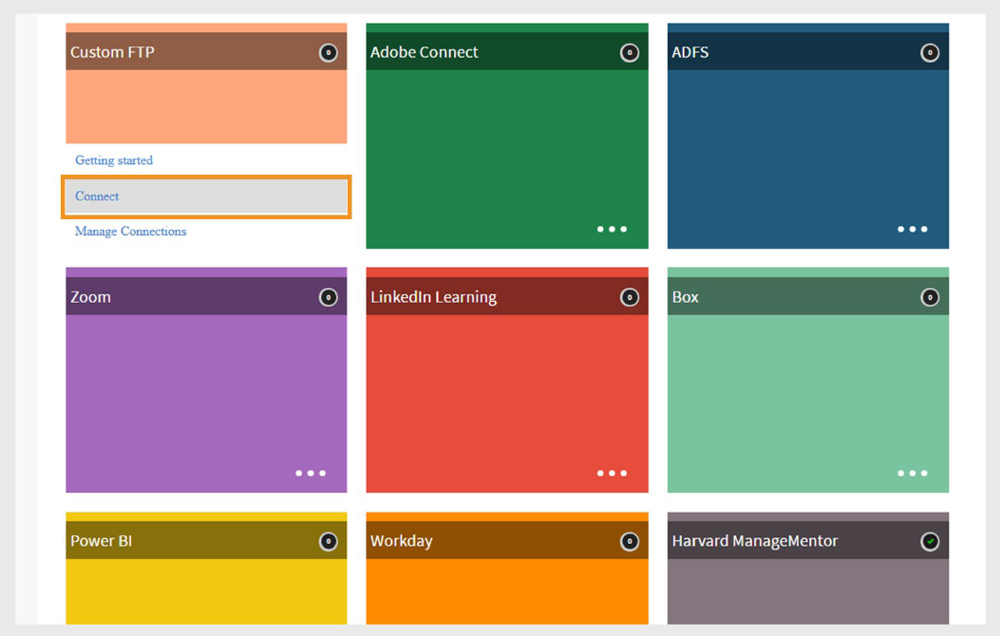
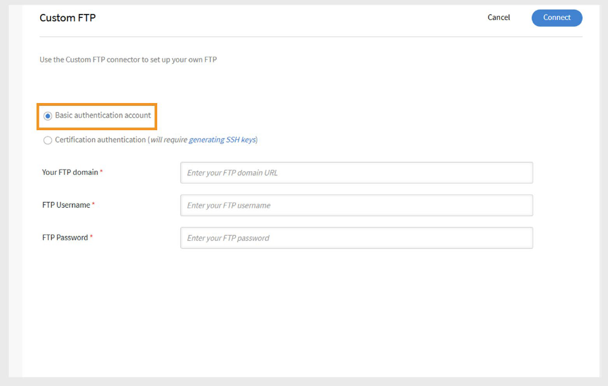
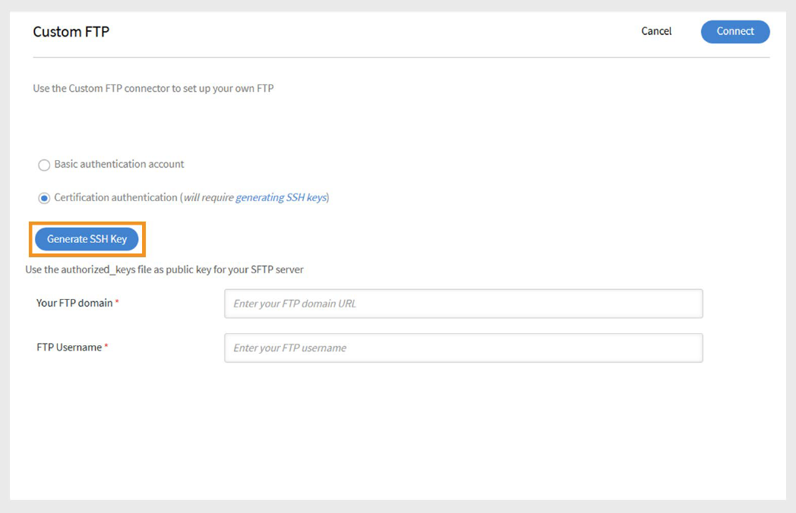

# Benutzerdefinierte FTP-Verbindung in Adobe Learning Manager

## Einführung

Die Adobe Learning Manager-Verbindung Benutzerdefiniertes FTP ermöglicht einen sicheren, automatisierten Datenaustausch zwischen Adobe Learning Manager und dem FTP-Server (SFTP) Ihres Unternehmens. Mit dieser Integration können Administratoren Benutzerdaten aus externen Systemen importieren und Teilnehmertranskripte oder Kenntnisdaten nach einem Zeitplan exportieren. Dieses Setup optimiert die Datensynchronisierung, reduziert den manuellen Aufwand und unterstützt die nahtlose Integration mit HR- oder Reporting-Systemen von Drittanbietern. Die Konfiguration erfordert die Abstimmung mit Ihrem IT-Team und die Unterstützung durch den Customer Success Manager (CSM) von Adobe.

>[!NOTE]
>
>Um eine benutzerdefinierte FTP-Verbindung zu konfigurieren, wenden Sie sich an Ihren Customer Success Manager (CSM). Der Einrichtungsprozess kann die Unterstützung Ihres IT-Teams bei der Positivliste von IP-Adressen, beim Öffnen erforderlicher Ports und beim Erstellen von Ordnern mit den erforderlichen Zugriffsberechtigungen umfassen.

## Unterstützte Funktionen

Die benutzerdefinierte FTP-Verbindung unterstützt die folgenden Aktionen:

### Datenimport

Beim Benutzerimport werden Mitarbeiterdaten automatisch vom FTP-Server abgerufen und in Adobe Learning Manager importiert. Dies ist nützlich, wenn mehrere Systeme integriert werden sollen, die CSV-Dateien mit Benutzerdaten generieren.

- Legen Sie die CSV-Dateien im angegebenen Ordner &quot;**import**&quot; auf dem FTP-Server ab.
- Adobe Learning Manager erkennt die Dateien, führt sie bei Bedarf zusammen und importiert die Benutzerdaten entsprechend dem definierten Zeitplan.

Im Abschnitt [Planung](/help/migrated/integration-admin/feature-summary/custom-ftp-connector.md#scheduling-reports) erfahren Sie, wie Sie diesen Prozess automatisieren können.

### Attributzuordnung

Als Integrationsadministrator können Sie die Spalten in Ihrer CSV-Datei gruppierbaren Attributen in Adobe Learning Manager zuordnen.

- Die Zuordnung ist eine einmalige Einrichtung.
- Dieselbe Zuordnung wird für spätere Importe verwendet.
- Sie können Zuordnungen neu konfigurieren, wenn sich Ihre Datenstruktur ändert.

### Datenexport

Mit Adobe Learning Manager können Sie Folgendes exportieren:

- Benutzerkenntnisse
- Teilnehmertranskripte

Diese Berichtsdateien werden auf Ihrem FTP im Exportordner abgelegt und können von Drittanbietersystemen für Berichte, Analysen oder andere nachgelagerte Prozesse verwendet werden.

### Planungsberichte

Integrationsadministratoren können Folgendes planen:

- Benutzerimporte
- Exportieren von Teilnehmertranskripten

Durch die Planung wird sichergestellt, dass Ihre Adobe Learning Manager-Umgebung mit den Quellsystemen auf dem neuesten Stand bleibt. Sie können tägliche Synchronisationen oder benutzerdefinierte Intervalle nach Bedarf konfigurieren.

## Benutzerdefinierte FTP-Verbindung einrichten

Konfigurieren der benutzerdefinierten FTP-Verbindung:

1. Melden Sie sich bei Adobe Learning Manager als Integrationsadministrator an.
2. Bewegen Sie den Mauszeiger über die Kachel **Benutzerdefiniertes FTP** und wählen Sie **Verbinden** aus.

   
   _Wählen Sie &quot;Verbinden&quot; aus, um die benutzerdefinierte FTP-Verbindung zu konfigurieren_

### Authentifizierungsmethode auswählen

Sie können die benutzerdefinierte FTP-Verbindung mit einem von zwei Authentifizierungstypen konfigurieren:

#### Standardauthentifizierungskonto

1. Geben Sie die folgenden Details ein:

   - **Ihre FTP-Domäne**
   - **FTP-Benutzername**
   - **FTP-Kennwort**

   
   _Geben Sie die FTP-Domäne, den Benutzernamen und das Kennwort für die Konfiguration ein._

2. Wählen Sie **Verbinden**.

#### Zertifikatsauthentifizierung

Wenn Ihr FTP-Server die SSH-Schlüsselauthentifizierung unterstützt:

1. Wählen Sie **SSH-Schlüssel generieren**.

   
   _Wählen Sie SSH-Schlüssel generieren aus, um den Schlüssel herunterzuladen_

2. Der öffentliche Schlüssel wird auf Ihren Computer heruntergeladen.
3. Fügen Sie diesen Schlüssel der Liste der autorisierten Schlüssel Ihres FTP-Servers hinzu.
4. Geben Sie die folgenden Details ein:

   - **Ihre FTP-Domäne**
   - **FTP-Benutzername**
5. Wählen Sie **Verbinden**.

>[!NOTE]
>
>Nur **SFTP**-Server werden für die benutzerdefinierte FTP-Konfiguration unterstützt.

## Einrichtung nach der Verbindung

Sobald die Verbindung hergestellt ist:

- Adobe Learning Manager erstellt automatisch Ordner für **Import** und **Export** auf Ihrem FTP-Server.
- Sie können Daten basierend auf Ihrem Zeitplan und Ihren Zuordnungseinstellungen importieren und exportieren.
