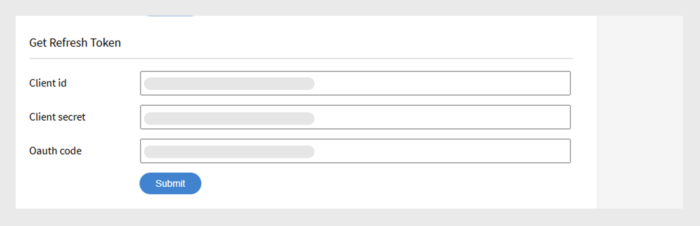

# Adobe Learning Manager Developer Manual

## Überblick

Adobe Learning Manager stellt RESTful-APIs bereit, mit denen Entwickler Anwendungen oder Workflows effektiv integrieren und anpassen können. Das Entwicklerhandbuch enthält Anleitungen zur Verwendung dieser APIs und behandelt Themen wie Authentifizierung, Datenmodelle und Integration mit anderen Anwendungen. Darüber hinaus unterstützt dieses Handbuch [API-Referenzdokumentation](https://learningmanager.adobe.com/docs/primeapi/v2/) Entwickler beim Erstellen von externen Anwendungen oder Backend-Workflows, die mit verschiedenen Funktionen von Adobe Learning Manager interagieren, einschließlich Kurserstellung, Verfolgung des Teilnehmerfortschritts, Kenntniszuordnung, Zertifizierung, Gamification und Transkripten.

Dieses Handbuch behandelt Folgendes:

* OAuth2.0-Authentifizierung
* API-Objektmodelle
* Zeigt, wie Include-, Felder und andere Parameter verwendet werden.
* Stellt Endpunkte für reale Anwendungsfälle bereit

>[!IMPORTANT]
>
>Dieses Entwicklerhandbuch behandelt ausschließlich die V2-APIs von Adobe Learning Manager. Alle in diesem Handbuch beschriebenen Beispiele, Anforderungsstrukturen und Authentifizierungs-Workflows sind spezifisch für die /primeapi/v2/-Endpunkte. Informationen zu älteren Versionen oder veralteten APIs finden Sie in der [API-Referenzdokumentation](https://learningmanager.adobe.com/docs/primeapi/v2/).

## API-Verwendungsszenarien

Entwickler können Lern-Manager-APIs verwenden, um den Lern-Manager zu verbessern oder mit anderen Unternehmensanwendungen zu integrieren. Sie können Web-, Desktop- oder mobile Apps mit jeder beliebigen Technologie erstellen. Entwickler können innerhalb von Learning Manager auf Anwendungsdaten zugreifen, aber die Bereitstellung erfolgt extern und wird vollständig von Ihnen gesteuert. Apps werden in der Regel von Kundenorganisationen für ihre eigenen Konten entwickelt, während Adobe-Partner allgemeine Anwendungen für eine breitere Verwendung erstellen können.

## Authentifizierung mit OAuth 2.0

Um sicher auf Adobe Learning Manager APIs zugreifen zu können, müssen Sie sich mit dem OAuth 2.0-Mechanismus von ALM authentifizieren. Dieser Vorgang umfasst das Registrieren der Anwendung, das Generieren eines Autorisierungscodes, das Austauschen gegen ein Aktualisierungstoken und schließlich das Verwenden des Aktualisierungstokens zum Abrufen eines Zugriffstokens.

### Registrieren von Anwendungen

Integriere Adobe Learning Manager mit externen Programmen, um deine Vielseitigkeit zu verbessern. Die Schritte umfassen den Zugriff auf die Benutzeroberfläche des Integrationsadministrators, das Registrieren der Anwendung sowie das Abrufen der Client-ID und des geheimen Schlüssels. Generieren von Authentifizierungstoken (OAuth, Refresh und Access Tokens) aus ALM, wobei die Verwendung des OAuth 2.0-Frameworks für Authentifizierung und Autorisierung hervorgehoben wird. Das Zugriffstoken hat eine Gültigkeitsdauer von sieben Tagen.

1. Melden Sie sich bei Adobe Learning Manager als Integrationsadministrator an.
2. Wählen Sie im linken Fensterbereich **[!UICONTROL Anwendungen]** aus.

   

3. Wählen Sie **[!UICONTROL Register]** aus und fügen Sie die folgenden Informationen hinzu:

   * **[!UICONTROL Anwendungsname]**: Geben Sie den Namen der Anwendung ein (maximal 50 Zeichen).
   * **[!UICONTROL URL]**: Die offizielle URL Ihres Unternehmens oder Ihrer Anwendung. Wird zur Identifizierung und Referenz verwendet.
   * **[!UICONTROL Domänen umleiten]**: Geben Sie die Domänen an (z. B. [http://learningmanager.adobe.com](http://learningmanager.adobe.com)), zu denen ALM nach der Autorisierung umleiten kann.  Sie können mehrere URLs erwähnen, aber die URLs müssen gültig sein.
   * **[!UICONTROL Beschreibung]**: Kurze Beschreibung der Anwendung.
   * **[!UICONTROL Geltungsbereiche]**: Wählen Sie eine der sechs verfügbaren Optionen aus, um den Geltungsbereich Ihrer Anwendung zu definieren. Basierend auf Ihrer hier genannten Auswahl sind die Learning Manager-API-Endpunkte für Ihre Anwendung zugänglich. Wenn Sie beispielsweise Lesezugriff für die Teilnehmerrolle gewählt haben, ist der Zugriff auf alle Lern-Manager-API-Endpunkte für Teilnehmer für Ihre Anwendung schreibgeschützt.

      * Lese-/Schreibzugriff auf Administratorrolle: Ermöglicht der Anwendung, auf Daten als Administrator zuzugreifen oder sie zu ändern.
      * Lese-/Schreibzugriff auf Teilnehmerrolle: Ermöglicht der Anwendung den Zugriff auf oder die Änderung von Daten für Teilnehmer.
      * xAPI-Lese-/Schreibzugriff: Ermöglicht es der Anwendung, auf Experience API(xAPI)-Anweisungen zuzugreifen und diese zu senden.

   * **[!UICONTROL Nur für dieses Konto?]**

      * **[!UICONTROL Ja]** - Wenn Sie &quot;Ja&quot; auswählen, ist die Anwendung für andere Kontoadministratoren nicht sichtbar.
      * **[!UICONTROL Nein]** - Wenn Sie &quot;Nein&quot; auswählen, können auch andere Kontoadministratoren auf diese Anwendung zugreifen, sie müssen jedoch die Anwendungs-ID verwenden, um auf diese Anwendung zuzugreifen. Die Anwendungs-ID wird generiert und im Bearbeitungsmodus der Learning Manager-Anwendung angezeigt.

     

4. Wählen Sie **[!UICONTROL Speichern]** aus, um die Anwendung zu registrieren.

   * Nachdem Sie die Anwendung registriert haben, steht sie in der Liste der im Konto erstellten Anwendungen zur Verfügung. Wählen Sie die Anwendung aus. Zusätzlich zu den zuvor eingegebenen Feldern sehen Sie Folgendes:
   * Anwendungs-ID: Dies ist die Client-ID. Diese ID teilt ALM die Anwendung mit, die Zugriff anfordert. Sie ist in API-Anfragen zur Identifizierung der App enthalten.
   * Anwendungsgeheimnis: Dieses Kennwort wird verwendet, um Ihre App zu authentifizieren und ihre Identität während der Schritte zum Tokenaustausch zu überprüfen (z. B. wenn ein Aktualisierungstoken oder ein Zugriffstoken angefordert wird).

   

## Abrufen eines Zugriffstokens

### Autorisierungscode aus der Umleitung abrufen

Nachdem Sie die Client-ID und den geheimen Clientschlüssel abgerufen haben, können Sie mit ihnen ein Zugriffstoken anfordern, mit dem API-Aufrufe authentifiziert werden.

Um den Autorisierungscodefluss zu starten, leiten Sie Ihre Benutzer in einem Browser an die folgende URL:

```
GET https://learningmanager.adobe.com/oauth/o/authorize?client_id=<Enter your clientId>&redirect_uri=<Enter a url to redirect to>&state=<Any String data>&scope=<one or more comma separated scopes>&response_type=CODE 
```

Sobald der Benutzer die Anwendung autorisiert hat, leitet Adobe Learning Manager mit einem angehängten Abfrageparameter zu dem angegebenen redirect_uri um:

[https://yourapp.com/callback?code=abc123xyz](https://yourapp.com/callback?code=abc123xyz)

Ein Parametercode wird zusammen mit dem Umleitungs-URI angehängt.

### Aktualisierungstoken aus dem Code abrufen

Nachdem Sie den Code abgerufen haben, verwenden Sie ein beliebiges API-Tool und fügen Sie die folgende POST an:

```https://learningmanager.adobe.com/oauth/token ```

**Anforderungstext (x-www-form-urlencoded)**:

```
grant_type=authorization_code  
&code=abc123xyz  
&client_id=<your_client_id>  
&client_secret=<your_client_secret>  
&redirect_uri=<your_redirect_url> 
```

**Antwort**

```
{ 

  "access_token": "eyJhbGciOiJIUzI1...", 
  "refresh_token": "xTjlfz0jCk6gF1...", 
  "expires_in": 604800, 
  "token_type": "Bearer" 

} 
```

Verwenden Sie das access_token im Autorisierungs-Header, um authentifizierte API-Anforderungen zu stellen.

### Verwenden des Zugriffstokens in einem API-Aufruf

Überprüfen Sie das Zugriffstoken anhand der folgenden Kriterien:

```
GET https://learningmanager.adobe.com/oauth/token/check?access_token=<access_token> 
```

Ein Zugriffstoken ist sieben Tage lang gültig. Nach sieben Tagen müssen Sie mithilfe des Aktualisierungstokens ein neues Zugriffstoken generieren. Wenn Sie ein neues Zugriffstoken aus dem Aktualisierungstoken generieren, während ein vorhandenes Zugriffstoken noch gültig ist, wird das vorhandene Token zurückgegeben.

### Zugriffstoken für Tests und Entwicklung erhalten

Verwenden Sie das Adobe Learning Manager-Tool (ALM) zum Generieren von Token, um schnell Zugriffstoken für Test- und Entwicklungszwecke zu erstellen. Diese Tokens sind ausschließlich für den persönlichen Gebrauch während der Entwicklungs- und Debugphase vorgesehen. Beachten Sie, dass Testtoken Zugriff auf Ihre ALM-Daten gewähren, daher ist es wichtig, sie sicher zu verarbeiten. Geben Sie Ihre Testtoken niemals für andere frei, verwenden Sie sie in Produktionsanwendungen oder fügen Sie sie nicht in öffentlichen Code-Repositorys ein. Behandeln Sie sie wie Kennwörter, um die Sicherheit Ihres Kontos und Ihrer Daten zu gewährleisten.

1. Melden Sie sich bei Adobe Learning Manager als Integrationsadministrator an.
2. Wählen Sie **[!UICONTROL Entwicklerressourcen]** und anschließend **[!UICONTROL Zugriffstoken für Tests und Entwicklung]** aus.

   

3. Geben Sie die **[!UICONTROL Client-ID]** ein, die Sie nach dem Erstellen einer Anwendung erhalten haben, um den OAuth-Code abzurufen. Wählen Sie dann **[!UICONTROL Senden]**.

   

4. Fügen Sie die **[!UICONTROL Client-ID]** und den **[!UICONTROL Client-Schlüssel]** hinzu, um das Aktualisierungstoken abzurufen. Wählen Sie dann **[!UICONTROL Senden]**. Die OAuth wird aus dem vorherigen Schritt vorausgefüllt.

   

5. Fügen Sie die Client-ID und das geheime Clientschlüssel hinzu, um das Zugriffstoken zu erhalten. Wählen Sie dann **[!UICONTROL Senden]**.

   

6. Fügen Sie das Zugriffstoken hinzu und wählen Sie Senden , um die Zugriffstokendetails abzurufen.

   

Bei Auswahl von **[!UICONTROL Senden]** wird das Zugriffstoken überprüft und die folgende Antwort wird angezeigt:

```
{ 
  "access_token": "access token", 
  "refresh_token": "refresh token", 
  "user_role": "admin", 
  "account_id": "1234", 
  "user_id": "123456", 
  "expires_in": 604800 
} 
```

Wie zuvor läuft das Zugriffstoken für Tests in sieben Tagen ab.

### Verwenden eines API-Tools zum Testen der Endpunkte

Sie können zwar ein beliebiges API-Testtool eines Drittanbieters verwenden, wir verwenden jedoch Postman zum Testen der Endpunkte. In den Beispielen in diesem Dokument wird Postman für Endpunkttests verwendet.

1. Öffnen Sie Postman und erstellen Sie eine neue Anforderung.
2. Wählen Sie die Registerkarte Autorisierung aus.
3. Setzen Sie den Authentifizierungstyp auf &quot;Inhabertoken&quot;.

   
4. Fügen Sie das im vorherigen Abschnitt erhaltene Zugriffstoken in das Feld Token ein.

   

5. Fügen Sie auf der Registerkarte &quot;Kopfzeilen&quot; Folgendes hinzu:

   * Schlüssel: Akzeptieren
   * Wert: application/json
6. Geben Sie Ihren API-Endpunkt in das URL-Feld ein. Beispiel: [https://learningmanager.adobe.com/learningManager/api/v2/users](https://learningmanager.adobe.com/learningManager/api/v2/users)
Weitere Informationen finden Sie in [Adobe Learning Manager API Reference](https://learningmanager.adobe.com/docs/primeapi/v2/).
7. Wählen Sie &quot;Senden&quot;, um die API-Anforderung zu senden.

## API-Typen

### Admin-APIs

Mit den Admin-APIs von Adobe Learning Manager können Administratoren Lernvorgänge in großem Umfang automatisieren und verwalten.

Mit den Admin-APIs können Entwickler:

>[!NOTE]
>
>Die Liste ist nicht vollständig.

* **Benutzer und Gruppen verwalten**: Erstellen, aktualisieren und löschen Sie Benutzer oder weisen Sie sie Gruppen zu.
* **Teilnehmer registrieren**: Automatisieren Sie die Registrierung für Kurse, Lernpfade oder Zertifizierungen.
* **Fortschritt der Teilnehmer verfolgen**: Abrufen des Kursfortschritts/Modulfortschritts, der Quizpunktzahlen und des Abschlussstatus
* **Berichte generieren**: Greifen Sie auf Daten zu Teilnehmeraktivität, Interaktion und Leistung zu.
* **Inhalt verwalten**: Erstellen und Organisieren von Kursen und Lernobjekten.

Weitere Informationen finden Sie in [Adobe Learning Manager API Reference](https://learningmanager.adobe.com/docs/primeapi/v2/).

### Teilnehmer-APIs

Die Teilnehmer-APIs sind für authentifizierte Benutzer (Teilnehmer) konzipiert und ermöglichen Ihnen den Zugriff auf teilnehmerspezifische Informationen. Diese APIs ermöglichen Aufgaben wie:

* Zugriff auf die Kurse und den Fortschritt eines Teilnehmers
* Abzeichen oder erworbene Zertifizierungen werden abgerufen
* Aktualisieren der Profilinformationen von Teilnehmern
* Anzeigen von Kenntnissen, die mit abgeschlossenen Kursen verknüpft sind

**Wichtigste Punkte:**

* Diese APIs erfordern ein authentifiziertes Benutzer-Token, um Datensicherheit und Datenschutz zu gewährleisten.
* Die APIs sind für Szenarien gedacht, in denen Benutzer vollständig registriert und angemeldet sind, und nicht für anonyme oder freigegebene Benutzer.

Weitere Informationen finden Sie in [Adobe Learning Manager API Reference](https://learningmanager.adobe.com/docs/primeapi/v2/).

## API-Design und gemeinsame Parameter

Die APIs bieten Entwicklern Zugriff auf wichtige Lern-Manager-Ressourcen wie Benutzer, Kurse, Kenntnisse, Zertifizierungen und Lernprogramme. Sie folgt den REST-Prinzipien und verwendet HTTP-Methoden (GET, POST, PUT, DELETE) für Datenoperationen.

| | |
|--|--|
| Methoden | GET, PUT, POST, DELETE |
| Format | application/vnd.api+json, application/json. [Weitere Informationen](https://developer.mozilla.org/en-US/docs/Web/HTTP/Guides/MIME_types/Common_types) zu gängigen MIME-Typen. |
| Basis-URL | [https://learningmanager.adobe.com/primeapi/v2/](https://learningmanager.adobe.com/primeapi/v2/) |

### Allgemeine Parameter

| Parameter | Zweck |
|--|--|
| mitrechnen | Ruft verwandte Ressourcen in einem Anruf ab. |
| Felder | Bestimmte Attribute auswählen, um die Nutzlast zu reduzieren. |
| filtern | Eingeschränkte Ergebnisse (z. B. nach ID, Name) |
| Sorte | Ergebnisse bestellen. |
| page[limit], page[offset] | Unterstützung für Seitenumbrüche. |

Im Folgenden finden Sie eine kurze Erläuterung der einzelnen Punkte:

### mitrechnen

ALM-APIs können verwendet werden, um nützliche Informationen beim Erstellen einer benutzerdefinierten Anwendung oder eines Headless-LMS abzurufen. Die API-Endpunkte können außerdem mit zusätzlichen &quot;include&quot;-Parametern versehen werden, um die zusätzlichen Informationen abzurufen, die in Beziehung zu den standardmäßig empfangenen Daten stehen. Diese Beziehungen sind Datenmodellbeziehungen, z. B. während eines Anrufs zum Abrufen von Benutzerdetails, erhalten Sie die Benutzerinformationen und die Beziehung zwischen Manager-ID und ALM-Konto-ID. Mit dem Parameter include können Sie zusätzliche Details zusammen mit den Benutzerdetails, wie z. B. deren Manager-Details und den ALM-Kontodetails, detailliert extrahieren.
Kurz gesagt, der Parameter **include** wird in API-Aufrufen verwendet, um verwandte (verknüpfte) Ressourcen zusammen mit der primären Ressource in einer einzigen Antwort abzurufen. Dies ist nützlich, wenn Sie auf verschachtelte oder abhängige Daten zugreifen möchten, z. B. auf Module eines Kurses oder die Kenntnisse, die einem Teilnehmer zugeordnet sind, ohne separate API-Aufrufe zu tätigen.

Wichtigste Vorteile:

* Reduziert mehrere API-Aufrufe: Es ist nicht mehr erforderlich, jede zugehörige Ressource manuell anzufordern.
* Verbessert die Effizienz: Schnellere Entwicklung, geringere Serverlast und schnelleres Rendering von Daten.
* Gewährleistet Datenkonsistenz: Ruft alle verknüpften Daten in einem konsistenten Snapshot ab.

**Verwenden des Include-Parameters**

Hängen Sie den Include-Parameter an Ihre API-URL an und geben Sie an, welche verwandten Entitäten einbezogen werden sollen.

**Häufige Include-Pfade**

| Wert einschließen | Beschreibung |
|---|---|
| Instanzen | Gibt alle Instanzen des Lernobjekts zurück |
| Registrierung | Gibt Registrierungsdetails für den Benutzer zurück |
| instances.loResources.resources | Ruft Module und Ressourcen innerhalb einer Instanz ab |
| additionalResources | Gibt zugeordnete zusätzliche Ressourcen zurück. |
| skills.skillLevel.badge | Ruft Qualifikationsstufen und die zugehörigen Abzeichen ab |
| prerequisiteLOs | Enthält erforderliche Lernobjekte |
| SubLOs | Ruft Sub-Lernobjekte ab (in LPs oder Zertifizierungen verwendet) |
| subLOs.enrollment | Registrierung für Lernobjekte |
| instances.badge | Abzeichen für den Abschluss einer Kursinstanz |
| subLOs.subLOs.instances.loResources.resources | Tief verschachtelte Ressourcen in einer Sub-LO-Instanz |

**Beispiel 1**

Abrufen der Details eines Benutzers mithilfe des Parameters &quot;userID&quot; im Endpunkt

```
https://learningmanager.adobe.com/primeapi/v2/users/<userID>
```

```
GET https://learningmanager.adobe.com/primeapi/v2/users/<userID>
```

In der Antwort können Sie sehen, dass das Datenobjekt eine Beziehung zum Konto und zum Manager des Benutzers hat.

```
"relationships": {
            "account": {
                "data": {
                    "id": "1010",
                    "type": "account"
                }
            },
            "manager": {
                "data": {
                    "id": "3400476",
                    "type": "user"
                }
            }
        }
```

Mit dem Include-Parameter in der Anforderung können Sie wie folgt detaillierte Informationen über den Manager abrufen:

```
GET https://learningmanager.adobe.com/primeapi/v2/users/<userid>?include=manager
```

**Beispiel 2**

Um die Kursdetails abzurufen, verwenden Sie den include-Parameter im Endpunktanruf. Der folgende Endpunkt ruft die Kursinformationen zusammen mit ihren Beziehungen ab.

```
GET https://learningmanager.adobe.com/primeapi/v2/learningObjects/<courseID>
```

Die Beziehungen werden in der Antwort wie folgt angezeigt:

* Instanzen
* Kenntnisse
* Autoren

```
"relationships": {
            "authors": {
                "data": [
                    {
                        "id": "3400468",
                        "type": "user"
                    }
                ]
            },
            "instances": {
                "data": [
                    {
                        "id": "course:16444_31598",
                        "type": "learningObjectInstance"
                    }
                ]
            },
            "skills": {
                "data": [
                    {
                        "id": "course:16444_1796",
                        "type": "learningObjectSkill"
                    },
                    {
                        "id": "course:16444_3103",
                        "type": "learningObjectSkill"
                    }
                ]
            }
        }
```

Andere Beziehungen können Folgendes umfassen (in der obigen Antwort nicht vorhanden):

* prerequisiteLOs
* additionalLOs
* additionalResources

Um detaillierte Daten zu den Instanzen und Kenntnissen zu erhalten, fügen Sie &quot;Instanzen, Kenntnisse&quot; in den Include-Parameter ein.

```
GET https://learningmanager.adobe.com/primeapi/v2/learningObjects/<courseID>?include=instances,skills
```

Wenn Sie jetzt beispielsweise mehr Daten abrufen möchten, die mit der Kursinstanz verknüpft sind, z. B. loResources (Modulinformationen des Kurses), wenden Sie loResources als verschachteltes Include an.

```
GET https://learningmanager.adobe.com/primeapi/v2/learningObjects/<courseID>?include=instances.loResources
```

Darüber hinaus können Sie Kenntnisse und Instanzen mit einem verschachtelten Include kombinieren.

```
GET https://learningmanager.adobe.com/primeapi/v2/learningObjects/<courseID>?include=instances,instances.loResources,skills
```

**Andere Include-Filter**

<table>
 <tbody>
  <tr>
   <td>
    <p style="text-align: left;"><b>Lernprogramme</b></p></td>
   <td>
    <p style="text-align: left;"><b>Kurs</b></p></td>
  </tr>
  <tr>
  <td><br>subLOs.prerequisiteLOs.enrollment</br><br>subLOs.subLOs.prerequisiteLOs.enrollment</br><br>subLOs.enrollment.loResourceGrades</br><br>subLOs.subLOs.enrollment.loResourceGrades</br><br>subLOs.subLOs.instances.loResources.resources.room</br><br>subLOs.instances.loResources.resources.room</br><br>subLOs.supplementaryResources</br><br>subLOs.enrollment</br><br>SubLOs.enrollment.loInstance.loResources.resources</br><br>subLOs.supplementaryLOs.instances.loResources.resources</br>
  </td>
  <td>
  <br>instances.enrollment.loResourceGrades</br><br>enrollment.loInstance.loResources.resources</br>prerequisiteLOs</br><br>authors</br><br>instances.loResources.resources</br><br>additionalLOs.instances.loResources.resources</br><br>additionalResources</br><br>instances.badge</br><br>skills.skillLevel.badge</br><br>skills.skillLevel.skill</br><br>instances.loResources.resources.room</br><br>prerequisiteLOs.enrollment</br><br>enrollment.loResourceGrades</br>
  </td>
  </tr>

#### Felder

Die Attribute und Beziehungen eines API-Objekts werden als Felder bezeichnet. Verwenden Sie Felder als Parameter in API-Aufrufen, um bestimmte Attribute aus dem Modell abzurufen. Ohne den Fields-Parameter ruft der API-Aufruf alle verfügbaren Attribute ab.

Im folgenden API-Aufruf ruft fields[skill]=name beispielsweise nur das name-Attribut des Kenntnismodells ab.

```
GET https://learningmanager.adobe.com/primeapi/v2/users/3400490/userSkills/3400490_1796_1?include=skillLevel.skill&fields[skill]=name
```

#### Seitenumbruch

API-Paginierung ist eine Technik, die in APIs verwendet wird, um große Datensätze in kleinere, verwaltbare Blöcke, so genannte Seiten, aufzuteilen, anstatt die gesamten Daten in einer einzigen Antwort zurückzugeben.

Paginierung reduziert die Last von Client und Server, begrenzt die Antwortgröße, um Engpässe auf dem Server zu vermeiden, oder ist nützlich, um Daten seitenweise in Tabellen oder Listen anzuzeigen.

**Funktionsweise der Paginierung in ALM-APIs**

ALM-APIs unterstützen Paginierung durch Parameter wie:

* page[limit]: Anzahl der Datensätze pro Seite.
* page[offset]: Anzahl der zu überspringenden Datensätze.
* page[cursor]: Zeiger auf den nächsten Ergebnissatz. Anstelle der Verwendung eines offset-basierten Seitenumbruchs (bei dem eine Anzahl von Datensätzen übersprungen wird), wird für den Cursor-basierten Seitenumbruch eine eindeutige Marke verwendet, die von der API zurückgegeben wird, um die nächste Ergebnisseite abzurufen.

So verwenden Sie die Paginierung in APIs:

**Seite[Limit]**

Während [https://learningmanager.adobe.com/primeapi/v2/users](https://learningmanager.adobe.com/primeapi/v2/users) alle Benutzer und zugehörige Informationen in einem einzigen Aufruf zurückgibt, beschränkt die Verwendung von Seite[limit] die Anzahl der Ergebnisse auf den angegebenen Wert.

Verwenden Sie die folgende API, um nur fünf Benutzerdatensätze in einem einzigen Aufruf zurückzugeben:

```
GET https://learningmanager.adobe.com/primeapi/v2/users?page[limit]=5
```

**Seite[Offset]**

Verwenden Sie diesen API-Aufruf, um drei Benutzerdatensätze zurückzugeben, die ersten fünf Benutzer zu überspringen und mit dem sechsten zu beginnen.

```
GET https://learningmanager.adobe.com/primeapi/v2/users?page[limit]=3&page[offset]=5 
```

**Seite[Cursor]**

1. Beginnen Sie mit der Anforderung der ersten Seite mit einem Limit von 5.

   ```
   GET https://learningmanager.adobe.com/primeapi/v2/users?page[limit]=5
   ```

2. Kopieren Sie den Cursorwert von links.next und verwenden Sie ihn in der nächsten Anforderung:

   ```
   "links": {
       "self": "https://learningmanager.adobe.com/primeapi/v2/users?page[limit]=5",
       "next": "https://learningmanager.adobe.com/primeapi/v2/users?page[limit]=5&page[cursor]=3400482"
    }
   ```

3. Senden Sie die folgende Anforderung:

   ```
   GET https://learningmanager.adobe.com/primeapi/v2/users?page[limit]=5&page[cursor]=3400482
   ```

Dies gibt den nächsten Satz von 10 Datensätzen zurück, beginnend nach dem letzten Element der vorherigen Seite.

#### filtern

Mit dem Filterparameter können Sie API-Ergebnisse basierend auf einem oder mehreren Feldwerten eingrenzen.

Adobe Learning Manager APIs bieten verschiedene Varianten des Filterparameters, um die Antworten einzugrenzen.

Weitere Informationen finden Sie in [Adobe Learning Manager API Reference](https://learningmanager.adobe.com/docs/primeapi/v2/).

Dieses Beispiel zeigt, wie die Arbeitshilfen, für die sich ein Teilnehmer registriert hat, mithilfe des Endpunkts mit dem Filterparameter gefiltert werden:

```
GET https://learningmanager.adobe.com/primeapi/v2/users/3400480/enrollments?filter.loTypes=jobAid
```

#### Sorte

Der sort-Parameter wird verwendet, um API-Ergebnisse basierend auf einem oder mehreren Feldern in aufsteigender oder absteigender Reihenfolge zu sortieren.

Die Adobe Learning Manager bietet verschiedene Sortieroptionen zum Sortieren der API-Antwort. Weitere Informationen finden Sie in [Adobe Learning Manager API Reference](https://learningmanager.adobe.com/docs/primeapi/v2/).

Wenn Sie das vorherige Beispiel erweitern, sortieren Sie jetzt die Registrierung des Benutzers für Lernprogramme nach dem Datum, an dem der Benutzer in aufsteigender Reihenfolge registriert wurde.

```
GET https://learningmanager.adobe.com/primeapi/v2/users/3400480/enrollments?filter.lotypes=learningProgram&sort=dateEnrolled
```

## Übersicht über API-Modelle

Mit den Adobe Learning Manager APIs können Entwickler auf Lern-Manager-Objekte als RESTful-Ressourcen zugreifen. Jeder API-Endpunkt stellt eine Ressource dar, typischerweise eine Instanz eines Objekts, etwa ein Abzeichen, oder eine Gruppe solcher Objekte. Die Entwickler verwenden dann HTTP-Verben wie PUT, GET, POST und DELETE, um die CRUD-Vorgänge für diese Objekte (Auflistungen) auszuführen.


| Learning Manager-Objekt | Beschreibung |
|----|----|
| account | Kapselt die Details eines Learning Manager-Kunden. |
| badge | Ein Abzeichen ist ein Leistungsnachweis, den Teilnehmer erhalten, wenn sie bestimmte Meilensteine erreichen, während sie innerhalb eines Kurses fortschreiten. |
| catalog | ist eine Sammlung von Lernobjekten. |
| Benutzer | Der Benutzer (user) ist das wichtigste Modell in Learning Manager. Die Benutzer sind typischerweise die internen oder externen Teilnehmer in einer Organisation und nutzen Lernobjekte. Sie können jedoch außer der Teilnehmerrolle auch andere Rollen wie z. B. Autor oder Manager haben. „User id“, „type“ und „email“ gehören zu den Inline-Attributen. |
| resource | Dies wird verwendet, um jede Inhaltsressource zu modellieren, die ein Modul einbeziehen will. Alle in einer &quot;loResource&quot; zusammengefassten Ressourcen sind hinsichtlich des Lernziels äquivalent, unterscheiden sich jedoch in Bezug auf den Bereitstellungstyp oder das Inhaltsgebietsschema. |
| userNotification | Dieses Modell enthält Benachrichtigungsinformationen für einen Teilnehmer. |
| userSkill | UserSkill gibt an, wie viel von einer einzelnen Kenntnisstufe ein einzelner Benutzer erreicht. |
| userBadge | UserBadge verbindet ein einzelnes Abzeichen mit einem einzelnen Benutzer. Es enthält Details wie den Zeitpunkt der Erstellung, assertionUrl usw. |
| skill | Das Modell für Kenntnisse (skill) setzt sich aus Stufen und Punktzahlen zusammen. Die Teilnehmer erwerben Kenntnisse durch Abschließen der relevanten Kurse. |
| skillLevel | Eine Kenntnisstufe umfasst einen oder mehrere Kurse, die genutzt werden sollen, um eine Stufe zusammen mit den zugehörigen Credits zu erwerben. |
| learningObject | Ein Lernobjekt ist ein Abstrakt für verschiedene Arten von Objekten, bei denen sich Benutzer anmelden und von denen sie lernen können. Derzeit verfügt der Lernobjektmanager über die vier Typen von Lernobjekten - Kurs, Zertifizierung, Lernprogramm und Arbeitshilfe. |
| learningObjectInstance | Eine bestimmte Instanz eines Lernobjekts. |
| learningObjectResource | Dies entspricht dem Konzept des Moduls . Ein Kurs besteht aus einem oder mehreren Modulen. In Learning Manager kann ein Modul auf verschiedene gleichwertige Arten bereitgestellt werden. Daher kapselt loResource im Wesentlichen alle diese äquivalenten Ressourcen. |
| loResourceGrade | Dies umfasst das Ergebnis des Benutzers, der eine bestimmte Ressource im Kontext eines Lernobjekts konsumiert, bei dem er angemeldet ist. Es enthält Informationen wie die Dauer, die der Benutzer in der Ressource verbracht hat, den prozentualen Fortschritt, der vom Benutzer gemacht wurde, den Status &quot;Bestanden/Nicht bestanden&quot; und die Punktzahl, die der Benutzer in einem zugeordneten Quiz erzielt hat. |
| Kalender | Ein Kalenderobjekt ist eine Liste der bevorstehenden Kurse im Klassenzimmer oder virtuellen Klassenzimmer, bei denen sich der Benutzer anmelden kann. |
| l1FeedbackInfo | L1 Feedback enthält die Antworten, die von einem Teilnehmer für die Feedbackfragen gegeben werden, die Lernobjekten zugeordnet sind. In der Regel wird dies erfasst, nachdem der Benutzer ein Lernobjekt abgeschlossen hat, wenn konfiguriert, um ein solches Feedback von Teilnehmern zu erfassen. |
| Registrierung | Dieses Abstrakt umfasst die Einzelheiten der Transaktion, die die Zuordnung eines bestimmten Benutzers zu einer bestimmten Lernobjektinstanz darstellt. |


## Teilnehmer-APIs und Endpunkte

Hier sind die wichtigsten API-Endpunkte für die Arbeit mit Teilnehmerdaten. Diese APIs unterstützen Entwickler bei der Interaktion mit Teilnehmerinformationen, beim Verfolgen des Fortschritts, beim Verwalten von Registrierungen und beim Abrufen von Kursinhalten.

### Abrufen der Details aller Teilnehmer

Abrufen von Teilnehmerdetails (Name, E-Mail-Adresse, UUID, Benutzerprofil usw.) Verwenden Sie die API, um alle Teilnehmer im Konto aufzulisten.

```
GET https://learningmanager.adobe.com/primeapi/v2/users
```

### Abrufen der Details eines bestimmten Teilnehmers

Wenn Sie das Profil eines Teilnehmers nach ID anzeigen möchten, verwenden Sie die folgende API für einen Aufruf.

```
GET https://learningmanager.adobe.com/primeapi/v2/users/<userID>
```

### Liste aller Kurse, Lernprogramme, Arbeitshilfen und Zertifizierungen

Rufen Sie die Details aller Lernobjekte ab, bei denen sich der Teilnehmer registriert hat, die Schulung abgeschlossen hat oder die vom Administrator aktiviert wurden.

```
GET https://learningmanager.adobe.com/primeapi/v2/learningObjects
```

### Abrufen von Details zu einem bestimmten Lernobjekt

Abrufen detaillierter Informationen zu einem Lernobjekt Es enthält das Erstellungsdatum, das Veröffentlichungsdatum, das Aktualisierungsdatum und andere Informationen.

```
GET https://learningmanager.adobe.com/primeapi/v2/learningObjects/<LearningObjectID>
```

### Liste der Kenntnisse abrufen, die mit Kursen verknüpft sind

Zeigen Sie Qualifikationen an, die allen Teilnehmern im Konto zugewiesen sind.

```
GET https://learningmanager.adobe.com/primeapi/v2/skills
```

### Abrufen von Kenntnisstufen- und Abzeicheninformationen

Überprüfen Sie den Fortschritt der Teilnehmer bei kompetenzbasierten Lernreisen.

```
GET https://learningmanager.adobe.com/primeapi/v2/skills/<skillID>?include=levels
```

### Liste aller Abzeichen, die für ein Konto erstellt wurden

Rufen Sie den folgenden Endpunkt auf, um eine Liste aller Abzeichen abzurufen, die für ein Konto in einer Organisation erstellt wurden.

```
GET https://learningmanager.adobe.com/primeapi/v2/badges
```

### Abrufen von Informationen zu einem Abzeichen

Rufen Sie detaillierte Informationen zu einem Abzeichen ab, einschließlich des Namens des Abzeichens, der URL des Abzeichenbilds und des Status des Abzeichens.

```
GET https://learningmanager.adobe.com/primeapi/v2/badges/<skillID>
```

Dies führt zu folgender Antwort:

```
{
    "links": {
        "self": "https://learningmanager.adobe.com/primeapi/v2/badges/499"
    },
    "data": {
        "id": "499",
        "type": "badge",
        "attributes": {
            "imageUrl": "https://cpcontentsdev.adobe.com/public/account/1010/accountassets/1010/badges/test_57a5ab00555a475a8fc6671562184dc9.png",
            "name": "penguins",
            "state": "Retired"
        }
    }
}
```

## Weitere Beispiele für die API-Nutzung

### Benutzer erstellen

1. Verwenden Sie den Endpunkt:

   ```
   POST https://learningmanager.adobe.com/primeapi/v2/users
   ```

   Verarbeitet die Attribute aus dem API-Hauptteil oder der JSON-Payload, um einen Benutzer zu generieren, und stellt anschließend einem Benutzer die jeweilige ausgefüllte Benutzer-ID zur Verfügung.

2. Verwenden Sie die folgende Nutzlast als Textkörper:

   ```
   { 
      "data": { 
        "type": "user", 
        "attributes": { 
         "email": "bob@example.com", 
          "name": "Bob", 
          "userType": "INTERNAL" 
        } 
      } 
    }
   ```

Es gibt drei obligatorische Attribute:

* E-Mail: E-Mail-ID des Benutzers. Dieser Wert sollte für jeden Benutzer eindeutig sein.
* name: Der Name des Benutzers.
* userType: Derzeit können nur interne Benutzer mit diesem Endpunkt hinzugefügt werden. Der userType muss &quot;INTERNAL&quot; sein.

Die folgende Antwort wird angezeigt:

```
{
  "links": {
      "self": "https://learningmanager.adobe.com/primeapi/v2/users"
  },
  "data": {
      "id": "13386404",
      "type": "user",
      "attributes": {
          "avatarUrl": "https://cpcontents.adobe.com/public/images/default_user_avatar.svg",
          "email": "bob@example.com",
          "name": "Bob",
          "pointsEarned": 0,
          "pointsRedeemed": 0,
          "preferredResolution": "AUTO",
          "profile": "Employee",
          "roles": [
              "Learner"
          ],
          "state": "ACTIVE",
          "userType": "Internal",
          "userUniqueId": "bob@example.com"
      },
      "relationships": {
          "account": {
              "data": {
                  "id": "1010",
                  "type": "account"
              }
          },
          "manager": {
              "data": {
                  "id": "3400468",
                  "type": "user"
              }
          }
      }
  }
}
```

### Benutzer löschen

1. Rufen Sie die Benutzer-ID des Benutzers ab, den Sie löschen möchten.

   ```
   GET https://learningmanager.adobe.com/primeapi/v2/users/<userID>
   ```

2. Rufen Sie dann über DELETE Folgendes auf:

   ```
   DELETE https://learningmanager.adobe.com/primeapi/v2/users/<userID>
   ```

Eine 204-Antwort wird angezeigt. Ein 204-Antwortcode zeigt einen Erfolg an, ohne dass Inhalte zurückgegeben werden müssen. Der Server hat die Anforderung erfolgreich verarbeitet, verfügt aber über keine Daten, die an den Client übermittelt werden müssen.

Der Status des Benutzers ist jetzt **[!UICONTROL GELÖSCHT]**, nachdem Sie die Benutzerdetails abgerufen haben.

### Benutzerdetails aktualisieren

1. Aktualisieren Sie die Benutzerdetails des Benutzers, der die v2-API verwendet. Teilnehmer können Bio, uiLocale, contentLocale, timezone ändern. Bei großen Konten handelt es sich um asynchrone Aufrufe. Es gibt viele andere Benutzerattribute, die mit diesem API-Endpunkt aktualisiert werden können. Verwenden Sie den Endpunkt /users/{id}, wobei id die Benutzer-ID des Benutzers ist, dessen Details aktualisiert werden sollen.

```
PATCH https://learningmanager.adobe.com/primeapi/v2/users/<userID>
```

Fügen Sie in der Payload der Anforderung zum Aktualisieren des Benutzers mit der ID &quot;`<userID>`&quot; aus dem vorherigen Abschnitt Folgendes hinzu:

Ändert ein beliebiges Feld in der Nutzlast.

```
{
    "data": {
        "id": "3400468",
        "type": "user",
        "attributes": {
            "avatarUrl": "https://cpcontents.adobe.com/public/images/default_user_avatar.svg",
            "binUserId": "3e6d571f-3956-44db-be69-8e458bde649f",
            "bio": "Manager",
            "contentLocale": "de-DE",
            "email": "user@example.com",
            "enrollOnClick": true,
            "fields": {
                "Web": "Web",
                "newfororder": "newvalue",
                "location": "New",
                "test1": "b"
            },
            "gamificationEnabled": true,
            "lastLoginDate": "2025-04-30T09:30:51.000Z",
            "metadata": {
                "level": "5",
                "expertise": "java",
                "sport": "tennis"
            },
            "name": "John Adams",
            "pointsEarned": 8600,
            "pointsRedeemed": 0,
            "preferredResolution": "AUTO",
            "profile": "Employee",
            "roles": [
                "Learner",
                "Admin",
                "Author",
                "Instructor",
                "Integration Admin",
                "Manager"
            ],
            "state": "ACTIVE",
            "timeZoneCode": "213",
            "uiLocale": "en-US",
            "userType": "Internal",
            "userUniqueId": "user@example.com"
        },
        "relationships": {
            "account": {
                "data": {
                    "id": "1010",
                    "type": "account"
                }
            }
        }
    }
}
```

Nachdem Sie den Anruf getätigt haben, werden die Benutzerdetails aktualisiert.

### Erstellen eines externen Profils

Ein externes Profil bezieht sich auf ein Benutzerprofil, das für externe Teilnehmer erstellt wird, in der Regel Personen, die nicht Teil der internen Benutzerbasis des Unternehmens sind. Zu diesen Teilnehmern können Kunden, Partner, Verkäufer, Franchisenehmer oder temporäre Vertragspartner gehören, die Zugang zu Schulungs- oder Zertifizierungsprogrammen benötigen, die von der Organisation angeboten werden.

1. Verwenden Sie den folgenden Endpunkt:

   ```
   POST https://learningmanager.adobe.com/primeapi/v2/externalProfiles
   ```

2. Verwenden Sie die folgende Nutzlast als Textkörper:

```
{
    "data": {
      "type": "externalProfile",
      "attributes": {
        "name": "Jonas Albertson",
        "expiry": "2027-12-31T18:29:59.000Z",
        "managerEmail": "jonas@acme.com",
        "seatLimit": 10
      }
    }
}
```

Die Nutzlast hat die folgenden Attribute:

* name: Der Name des externen Benutzers.
* expiry: Das Ablaufdatum (im ISO-8601-Format) der Registrierung des Benutzers in Adobe Learning Manager.
* managerEmail: Die E-Mail-Adresse des Managers des Benutzers in der Partnerorganisation.
* seatLimit: Die Anzahl der zulässigen Lizenzen für die Partnerorganisation.

Nach dem Anruf erhalten Sie die folgende Antwort:

```
{
    "links": {
        "self": "https://learningmanager.adobe.com/primeapi/v2/externalProfiles"
    },
    "data": {
        "id": "18805",
        "type": "externalProfile",
        "attributes": {
            "accessKey": "8gte2ne7f4r14",
            "enabled": true,
            "expiry": "2027-12-31T18:29:59.000Z",
            "managerEmail": "jonas@acme.com",
            "name": "Jonas Albertson",
            "seatLimit": 10,
            "url": "https://learningmanager.adobe.com/eplogin?groupid=18805&accesskey=8gte2ne7f4r14"
        }
    }
}
```

Dies bedeutet, dass der externe Benutzer erfolgreich zu Adobe Learning Manager hinzugefügt wurde. Senden Sie die URL in der Antwort an den Benutzer, mit der er sich auf der Plattform registrieren kann.

### Benutzerbericht mit Benutzer-ID- und Manager-Details extrahieren

Ein Benutzerbericht kann direkt von der Benutzeroberfläche heruntergeladen werden (**[!UICONTROL Admin]** > **[!UICONTROL Benutzer]** > **[!UICONTROL Intern]**). Der Bericht gibt jedoch nicht die Benutzer-ID und die Details des zugehörigen Managers zurück.
Wenn Sie die Jobs-API für einen Administrator verwenden, können Sie die Details abrufen.

1. Fügen Sie der Jobs-API die folgende Payload hinzu.

   ```
   {
       "data": {
           "type": "job",
           "attributes": {
               "description": "description of your choice",
               "jobType": "generateUsers",
               "payload":{
                   "expandMetadata":true
               }
           }
      }
   }
   ```

2. Verwenden Sie den folgenden Endpunkt.

   ```
   POST https://learningmanager.adobe.com/primeapi/v2/jobs
   ```

3. Kopieren Sie die Job-ID aus der Antwort.

   ```
   {
       "links": {
           "self": "https://learningmanager.adobe.com/primeapi/v2/jobs"
       },
       "data": {
           "id": "43118",
           "type": "job",
           "attributes": {
               "dateCreated": "2025-05-26T06:35:35.000Z",
               "description": "description of your choice",
               "jobType": "generateUsers",
               "payload": {
                   "expandMetadata": true
               },
             "status": {
                   "code": "Submitted"
               }
           }
       }
   }
   ```

   In der Antwort wird die Job-ID 43118.
4. Nachdem Sie die ID kopiert haben, laden Sie den Bericht mithilfe der ID in der Jobs-API herunter.

   ```
   GET https://learningmanager.adobe.com/primeapi/v2/jobs/43118
   ```

5. Kopieren Sie die S3-URL aus der Antwort.
6. Fügen Sie die URL in Ihren Browser ein. Der Browser fordert Sie auf, die CSV-Datei zu speichern oder zu öffnen. Speichern Sie die Datei auf Ihrem Computer.
Die heruntergeladene Datei enthält die folgenden Spalten:

internalUserID, userEmail, customerDefinedUniqueUserId, name, managerEmail, userType, state, excludedFromGamification, pointsEarned, profile, roles, dateCreated, lastLoginDate, dateDeleted, uiLocale, contentLocale, timeZoneCode, userSource, group, Active fields, metadata und lastSocialActivityDate.

### Abzeichen mit Jobs-API generieren

1. Liste der Abzeichen für einen Benutzer in der Organisation abrufen Verwenden Sie den folgenden Endpunkt:

   ```
   GET https://learningmanager.adobe.com/primeapi/v2/users/3400476/userBadges
   ```

   Dabei steht 3400476 die Benutzer-ID an.
2. Kopieren Sie die Abzeichen-ID aus der Antwort. Beispiel: 3400476_759_COMPETENCY_1796_1 ist die Abzeichen-ID.

   ```
   {
    "id": "3400476_759_COMPETENCY_1796_1",
    "type": "userBadge",
    "attributes": {
        "assertionUrl": "https://cpcontentsdev.adobe.com/public/accountassets/1010/badges/assertions/a99566b5aa8f4cfa92380581733c63a9_1626278856926.json",
        "dateAchieved": "2016-02-25T08:45:25.000Z",
        "modelType": "skillLevel"
    },
    "relationships": {
        "badge": {
            "data": {
                "id": "759",
                "type": "badge"
            }
        },
        "learner": {
            "data": {
                "id": "3400476",
                "type": "user"
            }
        },
        "model": {
            "data": {
                "id": "1796_1",
                "type": "skillLevel"
            }
        }
    }
   }
   ```

3. Erstellen Sie eine Payload und geben Sie die Badge-ID in der Payload an. Beispiel für eine Nutzlast:

   ```
   {
    "data": {
        "type": "job",
        "attributes": {
            "description": "Acme Corp Badge",
            "jobType": "generateUserBadge",
            "payload": {
                "userBadgeId": "3400476_759_COMPETENCY_1796_1"
            }
        }
    }
   }  
   ```

   Nachdem Sie einen Anruf getätigt haben, erhalten Sie die Job-ID in der Antwort.
4. Nehmen Sie die Job-ID aus der Antwort und verwenden Sie die Job-ID im folgenden Endpunkt, um den Aufruf durchzuführen.

   ```
   GET https://learningmanager.adobe.com/primeapi/v2/jobs/<jobsID>
   ```

5. Kopieren Sie die Abzeichen-URL aus der Antwort und öffnen Sie die URL in einem Browser. Das Zertifikat wird als PDF heruntergeladen.

### Erstellen von Benutzern in Adobe Learning Manager

Mit dem Endpunkt POST /users können Sie einen Benutzer im Headless-Modus erstellen. Erstellen Sie Benutzer mit detaillierten Informationen, wie z. B. dem Registrierungsprozess in der nativen Benutzeroberfläche im Adobe Learning Manager.

Beispiel:

```
POST https://learningmanager.adobe.com/primeapi/v2/users
```

Fügen Sie der Anforderung den folgenden Textkörper hinzu:

```
{   
   "data":  
     {  
       "type": "user",  
       "attributes": {  
         "bio": "",  
         "contentLocale": "fr-FR",  
         "email": "user@work.com",  
         "enrollOnClick": true,  
         "fields": {  
           "Learning Categories": [  
             "Business"  
           ],  
           "Categories": "IT"  
         },  
         "gamificationEnabled": true,  
         "name": "Test User",  
         "profile": "Engineer",  
         "userType": "INTERNAL",  
         "userUniqueId": "user@work.com"  
       },  
       "relationships": {  
         "account": {  
           "data": {  
             "id": "108079",  
             "type": "account"  
           }  
         }
         }  
       }  
    } 
```

Nach dem Anruf wird die folgende Antwort angezeigt:

```
{
    "links": {
        "self": "https://learningmanager.adobe.com/primeapi/v2/users"
    },
    "data": {
        "id": "13385627",
        "type": "user",
        "attributes": {
            "avatarUrl": "https://cpcontents.adobe.com/public/images/default_user_avatar.svg",
            "email": "user@work.com",
            "name": "Test User",
            "pointsEarned": 0,
            "pointsRedeemed": 0,
            "preferredResolution": "AUTO",
            "profile": "Engineer",
            "roles": [
                "Learner"
            ],
            "state": "ACTIVE",
            "userType": "Internal",
            "userUniqueId": "user@work.com"
        },
        "relationships": {
            "account": {
                "data": {
                    "id": "1010",
                    "type": "account"
                }
            },
            "manager": {
                "data": {
                    "id": "3400468",
                    "type": "user"
                }
            }
        }
    }
}
```

Ein neuer Benutzer wird zu Adobe Learning Manager hinzugefügt.

### L1-Feedback posten

1. Rufen Sie die Kurs-, Instanz- und Registrierungsdaten des Teilnehmers ab. Verwenden Sie die folgende endoint:

   ```
   GET /enrollments
   ```

2. Überprüfen Sie, ob L1-Feedback für die Kursinstanz aktiviert ist.

   ```
   GET https://learningmanager.adobe.com/primeapi/v2/learningObjects/<loID>/instances/<loInstanceID>/l1Feedback
   ```

3. Senden Sie das L1-Feedback.

   ```
   POST /enrollments/{id}/l1Feedback
   ```

Beispiel für erforderliche Nutzlast:

```
{
    "data": {
      "id": "course:7454218_10333537_11257863",
      "type": "feedback",
      "attributes": {
        "questions": [
          {
            "answer": "8",
            "questionId": "1",
            "mandatory": true,
            "questionType": "scaleTen"
          }
        ],
        "score": 80
      }
    }
  }
```

### Modulebeneninformationen eines Kurses abrufen

1. Rufen Sie die Details eines Lernobjekts nach ID ab.

   ```
   GET https://learningmanager.adobe.com/primeapi/v2/learningObjects/<loID>
   ```

   ```
   {
    "links": {
        "self": "https://learningmanager.adobe.com/primeapi/v2/learningObjects/course:1171899"
    },
    "data": {
        "id": "course:1171899",
        "type": "learningObject",
        "attributes": {
            "authorNames": [
                "James Adams"
            ],
            "dateCreated": "2017-11-01T15:28:09.000Z",
            "datePublished": "2017-11-01T15:28:20.000Z",
            "dateUpdated": "2017-11-01T15:28:20.000Z",
            "duration": 60,
            "effectiveModifiedDate": "2017-11-01T15:28:20.000Z",
            "effectivenessIndex": 0,
            "enrollmentType": "Self Enroll",
            "hasOptionalLoResources": false,
            "hasPreview": false,
            "isExternal": false,
            "isMqaEnabled": false,
            "isPrerequisiteEnforced": false,
            "isSubLoOrderEnforced": false,
            "loFormat": "Self Paced",
            "loResourceCompletionCount": 3,
            "loType": "course",
            "moduleResetEnabled": false,
            "state": "Published",
            "unenrollmentAllowed": true,
            "catalogLabels": [
                {
                    "catalogLabelValueIds": [
                        {
                            "name": "Sales",
                            "id": "catalogLabel:13_31"
                        }
                    ],
                    "description": "",
                    "mandatory": false,
                    "name": "Department",
                    "values": [
                        "Sales"
                    ]
                }
            ],
            "localizedMetadata": [
                {
                    "locale": "en-US",
                    "name": " Test course 2"
                }
            ],
            "rating": {
                "averageRating": 0,
                "ratingsCount": 0
            }
        },
        "relationships": {
            "authors": {
                "data": [
                    {
                        "id": "3400468",
                        "type": "user"
                    }
                ]
            },
            "instances": {
                "data": [
                    {
                        "id": "course:1171899_2067352",
                        "type": "learningObjectInstance"
                    }
                ]
            },
            "skills": {
                "data": [
                    {
                        "id": "course:1171899_1797",
                        "type": "learningObjectSkill"
                    }
                ]
            }
        }
    }
   }
   ```

2. Verwenden Sie den include-Parameter, um Folgendes abzurufen:

   a. Listen Sie alle Module des Lernobjekts auf.

   ```
   GET https://learningmanager.adobe.com/primeapi/v2/learningObjects/course:1171899?include=instances.loResources
   ```

   b. Listet alle Inhalte in den Modulen auf.

   ```
   GET https://learningmanager.adobe.com/primeapi/v2/learningObjects/course:1171899?include=instances.loResources.resources
   ```

### Modulfortschritt überprüfen

1. Rufen Sie das Lernobjekt aus dem Katalog mit der Kurs-ID ab.

   ```
   GET https://learningmanager.adobe.com/primeapi/v2/learningObjects?page[limit]=10&filter.loTypes=course&sort=name&filter.ignoreEnhancedLP=true&id=<courseID>
   ```

2. Abrufen der Registrierungsdetails eines Teilnehmers mithilfe der Registrierungs-ID.

   ```
   GET https://learningmanager.adobe.com/primeapi/v2/enrollments/<enrollmentID>
   ```

   Kopieren Sie die Ressourcenqualität-ID des Lernobjekts aus der Antwort.
3. Verwenden Sie die ID im folgenden Endpunkt.

   ```
   GET https://learningmanager.adobe.com/primeapi/v2/loResourceGrades/<courseResourceGradeID>
   ```

Sie erhalten Informationen über den Fortschritt des Moduls in der Antwort.

### Identitätswechsel von Teilnehmern implementieren

Bei der Implementierung eines Headless LMS mit Adobe Learning Manager als Backend benötigen Unternehmen möglicherweise Supportmitarbeiter, die sich für die Teilnehmer als Ansprechpartner bei der Fehlerbehebung oder für Unterstützung entscheiden. Die API-gestützte Identitätswechselmethode stellt einen sicheren Zugriff sicher, während die Vertraulichkeit der Teilnehmeranmeldeinformationen gewahrt bleibt, und unterstützt nahtlose Übergänge in den Sitzungszuständen.

Adobe Learning Manager (ALM) erleichtert durch eine spezielle API den Identitätswechsel von Teilnehmern in Headless-LMS-Umgebungen. Mit dieser Funktion können Supportmitarbeiter vorübergehend die Identität eines Teilnehmers annehmen und Probleme diagnostizieren, Funktionen testen oder praktische Unterstützung bereitstellen, indem sie die Erfahrung des Teilnehmers simulieren. Der Identitätswechsel wird mithilfe eines zwischengespeicherten Admin-Zugriffstokens aktiviert, mit dem programmgesteuert ein Teilnehmerzugriffstoken generiert wird. Dieser Prozess ermöglicht es dem System, so zu arbeiten, als wäre es als Teilnehmer angemeldet.

>[!IMPORTANT]
>
>Benutzer müssen einen speziellen API-Zugriff anfordern, um diese Funktion nutzen zu können, und das System muss den Wechsel der Sitzung, die Autorisierung und andere Indikatoren verarbeiten, um Transparenz und Rechenschaftspflicht während des Identitätswechsels zu gewährleisten.

**API-Endpunktdetails**

```
POST /oauth/learnerToken
```

**Beispiel für vollständige URL**

```
https://learningmanager.adobe.com/oauth/o/learnerToken?learner_email=foo@acme.com&force=false
```

**Abfrageparameter:**

* learner_email: (string) Die E-Mail-Adresse des Teilnehmers, dessen Identität Sie annehmen möchten.
* force: (boolean) Gibt an, ob ein neues Token zwangsweise generiert werden soll, falls vorhanden.

**Anforderungstext:**

```
{
    "client_id": "your-client-id",
    "client_secret": "your-client-secret",
    "refresh_token": "your-admin-refresh-token"
}  
```

**Beispielantwort:**

```
{
    "access_token": "generated-token",
    "refresh_token": "new-refresh-token",
    "user_role": "learner",
    "account_id": "123456",
    "user_id": "7891011",
    "expires_in": 604800
}  
```

**Beispiel-cURL:**

```
curl --location --request POST 'https://learningmanager.adobe.com/oauth/o/learnerToken?learner_email=foo@acme.com&force=false' \
--header 'Content-Type: application/json' \
--data-raw '{
  "client_id": "xxxx",
  "client_secret": "xxxx",
  "refresh_token": "xxxx"
}'
```

### Teilnehmertranskripte erstellen

**Fehlercodes**

| HTTP-Status | Bedeutung | Fehlerbehebung |
|---|---|---|
| 400 | Fehlerhafte Anforderung | Überprüfen Sie die Anforderung auf fehlende oder fehlerhafte Parameter. Überprüfen Sie die erforderlichen Felder und die richtige Formatierung. Ungültige Syntax für Filter, Felder oder Include-Parameter. |
| 401 | Unberechtigtes ungültiges oder fehlendes Token | Stellen Sie sicher, dass Ihr Zugriffstoken korrekt ist und in der Autorisierungskopfzeile enthalten ist. Überprüfen Sie, ob das Token aktiv ist. Verwenden Sie bei der Anforderung des Tokens auch die richtige Client-ID und den richtigen Client-Schlüssel. |
| 403 | Verboten. Kein Zugriff | Sie haben keine Berechtigung, auf die Ressource zuzugreifen. Stellen Sie sicher, dass Ihr Token die richtigen Geltungsbereiche hat (Admin:Read, Teilnehmer:Write usw.). |
| 404 | Ressource nicht gefunden | Die Endpunkt- oder Ressourcen-ID ist falsch oder nicht vorhanden. Stellen Sie sicher, dass die Ressource in der Liste der Parameter vorhanden ist. |
| 406 | Nicht akzeptabel - Falsche Kopfzeile &quot;Akzeptieren&quot; | Fügen Sie dieser Kopfzeile Ihrer Anforderung hinzu: Akzeptieren Sie: application/vnd.api+json <br>Für Adobe Learning Manager-APIs ist dieser Inhaltstyp strikt erforderlich.</br> |
| 500 | Interner Serverfehler | Dies ist ein serverseitiges Problem. Versuchen Sie es später erneut oder melden Sie das Problem dem Adobe Learning Manager-Support-Team, wenn es weiterhin auftritt. |


<!--# Application developer manual

>[!NOTE]
>
>Learning Manager V1 API is now deprecated. We recommend that you use V2 APIs to interact with Learning Manager.


## Overview {#overview}

[Adobe Learning Manager](http://www.adobe.com/in/products/learningmanager.html) is a cloud-hosted, learner-centric, and self-service learning management solution. Customers can access Learning Manager resources programmatically using the Learning Manager API to integrate it with other enterprise applications. The API can also be used by Adobe partners to enhance the value proposition of Learning Manager, by extending its functionality or by integrating it with other applications or services.

### Usage scenario {#usagescenario}

Using Learning Manager API, developers can build self-contained applications that extend the functionality of Learning Manager or integrate Learning Manager with other enterprise applications workflows. You can develop a web application, desktop client or a mobile app using any technology of your choice. As a developer you can access your application data from within Learning Manager. The deployment of the application that you develop is external to the Learning Manager platform and you have full control over the software development lifecycle as the application evolves. Typically, applications are developed by a customer organization for use with their Learning Manager account, and these applications are private to that specific customer organization. Also, Adobe partners can build generic applications with Learning Manager API, that can be used by a large set of Learning Manager customers.

## Learning Manager API {#apidescription}

The Learning Manager API is based on principles of REST, and exposes key elements of the Learning Manager Object Model to application developers through HTTP. Before knowing the details of the API endpoints and the HTTP methods, developers can become familiar with the various Learning Manager objects, their attributes and inter-relationships. Once the models are understood, it will be useful to get a basic understanding of the structure of API requests and responses, and a few common programming terms that we use generically across the API.

For details of the various API endpoints and methods, refer to the  [Learning Manager API documentation](https://learningmanager.adobe.com/docs/primeapi/v2/).

## Learner APIs

Adobe Learning Manager - Learner APIs allow you to create a custom learning experience for your users. The usage of these APIs need a valid user token and are to be used only for the purpose of workflows where there is a fully licensed/registered Learner.
 
>[!IMPORTANT]
>
>They are not to be used, as is, for any sort of data retrieval to support any non-logged in user/shared users or any other such cases.
 
The non-logged in use cases require special handling. 

**Reach out to the Solution Architecture team, in case you have any questions on the appropriate use of these APIs and ensure that a Solution Architect has vetted a solution before you deploy it**.

## API authentication {#apiauthentication}

When writing an application that makes API calls to Learning Manager, you have to register your application using the Integration Admin app. 

Learning Manager APIs use OAuth 2.0 framework to authenticate and authorize your client applications. 

**Procedure**

**1. Set up your application**

You can set up your application with client id and client secret to use the proper end points. Once you register your application, you can get the clientId and clientSecret. Get URL should be used in browser as it authenticates the Learning Manager users using their pre-configured accounts such as SSO, Adobe ID, and so on. 

```
GET https://learningmanager.adobe.com/oauth/o/authorize?client_id=<Enter your clientId>&redirect_uri=<Enter a url to redirect to>&state=<Any String data>&scope=<one or more comma separated scopes>&response_type=CODE.
```

After successful authentication, your browser redirects to the redirect_uri mentioned in the above URL. A parameter **code** is appended along with the redirect uri.

**2. Get refresh token from code**

`POST https://learningmanager.adobe.com/oauth/token Content-Type: application/x-www-form-urlencoded`

Body of the post request:

```
client_id: 
<enter your clientid>
 & 
 client_secret: 
 <enter your clientsecret>
  & 
  code: 
  <code from step 1></code>
 </enter>
</enter>
```

**3.** **Obtain an access token from refresh token**

URL to obtain access token: 

POST [https://learningmanager.adobe.com/oauth/token/refresh](https://learningmanager.adobe.com/oauth/token/refresh) Content-Type: application/x-www-form-urlencoded

Body of the post request:

```
client_id: 
<enter your clientid>
 & 
 client_secret: 
 <enter your clientsecret>
  & 
  refresh_token: 
  <refresh token>
   
  </refresh>
 </enter>
</enter>
```

**URL to verify access token details**

`GET https://learningmanager.adobe.com/oauth/token/check?access_token=<access_token>`

**Usage limitation**

An access token is valid for seven days. After a day, you have to generate a new access token using refresh token. If you generate a new access token from refresh token while an existing access token is still valid, the existing token is returned. 

Some of the frequently used terms in Learning Manager API are explained below for your reference. 

**Includes**

Developers can access a single API object model and also multiple models associated with that model. To access the subsequent related models, you need to understand the relationship of each model with other models. **Includes** parameter enables developers to access the dependant models. You can use comma separator to access multiple models. For sample usage and more details on **includes**, refer to sample API model section in this page. 

**API request**

The API requests can be made by making a HTTP Request. Depending upon the end point and method developer may have a choice of various HTTP verbs such as GET, PUT, POST, DELETE, PATCH, etc. For some requests query parameters can be passed. When making a request for a specific data model, the user can also request for related models as described in the JSON API specifications. The structure of a typical API Request is described in [sample model usage](/help/migrated/integration-admin/feature-summary/developer-manual.md#api-usage-illustration).

**API response**

When an API request is made by a client, a SON document is obtained according to the JSON API specification. The response also contains the HTTP Status code, which the developer can verify to perform the appropriate next steps in his application logic. The structure of a typical API Response is described in  [sample model usage](/help/migrated/integration-admin/feature-summary/developer-manual.md#api-usage-illustration).

**Errors**

When an API request fails, an Error response is obtained. The HTTP Status code returned in the response indicates the nature of error. Error codes are represented with numbers for each model in the API reference. 200, 204, 400 and 404 are some of the common errors represented in APIs indicating HTTP access issues.  

**Fields**

API object's attributes and its relationships are collectively called Fields. Refer to [JSON API for more information.](http://jsonapi.org/format/#document-resource-object-fields) You can use Fields as a parameter while making API calls to fetch one or more specific attributes from the model. In absence of the Fields parameter, the API call fetches all the available attributes from the model. For example, in the following API call, fields[skill]=name fetches you the name attribute of the skill model alone. 

`https://learningmanager.adobe.com/primeapi/v2/users/{userId}/userSkills/{id}?include=skillLevel.skill&fields[skill]=name `

**Pagination**

Sometimes, an API request results in a long list of objects to be returned in the response. In such cases, the pagination attribute enables the developer to fetch the results sequentially in terms of multiple pages, where each page contains a range of records. For example, pagination attribute in Learning Manager enables you to set the maximum number of records to be displayed in a page. Also, you can define the range value of records to be displayed on page. 

**Sorting**

Sorting is allowed in API models. Based on the model, choose the type of sorting to be applied for the results. Sorting can be applied in ascending or descending order. For example, if you specify `code sort=name`, then it is ascending sort by name. If you specify `code sort=-name`, it is descending sort by name. Refer to [JSON API spec for more information](http://jsonapi.org/format/#fetching-sorting). 

## API usage illustration {#samplemodel}

Let us consider a scenario where a developer wants to get skill name, max points assigned for skill level and points earned by the learner for that skill.

A userSkill model in Learning Manager APIs consists of id, type, dateAchieved, dateCreated, pointsEarned as default attributes. So, when a developer uses GET method to acquire details of userSkill model, the current data pertaining to the default attributes is shown in the response output. 

But, in this scenario, the developer wants to get the skill name, and points of skill level for the user. Learning Manager API enables you to access this related information using relationship fields and include parameter. The associated models for userSkill are obtained in relatioships tag. You can get the details of each associated models by calling these models along with the userSkill. To get this information, use **`code include`** parameter with dot (period) separated values for each of the associated models. You can use comma as separator to request another model like user include=skillLevel.skill,course

**API Call**

`https://learningmanagerqe1.adobe.com/primeapi/v1/users/%7buserId%7d/userSkills/%7bid%7d?include=skillLevel.skill&fields%5bskill%5d=name&fields%5bskillLevel%5d=maxCredits&fields%5buserSkill%5d=pointsEarned`

For example userId can be 746783 and the userSkills id: 746783_4426_1. 

**Response of API call**

```
\{ 
 "links": {"self": "https://learningmanager.adobe.com/primeapi/v2/users/746783/userSkills/746783_4426_1?include=skillLevel.skill&fields[userSkill]=pointsEarned&fields[skillLevel]=maxCredits&fields[skill]=name"}, 
 "data": { 
 "id": "746783_4426_1", 
 "type": "userSkill", 
 "attributes": {"pointsEarned": 5}, 
 "links": {"self": "https://learningmanager.adobe.com/primeapi/v2/users/746783/userSkills/746783_4426_1"} 
 }, 
 "included": [ 
 { 
 "id": "4426", 
 "type": "skill", 
 "attributes": {"name": "Java"}, 
 "links": {"self": "https://learningmanager.adobe.com/primeapi/v2/skills/4426"} 
 }, 
 { 
 "id": "4426_1", 
 "type": "skillLevel", 
 "attributes": {"maxCredits": 10} 
 } 
 ] 
} 

```

## Learning Manager models {#models}

The Learning Manager API allows developers to access Learning Manager objects as RESTful resources. Each API endpoint represents a resource, typically an object instance like Badge, or a collection of such objects. The developers then use the HTTP verbs such as PUT, GET, POST and DELETE to perform the CRUD operations on those objects (collections).

+++V1 API

The following diagram represents the various elements of the Learning Manager Object Model in V1 API.


The following table describes various elements of the Learning Manager V1 object model: 

<table border="1" cellspacing="0" cellpadding="0">
 <tbody>
  <tr>
   <td>
    <p><strong>Serial No</strong></p></td>
   <td>
    <p><strong>Learning Manager Object</strong></p></td>
   <td>
    <p><strong>Description</strong></p></td>
  </tr>
  <tr>
   <td>
    <p>1.      </p></td>
   <td>
    <p>user</p></td>
   <td>
    <p>User is the key model in Learning Manager. Users are typically the internal or external learners of an organization who consume learning objects. However they may play some other roles such as author and Manager along with learner role. User id, type, email are some of the inline attributes. </p></td>
  </tr>
  <tr>
   <td>
    <p>2.      </p></td>
   <td>
    <p>course</p></td>
   <td>
    <p>Course is one of the learning objects supported in Learning Manager, that consists of one or more modules. </p></td>
  </tr>
  <tr>
   <td>
    <p>3.      </p></td>
   <td>
    <p>module</p></td>
   <td>
    <p>Module is a building block to create learning objects in Learning Manager. Modules can be of four different types such as Class room, virtual class room, activity and self-paced. Use this module model to get the details of all modules in an account. </p></td>
  </tr>
  <tr>
   <td>
    <p>4.      </p></td>
   <td>
    <p>certification</p></td>
   <td>
    <p>Certification is awarded to learners based on successful completion of courses. Courses are required in the application before you use certifications. </p></td>
  </tr>
  <tr>
   <td>
    <p>5.      </p></td>
   <td>
    <p>learning program</p></td>
   <td>
    <p>Learning programs are uniquely designed courses meeting specific learning requirements of users. Typically, learning programs are used to drive learning goals spanning across individual courses. </p></td>
  </tr>
  <tr>
   <td>
    <p>6.      </p></td>
   <td>
    <p>badge</p></td>
   <td>
    <p>Badge is a token of accomplishment that learners get when they reach specific milestones as they progress within a course. </p></td>
  </tr>
  <tr>
   <td>
    <p>7.      </p></td>
   <td>
    <p>skill</p></td>
   <td>
    <p>Skills model consists of levels and credits. Skills can be acquired by learners after relevant course completion. </p></td>
  </tr>
  <tr>
   <td>
    <p>8.      </p></td>
   <td>
    <p>certificationEnrollment</p></td>
   <td>
    <p>This model provides details of an enrollment by a user to a single certification.</p></td>
  </tr>
  <tr>
   <td>
    <p>9.  </p></td>
   <td>
    <p>courseEnrollment</p></td>
   <td>
    <p>This model provides details of an enrollment by a user to a single course. </p></td>
  </tr>
  <tr>
   <td>
    <p>10.  </p></td>
   <td>
    <p>courseInstance</p></td>
   <td>
    <p>A course can have one or many instances associated with it. You can get Course instance </p></td>
  </tr>
  <tr>
   <td>
    <p>11.  </p></td>
   <td>
    <p>courseSkill</p></td>
   <td>
    <p>A courseSkill model specifies the progress of a single skill that is achieved by completing a course.</p></td>
  </tr>
  <tr>
   <td>
    <p>12.  </p></td>
   <td>
    <p>courseModule</p></td>
   <td>A courseModule model specifies how a module is included  in a course. For instance, whether the module is used for pretest or for content.</td>
  </tr>
  <tr>
   <td>
    <p>13.  </p></td>
   <td>learningProgramInstance</td>
   <td>
    <p>A learning program can consist of multiple instances imbibing similar properties of a learning program or customized instances. </p></td>
  </tr>
  <tr>
   <td>
    <p>14.  </p></td>
   <td>
    <p>job aid</p></td>
   <td>
    <p>Job aid is a learning content accessible to learners without any enrollment or completion criteria. You can fetch, updated date, state, id information along with its related models such as job aid version, authors and skill level. </p></td>
  </tr>
  <tr>
   <td>
    <p>15.  </p></td>
   <td>
    <p>jobAidVersion</p></td>
   <td>
    <p>Job aid can have one or many versions associated to it based on number revisions in content and number of uploads. This model provides details of a single job aid version. </p></td>
  </tr>
  <tr>
   <td>
    <p>16.  </p></td>
   <td>
    <p>learningProgramInstanceEnrollment</p></td>
   <td>
    <p>Learning program consists of one or many instances. Learners can enroll to a learning program instance by themselves or assigned by administrator. This model provides details of an enrollment by a user to a single learning program instance. </p></td>
  </tr>
  <tr>
   <td>
    <p>17.  </p></td>
   <td>
    <p>moduleVersion</p></td>
   <td>
    <p>A module can have one or many versions based on its revised content uploads. Use this model to obtain specific info about any single module version. </p></td>
  </tr>
  <tr>
   <td>
    <p>18.  </p></td>
   <td>
    <p>skillLevel</p></td>
   <td>
    <p>A skill level comprises of one or many courses to be consumed in order to acquire a level along with its associated credits. </p></td>
  </tr>
  <tr>
   <td>
    <p>19.  </p></td>
   <td>
    <p>userBadge</p></td>
   <td>
    <p>UserBadge relates a single badge with a single user. It contains details such as when was it achieved, assertionUrl and so on. </p></td>
  </tr>
  <tr>
   <td>
    <p>20.  </p></td>
   <td>
    <p>userSkill</p></td>
   <td>
    <p>UserSkill indicates how much of a single skill level is achieved by a single user.</p></td>
  </tr>
 </tbody>
</table>

+++

+++V2 API

Following are the various elements of the Learning Manager class diagram in V2 API.


<table>
 <tbody>
  <tr>
   <th><b>Learning Manager Object</b></th>
   <th><b>Description</b></th>
  </tr>
  <tr>
   <td>account</td>
   <td>Encapsulates the details of a Learning Manager customer.</td>
  </tr>
  <tr>
   <td><code>
     badge
    </code></td>
   <td>Badge is a token of accomplishment that learners get when they reach specific milestones as they progress within a course. <br></td>
  </tr>
  <tr>
   <td><code>
     catalog
    </code></td>
   <td>Catalog is a collection of learning objects.</td>
  </tr>
  <tr>
   <td><code>
     user
    </code></td>
   <td>User is the key model in Learning Manager. Users are typically the internal or external learners of an organization who consume learning objects. However, they may play some other roles such as author and Manager along with learner role. User id, type, email are some of the inline attributes. </td>
  </tr>
  <tr>
   <td>resource</td>
   <td>This is used to model each content resource that a module seeks to encapsulate. All resources encapsulated within <code>
     an
    </code> <code>
     loResource
    </code> are equivalent in terms of the learning objective, but they differ from each other in terms of delivery type or content locale.<br></td>
  </tr>
  <tr>
   <td>userNotification</td>
   <td>This model contains notification information pertaining to a learner.<br></td>
  </tr>
  <tr>
   <td>userSkill</td>
   <td>UserSkill indicates how much of a single skill level is achieved by a single user.<br></td>
  </tr>
  <tr>
   <td>userBadge</td>
   <td>UserBadge relates a single badge <code>
     with
    </code> a single user. It contains details such as when was it achieved, <code>
     assertionUrl
    </code> and so on. <br></td>
  </tr>
  <tr>
   <td>skill</td>
   <td>Skills model consists of levels and credits. Skills can be acquired by learners after relevant course completion. <br></td>
  </tr>
  <tr>
   <td>skillLevel</td>
   <td>A skill level comprises of one or many courses to be consumed in order to acquire a level along with its associated credits. <br></td>
  </tr>
  <tr>
   <td>learningObject</td>
   <td>A Learning Object is an abstraction for various kinds of objects which users can enroll into and learn from. Currently Learning Manager has the four types of Learning Objects – Course, Certification, Learning Program <code>
     and
    </code> Job Aid.<br></td>
  </tr>
  <tr>
   <td>learningObjectInstance<br></td>
   <td>A specific instance of a learning object.<br></td>
  </tr>
  <tr>
   <td>learningObjectResource</td>
   <td>This is equivalent to the concept of <code>
     module
    </code>. A course is composed of one <code>
     of
    </code> more modules. In Learning Manager, a module can be delivered in a variety of equivalent ways. Therefore the <code>
     loResource
    </code> essentially encapsulates all those equivalent resources.<br></td>
  </tr>
  <tr>
   <td>loResourceGrade<br></td>
   <td>This encapsulates the outcome of the user consuming a specific resource in the context of a learning object he is enrolled into. It has information such as the duration spent by <code>
     user
    </code> in the resource, percentage progress made by the user, pass/fail status and the score obtained by the user in any associated quiz.<br></td>
  </tr>
  <tr>
   <td>calendar<br></td>
   <td>A calendar object is a list of <code>
     upcoming classroom
    </code> or virtual classroom courses that the user can enroll into.<br></td>
  </tr>
  <tr>
   <td>l1FeedbackInfo<br></td>
   <td>L1 Feedback encapsulates the answers provided by a learner for the feedback questions associated with Learning Objects. Typically this is collected after the user completes a Learning Object if configured to collect such feedback from learners.<br></td>
  </tr>
  <tr>
   <td>enrollment<br></td>
   <td>This abstraction encapsulates the details pertaining to the transaction representing the assignment of a specific user to a specific learning object instance.<br></td>
  </tr>
 </tbody>
</table>

+++

List of object attributes and relationships.

+++account

**Attributes** 
dateCreated  
gamificationEnabled  
id  
locale  
loginUrl  
logoUrl  
name  
subdomain  
themeData  
timeZoneCode

**Relationships** 
contentLocales(localizationMetadata)  
gamificationLevels(gamificationLevel)  
timeZones(timeZone)  
uiLocales(localizationMetadata)

+++

+++badge

**Attributes** 
id  
imageUrl  
name  
state

+++

+++catalog

**Attributes** 
dateCreated  
dateUpdated  
description  
id  
isDefault  
isInternallySearchable  
isListable  
name  
state

+++

+++data

**Attributes** 
id  
names

+++

+++gamification

**Attributes** 
color  
name  
points

+++

+++learningObject

**Attributes** 
authorNames  
dateCreated  
datePublished  
dateUpdated  
effectivenessIndex  
enrollmentType  
id  
imageUrl  
isExternal  
isSubLoOrderEnforced  
loType  
state  
tags

**Relationships** 
authors(user)  
enrollment(learningObjectInstanceEnrollment)  
instances(learningObjectInstance)  
prerequisiteLOs(learningObject)  
skills(learningObjectSkill)  
subLOs(learningObject)  
supplementaryLOs(learningObject)  
supplementaryResources(resource)

+++

+++learningObjectInstance

**Attributes** 
completionDeadline  
dateCreated  
enrollmentCount  
id  
isDefault  
seatLimit  
state  
validity

**Relationships** 
badge(badge)  
l1FeedbackInfo(feedbackInfo)  
learningObject(learningObject)  
loResources(learningObjectResource)  
localizedMetadata(localizationMetadata)  
subLoInstances(learningObjectInstance)

+++

+++learningObjectInstanceEnrollment

**Attributes** 
dateCompleted  
dateEnrolled  
dateStarted  
hasPassed  
id  
progressPercent  
score  
state

**Relationships** 
learner(user)  
learnerBadge(userBadge)  
learningObject(learningObject)  
loInstance(learningObjectInstance)  
loResourceGrades(learningObjectResourceGrade)

+++

+++learningObjectResource

**Attributes** 
externalReporting  
id  
loResourceType  
resourceType  
version

**Relationships** 
learningObject(learningObject)  
loInstance(learningObjectInstance)  
localizedMetadata(localizationMetadata)  
resources(resource)

+++

+++learningObjectResourceGrade

**Attributes** 
dateCompleted  
dateStarted  
dateSuccess  
duration  
hasPassed  
id  
progressPercent  
score

**Relationships** 
loResource(learningObjectResource)

+++

+++learningObjectSkill

**Attributes** 
credits  
id  
**Relationships** 
learningObject(learningObject)  
skillLevel(skillLevel)

+++

+++recommendation

**Attributes** 
id  
reason

**Relationships** 
learningObject(learningObject)

+++

+++resource

**Attributes** 
authorDesiredDuration  
completionDeadline  
contentStructureInfoUrl  
contentType  
contentZipSize  
contentZipUrl  
dateCreated  
dateStart  
desiredDuration  
downloadUrl  
extraData  
hasQuiz  
hasToc  
id  
instructorNames  
isDefault  
locale  
location  
name  
onlyQuiz  
reportingInfo  
reportingType  
seatLimit

+++

+++skill

**Attributes** 
description  
id  
name  
state

**Relationships** 
levels(skillLevel)

+++

+++skillLevel

**Attributes** 
id  
level  
maxCredits  
name  
**Relationships** 
badge(badge)  
skill(skill)

+++

+++user

**Attributes** 
avatarUrl  
bio  
contentLocale  
email  
fields  
id  
name  
pointsEarned  
profile  
roles  
state  
timeZoneCode  
uiLocale

**Relationships** 
account(account)  
manager(user)

+++

+++userBadge

**Attributes** 
assertionUrl  
dateAchieved  
id  
modelType

**Relationships** 
badge(badge)  
learner(user)  
model(learningObject)

+++

+++userCalendar

**Attributes** 
course  
courseType  
dateStart  
enrolled  
id  
month  
quarter

**Relationships** 
containerLO(learningObject)  
course(learningObject)

+++

+++userNotification

**Attributes** 
actionTaken  
channel  
dateCreated  
id  
message  
modelIds  
modelNames  
modelTypes  
read  
role

+++

+++userSkill

**Attributes** 
dateAchieved  
dateCreated  
id  
pointsEarned

**Relationships** 
learnerBadge(userBadge)  
learningObject(learningObject)  
skillLevel(skillLevel)  
user(user)

+++

## Application development process {#registration}

## Pre-requisites {#prerequisites}

As a developer you have to create a trial account on Learning Manager, so that you can have full access to all the roles within that account. To be able to write an application, a developer has to create some users and courses and get the account to a reasonable state so that the application being developed can have access to some sample data.

## Create client id and secret {#createclientidandsecret}

1. In **Integration Admin** login, click **[!UICONTROL Applications]** on the left pane. 

   

   *Select Applications on Integration Admin*

1. Click **[!UICONTROL Register]** at the upper-right corner of the page to register your application details. Registration page appears. 

   

   *Register the application*

   It is mandatory to fill up all the fields in this page. 

   **Application Name**: Enter your application name. It is not mandatory to use the same application name, it can be any valid name. 

   **URL**: If you know the exact URL where the application is hosted, you can mention it. If you are not aware, then you can mention your company URL. Valid URL name is mandatory in this field. 

   **Redirect Domains**: Enter the domain name of the application where you want the Learning Manager application to redirect after OAuth authentication. You can mention multiple URLs here but you have to use the valid URLs such as `http://google.com`, `http://yahoo.com` and so on. 

   **Description:** Enter the brief description for your application. 

   **Scopes:** Choose one of the four available options to define the scope of your application. Based on your choice mentioned here, Learning Manager API endpoint are accessible for your application. For example, If you chose **Learner role read access**, then all the Learning Manager learner API end points are read-only accessible to your application. 

   **For this account only?**   
   **Yes** - if you choose Yes, then the application is not visible to other account administrators.  
   **No** - if you choose No, other account admins can also access this application but they need to use the application id to access this application. Application id is generated and displayed in Learning Manager application Edit mode. 

   If you choose **Admin role read and write access** as scope while registering the application and choose **Admin role read access** while authoring the APIs, you can still have write access for the application as the app registration scope supersedes the authorization workflow. 

1. Click **[!UICONTROL Register]** at the upper-right corner after filling up the details in the registration page.

## Application development and testing {#applicationdevelopmentandtesting}

The Learning Manager API can be used by developers to build any application. Developers have to ensure that their accounts consist of some valid users and courses. They can create a few dummy users and courses and simulate activity in the trial account, so that they can test functionality of the application.

## Application deployment {#applicationdeployment}

We recommend that the Learning Manager Administrator or an Integration Administrator for the production account, to take ownership of making the application available to users within their organization. Once the application has been tested and is considered ready for production, inform the administrator of the production account. Ideally, the administrators want to generate a new client-id and client-secret for the application in the production account, and perform the necessary steps to incorporate them inside the application in a secure manner. The actual procedure for deploying applications varies from enterprise to enterprise, and the Learning Manager Administrator of your organization has to take support from the IT/IS department within your organization to complete the deployment.

## External application approval {#externalapplicationapproval}

You can add external applications by clicking **Approve** at the upper-right corner of the **Applications** page. Provide the external application id and click **Save.**


*Add and approve an external application*

## Frequently Asked Questions

+++Does Learning Manager have an E-commerce integration?

Adobe Learning Manager does not have an E-commerce integration. However, we provide APIs so that you can create your own headless LMS and implement E-commerce features.
+++
-->