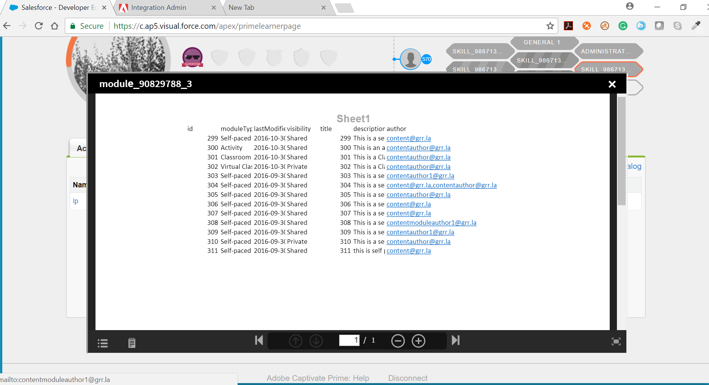

# Integrierbarer Fluidic Player

In diesem Artikel erfahren Sie, wie Sie den Fluidic Player in eine benutzerdefinierte Anwendung einbetten.

Als Unternehmen können Sie jetzt eine benutzerdefinierte Erfahrung für Ihre Teilnehmer bereitstellen, auch außerhalb von Learning Manager. Mit der öffentlichen API können Sie alle Informationen zu Lernobjekten, Teilnehmerregistrierungen und Lernfortschritt abrufen und auf Ihrer Website anzeigen. Wichtiger noch: Sie können sogar den Fluidic Player des Learning Manager in Ihre Website einbetten, sodass der Teilnehmer den Inhalt direkt auf Ihrer Website nutzen kann. Der Fluidic Player gibt Ihnen die Möglichkeit, alle von Learning Manager unterstützten Inhalte wiederzugeben. Wenn es auf Ihrer eigenen Website eingebettet ist, verfügt es über genau die gleichen Funktionen wie bei Verwendung in Learning Manager.

**Beliebige eLearning-Inhalte wiedergeben[](../../learners/feature-summary/fluidic-player.md#main-pars_text_779047019)**

Der Fluidic Player spielt praktisch jede Art von E-Learning-Inhalten auf dieselbe konsistente und intuitive Weise ab, ohne dass Plug-ins oder Downloads erforderlich sind. Der Teilnehmer kann den Inhalt starten und er wird unabhängig vom Inhalt und Dateityp abgespielt.

**Notizen und Lesezeichen**

Sie können unabhängig vom Dateityp Notizen machen und Lesezeichen für jeden Inhalt erstellen. Wenn Sie eine bestimmte Auswahl aus einer langen Datei oder einem Video treffen möchten, können Sie genau an den Stellen Lesezeichen setzen, an denen Sie die Informationen gefunden haben, die für Ihre Anforderungen relevant sind. Die Notizen und Lesezeichen können durchsucht oder als E-Mail gesendet werden. Wenn Sie auf diese klicken, gelangen Sie genau an diese Stelle des Videos oder der Seite des Dokuments im Fluidic Player.

Weitere Informationen zum Fluidic Player finden Sie unter [Fluidic Player](../../learners/feature-summary/fluidic-player.md).

Im Folgenden finden Sie einige Beispiele für die Verwendung des integrierbaren Fluidic Players.

* Sie können den integrierbaren Fluidic Player auf Ihrer ** **-Website verwenden, um die Kurse aufzulisten, für die Ihr Mitarbeiter registriert ist, und einen Link zum Starten einer Schulung auf derselben Seite bereitzustellen. Dies würde bedeuten, dass Ihre Teilnehmer Schulungen auf Ihrer Intranet-Website absolvieren können.

* Wenn Sie im Bereich der Schulung tätig sind, verfügen Sie möglicherweise über eine Website, auf der Ihre Kunden Kurse erwerben. Sie können den integrierbaren Player auf derselben Website integrieren, sodass Ihre Kunden den Inhalt, den sie kaufen, auf Ihrer Website nutzen können.

## Schritte zum Einbetten des Fluidic Players in Ihre Website {#stepstoembedfluidicplayerinyourwebsite}

Das Erstellen einer benutzerdefinierten Anwendung zum Einbetten von Fluidic Player in Ihre Website umfasst drei grundlegende Schritte:

1. Erstellen Sie eine Anwendung in der Integrations-Admin-App von Learning Manager.
1. Abrufen des Zugriffstokens.
1. Verwenden Sie das Zugriffstoken, um Ressourcen mithilfe der öffentlichen API aus dem Lern-Manager abzurufen.

### 1. Erstellen Sie eine Anwendung im Integrationsadministrator {#1createanapplicationinintegrationadmin}

Dieser Schritt ist erforderlich, um eine Anwendungs-/Client-ID und einen Anwendungs-/Client-Schlüssel zu erstellen, die zum Abrufen des Aktualisierungstokens und des Zugriffstokens verwendet werden. Weitere Informationen zum Erstellen einer Anwendung finden Sie unter  [Anwendungsentwicklungsprozess.](developer-manual.md#main-pars_header_994876235)

1. Wechseln zu **[!UICONTROL IntegrationAdmin]** App öffnen **[!UICONTROL Anwendungen]**.

1. Auswählen **[!UICONTROL Registrieren]** in der rechten oberen Ecke der Seite.
1. Die **[!UICONTROL Registrieren einer neuen Anwendung]** &quot; wird geöffnet. Füllen Sie die erforderlichen Felder aus.
1. Wenn die benutzerdefinierte Anwendung für mehrere Konten freigegeben werden muss, wählen Sie **[!UICONTROL Nein]** im Optionsfeld  **[!UICONTROL Nur für dieses Konto?]**
1. Um die Anwendung zu speichern und Ihre Anwendungs-ID und den Schlüssel zu generieren, klicken Sie auf **[!UICONTROL Speichern]**.

### 2. Abrufen des Zugriffstokens {#2retrievingaccesstoken}

Da Learning Manager OAUTH2.0 verwendet, ist ein Zugriffstoken erforderlich, um Ressourcen mithilfe der öffentlichen API abzurufen. Das Zugriffstoken kann mithilfe des Aktualisierungstokens, der Client-ID oder des Client-Geheimnisses abgerufen werden.

**2.1 Aktualisierungstoken**

* OAuth-Code abrufen

OAuth-Code ist zum Abrufen des Aktualisierungstokens erforderlich. Learning Manager leitet den Benutzer zur Umleitungs-URL mit dem OAuth-Code um, wenn er sich mit der folgenden URL anmeldet (die OAuth-Codeextraktion ist in der Datei &quot;oauthredirect.html&quot; in der Beispielanwendung dargestellt):

```
code https://learningmanager.adobe.com/oauth/o/authorize  
client_id= <application_id>  
&redirect_uri=<redirect_uri>  
&state=<dummy_data>  
&scope=learner:read,learner:write  
&response_type=CODE  
&account=<account_id>  
&email=<email_id>
```

Hier, **[!UICONTROL Client-ID]** ist die in Schritt 1 erhaltene Anwendungs-ID.
**[!UICONTROL redirect_url]** ist die in Schritt 1 festgelegte redirect_url.
**[!UICONTROL Status]** ist jeder Dummy-Daten, auf deren Grundlage wir Umleitungs-URL filtern müssen, um OAuth-Code zu erhalten. Der Umfang ist der Teilnehmerbereich, der in Schritt 1 festgelegt wurde.
**[!UICONTROL response_type]**e steht immer für &quot;CODE&quot;.\
**[!UICONTROL Bericht]**ist ein optionales Feld.\
**[!UICONTROL email]** ist ein optionales Feld\
&#42; Wenn sowohl die Konto-ID als auch die E-Mail-Adresse angegeben werden, kann sich der Benutzer über die obige URL bei demselben Konto anmelden. Dieses Endpunktbeispiel wird in der Datei &quot;index.html&quot; in der Beispielanwendung dargestellt.

* Aktualisierungstoken abrufen

Sobald OAuth-Code empfangen wurde, kann das Aktualisierungstoken mithilfe des empfangenen OAuth-Codes, der Client-ID und des Client-Secrets vom folgenden Endpunkt abgerufen werden:

**https://learningmanager.adobe.com/oauth/token**

Als Antwort auf Ihre POST-Anfrage erhalten Sie Folgendes:

i. refresh_token\
ii. access_token\
iii. user_id\
iv. expiry_in\
v. Benutzerrolle\
vi. account_id

**2.2 Abrufen des Zugriffstokens aus dem Aktualisierungstoken**

Um Ihr Zugriffstoken abzurufen, senden Sie eine weitere Anforderung mit Ihrem refresh_token, client_id und client_secret als POST-Text an die folgende URL:

**https://learningmanager.adobe.com/oauth/token/refresh**

Als Antwort auf Ihre POST-Anfrage erhalten Sie Folgendes:\
i. refresh_token\
ii. access_token\
iii. user_id\
iv. expiry_in\
v. Benutzerrolle\
vi. account_id

### 3. Abrufen von Ressourcen mithilfe der öffentlichen API {#3retrieveresourcesusingpublicapi}

Als dritten Schritt müssen Sie das Zugriffstoken verwenden, um Ressourcen mithilfe der öffentlichen API aus dem Learning Manager abzurufen.  Das Zugriffstoken ist erforderlich, um einen öffentlichen API-Aufruf durchzuführen, und es muss im Header hinzugefügt werden, wie in der Beispielanwendung gezeigt.

## Integrierbarer Player {#embeddableplayer}

Anwendungen von Drittanbietern können den integrierbaren Player verwenden, um den Inhalt eines Lernobjekts wiederzugeben.

**Kurs in integrierbarem Player öffnen**

1. Einbettbare URL erstellen

   Um einen Kurs mit dem integrierbaren Player zu öffnen, müssen Sie eine integrierbare URL wie unten gezeigt erstellen:

   `https://learningmanager.adobe.com/app/player?lo_id=<v2-api course id>&access_token=<access_token>`

   Hierbei muss lo_id mit dem Kurs-ID-Format der V2 API übereinstimmen.

   Beispiel: `https://learningmanager.adobe.com/app/player?lo_id=course:123456&access_token=45b269b75ac65d6696d53617f512450f`

   Zertifizierungen, Lernprogramme und jobAids können auch im integrierbaren Player abgespielt werden.

   Beispiele: `https://learningmanager.adobe.com/app/player?lo_id=certification:12345&access_token=c1a4847dfbf4007826a027d481b93c1e`

   `https://learningmanager.adobe.com/app/player?lo_id=learningProgram:12345&access_token=c1a4847dfbf4007826a027d481b93c1e`

   `https://learningmanager.adobe.com/app/player?lo_id=jobAid:1234&access_token=c1a4847dfbf4007826a027d481b93c1e`

1. Legen Sie diese URL im Attribut &quot;src&quot; des iframe fest.

**Integrierbarer Player wird geschlossen**

```
code window.addEventListener("message", function closePlayer(){  
   if(event.data === "status:close"){  
     //handle closing event  
   }  
});
```

## Beispielanwendungs-Tutorial {#sampleapplicationtutorial}

Das angehängte PDF-Dokument enthält ein Beispielanwendungs-Tutorial.
[Beispiel-Tutorial und Tutorial-Quelle zum Einbetten von Fluidic Player.](assets/sample-applicationtutorial.zip) Alternative Inhalte

Als Administrator können Sie Ihr Kursmaterial so einrichten, dass Sie den Teilnehmern im Fluidic Player alternative Inhalte anbieten können. Wenn Sie beispielsweise Teilnehmer in verschiedenen Regionen haben, die mehrere Sprachen verwenden möchten, können Sie denselben Inhalt in mehreren Sprachen erstellen. Der Fluidic Player bietet dem Teilnehmer die Sprache, für die er möglicherweise eingerichtet ist, aber der Teilnehmer hat auch die Möglichkeit, direkt im Player zu einer anderen Sprache zu wechseln.

Videospezifische Steuerelemente

Die Streaming-Technologie, die vom Learning Manager Fluidic Player verwendet wird, bietet Teilnehmern eine Videowiedergabe ohne Verzögerungen beim Starten des Videos und ohne Bedarf an Speicherplatz auf einem beliebigen Gerät. Der Fluidic Player bietet außerdem intelligente Steuerelemente wie Wiedergabegeschwindigkeit (1x, 1,5x) und Überspringen von +-10 Sekunden, die dem Teilnehmer die exakte Steuerung bieten, die er benötigt, um seine Lerngeschwindigkeit einzuhalten.

Dies ist eine Aufgabe, die von einem Mitarbeiter Ihres IT-Teams oder einem externen Berater ausgeführt werden muss, der eine Anwendung erstellen kann, die dann auf Ihrer Website gehostet wird.

1. Ändern Sie die URL des eingebetteten Players von Learning Manager mit Parametern, die auf das exakte Lernobjekt verweisen, das absolviert werden muss.

   URL:  [https://learningmanager.adobe.com/app/player](https://cpcontents.adobe.com/public/embedplayer/index22fa615ec2baa034a22090c8cd4289fa.html)

1. Verwenden Sie einen der folgenden Parameter, um einen Kurs zu starten:

   * course_id : Die ID des zu startenden Kurses
   * learning_program_id : Die ID des zu startenden Lernprogramms
   * certification_id : Die ID der zu startenden Zertifizierung
   * lo_id : Die ID des abzuspielenden Lernobjekts (Kurs/Lernprogramm/Zertifizierung/Arbeitshilfe)


1. Verwenden Sie das Zugriffstoken als obligatorischen Parameter.

   * access_token : Dies ist der Sicherheitsparameter, verwenden Sie das öffentliche API-OAuth-Zugriffstoken

   Sie können Ihr Token abrufen, indem Sie Ihren integrierbaren Fluidic Player in Ihrem Integrationsadministrator einrichten. Sie können Ihr Authentifizierungstoken abrufen, das Sie als Zugriffstoken verwenden können.

   Beispiel einer erstellten URL; https://learningmanager.adobe.com/app/player?lo_id=&quot;+lo_id+&quot;&amp;access_token=&quot;+accToken

   Hierbei ist lo_id die ID des Kurses, des Lernprogramms, der Zertifizierung und jobAid .

   Beispiele für lo_id - course:21324, learningProgram:2143, certification:23432, jobAid:237

1. Führen Sie Lern-Manager-API-Aufrufe durch, um die oben genannten Parameter abzurufen.

   Diese API-Aufrufe müssen von der Anwendung erfolgen, die Ihr IT-Team/Berater auf Ihrer Website schreiben und hosten würde.

   Weitere Informationen zur Verwendung der API finden Sie hier:

   Learning Manager V1 API - [https://learningmanager.adobe.com/docs/primeapi/v1/](https://learningmanager.adobe.com/docs/primeapi/v1/)


   Learning Manager V2-API - [https://learningmanager.adobe.com/docs/primeapi/v2/](https://learningmanager.adobe.com/docs/primeapi/v2/)

   Die IDs der Objekte unterscheiden sich von der V1- und der V2-API. Der integrierbare Player erwartet IDs im v2-Format. Verwenden Sie die API für die ID-Zuordnung in V2, um von V1-IDs zu V2-IDs zu konvertieren.

   Nach dem Erstellen der URL würde die Anwendung sie zum Anzeigen für den Teilnehmer verwenden, indem sie sie in einen iFrame einfügt. Wenn Sie auf diesen Link klicken, wird der Fluidic Player mit dem entsprechenden Kurs im Kontext gestartet.

   

   Um Fortschritts- und Abschlussberichte zu überprüfen, melden Sie sich bei Learning Manager an.

   Wenn der Teilnehmer den Player schließt, sendet der Fluidic Player eine &quot;close&quot;-Nachricht an das übergeordnete Element, indem er html5 postMessage verwendet. Der Laderegler sollte diese Meldung verarbeiten und fortfahren.

Ändern Sie die URL des eingebetteten Players von Learning Manager mit Parametern, die auf das exakte Lernobjekt verweisen, das absolviert werden muss.

URL:  [https://learningmanager.adobe.com/app/player](https://learningmanager.adobe.com/app/player)

Jeder dieser Parameter kann zum Starten eines Kurses verwendet werden:

* course_id : Die ID des zu startenden Kurses
* learning_program_id : Die ID des zu startenden Lernprogramms
* certification_id : Die ID der zu startenden Zertifizierung
* lo_id : Die ID des abzuspielenden Lernobjekts (Kurs/Lernprogramm/Zertifizierung/Arbeitshilfe)

Obligatorischer Parameter:

* access_token : Dies ist der Sicherheitsparameter, verwenden Sie das öffentliche API-OAuth-Zugriffstoken

Führen Sie Lern-Manager-API-Aufrufe durch, um die oben genannten Parameter abzurufen. Diese API-Aufrufe müssen von der Anwendung erfolgen, die Ihr IT-Team/Berater auf Ihrer Website schreiben und hosten würde.

Weitere Informationen zur Verwendung der API finden Sie hier:

Learning Manager V1 API - [https://learningmanager.adobe.com/docs/primeapi/v1/](https://learningmanager.adobe.com/docs/primeapi/v1/)


Learning Manager V2-API -  [https://learningmanager.adobe.com/docs/primeapi/v2/](https://learningmanager.adobe.com/docs/primeapi/v2/)


