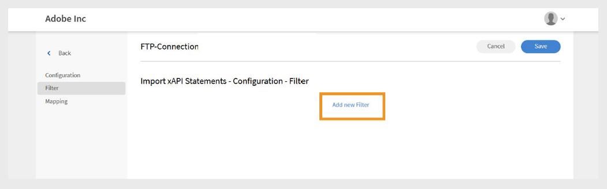

# FTP-Connector in Adobe Learning Manager

## Einführung

FTP (File Transfer Protocol) ist ein Standard-Netzwerkprotokoll, das zum Übertragen von Dateien zwischen einem Client und einem Server über das Internet oder ein lokales Netzwerk verwendet wird. Benutzer können damit Dateien auf einem Remote-Server hochladen, herunterladen und verwalten. Für sichere Dateiübertragungen werden häufig Varianten wie SFTP (SSH File Transfer Protocol) und FTPS (FTP Secure) verwendet. FTP ist in Unternehmensumgebungen weit verbreitet, um den Datenaustausch zwischen Systemen zu automatisieren, z. B. indem Anwender- oder Schulungsdaten zwischen Adobe Learning Manager und externen Plattformen synchronisiert werden.

Dieses Dokument bietet Integrationsadministratoren schrittweise Anleitungen zur Einrichtung und Verwendung des FTP-Connectors in Adobe Learning Manager. Der FTP-Connector ermöglicht den automatisierten Datenaustausch zwischen Learning Manager und externen Systemen mithilfe sicherer Dateiübertragungsprotokolle.

Sie erfahren, wie Sie FTP-Verbindungen konfigurieren, Datenfelder zuordnen, automatisierte Benutzerimporte oder -exporte planen und die Synchronisierungsaktivität überwachen. Dieser Leitfaden unterstützt eine reibungslose und sichere Integration mit externen Lernplattformen oder HR-Systemen. Sie können interne Benutzer und xAPI-Anweisungen importieren und Benutzerkenntnisse, Teilnehmertranskripte und xAPI-Daten exportieren.

Integrationsadministratoren müssen CSV-Dateien zum Migrieren von Benutzern, Benutzerdaten oder Lerninhalten generieren und in bestimmte Ordner im Adobe Learning Manager FTP-Konto hochladen. Anschließend liest, führt Adobe Learning Manager die Daten zusammen und importiert sie nach einem festgelegten Zeitplan.

Führen Sie diese Vorgänge entweder nach Bedarf oder durch Einrichten eines Zeitplans aus, der den Anforderungen Ihrer Organisation entspricht.

## Vorteile der FTP-Integration

- Weniger manueller Aufwand und weniger menschliches Versagen beim Daten-Management.
- Integriert Daten aus mehreren externen Quellen gleichzeitig.
- Unterstützt sowohl On-Demand- als auch terminierte Datenvorgänge.
- Ermöglicht eine detaillierte Feldzuordnung zwischen verschiedenen Systemformaten.

## Voraussetzungen

Stellen Sie vor der Konfiguration des FTP-Connectors sicher, dass Ihre Umgebung die folgenden Anforderungen erfüllt:

- Rolle des Integrationsadministrators mit FTP-Connector-Berechtigungen.
- Stabile Internetverbindung mit ausreichender Bandbreite für Dateiübertragungen.
- Firewall-Konfiguration, die FTP-Verkehr auf den erforderlichen Ports zulässt.
- Erforderlicher Portzugriff, abhängig von Ihren Sicherheitsanforderungen

### Berechtigung und Zugriff

Stellen Sie sicher, dass Sie über Folgendes verfügen:

- Zugriff zum Generieren und Verwalten von SSH-Schlüsseln (bei Verwendung der SSH-Authentifizierung).
- Berechtigung zum Erstellen und Aktualisieren von CSV-Dateien in den angegebenen FTP-Ordnern.

## Wichtigste Funktionen

### Datenimport und -export mit dem FTP-Connector

Der FTP-Connector in Adobe Learning Manager vereinfacht den Datenaustausch zwischen externen Systemen und Ihrem Adobe Learning Manager-Konto. Es unterstützt geplante und On-Demand-Import- oder -Exportvorgänge, reduziert den manuellen Aufwand und gewährleistet genaue, aktuelle Informationen.

Diese Methode unterstützt die Integration mit mehreren externen Systemen. Wenn verschiedene Systeme separate CSV-Dateien generieren, führt Adobe Learning Manager die Daten zusammen und importiert sie als einen einzigen Stapel.

### Daten in Adobe Learning Manager importieren

_Benutzerdatenimport_

Laden Sie strukturierte CSV-Dateien in bestimmte FTP-Ordner hoch, um interne Benutzerdaten zu importieren. Adobe Learning Manager liest und verarbeitet diese Dateien gemäß Ihrem konfigurierten Zeitplan, um Benutzerinformationen auf dem neuesten Stand zu halten.

_Integration mehrerer Quellen_

Wenn Sie mehrere externe Systeme verwenden, kann jedes System eine eigene CSV-Datei generieren. Adobe Learning Manager führt die Dateien zusammen und verarbeitet die Daten als einen einzigen Stapel. So lassen sich Benutzerdatensätze aus unterschiedlichen Quellen leichter verwalten.

_xAPI-Import_

Der Connector unterstützt auch xAPI (Experience API)-Anweisungen. Importieren Sie diese aus Drittanbieter-Lernsystemen, um Lernaktivitäten über mehrere Plattformen hinweg zu verfolgen und darüber zu berichten.

### Daten aus Adobe Learning Manager exportieren

_Export von Teilnehmerdaten_

Exportieren Sie Benutzerdaten wie Kenntnisfortschritt, Kursabschlüsse und Leistungsmetriken an einen bestimmten FTP-Speicherort. Verwenden Sie diese Daten für externe Berichte oder Analysen.

_Teilnehmertranskripte_

Erstellen und exportieren Sie detaillierte Transkripte mit Kursabschlüssen, Zertifizierungen und Lernpfaden, um die Compliance und die Berechtigungsüberprüfung zu unterstützen.

### Attributzuordnung

Zuordnen von CSV-Dateispalten zu Adobe Learning Manager-Benutzerattributen. Sie können die Zuordnungskonfiguration nach Bedarf wiederverwenden und aktualisieren, sodass Sie sich leicht an Änderungen der Datenanforderungen anpassen können.

### Planung und Automatisierung

Planen Sie die Ausführung von Import- und Exportaufgaben in regelmäßigen Abständen, z. B. täglich, wöchentlich oder in benutzerdefinierten Intervallen. Dies gewährleistet konsistente Datenaktualisierungen ohne manuellen Aufwand.

## FTP-Connector konfigurieren

Konfigurieren Sie den FTP-Connector, um eine sichere Datensynchronisierung zwischen Adobe Learning Manager und externen Systemen einzurichten.

Konfigurieren des FTP-Connectors:

1. Melden Sie sich als Integrationsadministrator an.
2. Wählen Sie **Adobe Learning Manager FTP** und anschließend **Erste Schritte**.

   
   _Adobe Learning Manager FTP-Connector-Oberfläche mit der Schaltfläche &quot;Erste Schritte&quot;_

3. Wählen Sie **Weiter**, um mit dem Setup-Assistenten für den FTP-Connector fortzufahren.

   
   Auf der _Konfigurationsseite wird die Schaltfläche &quot;Weiter&quot; angezeigt, um mit dem FTP-Connector-Setup fortzufahren._

### Konfigurieren der Authentifizierung

Adobe Learning Manager unterstützt drei Authentifizierungsmethoden mit jeweils unterschiedlichen Sicherheits- und Komplexitätsanforderungen.

#### Standardauthentifizierung

Diese Methode verwendet den herkömmlichen Benutzernamen und das Kennwort für den FTP-Zugriff. Es ist zwar einfacher zu implementieren, bietet jedoch eine geringere Sicherheit als SSH-basierte Alternativen.

1. Wählen Sie **Erstellen einer Standardauthentifizierung mit einem Kennwort**.
2. Geben Sie den FTP-Benutzernamen und das Kennwort in die angegebenen Felder ein. Überprüfen Sie, ob die Anmeldeinformationen korrekt eingegeben wurden, bevor Sie fortfahren.

   
   _FTP-Authentifizierungsformular mit Feldern für Benutzername und Kennwort, wobei die Option für die Standardauthentifizierung ausgewählt ist_

#### Authentifizierung mit SSH-Schlüssel

Verwenden Sie diese Methode, wenn Sie bereits SSH-Schlüsselpaare für die sichere Authentifizierung eingerichtet haben.

1. Wählen Sie **Authentifizierung mithilfe vorhandener SSH-Schlüssel erstellen**.
2. Kopieren Sie den Inhalt des öffentlichen Schlüssels und fügen Sie ihn in das bereitgestellte Textfeld ein. Stellen Sie sicher, dass das Format des öffentlichen Schlüssels korrekt ist (beginnt normalerweise mit ssh-rsa oder ssh-ed25519).

   
   _SSH-Schlüsselauthentifizierungsschnittstelle mit Textfeld für die Eingabe des öffentlichen Schlüssels_

#### Neuen SSH-Schlüssel generieren

Verwenden Sie diese Option, um ein neues SSH-Schlüsselpaar speziell für diese FTP-Verbindung zu erstellen.

1. Wählen Sie **Authentifizierung erstellen, indem Sie einen neuen SSH-Schlüssel generieren**.
2. Wählen Sie **SSH-Schlüssel generieren**, um ein neues Schlüsselpaar zu erstellen. Laden Sie den generierten privaten Schlüssel sicher herunter und speichern Sie ihn. Der öffentliche Schlüssel wird automatisch für die FTP-Verbindung konfiguriert.

   
   _Bildschirm zum Generieren von SSH-Schlüsseln mit Schaltfläche &quot;SSH-Schlüssel generieren&quot; und anderen Konfigurationsoptionen_

## Verbindung zu FTP über FileZilla herstellen

FileZilla ist ein optionales Tool für die FTP-Verbindungsverwaltung. Es kann verwendet werden, wenn Sie Dateien manuell hochladen, Verzeichnisstrukturen überprüfen oder Verbindungsprobleme außerhalb der automatisierten Adobe Learning Manager-Prozesse beheben müssen.

### FileZilla Installation und Einrichtung

FileZilla ist ein kostenloser Open-Source-FTP-Client, der eine benutzerfreundliche Schnittstelle für Dateiübertragungen bietet.

So verbinden Sie Ihr FTP mit FileZilla:

1. Laden Sie FileZilla von der [offiziellen Website](https://filezilla-project.org/) herunter und installieren Sie es.
2. Öffnen Sie **FileZilla**.
3. Wählen Sie **Datei** und anschließend **Site-Manager** aus.
4. Wählen Sie **Neue Site** aus.
5. Geben Sie die folgenden Details ein:
   - **FTP-Domäne:** Die Adresse des FTP-Servers, mit dem Sie eine Verbindung herstellen möchten, z. B. ftp.example.com. Sie finden Ihre Hostdomäne auf der Seite &quot;FTP-Connector&quot; in Adobe Learning Manager.
   - **Port:** Der standardmäßige FTP-Port ist 21. Adobe Learning Manager verwendet jedoch Port 22 für sichere Verbindungen.
   - **FTP-Benutzername:** Der für den Zugriff auf den FTP-Server erforderliche Anmeldename.
   - **FTP-Kennwort:** Das mit Ihrem FTP-Benutzernamen verknüpfte Kennwort.
6. Wählen Sie **Verbinden**.
7. Sobald die Verbindung hergestellt ist, können Sie Dateien übertragen, indem Sie sie zwischen den lokalen (linken) und den Remote-Bedienfeldern (rechten) ziehen und ablegen.

## Verwenden des FTP-Connectors in Adobe Learning Manager

### Interne Benutzer über den FTP-Connector importieren

Die Benutzerimportfunktion ermöglicht die automatische Synchronisation von Mitarbeiterdaten aus HR-Systemen und anderen externen Quellen in Adobe Learning Manager.

### Attribute zuordnen

Durch Attributzuordnung wird die Verbindung zwischen Ihren externen Daten und der unterstützten Datenstruktur von Adobe Learning Manager erstellt, wodurch sichergestellt wird, dass die Daten in die richtigen Felder gelangen. Dieser Schritt ist obligatorisch.

Zuordnen von Attributen:

1. Wählen Sie **Interne Benutzer** auf der Seite **FTP-Connector** aus.
2. Wählen Sie **Spaltenzuordnung** aus.
3. Auf der Seite **Attribute zuordnen**:
   - Die **linke Seite** zeigt die erforderlichen Felder in Adobe Learning Manager an.
   - Auf der **rechten Seite** werden die CSV-Spaltennamen angezeigt. Zunächst enthält diese Seite leere Dropdown-Menüs.
   - Wählen Sie **Wählen Sie CSV** aus, um eine CSV-Beispieldatei hochzuladen. Dadurch wird die Dropdown-Liste auf der rechten Seite mit den Spaltennamen aus Ihrer CSV-Datei gefüllt. Weitere Informationen finden Sie in [diesem Artikel](https://experienceleague.adobe.com/en/docs/learning-manager/using/integration/migration-manual#csv).
   - Ordnen Sie jedes Adobe Learning Manager-Feld der entsprechenden CSV-Spalte zu.

   
   _Oberfläche für die Attributzuordnung, die links Adobe Learning Manager-Felder und rechts die Dropdown-Listen für CSV-Spalten anzeigt_

4. Wählen Sie **Speichern**, um die Zuordnung abzuschließen.

Nach dem Speichern wird das konfigurierte Konto als **Datenquelle** in der Administrator-App angezeigt. Administratoren können dann einen Import planen oder eine manuelle Synchronisierung auslösen.

### Importieren von xAPI-Anweisungen

Der Import von xAPI-Anweisungen ermöglicht eine detaillierte Verfolgung der Lernaktivitäten, indem externe Lerndaten in Adobe Learning Manager importiert werden.

_Quelle konfigurieren_

Die xAPI-Quellkonfiguration stellt die Verbindung zwischen externen Lernsystemen und der Aktivitätsverfolgung von Adobe Learning Manager her.

So konfigurieren Sie eine Quelle:

1. Navigieren Sie zum xAPI-Konfigurationsabschnitt.
2. Wählen Sie **Neue Konfiguration hinzufügen** in der Konfigurationsliste aus.

   
   _Konfigurationsverwaltungsseite mit Schaltfläche &quot;Neue Konfiguration hinzufügen&quot; und vorhandener Konfigurationsliste_

3. Geben Sie den **Namen** und den **Quelldateinamen** ein:
   - **Name:** Beschreibender Bezeichner für diese xAPI-Quelle (z. B. LMS-Integration oder externes Schulungssystem).
   - **Quelldateiname:** Exakter Dateiname, der in Ihren FTP-Ordner hochgeladen wird (muss genau übereinstimmen, einschließlich Dateierweiterung).

   
   _Konfigurationsformular, das das Namensfeld und das Quelldateinamensfeld anzeigt_

4. Wählen Sie **Speichern** aus, um die Basiskonfiguration zu erstellen.

_Filter hinzufügen (optional)_

Mit Filtern können Sie xAPI-Anweisungen basierend auf bestimmten Kriterien selektiv importieren.

So fügen Sie einen Filter für die Quelle hinzu:

1. Wählen Sie im linken Fensterbereich **Filter** aus.
2. Wählen Sie **Neuen Filter hinzufügen**.

   
   _Filterkonfigurationsseite mit neuer Filterschaltfläche hinzufügen_

3. Konfigurieren Sie Folgendes:
   - **Name:** Beschreibender Name für die Filterregel.
   - **Bedingung:** Vergleichsoperator (gleich, enthält, größer als usw.).

   
   _Dialogfeld zur Filtererstellung mit Namensfeld und Bedingungen_

4. Wählen Sie **Neuen Filter hinzufügen**, um weitere Filter hinzuzufügen.
5. Wählen Sie **Speichern** oder **Löschen** nach Bedarf in der Spalte **Aktionen** aus.
6. Wählen Sie nach dem Hinzufügen von Filtern **Speichern** aus.

_Zuordnungsfelder_

Zuordnen der Felder:

1. Wählen Sie im linken Fensterbereich **Zuordnung** aus.
2. Auf der Seite **Zuordnung** werden links JSON-Feldpfade und rechts CSV-Spaltennamen angezeigt.

   
   _Zuordnung für die Importquelle hinzufügen_

3. Ordnen Sie standardmäßig die folgenden erforderlichen Felder zu:
   - **actor.mbox:** Dies ist die E-Mail-Adresse des Teilnehmers (der ausführende Akteur).
Aktion). Es identifiziert eindeutig, wer die Aktivität durchgeführt hat.
   - **verb.id:** Dies ist der Bezeichner für die vom Teilnehmer durchgeführte Aktion, z. B.
abgeschlossen, versucht oder bestanden. Es legt die Aktion des Teilnehmers fest.
   - **object.id:** Dies gibt das Lernobjekt oder die Aktivität an, mit der der Teilnehmer interagiert hat.
z. B. ein Kurs, ein Modul oder ein Lernpfad.
4. Wählen Sie **Neue Zuordnung hinzufügen**, um weitere Felder zuzuordnen.
5. Wählen Sie für jedes Feld den entsprechenden **Datentyp** (Zeichenfolge, Zahl, Boolescher Wert oder Datum).
6. Wählen Sie **Speichern**, um die Zuordnung abzuschließen.

## Import planen

Automatisierte Planung gewährleistet konsistente Datensynchronisierung ohne manuelle Eingriffe.
die aktuellen Lernaktivitäts-Datensätze werden beibehalten.

So planen Sie den Import:

1. Wählen Sie im linken Fensterbereich **Zeitplan konfigurieren** aus.

   
   _Konfigurationsseite für Zeitplan mit den Aktivierungsoptionen und Zeitsteuerelementen_

2. Wählen Sie **Import von xAPI-Anweisungen über diese Verbindung aktivieren.**
3. Wählen Sie **Zeitplan aktivieren**, um automatische Importe einzurichten.
4. Legen Sie die folgenden Parameter fest:
   - **Startdatum:** Wann der geplante Import beginnen soll.
   - **Uhrzeit:** Tageszeit für die Ausführung des Imports.
   - **Wiederholen nach:** Wie oft Importe ausgeführt werden sollen (tägliche, wöchentliche, benutzerdefinierte Intervalle).
5. Wählen Sie **Speichern**.

## On demand ausführen (optional)

On-Demand-Ausführung ermöglicht sofortigen Datenimport außerhalb regulärer geplanter Vorgänge.

Wann On-Demand-Importe verwendet werden:

- Testen neuer Konfigurationen vor der Planung
- Verarbeitung dringender oder zeitkritischer Datenaktualisierungen
- Einmalige Datenmigrationen oder Korrekturen. Fehlerbehebung bei Importproblemen

So importieren Sie xAPI-Anweisungen manuell:

1. Wählen Sie im linken Fensterbereich **On Demand** aus.
2. Wählen Sie **Ausführen**.

   
   _Seite zur Ausführung bei Bedarf mit Schaltfläche &quot;Ausführen&quot;_

## Ausführungsstatus anzeigen

Die Statusüberwachung ermöglicht die proaktive Verwaltung von Importvorgängen und die schnelle Erkennung von Problemen.

Anzeigen des Ausführungsstatus

1. Wählen Sie **Ausführungsstatus** aus, um eine Liste aller Importausführungen anzuzeigen.
2. Die Seite zeigt Folgendes an:

   - **Startdatum:** Als der Importvorgang begann.
   - **Dauer:** Für die Verarbeitung erforderliche Gesamtzeit.
   - **Typ des Imports:** Ob der Import geplant war oder On-Demand.
   - **Aktueller Status:** Echtzeit-Statusinformationen.
      - **Wird ausgeführt:** Import wird derzeit ausgeführt
      - **Abgeschlossen:** Erfolgreicher Abschluss mit Datensatzzählern
      - **Fehler:** Fehler mit Diagnoseinformationen

## Fehlerbehebung bei Importfehlern

Der Abschnitt Ausführungsstatus bietet eine umfassende Zusammenfassung aller Importaufgaben in chronologischer Reihenfolge, sodass Administratoren Vorgänge überwachen und Probleme schnell identifizieren können.

Statusanzeigen:

- **Erfolg:** Der Import wurde ohne Fehler abgeschlossen.
- **Warnzeichen:** Zeigt Fehler oder Probleme während der Ausführung an.
- **Wird ausgeführt:** Der Importvorgang wird derzeit ausgeführt.
- **Ausstehend:** Import geplant, aber noch nicht gestartet.

Wenn Fehler auftreten, zeigt das System neben fehlgeschlagenen Importvorgängen Warnhinweise an. Wählen Sie den Link Fehlerbericht , um detaillierte Fehlerberichte herunterzuladen.
