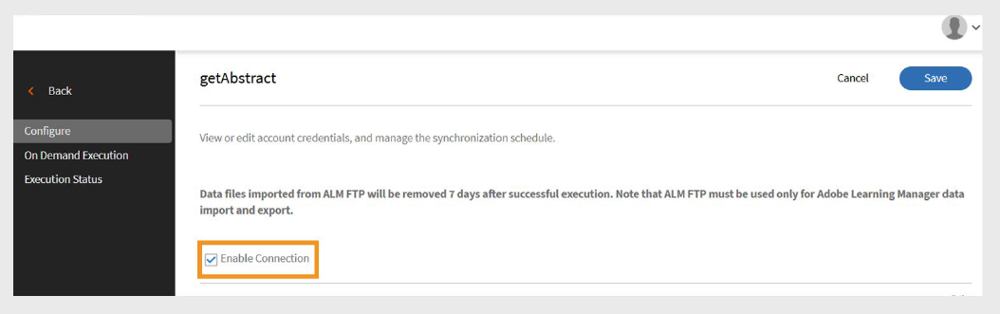

# getAbstract-Connector für Adobe Learning Manager

## Einführung

Der **getAbstract-Connector** ist für Unternehmenskunden von [getAbstract.com](https://www.getabstract.com/) vorgesehen. Dadurch können Teilnehmer getAbstract-Inhalte direkt über Adobe Learning Manager entdecken und nutzen. Der Connector ermöglicht es Administratoren auch, Daten zu Benutzerinteraktionen zu importieren und Teilnehmerabschlussdatensätze automatisch zu verfolgen.

Adobe Learning Manager möchte Teilnehmern fortlaufende, selbstgesteuerte Lernmöglichkeiten bieten, die sich auf Führungskompetenz und Soft Skills konzentrieren. Anstatt alle Inhalte intern zu entwickeln, verbindet der Administrator das getAbstract-Konto des Unternehmens mit Adobe Learning Manager mithilfe des getAbstract-Connectors.

- Importiert automatisch getAbstract-Inhalte in Adobe Learning Manager.
- Verfolgt die Nutzung von Kursen und Lernpfaden durch die Teilnehmer.

In diesem Artikel werden die Schritte zum Konfigurieren und Verwalten des getAbstract-Connectors in Adobe Learning Manager beschrieben.

## Voraussetzungen

- Stellen Sie sicher, dass die **Migration**-Funktion für Ihr Konto aktiviert ist, bevor Sie den Connector konfigurieren.
- Beziehen Sie die **Client-ID** und **Client-Geheimnis** von Ihrem getAbstract-Kontobeauftragten. Diese Anmeldeinformationen sind erforderlich, um Kurs-Metadaten und Benutzernutzungsdaten abzurufen.

## getAbstract-Connector konfigurieren

Der getAbstract-Connector ermöglicht Adobe Learning Manager-Administratoren, das Lernerlebnis durch die Integration hochwertiger, kuratierter Inhalte aus getAbstract zu verbessern.

Konfigurieren des getAbstract-Connectors:

1. Melden Sie sich als Integrationsadministrator an.
2. Wählen Sie auf der Startseite **getAbstract** aus.
3. Wählen Sie auf der Kachel **Connector** eine der folgenden Optionen aus:

   - **Erste Schritte**: Übersicht über den Connector.
   - **Verbindung**: Erstellen Sie eine neue Verbindung.
   - **Verbindungen verwalten**: Vorhandene Verbindungen anzeigen oder ändern.

   
   _getAbstract-Kachel zeigt drei Optionen für die Konfiguration_ an

## Neue Verbindung erstellen

Erstellen einer neuen Verbindung:

1. Wählen Sie **Verbinden**.

   
   _Wählen Sie &quot;Verbinden&quot; auf der getAbstract-Kachel aus, um eine neue Verbindung zu erstellen_

2. Geben Sie einen **Verbindungsnamen** ein.
3. Geben Sie **Client-ID** und **Client-Geheimnis** ein.

   
   _Geben Sie die Verbindung, die Client-ID und den Client-Schlüssel auf der getAbstract-Verbindungsseite ein._

4. Wählen Sie **Speichern**, um die Verbindung zu erstellen.

## getAbstract-Connector verwalten

Bevor Sie Daten importieren, müssen Sie den Connector konfigurieren und einen Synchronisierungszeitplan einrichten. Nach der Konfiguration ruft der Connector automatisch Nutzungsdaten ab, sodass Sie den Fortschritt der Teilnehmer überwachen und getAbstract-Inhalte in Lernpläne und Berichte aufnehmen können.

### Verbindung aktivieren

So aktivieren Sie die Verbindung

1. Wählen Sie **Verbindungen verwalten** auf der Kachel **getAbstract** aus.

   
   _Verbindungen verwalten, um den Datenimport zu konfigurieren und zu planen_

2. Wählen Sie die Verbindung aus.
3. Wählen Sie im linken Navigationsbereich **Konfigurieren** aus.
4. Wählen Sie **Verbindung aktivieren** und anschließend **Speichern** aus.

   
   _Verbindung aktivieren, um Daten von getAbstract in Adobe Learning Manager zu importieren_

### Verbindung bearbeiten

Bearbeiten der Verbindung:

1. Wählen Sie **Verbindungen verwalten** auf der Kachel **getAbstract** aus.
2. Wählen Sie die Verbindung aus.
3. Wählen Sie im linken Navigationsbereich **Konfigurieren** aus.
4. Wählen Sie **Bearbeiten**, um die **Client-ID** und **Client-Geheimnis** zu aktualisieren.

   
   _Anmeldeinformationen einschließlich Client-ID und Client-Schlüssel bearbeiten_

5. Wählen Sie **Speichern**.

### Synchronisierung planen

So planen Sie die Synchronisierung:

1. Wählen Sie **Verbindungen verwalten** auf der Kachel **getAbstract** aus.
2. Wählen Sie die Verbindung aus.
3. Wählen Sie im linken Navigationsbereich **Konfigurieren** aus.
4. Wählen Sie **Zeitplan aktivieren** im Abschnitt **Synchronisierung planen** aus.

   
   _Planen des Datenimports von getAbstract in Adobe Learning Manager_

5. Wählen Sie das Startdatum und die Startzeit in UTC.
6. Geben Sie die Anzahl der Tage ein, nach denen die Synchronisierung wiederholt werden soll.
7. Wählen Sie **Speichern**.

Die Synchronisierungseinstellungen werden gespeichert. Der Connector wird nach dem Zeitplan ausgeführt und importiert Daten aus getAbstract in Adobe Learning Manager.

## On-Demand-Synchronisierung ausführen

Mit der Option **On-Demand-Synchronisierung** können Sie Daten manuell aus getAbstract in Adobe Learning Manager importieren. Dies ist nützlich, wenn Sie die Aktivitätsdaten der Teilnehmer sofort aktualisieren möchten, ohne auf die nächste geplante Synchronisierung zu warten.

So führen Sie den On-Demand-Datenimport aus:

1. Wählen Sie **Verbindungen verwalten** auf der Kachel **getAbstract** aus.
2. Wählen Sie die Verbindung aus.
3. Wählen Sie im linken Fensterbereich **On Demand Execution**.
4. Wählen Sie **Startdatum**.

   
   _Führen Sie die On-Demand-Anforderung für den sofortigen Datenimport von getAbstract in Adobe Learning Manager aus_

5. Wählen Sie eine der folgenden Optionen aus:

   - **Zugriff auf Adobe Learning Manager während der Ausführung deaktivieren**: Empfohlen, wenn die Synchronisierung zu Ausfallzeiten führen kann.
   - **Zugriff auf Adobe Learning Manager während der Ausführung aktivieren**: Es wird empfohlen, Serviceunterbrechungen zu vermeiden.
6. Wählen Sie **Ausführen** aus, um alle Daten vom Startdatum bis zum aktuellen Datum zu importieren.

### Ausführungshistorie anzeigen

Auf der Seite **Ausführungsstatus** werden alle Synchronisierungsläufe in der richtigen Reihenfolge aufgeführt. Wenn bei einem Run Fehler vorliegen, wird ein Warnsymbol angezeigt. Sie können das Fehlerprotokoll überprüfen, die CSV-Datei korrigieren und die neueste Synchronisation bei Bedarf erneut ausführen.

Anzeigen des Ausführungsverlaufs

1. Wählen Sie im linken Fensterbereich **Ausführungsstatus** aus.
2. Sie können die folgenden Spalten sehen:
   - **Ausführen**
   - **Startdatum**
   - **Dauer**
   - **Typ** (Geplant oder On-Demand)
   - **Status** (In Bearbeitung oder abgeschlossen)

   
   _Ausführungsstatus der On-Demand- und geplanten Importe anzeigen_

>[!NOTE]
>
>Wenn Sie eine Verbindung löschen und neu erstellen, ist der Ausführungsverlauf für die vorherigen Ausführungen weiterhin sichtbar. Sie können nur die letzte Synchronisierung erneut ausführen.

### Voraussetzungen für eine erfolgreiche Synchronisierung

So stellen Sie sicher, dass die Synchronisierung ordnungsgemäß funktioniert:

- Eine gültige Benutzer-Feed-Datei muss sich im FTP-Ordner für getAbstract für die angegebenen Synchronisierungsdaten befinden.
- Die Datei sollte dem folgenden Namensformat entsprechen:
   - report_export_yyyy_MM_dd_HHmmss.xlsx oder
   - report_export_yyyy_MM_dd.xlsx

Laden Sie eine [Beispiel-getAbstract-Benutzer-Feed-Datei &#x200B;](https://experienceleague.adobe.com/docs/learning-manager/assets/report-export-20170401175342.xlsx?lang=en) herunter, um das Format zu verstehen.
