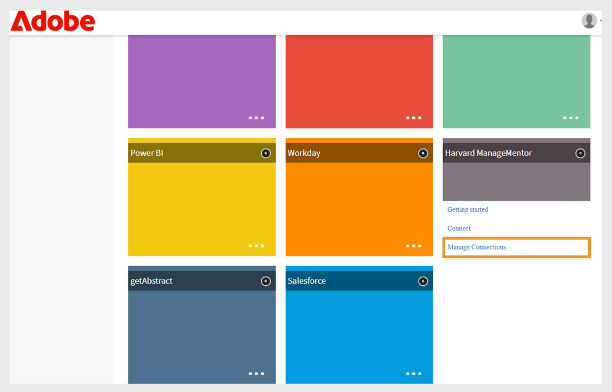
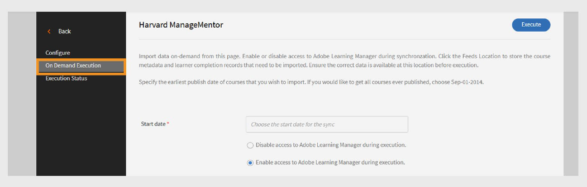

# Harvard ManageMentor-Connector in Adobe Learning Manager

## Einführung

Der **Harvard ManageMentor-Connector** ist für Unternehmenskunden konzipiert, die Harvard ManageMentor verwenden. Dadurch können Teilnehmer Harvard ManageMentor-Kurse direkt von Adobe Learning Manager aus durchsuchen und darauf zugreifen. Sobald die Verbindung hergestellt ist, kann das System regelmäßig Daten zum Teilnehmerfortschritt abrufen und auf der Grundlage der importierten Metadaten Kurse in Adobe Learning Manager erstellen.

In diesem Artikel wird erläutert, wie der Harvard ManageMentor-Connector in Adobe Learning Manager konfiguriert und verwendet wird.

Mit dieser Integration können Integrationsadministratoren das Harvard ManageMentor-Konto des Unternehmens mit Adobe Learning Manager verbinden, um Kurse automatisch zu importieren und den Fortschritt der Teilnehmer zu verfolgen, ohne neue Schulungsinhalte von Grund auf neu erstellen zu müssen.

## Voraussetzung

Stellen Sie sicher, dass die **Migration**-Funktion für Ihr Konto aktiviert ist, bevor Sie den Connector konfigurieren.

## Connector einrichten

Verwenden Sie den Harvard ManageMentor-Connector, um Kurse von Harvard ManageMentor in Adobe Learning Manager zu integrieren. Nachdem Sie Ihr Konto verbunden haben, können Sie Kursdetails importieren und den Fortschritt der Teilnehmer verfolgen.

Einrichten des Connectors:

1. Melden Sie sich als Integrationsadministrator an.
2. Wählen Sie auf der Startseite **Harvard ManageMentor** aus.
3. Wählen Sie eine der folgenden Optionen auf der Verbindungskachel aus:
   - **Erste Schritte**
   - **Verbindung**
   - **Verbindungen verwalten**

   
   _Die Kachel &quot;Harvard ManageMentor&quot; zeigt drei Optionen für die Konfiguration an._

## Neue Verbindung erstellen

Erstellen einer neuen Verbindung:

1. Wählen Sie **Connect** auf der Kachel **Harvard ManageMentor** aus.

   
   _Wählen Sie &quot;Verbinden&quot; aus, um eine neue Harvard ManageMentor-Verbindung zu erstellen_

2. Geben Sie die Verbindung im Feld **Verbindungsname** ein.
3. Wählen Sie **Verbinden**, um die Verbindung zu erstellen.

   
   _Geben Sie den Namen in das Feld &quot;Verbindungsname&quot; ein_

## Verbindung verwalten

Nachdem Sie den Harvard ManageMentor-Connector eingerichtet haben, können Sie Ihre Verbindung in der Adobe Learning Manager verwalten. Sie können die Synchronisationseinstellungen ändern und die Synchronisation manuell oder nach einem Zeitplan ausführen.

### Verbindung aktivieren

So aktivieren Sie die Verbindung

1. Wählen Sie **Verbindungen verwalten** auf der Kachel **Harvard ManageMentor** aus.

   
   _Verbindungen verwalten, um den Datenimport zu konfigurieren und zu planen_

2. Wählen Sie die Verbindung aus.
3. Wählen Sie im linken Navigationsbereich **Konfigurieren** aus.
4. Wählen Sie **Verbindung aktivieren** und anschließend **Speichern** aus.

   
   _Aktivieren Sie den Harvard ManageMentor-Connector, um die Daten zu importieren_

### Synchronisierung planen

So planen Sie die Synchronisierung:

1. Wählen Sie **Verbindungen verwalten** auf der Kachel **Harvard ManageMentor** aus.
2. Wählen Sie die Verbindung aus.
3. Wählen Sie im linken Navigationsbereich **Konfigurieren** aus.
4. Wählen Sie **Zeitplan aktivieren** im Abschnitt **Synchronisierung planen** aus.

   
   _Planen des Datenimports von Harvard ManageMentor in Adobe Learning Manager_

5. Wählen Sie das Startdatum und die Startzeit in UTC.
6. Geben Sie die Anzahl der Tage ein, nach denen die Synchronisierung wiederholt werden soll.
7. Wählen Sie **Speichern**.

Die Synchronisierungseinstellungen werden gespeichert. Der Connector wird nach dem Zeitplan ausgeführt und importiert Daten aus Harvard ManageMentor in Adobe Learning Manager.

## On-Demand-Synchronisierung ausführen

Mit der Option **On-Demand Synchronization** können Sie Daten manuell aus Harvard ManageMentor in Adobe Learning Manager importieren. Dies ist nützlich, wenn Sie die Aktivitätsdaten der Teilnehmer sofort aktualisieren möchten, ohne auf die nächste geplante Synchronisierung zu warten.

So führen Sie den On-Demand-Datenimport aus:

1. Wählen Sie **Verbindungen verwalten** auf der Kachel **Harvard ManageMentor** aus.
2. Wählen Sie die Verbindung aus.
3. Wählen Sie im linken Fensterbereich **On Demand Execution**.
4. Wählen Sie **Startdatum**.

   
   _Führen Sie die On-Demand-Anforderung für den sofortigen Datenimport von Harvard ManageMentor nach Adobe Learning Manager aus_

5. Wählen Sie eine der folgenden Optionen aus:

   - **Zugriff auf Adobe Learning Manager während der Ausführung deaktivieren**: Empfohlen, wenn die Synchronisierung zu Ausfallzeiten führen kann.
   - **Zugriff auf Adobe Learning Manager während der Ausführung aktivieren**: Es wird empfohlen, Serviceunterbrechungen zu vermeiden.
6. Wählen Sie **Ausführen** aus, um alle Daten vom Startdatum bis zum aktuellen Datum zu importieren.

### Ausführungshistorie anzeigen

Auf der Seite &quot;Ausführungsstatus&quot; werden alle Synchronisationsläufe in der richtigen Reihenfolge aufgeführt. Wenn bei einem Run Fehler vorliegen, wird ein Warnsymbol angezeigt. Bei Bedarf können Sie das Fehlerprotokoll überprüfen, die CSV-Datei korrigieren und die neueste Synchronisation erneut ausführen.

Anzeigen des Ausführungsverlaufs

1. Wählen Sie im linken Fensterbereich **Ausführungsstatus** aus.
2. Sie können die folgenden Spalten sehen:
   - **Ausführen**
   - **Startdatum**
   - **Dauer**
   - **Typ** (Geplant oder On-Demand)
   - **Status** (In Bearbeitung oder abgeschlossen)

   
   _Ausführungsstatus der On-Demand- und geplanten Importe anzeigen_

>[!NOTE]
>
>Wenn Sie eine Verbindung löschen und neu erstellen, ist der Ausführungsverlauf für die vorherigen Ausführungen weiterhin sichtbar. Sie können nur die letzte Synchronisierung erneut ausführen.

### Anforderungen für die Synchronisierung

Stellen Sie sicher, dass die folgenden Dateien im FTP-Ordner für Harvard ManageMentor vorhanden sind:

- **hmm12_metadata.csv** Diese Datei enthält Kursmetadaten. Verwenden Sie das richtige Dateibenennungsformat.
- **client_hmm12_yyyyMMdd.csv** Diese Datei ist der Benutzer-Feed. Das Datumsformat muss mit jjjjMMtt übereinstimmen.

**Beispieldateien**

- [Kurs-Metadatendatei für Harvard ManageMentor-Connector](https://experienceleague.adobe.com/docs/learning-manager/assets/hmm12-metadata.csv?lang=de)
- [Benutzer-Feed-Datei für Harvard ManageMentor-Connector](https://experienceleague.adobe.com/docs/learning-manager/assets/client-hmm12-20170304.csv?lang=de)
