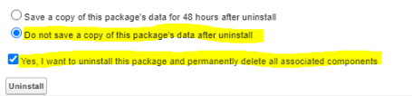

# Installieren des Salesforce-Pakets

## Übersicht

Learning Manager bietet ein Salesforce-App-Paket. Nach der Installation und Konfiguration in SFDC können Vertriebsmitarbeiter ihre Schulungen im SFDC-Portal durchführen. Mit dieser App können SFDC-Benutzer neue Schulungen durchsuchen, Empfehlungen anzeigen und diese direkt im SFDC-Portal nutzen. Anwender erhalten die Benachrichtigungen von Administratoren auch in Form von Briefköpfen direkt in der App innerhalb des SFDC-Portals.

### Einrichten in der Learning Manager-App

1. Melden Sie sich bei Ihrem Learning Manager-Admin-Konto als Integrationsadministrator an.
1. Klicke auf **[!UICONTROL Programme]** > **[!UICONTROL vorgestellten Applikationen]**.
1. Klicke auf **[!UICONTROL Salesforce]**.
1. Notiere dir auf der Salesforce-App-Seite die Applikations-ID (auch Client ID genannt) und das in der Beschreibung erwähnte Kundengeheimnis.
1. Klicke auf **[!UICONTROL Genehmigen]** , und die App muss erfolgreich genehmigt werden.
1. Klicke auf **[!UICONTROL Entwicklerressourcen]** > **[!UICONTROL Zugriffstoken für Tests und Entwicklung]**.
1. Im Abschnitt OAuth-Code abrufen muss die Client-ID und der Umfang auf admin:read, admin:write festgelegt werden. Klicke auf **[!UICONTROL &quot;Absenden&quot;]**.
1. Geben Sie in „Aktualisierungstoken abrufen&quot; die Client-ID und das Client-Secret ein. Klicke auf **[!UICONTROL &quot;Senden&quot;]** , und notiere das Aktualisierungstoken.

### Erstellen eines Kontos in der Salesforce-App

1. Erstellen Sie ein Konto auf der Salesforce-Anmeldeseite. Sie müssen ein Salesforce-Konto in Entwickler- oder Enterprise-Edition erstellen.  [Anmeldung für Entwickler URL](https://developer.salesforce.com/signup). Stellt sicher, dass ihr die E-Mail-ID verwenden müsst, um euch für Salesforce zu registrieren, die ihr für Learning Manager verwendet habt.
1. Bestätigen Sie Ihr Konto über die Bestätigungs-E-Mail.
1. Erstellen Sie ein Kennwort und melden Sie sich bei Salesforce an.
1. Hinweis: Salesforce-URL nach der Anmeldung (z. B. site.lightning.force.com)

### Installieren des Learning Manager-Pakets

Wenn Sie das Paket installieren möchten, müssen Sie zunächst das vorhandene Paket in Salesforce löschen. Vor der Deinstallation müssen Sie die Einstellungen aktivieren, wie unten dargestellt. Das Anwenden dieser Einstellungen ist obligatorisch, da Sie das Paket sonst nicht installieren können.

*Learning Manager-Paket installieren*

>[!NOTE]
>
>Adobe Learning Manager wird nur in der Salesforce Lightning-Ansicht unterstützt.

1. Starte die URL](https://test.salesforce.com/packaging/installPackage.apexp?p0=04tDb000000LRvP) des [Learning Manager-Pakets.
1. Klicke auf der **Anmeldeseite** auf **[!UICONTROL &quot;Benutzerdefinierte Domain verwenden&quot;]**.

1. Gib das Paket URL ein, und klicke auf &quot;Fortfahren&quot;****. Auf der Installationsseite muss die Option &quot;Nur für Administratoren installieren&quot; ausgewählt sein. Ändern Sie diese Option nicht.
1. Klicke auf **&quot;Install**&quot;. Sobald das Paket installiert ist, klicke auf **[!UICONTROL Fertig]**. Sie werden zur Seite „Installierte Pakete“ geleitet, auf der das installierte Adobe Learning Manager-Paket angezeigt wird.

1. Navigieren Sie zum App Launcher (neben „Einrichtung“) und suchen Sie Adobe Learning Manager.
1. Um die App zu konfigurieren, klicke auf **[!UICONTROL Konfigurieren]**.
1. Klicke auf &quot;Neu ]**&quot;**[!UICONTROL , und füge die folgenden Details hinzu:

   * **Konfigurieren:** Geben Sie den gewünschten Namen ein.
   * **ClientID**: Gib den Wert ein, den du aus dem ersten Abschnitt erhalten hast.
   * **Client-Funktion:** Gib den Wert ein, den du aus dem ersten Abschnitt erhalten hast.
   * **RefreshToken:** Gib den Wert ein, den du aus dem ersten Abschnitt erhalten hast.
   * **LearningManagerBaseURL:** Die URL der Website, auf der Learning Manager gehostet wird.
   * **Umleitung deaktivieren:** Deaktivieren Sie die Umleitung zur Teilnehmer-Startseite in Learning Manager.

>[!NOTE]
>
>Sie können nur eine einzelne Konfiguration erstellen. Wenn Sie versuchen, eine weitere Konfiguration hinzuzufügen, wird eine Fehlermeldung angezeigt. Die Konfiguration ordnet das Salesforce-Konto dem Teilnehmerkonto zu.

### Hinzufügen von Remotesite-Einstellungen

1. Klicke oben rechts auf der Seite auf **[!UICONTROL Setup]**.
1. Suche **unter Schnellsuche** nach Remote-Site-Einstellungen.
1. Klicke auf **[!UICONTROL Neue Remote-Site]**.
1. Geben Sie die folgenden Details ein:

   1. **Remotesite-Name:** Geben Sie den gewünschten Namen ein.
   1. **Remotesite-URL:** Die URL der Site, auf der Learning Manager gehostet wird.

1. Starten Sie Learning Manager.

### Adobe-Domäne zu vertrauenswürdigen Salesforce-URLs hinzufügen

Um die Adobe-Domain zu vertrauenswürdigen URLs hinzuzufügen, führe die folgenden Schritte aus:

1. Über die Salesforce-Konsole kannst du setup **** > **[!UICONTROL Quick Find (Schnellsuche) aufrufen]**.
1. Suche nach **[!UICONTROL vertrauenswürdigen URLs]**, und wähle &quot;Neue vertrauenswürdige URL ]**&quot;**[!UICONTROL .
1. Gib einen Namen in das **[!UICONTROL Feld &quot;API Name&quot;]** ein.
1. Füge die URL als `{}.adobe.com{*}`hinzu.
1. Wähle alle Kontrollkästchen in **CSP-Richtlinien aus, und speichere** die Änderungen.
1. Bearbeite das Aktualisierungstoken der Salesforce-App, und speichere es.
1. Salesforce-App neu starten.

### Aktivieren von Benachrichtigungen für die Learning Manager-App

1. Klicke oben rechts auf **Setup**.
1. Suchen Sie nach „Benutzerdefinierte Benachrichtigungen“.
1. Klicke auf &quot;Neu ]**&quot;**[!UICONTROL .
1. Geben Sie die folgenden Details ein:

   1. **Benutzerdefinierter Benachrichtigungsname:** LearningManagerNotification
   1. **API Name:** LearningManagerNotification

1. Wähle sowohl Desktop **** als auch **Mobile** als unterstützte Kanäle aus.

1. Klicken Sie auf **[!UICONTROL Speichern]**.
1. Um Push-Benachrichtigungen für Mobilgeräte zu aktivieren, führen Sie die folgenden Schritte aus:

   1. Installieren Sie die Salesforce-App für Mobilgeräte auf Ihrem Mobiltelefon.
   1. Melden Sie sich mit Ihren Anmeldedaten bei der App an.
   1. Gehe zu **Setup** > **Einstellungen** für die Benachrichtigungsbereitstellung.
   1. Fügen Sie Salesforce für iOS und Android hinzu.

### Deinstallieren von Learning Manager aus Salesforce

1. Wähle in der Salesforce-App &quot;Installed packages&quot; (Installierte Pakete).
1. Klicke auf **[!UICONTROL Deinstallieren]**.

## Konfigurieren von Learning Manager für Salesforce-Benutzer

Die Learning Manager-App ist auch für Benutzer verfügbar, die sich in einem beliebigen Salesforce-Konto befinden. Der Salesforce-Administrator kann Benutzer basierend auf den Profilen hinzufügen. Die Salesforce-Profile ähneln denen in Learning Manager. Beispiel: Administrator, Integrationsadministrator, Kursleiter. Der Salesforce-Administrator kann auch ein benutzerdefiniertes Profil erstellen.

### Profil

Als Salesforce-Administrator können Sie die Profile entweder Benutzern zuweisen oder ein benutzerdefiniertes Profil erstellen.

>[!NOTE]
>
>Anwender müssen sowohl in Salesforce als auch in Learning Manager präsent sein.

*Einem Teilnehmer ein Profil zuweisen*

Wenn du einen Teilnehmer hinzufügst, musst du dem Teilnehmer ein bestimmtes Profil zuweisen. Gehe dann zu diesem Profil, um den erforderlichen Zugriff zu gewähren.

Damit Teilnehmer die Learning Manager-App anzeigen können, musst du die App für alle Teilnehmer aktivieren.

Als Nächstes müssen Sie die Berechtigung für den Zugriff auf die Learning Manager-App bereitstellen.

*Berechtigungen für den Zugriff auf die Learning Manager-App hinzufügen*

Wenn du das Paket installierst, wird ein neuer Berechtigungssatz erstellt, **Adobe Learning Manager User**. Gehe zum Berechtigungssatz, und füge dann die Benutzer hinzu.

Wählen Sie die Benutzer aus und weisen Sie die Berechtigungen entsprechend zu. Die Teilnehmenden können jetzt auf die Learning Manager-App zugreifen.

Wählen Sie jetzt ein Profil aus, z. B. das Standardprofil eines Benutzers, und klicken Sie auf das Profil. Klicke auf &quot;Bearbeiten ]**&quot;, und aktiviere im** Abschnitt &quot;Benutzerdefinierte App-Einstellungen **&quot; das Häkchen** für Adobe Learning Manager **.**[!UICONTROL  Dadurch können Benutzer auf die App zugreifen.

Wählen Sie im Abschnitt **Benutzerdefinierte Registerkarteneinstellungen** in der Dropdownliste **Teilnehmerstartseite** die Option **[!UICONTROL Standard an]**.

Sie müssen die App für alle Profile sichtbar machen.

Klicke auf **[!UICONTROL &quot;Speichern&quot;]** , und die Teilnehmer erhalten Zugriff auf die Learning Manager-App für alle Profile.
