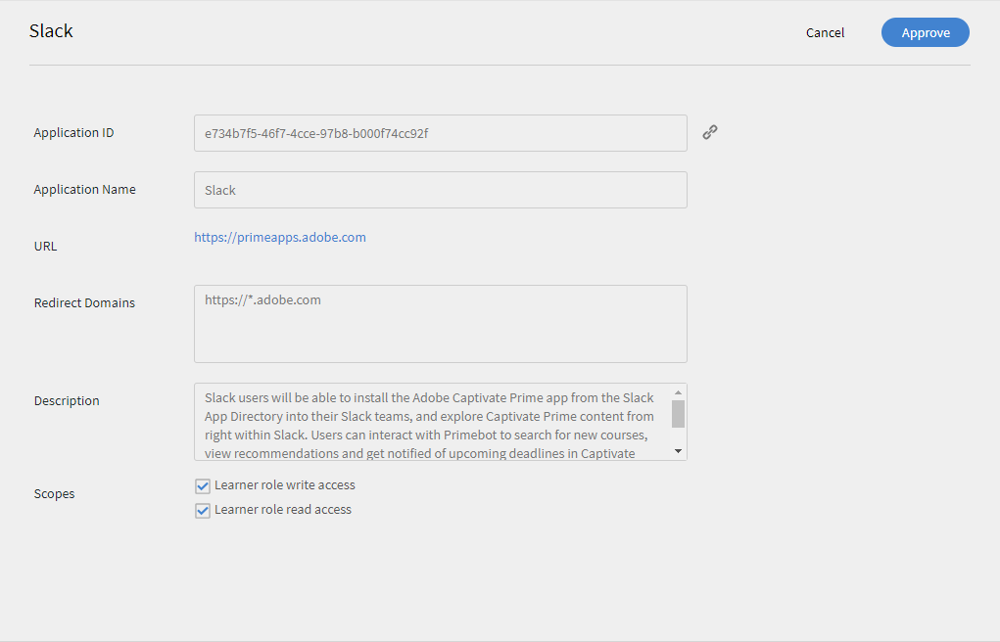

# Learning Manager-Integration in Slack

**wurde entfernt** **Slack** als Connector im Lernmanager. Sie haben keinen Zugriff mehr auf den Slack-Connector.

Als Slack-Benutzer können Sie die Adobe Learning Manager-App aus dem Slack-App-Verzeichnis für Ihre Slack-Teams installieren und Learning Manager-Inhalte direkt in Slack öffnen. Sie können mit Primebot interagieren, um nach neuen Kursen zu suchen, Empfehlungen anzuzeigen und über bevorstehende Fristen im Learning Manager benachrichtigt zu werden. Sie können sich auch direkt in Slack für einen Kurs registrieren und zu Ihren Lerninhalten springen.

Die Learning Manager-App für Slack wird in einer Azure-Instanz von Learning Manager nicht unterstützt.

## Installieren der Adobe Learning Manager-App {#installingadobecaptivateprimeapp}

Als Kursteilnehmer können Sie die CP Prime-App in Ihrem Slack-Konto installieren. Um die App zu installieren, öffnen Sie in Ihrem Slack-Konto das App-Verzeichnis und suchen Sie nach Learning Manager. Laden Sie die App herunter und installieren Sie sie. Wenn die App in Ihrem Konto nicht genehmigt wurde, wenden Sie sich zur Genehmigung an Ihren Integrationsadministrator. Wenn sie bereits genehmigt ist, können Sie sich anmelden.

## Integrations-Admin-Genehmigung der Anmeldung eines Kursteilnehmers {#approvinglearnersigninasanintegrationadmin}

Um als Integrationsadministrator einem Teilnehmer die Berechtigung zur Verwendung der Prime-Anwendung auf dem Slack zu erteilen, führen Sie die folgenden Schritte aus.

1. Wählen Sie im linken Teilfenster **[!UICONTROL Apps]** aus und klicken Sie auf die Registerkarte **[!UICONTROL Empfohlene Apps]**.

   

1. Klicken Sie auf die Kachel **[!UICONTROL Slack]** > die Slack-Integrationsseite wird geöffnet. Klicken Sie in der rechten oberen Ecke auf **[!UICONTROL Genehmigen]**, um die Anwendung zu genehmigen.

   

1. Gehen Sie zurück zur Seite **[!UICONTROL Anwendungen]**. Nach der Genehmigung sollte Slack auf der Registerkarte **[!UICONTROL Externe Apps]** angezeigt werden.
1. Kursteilnehmer können sich jetzt mit Slack bei ihrem Prime-Konto anmelden.

## Primebot-Funktionen {#primebotfunctionalities}

Sie können jetzt mit dem Primebot interagieren. Der Bot bietet folgende Funktionen.

1 - Befehl

&#42;/prime&#42; kann für einmalige, zielgerichtete Abfragen in Bezug auf Ihr Adobe Learning Manager-Konto verwendet werden.

Die verfügbaren Unterbefehle sind:

&quot;/prime find `<query>`&quot; - nach Kursen, Zertifizierungen usw. suchen

„/prime recommend“ – Empfehlungen anzeigen

„/prime deadlines“ – überfällige und bevorstehende Fristen anzeigen

„/prime enrollments“ – Registrierungen anzeigen

„/prime skills“ – Fähigkeiten anzeigen

„/prime notifications“ – Benachrichtigungen anzeigen

„/prime catalogs“ – Kataloge anzeigen

/prime invite - [Nur Administrator] lädt Slack-Benutzer im aktuellen Team ein, den primebot auszuprobieren

„/prime profile“ – Profil anzeigen

„/prime logout“ – in diesem Slack-Team vom Prime-Konto abmelden

„/prime help“ – Hilfetext anzeigen

2 - Empfehlungen

Sie können eine Phrase wie `show my recommendations` ausprobieren, um eine personalisierte Liste von Kursempfehlungen, Zertifizierungen und Lernprogrammen aus Ihrem Adobe Learning Manager-Konto abzurufen.

3 - Suche

Sie können Ausdrücke wie `search for machine learning` oder `search for artificial intelligence` ausprobieren. Sie können die Art des Lernobjekts mit Ausdrücken wie `search for machine learning certifications`, `search for artificial intelligence courses` oder `search for adobe photoshop job aids` angeben. Sie können in einem Katalog auch nach Ausdrücken wie `search for machine learning in Lynda catalog` suchen.

4 - Fristen

Verwenden Sie Formulierungen wie &quot;`show my deadlines`&quot;, um eine Liste überfälliger und anstehender Fristen aus Ihrem Adobe Learning Manager-Konto abzurufen. Sie können überfällige oder bevorstehende Fristen mit Ausdrücken wie `show my overdue deadlines` oder `show my upcoming deadlines` herausfiltern.
