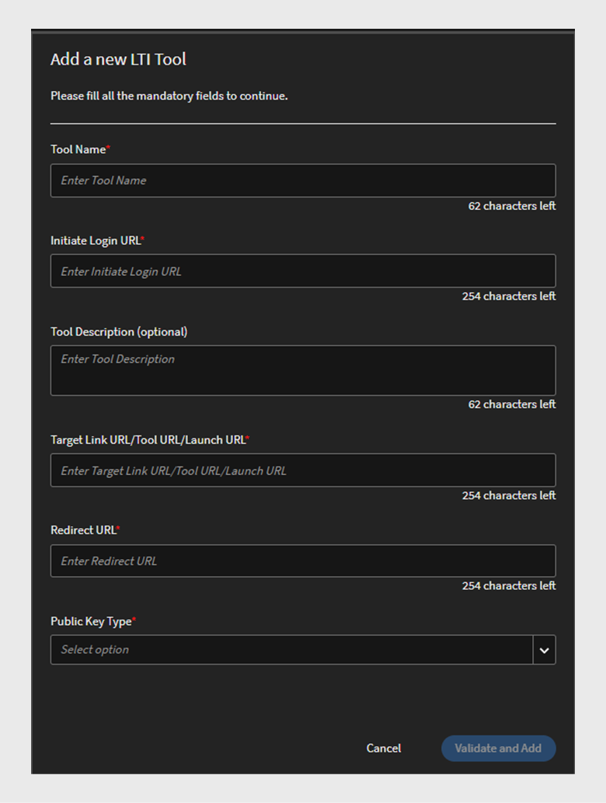

# LTI-Integration

## Was ist LTI?

Learning Tools Interoperability (LTI) ist ein IMS-Standard für die Integration von Rich-Learning-Anwendungen in Lernumgebungen. Benutzer können direkt in ihrem LMS auf externe Lerninhalte von externen Inhaltsanbietern zugreifen, ohne sich anzumelden oder zu einem anderen LMS zu navigieren.

## LTI-Integration mit Adobe Learning Manager

Adobe Learning Manager unterstützt jetzt LTI Version 1.3, mit der es sowohl als Toolanbieter als auch als Tool-Consumer fungieren kann. Diese Funktion verbessert die Interoperabilität zwischen Adobe Learning Manager und anderen Lernmanagementsystemen (LMS).

**LTI als Toolanbieter**: LTI als Toolanbieter ermöglicht die Integration externer Systeme in ein LMS. Adobe Learning Manager fungiert als LTI-Tool-Anbieter, der anderen LMS-Plattformen den Zugriff auf Lernobjekte aus der Adobe Learning Manager direkt in ihrem LMS ermöglicht.

**LTI als Tool Consumer**: LTI als Tool Consumer ermöglicht LMS die Integration externer Tools über Learning Tools Interoperability (LTI). In diesem Szenario ist LMS ein Verbraucher von Diensten, die von externen Tools bereitgestellt werden. Adobe Learning Manager fungiert als LTI Tool Consumer, sodass es LTI-Tools von Drittanbietern integrieren kann, mit denen Adobe Learning Manager-Teilnehmer die Lernobjekte der Drittanbieter-Tools in der Adobe Learning Manager nutzen können.

## Einrichten des LTI-Connectors in ALM

Führen Sie die folgenden Schritte aus, um die LTI-Integration in Adobe Learning Manager zu aktivieren:

1. Melden Sie sich als **[!UICONTROL Integrationsadministrator]** an.
2. Wählen Sie auf der Startseite **[!UICONTROL Anwendungen]** > **[!UICONTROL Empfohlene Apps]**.
3. Wählen Sie **[!UICONTROL LTI-Integrationen]** auf der Seite **[!UICONTROL Anwendungen]** aus.
4. Wählen Sie die Option **[!UICONTROL LTI-Integrationen aktivieren]** und wählen Sie **[!UICONTROL Speichern]**.

_LTI-Integrationen aktivieren_

>[!NOTE]
>
>Sie können die LTI-Integrationen-Option nicht mehr ändern oder deaktivieren, nachdem sie aktiviert wurde.

Dadurch wird die neue LTI-Integrations-Seitenleiste im Administratorkonto erstellt.

_LTI-Seitenleiste_

Eine neue benutzerdefinierte Rolle, **[!UICONTROL LTI-Integration]**, wurde unter **[!UICONTROL Kontoberechtigungen]** im Abschnitt **[!UICONTROL Benutzerdefinierte Rolle]** hinzugefügt. Administratoren können diese Rolle Benutzern zuweisen und ihnen Zugriff auf den Abschnitt **[!UICONTROL LTI-Integration]** gewähren. Administratoren müssen diesen Benutzern auch Berechtigungen für **[!UICONTROL Kataloge]** zum Exportieren der Kurse erteilen. Diese Einrichtung bietet vollständigen Zugriff auf die Abschnitte &quot;LTI&quot; und &quot;Kataloge&quot; zum Exportieren von Kursen.

_Benutzerdefinierte LTI-Integrationsrolle_

## Adobe Learning Manager als LTI-Tool-Anbieter

Als LTI-Anbieter können Sie mit Adobe Learning Manager Kurse aus Ihren Katalogen als LTI-Pakete exportieren, die mit externen LMS-Plattformen gemeinsam genutzt werden können.

### Erstellen und Freigeben der LTI-Anmeldedaten für ein externes LMS - Admin-Arbeitsablauf

Führen Sie die folgenden Schritte aus, um die LTI-Anmeldedaten für ein externes LMS freizugeben:

1. Melden Sie sich als **[!UICONTROL Administrator]** an.
2. Wählen Sie auf der Startseite **[!UICONTROL LTI-Integration]** > **[!UICONTROL LTI-Tool-Konfiguration]**. Die Konfigurationsanmeldeinformationen werden auf dieser Seite angezeigt.
3. Der Administrator kann diese Anmeldeinformationen mit einem externen LMS für die LTI-Website-Registrierung teilen.

   
   _Anmeldeinformationen für die LTI-Tool-Konfiguration_

   * **[!UICONTROL Token-URL]**: Die URL, unter der das LMS ein Zugriffstoken zur Authentifizierung und Autorisierung der Kommunikation mit dem LTI-Tool anfordert.
   * **[!UICONTROL Ziel-Link-URL]**: Die Ziel-URL, unter der Benutzer beim Starten des LTI-Tools vom LMS umgeleitet werden.
   * **[!UICONTROL URL des öffentlichen Schlüsselsatzes]**: Die URL, die öffentliche Schlüssel bereitstellt, die zum Überprüfen von Sicherheitstoken für die sichere Kommunikation verwendet werden.
   * **[!UICONTROL Umleitungs-URL]**: Die URL, an die Benutzer nach Abschluss einer Aktion für das LTI-Tool gesendet werden. Normalerweise werden sie zurück zum LMS umgeleitet.

### Einrichtung eines externen LMS

Anhand der vom Adobe Learning Manager-Administrator freigegebenen Anmeldeinformationen registriert der externe LMS-Administrator Adobe Learning Manager und generiert Anmeldeinformationen. Diese Anmeldeinformationen werden der Adobe Learning Manager als letzten Schritt hinzugefügt, um Adobe Learning Manager als Toolanbieter einzurichten. Im Folgenden sind die externen LMS-generierten Anmeldeinformationen aufgeführt:

* **[!UICONTROL Aussteller- oder Plattform-ID]**: Ein eindeutiger Bezeichner für das LMS oder die Plattform, der die LTI-Startanforderung an den Tool-Anbieter sendet.
* **[!UICONTROL Client-ID]**: Eine eindeutige Kennung, die dem LTI-Tool vom LMS für Autorisierungszwecke zugewiesen wurde.
* **[!UICONTROL Bereitstellungs-ID]**: Ein Bezeichner, der eine bestimmte LTI-Tool-Bereitstellung mit dem LMS zum Verwalten mehrerer Instanzen verknüpft.
* **[!UICONTROL Token-URL]**: Der Endpunkt, an dem das LMS ein Zugriffstoken zur Authentifizierung und Autorisierung von Interaktionen mit dem LTI-Tool anfordert.
* **[!UICONTROL Authentifizierungs-URL]**: Die URL, an die das LMS Benutzer zum Authentifizieren und Initiieren der LTI-Verbindung sendet.
* **[!UICONTROL URL des öffentlichen Schlüssels]**: Die URL, die den vom LTI-Tool verwendeten öffentlichen Schlüssel bereitstellt, um Sicherheitstoken zu überprüfen und eine sichere Kommunikation sicherzustellen.

### Adobe Learning Manager als Werkzeuganbieter hinzufügen - Admin-Arbeitsablauf

Führen Sie die folgenden Schritte aus, um Adobe Learning Manager als Toolanbieter hinzuzufügen:

1. Melden Sie sich als **[!UICONTROL Administrator]** an.
2. Wählen Sie auf der Startseite **[!UICONTROL LTI-Integrationen]** > **[!UICONTROL LTI-Plattformen]**.
3. Wählen Sie **[!UICONTROL Hinzufügen]** aus und geben Sie die von einem externen LMS freigegebenen Anmeldeinformationen ein.

   
   _Neue LTI-Plattform hinzufügen_

4. Nachdem alle diese Werte hinzugefügt wurden, wählen Sie **[!UICONTROL Validate]** und **[!UICONTROL Add]**.

### LTI-Paket exportieren - Administrator-Arbeitsablauf

Mit LTI-Tools können Sie Schulungen aus Ihren Katalogen als herunterladbares Paket von Lerninhalten exportieren, die mit externen LMS (Learning Management Systems) oder Plattformen, die den LTI-Standard (Learning Tools Interoperability) verwenden, gemeinsam genutzt werden können.

Führen Sie die folgenden Schritte aus, um den Kurs aus Adobe Learning Manager zu exportieren:

1. Melden Sie sich als **[!UICONTROL Administrator]** an.
2. Wählen Sie auf der Startseite **[!UICONTROL LTI-Integrationen]** > **[!UICONTROL LTI-Paketexporte]**.
3. Wählen Sie **[!UICONTROL Neuer Paketexport]**.

   
   _LTI-Paket exportieren_

4. Wählen Sie den erforderlichen Katalog aus der Liste aus. Sie können die Liste der im Katalog verfügbaren Kurse anzeigen.
5. Wählen Sie die erforderlichen Kurse aus, und wählen Sie **[!UICONTROL Als LTI exportieren]**.
6. Wählen Sie den Kurs aus, um den Link zum Starten anzuzeigen.
7. Wählen Sie das Symbol **[!UICONTROL Link herunterladen]**, um das Paket herunterzuladen. Das Paket ist eine ZIP-Datei, die die erfolgreich exportierten IMSCC-Dateien enthält.

Über diesen Startlink oder die IMSCC-Datei können Sie Adobe Learning Manager-Kurse in ein externes LMS exportieren. Teilnehmer können die Adobe Learning Manager-Kurse über ihr LMS absolvieren.

>[!NOTE]
>
>Wenn ein Administrator einen Kurs bearbeitet oder die Module aktualisiert, nachdem er den Startlink erstellt hat, wird der Link automatisch aktualisiert. Wenn ein Administrator einen Kurs jedoch einstellt, nachdem der Startlink erstellt wurde, kann der eingestellte Kurs im LTI-Consumer nicht gestartet werden.

## Adobe Learning Manager als LTI-Verbraucher - Admin-Arbeitsablauf

Als LTI-Verbraucher können Sie mit Adobe Learning Manager Aktivitäten, Tools, Inhalte und Widgets von externen LTI-Anbietern verwenden.
Um Adobe Learning Manager als LTI-Consumer hinzuzufügen, benötigen Sie die folgenden Anmeldeinformationen vom externen LTI-Anbieter:

* Anmelde-URL initiieren
* Zielverknüpfungs-URL
* URL weiterleiten
* Typ des öffentlichen Schlüssels

Führen Sie die folgenden Schritte aus, um Adobe Learning Manager als LTI-Verbraucher hinzuzufügen:

1. Melden Sie sich als **[!UICONTROL Administrator]** an.
2. Wählen Sie auf der Startseite **[!UICONTROL LTI Integrations]** > **[!UICONTROL LTI Tool Registration]**.
3. Wählen Sie **[!UICONTROL Hinzufügen]** > **[!UICONTROL Neues LTI-Tool]**.

   >[!NOTE]
   >
   >Sie können mehrere LTI-Tools importieren, indem Sie eine CSV-Datei hochladen.

4. Geben Sie die oben genannten Anmeldeinformationen vom LTI-Anbieter ein.

   
   _Neues LTI-Tool hinzufügen_

5. Wählen Sie anschließend **[!UICONTROL Validate]** und **[!UICONTROL Add]** aus.
6. Der folgende Bildschirm wird angezeigt:

   
   _Registrierungsanmeldeinformationen_

7. Geben Sie diese Anmeldeinformationen für die Registrierung an den LTI-Anbieter weiter. Sobald die Registrierung abgeschlossen ist, können Sie den Startlink oder die IMSCC-Datei vom LTI-Anbieter erhalten, um die Kurse zu importieren.

### LTI-Inhalte erstellen - Arbeitsablauf für Autoren

Die LTI-Anbieter stellen Ihnen einen Startlink oder eine IMSCC-Datei zur Verfügung, um ihre Kurse zu Adobe Learning Manager hinzuzufügen. Führen Sie die folgenden Schritte aus, um Kurse von einem externen LMS hinzuzufügen:

1. Melden Sie sich als **[!UICONTROL Autor]** an.
2. Wählen Sie **[!UICONTROL Inhaltsbibliothek]** > **[!UICONTROL Hinzufügen]** > **[!UICONTROL LTI-Modul]** aus.

   
   _LTI-Inhalt hinzufügen - Autor_

3. Geben Sie **[!UICONTROL Name]** und **[!UICONTROL Beschreibung]** ein.
4. Geben Sie die **[!UICONTROL Launch Link]** und **[!UICONTROL Custom Parameters]** vom LTI-Anbieter ein.
5. Wählen Sie den [!UICONTROL LTI-Anbieter] aus dem Dropdownmenü **[!UICONTROL Tool-Anbieter]** aus.
6. Suchen Sie in der Option **[!UICONTROL Zu Ordner hinzufügen]** nach **[!UICONTROL Öffentlich]** und wählen Sie diese aus. Dadurch stehen die Kurse allen Autoren zur Verfügung.
7. Wählen Sie **[!UICONTROL Speichern]**.
Nachdem der Inhalt erstellt wurde, können Sie diesen Inhalt beim Erstellen des Kurses hinzufügen.

### Kurs mit LTI-Inhalten erstellen - Arbeitsablauf für Autoren

Führen Sie die folgenden Schritte aus, um einen Kurs mit LTI-Inhalten zu erstellen:

1. Melden Sie sich als **[!UICONTROL Autor]** an.
2. Wählen Sie auf der Startseite **[!UICONTROL Kurse]** > **[!UICONTROL Hinzufügen]**.
3. Geben Sie **[!UICONTROL Name]** und **[!UICONTROL Beschreibung]** des Kurses ein.
4. Wählen Sie in der Option **[!UICONTROL Module]** die Option **[!UICONTROL Module hinzufügen]** > **[!UICONTROL Modul zum Selbststudium]** aus.
5. Wählen Sie den **[!UICONTROL LTI-Inhalt]** aus, den Sie erstellt haben, und wählen Sie **[!UICONTROL Speichern]**.
6. Geben Sie die erforderlichen Details ein, z. B. **[!UICONTROL Kenntnisse]**, **[!UICONTROL Autoren]** und **[!UICONTROL Registrierungstyp]**.
7. Veröffentlichen Sie anschließend den Kurs. Adobe Learning Manager-Teilnehmer können die LTI-Kurse von einem externen LTI-Anbieter absolvieren.

## Szenarien für LTI-Exportfehler

Die folgenden Kurstypen können nicht als LTI-Kurse exportiert werden:

* **Kurs mit Aktivitätsmodul**: Kurse, die bestimmte aktivitätsbasierte Module enthalten.
* **Kurs mit mehreren Bereitstellungstypen**: Kurse mit mehreren Bereitstellungstypen umfassen ein Modul zum Selbststudium, ein virtuelles oder ein Klassenzimmermodul, ein Aktivitätsmodul und gemischtes Lernen.
* **Kurs mit Voraussetzungen**: Kurse, für die eine Vorvervollständigung erforderlich ist.
* **Kurs mit mehreren Registrierungen**: Kurse mit mehreren Registrierungen
* **Kurse mit mehreren Instanzen**: Kurse, die mehrere Bereitstellungsinstanzen anbieten.

| Standardinstanz | Eine oder mehrere nicht standardmäßige Instanzen | Erwartung | Fehlermeldungen |
|---|---|---|---|
| Aktiv | Ohne | Exportieren | Ohne |
| Aktiv | Aktiv | Nicht exportieren | Mehrere Instanzen |
| Aktiv | Eingestellt | Nicht exportieren | Mehrere Instanzen |
| Aktiv | Gelöscht | Exportieren | Ohne |
| Eingestellt | Ohne | Nicht exportieren | Def-Instanz einstellen |
| Eingestellt | Aktiv | Nicht exportieren | Def-Instanz einstellen, mehrere Instanzen |
| Eingestellt | Eingestellt | Nicht exportieren | Def-Instanz einstellen, mehrere Instanzen |
| Eingestellt | Löschen | Nicht exportieren | Def-Instanz einstellen |

* **Kurse mit mehreren Fragen-Antworten**: Kurse mit aktivierter MQA.
* **Kurs mit aktiviertem Instanzwechsel**: Kurse, die es Teilnehmern ermöglichen, zwischen Instanzen zu wechseln.
* **Kostenpflichtiger Kurs**: Kurse, die eine Zahlung für die Registrierung erfordern.
* **Kurse Teil des Lernpfads, der Zertifizierung oder des Lernplans**: Kurse Teil der Lernpfade oder -pläne.
* **Kurse, die nicht vom Selbstregistrierungstyp sind**: Kurse, die von der Selbstregistrierung des Teilnehmers eingeschränkt sind.
* **Klassenzimmer- oder virtuelle Klassenzimmerkurse**: Kurse mit Klassenzimmer- oder virtuellen Klassenzimmersitzungen.
* **Kurse mit nicht obligatorischen Modulen**: Kurse, die optionale oder nicht obligatorische Module enthalten.

_Exportstatus_

## LTI-Einschränkungen

Im Folgenden sind LTI-Einschränkungen für LTI-Verbraucher und LTI-Anbieter aufgeführt:

* Kann gemischte Kurse exportieren, was sich auf die Kursnutzung der Teilnehmer auswirkt.
* Sie können Kurse zum Selbststudium mit Klassenzimmern, virtuellen Klassenzimmern oder Aktivitätsmodulen exportieren, was sich auf das Kurserlebnis der Teilnehmer auswirkt.
* Kann freigegebene Kurse wie LinkedIn Learning und Go1-Kurse exportieren.
* Möglichkeit, Kurse mit früheren Anmeldedaten in ALM zu starten, was sich auf den Kurszugriff und die Erfahrung der Teilnehmer auswirkt.
* Teilnehmer können keine LTI-Kurse in der mobilen iOS ALM-App absolvieren, was sich auf die Kursnutzung auswirkt.
* Teilnehmer können keine LTI-Kurse offline in der ALM-Mobilanwendung herunterladen und darauf zugreifen, da diese Kurse von Plattformen von Drittanbietern bereitgestellt werden.
* Administratoren können nur aktivierte Kataloge anzeigen und keine deaktivierten Kataloge.
* ALM bietet Einschränkungen in Bezug auf die Länge von Namen (63 Zeichen) und E-Mails (64 Zeichen) und verhindert so den Zugriff für externe LTI-Teilnehmer, die diese Einschränkungen überschreiten.
* Die Synchronisierung des Kursabschlusses oder die Verzögerungen der Gradationsstufensynchronisierung werden durch das LTI-System eines Drittanbieters verursacht.
* Kurssynchronisierungsmeldungen werden nicht für Teams-Teilnehmer angezeigt, die LTI-Kurse über die Teams-App oder den Browser nutzen, was sich auf die Teilnehmerbenachrichtigungen auswirkt.
* Benutzerdatenberichte können keine Daten für Benutzer exportieren, die über LTI registriert sind.
* Namen von Tool-Anbietern werden nicht automatisch erkannt, wenn Autoren Startverknüpfungen im Tool-Consumer hinzufügen, was eine manuelle Auswahl erfordert.
* Für Uploads von Massenwerkzeugen über CSV ist eine UTF-8-Codierung für Zeichen mit Akzenten erforderlich, um Importfehler zu vermeiden.
* LTI-Kontoadministratoren können keine Kurse, Lernpfade oder Zertifizierungen freigeben, die LTI-Module enthalten.
* Noten können nicht resynchronisiert werden, wenn Benutzer den Player für abgeschlossene ALM-Kurse erneut öffnen, was sich auf die Punktzahlaktualisierungen der Teilnehmer auswirkt und einen manuellen Retrigger erfordert.
* Mit ALM können nur aktive und Testbenutzer die LTI-Kurse nutzen.
* Die in Moodle aktivierte Abstufensynchronisation verhindert, dass der ALM-Player startet, was sich auf den Kurszugriff und die Erfahrung der Teilnehmer auswirkt.
* Das aktive LTI-Feld ist einwertig und unterstützt nicht mehrere Werte.
* Fehlergründe sind nicht verfügbar, wenn ein Export während der Migration von Kursen ohne Kerninhalte fehlschlägt.
* Externe LTI-Kursstufen werden nicht im Teilnehmertranskript angezeigt, und Punktzahlen sind auf der L2-Quizseite nicht sichtbar, was sich auf die Leistungsnachverfolgung der Teilnehmer auswirkt.

## LTI-Startfehler

Im Folgenden sind die Kurse aufgeführt, die der externe LTI-Player aufgrund der letzten Änderungen, die in ALM vorgenommen wurden, nachdem die Startlinks erstellt wurden, nicht starten kann:

* Kurse, in denen die Instanz eingestellt ist.
* Kurse, die eingestellt sind und keine Registrierungen für ALM haben.
* Kurse, die Registrierungen für ALM haben, aber eingestellt sind.
* Kurse, die in ALM gelöscht wurden.
* Kurse, bei denen das Registrierungslimit erreicht wurde.

## Best Practice.

Es wird empfohlen, einen Katalog mit Kursen zu erstellen, die LTI unterstützen, um Exportfehler zu vermeiden und das Exportieren der Kurse zu vereinfachen.

LTI-Katalog mit erfolgreichem Exportstatus
