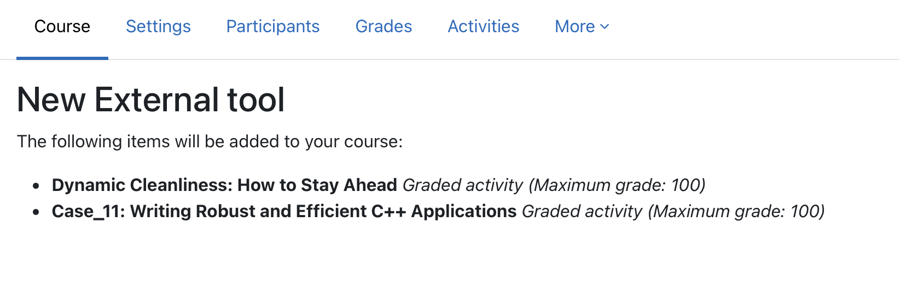

# LTI Deep Linking in Adobe Learning Manager

## Übersicht

**Der folgende Abschnitt gilt für Administratoren**

LTI Deep Linking ist eine LTI-Vorteilsfunktion, mit der Kursleiter oder Kursautoren bestimmte Lernobjekte von Adobe Learning Manager (ALM) direkt in einen externen LTI-Tool-Consumer-/Plattformkurs (wie Canvas oder Moodle) durchsuchen, auswählen und einbetten können.

LTI-Deep Links vereinfachen das Hinzufügen von Kursen zu einer Lernplattform wie Moodle. Im aktuellen Arbeitsablauf muss ein Autor die Kurs-URL manuell kopieren, einschließlich des UUID-Parameters &quot;Exportieren&quot;, und dann die erforderlichen Details in das LMS einfügen, während er den Kurslink konfiguriert. Dieser Schritt muss für jeden Kurs und für jede Platzierung wiederholt werden. Wenn derselbe Kurs beispielsweise an 10 verschiedenen Speicherorten hinzugefügt werden muss, muss der Autor den Vorgang zum Kopieren und Einfügen 10 Mal wiederholen. Dieser manuelle Ansatz erhöht den Aufwand und führt zu einem höheren Risiko von Konfigurationsfehlern.

Durch die Deep-Linking-Funktion wird dieser Overhead vermieden, da das LMS die Kursauswahl während der Einrichtung vornehmen kann. Außerdem wird die entsprechende Start-URL für die Inhaltsauswahl bereitgestellt.

In diesem Modell:

* Kursleiter und Autoren in dem externen LMS starten ein dediziertes Deep-Link-Auswahlerlebnis, um ALM zu durchsuchen.
* Das System gibt ein Deep-Link-Objekt von ALM an das externe LMS zurück, sodass das ausgewählte Element als Teil seines Kurs-Authoring-Workflows eingebettet werden kann.
* Die Schüler nutzen tief verlinkte Inhalte in ihrem primären LMS, das das in ALM gehostete Material nahtlos einführt.

## Problemstellung

ALM unterstützt derzeit die LTI 1.3-Integration, aber ohne einen vollständigen Deep-Linking-Workflow haben Kursleiter und Autoren keine strukturierte Möglichkeit, um:

* Sorgt für eine dedizierte Deep-Link-Auswahl auf Basis eines Modals.
* Durchsuchen Sie nur die Lernobjekte, die für eine bestimmte Plattform verfügbar gemacht werden sollen.
* Wählen Sie ein bestimmtes Lernobjekt aus der Plattform aus.
* ALM gibt dieses Lernobjekt an die Plattform zurück, sodass es direkt in einen Kurs eingebettet werden kann.

Ohne diese Funktion:

* Die Inhaltsauswahl ist manuell oder fragmentiert.
* Alle Kontoinhalte können unbeabsichtigt verfügbar gemacht werden, sofern sie nicht explizit gefiltert werden.
* Integration von Tool-Anbietern ist schwieriger zu operationalisieren
* Kursautoren können keine externen LTI-Inhalte mit einem konsistenten, geregelten Arbeitsablauf einbetten

## Ziele

Die Hauptziele dieser Funktion sind:

1. Aktivieren der LTI-Deep-Linking bei einem LTI-Tool-Anbieter
   * Unterstützung von Deep-Link-Launches von ALM zu einem LTI-Tool-Anbieter.
2. Einrichten eines gesteuerten Arbeitsablaufs für die Inhaltsauswahl
   * Stellen Sie während der Deep-Link-Auswahl nur genehmigte und relevante Kataloge und Inhalte zur Verfügung.
3. Ausbildern und Autoren die Auswahl von Lernobjekten ermöglichen
   * Stellen Sie eine durchsuchbare und filtrierbare Benutzeroberfläche für die Auswahl geeigneter Lernobjekte bereit.
4. Rückgabe einer gültigen Deep-Link-Antwort an ALM
   * Leiten Sie den Benutzer mithilfe des Parameters deep_link_return_url mit der erforderlichen Deep-Link-Payload zurück zur Plattform.
5. Unterstützung der plattformspezifischen Katalogbelichtung
   * Ermöglichen Sie Administratoren zu steuern, welche Kataloge auf welcher LTI-Plattform verfügbar gemacht werden.

## Personen und ihre Rollen

Der LTI-Deep-Linking-Arbeitsablauf umfasst die folgenden Personas:

| Persona | Beschreibung |
|---|---|
| Kursleiter oder Autor | Erstellt oder verwaltet Kurse und startet den Deep-Link-Auswahlfluss, um externe Inhalte einzubetten. |
| Integrations-Admin | Registriert und verwaltet LTI-Tools und ermöglicht und konfiguriert Deep-Linking-Verhalten. |
| Teilnehmer | Startet und nutzt Inhalte, die über den Deep-Link-Workflow hinzugefügt wurden. |

*Jede Person ist einem bestimmten Schritt im Deep-Linking-Workflow zugeordnet, von der Konfiguration bis zur Verwendung.*

## Daten- und Parameteranforderungen

Deep Linking tauscht die folgenden Parameter zwischen ALM und der LTI-Plattform aus:

| Parameter | Zweck |
|---|---|
| `deep_link_return_url` | Rückgabeendpunkt, der zum Senden des ausgewählten Deep-Link-Objekts an ALM verwendet wird |
| `accepted_types` | Definiert die von der Plattform akzeptierten Ressourcentypen. |
| `accept_multiple` | Gibt an, ob die Auswahl mehrerer Ressourcen zulässig ist. konfigurierbar pro Tool |
| `auto_create` | Gibt an, dass die Plattform den verknüpften Ressourceneintrag automatisch erstellen kann. |

*Diese Parameter steuern, welcher Inhalt verfügbar gemacht wird und wie Auswahlen an ALM zurückgegeben werden.*

## Deep-Link erstellen

### Voraussetzung

1. Sie sollten als Integrationsadministrator angemeldet sein.
2. Aktivieren Sie beim Einrichten der LTI-Integration das Kontrollkästchen Unterstützt Deep Linking.
3. Geben Sie die URL im Feld ein, über die der Benutzer oder Autor zur Auswahl gelangt.
4. Wählen Sie Änderungen speichern.

   Dieselbe Start-URL wird wiederverwendet, um Konfiguration und Verwendung zu vereinfachen.

   Das Verhalten wird durch den LTI-Nachrichtentyp bestimmt. Wenn der Meldungstyp `content_consumption` ist, wird der Benutzer an den Kurs-Player weitergeleitet. Wenn der Meldungstyp `content_selection` ist, wird der Benutzer durch den Deep-Linking-Flow geleitet, wo der Autor den gewünschten Inhalt direkt auswählen kann, ohne die kursspezifischen Kennungen manuell zu kopieren.

   Wählen Sie nach dem Speichern Ihrer Änderungen die Registerkarte **Inhalt auswählen** aus. (Die Registerkarte **Inhalt auswählen** wird erst aktiviert, nachdem dieses Kontrollkästchen aktiviert wurde.)

**Der folgende Abschnitt gilt für Autoren.**

Als Autor können Sie Inhalt aus dem Fenster **Inhalt auswählen** auswählen. Im Fenster **Inhalt auswählen** wird **Katalog**, **Kursanzahl** und **Exportdatum** angezeigt.

1. Rufe dein externes Integrations-Tool auf.

   

2. Wählen Sie einen **Katalog** aus, und wählen Sie die Kurse aus, die Sie als Deep-Link verwenden möchten, indem Sie die Kontrollkästchen neben den einzelnen Kursen aktivieren. Wenn Sie mehrere Kurse hinzufügen, wird ein Bestätigungs-Popup angezeigt, das Sie bestätigen können.

   

   

3. Wählen Sie **Inhalt hinzufügen**. Durch Auswählen von **Inhalt hinzufügen** werden alle Felder für Sie ausgefüllt. Sie können die UUID des Exports im Feld Benutzerdefinierte Parameter anzeigen. Wenn Sie im vorherigen Schritt mehrere Kurse ausgewählt haben, wird eine Bestätigungsmeldung angezeigt.

   

4. An dieser Stelle können Sie **Abbrechen** auswählen und zur Registerkarte **Inhalt auswählen** zurückkehren, wenn Sie andere Kurse auswählen oder Änderungen vornehmen möchten, oder Sie können entweder **Speichern auswählen und** zum Kurs zurückgeben oder **Speichern und Anzeigen** auswählen. Die Deep Links werden den Zielen hinzugefügt.

   
