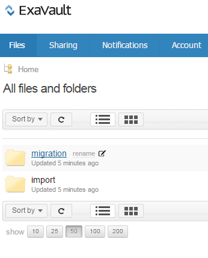
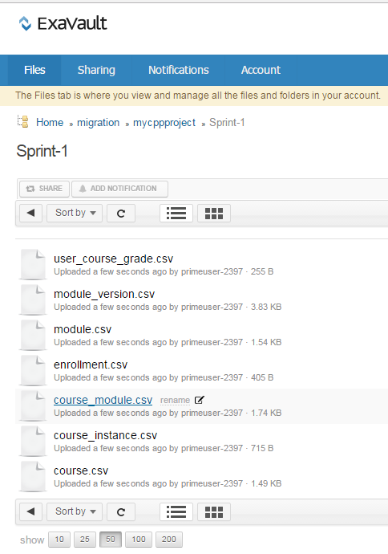
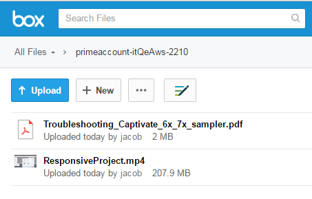
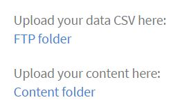
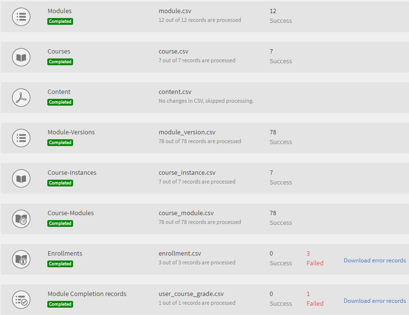
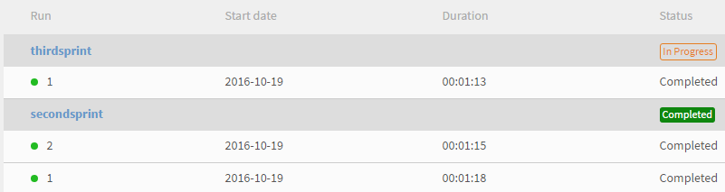

# Migrationshandbuch

Referenzhandbuch für Integrationsadministratoren zum Migrieren eines vorhandenen LMS in das Learning Manager-LMS

<!-- ## Overview {#overview} -->

## Anwendungsszenario {#usagescenario}

Im Allgemeinen verfügen große Unternehmen bereits über ein internes oder extern bereitgestelltes LMS. Ein LMS umfasst die Schulungsinhalte und -daten des Unternehmens. Beim Kauf von Learning Manager sollten Unternehmen die LMS-Bestandsdaten und -Inhalte in Learning Manager verschieben, um die Vorteile eines modernen und intuitiven LMS zu nutzen, ohne diese Bestandsdaten zu verlieren.

Learning Manager bietet die erforderlichen Tools und Spezifikationen, mit denen der Integrationsadministrator des Unternehmens die Migrationsaufgaben einrichten und durchführen kann.

Von heute an können Administratoren des Unternehmens auf die Migrationsfunktion in Learning Manager zugreifen, indem sie sich an das Support-Team von Adobe wenden. Um die Migrationsfunktion in Ihrem Konto zu aktivieren, können Sie sich an das Adobe Learning Manager-Supportteam wenden.

## Migrationsvorgang {#apidescription}

In diesem Abschnitt werden die Voraussetzungen für die Migration, wichtige Schritte des Migrationsvorgangs, Sprints, Spezifikationen und Schritte zur Daten- und Inhaltsmigration wie folgt erläutert:

### Wichtiger Hinweis zur Migration

Sie sollten sich bewusst sein, dass Migrationszeitpläne stark von der Qualität und Größe Ihrer Daten abhängen. Wenn Sie während des Onboarding-Prozesses eine Migration benötigen, planen Sie diese Aktivität rechtzeitig im Voraus und arbeiten Sie eng mit dem Adobe Learning Manager-Onboarding-Team zusammen, um Verzögerungen zu vermeiden.

### Voraussetzungen {#prerequisites}

Das Learning Manager-Team erwartet, dass folgende Aufgaben vor der Migration vom Integrationsadministrator des Unternehmens durchgeführt werden:

* Der Integrationsadministrator extrahiert die Daten und Inhalte des vorhandenen LMS und konvertiert sie in die von Learning Manager angegebenen Dateiformate.
* Der Import von Benutzern als Teil des Migrationsvorgangs wird von Learning Manager nicht unterstützt; es wird erwartet, dass diese vom Unternehmen mithilfe von Connectors importiert werden. Adobe System erwartet, dass diese Connectors vor dem Migrationsvorgang konfiguriert werden. Weitere Informationen finden Sie in der [Hilfe zu Learning Manager-Connectors](connectors.md).

In Learning Manager wird Administratoren empfohlen, den Migrationsvorgang in einem Testkonto auszuprobieren, bevor Daten und Inhalte zur Learning Manager-Produktionsumgebung migriert werden.

### Wichtige Schritte des Migrationsvorgangs {#keystepsofmigrationprocess}

Im Folgenden finden Sie wichtige Schritte zum Migrieren von Inhalten und Daten eines vorhandenen LMS zu Learning Manager:

1. Der Integrationsadministrator oder Partner ermittelt die Daten und -inhalte des bestehenden LMS, die migriert werden sollen.
1. Der Integrationsadministrator prüft die Tools und Spezifikationen, die Learning Manager zum Erfassen von Daten und Inhalten bereitstellt.
1. Der Integrationsadministrator schreibt einen Code oder führt entsprechende manuelle Aufgaben durch, um die Schulungsdaten und -inhalte basierend auf den Funktionen des älteren LMS zu exportieren.
1. Sobald die Schulungsdaten und -inhalte verfügbar sind, werden sie vom Integrationsadministrator analysiert und den entsprechenden Migrationsspezifikationen von Learning Manager zugeordnet.
1. Der Integrationsadministrator migriert die Daten und Inhalte mithilfe der bereitgestellten Tools in folgender Reihenfolge zu Learning Manager:

   1. Übertragen von Teilnehmenden zu Learning Manager
   1. Übertragen von Schulungsinhalten in Learning Manager
   1. Übertragen von Schulungsdaten in Learning Manager

Das Learning Manager-LMS kann jetzt samt der alten Inhalte vom Unternehmen genutzt werden.

### Gültigkeitsbereich von Migrationsobjekten {#scopeofmigrationobjects}

Sie können den Inhalt nur für die folgenden Lernobjekte migrieren:

* Modul
* Abzeichen
* Kurs
* Modulversion
* Kursinstanz
* Kursmodul
* Kenntnisse
* Kenntnisstand
* Kenntniskurs
* Zertifizierung
* Zertifizierungskurs
* Zertifizierung bestimmen
* Lernprogramm
* Lernprogrammkurs
* Lernprogramminstanz
* Lernprogrammkursinstanz
* Arbeitshilfe
* Version der Arbeitshilfe
* Kurs der Arbeitshilfe
* Von der Arbeitshilfe vermittelte Kenntnisse
* Registrierung
* Zertifizierungseinschreibung
* Lernprogrammeinschreibung
* Registrierung für Arbeitshilfe
* Benutzerkursbewertungen

### Wichtige Migrationskonzepte {#keyconceptsofmigration}

Einige wichtige Konzepte des Learning Manager-Migrationsvorgangs werden im Folgenden kurz erläutert:

**Migrationsprojekt**

Ein Migrationsprojekt in Learning Manager besteht aus mindestens einem Sprint. Ein Konto kann mehrere Migrationsprojekte umfassen. Der Migrationsvorgang in Learning Manager beginnt mit der Erstellung des Migrationsprojekts.

**Sprint**

Im Rahmen des Learning Manager-Migrationsvorgangs ist ein Sprint definiert als eine Reihe von Migrationselementen, die zur Migration aus einem bestehenden LMS ausgewählt wurden. Bei einem Migrationselement kann es sich um ein Kursmodul, Teilnehmerdatensätze oder eine Reihe von Kursen handeln. Ein Sprint kann mehrere Schulungsdatenelemente umfassen. Migrationsaufträge können in jedem Sprint durchgeführt werden.

**Sprint-Ausführungen**

Sprint-Ausführung bezeichnet das Starten einer Migrationsaufgabe. Sie können die Sprint-Ausführung jederzeit während des Vorgangs unterbrechen.

**Erneute Sprint-Ausführungen**

Sie können einen Migrations-Sprint nach Abschluss jederzeit erneut ausführen. Diese erneute Ausführung eines Sprints erfolgt, wenn Sie die Daten an ein Sprint-Element anhängen und dieses erneut in die Anwendung migrieren oder die Fehler in CSVs beheben möchten.

**CSV-Spezifikation**

Learning Manager bietet Ihnen eine Reihe von [CSV-Standardvorlagen](migration-manual.md#main-pars_header_140933605). Es empfiehlt sich, diese CSV-Spezifikationen vor Beginn des Migrationsvorgangs durchzugehen. Der Integrationsadministrator des Unternehmens kann die vorhandenen Datenformate analysieren und den entsprechenden von Learning Manager bereitgestellten CSV-Vorlagenelementen zuordnen.

**Migrationsprojekt-Tags**

Adobe Systems empfiehlt, einige Suchbegriffe als Tags zu verwenden, um die Migrationsprojekte innerhalb von Learning Manager einfach wiederzufinden. Anhand dieser Tags können Sie Ihre Projekte in der Learning Manager-Anwendung jederzeit intern identifizieren.

**Modul ohne Inhalt**

Mit Learning Manager können Sie Module ohne Inhalt hochladen. Adobe Systems sieht es als Modul ohne Inhalt in Learning Manager an. In einem Szenario, bei dem Sie einige der älteren Daten von Ihrem vorhandenen LMS migrieren möchten, ohne dass Inhalte benötigt werden, können Sie die Datei module_version.csv ohne URL-Referenz hochladen.

## CSV-Spezifikationen und Beispiel-CSVs {#csv}

Im Folgenden finden Sie die CSV-Standardspezifikationen, die zur Verknüpfung mit Ihren vorhandenen LMS-Migrationsdaten verwendet werden können. Klicken Sie auf „CSV-Spezifikationen und Beispiel-CSVs“ („csv-templates“ und sample-csvs“) und laden Sie die ZIP-Dateien herunter. In der heruntergeladenen Datei „csv-specifications.zip“ sind sieben Excel-Dateien enthalten. Diese Excel-Dateien sind Spezifikationen mit Beschreibungen zum Ausfüllen von CSV-Dateien. Die entsprechenden CSV-Dateien sollten die Daten für jedes Feld im vordefinierten Format enthalten (wie in diesen XLSX-Dateien beschrieben).

<table border="1" cellspacing="0" cellpadding="0" width="100%">
 <tbody>
  <tr>
   <th>
    <p><b>Sl.no</b></p></th>
   <th>
    <p><b>Dateiname</b></p></th>
   <th>
    <p><b>Beschreibung des Inhalts</b></p></th>
   <th>
    <p>Hinweise</p></th>
  </tr>
  <tr>
   <td>
    <p>1</p></td>
   <td>
    <p>module.xlsx</p></td>
   <td>
    <p>Metadaten für module.csv</p></td>
   <td> </td>
  </tr>
  <tr>
   <td>
    <p>2</p></td>
   <td>
    <p>badge.xlsx</p></td>
   <td>
    <p>Metadaten für badge.xlsx</p></td>
   <td> </td>
  </tr>
  <tr>
   <td>
    <p>3</p></td>
   <td>
    <p>course.xlsx</p></td>
   <td>
    <p>Metadaten für course.csv</p></td>
   <td>
    <p>Es empfiehlt sich, für einen bestimmten Kurs den Namen nur eines Autos zu verwenden, da mehrere Namen nach der Migration in der Anwendung nicht genau angezeigt werden. </p></td>
  </tr>
  <tr>
   <td>
    <p>4</p></td>
   <td>
    <p>module_version.xlsx </p></td>
   <td>
    <p>Metadaten für module_version.csv</p></td>
   <td>
    <p>Achten Sie darauf, den URL-Pfad des Ordners für das Box-Konto anzugeben, in den Sie den Inhalt hochgeladen haben. </p></td>
  </tr>
  <tr>
   <td>
    <p>5</p></td>
   <td>
    <p>course_instance.xlsx</p></td>
   <td>
    <p>Metadaten für course_instance.csv </p></td>
   <td> </td>
  </tr>
  <tr>
   <td>
    <p>6</p></td>
   <td>
    <p>session.xlsx</p></td>
   <td>
    <p>Metadaten für session.csv</p></td>
   <td>
    <p>Stellen Sie sicher, dass jeder Eintrag in der Sitzungs-CSV mindestens einem Klassenzimmer-/virtuellen Klassenzimmermodul zugeordnet ist</p></td>
  </tr>
  <tr>
   <td>
    <p>7</p></td>
   <td>
    <p>course_module.xlsx</p></td>
   <td>
    <p>Metadaten für course_module.csv</p></td>
   <td> </td>
  </tr>
  <tr>
   <td>
    <p>8</p></td>
   <td>
    <p>skill.xlsx</p></td>
   <td>
    <p>Metadaten für skill.csv</p></td>
   <td> </td>
  </tr>
  <tr>
   <td>
    <p>9</p></td>
   <td>
    <p>skill_level.xlsx</p></td>
   <td>
    <p>Metadaten für skill_level.csv</p></td>
   <td> </td>
  </tr>
  <tr>
   <td>
    <p>10</p></td>
   <td>
    <p>skill_course.xlsx</p></td>
   <td>
    <p>Metadaten für skill_course.csv</p></td>
   <td> </td>
  </tr>
  <tr>
   <td>
    <p>11</p></td>
   <td>
    <p>certification.xlsx</p></td>
   <td>
    <p>Metadaten für Certification.csv</p></td>
   <td> </td>
  </tr>
  <tr>
   <td>
    <p>12</p></td>
   <td>
    <p>certification_course.xlsx</p></td>
   <td>
    <p>Metadaten für certification_course.csv</p></td>
   <td> </td>
  </tr>
  <tr>
   <td>
    <p>13</p></td>
   <td>
    <p>certification_commit.xlsx</p></td>
   <td>
    <p>Metadaten für certification_commit.csv</p></td>
   <td> </td>
  </tr>
  <tr>
   <td>
    <p>14</p></td>
   <td>
    <p>learning_program.xlsx</p></td>
   <td>
    <p>Metadaten für learning_program.csv</p></td>
   <td> </td>
  </tr>
  <tr>
   <td>
    <p>15</p></td>
   <td>
    <p>learning_program_course.xls </p></td>
   <td>
    <p>Metadaten für learning_program_course.csv </p></td>
   <td> </td>
  </tr>
  <tr>
   <td>
    <p>16</p></td>
   <td>
    <p>learning_program_instance.xlsx </p></td>
   <td>
    <p>Metadaten für learning_program_instance.csv</p></td>
   <td> </td>
  </tr>
  <tr>
   <td>
    <p>17</p></td>
   <td>
    <p>learning_program_instance_course_instance.xlsx </p></td>
   <td>
    <p>Metadaten für learning_program_instance_course_instance.csv</p></td>
   <td> </td>
  </tr>
  <tr>
   <td>
    <p>18</p></td>
   <td>
    <p>job_aid.xlsx</p></td>
   <td>
    <p>Metadaten für job_aid.csv</p></td>
   <td>
    <p>Für jede migrierte job_aid müssen eine oder mehrere job_aid-Versionen vorhanden sein.</p></td>
  </tr>
  <tr>
   <td>
    <p>19</p></td>
   <td>
    <p>Job_aid_version.xlsx</p></td>
   <td>
    <p>Metadaten für job_aid_version.csv</p></td>
   <td> </td>
  </tr>
  <tr>
   <td>
    <p>20</p></td>
   <td>
    <p>job_aid_course.xlsx</p></td>
   <td>
    <p>Metadaten für job_aid_course.csv</p></td>
   <td> </td>
  </tr>
  <tr>
   <td>
    <p>21</p></td>
   <td>
    <p>job_aid_skills.xlsx</p></td>
   <td>
    <p>Metadaten für job_aid_skills.csv</p></td>
   <td> </td>
  </tr>
  <tr>
   <td>
    <p>22</p></td>
   <td>
    <p>enrollments.xlsx</p></td>
   <td>
    <p>Metadaten für enrollments.csv</p></td>
   <td> </td>
  </tr>
  <tr>
   <td>
    <p>23</p></td>
   <td>
    <p>certification_enrollement.xlsx</p></td>
   <td>
    <p>Metadaten für certification_enrollement.csv</p></td>
   <td> </td>
  </tr>
  <tr>
   <td>
    <p>24</p></td>
   <td>
    <p>learning_program_enrollment.xlsx</p></td>
   <td>
    <p>Metadaten für learning_program_enrollment.csv<br><br></p></td>
   <td> </td>
  </tr>
  <tr>
   <td>
    <p>25</p></td>
   <td>
    <p>job_aid_enrollment.xlsx</p></td>
   <td>
    <p>Metadaten für job_aid_enrollment.csv</p></td>
   <td> </td>
  </tr>
  <tr>
   <td>
    <p>26</p></td>
   <td>
    <p>user_course_grade.xlsx</p></td>
   <td>
    <p><br>
      Metadaten für user_course_grade.csv</p></td>
   <td>
    <p>Ebenso empfiehlt es sich, die erforderlichen Teilnehmer-Datensatzdaten in der CSV-Datei bereitzustellen, auch wenn sie nicht erforderlich sind. Selbst wenn die CSV-Datei für die Migration verarbeitet wird, kann die Learning Manager-Anwendung ohne diese Info evtl. keine Daten darstellen. In der Datei „sample-csvs.zip“ sind sieben CSV-Dateien mit einer ähnlichen Namenskonvention wie oben enthalten.</p></td>
  </tr>
  <tr>
   <td>
    <p>27</p></td>
   <td>
    <p>user_skill.xlsx</p></td>
   <td>
    <p><br>
      Metadaten für user_skill.csv</p></td>
   <td>
    <p> </p></td>
  </tr>
 </tbody>
</table>

Learning Manager unterstützt nur Datums- und Zeitwerte im UTF-8- und 32-Bit-Format. Während der Migration werden möglicherweise Fehler angezeigt, wenn Sie in CSV-Dateien ein Datum außerhalb des zulässigen Bereichs angeben (z. B. 2038-07-17T08:53:21.000Z oder 1980-04-17T08:13:25.322Z).

* [sample-csvs.zip](assets/sample-csvs.zip)
* [csv_specifications.zip](assets/csv-specifications.zip)

Sie müssen die folgenden Abhängigkeiten für CSV-Dateien während des Imports berücksichtigen:

* „module_version.csv“ ist von „module.csv“ abhängig
* „course_instance.csv“ ist von „course.csv“ abhängig
* „course_module.csv“ ist von „course.csv“, „module.csv“ und „module_version.csv“ abhängig
* „course_instance.csv“ ist von „course.csv“ abhängig
* session.csv ist von „course.csv“ und „module.csv“ abhängig
* „enrollment.csv“ ist von „course.csv“ abhängig
* „user_course_grade.csv“ ist von „course.csv“ und „module.csv“ abhängig
* „skill_course.csv“ ist von „course.csv“ abhängig
* „skill_level.csv“ ist von „skill.csv“ abhängig
* learning_program_instance.csv ist vom learning_program und learning_program_course.csv abhängig
* learning_program_course.csv learning_program.csv abhängig ist
* learning_program_enrollment.csv ist vom learning_program und learning_program_instance.csv abhängig
* learning_program_instance_course_instance.csv ist von learning_program.csv, learning_program_instance.csv und course_instance.csv abhängig
* certification_course.csv ist von certification.csv und von course.csv abhängig
* „certification_commit.csv“ ist von „certification.csv“ und „certification_course.csv“ abhängig
* „certification_enrollment.csv“ ist von „certification.csv“, „certification_course.csv“ und „certification_enrollment.csv“ abhängig

### Reihenfolge von Kursen im Lernprogramm in Migrations-CSVs

In früheren Versionen der Migrationsspezifikationen enthielt die Datei learning_program_course.csv eine Bestellspalte, in der Sie darauf hinweisen, dass Sie die Reihenfolge der Kurse in einem Lernprogramm während der Migration steuern können.

Adobe Learning Manager verwendet diese Spalte nicht mehr. Die Kursreihenfolge in einem Lernprogramm kann nicht über Migrations-CSVs gesteuert werden, und das System ignoriert alle in der Spalte &quot;Reihenfolge&quot; angegebenen Werte, selbst wenn Sie **orderEnforce** auf &quot;true&quot; setzen.

Um Verwechslungen zu vermeiden, wurde die Bestellspalte aus den offiziellen CSV-Spezifikationen entfernt. Wenn Sie bereits Skripts oder Tools haben, die diese Spalte noch generieren, können Sie sie sicher ablegen. Es hat keine Auswirkungen darauf, wie Lernprogramme erstellt oder angezeigt werden.

## Migrationsverfahren {#migrationprocedure}

Vor dem Migrationsverfahren sind folgende Punkte zu beachten:

* Innerhalb eines Kontos kann jeweils nur ein Migrationsprojekt aktiv sein. Innerhalb eines Projekts kann jeweils nur ein Sprint aktiv sein.
* Wurde der Migrationsvorgang gestartet, kann die entsprechende Ausführung nicht mehr rückgängig gemacht werden. Sie können jedoch jede beliebige Daten- oder Inhaltsmigration mithilfe der Löschoption der jeweiligen Funktion in Learning Manager rückgängig machen.
* Sobald das Migrationsprojekt beginnt, erhält es den Status &quot;Unter Migration&quot;. Während der Migration kann sich nur der Integrationsadministrator bei Learning Manager anmelden.

### Erstellen von FTP- und Box-Konten {#creatingftpandboxaccounts}

Ihr Migrationsprojekt zu planen, ist sehr wichtig. Es wird empfohlen, Ihre Projekte in mehrere Teile zu teilen und deutlich anzugeben, was Sie in den einzelnen Teilen migrieren möchten. Es kann auch ratsam sein, eine Überprüfung nach jedem Teil durchzuführen, um sicher zu gehen, dass die Daten in diesem Teil migriert wurden, anstelle einer Gesamtüberprüfungsphase am Ende des Projekts. Bevor Sie die Teile als Teil Ihres Migrationsprojekts starten, müssen Sie Daten und Inhalts-CSV-Dateien auf FTP- und Box-Server hochladen. Wenn Sie keine Konten für benutzerdefiniertes FTP und Box haben, können Sie sie erstellen.

<!--**Create FTP account**-->

<!--
Click **[!UICONTROL Request for CSV FTP folder]**. A pop-up dialog appears prompting you to enter your e-mail id. Go through online instructions and create an FTP account. As soon as you create your account, you can view your migration project and sprint project folders in FTP. 

A sample snapshot of project files and folder of FTP is shown below for your reference. 
-->

<!---->

**Box-Konto erstellen**

Erstellen Sie den Upload-Ordner für Inhalte in einem ähnlichen Vorgang wie beim Erstellen des FTP-Ordners. Klicken Sie im linken Bereich auf „Migration“ und dann unten auf der daraufhin angezeigten Seite auf „Anfordern“ für einen Upload-Ordner für Inhalte.

Sie erhalten eine E-Mail von Box mit einem Link zum freigegebenen Ordner. Wenn Sie über kein Box-Konto verfügen, klicken Sie auf „Registrieren“ und erstellen Sie ein Konto. Anweisungen zur Anmeldung werden an die E-Mail-ID des Integrations-Admins gesendet.

**Hochladen von Daten (CSV-Dateien) auf FTP- oder Box-Ordner**

Bevor Sie ein Migrationsprojekt erstellen, müssen Sie als Voraussetzung ein FTP- oder Box-Konto erstellen. In dieser Phase können Sie also ein Migrationsprojekt und einen Sprint in der Learning Manager-Anwendung erstellen.  Informationen zum Erstellen von Migrationsprojekten finden Sie im Abschnitt **Migrationsverfahren für Daten und Inhalte** auf dieser Seite.

Klicken Sie im FTP- bzw. Box-Konto auf den Namen Ihres Projektordners und anschließend auf den Sprint-Namen. Innerhalb des Sprint-Ordners können Sie die CSV-Datendateien hochladen, die migriert werden sollen. Klicken Sie zum Hochladen oben auf dem FTP- oder Box-Server auf die Schaltfläche Dateien hochladen und legen Sie die CSV-Dateien ab. In der Abbildung unten sehen Sie ein Referenzbeispiel nach dem Hochladen auf FTP.

<!---->

Sie können zum Learning Manager-Migrationsprojekt zurückkehren, auf **[!UICONTROL Aktualisieren]** klicken und alle in Ihrem Migrations-Sprint aufgelisteten CSV-Datentypen anzeigen.

**Schulungsinhalte in Inhaltsordner hochladen**

Laden Sie die Schulungsinhalte von Ihrem vorhandenen LMS auf Ihr Box-Konto hoch. Wenn Sie bereits das Migrationsprojekt und den Sprint erstellt haben, füllt das Box-Konto das Migrationsprojekt und den Sprint-Namen aus. Sie können die Inhalte im selben Pfad hochladen. Informationen zum Erstellen von Migrationsprojekten finden Sie im Abschnitt **Migrationsverfahren für Daten und Inhalte** auf dieser Seite.

Sie können die Inhaltsdateien per Drag &amp; Drop verschieben oder auf **[!UICONTROL Hochladen]** klicken und die Dateien auf dem Desktop auswählen. Bei Inhalten mit sehr großen Dateigrößen kann es zu Verzögerungen beim Hochladen der Dateien kommen. Abhängig von der Größe der Datei ist die erforderliche Zeit zum Hochladen der Dateien auf Ihr Box-Konto unterschiedlich.

In der Abbildung unten sehen Sie ein Referenzbeispiel mit einem Box-Konto nach dem Hochladen von Inhalt:



*Dateien in Box-Konto*

Nachdem die Dateien auf Ihr Box-Konto hochgeladen wurden, stellen Sie sicher, dass Sie den relativen Pfad dieser Box-Inhaltsdatei in der Datei „module_version.csv“ angeben. Dies ist ein obligatorischer Schritt für Sie, um den Pfad des Modulinhalts anzugeben.

Wenn Sie sich bei den FTP- und Box-Servern angemeldet und den Inhalt hochgeladen haben, werden die CSV-Speicherorte wie in der Abbildung unten dargestellt in Learning Manager angezeigt.



*CSV-Speicherorte im Box-Konto*

## Migration für Alternativen und Entsprechungen

### Übersicht

In diesem Thema werden das CSV-basierte Datenmodell und das Migrationsverhalten zur Einführung der Lernobjektäquivalenz (LO) im System beschrieben.

### Vorhandene CSV-Dateien (Kontext)

Diese CSVs sind bereits in der Plattform vorhanden und stellen das primäre Lernobjekt, das Modul und den Abschlusskontext bereit (nicht erschöpfende Liste):

* user_course_grade.csv
* Modulumkehrung
* module.csv
* course.csv
* course_module.csv

Diese Dateien werden weiterhin unverändert verwendet und werden nicht durch die neue Äquivalenzfunktion geändert. Sie bilden jedoch die zugrunde liegenden Daten, auf denen die Äquivalenz angewendet wird.

### Neue CSV-Dateien für Alternativen

Zwei neue CSVs werden eingeführt, um LO-alternative Beziehungen und entsprechende Benutzerabschlüsse zu unterstützen.

#### &#x200B;1. equivalence_relations.csv

Definiert Äquivalenzzuordnungen zwischen Quell- und Ziel-Lernobjekten (LOs), die entweder Kurse oder Lernpfade (LPs) sein können.

**Schema:**

* sourceId
* sourceloType (Kurs/LP)
* targetId
* targetLotype (Kurs / LP)
* dateCreated
* relatedStatus (AKTIV / DELETE)
* dateModified

**Zweck:**

* Stellt eine Äquivalenzbeziehung zwischen zwei LOs dar.
* relationStatus steuert, ob die Beziehung derzeit aktiv oder gelöscht ist.
* dateCreated und dateModified unterstützen Auditing.

#### equivalence_user_completion.csv

Erfasst Abschlussinformationen auf Benutzerebene für entsprechende LOs, die den in der Datei &quot;equivalence_relations.csv&quot; definierten Beziehungen entsprechen.

**Schema:**

* userId
* sourceId
* sourceloType (Kurs/LP)
* targetId
* targetLotype (Kurs / LP)
* dateCompleted

**Zweck:**

* Explizit wird aufgezeichnet, welche **LO-Zielabschlüsse** für einen Benutzer auf der Grundlage der Äquivalenzbeziehung und der vorhandenen LO-Quellabschlüsse abgeleitet werden sollen.
* Dient als **autoritative Quelle** für Benutzerabschlüsse, die mit Daten migrierter Entsprechungen verknüpft sind.

### Migrationsregeln und Verhaltenssemantik

#### &#x200B;1. Keine Nachrüstungsunterstützung für neue Entsprechungen von CSVs

* Alle äquivalenzbezogenen Daten müssen über die Migration eingegeben werden.
* Das System unterstützt keine Szenarien, in denen:
  * LO-Daten (Kurse/LPs) wurden über die Benutzeroberfläche erstellt und
  * Äquivalenzbeziehungen werden später nur über CSV importiert.

Dies bedeutet:

* Das unterstützte Muster ist: LO-Definitionen und ihre Äquivalenzbeziehungen werden als Teil eines kohärenten Migrationsflusses verwaltet.
* Hybride Flows, bei denen über die Benutzeroberfläche erstellte LOs mit einer reinen CSV-Äquivalenz nachgerüstet werden, werden nicht unterstützt.

#### &#x200B;2. Keine retroaktiven Abschlüsse/Unvollständigkeiten aus migrierten Beziehungen

Wenn eine Äquivalenzbeziehung über Migration eingeführt wird (d. h. über equivalence_relations.csv):

* Das System führt keine retroaktive Fertigstellungs- oder Unvollständigkeitsberechnungen durch, die ausschließlich auf dieser Beziehung basieren.
* Stattdessen müssen alle erforderlichen Benutzervervollständigungsdaten explizit über equivalence_user_completion.csv bereitgestellt werden.

**Implikation:**

* equivalence_user_completion.csv ist die einzige Quelle der Wahrheit für alle Abschlüsse, die bei der Migration als Ergebnis der Äquivalenz erkannt werden sollten.
* Die Plattform versucht nicht, diese Abschlüsse vom vorhandenen Kursfortschritt abzuleiten oder zu vervollständigen.

#### &#x200B;3. Verhalten für neue Abschlüsse nach der Migration

Wenn:

* Eine Äquivalenzbeziehung wurde durch Migration erstellt und
* Ein Teilnehmer schließt später das Quell-LO ab (nach der Migration).

dann:

* Das System löst alternative Abschlüsse für das Ziel-LO aus, d. h., die Äquivalenz verhält sich in der Regel bei neuen Quellenabschlüssen.

**Hauptunterscheidung:**

* **Zum Migrationszeitpunkt:** Abschlüsse müssen über equivalence_user_completion.csv erfolgen.
* **Nach der Migration:** Die native Laufzeitlogik verarbeitet alternative Abschlüsse, wenn ein Quell-LO neu abgeschlossen wird.

#### &#x200B;4. Auswirkungen auf Lernobjekte höherer Ordnung

Alternative Abschlüsse, die über CSV eingehen (d. h. über equivalence_user_completion.csv), lösen eine Neuberechnung von LOs höherer Ordnung aus.

LOs höherer Ordnung können Folgendes umfassen:

* Lernpfade

**Technische Auswirkungen:**

* Die Aufnahme von equivalence_user_completion.csv ist kein &quot;unbeaufsichtigter&quot; Vorgang: Sie initiiert die gleiche Neuberechnungs-/Roll-up-Logik, die durch normale Laufzeitabschlüsse ausgelöst wird.
* Systeme, die diese Migration integrieren oder planen, müssen die Last und den Zeitpunkt der Neuberechnung planen.

## Webhooks für Alternativen

Wenn ein Teilnehmer einen Kurs über eine alternative Registrierung oder über eine Beziehung abschließt, generiert Adobe Learning Manager ein dediziertes Webhook-Ereignis, das sich vom Standard-Webhook für den Kursabschluss unterscheidet, sodass Integrationen verschiedene Handhabungslogik für alternative Abschlüsse anwenden können. Webhook-Ereignisse werden auch für den rückwirkenden Abschluss und die rückwirkende Nicht-Abschluss generiert und decken historische Änderungen des Kursstatus ab, einschließlich solcher, die durch Aktualisierungen von Beziehungen gesteuert werden, sodass externe Systeme mit dem aktuellen Abschlussstatus des Teilnehmers synchronisiert bleiben.

Informationen zu webhooks for Alternates finden Sie unter [webhooks for Alternates](/help/migrated/integration-admin/feature-summary/webhooks.md#webhooks-for-alternates).

## Migrationsverfahren für Daten und Inhalte {#dataandcontentmigrationprocedure}

Das Verfahren zur Migration der LMS-Daten und -Inhalte Ihres Unternehmens zu Learning Manager wird im Folgenden erläutert:

Prüfen Sie die Voraussetzungen für den Migrationsprozess, bevor Sie mit der Migration beginnen. Bereiten Sie die CSV-Dateien für die Daten- und Inhaltsmigration wie auf dieser Seite im Abschnitt [CSV-Spezifikationen und Beispiel-CSVs](migration-manual.md#main-pars_header_140933605) beschrieben vor.

1. Melden Sie sich bei der Learning Manager-Anwendung als Integrationsadministrator an und klicken Sie im linken Teilfenster auf **[!UICONTROL Migration]**.

   Daraufhin wird die Startseite für Migrationsprojekte angezeigt. Wenn Ihr Unternehmen bereits Migrationsprojekte erstellt hat, können Sie auf dieser Seite eine Liste mit allen Migrationsprojekten anzeigen.

1. Klicken Sie in der rechten oberen Ecke der Seite auf **[!UICONTROL Neu]**, um ein Migrationsprojekt zu erstellen. Alternativ können Sie auf der Seite auf den Link **[!UICONTROL Migrationsprojekt erstellen]** klicken, um ein Migrationsprojekt zu erstellen. Daraufhin wird die Seite zum Erstellen eines Migrationsprojekts angezeigt.

   Wenn Sie noch keinen FTP-Ordner erstellt haben, werden Sie aufgefordert, einen FTP-Ordner im Konto zu erstellen. Dies ist ein obligatorischer Schritt, bevor Sie mit dem Erstellen eines Migrationsprojekts beginnen.

   
   *FTP-Ordner erstellen*

   Geben Sie den Projektnamen, das Projekt-Tag, den Kurskatalog und eine Beschreibung für Ihr Migrationsprojekt an. Klicken Sie auf **[!UICONTROL Erstellen]**.

   Ihre Migrationsdatenelemente werden mithilfe dieses Migrationsprojekt-Tags identifiziert. Wenn Sie über keinen bestimmten Kurskatalog verfügen, wählen Sie den Standardkatalog in der Dropdown-Liste aus. Alle Kurse, die mithilfe eines Migrationsprojekts migriert werden, sind im Katalog enthalten, den Sie in dieser Phase ausgewählt haben. Wenn Sie keinen Katalog auswählen, sind alle migrierten Kurse Teil des Standardkatalogs.

1. Die Seite der Sprint-Konfiguration wird angezeigt (siehe nachfolgende Abbildung). Sie müssen einen Sprint als Teil Ihres Migrationsprojekts erstellen. Wählen Sie einen Sprint-Namen aus und geben Sie eine kurze Beschreibung des Sprints an. Sie können „Ja“ auswählen, wenn Sie Inhalte als Teil dieses Sprints migrieren möchten. Klicken Sie auf **[!UICONTROL Weiter]**.

   
   *Sprint-Migration*

   Aktivieren Sie das Kontrollkästchen **Benutzer wurden seit der letzten Ausführung hinzugefügt oder geändert**, um die Liste der Benutzer mit der Learning Manager-Anwendung zu synchronisieren. Wenn Sie den Inhalt und die Daten in die Learning Manager-Anwendung migrieren, ist dies unter Umständen nicht erforderlich. Wenn zwischen Ihrer früheren Sprint-Migration und der neuesten Sprint-Migration jedoch eine Zeitspanne liegt, wird empfohlen, die Liste der Benutzer zu synchronisieren. Bei diesem Schritt kann die Learning Manager-Datenbank mit Ihren LMS-Benutzern synchronisiert werden.

   Dieser Synchronisierungsschritt wird empfohlen, wenn die Dateien „enrollment.csv“ und „user_course_grade.csv“ migriert werden. Bei diesem Schritt kann die Learning Manager-Datenbank mit Ihrer Migrationsdatenbank synchronisiert werden und es wird sichergestellt, dass alle Benutzer, deren Datensätze im Sprint migriert werden sollen, in der Migrationsdatenbank zur Verfügung stehen.

1. Sie können die Sprint-Migration mit Ihren hochgeladenen Daten und Inhalten beginnen. Klicken Sie vor dem Start des Sprint-Laufs auf den Link **[!UICONTROL Aktualisieren]**, um die FTP- und Inhaltsordner mit der Learning Manager-Anwendung zu synchronisieren.

   
   *Sprint-Migration starten*

   Klicken Sie in der rechten oberen Ecke der Seite auf **[!UICONTROL Start]**. Sie können während des Sprint-Migrationsvorgangs jederzeit auf **[!UICONTROL Stopp]** klicken, um die Sprint-Migration abzubrechen.

   Der Migrationsstatus wird für die jeweiligen Sprint-Datenelemente und -Inhalte angezeigt. Überprüfen Sie die Anzahl der erfolgreichen und fehlgeschlagenen Elemente als Teil des Sprint-Laufs der Migration.

   Stellen Sie beim Hochladen von Modulinhalten sicher, dass der Pfad des Inhaltsordners in der Datei „module_version.csv“ angegeben wird. Wenn Sie diesen Schritt versäumen, stellen Sie möglicherweise Fehler während der Migration fest. Wenn Sie beispielsweise Inhalte von Modulen zum Selbststudium (z. B. Videos) hochladen, müssen Sie den relativen Box-URL-Pfad in der Datei „module_version.csv“ angeben. Für Inhalte des Aktivitätsmoduls können Sie den URL-Namen festlegen.

   In der Abbildung unten sehen Sie ein Referenzbeispiel für den Fortschrittsdialog. Sie können die Anzahl der für jedes Migrationsdatenelement verarbeiteten Datensätze zusammen mit dem Status der erfolgreichen und fehlgeschlagenen Elemente sehen. Klicken Sie auf „Fehlerdatensätze für die fehlgeschlagenen Elemente herunterladen“, um die Fehlerprotokolle herunterzuladen und anzuzeigen. Sie können die Probleme in der CSV-Datei beheben und diese erneut auf FTP hochladen.

   
   *Anzeigen des Sprint-Fortschritts*

   Klicken Sie im linken Bereich auf die Sprint-Liste, wenn Sie die Liste aller Sprints eines Migrationsprojekts anzeigen möchten. Sie können eine Liste aller Sprints, die Anzahl der für jeden Sprint ausgeführten Läufe, das Startdatum, die Dauer und den Abschlussstatus anzeigen, wie in der Abbildung unten dargestellt.

   
   *Liste der Sprints anzeigen*

1. Nachdem Sie die neuesten aktualisierten CSV-Dateien hochgeladen haben, können Sie in der oberen rechten Ecke der Seite auf „Wiederholen“ klicken. Bei der Wiederholung werden alle Datenelemente noch einmal verarbeitet und Elemente ignoriert, für die es keine Änderungen gibt. Sobald Sie mit der Migration von Datenelementen in einem Sprint zufrieden sind, können Sie die Sprint-Migration als abgeschlossen markieren, indem Sie auf die Schaltfläche oben auf der Seite klicken. Sie können einen neuen Sprint mit mehr Datenelementen zu einem späteren Zeitpunkt starten. Sobald ein Sprint als abgeschlossen markiert wurde, können Sie ihn nicht erneut wiederholen. Dementsprechend kann ein Migrationsprojekt eine beliebige Anzahl von Sprints umfassen. Sobald Sie mit dem Migrationsstatus aller Sprints zufrieden sind, können Sie das Migrationsprojekt als abgeschlossen markieren, indem Sie auf der Seite der Sprint-Liste auf den Link **Projekt als abgeschlossen markieren** klicken.

   Bevor Sie das Migrationsprojekt als abgeschlossen markieren, müssen Sie sicherstellen, dass alle Sprints des Projekts abgeschlossen sind. Nachdem Sie das Migrationsprojekt als abgeschlossen markiert haben, können Sie nicht zurückgehen und Sprints in diesem Projekt erstellen oder Änderungen an diesem Projekt vornehmen. Sie müssen ein weiteres Migrationsprojekt erstellen und ihm Sprints hinzufügen.

## Migrationsverifizierung {#registration}

Nachdem Sie die Lerndaten und -inhalte aus dem älteren LMS Ihres Unternehmens migriert haben, können Sie die importierten Daten und Inhalte mit verschiedenen Lernobjektfunktionen überprüfen. Sie können sich beispielsweise bei der Learning Manager-Anwendung als Administrator anmelden und die Verfügbarkeit der Daten und Inhalte von importierten Modulen und Kursen überprüfen.

## Migration mithilfe von APIs

Adobe Learning Manager (ALM) bietet eine Migrationsfunktion zum Importieren von Daten oder Inhalten aus externen Systemen, die hauptsächlich für die Migration von älteren LMS-Plattformen verwendet wird.

Einige Organisationen können jedoch verlangen, dass dieser Prozess in einem regulären Zeitplan (z. B. nachts oder wöchentlich) ausgeführt wird, anstatt als einmaliger Import.

Als Beispiel sehen Sie, wie ein fiktiver Kunde (NovaFX) mit einem fiktiven externen Anbieter (SquareCorp) integriert und geplante Migrationen automatisiert. Die Integration bietet folgende Möglichkeiten:

* SquareCorp-Kurse werden für NovaFX-Teilnehmer als Lernobjekte in ALM angezeigt.
* NovaFX verfolgt den Fortschritt der Teilnehmer bei von SquareCorp gehosteten Kursen direkt in ALM.

### Integrationsanforderungen

SquareCorp muss Folgendes bereitstellen:

* Informationen zu den Kurs-Metadaten: Eine API zum Freigeben von Kurs-Metadaten, auf die NovaFX Zugriff hat.
* Fortschrittsdateninformationen: Eine API zum regelmäßigen Teilen von Informationen zum Fortschritt und Abschluss von Teilnehmern.

### Schlüsseldefinitionen

* **Aktives Projekt:** Ein Projekt ist aktiv, wenn es &quot;In Bearbeitung&quot; oder &quot;Initialisiert&quot; ist.
* **Aktiver Sprint:** Ein Sprint ist aktiv, wenn er &quot;In Bearbeitung&quot; oder &quot;Initialisiert&quot; ist.

### Automatisieren der Sprint-Ausführung

Erstellen Sie eine App oder ein Skript, die bzw. das Folgendes nach einem Zeitplan ausführt:

1. Rufen Sie Kurs-Metadaten, Benutzerregistrierungen und Teilnehmerbewertungen von SquareCorp ab.
2. Generieren Sie die CSV-Dateien.
3. Laden Sie die Dateien auf Box oder FTP hoch.
4. Lösen Sie den Sprint über die Migrations-APIs aus.

### API-Details

#### Migrationslauf starten

**Endpunkt:** POST /primeapi/v2/bulkimport/startrun

Parameter:

* **lockaccount (Boolean):** Der Parameter bestimmt, ob das Konto zu Beginn der Ausführung gesperrt werden soll. Standardmäßig ist sie auf &quot;false&quot; festgelegt. Es wird empfohlen, dass Benutzer diesen Parameter nur verwenden, wenn ein gültiger Grund für das Sperren des Kontos vorliegt.
* **catalogId (Integer):** Mit diesem Parameter können Sie den Zielkatalog während der Migration auswählen. Er wird in der Regel beim Erstellen des Migrationsprojekts festgelegt, kann jedoch für einzelne Ausführungen angepasst werden. Wenn der Katalog geändert wird, werden in zukünftigen Ausführungen hinzugefügte Lernobjekte im zuletzt ausgewählten Katalog platziert. Wenn Sie zum Katalog zurückkehren müssen, der während der Erstellung des Migrationsprojekts ausgewählt wurde, müssen Sie dies auch explizit angeben.
* **migrationProjectId (Integer):** Der Parameter ist erforderlich, um ein bestimmtes Migrationsprojekt auszulösen, wenn mehrere API-fähige Ausführungen im Konto aktiviert sind.

#### Überprüfen Sie, ob die Synchronisierung beginnen kann

Stellen Sie sicher, dass Inhalte mit dem Sprint-Ordner synchronisiert werden können. Kopieren Sie keine Inhalts- oder Metadatendateien in den FTP-Ordner, es sei denn, diese API gibt ein erfolgreiches Antwortobjekt zurück.

**Endpunkt:** GET /primeapi/v2/bulkimport/cansync

Parameter:

* **migrationProjectId (Integer)** Der Parameter ist erforderlich, um ein bestimmtes Migrationsprojekt auszulösen, wenn mehrere API-fähige Ausführungen im Konto aktiviert sind.

<b>Antworterfolg</b>

```
{  
    "status": "OK",  
    "title": "BULKIMPORT_CAN_SYNC_NOW",  
    "source": {  
        "info": "Yes"  
    }  
} 
```

<b>Antworterfolg</b>

```
{ 
    "status": "BAD_REQUEST", 
    "title": "BULKIMPORT_ERROR_CANNOT_SYNC", 
    "source": { 
        "info": "Error, No active projects" 
    } 
} 
```

<b>Mögliche API-Antworten</b>

| Aktion | Typ | Nachricht |
| ------------------------------------- | ------- | ------------------------------------------------------------------------------------- |
| BULKIMPORT_RUN_INITIATED_SUCCESSFULLY | Erfolgreich | Ausführung erfolgreich initiiert |
| BULKIMPORT_ERROR_CANNOT_INITATE_RUN | Fehler | Ein Lauf wird ausgeführt. |
| BULKIMPORT_ERROR_CANNOT_INITATE_RUN | Fehler | Es gibt mehr als ein aktives Projekt |
| BULKIMPORT_ERROR_CANNOT_INITATE_RUN | Fehler | Es gibt mehrere Sprints |
| BULKIMPORT_ERROR_CANNOT_INITATE_RUN | Fehler | Keine aktiven Projekte |
| BULKIMPORT_ERROR_CANNOT_INITATE_RUN | Fehler | Keine aktiven Sprints |
| BULKIMPORT_ERROR_CANNOT_INITATE_RUN | Fehler | Der angegebene Katalog ist entweder keine gültige ID oder gehört nicht zum Prime-Konto |
| BULKIMPORT_CAN_SYNC_NOW | Info | Jetzt synchronisieren |
| BULKIMPORT_ERROR_CANNOT_SYNC | Fehler | Ein Lauf wird ausgeführt. |
| BULKIMPORT_ERROR_CANNOT_SYNC | Fehler | Es gibt mehr als ein aktives Projekt |
| BULKIMPORT_ERROR_CANNOT_SYNC | Fehler | Es gibt mehrere Sprints |
| BULKIMPORT_ERROR_CANNOT_SYNC | Fehler | Keine aktiven Projekte |
| BULKIMPORT_ERROR_CANNOT_SYNC | Fehler | Keine aktiven Sprints |
| BULKIMPORT_ERROR_CANNOT_SYNC | Fehler | Keine gültigen Dateien im Ordner vorhanden |

### Beispiel für einen Integrationsfluss

1. Überprüfen Sie die Synchronisations-API.
2. Generieren und Hochladen von CSV-Dateien.
3. Lösen Sie den Sprint über die Startrun-API aus.
4. Überwachen Sie die Reaktion und behandeln Sie Fehler.

### Einschränkungen

Die Migrations-APIs bieten keine Funktionen zum Prüfen migrationsbezogener Fehler direkt in der CSV-Ausgabedatei nach der Sprint-Ausführung. Diese Fehler können jedoch als Zeilen in der CSV-Datei geprüft werden, indem auf die Benutzeroberfläche des Integrationsadministrators nach einem Sprint-Run zugegriffen wird.

### Migrationsverifizierung über APIs

Mit der Migrations-API &quot;`runStatus`&quot; können Integrationsadministratoren den Fortschritt von Migrationsläufen verfolgen, die über die API ausgelöst werden.

Die `runStatus`-API bietet außerdem einen direkten Link zum Herunterladen von Fehlerprotokollen im CSV-Format für abgeschlossene Ausführungen. Der Download-Link bleibt sieben Tage lang aktiv und die Protokolle werden einen Monat lang aufbewahrt.

**Beispiel-Curl**

**Endpunkt**

```
GET /bulkimport/runStatus
```

**Parameter**

* **migrationProjectId**: (Erforderlich). Ein eindeutiger Bezeichner für ein Migrationsprojekt. Ein Migrationsprojekt wird verwendet, um Daten und Inhalte aus einem vorhandenen LMS (Learning Management System) in Adobe Learning Manager zu übertragen. Jedes Migrationsprojekt kann aus mehreren Sprints bestehen, die kleinere Einheiten von Migrationsaufgaben sind.

* **sprintId**: (Erforderlich). Ein eindeutiger Bezeichner für einen Sprint innerhalb eines Migrationsprojekts. Ein Sprint ist eine Teilmenge von Migrationsaufgaben, die bestimmte Lernobjekte (z. B. Kurse, Module, Teilnehmerdatensätze) umfasst, die von einem bestehenden LMS zu Adobe Learning Manager migriert werden sollen. Jeder Sprint kann unabhängig ausgeführt werden, was eine phasengesteuerte Migration ermöglicht.

* **sprintRunId**: (Erforderlich). Eine eindeutige Kennung, die zum Verfolgen der Ausführung eines bestimmten Sprints innerhalb eines Migrationsprojekts verwendet wird. Es ist mit dem eigentlichen Migrationsvorgang für die in einem Sprint definierten Elemente verknüpft. Die sprintRunId hilft bei der Überwachung, Fehlerbehebung und Verwaltung des Migrationsauftrags.

**Antwort**

```
{
  "sprintId": 2510080,
  "sprintRunId": 2740845,
  "migrationProjectId": 2509173,
  "startTime": 1746524711052,
  "endTime": 1746524711052,
  [
    {
      "id": 2609923,
      "lastHeartbeatTime": 1746524711052,
      "objectName": "content",
      "jobState": "COMPLETED",
      "errorCsvLink": "",
      "errorLogLink": "migration/5830/2509173/2510080/2740845/content_err.csv",
      "sequenceNumber": 1
    },
    {
      "id": 2609922,
      "lastHeartbeatTime": 1746524713577,
      "objectName": "course",
      "jobState": "WAITING_IN_QUEUE",
      "errorCsvLink": "",
      "errorLogLink": null,
      "sequenceNumber": 2
    }
  ]
}
```

Außerdem enthält die `startRun`-API-Antwort jetzt die ID des Migrationsprojekts, die Sprint-ID und die Sprint-Run-ID, die zum Abfragen des neuen Statusendpunkts erforderlich sind.

```
curl -X GET --header 'Accept: text/html' 'https://learningmanager.adobe.com/primeapi/v2/bulkimport/runStatus?migrationProjectId=001&sprintId=10001&sprintRunId=7'
```

Erstellt die folgende Antwort. Die Antwort enthält:

* `migrationId`
* `sprintId`
* `sprintRunId`

**Antwort**

```
{
  "status": "OK",
  "title": "BULKIMPORT_RUN_INITIATED_SUCCESSFULLY",
  "source": {
    "info": "Success",
    "migrationInfo": {
      "migrationProjectId": "001",
      "sprintId": "10001",
      "sprintRunId": "7"
    }
  }
}
```

## Nachrüsten in der Migration {#retrofittinginmigration}

Mit dieser Integrationsfunktion können Sie historische Daten für ein Lernobjekt von einem veralteten Learning Management-System auf einen aktiven Kurs nachrüsten, der in Learning Manager erstellt wird.

Im Folgenden finden Sie die CSV-Standardspezifikationen, die zur Verknüpfung mit Ihren vorhandenen LMS-Migrationsdaten verwendet werden können. Klicken Sie auf „CSV-Spezifikationen und Beispiel-CSVs“ („csv-templates“ und sample-csvs“) und laden Sie die ZIP-Dateien herunter. In der heruntergeladenen Datei „csv-specifications.zip“ sind vier Excel-Dateien enthalten. Diese Excel-Dateien sind Spezifikationen mit Beschreibungen zum Ausfüllen von CSV-Dateien. Die entsprechenden CSV-Dateien sollten die Daten für jedes Feld im vordefinierten Format enthalten (wie in diesen XLSX-Dateien beschrieben).

1-enrollment.xlsx-enthält Beschreibungen von Metadaten, die für die retrofit_enrollment.csv-Datei erforderlich sind.

2-certification_enrollment.xlsx enthält Beschreibungen von Metadaten, die für die retrofit_certification_enrollment.csv-Datei erforderlich sind.

3-learning_program_enrollment.xlsx enthält Beschreibungen von Metadaten, die für die retrofit_learning_program_enrollment.csv-Datei erforderlich sind.

4-user_course_grades.xlsx enthält Beschreibungen von Metadaten, die für die retrofit_user_course_grades.csv-Datei erforderlich sind.
[csv-specifications.zip](assets/csv-specifications.zip)

>[!NOTE]
>
>Die UUID (Universally Unique ID) ist ebenfalls eine Spalte in der Migrations-CSV.


## Fehlerbehebung für Migrationsprobleme {#troubleshootingmigrationissues}

Lesen Sie diesen [Artikel](../../kb/troubleshooting-migration.md), um mehr über die Problemumgehung/Lösung für die Probleme zu erfahren, mit denen die für die Integration zuständigen Administratoren bei der Migration von Daten und Inhalten aus ihrem vorhandenen LMS in die Learning Manager-Anwendung konfrontiert sind.

## Tipps zur Benutzerverwaltung {#usermanagement}

Unter diesem Thema finden Sie einige Tipps zum besseren Verständnis dazu, wie Benutzer in Learning Manager berücksichtigt und verwaltet werden. Diese Konzepte unterstützen Sie beim Optimieren der Verwaltung von Benutzern, während der Verwendung von CSV-Import, Connectors und Migrationsfunktionen von Learning Manager.

## Learning Manager-IDs {#captivateprimeids}

In Learning Manager stehen zwei Arten von eindeutigen IDs für Benutzer zur Verfügung:

* E-Mail-ID
* UUID (Universally Unique ID)

Learning Manager unterstützt UUID, um Unternehmen Flexibilität beim Steuern von Benutzerkonten zu bieten. Wenn Sie über UUID von Benutzern in einem Konto verfügen, können Sie als Administrator die E-Mail-IDs der Benutzer für dieses Konto ändern.

**Anwendungsszenario für UUID in einem Unternehmen**

Stellen Sie sich ein Szenario vor, in dem ein Mitarbeiter A sich als Vertragsnehmer dem Unternehmen Learning Manager anschließt. Während der Vertragslaufzeit stellt das Learning Manager-Unternehmen möglicherweise keine Unternehmens-E-Mail-ID als `A@example.com` bereit, sondern berücksichtigt stattdessen das persönliche E-Mail-Konto des Mitarbeiters, z. B. `A@gmail.com`. Nach Abschluss von 6 Monaten Vertragslaufzeit, wenn derselbe Mitarbeiter A sich dem Learning Manager als Vollzeitmitarbeiter anschließt, möchte der Learning Manager seine E-Mail-ID in seine Unternehmens-E-Mail-ID ändern: `A@example.com`

UUID-Zugriff auf das Benutzerkonto ist für das Unternehmen Learning Manager im oben genannten Szenario nützlich. Das Unternehmen Learning Manager kann die persönliche E-Mail-ID des Mitarbeiters A ohne großen Aufwand durch eine offizielle E-Mail-ID ersetzen. Die für dieses Konto relevanten Datensätze für den Mitarbeiter sind von dieser Änderung nicht betroffen.

## Identifikation einzelner Benutzer {#singleuseridentification}

Learning Manager identifiziert und speichert, wie ein einzelner Benutzer hinzugefügt wird: über Selbstregistrierung, CSV-Upload oder durch Hinzufügen eines einzelnen Benutzers über die Benutzeroberfläche oder mithilfe einer API.

* Wenn ein einzelner Benutzer über die Benutzeroberfläche (UI) oder über die API hinzugefügt wird, können Sie solche Einzelbenutzer über die Benutzeroberfläche (UI) oder die API löschen.
* Sie können einzelne Benutzer über CSV-Upload-Prozesse aktualisieren, aber Sie müssen dabei beachten, dass diese einzelnen Benutzer als CSV-Benutzer behandelt werden und die CSV-Arbeitsabläufe für solche Benutzer gelten.

## Zuweisen der Manager-Rolle {#assigningmanagerrole}

Sie können eine Manager-Rolle nicht jedem Benutzer in Learning Manager direkt zuweisen. Ein Benutzer X kann nur ein Learning Manager-Manager werden, wenn Sie ein Manager-Attribut für beliebige Benutzer (z. B. Y) in diesem Konto als X festlegen.

Szenario: X ist der Manager der Benutzer A, B und C; wenn X das Unternehmen verlässt, müssen Sie sicherstellen, dass das Manager-Attribut für A, B und C auf den neuen Manager festgelegt wird. Alternativ dazu können Sie auch das Manager-Attribut für diese Benutzer vorübergehend als ROOT festlegen und später dem neuen Namen des Managers zuweisen.

Weitere Informationen zu diesem Thema finden Sie in den folgenden Hilfeinhalten:

* [Häufig gestellte Fragen zum Hochladen von CSV](/help/migrated/administrators/feature-summary/add-users-user-groups.md#bulk-upload-internal-users/)
* [Funktions-Hilfe für das Hinzufügen von Benutzern](/help/migrated/administrators/feature-summary/add-users-user-groups.md)

## API-Änderungen

Die Version April 2026 von Adobe Learning Manager bietet zielgerichtete Verbesserungen an der öffentlichen API in den Bereichen Alternativprogramme und Äquivalente, Zugriff auf Inhalte im Zeitfenster, inhaltsgesteuerte Quizversuche, nicht angemeldete Teilnehmererlebnisse und Arbeitshilfenverwaltung. Diese Updates sind so konzipiert, dass sie weitgehend abwärtskompatibel bleiben und gleichzeitig präzisere und erweiterbare Integrationsmuster ermöglichen.

Zeigen Sie für API-Änderungen [API-Änderungen](/help/migrated/api-changes-alm.md) an.

## Migration der VILT-Sitzung zu Adobe Learning Manager {#migrationofviltsessiontoalm}

Adobe Learning Manager unterstützt die Massenmigration und Aktualisierung von VILT-Sitzungsdaten (Virtual Instructor-Led Training, virtuelle Schulung mit Kursleiter) über CSV-Dateien. Verwenden Sie diesen Arbeitsablauf, um die Startdaten der Instanz zu konfigurieren, Lernpfadinstanzen mit Kursinstanzen zu verknüpfen und virtuelle Klassenzimmersitzungen für Microsoft Teams, Adobe Connect und Zoom einzurichten.

>[!NOTE]
>
>Spalten-IDs in allen CSV-Migrationsdateien verwenden jetzt das Präfix &quot;alm&quot;, z. B. `almCourseID` und `almModuleID`. Dies ersetzt das in früheren Versionen verwendete alte Prime-Präfix.

### CSV-basierte VILT-Sitzungsmigration

Mit der Adobe Learning Manager-Migration können Administratoren Lerninhalte mithilfe strukturierter CSV-Dateien in großen Mengen erstellen oder aktualisieren. Sie können diese CSV-Workflows sowohl auf Migrationskurse (aus einem externen System importierte Inhalte) als auch auf Retrofit-Kurse (direkt in der ALM-Autoren-App erstellte Inhalte) anwenden.

Vier CSV-Dateien sind an der Migration von VILT-Sitzungen beteiligt:

* **Kursinstanz-CSV:** erstellt oder aktualisiert Kursinstanzen, einschließlich Startdaten
* **LP-Instanz-CSV:** erstellt oder aktualisiert Lernpfadinstanzen, einschließlich Startdaten
* **LP zur Kursinstanzzuordnung CSV:** ordnet eine Lernpfadinstanz einer bestimmten Kursinstanz zu
* **Sitzungs-CSV:** erstellt Sitzungen für virtuelle Klassenzimmer mit Details zum Konferenzsystem

Laden Sie die oben genannten Dateien [hier](assets/csv-and-xlsx-migration-files.zip) herunter.

Alle vier CSV-Dateien akzeptieren `almCourseID` als Verweis auf Kurse und `almModuleID` als Verweis auf Module. Diese IDs sind die eindeutigen Kennungen, die von ALM beim Erstellen eines Kurses oder Moduls zugewiesen werden.

### Festlegen des Startdatums für Instanzen von Kursen und Lernpfaden

Verwenden Sie die CSV-Kursinstanz **1 und die CSV-Instanz** LP **, um das Startdatum einer Instanz hinzuzufügen oder zu aktualisieren.** Dies gilt sowohl für von der Migration erstellte als auch für von der Benutzeroberfläche erstellte (nachrüstbare) Instanzen.

**CSV-Kursinstanz: Startdatum hinzufügen**

1. Öffnen Sie Ihre CSV-Datei für die Kursinstanz.
2. Fügen Sie die `startDate`-Spalte hinzu, falls sie noch nicht vorhanden ist.
3. Geben Sie das Startdatum für jede Instanzzeile im Format JJJJ-MM-TT ein.
4. Füllen Sie die Spalte &quot;`almCourseID`&quot; mit der ALM-Kurs-ID des Kurses, den Sie aktualisieren möchten.
5. Laden Sie die CSV-Datei während des Migrationslaufs hoch.

**LP-Instanz-CSV: Startdatum hinzufügen**

1. Öffnen Sie Ihre CSV-Datei für die LP-Instanz.
2. Fügen Sie die `startDate`-Spalte hinzu, falls sie noch nicht vorhanden ist.
3. Geben Sie das Startdatum für jede Instanzzeile im Format JJJJ-MM-TT ein.
4. Füllen Sie die Spalte &quot;`almLearningProgramID`&quot; mit der ALM-Lernpfad-ID.
5. Laden Sie die CSV-Datei über die Migrationsausführung hoch.

>[!NOTE]
>
>Die Spalte &quot;`startDate`&quot; ist optional. Wenn Sie ihn einschließen, muss der Wert vor `completionDate` liegen. Zeilen, bei denen &quot;`startDate`&quot; später als &quot;`completionDate`&quot; ist, werden ausgeblendet und in der Migration angezeigt.

### Lernpfadinstanzen mit Kursinstanzen verknüpfen

Verwenden Sie die CSV-Datei &quot;LP zu Kursinstanzzuordnung&quot;, um eine Lernpfadinstanz mit einer bestimmten Kursinstanz zu verknüpfen. Dieser Schritt ist für VILT-Kurse erforderlich, die Teil eines Lernpfads sind.

1. Öffnen Sie die CSV-Datei für die Zuordnung von LP zu Kursinstanz.
2. Füllen Sie für jede Zeile die folgenden Spalten aus:
a. `almLearningProgramID` — ALM-Lernpfad-ID
b. `almLearningProgramInstanceID` — ID der ALM-Lernpfadinstanz
c. `almCourseID` - die ALM-Kurs-ID
d. `almCourseInstanceID` - ID der ALM-Kursinstanz
3. Laden Sie die CSV-Datei während des Migrationslaufs hoch.

### Unterstützte Zuordnungsszenarien

Nicht alle Kombinationen von Migrations- und Retrofit-Quellen werden unterstützt. Lesen Sie die folgende Tabelle, bevor Sie Ihre CSV-Datei erstellen.

| Lernpfadquelle | Quelle der Kursinstanz | Unterstützt |
|-----------------------------|-------------------------------|-----------|
| Migration | Migration | Ja |
| Retrofit (von der Benutzeroberfläche erstellt) | Retrofit (von der Benutzeroberfläche erstellt) | Ja |
| Migration | Retrofit (von der Benutzeroberfläche erstellt) | Nein |
| Retrofit (von der Benutzeroberfläche erstellt) | Migration | Nein |

>[!NOTE]
>
>Wenn Sie eine Retrofit-Lernpfadinstanz mit einer Migrationskursinstanz (oder umgekehrt) verknüpfen müssen, fügen Sie den Kurs dem Lernpfad direkt über die ALM-Autoren-App hinzu, anstatt diese CSV zu verwenden.

### Details der Sitzung im virtuellen Klassenzimmer konfigurieren

Verwenden Sie die **Sitzungs-CSV**, um VILT-Sitzungen mit Details zu Konferenzen im virtuellen Klassenzimmer zu erstellen oder zu aktualisieren. Der Sitzungs-CSV wurden vier Spalten hinzugefügt, um dies zu unterstützen:

| Spalte | Beschreibung |
|--------------|-------------------------------------------------------|
| `almCourseID ` | ALM-ID des Kurses |
| `almModuleID` | ALM-ID des Moduls |
| `metadata` | JSON-Objekt mit VC-systemspezifischer Konfiguration |
| `meetingID` | Meeting-ID des externen VC-Systems |

### Metadatenformat nach Konferenzsystem

Das Feld `metadata` akzeptiert ein JSON-Objekt. Die Struktur variiert je nach Konferenzsystem. Bei allen Schlüsselnamen wird zwischen Groß- und Kleinschreibung unterschieden. CamelCase **muss genau wie angegeben verwendet werden.**

**Microsoft Teams**

```
{
  "organizerEmail": "user@example.com",
  "coOrganizerEmail": "user2@example.com",
  "lobbyBypass": true,
  "isCompletionCriteria": false
}
```

Alle Metadatenfelder für Teams sind optional. Wenn Sie `organizerEmail` nicht angeben, verwendet ALM die in Ihrem ALM-Konto konfigurierte Teams-Admin-E-Mail als Standardorganisator.

**Adobe Connect**

```
{
  "primaryInstructor": "instructor@example.com",
  "persistentRoom": true,
  "templateID": "template-id-value"
}
```

Das Feld `primaryInstructor` ist **erforderlich** für Adobe Connect-Sitzungen. Alle anderen Felder sind optional. Sie können entweder `persistentRoom` oder `templateID` angeben. Wenn Sie `templateID` angeben, erstellt ALM den Raum mithilfe dieser Vorlage.

**Zoom**

Für den Zoom ist kein Metadaten-JSON-Objekt erforderlich. Übergeben Sie den Sitzungslehrer mithilfe der Standardlehrerspalte in der Sitzungs-CSV.

### Sitzungs-CSV hochladen

1. Öffnen Sie die CSV-Datei für die Sitzung.
2. Die vier neuen Spalten hinzufügen: almCourseID, almModuleID, Metadaten und meetingID.
3. Füllen Sie für jede Sitzungszeile almCourseID und almModuleID mit den ALM-IDs des Kurses und des Moduls.
4. Fügen Sie die Meeting-ID aus Ihrem VC-System (Teams, Adobe Connect oder Zoom) hinzu.
5. Erstellen Sie das Metadaten-JSON-Objekt unter Verwendung des Formats für Ihr Konferenzsystem.
6. Stellen Sie sicher, dass alle JSON-Schlüsselnamen die exakte Schreibweise von camelCase verwenden. Falsche Groß-/Kleinschreibung führt zum Fehlschlagen der Zeile.
7. Laden Sie die CSV-Datei während des Migrationslaufs hoch.

Fehlerbehebung bei häufigen Migrationsfehlern

| Problem | Lösung |
|-------|----------|
| Zeilenfehler mit &quot;Ausfülltermin sollte größer als Startdatum sein&quot; | Stellen Sie sicher, dass `startDate` in der Instanz-CSV vor `completionDate` liegt. |
| Fehler bei der Zuordnung von LP zu Kursinstanzen | Vergewissern Sie sich, dass sowohl der Lernpfad als auch die Kursinstanz über dieselbe Quelle erstellt wurden (Migration oder Nachrüstung). Gemischte Quellen werden nicht unterstützt. |
| Sitzungszeile schlägt mit Metadatenfehler fehl | Überprüfen Sie, ob alle JSON-Schlüsselnamen im Feld &quot;`metadata`&quot; exakt &quot;camelCase&quot; verwenden. Bei Schlüsseln wird zwischen Groß- und Kleinschreibung unterschieden. |
| Teams `isCompletionCriteria` haben keine Auswirkungen. | Das Feature-Flag für Abschlusskriterien für Teams muss von Ihrem ALM-Kontoadministrator aktiviert werden, bevor die Migrationswerte wirksam werden. |
| Sitzungszeile erstellt, aber das Kursleiterfeld ist leer | Wenn die angegebene E-Mail-Adresse des Kursleiters nicht mit einem Benutzer in ALM übereinstimmt, wird die Sitzung mit einem leeren Feld für den Kursleiter erstellt. Vergewissern Sie sich, dass die Kursleiter-E-Mail in ALM vorhanden ist, bevor Sie sie hochladen. |

## LTI-Module migrieren {#migrationofltimodules}

### Übersicht

Die LTI-Migration erweitert den vorhandenen Migrations-Workflow und erfordert keine zusätzlichen Migrationsdateien. Bestehende Kurs-, Modul- und Modulzuordnungsdatensätze verwenden weiterhin das Standardmigrationsformat. LTI-spezifische Informationen werden über die Modulversionsdaten bereitgestellt.

### Dateien für LTI-Migration verwenden

LTI-Module werden mithilfe der Standardmigrationsdateien migriert.

Die folgenden Dateien verwenden weiterhin das vorhandene Migrationsformat:

* course.csv
* module.csv
* course_module.csv

In diesen Dateien sind keine LTI-spezifischen Felder erforderlich. LTI-spezifische Einstellungen werden in der Datei &quot;`module_version.csv`&quot; konfiguriert.

### LTI-Modulversion konfigurieren

Verwenden Sie die Datei &quot;`module_version.csv`&quot;, um die Eigenschaften einer LTI-Modulversion zu definieren.

Zusätzlich zu den in `module_version.csv` unterstützten bestehenden Feldern unterstützt Adobe Learning Manager LTI-spezifische Werte und Attribute.

#### contentType

Verwenden Sie den Wert &quot;`LTI`&quot; im Feld &quot;`contentType`&quot;, um die Modulversion als LTI-Modul zu identifizieren.

*Feld und Wert zur Identifizierung einer LTI-Modulversion*

| **Feld** | **Wert** |
|-------------|-----------|
| contentType | LTI |

#### ltiLaunchUrl

Gibt die Start-URL des externen LTI-Anbieters an.

Wenn ein Teilnehmer das Modul in Adobe Learning Manager startet, wird der Teilnehmer zum konfigurierten LTI-Endpunkt umgeleitet.

*Feld zum Angeben der Start-URL des externen LTI-Anbieters*

| **Feld** | **Beschreibung** |
|--------------|--------------------------------------------------|
| ltiLaunchUrl | Von der externen LTI-Plattform bereitgestellte Start-URL |

#### ltiCustomParams

Gibt benutzerdefinierte Startparameter an, die dem LTI-Anbieter beim Start übergeben werden.

Verwenden Sie dieses Feld, wenn die externe Plattform zusätzlichen Startkontext oder Konfigurationsparameter erfordert.

*Feld zum Übergeben benutzerdefinierter Startparameter an den LTI-Anbieter*

| **Feld** | **Beschreibung** |
|-----------------|------------------------------------------------------------|
| ltiCustomParams | Benutzerdefinierte Parameter, die während des Starts an die LTI-Plattform übergeben werden |

#### tpName

Gibt den Namen des LTI-Anbieters des Drittanbieters an, der dem Modul zugeordnet ist.

*Feld zur Identifizierung des LTI-Anbieters des Drittanbieters*

| **Feld** | **Beschreibung** |
|-----------|-----------------------------------------------------------------|
| tpName | Name des Drittanbieters der LTI, der dem Modul zugeordnet ist |

### Beispiel für LTI-Modulversion

Das folgende Beispiel zeigt einen Modulversionsdatensatz, der für ein LTI-Modul konfiguriert ist:

```csv
moduleId,moduleVersion,contentType,dateCreated,duration,desiredDuration,contentUrl,hasQuiz,ltiLaunchUrl,ltiCustomParams,tpName
2024101905,1,LTI,2024-10-19T09:55:21.123Z,60,60,,,https://m42almintegrationsv01.moodlecloud.com/enrol/lti/launch.php,"id=8600f9a1-256f-4a0c-bcfc-36377eba8ae1
param=1",DND_Moodle_isProducer
```

In diesem Beispiel:

* Die Modulversion wird durch den Wert &quot;`contentType=LTI`&quot; als LTI-Modul identifiziert.
* Die Start-URL verweist auf den externen LTI-Anbieter.
* Benutzerdefinierte Startparameter werden über `ltiCustomParams` bereitgestellt.
* Der Anbieter wird über das Feld &quot;`tpName`&quot; identifiziert.

### Migrieren eines LTI-Moduls

So migrieren Sie ein LTI-Modul:

1. Erstellen Sie den Kursdatensatz in `course.csv`.
2. Erstellen Sie den Moduldatensatz in `module.csv`.
3. Ordnen Sie den Kurs und das Modul in `course_module.csv` zu.
4. Fügen Sie die Details zur Modulversion in `module_version.csv` hinzu.
5. Legen Sie den Wert &quot;`contentType`&quot; auf &quot;`LTI`&quot; fest.
6. Geben Sie die LTI-Start-URL und etwaige optionale Startparameter an.
7. Führen Sie den Migrations-Sprint aus.

Das Migrations-Framework verarbeitet das LTI-Modul als Teil des Standard-Migrationsablaufs.

### LTI-Modulversionen validieren

Beim Erstellen von LTI-Modulversionen:

* Verwenden Sie den Wert `LTI` für das Feld `contentType`.
* Geben Sie im Feld &quot;`ltiLaunchUrl`&quot; eine gültige Start-URL an.
* Geben Sie den Namen des externen Anbieters im Feld &quot;`tpName`&quot; an.
* Stellen Sie sicher, dass das Modul über die Standardmigrationsdateien mit einem Kurs verknüpft ist.
* Folgen Sie weiterhin allen für `module_version.csv` dokumentierten Anforderungen für die Migration der Modulversion und den Validierungsregeln.

Das Migrationssystem wendet zusätzlich zu den LTI-spezifischen Feldern den standardmäßigen Arbeitsablauf für die Migrationsverarbeitung an.

## Adaptive Kurse migrieren {#migrateadaptivecourses}

Wenn Sie Kurse von einem externen System in Adobe Learning Manager migrieren und sie als adaptive Kurse mit Modulebenensichtbarkeit und Abschlussregeln pro Benutzergruppe konfigurieren möchten, können Sie zwei CSV-Dateien verwenden, um sowohl die Kurse als auch ihre adaptiven Regeln zu definieren.

### Erforderliche Informationen für die Migration

Die Migration eines adaptiven Kurses erfordert zwei Änderungen an Ihrem CSV-Standardmigrationspaket:

* **Ein Update auf** _course.csv_: eine neue Spalte, die einen Kurs als adaptiv markiert
* **Eine neue Datei,** _course_ module_user_group.csv_: eine Zeile pro Modul-zu-Benutzer-Gruppenregel

Beide Dateien müssen in demselben Migrationsprojekt enthalten sein.

### Aktualisierte CSV-Dateinamen für die adaptive Kursmigration

CSV-Dateinamen für die Migration von adaptiven Kursen und adaptiven Lernpfaden folgen jetzt der Namenskonvention, die von allen anderen Migrationsdateien in Adobe Learning Manager verwendet wird. Beispiel: learning_object_section.csv anstelle von lo_section.csv. Wenn Sie bereits Migrationsskripte oder -vorlagen besitzen, die auf die vorherigen Kurzformnamen verweisen, aktualisieren Sie diese vor dem nächsten Migrationsvorgang auf die neuen Namen.

| Alter Name | Neuer Name |
| --- | --- |
| `lo_section.csv` | `learning_object_section.csv` |
| `lp_section.csv` | `learning_program_section.csv` |
| `lp_section_ug.csv` | `learning_program_section_user_group.csv` |
| `course_module_ug.csv` | `course_module_user_group.csv` |

### course.csv aktualisieren

Fügen Sie die Spalte isAdaptive zur Datei course.csv hinzu.

| **Spalte** | **Werte** | **Beschreibung** |
| --- | --- | --- |
| isAdaptive | true oder blank | Setzen Sie die Option für adaptive Kurse auf &quot;true&quot;. Lassen Sie das Feld leer oder legen Sie für reguläre Kurse den Wert &quot;false&quot; fest. |

Alle anderen Spalten in &quot;course.csv&quot; bleiben unverändert.

**Beispielspaltenreihenfolge:**

* id
* courseName
* Beschreibung
* courseCreationDate
* state
* sequenziell
* Autorin
* thumbnailUrl
* Tags
* isAdaptive

>[!NOTE]
>
>Die Spalte isAdaptive ist für reguläre Kurse optional. Wenn er nicht angegeben oder leer gelassen wird, wird der Kurs als normaler Kurs behandelt.

### course_module_user_group.csv hinzufügen

Dies ist eine neue CSV-Datei, die die adaptive Sichtbarkeit und die Abschlussregeln für jedes Modul in jedem adaptiven Kurs definiert. Jede Zeile ordnet ein Modul einer Benutzergruppe mit einem Regeltyp zu.

| **Spalte** | **Beschreibung** |
| --- | --- |
| courseId | Die Quellkennung des Kurses (muss mit der ID in course.csv übereinstimmen) |
| moduleId | Die Quellkennung des Moduls (muss mit der Modulkennung in den Moduldateien übereinstimmen) |
| userGroupId | Die Adobe Learning Manager-ID der Benutzergruppe, für die diese Regel gilt |
| type | OBLIGATORISCH - Die Benutzergruppe muss dieses Modul zum Abschluss des Kurses abschließen. OPTIONAL: Die Benutzergruppe kann dieses Modul anzeigen und darauf zugreifen, muss es aber nicht abschließen. |
| Arbeitsgang | HINZUFÜGEN - diese Regel erstellen oder aktualisieren. DELETE: Entfernen Sie diese Regel. |

**Beispielspaltenreihenfolge:**

* courseId
* moduleId
* userGroupId
* type
* Arbeitsgang

### Regeln für die Datei

* Jedes Inhaltsmodul in einem adaptiven Kurs muss mindestens eine Zeile in dieser Datei enthalten. Ein Modul ohne Regeln ist für keinen Teilnehmer sichtbar.
* Für Vorbereitungs- und Testmodule sind keine Regeln erforderlich. Sie werden automatisch auf alle registrierten Teilnehmer angewendet und sollten nicht in dieser Datei angezeigt werden.
* Sie können mehrere Zeilen für dasselbe Modul haben. Eine pro Benutzergruppe.
* Wenn Sie eine ADD-Zeile für eine Regel übermitteln, die bereits im System vorhanden ist, wird die vorhandene Regel aktualisiert, anstatt ein Duplikat zu erstellen.

### Upload-Reihenfolge

Die Dateien in Ihrem Migrationsprojekt müssen in der folgenden Reihenfolge hochgeladen und verarbeitet werden: Spätere Dateien hängen von Daten ab, die von früheren Dateien erstellt wurden. Wenn die Reihenfolge nicht befolgt wird, schlägt sie fehl.

* **module.csv**: Module definieren
* **module_version.csv**: Modulversionen definieren
* **course.csv**: (mit isAdaptive=true für adaptive Kurse) - Erstellen Sie die Kurse
* **course_module.csv**: Module mit Kursen verknüpfen
* **course_module_user_group.csv**: Adaptive Sichtbarkeits- und Abschlussregeln anwenden

Laden Sie hier die Migrationsdateien herunter: [Migrationsdateien für adaptive Kurse](/help/migrated/integration-admin/feature-summary/assets/adaptive-courses-migration-files.zip)

>[!IMPORTANT]
>
>**course_module_user_group.csv** muss zuletzt hochgeladen werden. Die Regeln in dieser Datei beziehen sich sowohl auf einen Kurs als auch auf ein Modul, die bereits mit Schritt 4 verknüpft sein müssen, bevor die Regeln angewendet werden können.

### Validierung und Fehlerreferenz

Adobe Learning Manager validiert jede Zeile in course_module_user_group.csv, bevor die Regeln angewendet werden. Jede Zeile, bei der die Validierung fehlschlägt, wird mit einer Fehlermeldung zurückgewiesen. Die verbleibenden gültigen Zeilen werden noch verarbeitet.

| **Szenario** | **Was passiert** | **Fehlermeldung** |
| --- | --- | --- |
| Regeln für einen Kurs, der nicht als adaptiv gekennzeichnet ist | Zeile abgelehnt | Der Kurs muss adaptiv sein, um Regeln für die Inhaltssichtbarkeit zu haben. Kurs-ID: {courseId} |
| Kurs als adaptiv markiert, aber keine Regeln für seine Inhaltsmodule angegeben | Kurs abgelehnt | Adaptive Kurse müssen über mindestens eine Sichtbarkeitsregel für jedes Inhaltsmodul verfügen. Kurs-ID: {courseId} hat keine Regeln für Module: 1{moduleIds} |
| Das Modul ist nicht mit dem Kurs verknüpft | Zeile abgelehnt | Das Modul &quot;{moduleId}&quot; ist nicht mit dem Kurs &quot;{courseId}&quot; verknüpft. Fügen Sie das Modul zuerst über course_module.csv zum Kurs hinzu. |
| Das Modul ist ein Vorbereitungs- oder Testmodul (kein Inhaltsmodul) | Zeile abgelehnt | Sichtbarkeitsregeln gelten nur für Inhaltstypmodule. Das Modul &quot;{moduleId}&quot; hat den Typ &quot;{actualType}&quot;. |
| Die Benutzergruppe ist nicht vorhanden oder inaktiv. | Zeile abgelehnt | Die Benutzergruppe &quot;{userGroupId}&quot; wurde nicht gefunden oder ist nicht aktiv. |
| Der Typwert ist nicht OBLIGATORISCH oder OPTIONAL. | Zeile abgelehnt | Ungültiger Typ &quot;{type}&quot;. Muss OBLIGATORISCH oder OPTIONAL sein. |
| Der Vorgangswert lautet nicht ADD oder DELETE. | Zeile abgelehnt | Ungültiger Vorgang &quot;{operation}&quot;. Muss ADD oder DELETE sein. |
| Für eine bereits vorhandene Regel wurde ADD übermittelt. | Regel wird im Hintergrund aktualisiert | Kein Fehler: Die vorhandene Regel wird mit dem neuen Typwert aktualisiert. |

## Hierarchie der Inhaltsordner migrieren {#migratecontentfolderhierarchy}

Wenn Sie Ihre Lerninhalte von einer anderen Plattform in Adobe Learning Manager migrieren und Ihre bestehende Ordnerorganisation beibehalten möchten, können Sie CSV-Dateien verwenden, um eine hierarchische Ordnerstruktur zu erstellen und Ihre Inhaltsdateien den entsprechenden Ordnern zuzuordnen.

Diese Migration wird in der Regel im Rahmen einer umfassenderen Plattformmigration durchgeführt, nachdem Ihre Benutzer, Kurse, Module und Inhaltsdateien bereits in Adobe Learning Manager importiert wurden. Durch diesen Migrationsschritt werden die Inhalte in der Ordnerstruktur im Quellsystem neu organisiert.

### Zweck dieser Migration

Durch die Migration von Inhaltsordnern werden bis zu drei Ebenen von verschachtelten Ordnern in der Adobe Learning Manager-Inhaltsbibliothek erstellt und Ihre vorhandenen Inhaltsdateien den richtigen Unterordnern zugeordnet. Ihre Kurs- und Modulverknüpfungen zu Inhaltsdateien sind davon nicht betroffen. Nur die Ordnerorganisation ändert sich.

Die Migration wird als asynchroner Hintergrundauftrag ausgeführt. Sie laden eine CSV-Datei hoch, die Migrationsvorgänge werden im Hintergrund ausgeführt und Sie können den Fortschritt überwachen, während das System funktioniert. Die Migration kann erneut ausgeführt werden, wenn Korrekturen erforderlich sind. Zeilen, die bereits erfolgreich verarbeitet wurden, werden bei einem nachfolgenden Durchlauf automatisch übersprungen.

### Zwei Phasen der Migration

Die Migration von Inhaltsordnern erfolgt in zwei unabhängigen Phasen. Jede Anwendung kann separat ausgeführt und validiert werden.

| Phase | Bereitgestellte Inhalte. | Zweck |
| --- | --- | --- |
| **Phase 1 — Ordnerstruktur** | `content_folder.csv` | Erstellt Ihre Ordnerhierarchie der Ebenen 1, 2 und 3 in Adobe Learning Manager |
| **Phase 2 — Inhaltszuordnung** | `module_version.csv` (aktualisiert mit Ordnerpfad) | Ordnet Ihre Inhaltsdateien beim Importieren von Modulversionen den richtigen Ordnern zu |

Für Phase 2 ist keine separate CSV-Datei erforderlich. Sie fügen Ihrer vorhandenen `module_version.csv`-Datei eine Ordnerpfadspalte hinzu.

### Phase 1: Ordnerhierarchie erstellen

#### Ordnerhierarchie planen

Ordnen Sie vor dem Vorbereiten der CSV-Datei die Ordner- oder Kategoriestruktur Ihres Quellsystems der dreistufigen Hierarchie von Adobe Learning Manager zu. Adobe Learning Manager unterstützt maximal drei Ebenen (Ebene 1 → Ebene 2 → Ebene 3). Wenn Ihr Quellsystem tiefer verschachtelt ist, reduzieren Sie es vor der Migration auf drei Ebenen.

>[!NOTE]
>
>Wenn Ihr Quellsystem Schrägstriche (`/`) in Kategorie- oder Ordnernamen verwendet, ersetzen Sie sie durch einen Bindestrich (`-`) oder einen Unterstrich (`_`), bevor Sie die CSV-Datei vorbereiten. In Adobe Learning Manager ist `/` in Ordnernamen nicht zulässig, da es für die Ordnerpfadauflösung reserviert ist.


#### content_folder.csv

Verwenden Sie `content_folder.csv`, um die Zielordnerhierarchie zu definieren. Jede Zeile in der Datei stellt einen Ordner dar.

**Spaltenverweis:**

| Spalte | Erforderlich | Beschreibung |
| --- | --- | --- |
| `id` | Ja | Eine eindeutige Kennung, die Sie diesem Ordner zuweisen. Dies ist Ihre eigene Referenz-ID, z. B. eine Kategorie-ID aus Ihrem Quellsystem. Wird verwendet, um über- und untergeordnete Ordner innerhalb der Datei zu verknüpfen und die Migration sicher erneut ausführen zu können. |
| `name` | Ja | Der Anzeigename des Ordners Maximal 63 Zeichen. Ein Schrägstrich (`/`) kann nicht enthalten sein. Muss unter Ordnern mit demselben übergeordneten Element eindeutig sein. |
| `description` | Nein | Eine optionale Beschreibung für den Ordner. Maximal 2.046 Zeichen. |
| `parentExternalId` | Nein | Die `id` des übergeordneten Ordners. Lassen Sie dieses Feld für Ordner der Ebene 1 (Stamm) leer. Geben Sie für Ordner der Ebene 2 den Namen `id` der übergeordneten Ebene 1 ein. Geben Sie für Ordner der Ebene 3 die übergeordnete Ebene `id` der Ebene 2 ein. |
| `action` | Ja | Der auszuführende Vorgang: `CREATE_FOLDER`, `UPDATE_FOLDER` oder `DELETE_FOLDER`. |

**Beispiel:**

```
id,name,description,parentExternalId,action
folder_001,Training,,, CREATE_FOLDER
folder_002,Sales,,folder_001,CREATE_FOLDER
folder_003,Onboarding,,folder_002,CREATE_FOLDER
folder_004,HR,,,CREATE_FOLDER
folder_005,Compliance,,folder_004,CREATE_FOLDER
```

In diesem Beispiel:

* `Training` und `HR` sind Ordner der Ebene 1 (keine übergeordneten Ordner).
* `Sales` ist ein Ordner der Ebene 2 unter `Training`.
* `Onboarding` ist ein Ordner der Ebene 3 unter `Sales`.
* `Compliance` ist ein Ordner der Ebene 2 unter `HR`.

**Validierungsregeln:**

* Ein Ordner kann nicht sein eigener Vorfahr sein - Zirkelverweise sind nicht zulässig.
* Die maximale Ordnertiefe beträgt 3 Ebenen (Ebene 1 → Ebene 2 → Ebene 3).
* Zwei Ordner mit dem gleichen übergeordneten Element können nicht denselben Namen haben
* `parentExternalId` muss entweder auf eine andere Zeile in derselben CSV-Datei oder auf einen vorhandenen Ordner verweisen, der sich bereits in Ihrem Konto befindet.
* Übergeordnete Ordner müssen vor ihren untergeordneten Ordnern in der Datei aufgelistet werden.

>[!NOTE]
>
>Sie können auf einen vorhandenen Ordner in Ihrem Konto (der vor dieser Migration erstellt wurde) als übergeordneten Ordner eines neuen Ordners verweisen, indem Sie das Präfix &quot;`existing:`&quot; gefolgt von der ID des Ordners in der Spalte &quot;`parentExternalId`&quot; verwenden, z. B. &quot;`existing:12345`&quot;.


### Phase 2: Inhalt mit Ordnern verknüpfen

Inhaltsdateien werden über die Spalte &quot;`folder`&quot; in Ihrer Datei &quot;`module_version.csv`&quot; mit Ordnern verknüpft. Für diese Phase ist keine separate CSV-Datei erforderlich.

#### Aktualisierte Datei &quot;module_version.csv&quot; - Ordnerspalte

Die Spalte &quot;`folder`&quot; in &quot;`module_version.csv`&quot; unterstützt jetzt zusätzlich zu einfachen Ordnernamen auch Ordnerpfade.

| Ordnerwert | Lösung |
| --- | --- |
| `Sales` (kein Schrägstrich) | Auflösungen nach Ordnername - das vorhandene Verhalten für Ordner der Ebene 1 |
| `Training/Sales/Onboarding` (Schrägstriche) | Auflösungen nach Pfad: Navigiert von Ebene 1 nach unten durch jede Ebene zum Ziel-Unterordner. |
| `"Training/Sales,HR/Compliance"` (Komma getrennt, Anführungszeichen) | Ordnet die Inhaltsdatei mehreren Ordnern zu; jeder Pfad unabhängig voneinander aufgelöst |
| (leer) | Keine Ordnerzuordnung - der Inhalt bleibt am Standardspeicherort. |

**Beispiel:**

```
moduleId,moduleVersion,contentType,...,folder
MOD001,1,content,...,Training/Sales/Onboarding
MOD002,1,content,...,HR/Compliance
MOD003,1,content,...,"Training/Sales,HR/Compliance"
MOD004,1,content,...,Marketing
```

>[!IMPORTANT]
>
>Beim Verknüpfen einer Inhaltsdatei mit mehreren Ordnern muss die durch Kommas getrennte Liste in doppelten Anführungszeichen in der CSV-Datei eingeschlossen werden, da Kommas auch als Spaltentrennzeichen verwendet werden.

>[!NOTE]
>
>In dieser Phase wird das Hinzufügen einer Inhaltsdatei zu einem Ordner unterstützt. Das Entfernen einer Inhaltsdatei aus einem Ordner mithilfe des Ordnerpfads wird nicht unterstützt. Verwenden Sie die Adobe Learning Manager-Administratoroberfläche, um Ordnerzuordnungen nach der Migration zu entfernen.

### Migrationsreihenfolge

Wenn Sie eine vollständige Content-Migration ausführen, laden Sie Ihre Dateien in der folgenden Reihenfolge hoch und verarbeiten Sie sie:

1. `module.csv` — Definieren Sie Ihre Module
2. `module_version.csv` (ohne Ordnerpfade) — Modulinhalt hochladen
3. `course.csv` - Kurse erstellen
4. `course_module.csv` — Module mit Kursen verknüpfen
5. `content_folder.csv` — Ordnerhierarchie erstellen (Phase 1)
6. `module_version.csv` (mit Ordnerpfaden) — Inhalt mit Ordnern verknüpfen (Phase 2)

>[!NOTE]
>
>`content_folder.csv` muss vor der Modulversionsdatei verarbeitet werden, die Ordnerpfade enthält, da die Ordnerstruktur vorhanden sein muss, bevor Inhalt zugeordnet werden kann.


### Validierung und Fehlerreferenz

Adobe Learning Manager validiert jede Zeile in `content_folder.csv` vor der Verarbeitung. Zeilen, bei denen die Validierung fehlschlägt, werden übersprungen und als Fehler gemeldet. Gültige Zeilen in derselben Datei werden weiterhin verarbeitet.

| Szenario | Was passiert? | Auflösung |
| --- | --- | --- |
| Der Ordnername überschreitet 63 Zeichen | Zeile abgelehnt | Kürzen Sie den Namen in der CSV-Datei vor dem erneuten Hochladen |
| Beschreibung überschreitet 2.046 Zeichen | Zeile abgelehnt | Kürzen der Beschreibung in der CSV-Datei |
| Ein Ordnername enthält einen Schrägstrich (`/`). | Zeile abgelehnt | Ersetzen Sie `/` durch `-` oder `_` im Ordnernamen. |
| Zwei Ordner mit demselben übergeordneten Element haben denselben Namen | Zeile abgelehnt | Einen der doppelten Ordner umbenennen |
| `parentExternalId` verweist auf eine ID, die in der Datei oder im Konto nicht gefunden wurde. | Zeile abgelehnt | Bestätigen Sie, dass die ID des übergeordneten Ordners korrekt ist und die übergeordnete Zeile erfolgreich verarbeitet wurde. |
| Die Ordnertiefe überschreitet 3 Ebenen | Zeile abgelehnt | Reduzieren Sie Ihre Hierarchie vor der Migration auf maximal 3 Ebenen |
| Zirkulärer Verweis erkannt (Ordner A ist ein Vorgänger von Ordner B, und B ist übergeordnet von A) | Gesamte CSV abgelehnt | Überprüfen Sie die `parentExternalId`-Kette, und entfernen Sie den Zirkelverweis. |
| `action` ist nicht `CREATE_FOLDER`, `UPDATE_FOLDER` oder `DELETE_FOLDER`. | Zeile abgelehnt | Korrigieren Sie den Wert `action` - nur diese drei Werte werden akzeptiert. |
| `DELETE_FOLDER` für einen Ordner, der noch Inhaltsdateien enthält | Zeile abgelehnt | Inhaltsdateien vor dem Löschen in einen anderen Ordner verschieben oder die Löschzeile und das Handle manuell in der Administratoroberfläche entfernen |
| `UPDATE_FOLDER` für `id`, das nicht im Konto vorhanden ist | Zeile abgelehnt | Vergewissern Sie sich, dass der Ordner in einer früheren Ausführung erfolgreich erstellt wurde. `CREATE_FOLDER` für neue Ordner verwenden |
| `CREATE_FOLDER` für `id`, das bereits erfolgreich migriert wurde | Zeile übersprungen | Keine Aktion erforderlich - dies ist das erwartete Verhalten bei der erneuten Ausführung einer Migration |
| Der Ordnerpfad in `module_version.csv` verweist auf einen nicht vorhandenen Ordner | Modulzeile abgelehnt | Führen Sie zuerst den Sprint der Ordnerstruktur aus oder überprüfen Sie, ob Ordnername und Pfad richtig geschrieben sind |
| Doppelter Schrägstrich im Ordnerpfad (z. B. `Training//Sales`) | Modulzeile abgelehnt | Entfernen des zusätzlichen Schrägstrichs aus dem Pfad |


### Abwärtskompatibilität

Wenn Sie `content_folder.csv` oder `module_version.csv` bereits in Ihren Migrationsarbeitsabläufen verwenden, funktionieren Ihre vorhandenen Dateien weiterhin ohne Änderungen.

| Szenario | Verhalten |
| --- | --- |
| `content_folder.csv` ohne `parentExternalId`-Spalte vorhanden | Funktioniert identisch: Ordner werden wie zuvor als Ordner der Ebene 1 erstellt. |
| Vorhandenes `module_version.csv` mit einfachen Ordnernamen (kein `/`) | Funktioniert identisch: Ordnernamen werden wie zuvor nach Namen sortiert. |
| Neue `module_version.csv` mit Ordnerpfaden, die `/` enthalten | Die pfadbasierte Auflösung wird automatisch durch das Vorhandensein von `/` ausgelöst. |
| Mischen einfacher Namen und Pfade im selben `module_version.csv` | Jede Zeile wird unabhängig voneinander aufgelöst. Beide Formate funktionieren in derselben Datei. |
| `content_folder.csv` erneut ausführen | Sicher - Zeilen, die bereits erfolgreich verarbeitet wurden, werden automatisch übersprungen. |

### Best Practices

**Vorbereiten von content_folder.csv**

* Verwenden Sie die Kategorie- oder Ordner-IDs Ihres Quellsystems als Wert `id`. Diese werden für die Nachverfolgung dauerhaft gespeichert und sollten stabil bleiben.
* Ordnernamen dürfen nicht länger als 63 Zeichen sein. Kürzen Sie die CSV-Datei vor dem Hochladen. Die Migration weist Namen zurück, die den Grenzwert überschreiten.
* Stellen Sie sicher, dass zwei Ordner unter demselben übergeordneten Element nicht denselben Namen haben. Ordner unter verschiedenen übergeordneten Elementen können einen Namen teilen.
* Auch wenn die Reihenfolge der Zeilen in der Datei das Ergebnis nicht beeinflusst - die Migration sortiert Zeilen automatisch -, erleichtert die Überprüfung der Datei durch die Auflistung der übergeordneten Ordner vor den untergeordneten Ordnern.

**Vorbereiten von module_version.csv mit Ordnerpfaden**

* Bei der Ordnerpfadübereinstimmung wird nicht zwischen Groß- und Kleinschreibung unterschieden, aber die Ordnernamen müssen ansonsten genau mit dem übereinstimmen, was in Phase 1 erstellt wurde.
* Führen Sie Phase 1 (Ordnerstruktur) aus, bevor Sie Phase 2 (Inhaltszuordnung) ausführen. Die Pfadauflösung überprüft bereits vorhandene Ordner - wenn noch kein Ordner erstellt wurde, schlägt die Modulzeile fehl.
* Doppelte Schrägstriche in Pfaden vermeiden - `Training//Sales` schlägt aufgrund eines leeren Pfadsegments fehl.
* Schrägstriche am Anfang und am Ende werden automatisch getrimmt - `Training/Sales/` und `/Training/Sales` werden beide korrekt aufgelöst, aus Gründen der Übersichtlichkeit sollten sie jedoch vermieden werden.

**Migration ausführen**

* Lade 10 bis 20 Zeilen hoch, um das CSV-Format zu überprüfen, bevor du den vollständigen Datensatz skalierst.
* Schließen Sie den Sprint der Ordnerstruktur ab, bevor Sie den Sprint der Modulversion starten. Wenn sie parallel ausgeführt werden, kann dies zu Fehlern bei der Pfadauflösung führen.
* Nachdem beide Sprints abgeschlossen sind, überprüfen Sie in der Adobe Learning Manager-Administratoroberfläche, ob die Ordnerstruktur die richtige Hierarchie anzeigt und ob Inhaltsdateien in den erwarteten Ordnern angezeigt werden.