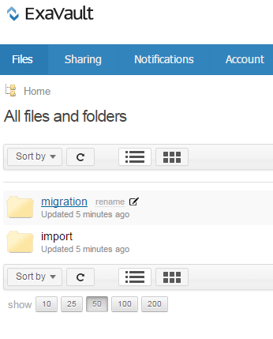
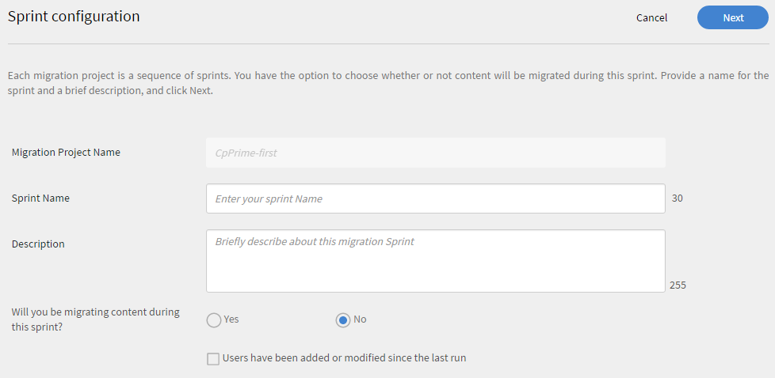

# Migrationshandbuch

Referenzhandbuch für Integrationsadministratoren zum Migrieren eines vorhandenen LMS in das Learning Manager-LMS

<!-- ## Overview {#overview} -->

## Anwendungsszenario {#usagescenario}

Im Allgemeinen verfügen große Unternehmen bereits über ein internes oder extern bereitgestelltes LMS. LMS besteht aus Ihren Schulungsinhalten und Schulungsdaten für Unternehmen. Wenn ihr learning Manager kauft, könnt ihr eure vorhandenen LMS-Inhalte und -Daten in Learning Manager verschieben, damit ihr die Vorteile des modernen und intuitiven LMS nutzen könnt, ohne dass die vorhandenen Daten eures Unternehmens verloren gehen.

Learning Manager bietet die erforderlichen Tools und Spezifikationen, mit denen der Integrationsadministrator des Unternehmens die Migrationsaufgaben einrichten und durchführen kann.

Von heute an können Administratoren des Unternehmens auf die Migrationsfunktion in Learning Manager zugreifen, indem sie sich an das Support-Team von Adobe wenden. Um die Migrationsfunktion in Ihrem Konto zu aktivieren, können Sie sich an das Adobe Learning Manager-Supportteam wenden.

## Migrationsvorgang {#apidescription}

Die Voraussetzungen für die Migration, wichtige Schritte im Migrationsprozess, Migrations-Sprints, Spezifikationen, Daten- und Content-Migrationsschritte werden in diesem Abschnitt wie folgt erklärt:

### Voraussetzungen {#prerequisites}

Das Learning Manager-Team erwartet, dass folgende Aufgaben vor der Migration vom Integrationsadministrator des Unternehmens durchgeführt werden:

* Der Integrationsadministrator extrahiert die Daten und Inhalte des vorhandenen LMS und konvertiert sie in die von Learning Manager angegebenen Dateiformate.
* Der Import von Benutzern als Teil des Migrationsvorgangs wird von Learning Manager nicht unterstützt; es wird erwartet, dass diese vom Unternehmen mithilfe von Connectors importiert werden. Adobe System erwartet, dass diese Connectors vor dem Migrationsvorgang konfiguriert werden. Weitere Informationen findest du in der Hilfe](connectors.md) zu [Learning Manager Connectoren.

In Learning Manager wird Administratoren empfohlen, den Migrationsvorgang in einem Testkonto auszuprobieren, bevor Daten und Inhalte zur Learning Manager-Produktionsumgebung migriert werden.

### Wichtige Schritte des Migrationsvorgangs {#keystepsofmigrationprocess}

Die wichtigsten Schritte bei der Migration von Content und Daten aus einem vorhandenen LMS zu Learning Manager sind:

1. Der Integrationsadministrator oder Partner ermittelt die Daten und -inhalte des bestehenden LMS, die migriert werden sollen.
1. Der Integrationsadministrator prüft die Tools und Spezifikationen, die Learning Manager zum Erfassen von Daten und Inhalten bereitstellt.
1. Der Integrationsadministrator schreibt einen Code oder führt entsprechende manuelle Aufgaben durch, um die Schulungsdaten und -inhalte basierend auf den Funktionen des älteren LMS zu exportieren.
1. Sobald die Schulungsdaten und -inhalte verfügbar sind, werden sie vom Integrationsadministrator analysiert und den entsprechenden Migrationsspezifikationen von Learning Manager zugeordnet.
1. Integration Administrator verwendet die Tools von Learning Manager, um in der folgenden Reihenfolge zu migrieren:

   1. Übertragen von Teilnehmenden zu Learning Manager
   1. Übertragung von Schulungsinhalten in Learning Manager und
   1. Übertragen von Schulungsdaten in Learning Manager

Das Learning Manager-LMS kann jetzt samt der alten Inhalte vom Unternehmen genutzt werden.

### Gültigkeitsbereich von Migrationsobjekten {#scopeofmigrationobjects}

Sie können Inhalte nur für die folgenden Lernobjekte migrieren:

* Modul
* Abzeichen
* Kurs
* Modulversion
* Kursinstanz
* Kursmodul
* Kenntnisse
* Kenntnisstand
* Kenntniskurs
* Zertifizierung
* Zertifizierungskurs
* Zertifizierung bestimmen
* Lernprogramm
* Lernprogrammkurs
* Lernprogramminstanz
* Lernprogrammkursinstanz
* Arbeitshilfe
* Version der Arbeitshilfe
* Kurs der Arbeitshilfe
* Von der Arbeitshilfe vermittelte Kenntnisse
* Registrierung
* Zertifizierungseinschreibung
* Lernprogrammeinschreibung
* Registrierung für Arbeitshilfe
* Benutzerkursbewertungen


### Wichtige Migrationskonzepte {#keyconceptsofmigration}

Einige der wichtigsten Konzepte des Learning Manager-Migrationsprozesses werden für Ihre Kurzreferenz kurz erklärt:

**Migrationsprojekt**

Ein Migrationsprojekt in Learning Manager besteht aus mindestens einem Sprint. Ein Konto kann mehrere Migrationsprojekte umfassen. Der Migrationsvorgang in Learning Manager beginnt mit der Erstellung des Migrationsprojekts.

**Sprint**

Im Rahmen des Learning Manager-Migrationsvorgangs ist ein Sprint definiert als eine Reihe von Migrationselementen, die zur Migration aus einem bestehenden LMS ausgewählt wurden. Bei einem Migrationselement kann es sich um ein Kursmodul, Teilnehmerdatensätze oder eine Reihe von Kursen handeln. Ein Sprint kann mehrere Schulungsdatenelemente umfassen. Migrationsaufträge können in jedem Sprint durchgeführt werden.

**Sprint-Ausführungen**

Sprint-Ausführung bezeichnet das Starten einer Migrationsaufgabe. Sie können die Sprint-Ausführung jederzeit während des Vorgangs unterbrechen.

**Erneute Sprint-Ausführungen**

Sie können einen Migrations-Sprint nach Abschluss jederzeit erneut ausführen. Diese erneute Ausführung eines Sprints erfolgt, wenn Sie die Daten an ein Sprint-Element anhängen und dieses erneut in die Anwendung migrieren oder die Fehler in CSVs beheben möchten.

**CSV-Spezifikation**

Learning Manager bietet Ihnen eine Reihe von [CSV-Standardvorlagen](migration-manual.md#main-pars_header_140933605). Es empfiehlt sich, diese CSV-Spezifikationen vor Beginn des Migrationsvorgangs durchzugehen. Der Integrationsadministrator Ihrer Organisation kann die vorhandenen Datenformate analysieren und entsprechend dem Learning Manager zuordnen, der CSV Vorlagenelementen bereitgestellt wurde.

**Migrationsprojekt-Tags**

Adobe Systems empfiehlt, einige Suchbegriffe als Tags zu verwenden, um die Migrationsprojekte innerhalb von Learning Manager einfach wiederzufinden. Anhand dieser Tags können Sie Ihre Projekte in der Learning Manager-Anwendung jederzeit intern identifizieren.

**Modul ohne Inhalt**

Mit Learning Manager können Sie Module ohne Inhalt hochladen. Adobe Systems sieht es als Modul ohne Inhalt in Learning Manager an. In einem Szenario, bei dem Sie einige der älteren Daten von Ihrem vorhandenen LMS migrieren möchten, ohne dass Inhalte benötigt werden, können Sie die Datei module_version.csv ohne URL-Referenz hochladen.

## CSV-Spezifikationen und Beispiel-CSVs {#csv}

Im Folgenden finden Sie die CSV-Standardspezifikationen, die zur Verknüpfung mit Ihren vorhandenen LMS-Migrationsdaten verwendet werden können. Klicken Sie auf „CSV-Spezifikationen und Beispiel-CSVs“ („csv-templates“ und sample-csvs“) und laden Sie die ZIP-Dateien herunter. In der heruntergeladenen Datei „csv-specifications.zip“ sind sieben Excel-Dateien enthalten. Diese Excel-Dateien sind Spezifikationen mit Beschreibungen zum Ausfüllen von CSV-Dateien. Die entsprechenden CSV-Dateien sollten die Daten für jedes Feld im vordefinierten Format enthalten (wie in diesen XLSX-Dateien beschrieben).

<table border="1" cellspacing="0" cellpadding="0" width="100%">
 <tbody>
  <tr>
   <th>
    <p><b>Sl.no</b></p></th>
   <th>
    <p><b>Dateiname</b></p></th>
   <th>
    <p><b>Beschreibung des Inhalts</b></p></th>
   <th>
    <p>Hinweise</p></th>
  </tr>
  <tr>
   <td>
    <p>1</p></td>
   <td>
    <p>module.xlsx</p></td>
   <td>
    <p>Metadaten für module.csv</p></td>
   <td> </td>
  </tr>
  <tr>
   <td>
    <p>2</p></td>
   <td>
    <p>badge.xlsx</p></td>
   <td>
    <p>Metadaten für badge.xlsx</p></td>
   <td> </td>
  </tr>
  <tr>
   <td>
    <p>3</p></td>
   <td>
    <p>course.xlsx</p></td>
   <td>
    <p>Metadaten für course.csv</p></td>
   <td>
    <p>Es empfiehlt sich, für einen bestimmten Kurs den Namen nur eines Autos zu verwenden, da mehrere Namen nach der Migration in der Anwendung nicht genau angezeigt werden. </p></td>
  </tr>
  <tr>
   <td>
    <p>4</p></td>
   <td>
    <p>module_version.xlsx </p></td>
   <td>
    <p>Metadaten für module_version.csv</p></td>
   <td>
    <p>Achten Sie darauf, den URL-Pfad des Ordners für das Box-Konto anzugeben, in den Sie den Inhalt hochgeladen haben. </p></td>
  </tr>
  <tr>
   <td>
    <p>5</p></td>
   <td>
    <p>course_instance.xlsx</p></td>
   <td>
    <p>Metadaten für course_instance.csv </p></td>
   <td> </td>
  </tr>
  <tr>
   <td>
    <p>6</p></td>
   <td>
    <p>session.xlsx</p></td>
   <td>
    <p>Metadaten für session.csv</p></td>
   <td>
    <p>Stellen Sie sicher, dass jeder Eintrag in der Sitzungs-CSV mindestens einem Klassenzimmer-/virtuellen Klassenzimmermodul zugeordnet ist</p></td>
  </tr>
  <tr>
   <td>
    <p>7</p></td>
   <td>
    <p>course_module.xlsx</p></td>
   <td>
    <p>Metadaten für course_module.csv</p></td>
   <td> </td>
  </tr>
  <tr>
   <td>
    <p>8</p></td>
   <td>
    <p>skill.xlsx</p></td>
   <td>
    <p>Metadaten für skill.csv</p></td>
   <td> </td>
  </tr>
  <tr>
   <td>
    <p>9</p></td>
   <td>
    <p>skill_level.xlsx</p></td>
   <td>
    <p>Metadaten für skill_level.csv</p></td>
   <td> </td>
  </tr>
  <tr>
   <td>
    <p>10</p></td>
   <td>
    <p>skill_course.xlsx</p></td>
   <td>
    <p>Metadaten für skill_course.csv</p></td>
   <td> </td>
  </tr>
  <tr>
   <td>
    <p>11</p></td>
   <td>
    <p>certification.xlsx</p></td>
   <td>
    <p>Metadaten für Certification.csv</p></td>
   <td> </td>
  </tr>
  <tr>
   <td>
    <p>12</p></td>
   <td>
    <p>certification_course.xlsx</p></td>
   <td>
    <p>Metadaten für certification_course.csv</p></td>
   <td> </td>
  </tr>
  <tr>
   <td>
    <p>13</p></td>
   <td>
    <p>certification_commit.xlsx</p></td>
   <td>
    <p>Metadaten für certification_commit.csv</p></td>
   <td> </td>
  </tr>
  <tr>
   <td>
    <p>14</p></td>
   <td>
    <p>learning_program.xlsx</p></td>
   <td>
    <p>Metadaten für learning_program.csv</p></td>
   <td> </td>
  </tr>
  <tr>
   <td>
    <p>15</p></td>
   <td>
    <p>learning_program_course.xls </p></td>
   <td>
    <p>Metadaten für learning_program_course.csv </p></td>
   <td> </td>
  </tr>
  <tr>
   <td>
    <p>16</p></td>
   <td>
    <p>learning_program_instance.xlsx </p></td>
   <td>
    <p>Metadaten für learning_program_instance.csv</p></td>
   <td> </td>
  </tr>
  <tr>
   <td>
    <p>17</p></td>
   <td>
    <p>learning_program_instance_course_instance.xlsx </p></td>
   <td>
    <p>Metadaten für learning_program_instance_course_instance.csv</p></td>
   <td> </td>
  </tr>
  <tr>
   <td>
    <p>18</p></td>
   <td>
    <p>job_aid.xlsx</p></td>
   <td>
    <p>Metadaten für job_aid.csv</p></td>
   <td>
    <p>Für jede migrierte job_aid müssen eine oder mehrere job_aid-Versionen vorhanden sein.</p></td>
  </tr>
  <tr>
   <td>
    <p>19</p></td>
   <td>
    <p>Job_aid_version.xlsx</p></td>
   <td>
    <p>Metadaten für job_aid_version.csv</p></td>
   <td> </td>
  </tr>
  <tr>
   <td>
    <p>20</p></td>
   <td>
    <p>job_aid_course.xlsx</p></td>
   <td>
    <p>Metadaten für job_aid_course.csv</p></td>
   <td> </td>
  </tr>
  <tr>
   <td>
    <p>21</p></td>
   <td>
    <p>job_aid_skills.xlsx</p></td>
   <td>
    <p>Metadaten für job_aid_skills.csv</p></td>
   <td> </td>
  </tr>
  <tr>
   <td>
    <p>22</p></td>
   <td>
    <p>enrollments.xlsx</p></td>
   <td>
    <p>Metadaten für enrollments.csv</p></td>
   <td> </td>
  </tr>
  <tr>
   <td>
    <p>23</p></td>
   <td>
    <p>certification_enrollement.xlsx</p></td>
   <td>
    <p>Metadaten für certification_enrollement.csv</p></td>
   <td> </td>
  </tr>
  <tr>
   <td>
    <p>24</p></td>
   <td>
    <p>learning_program_enrollment.xlsx</p></td>
   <td>
    <p>Metadaten für learning_program_enrollment.csv<br><br></p></td>
   <td> </td>
  </tr>
  <tr>
   <td>
    <p>25</p></td>
   <td>
    <p>job_aid_enrollment.xlsx</p></td>
   <td>
    <p>Metadaten für job_aid_enrollment.csv</p></td>
   <td> </td>
  </tr>
  <tr>
   <td>
    <p>26</p></td>
   <td>
    <p>user_course_grade.xlsx</p></td>
   <td>
    <p><br>
      Metadaten für user_course_grade.csv</p></td>
   <td>
    <p>Ebenso empfiehlt es sich, die erforderlichen Teilnehmer-Datensatzdaten in der CSV-Datei bereitzustellen, auch wenn sie nicht erforderlich sind. Ohne diese Informationen kann die Learning Manager-Anwendung selbst dann, wenn die .csv zur Migration verarbeitet wird, keine Daten widerspiegeln. In der Datei „sample-csvs.zip“ sind sieben CSV-Dateien mit einer ähnlichen Namenskonvention wie oben enthalten.</p></td>
  </tr>
  <tr>
   <td>
    <p>27</p></td>
   <td>
    <p>user_skill.xlsx</p></td>
   <td>
    <p><br>
      Metadaten für user_skill.csv</p></td>
   <td>
    <p> </p></td>
  </tr>
 </tbody>
</table>

Learning Manager unterstützt nur Datums- und Zeitwerte im UTF-8- und 32-Bit-Format. Bei der Migration kann es zu Fehlern kommen, wenn du das Datum in CSV Dateien mit einem nicht verfügbaren Datum als 2038-07-17T08:53:21.000Z oder 1980-04-17T08:13:25.322Z nennst.

* [sample-csvs.zip](assets/sample-csvs.zip)
* [csv_specifications.zip](assets/csv-specifications.zip)

Sie müssen die folgenden Abhängigkeiten für CSV-Dateien während des Imports berücksichtigen:

* „module_version.csv“ ist von „module.csv“ abhängig
* „course_instance.csv“ ist von „course.csv“ abhängig
* „course_module.csv“ ist von „course.csv“, „module.csv“ und „module_version.csv“ abhängig
* „course_instance.csv“ ist von „course.csv“ abhängig
* session.csv ist von „course.csv“ und „module.csv“ abhängig
* „enrollment.csv“ ist von „course.csv“ abhängig
* „user_course_grade.csv“ ist von „course.csv“ und „module.csv“ abhängig
* „skill_course.csv“ ist von „course.csv“ abhängig
* skill_level.csv skill.csv abhängig ist
* learning_program_instance.csv ist vom learning_program und learning_program_course.csv abhängig
* learning_program_course.csv learning_program.csv abhängig ist
* learning_program_enrollment.csv ist vom learning_program und learning_program_instance.csv abhängig
* learning_program_instance_course_instance.csv hängt von learning_program.csv, learning_program_instance.csv und course_instance.csv
* certification_course.csv hängt von certification.csv und course.csv ab.
* certification_commit.csv hängt von certification.csv und certification_course.csv
* certification_enrollment.csv ist von certification.csv, certification_course.csv und certification_enrollment.csv abhängig


## Migrationsverfahren {#migrationprocedure}

Bevor ihr mit dem Migrationsverfahren beginnt, müsst ihr folgende Punkte beachten:

* Innerhalb eines Kontos kann jeweils nur ein Migrationsprojekt aktiv sein. Innerhalb eines Projekts kann jeweils nur ein Sprint aktiv sein.
* Wurde der Migrationsvorgang gestartet, kann die entsprechende Ausführung nicht mehr rückgängig gemacht werden. Sie können jedoch jede beliebige Daten- oder Inhaltsmigration mithilfe der Löschoption der jeweiligen Funktion in Learning Manager rückgängig machen.
* Sobald das Migrationsprojekt beginnt, wird es in den Status &quot;Under Migration&quot; umgewandelt. Während der Migration kann sich nur der Integrationsadministrator bei Learning Manager anmelden.

### Erstellen von FTP- und Box-Konten {#creatingftpandboxaccounts}

Ihr Migrationsprojekt zu planen, ist sehr wichtig. Es wird empfohlen, Ihre Projekte in mehrere Teile zu teilen und deutlich anzugeben, was Sie in den einzelnen Teilen migrieren möchten. Es kann auch ratsam sein, eine Überprüfung nach jedem Teil durchzuführen, um sicher zu gehen, dass die Daten in diesem Teil migriert wurden, anstelle einer Gesamtüberprüfungsphase am Ende des Projekts. Bevor Sie die Teile als Teil Ihres Migrationsprojekts starten, müssen Sie Daten und Inhalts-CSV-Dateien auf FTP- und Box-Server hochladen. Wenn du keine Konten für Benutzerdefiniertes FTP und Box hast, kannst du sie erstellen.

<!--**Create FTP account**-->

<!--Click **[!UICONTROL Request for CSV FTP folder]**. A pop-up dialog appears prompting you to enter your e-mail id. Go through online instructions and create an FTP account. As soon as you create your account, you can view your migration project and sprint project folders in FTP. 

A sample snapshot of project files and folder of FTP is shown below for your reference. -->

<!---->

**Box-Konto erstellen**

Erstellen Sie den Upload-Ordner für Inhalte in einem ähnlichen Vorgang wie beim Erstellen des FTP-Ordners. Klicken Sie im linken Bereich auf „Migration“ und dann unten auf der daraufhin angezeigten Seite auf „Anfordern“ für einen Upload-Ordner für Inhalte.

Sie erhalten eine E-Mail von Box mit einem Link zum freigegebenen Ordner. Wenn Sie über kein Box-Konto verfügen, klicken Sie auf „Registrieren“ und erstellen Sie ein Konto. Anweisungen zur Anmeldung werden an die E-Mail-ID des Integrations-Admins gesendet.

**Hochladen von Daten (CSV-Dateien) auf FTP- oder Box-Ordner**

Bevor Sie ein Migrationsprojekt erstellen, müssen Sie als Voraussetzung ein FTP- oder Box-Konto erstellen. In dieser Phase könnt ihr in Learning Manager ein Migration Project and Sprint erstellen.  Im Abschnitt daten **- und inhaltsbasierte Migrationsverfahren** auf dieser Seite erfahrt ihr, wie ihr ein Migrationsprojekt erstellen könnt.

Klicken Sie im FTP- bzw. Box-Konto auf den Namen Ihres Projektordners und anschließend auf den Sprint-Namen. Innerhalb des Sprint-Ordners können Sie die CSV-Datendateien hochladen, die migriert werden sollen. Klicke oben im FTP- oder Box-Server auf den Button Dateien hochladen, und ziehe die .csv Dateien. Ein Beispiel-Schnappschuss nach dem Upload in FTP ist unten für dein Referenzbild zu sehen.

<!---->

Sie können zum Migrationsprojekt von Learning Manager zurückkehren, auf Aktualisieren ]**klicken**[!UICONTROL  und alle .csv Datentypen anzeigen, die in Ihrem Migrations-Sprint aufgeführt sind.

**Schulungsinhalte in Inhaltsordner hochladen**

Laden Sie die Schulungsinhalte von Ihrem vorhandenen LMS auf Ihr Box-Konto hoch. Wenn Sie bereits das Migrationsprojekt und den Sprint erstellt haben, füllt das Box-Konto das Migrationsprojekt und den Sprint-Namen aus. Sie können die Inhalte im selben Pfad hochladen. Im Abschnitt daten **- und inhaltsbasierte Migrationsverfahren** auf dieser Seite erfahrt ihr, wie ihr ein Migrationsprojekt erstellen könnt.

Sie können die Inhaltsdateien per Drag &amp; Drop verschieben oder auf **[!UICONTROL Hochladen]** klicken und die Dateien auf dem Desktop auswählen. Bei Inhalten mit sehr großen Dateigrößen kann es zu Verzögerungen beim Hochladen der Dateien kommen. Je nach Größe der Datei ist der Zeitaufwand für den Upload der Dateien auf dein Box-Konto unterschiedlich.

Ein Beispielfoto des Box-Kontos nach dem Hochladen des Contents darin wird unten für dein Referenzbild angezeigt:


*Dateien in Box-Konto*

Nachdem die Dateien auf Ihr Box-Konto hochgeladen wurden, stellen Sie sicher, dass Sie den relativen Pfad dieser Box-Inhaltsdatei in der Datei „module_version.csv“ angeben. Dies ist ein obligatorischer Schritt für Sie, um den Pfad des Modulinhalts anzugeben.

Wenn Sie sich bei den FTP- und Box-Servern angemeldet und den Inhalt hochgeladen haben, werden die CSV-Speicherorte wie in der Abbildung unten dargestellt in Learning Manager angezeigt.


*CSV Speicherorte im Box-Konto*

## Migrationsverfahren für Daten und Inhalte {#dataandcontentmigrationprocedure}

Das Verfahren zur Migration Ihrer Enterprise LMS-Daten und -Inhalte zu Learning Manager wird wie folgt erläutert:

Prüfen Sie die Voraussetzungen für den Migrationsprozess, bevor Sie mit der Migration beginnen. [Sieh dir auf dieser Seite CSV Spezifikationen und Beispiel-CSVs](migration-manual.md#main-pars_header_140933605) an, und bereite die CSVs für die Daten- und Content-Migration vor.

1. Melde dich bei Learning Manager als Integrationsadministrator an, und klicke **[!UICONTROL im Bedienfeld links auf Migration]** .

   Daraufhin wird die Startseite für Migrationsprojekte angezeigt. Wenn Ihr Unternehmen bereits Migrationsprojekte erstellt hat, können Sie auf dieser Seite eine Liste mit allen Migrationsprojekten anzeigen.

1. Klicken Sie in der rechten oberen Ecke der Seite auf **[!UICONTROL Neu]**, um ein Migrationsprojekt zu erstellen. Alternativ können Sie auf der Seite auf den Link **[!UICONTROL Migrationsprojekt erstellen]** klicken, um ein Migrationsprojekt zu erstellen. Die Seite für ein Migrationsprojekt wird angezeigt.

   Wenn du noch keinen FTP-Ordner erstellt hast, wirst du aufgefordert, einen FTP-Ordner im Konto zu erstellen. Dies ist ein obligatorischer Schritt, bevor Sie mit dem Erstellen eines Migrationsprojekts beginnen.

   
   *FTP-Ordner erstellen*

   Geben Sie den Projektnamen, das Projekt-Tag, den Kurskatalog und eine Beschreibung für Ihr Migrationsprojekt an. Klicken Sie auf **[!UICONTROL Erstellen]**.

   Ihre Migrationsdatenelemente werden mithilfe dieses Migrationsprojekt-Tags identifiziert. Wenn Sie über keinen bestimmten Kurskatalog verfügen, wählen Sie den Standardkatalog in der Dropdown-Liste aus. Alle Kurse, die mithilfe eines Migrationsprojekts migriert werden, sind im Katalog enthalten, den Sie in dieser Phase ausgewählt haben. Wenn Sie keinen Katalog auswählen, sind alle migrierten Kurse Teil des Standardkatalogs.

1. Die Seite der Sprint-Konfiguration wird angezeigt (siehe nachfolgende Abbildung). Sie müssen einen Sprint als Teil Ihres Migrationsprojekts erstellen. Wählen Sie einen Sprint-Namen aus und geben Sie eine kurze Beschreibung des Sprints an. Sie können „Ja“ auswählen, wenn Sie Inhalte als Teil dieses Sprints migrieren möchten. Klicke auf **[!UICONTROL Weiter]**.

   
   *Sprint-Migration*

   Wähle das Kontrollkästchen mit titel **. Benutzer wurden seit der letzten Ausführung** hinzugefügt oder geändert, um die Benutzerliste mit der Learning Manager-Anwendung zu synchronisieren. Wenn Sie den Inhalt und die Daten in die Learning Manager-Anwendung migrieren, ist dies unter Umständen nicht erforderlich. Wenn zwischen Ihrer früheren Sprint-Migration und der neuesten Sprint-Migration jedoch eine Zeitspanne liegt, wird empfohlen, die Liste der Benutzer zu synchronisieren. In diesem Schritt kann die Learning Manager-Datenbank mit Ihren LMS-Benutzern synchronisiert werden.

   Dieser Synchronisierungsschritt wird empfohlen, wenn die Dateien „enrollment.csv“ und „user_course_grade.csv“ migriert werden. Bei diesem Schritt kann die Learning Manager-Datenbank mit Ihrer Migrationsdatenbank synchronisiert werden und es wird sichergestellt, dass alle Benutzer, deren Datensätze im Sprint migriert werden sollen, in der Migrationsdatenbank zur Verfügung stehen.

1. Sie können die Sprint-Migration mit Ihren hochgeladenen Daten und Inhalten beginnen. Klicke auf **[!UICONTROL &quot;Link aktualisieren]** &quot;, bevor du mit der Sprint-Ausführung beginnst, um die FTP- und Content-Ordner mit der Learning Manager-Anwendung zu synchronisieren.

   
   *Sprint-Migration starten*

   Klicke **[!UICONTROL oben rechts auf Start]** . Sie können während der Sprint-Migration auf &quot;Anhalten&quot;]**klicken**[!UICONTROL , um die Sprint-Migration abzubrechen.

   Der Migrationsstatus wird für die jeweiligen Sprint-Datenelemente und -Inhalte angezeigt. Überprüfen Sie die Anzahl der erfolgreichen und fehlgeschlagenen Elemente als Teil des Sprint-Laufs der Migration.

   Stellen Sie beim Hochladen von Modulinhalten sicher, dass der Pfad des Inhaltsordners in der Datei „module_version.csv“ angegeben wird. Wenn Sie diesen Schritt versäumen, stellen Sie möglicherweise Fehler während der Migration fest. Wenn Sie beispielsweise Inhalte von Modulen zum Selbststudium (z. B. Videos) hochladen, müssen Sie den relativen Box-URL-Pfad in der Datei „module_version.csv“ angeben. Für Inhalte des Aktivitätsmoduls können Sie den URL-Namen festlegen.

   In der Abbildung unten sehen Sie ein Referenzbeispiel für den Fortschrittsdialog. Sie können die Anzahl der für jedes Migrationsdatenelement verarbeiteten Datensätze zusammen mit dem Status der erfolgreichen und fehlgeschlagenen Elemente sehen. Klicken Sie auf „Fehlerdatensätze für die fehlgeschlagenen Elemente herunterladen“, um die Fehlerprotokolle herunterzuladen und anzuzeigen. Sie können die Probleme in der CSV-Datei beheben und diese erneut auf FTP hochladen.

   
   *Fortschritt im Sprint anzeigen*

   Klicken Sie im linken Bereich auf die Sprint-Liste, wenn Sie die Liste aller Sprints eines Migrationsprojekts anzeigen möchten. Sie können eine Liste aller Sprints, die Anzahl der ausführungen für jeden Sprint, Startdatum, Dauer und Fertigstellungsstatus anzeigen, wie im nachfolgenden Beispiel-Schnappschuss zu sehen ist.

   
   *Liste der Sprints anzeigen*

1. Nachdem Sie die neuesten aktualisierten CSV-Dateien hochgeladen haben, können Sie in der oberen rechten Ecke der Seite auf „Wiederholen“ klicken. Bei der Wiederholung werden alle Datenelemente noch einmal verarbeitet und Elemente ignoriert, für die es keine Änderungen gibt. Sobald Sie mit der Migration von Datenelementen in einem Sprint zufrieden sind, können Sie die Sprint-Migration als abgeschlossen markieren, indem Sie auf die Schaltfläche oben auf der Seite klicken. Sie können einen neuen Sprint mit mehr Datenelementen zu einem späteren Zeitpunkt starten. Sobald ein Sprint als abgeschlossen markiert wurde, können Sie ihn nicht erneut wiederholen. Dementsprechend kann ein Migrationsprojekt eine beliebige Anzahl von Sprints umfassen. Sobald du mit dem Migrationsstatus aller Sprints zufrieden bist, markiere das Migrationsprojekt als &quot;Abgeschlossen&quot;, indem du auf der Seite Sprint-Liste auf &quot;Projekt vollständig **markieren&quot; klickst**.

   Bevor Sie das Migrationsprojekt als abgeschlossen markieren, müssen Sie sicherstellen, dass alle Sprints des Projekts abgeschlossen sind. Nachdem Sie das Migrationsprojekt als abgeschlossen markiert haben, können Sie nicht zurückgehen und Sprints in diesem Projekt erstellen oder Änderungen an diesem Projekt vornehmen. Sie müssen ein weiteres Migrationsprojekt erstellen und ihm Sprints hinzufügen.

## Migrationsverifizierung {#registration}

Nachdem Sie die Lerndaten und -inhalte aus dem älteren LMS Ihres Unternehmens migriert haben, können Sie die importierten Daten und Inhalte mit verschiedenen Lernobjektfunktionen überprüfen. Sie können sich beispielsweise bei der Learning Manager-Anwendung als Administrator anmelden und die Verfügbarkeit der Daten und Inhalte von importierten Modulen und Kursen überprüfen.

## Nachrüsten in der Migration {#retrofittinginmigration}

Mit dieser Integrationsfunktion können Sie historische Daten für ein Lernobjekt von einem veralteten Learning Management-System auf einen aktiven Kurs nachrüsten, der in Learning Manager erstellt wird.

Im Folgenden finden Sie die CSV-Standardspezifikationen, die zur Verknüpfung mit Ihren vorhandenen LMS-Migrationsdaten verwendet werden können. Klicken Sie auf „CSV-Spezifikationen und Beispiel-CSVs“ („csv-templates“ und sample-csvs“) und laden Sie die ZIP-Dateien herunter. In der heruntergeladenen Datei „csv-specifications.zip“ sind vier Excel-Dateien enthalten. Diese Excel-Dateien sind Spezifikationen mit Beschreibungen zum Ausfüllen von CSV-Dateien. Die entsprechenden CSV-Dateien sollten die Daten für jedes Feld im vordefinierten Format enthalten (wie in diesen XLSX-Dateien beschrieben).

 1-enrollment.xlsx-enthält Beschreibungen von Metadaten, die für die retrofit_enrollment.csv-Datei erforderlich sind.

2-certification_enrollment.xlsx enthält Beschreibungen von Metadaten, die für die retrofit_certification_enrollment.csv-Datei erforderlich sind.

3-learning_program_enrollment.xlsx enthält Beschreibungen von Metadaten, die für die retrofit_learning_program_enrollment.csv-Datei erforderlich sind.

4-user_course_grades.xlsx enthält Beschreibungen der Metadaten, die für retrofit_user_course_grades.csv Datei erforderlich sind.
[csv-specifications.zip](assets/csv-specifications.zip)

>[!NOTE]
>
>Die CSV-Datei (Universally Unique ID) ist ebenfalls eine Spalte im CSV-Migrations-Format.


## Fehlerbehebung für Migrationsprobleme {#troubleshootingmigrationissues}

[Klicken Sie hier](../../kb/troubleshooting-migration.md), um mehr über die Problemumgehung/Lösung für die Probleme zu erfahren, mit denen die für die Integration zuständigen Administratoren bei der Migration von Daten und Inhalten aus Ihrem vorhandenen LMS in die Learning Manager-Anwendung konfrontiert sind.

## Tipps zur Benutzerverwaltung {#usermanagement}

Unter diesem Thema finden Sie einige Tipps zum besseren Verständnis dazu, wie Benutzer in Learning Manager berücksichtigt und verwaltet werden. Diese Konzepte unterstützen Sie beim Optimieren der Verwaltung von Benutzern, während der Verwendung von CSV-Import, Connectors und Migrationsfunktionen von Learning Manager.

## Learning Manager-IDs {#captivateprimeids}

In Learning Manager stehen zwei Arten von eindeutigen IDs für Benutzer zur Verfügung:

* E-Mail-ID
* UUID (Universally Unique ID)

Learning Manager unterstützt UUID, um Unternehmen Flexibilität beim Steuern von Benutzerkonten zu bieten. Wenn du als Administrator eine Id von Benutzern in einem Konto hast, kannst du die E-Mail-ID der Benutzer für dieses Konto ändern.

**Anwendungsszenario für UUID in einem Unternehmen**

Überlegt euch ein Szenario, in dem ein Mitarbeiter A einem Unternehmen namens Learning Manager als Auftragnehmer beizutreten beginnt. Während der Vertragslaufzeit darf Learning Manager die E-Mail-ID des Unternehmens nicht als ```A@example.com```E-Mail-ID angeben. Stattdessen kann das Unternehmen z. B ```A@gmail.com```. nur das persönliche E-Mail-Konto des Mitarbeiters berücksichtigen. Wenn der gleiche Mitarbeiter A nach Ablauf der 6 Monate des Vertragszeitraums zu Learning Manager als Vollzeitmitarbeiter wechselt, kann Learning Manager seine E-Mail-ID in seine E-Mail-ID des Unternehmens ändern: ```A@example.com```.

Der Zugriff auf ein Anwenderkonto mit 3D-ID ist für das Unternehmen Learning Manager im oben genannten Szenario von Vorteil. Learning Manager kann die persönliche E-Mail-ID von Mitarbeiter A durch eine offizielle E-Mail-ID ersetzen. Die für dieses Konto relevanten Datensätze für den Mitarbeiter sind von dieser Änderung nicht betroffen.

## Identifikation einzelner Benutzer {#singleuseridentification}

Learning Manager identifiziert und speichert, wie ein einzelner Benutzer hinzugefügt wird: über Selbstregistrierung, CSV-Upload oder durch Hinzufügen eines einzelnen Benutzers über die Benutzeroberfläche oder mithilfe einer API.

* Wenn ein einzelner Benutzer über die Benutzeroberfläche (UI) oder über die API hinzugefügt wird, können Sie solche Einzelbenutzer über die Benutzeroberfläche (UI) oder die API löschen.
* Sie können einzelne Benutzer über CSV-Upload-Prozesse aktualisieren, aber Sie müssen dabei beachten, dass diese einzelnen Benutzer als CSV-Benutzer behandelt werden und die CSV-Arbeitsabläufe für solche Benutzer gelten.

## Zuweisen der Manager-Rolle {#assigningmanagerrole}

Sie können eine Manager-Rolle nicht jedem Benutzer in Learning Manager direkt zuweisen. Ein Anwender X kann nur dann zum Learning Manager Manager werden, wenn du ein Manager-Attribut eines Benutzers (z. B. Y) in diesem Konto als X feststellst.

Szenario: X ist der Manager der Benutzer A, B und C; wenn X das Unternehmen verlässt, müssen Sie sicherstellen, dass das Manager-Attribut für A, B und C auf den neuen Manager festgelegt wird. Alternativ dazu können Sie auch das Manager-Attribut für diese Benutzer vorübergehend als ROOT festlegen und später dem neuen Namen des Managers zuweisen.

Weitere Informationen zu diesem Thema findest du im folgenden Hilfeinhalt:

* [Häufig gestellte Fragen zum Hochladen von CSV](/help/migrated/administrators/add-users-in-bulk.md)
* [Funktions-Hilfe für das Hinzufügen von Benutzern](/help/migrated/administrators/feature-summary/add-users-user-groups.md)
