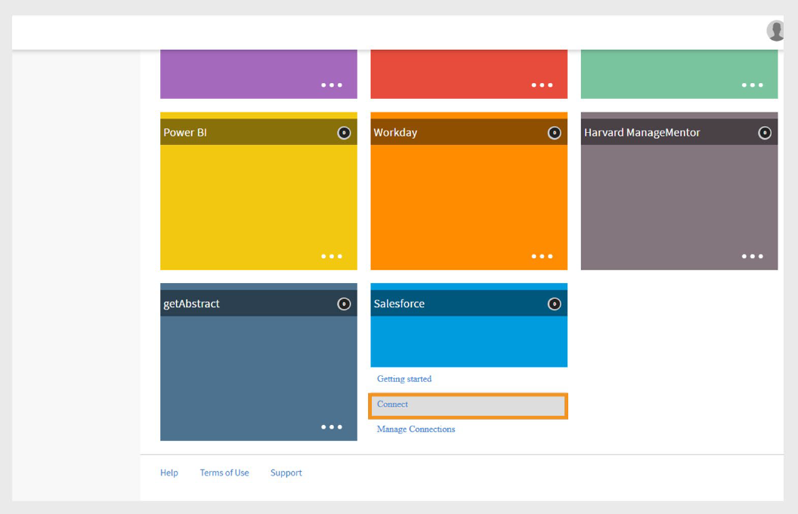
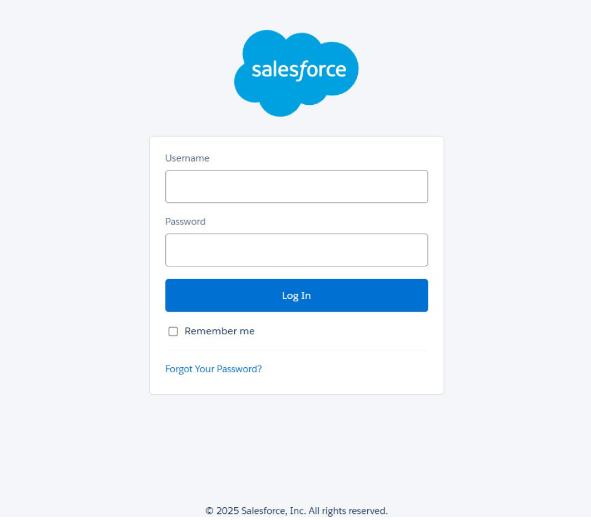
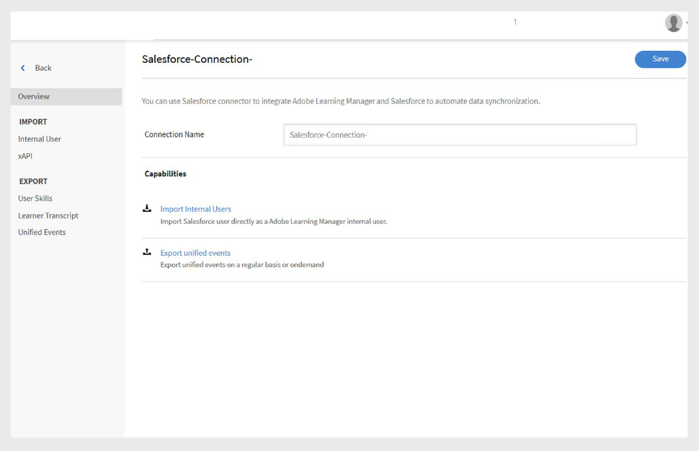
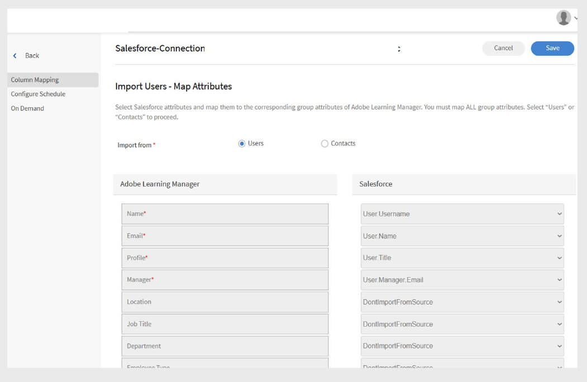
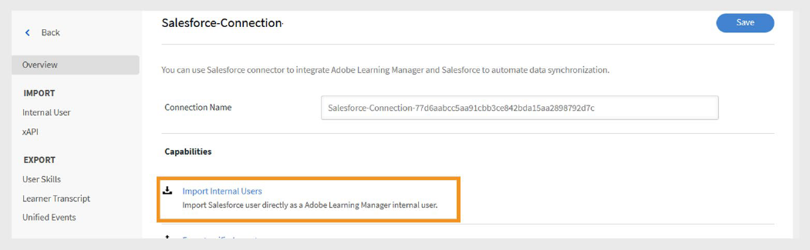
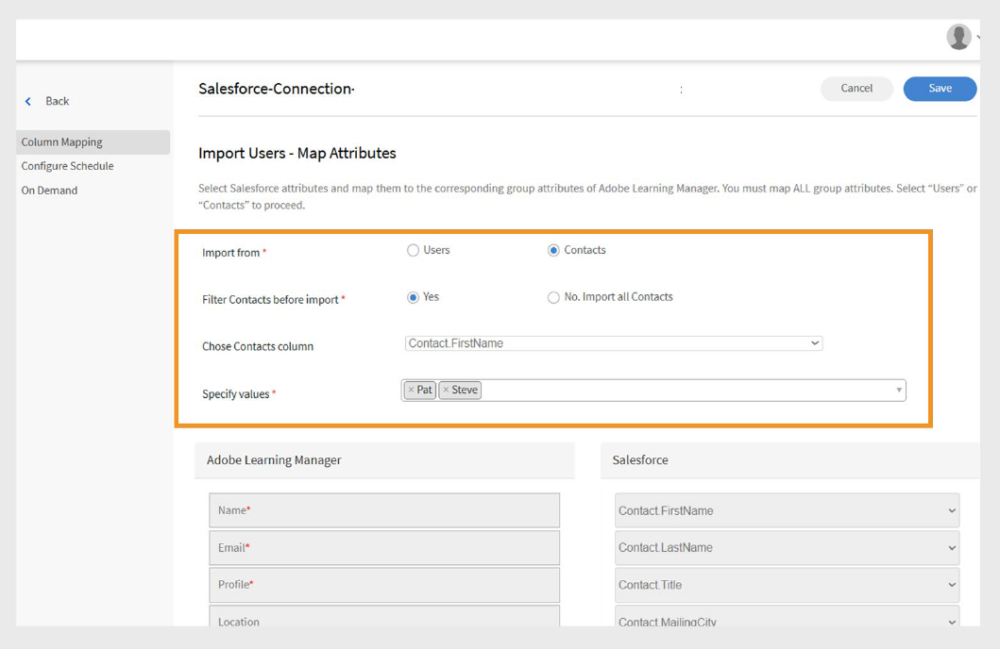
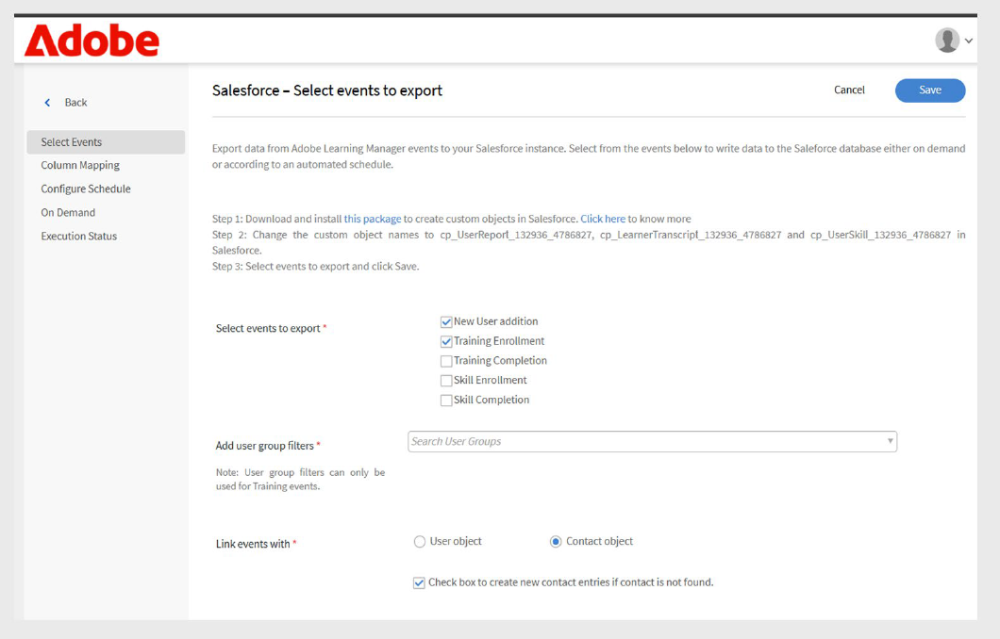
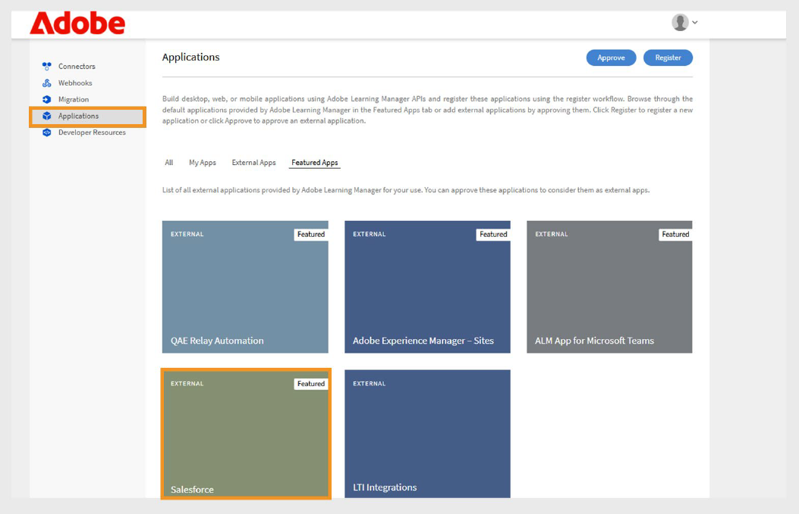
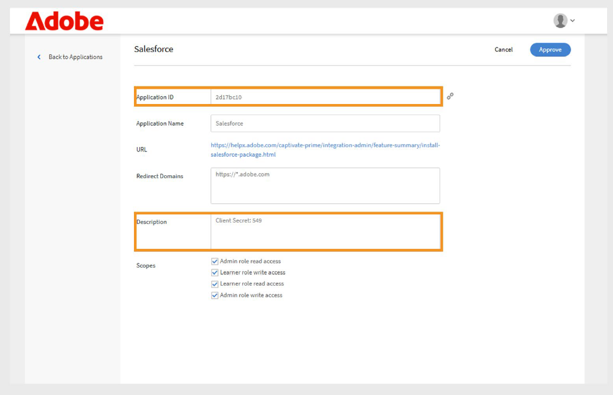

# Salesforce-Verbindung für Adobe Learning Manager

## Einführung

Die Salesforce-Verbindung integriert Ihre Salesforce- und Adobe Learning Manager (ALM)-Konten und ermöglicht so den automatisierten Benutzerimport, die Datensynchronisierung und den Export von Lerndatensätzen. In diesem Handbuch wird erläutert, wie Sie die Verbindung konfigurieren, Benutzerdaten verwalten und Lerneinblicke in Salesforce integrieren.

Die Salesforce-Verbindung für Adobe Learning Manager ermöglicht eine reibungslose Integration, da Benutzer automatisch importiert werden, benutzerdefinierte Datenzuordnungen unterstützt werden und Lerndatensätze nach Salesforce exportiert werden.

In diesem Leitfaden erfahren Sie, wie Sie:

- Stellen Sie sichere Verbindungen zwischen Salesforce und Adobe Learning Manager her.
- Konfigurieren Sie automatisierte Benutzerimport-Prozesse aus Salesforce.
- Ordnen Sie Salesforce-Felder effektiv Adobe Learning Manager-Attributen zu.
- Exportieren Sie Lerndatensätze zurück in Salesforce, um umfassende Berichte zu erstellen.
- Richten Sie Filterungen und Zeitpläne für die zielgerichtete Datensynchronisierung ein.

## Was ist die Salesforce-Verbindung?

Die Salesforce-Verbindung ist ein leistungsstarkes Integrationstool, das eine nahtlose Brücke zwischen Ihrem Salesforce CRM und Adobe Learning Manager schlägt. Mit dieser Verbindung entfällt die manuelle Dateneingabe, da Benutzerinformationen, Kontaktdaten und Lerndatensätze automatisch zwischen den beiden Plattformen synchronisiert werden.

## Wichtigste Funktionen

### Attributzuordnung

Dies erleichtert die Erstellung flexibler Verknüpfungen zwischen Salesforce-Feldern und Adobe Learning Manager-Benutzerattributen. Sie können Standardfelder wie Name, E-Mail und Manager entsprechenden Attributen in Learning Manager zuordnen. Die Verbindung unterstützt auch benutzerdefinierte Felder auf beiden Plattformen, umfasst die erforderliche Feldvalidierung, um die Datengenauigkeit zu gewährleisten, und ermöglicht es Ihnen, Zuordnungskonfigurationen zur Wiederverwendung in zukünftigen Importen zu speichern.

### Automatischer Benutzerimport

Sie optimiert das Onboarding und die Wartung von Anwendern durch automatisierte Importprozesse, die eine manuelle CSV-Dateiverwaltung überflüssig machen.

- Direkter Import von Salesforce-Benutzerobjekten ohne dazwischenliegende Dateiformate.
- Synchronisierung von Benutzerprofiländerungen in Echtzeit.
- Unterstützung für Standardbenutzer und externe Kontakte.

### Importe automatisch planen

Konfigurieren Sie automatisierte Synchronisationszeitpläne, die die Datenwährung ohne manuelle Eingriffe beibehalten. Wählen Sie aus den Optionen für die tägliche, wöchentliche oder benutzerdefinierte Intervallplanung.

- Zeitzonenkonfiguration für globale Organisationen.
- Planung von Spitzen-/Nebenzeiten zur Optimierung der Systemleistung.

### Benutzerfilter

- Wendet Datenkriterien an, um bestimmte Anwendergruppen anzusprechen und die Effizienz der Datensynchronisierung zu optimieren.
- Rollenbasierte Filterungen für zielgerichtete Schulungsprogramme.
- Geografische oder standortbasierte Filterungen für regionale Implementierungen
- Filterungen benutzerdefinierter Felder anhand von Salesforce-Kriterien und -Formeln.

## Voraussetzungen

Stellen Sie vor der Konfiguration der Salesforce-Verbindung sicher, dass Ihre Umgebung die folgenden Anforderungen erfüllt:

- [Salesforce-Organisations-URL](https://myorg.salesforce.com)
- Anmeldeinformationen für Administratoren für Salesforce und Adobe Learning Manager.
- Systemadministrator oder entsprechende Berechtigungen in Salesforce.
- Aktives Adobe Learning Manager-Konto mit entsprechender Lizenzierung

## Salesforce-Connector konfigurieren

Mit der Salesforce-Verbindung in Adobe Learning Manager können Integrationsadministratoren die Synchronisierung von Benutzerdaten und Lerndatensätzen zwischen Salesforce und Adobe Learning Manager automatisieren.

Erstellen einer Salesforce-Verbindung:

1. Melden Sie sich als Integrationsadministrator an.
2. Wählen Sie **Salesforce** und anschließend **Connect** aus.

   
   _Seite mit Adobe Learning Manager-Verbindungen, auf der die Salesforce-Verbindung mit markierter Schaltfläche &quot;Verbinden&quot; angezeigt wird_

3. Geben Sie Ihre Salesforce-Organisations-URL ein und wählen Sie **Verbindung**. Dadurch gelangen Sie zur Salesforce-Anmeldeseite.

   
   _Salesforce-Anmeldeformular mit Feldern für Benutzername und Kennwort_

4. Melden Sie sich mit Ihrem Benutzernamen und Ihrem Kennwort an. Führen Sie alle zusätzlichen Authentifizierungsschritte aus, z. B. die zweistufige Verifizierung oder die Beantwortung von Sicherheitsfragen.

   Nach erfolgreicher Authentifizierung wird die Verbindungsübersicht angezeigt, auf der die hergestellte Verbindung zwischen Systemen bestätigt wird.

   
   _Übersichtsseite zur Salesforce-Verbindung, die den Verbindungsstatus anzeigt_

### Attribute zuordnen

Durch das Verständnis der Attributzuordnung wird die grundlegende Verbindung zwischen Salesforce-Datenfeldern und Adobe Learning Manager-Benutzerattributen erstellt, sodass sichergestellt wird, dass Benutzerinformationen genau zwischen den Systemen übertragen werden.

#### Zuordnungsanforderungen

- Alle erforderlichen Adobe Learning Manager-Felder müssen den entsprechenden Salesforce-Feldern zugeordnet werden.
- Zuordnungskonfigurationen sind wiederverwendbar und über mehrere Importe hinweg dauerhaft

Zuordnen der Attribute:

1. Navigieren Sie zur Übersichtsseite Salesforce-Verbindung .
2. Wählen Sie **Interne Benutzer** und dann **Zuordnung konfigurieren**.
3. Wählen Sie eine der folgenden Optionen aus:

   - **Benutzer:** Von Mitarbeitern oder internen Teammitgliedern verwendete Salesforce-Standardkonten
   - **Kontakte:** Externe Personen wie Kunden, Partner oder Anbieter.

4. Ordnen Sie die aktiven Adobe Learning Manager-Felder den Salesforce-Spalten auf der Zuordnungsseite zu. Das Feld **Manager** muss einem E-Mail-Feld des Benutzermanagers zugeordnet sein.

   
   _Feldzuordnungsoberfläche mit Adobe Learning Manager-Benutzerattributen auf der linken Seite und Salesforce-Felddropdown-Auswahlen auf der rechten Seite_

5. Wählen Sie **Speichern**, um die Zuordnung abzuschließen.

## Importieren von Benutzern und Kontakten

Mit der Salesforce-Verbindung kann Adobe Learning Manager eine Verbindung mit Ihrem Salesforce-Konto herstellen und automatisch Benutzer importieren, die auf Ihrer Konfiguration basieren.

- **Interne Benutzer**: Mitarbeiter und Mitarbeiter mit Salesforce-Benutzerkonten.
- **Externe Kontakte**: Kunden, Partner, Anbieter und andere externe Stakeholder.
- **Gemischte Importe**: Kombination von Benutzern und Kontakten in einem einzigen Synchronisierungsprozess.
- **Gefilterte Importe**: Gezielte Synchronisierung auf der Grundlage spezifischer Kriterien.

Mit der Salesforce-Verbindung kann Adobe Learning Manager eine Verbindung mit Ihrem Salesforce-Konto herstellen und automatisch Benutzer importieren, die auf Ihrer Konfiguration basieren.

Die Verbindung unterstützt neben den Salesforce-Standardbenutzern auch das Importieren von Kontakten. Dadurch können Schulungsprogramme auf externe Stakeholder wie Kunden oder Partner ausgedehnt werden.

So importieren Sie Kontakte:

1. Wählen Sie **Salesforce** auf der Seite **Verbindungen** aus.
2. Wählen Sie auf der Verbindungsseite **Interne Benutzer importieren** aus.

   
   _Salesforce-Verbindung mit markierter Option &quot;Interne Benutzer importieren&quot;_

3. Wählen Sie **Kontakte** auf der Seite **Benutzer importieren** aus.
4. Wählen Sie **Ja** für die Option **Kontakte vor Import filtern** aus. **
5. Konfigurieren Sie die folgenden Optionen:

   - **Spalte &quot;Kontakte&quot; auswählen:** Wählen Sie das Feld aus, das Sie in Adobe Learning Manager importieren möchten.
   - **Werte angeben:** Wählen Sie die Werte aus, die das ausgewählte Feld darstellen.
   - Zuordnen der Salesforce-Attribute zu den Adobe Learning Manager-Feldern

   
   _Kontaktimportkonfiguration mit Filterungen und Feldzuordnung_

6. Wählen Sie **Speichern**.
7. Wenn Sie **Nein. Alle Kontakte importieren** klicken, können Sie die Felder direkt zuordnen, ohne die Kontakte zu filtern.

## Exportieren von Lerndatensätzen

Mit der Funktion zum Exportieren von Lerndatensätzen können Sie Adobe Learning Manager-Daten mit Salesforce teilen und so umfassende Reporting- und Analysefunktionen erstellen, die Lernergebnisse mit CRM-Daten kombinieren.

### Benutzerdefinierte Objekte in Salesforce

Bevor Sie Lerndatensätze aus Adobe Learning Manager exportieren, erstellen Sie benutzerdefinierte Objekte in Salesforce. Mit benutzerdefinierten Objekten können Sie Daten speichern, die speziell auf Ihre Organisation oder Ihre Branche zugeschnitten sind. Weitere Informationen finden Sie unter [Benutzerdefinierte Salesforce-Objekte](https://trailhead.salesforce.com/en/content/learn/modules/data_modeling/objects_intro).

### Adobe Learning Manager-Pakete installieren

Adobe bietet vorkonfigurierte Pakete, die die erforderlichen benutzerdefinierten Objekte erstellen:

- [Paket 1](https://login.salesforce.com/packaging/installPackage.apexp?p0=04tDb000000HciS): Zentrale Lernobjekte und -felder
- [Paket 2](https://login.salesforce.com/packaging/installPackage.apexp?p0=04tDb000000HciX): Erweiterte Lern-Analytics-Objekte
- [Paket 3](https://login.salesforce.com/packaging/installPackage.apexp?p0=04tDb000000Hcic): Zusätzliche Berichts- und Integrationsobjekte

>[!IMPORTANT]
>
>Ersetzen Sie [test.salesforce.com](https://acrobat.adobe.com/home/test.salesforce.com) in den Paket-URLs durch Ihre eigentliche Salesforce-Organisationsdomäne.

### Paketinstallationsprozess

Installieren der Pakete:

1. Melden Sie sich bei Salesforce als Administrator an.
2. Navigieren Sie zu den einzelnen Paket-URLs in Ihrem Browser.
3. Folgen Sie dem Installationsassistenten für jedes Paket und gewähren Sie Benutzern, die auf Lerndaten zugreifen, die entsprechenden Berechtigungen.
4. Benennen Sie die benutzerdefinierten Objekte in Salesforce um.
5. Wählen Sie die Veranstaltungen aus und klicken Sie auf **Speichern**.

>[!NOTE]
>
>Stellen Sie sicher, dass allen aktiven Feldern, die nach der Paketinstallation hinzugefügt wurden, der Systemadministratorzugriff gewährt wurde.

### Datensätze exportieren

So exportieren Sie die Datensätze in Salesforce:

1. Wählen Sie **Einheitliche Datensätze exportieren** auf der Seite **Salesforce**-Verbindungen aus.
2. Wählen Sie die Ereignisse aus den folgenden Optionen aus:

   - Neuer Benutzer - Hinzufügen
   - Schulungsregistrierung
   - Abschluss der Schulung
   - Qualifikationsregistrierung
   - Abschluss der Kenntnisse

3. Wählen Sie in der Option **Verknüpfungen mit** das **Kontaktobjekt** aus. Dadurch wird sichergestellt, dass Benutzer, die in Adobe Learning Manager, aber nicht in Salesforce vorhanden sind, in Salesforce erstellt werden.

   
   _Exportkonfiguration für Lerndatensätze mit Ereignisauswahl und Verknüpfungsoptionen_

>[!NOTE]
>
>Sie können mehrere Verbindungen innerhalb eines einzigen Kontos erstellen. Jede Verbindung kann bis zu drei benutzerdefinierte Objekte in Salesforce unterstützen. Um mehrere Verbindungen für dasselbe Salesforce-Konto zu erstellen, können bis zu drei Pakete installiert werden. Die Anzahl der installierten Pakete sollte mit der Anzahl der gewünschten Verbindungen übereinstimmen.

## Salesforce-Anwendungseinrichtung

Adobe Learning Manager stellt ein Salesforce-App-Paket bereit. Nach der Installation und Konfiguration in Ihrer Salesforce-Instanz können Vertriebsbenutzer direkt im Salesforce-Portal auf Schulungen zugreifen und diese abschließen. Mit der App können Benutzer neue Kurse entdecken, personalisierte Empfehlungen anzeigen und Inhalte nutzen, ohne Salesforce zu verlassen.

### Zugriff auf die Salesforce-Anwendung

So richten Sie die Salesforce-Anwendung ein:

1. Melden Sie sich als Integrationsadministrator an.
2. Wählen Sie **Anwendungen** und anschließend **Empfohlene Apps**.
3. Wählen Sie **Salesforce** aus.

   
   _Adobe Learning Manager-Anwendungsseite mit dem Abschnitt &quot;Empfohlene Apps&quot;, wobei die Kachel für die Salesforce-App hervorgehoben ist_

4. Notieren Sie sich die **Anwendungs-ID** und den **Client-Schlüssel**, die im Beschreibungstextfeld angezeigt werden.

   
   _Salesforce-Anwendungsdetailseite in Adobe Learning Manager mit Anwendungs-ID und Clientschlüssel im Beschreibungsfeld_

5. Wählen Sie **Genehmigen**, um die Anwendung zu aktivieren.

### Generieren von Zugriffstoken

So generieren Sie Zugriffstoken:

1. Navigieren Sie zu **Entwicklerressourcen** in Adobe Learning Manager.
2. Wählen Sie **Zugriffstoken für Tests und Entwicklung** aus.
3. Geben Sie im Abschnitt **OAuth-Code abrufen** die Client-ID (Anwendungs-ID) ein, und der Umfang muss auf **admin:read,admin:write** festgelegt werden.
4. Wählen Sie **Senden**.
5. Geben Sie im Abschnitt **Aktualisierungstoken abrufen** die **Client-ID** und das **Client-Geheimnis** ein.
6. Wählen Sie **Senden** und notieren Sie das Aktualisierungstoken und das Zugriffstoken.

>[!IMPORTANT]
>
>Notieren Sie sich das generierte Aktualisierungstoken und das Zugriffstoken.

### Salesforce-Konto erstellen

Wenn Sie kein Salesforce-Konto haben, führen Sie die folgenden Schritte aus, um ein Konto unter Verwendung derselben E-Mail-Adresse wie Ihr Adobe Learning Manager-Konto zu erstellen. Sie können entweder die Developer Edition oder die Enterprise Edition verwenden. Es ist wichtig, dass Sie sich mit derselben E-Mail-ID anmelden, die Ihrem Adobe Learning Manager-Konto zugeordnet ist.

1. Wechseln Sie zur [Anmeldeseite für Salesforce-Entwickler](https://developer.salesforce.com/signup).
2. Geben Sie die erforderlichen Informationen mit derselben E-Mail-Adresse ein, die für Ihr Adobe Learning Manager-Konto verwendet wurde.
3. Überprüfen Sie Ihren Posteingang und bestätigen Sie Ihr Konto über die E-Mail, die von Salesforce gesendet wurde.
4. Legen Sie Ihr Kennwort fest und melden Sie sich bei Salesforce an.
5. Notieren Sie nach der Anmeldung Ihre Salesforce-URL (z. B. https://yourorg.lightning.force.com) für die Verwendung während der Konfiguration.

### Installieren des Adobe Learning Manager-Pakets

In diesem Abschnitt wird die Installation des Adobe Learning Manager-Pakets in Ihrer Salesforce-Umgebung behandelt.

>[!IMPORTANT]
>
>Die Adobe Learning Manager-App unterstützt nur die Salesforce-Lightning-Ansicht. Stellen Sie sicher, dass Lightning Experience aktiviert ist, bevor Sie fortfahren.

#### Installieren des Pakets

So installieren Sie das Paket:

1. Öffnen Sie die [Adobe Learning Manager-Paket-URL](https://login.salesforce.com/packaging/installPackage.apexp?p0=04t1k0000008WOQ).
2. Geben Sie Ihren Benutzernamen und Ihr Kennwort auf der Anmeldeseite ein.
3. Wählen Sie **Installieren**. Lassen Sie auf der Installationsseite die Option Nur für Administratoren installieren ausgewählt. ändern Sie sie nicht.
4. Wählen Sie **Fertig**. Sie werden zur Seite **Installierte Pakete** geleitet, auf der Sie das installierte Adobe Learning Manager-Paket sehen können.

Sie werden zur Seite &quot;Installierte Pakete&quot; weitergeleitet, auf der Sie die Installation des Adobe Learning Manager-Pakets überprüfen können

#### Konfigurieren der Anwendung

So konfigurieren Sie die Anwendung:

1. Wählen Sie **App Launcher** aus (Raster mit 9 Punkten neben dem Setup).
2. Suchen Sie nach Adobe Learning Manager.
3. Um die App zu konfigurieren, wählen Sie **Konfigurieren**.
4. Wählen Sie **Neu** aus und fügen Sie die folgenden Details hinzu:

   - **Konfigurieren:** Geben Sie den gewünschten Namen ein.
   - **ClientID**: Geben Sie den Wert aus dem ersten Abschnitt ein.
   - **ClientSecret:** Geben Sie den Wert aus dem ersten Abschnitt ein.
   - **RefreshToken:** Geben Sie den Wert aus dem ersten Abschnitt ein.
   - **LearningManagerBaseURL:** Die URL der Site, auf der Adobe Learning Manager gehostet wird.

### Konfiguration des Remote-Standorts

Salesforce erfordert Remotesite-Einstellungen, um die Kommunikation mit externen Services wie Adobe Learning Manager zu ermöglichen.

#### Remote-Site-Einstellungen hinzufügen

So fügen Sie Remotesite-Einstellungen hinzu:

1. Wählen Sie in Salesforce in der oberen rechten Ecke **Setup**.
2. Wählen Sie **Setup** in der oberen rechten Ecke der Seite aus.
3. Suchen Sie in **Schnellsuche** nach **Remotesite-Einstellungen**.
4. Wählen Sie **Neue Remotesite** aus.
5. Geben Sie die folgenden Details ein:

   - **Remotesite-Name:** Geben Sie einen Namen Ihrer Wahl ein (z. B. Adobe Learning Manager).
   - **Remotesite-URL:** Geben Sie die URL ein, unter der Adobe Learning Manager gehostet wird.
6. Wählen Sie **Speichern**.

### Einrichten von Benachrichtigungen

Konfigurieren Sie Benachrichtigungen, um Benutzer über Lernaktivitäten und Updates auf dem Laufenden zu halten.

#### Erstellen benutzerdefinierter Benachrichtigungen

So aktivieren Sie Benachrichtigungen:

1. Wählen Sie in der oberen rechten Ecke **Setup** aus.
2. Suchen Sie nach **Benutzerdefinierte Benachrichtigungen** und wählen Sie dann **Neu** aus.
3. Geben Sie die folgenden Details ein:

   - **Benutzerdefinierter Benachrichtigungsname:** LearningManagerNotification
   - **API-Name:** LearningManagerNotification

4. Wählen Sie sowohl **Desktop** als auch **Mobil** als unterstützte Kanäle aus.
5. Wählen Sie **Speichern**.

#### Mobile Push-Benachrichtigungen aktivieren (optional)

Für Benutzer, die Benachrichtigungen auf mobilen Geräten erhalten möchten:

Um Push-Benachrichtigungen für Mobilgeräte zu aktivieren, führen Sie die folgenden Schritte aus:

1. Installieren Sie die Salesforce-App für Mobilgeräte auf Ihrem Mobiltelefon.
2. Melden Sie sich mit Ihren Anmeldedaten bei der App an.
3. Wechseln Sie zu **Setup** und wählen Sie dann **Einstellungen für die Benachrichtigungszustellung** aus.
4. Fügen Sie Salesforce für iOS und Android hinzu.

### Benutzerkonfiguration und Berechtigungen

In diesem Abschnitt werden das Einrichten des Benutzerzugriffs und der Berechtigungen für die Adobe Learning Manager-App in Salesforce behandelt.

#### Benutzerprofile

Die Adobe Learning Manager-App unterstützt verschiedene Benutzerprofile, die den Rollen in Adobe Learning Manager entsprechen:

- Administrator
- Integrations-Admin
- Der Kursleiter
- Teilnehmer
- Benutzerdefinierte Profile (nach Bedarf)

#### Benutzerprofile zuweisen oder erstellen

Sie können entweder vorhandene Profile verwenden oder benutzerdefinierte Profile für Adobe Learning Manager-Benutzer erstellen:

**Vorhandene Profile verwenden**

1. Navigieren Sie zu **Setup** und wählen Sie **Benutzer** aus.
2. Wählen Sie **Profile** aus.
3. Wählen Sie ein Profil aus, das den Rollen Ihrer Benutzer entspricht.
4. Weisen Sie dieses Profil den Benutzern während der Paketinstallation zu.

**Benutzerdefinierte Profile erstellen**

1. Navigieren Sie zu **Setup**&quot; und wählen Sie ** Benutzer aus. **
2. Wählen Sie **Profile** aus.
3. Klicken Sie auf **Neues Profil**.
4. Erstellen Sie ein benutzerdefiniertes Profil, das auf einem vorhandenen basiert und auf Adobe Learning Manager-Benutzer zugeschnitten ist.

#### Konfigurieren Sie das Profil.

So konfigurieren Sie ein Profil:

1. Wählen Sie nach der Installation des Pakets **Konfigurieren Sie** und wählen Sie dann **Neu**.
2. Geben Sie die folgenden Details ein:

   - **Konfigurationsname**
   - **ClientID**
   - **ClientSecret**
   - **LearningManagerBaseURL**
   - **Umleitung deaktivieren**

>[!NOTE]
>
>Stellen Sie sicher, dass die Adobe Learning Manager-App für alle Teilnehmer aktiviert ist, um sie anzuzeigen.

#### Benutzerberechtigungen festlegen

Wählen Sie die Benutzer aus und weisen Sie die erforderlichen Berechtigungen für den Zugriff auf die Adobe Learning Manager-App zu.

#### Profileinstellungen aktualisieren

1. Wählen Sie ein Profil aus (z. B. Standardprofil) und wählen Sie dann **Bearbeiten**.
2. Aktivieren Sie im Abschnitt **Benutzerdefinierte App-Einstellungen** das Kontrollkästchen für **Adobe Learning Manager**, um die App verfügbar zu machen.
3. Legen Sie im Abschnitt **Benutzerdefinierte Registerkarteneinstellungen** **Teilnehmerstartseite** auf **Standardeinstellung am** fest.
4. Wählen Sie **Speichern**, um die Änderungen anzuwenden.

Teilnehmer mit den zugewiesenen Profilen können jetzt auf die Adobe Learning Manager-App in Salesforce zugreifen.

Sie haben die Salesforce-Verbindung für Adobe Learning Manager erfolgreich konfiguriert. Benutzer können jetzt direkt in Salesforce auf ihre Lerninhalte zugreifen, was die Akzeptanz und Interaktion mit den Schulungsprogrammen Ihres Unternehmens verbessert.
