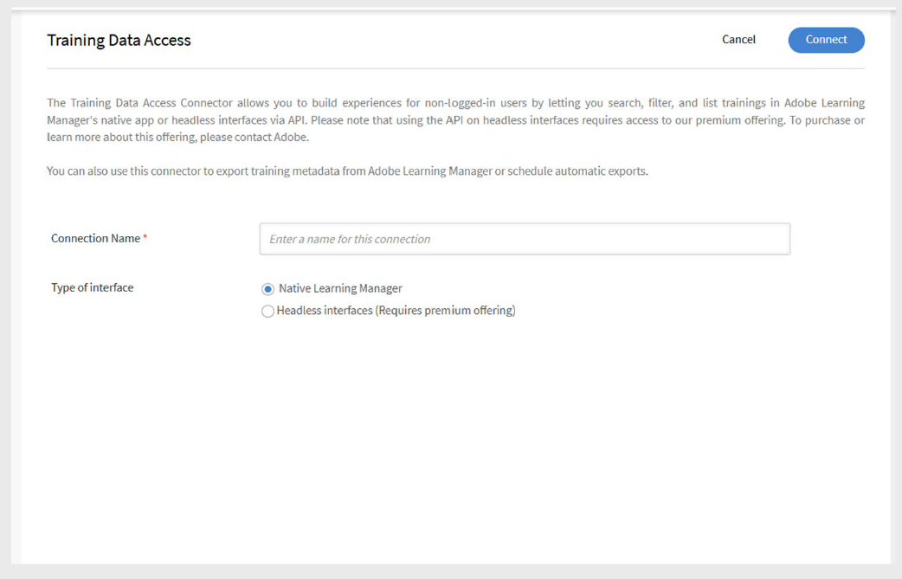

# Connector für den Zugriff auf Schulungsdaten in Adobe Learning Manager

## Einführung

Mit dem **Schulungsdatenzugriffsconnector** können Sie ein Headless-Lernerlebnis erstellen, das eigenständig oder in eine benutzerdefinierte Benutzeroberfläche integriert werden kann, die mit **Adobe Experience Manager (AEM) Sites** erstellt wurde. Mit diesem Connector können Sie aktuelle Schulungsinhalte für Teilnehmer mit Such- und Filterfunktionen abrufen und anzeigen.

>[!IMPORTANT]
>
>- Diese Funktion ist nur verfügbar, wenn Adobe Learning Manager als **Add-on** an Adobe Experience Manager verkauft wird.
>- Über diesen Connector abgerufene Kursdaten werden alle 24 Stunden aktualisiert
>- Dieser Connector ist nicht eigenständig für die Erstellung einer Headless- oder AEM-basierten, nicht angemeldeten Experience. Wenden Sie sich an Adobe, um den richtigen Ansatz für Ihren Anwendungsfall zu planen.

## Funktionsweise

Sobald der Connector aktiviert ist, stellt Adobe Learning Manager eine Reihe öffentlicher APIs bereit, die Schulungsmetadaten wie Kurse, Lernpfade und Zertifikate bereitstellen. Sie können diese APIs verwenden, um ein benutzerdefiniertes Frontend mit Branding zu erstellen, das Schulungsinhalte anzeigt und Such- und Filterfunktionen unterstützt.

## Konfigurieren Sie den Connector für den Zugriff auf Schulungsdaten

Sie können Adobe Learning Manager mit Ihrem Datenspeicher- und Suchsystem integrieren, um Schulungsmetadaten auf AEM Sites oder andere Headless-Erlebnisse zu übertragen.

Konfigurieren des Connectors:

1. Melden Sie sich bei Adobe Learning Manager als Integrationsadministrator an.
2. Bewegen Sie den Mauszeiger über die Kachel **Trainingsdatenzugriff** und wählen Sie **Verbinden** aus.

   
   _Wählen Sie Verbinden aus, um den Schulungsdatenzugriffsconnector zu konfigurieren_

3. Geben Sie einen **Verbindungsnamen** ein.
4. Wählen Sie den **Schnittstellentyp** aus:

   - **Nativer Lern-Manager**: Standard-Anmeldeerlebnis, standardmäßig verfügbar.
   - **Headless-Schnittstellen**: Premium-Option, die öffentliche APIs für ein nicht angemeldetes, Headless-Frontend verfügbar macht.

   
   _Geben Sie die erforderlichen Details für die Konfiguration des Schulungsdatenzugriffskonnektors ein_

5. Wählen Sie **Verbinden**. Adobe Learning Manager generiert die **Basis-URL** und die **CDN-URL** automatisch. Sie verwenden diese URLs auf Ihrer benutzerdefinierten Website oder App, um Schulungsdaten abzurufen.

>[!NOTE]
>
>Kunden mit dem Premium-Abo erhalten eine andere API-URL als Standardkunden.

## Schulungsmetadaten exportieren

So exportieren Sie Schulungsmetadaten:

1. Wählen Sie auf der Connector-Seite **Schulungsmetadaten exportieren** aus.
2. Wählen Sie **Export von Schulungsmetadaten über diese Verbindung aktivieren**, um die Übertragung Ihrer Schulungsdaten an das Such- und Abrufsystem zu starten.
3. Wählen Sie **Zeitplan aktivieren** und legen Sie das Startdatum, die Startzeit und das Intervall fest.

   
   _Export für Schulungsmetadaten planen_

4. Wählen Sie **Speichern**.

   - Dadurch werden automatisch alle Kurs-, Lernpfad- und Zertifikatbilder auf das **CDN** hochgeladen.
   - Außerdem werden die zugehörigen Metadaten in Ihr Suchsystem exportiert.

### On-Demand-Exporte

- **Exporte nach Bedarf ausführen:** Wechseln Sie zu **On Demand**, legen Sie das **Startdatum** fest und wählen Sie **Ausführen**, um bei Bedarf einen Export auszuführen.
- **Ausführungsstatus überprüfen:** Zeigen Sie den Exportfortschritt und den Verlauf auf der Seite **Ausführungsstatus** an.

## Website in AEM erstellen und veröffentlichen

Anzeigen von Schulungsdaten auf einer Headless- oder AEM Sites-basierten Website:

1. **Installieren Sie das AEM** aus dem GitHub-Repository von [Adobe](https://github.com/adobe/adobe-learning-manager-reference-site/releases/tag/1.0.0) (Voraussetzung).
2. Verwenden Sie die **Basis-URL**, die **CDN-URL**, die **Client-ID**, den **Client-Schlüssel** und das **Admin-Aktualisierungstoken**, um eine Konfiguration in AEM zu erstellen.
3. Erstellen Sie die Site mithilfe von AEM.
4. Publish ist die Website für Teilnehmer.
5. Ausführliche Informationen zur Einrichtung finden Sie in [diesem Artikel](https://experienceleague.adobe.com/de/docs/learning-manager/using/integration/aem-sites/adobe-learning-manager-integration-aem) und [diesem Artikel](https://experienceleague.adobe.com/de/docs/learning-manager/using/integration/aem-sites/integrate-aem-learning-manager).

### Teilnehmererlebnis

Sobald die Website live ist:

- Auf der Website werden alle **Kurse**, **Lernpfade** und **Zertifikate** angezeigt, die von Adobe Learning Manager über das Suchsystem abgerufen wurden.
- Teilnehmer, die **nicht angemeldet sind**, können Kursdetails durchsuchen und anzeigen.
- Wenn ein Teilnehmer auf die Registrierung für einen Kurs, einen Lernpfad oder ein Zertifikat klickt, wird er aufgefordert, sich **anzumelden**, um die Registrierung abzuschließen und die Schulung zu starten.

## Nicht angemeldeter Benutzer

Das nicht angemeldete Erlebnis ermöglicht es Ihnen, ein Echtzeit-Erlebnis für nicht angemeldete Benutzer zu erstellen. Beispielsweise dient ein nicht angemeldetes Erlebnis als Landingpage für Marketing-Kampagnen, um Anmeldungen zu fördern.

Das nicht angemeldete Erlebnis in Adobe Learning Manager kann mithilfe des Connectors **Training Data Access** konfiguriert werden. Der Connector bietet die folgenden Angebote:

- Standardangebot
- Premium-Angebot

### Standardangebot

Das Standardangebot besteht darin, die native Version von Adobe Learning Manager zu erstellen. Benutzer können ein Headless-Erlebnis erstellen, das nur zur Demonstration dient und nicht angemeldet ist. Das Headless-Erlebnis der Demonstration ist nicht skalierbar und sollte nicht in einer Produktionsumgebung verwendet werden.

### Premium-Angebot

Mit dem Premium-Angebot können Benutzer eine Headless-Schnittstelle erstellen, die vom **Training Data Access**-Connector konfiguriert wird. Dadurch können Benutzer Echtzeitdaten zu Kursen und Lernpfaddetails wie Name, Beschreibung, Autor, Kenntnisse, Dauer usw. abrufen. In Szenarien mit gemischtem Lernen erhalten Sie außerdem Sitzplatzbeschränkungen in Echtzeit, besetzte Plätze, Wartelistenbeschränkungen und Wartelistenzahlen. Kunden können diese APIs verwenden, um Such- und Filterfunktionen und eine vollständige Kurszusammenfassung für nicht angemeldete Teilnehmer zu erstellen.

Kunden können ein Premium-Abo erwerben, um dieses hochgradig skalierbare, nicht angemeldete Erlebnis zu ermöglichen.

>[!NOTE]
>
>Wenden Sie sich an das Support-Team oder den CSM, um das Premium-Abo zu erwerben.

Nachdem ein Benutzer ein Abo gekauft hat, aktiviert das CSM-Team das Premium-Abo für ihn. Mit dem Connector für den Zugriff auf Schulungsdaten können Benutzer ein nicht angemeldetes Erlebnis mit den zuvor genannten Funktionen einrichten.
