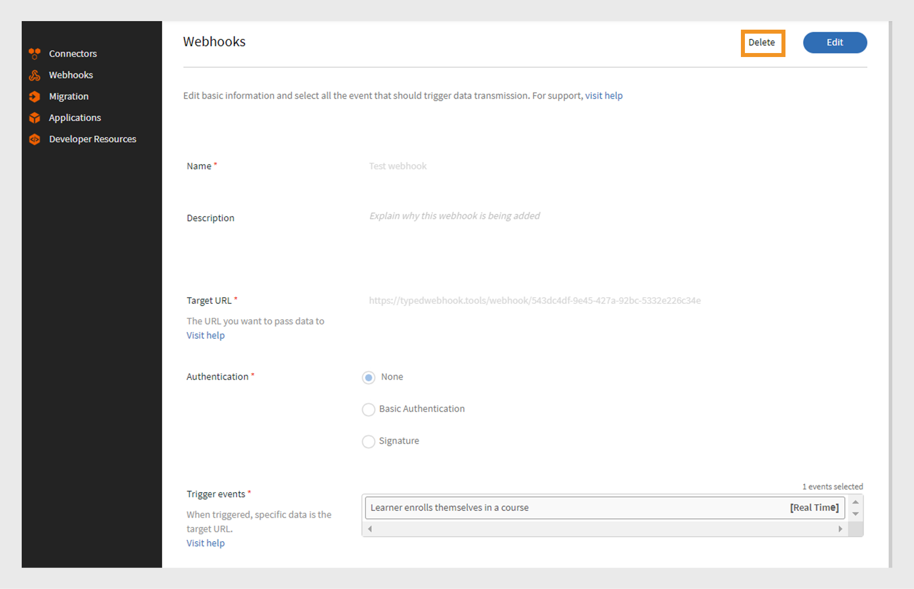

# Webhooks

Ein Webhook ermöglicht es einer Entität, automatisch Echtzeitdaten oder Benachrichtigungen an eine andere Entität zu senden, wenn ein bestimmtes Ereignis eintritt. Dadurch kann eine Anwendung anderen Anwendungen Informationen bereitstellen, ohne ständig danach zu fragen. Wenn ein Benutzer beispielsweise einen LMS-Kurs (Learning Management System) abschließt, kann ein Webhook diese Informationen automatisch an eine andere Plattform senden, z. B. ein CRM- oder Berichterstellungs-Tool. Webhooks werden häufig in Integrationen verwendet, um Prozesse zu automatisieren und die Notwendigkeit manueller Aktualisierungen zwischen Systemen zu reduzieren. Richten Sie Webhooks ein, indem Sie eine Rückruf-URL angeben, an die Sie die Daten senden würden.

## Webhooks und APIs

Webhooks und APIs helfen beiden Systemen dabei, miteinander zu kommunizieren, aber sie funktionieren auf unterschiedliche Weise. Bei APIs werden die Informationen nur freigegeben, wenn der Benutzer sie anfordert. Wenn ein Teilnehmer beispielsweise Kursfortschrittsdaten benötigt, sendet er eine Anforderung an die API, die dann die Informationen bereitstellt. Auf der anderen Seite senden Webhooks automatisch Daten, sobald ein Ereignis eintritt. Wenn ein Teilnehmer beispielsweise einen Kurs abschließt, sendet er die Daten sofort und ohne manuelle Anfragen an die Listener-URL.

## Was sind Echtzeit-APIs?

Mit Real-Time APIs können Anwendungen Daten sofort austauschen, wenn ein Ereignis eintritt. Im Gegensatz zu herkömmlichen APIs, die darauf warten, dass ein Benutzer Informationen anfordert, geben Echtzeit-APIs Daten in dem Moment frei, in dem sie auftreten. Webhooks fungieren als Echtzeit-API und helfen bei der sofortigen Freigabe der Daten, wenn das angegebene Ereignis eintritt. Die Echtzeit-API stellt sicher, dass diese Datenübertragung sofort erfolgt, ohne dass eine manuelle Anforderung erforderlich ist. So können die Systeme sofort aktualisiert werden.

## Webhook-Ereignisse

Webhook-Ereignisse sind bestimmte Aktionen in einem System, das automatisch Daten an eine Listener-URL sendet. Wenn sich ein Teilnehmer beispielsweise für einen Kurs registriert, wird ein Webhook-Ereignis ausgelöst, das die Registrierungsdetails an die Listener-URL sendet.

Webhook-Ereignisse werden in zwei Kategorien unterteilt:

* **Echtzeit-Ereignisse**: Ereignisse werden verarbeitet und in Echtzeit an eine Ziel-URL gesendet.
* **Nicht in Echtzeit stattfindende Ereignisse**: Ereignisse werden in Stapeln verarbeitet und zu bestimmten Zeiten gesendet anstatt in Echtzeit.

## Listener-URL

Eine Listener-URL ist ein Endpunkt oder ein Ziel, der bzw. das Dateninformationen empfängt, wenn ein Ereignis eintritt. Jedes Mal, wenn ein bestimmtes Ereignis eintritt, z. B. wenn sich ein Benutzer für einen Kurs registriert, sendet das System die Details automatisch ohne manuelle Anforderung an diese URL. Die Listener-URL ist die Adresse, an die alle diese Updates gesendet werden.
Webhook sendet die relevanten Informationen im JSON-Format. Hier ist eine Beispiel-Payload für ein Ereignis, das in Adobe Learning Manager ausgelöst wurde:

```
{
  "accountId": 1010,
  "events": [
    {
      "eventId": "d5fb7071-10a9-46b2-9f9e-79dde346c052",
      "eventName": "COURSE_ENROLLMENT_BATCH",
      "timestamp": 1727414643000,
      "eventInfo": "1727414643000-047210-84242-0",
      "data": {
        "userId": 4279332,
        "loId": "course:7374992",
        "loInstanceId": "course:7376092_10250977",
        "loType": "course",
        "enrollmentSource": "ADMIN_ENROLL",
        "dateEnrolled": 1727414643
      }
    }
  ]
}
```

## Webhooks erstellen und verwalten - Integrationsadministrator

Führen Sie die folgenden Schritte aus, um die Webhooks-Integration in Adobe Learning Manager zu erstellen:

1. Melden Sie sich als **[!UICONTROL Integrationsadministrator]** an.
2. Wählen Sie auf der Startseite **[!UICONTROL Webhooks]** > **[!UICONTROL Webhook hinzufügen]** aus.

   
   _Webhook hinzufügen_

3. Geben Sie **[!UICONTROL Name]** und **[!UICONTROL Beschreibung]** des Webhooks ein.
4. Geben Sie die Listener-URL als **[!UICONTROL Ziel-URL]** ein, an die Sie die Ereignisdaten übergeben möchten.
5. Wählen Sie eine der Authentifizierungsmethoden aus:
Die Authentifizierung in Webhooks ist eine Sicherheitsmethode, mit der sichergestellt wird, dass die an eine Listener-URL gesendeten Daten aus einer vertrauenswürdigen Quelle stammen.
   * **[!UICONTROL Keine]**: Keine Authentifizierung erforderlich.
   * **[!UICONTROL Basic]**: Dies ist eine auf Anmeldeinformationen basierende Authentifizierung. Geben Sie den Benutzernamen und das Kennwort ein.
   * **[!UICONTROL Signatur]**: Das System erstellt eine spezielle Signatur und fügt sie den Webhook-Daten hinzu. Der empfangende Server überprüft diesen Code, um sicherzustellen, dass die Daten echt sind und nicht geändert wurden. Generieren Sie eine Signatur und verwenden Sie sie für die Authentifizierung. Laden Sie die Signatur als JSON herunter.
6. Wählen Sie die Webhook-Ereignisse aus der Dropdown-Liste **[!UICONTROL Trigger-Ereignisse]** aus.

   >[!NOTE]
   >
   >Sie können die Webhooks auch testen, indem Sie die Option Webhooks testen auf der Seite Webhook hinzufügen auswählen.

7. Wählen Sie den Schalter **[!UICONTROL Aktivierungsstatus]** aus, um den Webhook zu aktivieren. Nach der Aktivierung werden die Daten bei jedem Auftreten der ausgewählten Ereignisse übergeben.

>[!NOTE]
>
>Sie können bis zu 5 Webhooks erstellen und verwalten.

### Webhooks bearbeiten - Integrationsadministrator

Führen Sie die folgenden Schritte aus, um Webhooks aus Adobe Learning Manager zu bearbeiten:

1. Melden Sie sich als **[!UICONTROL Integrationsadministrator]** an.
2. Wählen Sie auf der Startseite **[!UICONTROL Webhooks]** aus.
3. Wählen Sie den Webhook aus, den Sie bearbeiten möchten.

   
   _Webhook bearbeiten_
4. Wählen Sie **[!UICONTROL Bearbeiten]** aus, um die Details des Webhooks zu ändern, und wählen Sie **[!UICONTROL Speichern]** aus.

### Webhooks entfernen - Integrationsadministrator

Führen Sie die folgenden Schritte aus, um Webhooks aus Adobe Learning Manager zu bearbeiten:

1. Melden Sie sich als **[!UICONTROL Integrationsadministrator]** an.
2. Wählen Sie auf der Startseite **[!UICONTROL Webhooks]** aus.
3. Wählen Sie das webhook aus, das Sie löschen möchten.
4. Wählen Sie **[!UICONTROL Löschen]** aus, um die Webhooks zu entfernen.


_Webhook entfernen_

### Webhooks einstellen - Integrationsadministrator

Führen Sie die folgenden Schritte aus, um die Webhooks zu entfernen:

1. Melden Sie sich als **[!UICONTROL Integrationsadministrator]** an.
2. Wählen Sie auf der Startseite **[!UICONTROL Webhooks]** aus.
3. Wählen Sie den Webhook aus, den Sie bearbeiten möchten.
4. Wählen Sie **[!UICONTROL Bearbeiten]** aus und deaktivieren Sie den **[!UICONTROL Aktivierungsstatus]**, um den Webhook zu beenden.


_Webhook einstellen_

## Webhooks für Alternativen {#webhooks-for-alternates}

ALM bietet dedizierte Webhook-Ereignisse für alternative Abschlüsse, die Automatisierung, Integrationen und Synchronisation mit externen Systemen unterstützen.

Diese Ereignisse ermöglichen es externen Verbrauchern, zuverlässig zwischen direkten Abschlüssen und Abschlüssen zu unterscheiden, die durch alternative Beziehungen gewährt werden.

### Übersicht

Wenn ein Teilnehmer einen Kurs über eine Alternative oder Beziehung abschließt, löst ALM ein Webhook-Ereignis aus, das vom standardmäßigen Webhook für den Kursabschluss getrennt ist. Dadurch wird sichergestellt, dass Integrationen bei Bedarf unterschiedlich auf alternative Abschlüsse reagieren können.

Webhook-Ereignisse werden auch ausgelöst, wenn eine rückwirkende Fertigstellung oder eine rückwirkende Unvollständigkeit erfolgt, die historische Aktualisierungen sowie Beziehungsänderungen abdeckt.

### Webhook-Ereignisverhalten

* Ein unterschiedliches Webhook-Ereignis wird ausgelöst, wenn ein Teilnehmer über den Status &quot;Abgeschlossen&quot; über &quot;Alternativen&quot; für einen Zielkurs erhält.
* Das Ereignis wird generiert, wenn der Teilnehmer einen konfigurierten Quellkurs abschließt, der dem Ziel über eine alternative Beziehung entspricht.
* Dieser Webhook wird nicht für direkte Kursabschlüsse ausgelöst.
* Wenn der retroaktive Abschluss oder die retroaktive Unvollständigkeit aktiviert ist, werden Webhook-Ereignisse für jeden betroffenen Teilnehmer und jeden Zielkurs ausgegeben.

### Webhook-Nutzlastdetails

Die Webhook-Nutzlast mit alternativem Abschluss umfasst die folgenden Schlüsselattribute:

* **Teilnehmer-ID**
Identifiziert den Teilnehmer, der den alternativen Abschluss erhalten hat.
* **Quellkurs**
Der Kurs oder Lernpfad, den der Teilnehmer direkt abgeschlossen hat.
* **Zielkurs**
Der Kurs, der über die alternative Beziehung als abgeschlossen markiert ist.
* **Abschlussmethode**
Gibt an, dass die Abschlussmethode alternativ ist.
* **Abschlussdatum**
Abgeleitet vom Abschlussdatum des Quellkurses.
* **Beziehungstyp**
Gibt an, ob die Beziehung alternativ ist.

Bei Szenarien mit rückwirkender Nicht-Fertigstellung zeigen Webhook-Ereignisse an, dass eine vorhandene alternative Fertigstellung widerrufen wurde.

### Überlegungen zur Integration

Externe Systeme können die folgenden Webhook-Ereignisse verwenden, um:

* Teilnehmerdatensätze aktualisieren
* Abschlussstatus synchronisieren
* Auslösen von Benachrichtigungen oder nachgeschalteten Workflows
* Audit-Verläufe für Compliance-Zwecke verwalten

Webhook-Verbraucher sollten ausdrücklich zwischen direkten und alternativen Abschlüssen unterscheiden.

Alternative Abschlüsse bieten keine Qualifikationen, Abzeichen und Gamification-Prämien. Die Rückmeldungen sollten in den nachgelagerten Systemen entsprechend behandelt werden.

## Webhooks für adaptive Lernpfade

### Einführung

Adobe Learning Manager stellt **Webhook-Ereignisse** bereit, die externe Systeme benachrichtigen, wenn der Abschlussstatus eines **Lernpfads (Lernprogramm)** aktualisiert wird. Auf diese Weise können Sie Downstream-Systeme (wie HR-, Reporting- oder Analyseplattformen) synchronisieren, wenn der Abschlussdatensatz eines Teilnehmers zurückgesetzt oder neu berechnet wird.

Es sind zwei neue Webhook-Ereignistypen verfügbar:

**LEARNING_PATH_COMPLETION_ROLLBACK** - Wird ausgelöst, wenn ein **Teilnehmer** den Abschlussstatus eines Lernpfads für sich selbst aktualisiert.

**LEARNING_PATH_COMPLETION_ROLLBACK_BATCH** - Wird ausgelöst, wenn ein **Administrator** den Abschlussstatus eines Lernpfads für **einen oder mehrere Teilnehmer** aktualisiert (z. B. über Massenvorgänge).

Diese Ereignisse verwenden eine **allgemeine Nutzlaststruktur** und können von Ihrem Webhook-Endpunkt verwendet werden, um Abschlussdaten auf Ihrer Seite zu aktualisieren oder erneut zu verarbeiten.

### Gemeinsame Nutzlaststruktur

Jede Webhook-Anforderung enthält die folgende Struktur der obersten Ebene:

```
{
  "accountId": 69735,
  "events": [
    {
      "eventId": "757b9d58-048c-4ae2-9fff-35f9def7ef29",
      "eventName": "LEARNING_PATH_COMPLETION_ROLLBACK",
      "timestamp": "2026-01-20T05:48:10.000Z",
      "eventInfo": "1768888090000-197513-137581-0",
      "data": {
        "userId": 13446697,
        "loId": "learningProgram:157165",
        "loInstanceId": "learningProgram:157165_148769",
        "loType": "learningProgram",
        "enrollmentSource": "SELF_ENROLL",
        "dateEnrolled": "2026-01-20T05:44:05.000Z"
      }
    }
  ]
}
```

Die **gleiche Struktur** wird für beide Ereignistypen verwendet. Nur eventName und die Werte in den Daten (z. B. userId, loId, enrollmentSource) unterscheiden sich.

#### Beispiel: Teilnehmerinitiierte Aktualisierung

Wenn ein Teilnehmer den Abschlussstatus seines eigenen Lernpfads aktualisiert, sendet der Webhook ein LEARNING_PATH_COMPLETION_ROLLBACK-Ereignis:

```
{
  "accountId": 69735,
  "events": [
    {
      "eventId": "757b9d58-048c-4ae2-9fff-35f9def7ef29",
      "eventName": "LEARNING_PATH_COMPLETION_ROLLBACK",
      "timestamp": "2026-01-20T05:48:10.000Z",
      "eventInfo": "1768888090000-197513-137581-0",
      "data": {
        "userId": 13446697,
        "loId": "learningProgram:157165",
        "loInstanceId": "learningProgram:157165_148769",
        "loType": "learningProgram",
        "enrollmentSource": "SELF_ENROLL",
        "dateEnrolled": "2026-01-20T05:44:05.000Z"
      }
    }
  ]
}
```

Verwenden Sie dieses Ereignis, um **Teilnehmerabschlussdaten** in Ihren externen Systemen neu zu berechnen oder zurückzusetzen, wenn der Teilnehmer explizit eine Aktualisierung anfordert.

#### Beispiel: Vom Administrator initiierte Batch-Aktualisierung

Wenn ein Administrator eine Abschlusserneuerung für einen oder mehrere Teilnehmer durchführt (z. B. wenn historische Abschlüsse für eine Gruppe korrigiert werden), gibt der Webhook ein LEARNING_PATH_COMPLETION_ROLLBACK_BATCH-Ereignis aus:

```
{
  "accountId": 69735,
  "events": [
    {
      "eventId": "757b9d58-048c-4ae2-9fff-35f9def7ef29",
      "eventName": "LEARNING_PATH_COMPLETION_ROLLBACK_BATCH",
      "timestamp": "2026-01-20T05:48:10.000Z",
      "eventInfo": "1768888090000-197513-137581-0",
      "data": {
        "userId": 13446698,
        "loId": "learningProgram:157166",
        "loInstanceId": "learningProgram:157166_148770",
        "loType": "learningProgram",
        "enrollmentSource": "ADMIN_ENROLL",
        "dateEnrolled": "2026-01-21T05:44:05.000Z"
      }
    }
  ]
}
```

Bei Batchvorgängen erhält der Webhook-Endpunkt möglicherweise **mehrere Ereignisobjekte in einer einzelnen Anforderung**, eines pro Teilnehmer, dessen Abschluss aktualisiert wurde. Ihre Integration sollte das Ereignis-Array überlappen und jedes Ereignis unabhängig voneinander verarbeiten.

### Verwendung dieser Ereignisse in Integrationen

Sie können die folgenden Webhook-Ereignisse verwenden, um:

**Synchronisieren Sie Abschlussdatensätze** mit externen LMS/LRS-, HR- oder Berichtssystemen, wenn ein Abschluss zurückgesetzt oder neu berechnet wird.

**Downstream-Workflows auslösen**, z. B. Neuzuweisungen, Benachrichtigungen oder Neuberechnung von Zertifizierungen und Abzeichen.

**Audit-Protokolle verwalten** durch Protokollierung von eventId, timestamp und eventInfo zusammen mit den Kennungen für Teilnehmer und Lernpfad.

Ihr Webhook-Handler sollte mindestens:

Nutzlast- und Analyseereignisse überprüfen [].
Verwenden Sie eventName, um festzustellen, ob die Änderung **learnerinitiiert** oder **admin/batchinitiiert** war.

Verwenden Sie userId, loId und loInstanceId, um den entsprechenden Datensatz in Ihrem System zu suchen und zu aktualisieren.
Nutzen Sie eventId, um eine doppelte Verarbeitung zu verhindern, wenn dasselbe Ereignis mehr als einmal übermittelt wird.

## Webhooks zum Hinzufügen und Entfernen von Benutzergruppenmitgliedschaften

Zwei neue Webhook-Ereignistypen tragen den endgültigen Status:

* ANTWORT :ASYNCAPI_USERGROUP_USER_ADDED
* ANTWORT :ASYNCAPI_USERGROUP_USER_REMOVED

### Beispiel-Nutzlast

```
{
  "accountId": 69735,
  "events": [
    {
      "eventId": "cd2972c8-cb15-47a0-a23f-e4a16cb720f5",
      "eventName": "RESPONSE:ASYNCAPI_USERGROUP_USER_REMOVED",
      "timestamp": "2026-03-18T13:38:12.000Z",
      "eventInfo": "cd2972c8-cb15-47a0-a23f-e4a16cb720f5",
      "data": {
        "status": "SUCCESS",
        "request": {
          "metadata": { "event_id": "cd2972c8-cb15-47a0-a23f-e4a16cb720f5" },
          "data": [ { "type": "user", "id": "13446641" } ]
        }
      }
    }
  ]
}
```

### Schlüsselelemente

* `accountId` identifiziert das ALM-Konto.
* `events` ist ein Array von Ereignisobjekten.
* `eventId` stimmt mit der ursprünglichen asynchronen Anforderungskennung überein.
* `eventName` zeigt einen Vorgang zum Hinzufügen oder Entfernen an.
* `timestamp` zeigt die Abschlusszeit an.
* `data.status` meldet derzeit &quot;SUCCESS&quot; für erfolgreiche Stapel.
* `data.request` enthält die exakte Anforderung, die Sie gesendet haben.

Ihre Integration sollte in erster Linie `eventId` (oder `metadata.event_id`) und `status` umfassen.

### Beispiele

#### Asynchrones Hinzufügen von Benutzern

**Schritt 1. Führen Sie den asynchronen Aufruf** durch.

POST /primeapi/v2/async/userGroups/12345/users

```
{
  "metadata": {
    "event_id": "sync-2026-03-30T10:15:00Z-ug-12345",
    "sourceSystem": "HRIS",
    "batchId": "hr_2026_03_30_0001"
  },
  "data": [
    { "type": "user", "id": "11101219" },
    { "type": "user", "id": "11101220" }
  ]
}
```

**Schritt 2. Sofortige Antwort lesen**

```
{ "event_id": "sync-2026-03-30T10:15:00Z-ug-12345" }
```

Sie können diesen Auftrag jetzt als in Ihrem System übermittelt markieren.

**Schritt 3. Behandeln des Webhooks**

Beispiel für Webhook-Rückruf:

```
{
  "accountId": 69735,
  "events": [
    {
      "eventId": "sync-2026-03-30T10:15:00Z-ug-12345",
      "eventName": "RESPONSE:ASYNCAPI_USERGROUP_USER_ADDED",
      "timestamp": "2026-03-30T10:15:43.000Z",
      "data": {
        "status": "SUCCESS",
        "request": {
          "metadata": {
            "event_id": "sync-2026-03-30T10:15:00Z-ug-12345",
            "sourceSystem": "HRIS",
            "batchId": "hr_2026_03_30_0001"
          },
          "data": [
            { "type": "user", "id": "11101219" },
            { "type": "user", "id": "11101220" }
          ]
        }
      }
    }
  ]
}
```

Ein typischer Verbraucher wird

* Suchen Sie den internen Auftrag.
* Überprüfen Sie optional die Mitgliedschaft mit GET /userGroups/{id}/users.
* Markieren Sie den Auftrag als abgeschlossen.

#### Asynchrones Entfernen von Benutzern

Die Entfernung ist symmetrisch, wobei DELETE mit derselben Körperstruktur verwendet werden.

```
{
  "metadata": {
    "event_id": "sync-2026-03-30T11:00:00Z-ug-12345",
    "sourceSystem": "HRIS",
    "batchId": "hr_2026_03_30_0002"
  },
  "data": [ { "type": "user", "id": "11101219" } ]
}
```

Sofortige Reaktion:

```
{ "event_id": "sync-2026-03-30T11:00:00Z-ug-12345" }
```

Später kommt ein RESPONSE:ASYNCAPI_USERGROUP_USER_REMOVED-Webhook mit derselben eventId an.

Weitere Informationen finden Sie unter [Asynchrone öffentliche API für Benutzergruppenmitgliedschaft](/help/migrated/api-changes-alm.md#asynchronous-public-apis-for-user-group-membership).
