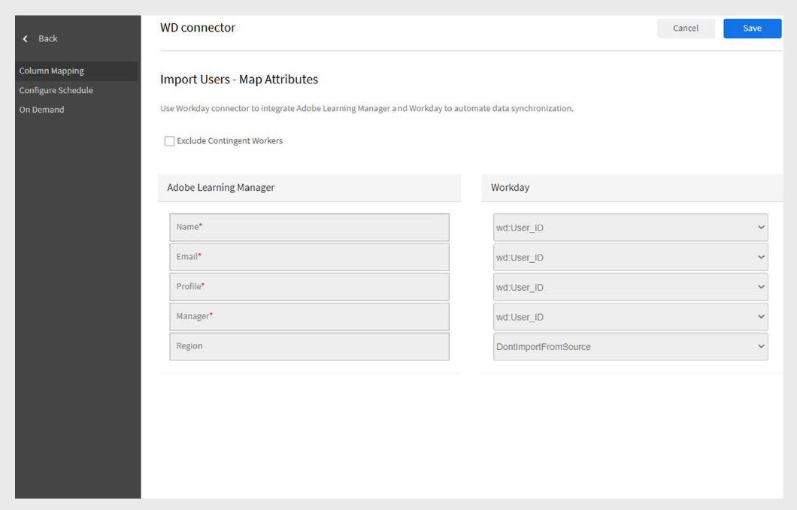

# Workday-Connector in Adobe Learning Manager

## Einführung

**Workday** ist ein Cloud-basiertes System, das Unternehmen bei der Verwaltung von Mitarbeiter- und Finanzdaten unterstützt. Es wird hauptsächlich für HR-Aufgaben wie Rekrutierung, Lohn- und Gehaltsabrechnung und Performance-Tracking verwendet. In Verbindung mit Adobe Learning Manager ermöglicht dies die automatische Synchronisation von Benutzer- und Kenntnisdaten zwischen den beiden Plattformen.

Mit dem Workday-Connector können Sie Adobe Learning Manager nahtlos in den Workday-Mandanten Ihrer Organisation integrieren. Diese Integration ermöglicht die automatische Synchronisation von Benutzerdaten und -kenntnissen zwischen den beiden Systemen, wodurch die Datengenauigkeit verbessert und der manuelle Aufwand reduziert wird.

## Wichtigste Vorteile

- Importieren von Benutzern aus Workday in Adobe Learning Manager.
- Ordnen Sie Attribute zwischen Workday und Adobe Learning Manager zu.
- Exportieren von Benutzerkenntnissen aus Adobe Learning Manager in Workday.
- Planen Sie die automatische Ausführung von Datensynchronisationsaufgaben.

## Voraussetzungen

Bevor Sie den Workday-Connector konfigurieren, erhalten Sie die folgenden Details von Ihrem Workday-Administrator:

- Host-URL
- Mandanten-ID
- Benutzername
- Kennwort

## Konfigurieren des Workday-Connectors

Sie können den Workday-Connector in Adobe Learning Manager so konfigurieren, dass Sie Benutzerdaten aus Workday importieren, Benutzerkenntnisse wieder in Workday exportieren und automatische Synchronisationen planen können, um beide Systeme auf dem neuesten Stand zu halten.

So konfigurieren Sie den Workday-Connector:

1. Melden Sie sich bei Adobe Learning Manager als Integrationsadministrator an.
2. Bewegen Sie den Mauszeiger über die Kachel **Workday** und wählen Sie **Verbinden** aus.

   
   _Konfigurieren Sie den Workday-Connector, um die Daten zu importieren und zu exportieren_

3. Geben Sie die folgenden Verbindungsdetails ein:
   - **Verbindungsname**: Ein Name Ihrer Wahl für die Verbindung.
   - **Host-URL**: Wird von Ihrem Workday-Administrator bereitgestellt.
   - **Mandant**: Interner Bezeichner von Ihrem Workday-Administrator.
   - **Benutzername und Kennwort**: Der Workday-Administrator erstellt einen integrierten Systembenutzer (ISU) mit den erforderlichen Sicherheitsberechtigungen und teilt diese dann mit dem Integrationsadministrator.

   
   _Fügen Sie die erforderlichen Details zum Konfigurieren des Workday-Connectors hinzu_

4. Wählen Sie **Verbinden**, um die Einrichtung abzuschließen.

>[!NOTE]
>
>Sie können mehrere Workday-Verbindungen in Ihrem Konto einrichten.

## Importieren von Benutzern aus Workday

### Attribute zuordnen

Sie können den Workday-Connector verwenden, um aktive Benutzer aus Ihrem Workday-Mandanten in Adobe Learning Manager zu importieren. Diese Integration optimiert die Benutzerverwaltung, indem Mitarbeiterdatensätze synchron gehalten werden. Zusätzlich zu Workday unterstützt Adobe Learning Manager auch Benutzerimporte aus anderen Datenquellen wie FTP und Salesforce.

Bevor Sie Benutzer importieren, müssen Sie Benutzerattribute zwischen Workday und dem Learning Manager zuordnen.

1. Navigieren Sie zur Seite **Übersicht** im Workday Connector.
2. Wählen Sie im Abschnitt **Import** die Option **Interne Benutzer**.

   
   _Interne Benutzer auswählen, um die Benutzerattribute zuzuordnen_

3. Verwenden Sie die Option **Attribute zuordnen**, um Felder zwischen den beiden Systemen zu verknüpfen:
   - Wählen Sie in der Spalte **Adobe Learning Manager** das entsprechende Adobe Learning Manager-Attribut aus.
   - Wählen Sie in der Spalte **Workday** im Dropdownmenü das entsprechende Workday-Attribut aus.

   
   _Zuordnen der Workday-Attribute zu Adobe Learning Manager-Feldern_

   >[!NOTE]
   >
   >Adobe Learning Manager unterstützt derzeit das Importieren von bis zu **69 Benutzerattributen** aus Workday. Sie können mit der Funktion **Aktive Felder** in Adobe Learning Manager zusätzliche Felder aktivieren. Wenden Sie sich an Ihren Customer Success Account Manager (CSAM), um benutzerdefinierte Workday-Attribute hinzuzufügen.

4. Aktivieren Sie das Kontrollkästchen **Bedingte Mitarbeiter ausschließen**, um das Importieren von temporären Mitarbeitern zu vermeiden.
5. Wenden Sie bei Bedarf Filter an, um z. B. Benutzer unter bestimmten Managern zu importieren.

>[!IMPORTANT]
>
>Stellen Sie sicher, dass UUID, E-Mail-Adresse und Name des Mitarbeiters eindeutig sind. Falsche oder doppelte Werte können Integrationsfehler verursachen.

## Unterstützte Workday-Attribute

Liste der unterstützten Workday-Attribute:

```
wd:User_ID wd:Worker_ID manager wd:Personal_Data.wd:Name_Data.wd:Preferred_Name_Data.wd:Name_Detail_Data.@wd:Formatted_Name wd:Personal_Data.wd:Name_Data.wd:Legal_Name_Data.wd:Name_Detail_Data.@wd:Formatted_Name wd:Personal_Data.wd:Name_Data.wd:Legal_Name_Data.wd:Name_Detail_Data.wd:Prefix_Data.wd:Title_Descriptor wd:Personal_Data.wd:Name_Data.wd:Preferred_Name_Data.wd:Name_Detail_Data.wd:Prefix_Data.wd:Title_Descriptor wd:Personal_Data.wd:Name_Data.wd:Preferred_Name_Data.wd:Name_Detail_Data.wd:First_Name wd:Personal_Data.wd:Name_Data.wd:Preferred_Name_Data.wd:Name_Detail_Data.wd:Last_Name wd:Personal_Data.wd:Name_Data.wd:Legal_Name_Data.wd:Name_Detail_Data.wd:First_Name wd:Personal_Data.wd:Name_Data.wd:Legal_Name_Data.wd:Name_Detail_Data.wd:Last_Name wd:Personal_Data.wd:Contact_Data.wd:Address_Data.0.@wd:Formatted_Address wd:Personal_Data.wd:Contact_Data.wd:Address_Data.0.wd:Postal_Code wd:Personal_Data.wd:Contact_Data.wd:Email_Address_Data.0.wd:Email_Address wd:Personal_Data.wd:Contact_Data.wd:Address_Data.0.wd:Country_Region_Descriptor wd:Personal_Data.wd:Contact_Data.wd:Phone_Data.0.@wd:Formatted_Phone wd:Personal_Data.wd:Contact_Data.wd:Phone_Data.0.wd:Country_ISO_Code wd:Personal_Data.wd:Contact_Data.wd:Phone_Data.0.wd:International_Phone_Code wd:Personal_Data.wd:Contact_Data.wd:Phone_Data.0.wd:Phone_Number wd:Personal_Data.wd:Primary_Nationality_Reference.wd:ID.1.$ wd:Personal_Data.wd:Gender_Reference.wd:ID.1.$ wd:Personal_Data.wd:Identification_Data.wd:National_ID.0.wd:National_ID_Data.wd:ID wd:Personal_Data.wd:Identification_Data.wd:Custom_ID.0.wd:Custom_ID_Data.wd:ID wd:User_Account_Data.wd:Default_Display_Language_Reference.wd:ID.1.$ wd:Role_Data.wd:Organization_Role_Data.wd:Organization_Role.0.wd:Organization_Role_Reference.wd:ID.1.$ wd:Employment_Data.wd:Worker_Job_Data.0.wd:Position_Data.wd:Position_Title wd:Employment_Data.wd:Worker_Job_Data.0.wd:Position_Data.wd:Business_Title wd:Employment_Data.wd:Worker_Job_Data.0.wd:Position_Data.wd:Business_Site_Summary_Data.wd:Name wd:Employment_Data.wd:Worker_Job_Data.0.wd:Position_Data.wd:Business_Site_Summary_Data.wd:Address_Data.@wd:Formatted_Address
wd:Employment_Data.wd:Worker_Job_Data.0.wd:Position_Data.wd:Job_Classification_Summary_Data.0.wd:Job_Classification_Reference.wd:ID.1.$ wd:Employment_Data.wd:Worker_Job_Data.0.wd:Position_Data.wd:Job_Classification_Summary_Data.0.wd:Job_Group_Reference.wd:ID.1.$ wd:Employment_Data.wd:Worker_Job_Data.0.wd:Position_Data.wd:Work_Space__Reference.wd:ID.1.$ wd:Employment_Data.wd:Worker_Job_Data.0.wd:Position_Data.wd:Job_Profile_Summary_Data.wd:Job_Family_Reference.0.wd:ID.1.$ wd:Employment_Data.wd:Worker_Job_Data.0.wd:Position_Data.wd:Job_Profile_Summary_Data.wd:Job_Profile_Name wd:Employment_Data.wd:Worker_Job_Data.0.wd:Position_Data.wd:Job_Profile_Summary_Data.wd:Job_Profile_Reference.wd:ID.1.$ wd:Employment_Data.wd:Worker_Job_Data.0.wd:Position_Data.wd:Business_Site_Summary_Data.wd:Address_Data.0.wd:Country_Reference.wd:ID.2.$ wd:Employment_Data.wd:Worker_Job_Data.0.wd:Position_Data.wd:Worker_Type_Reference.wd:ID.1.$ wd:Employment_Data.wd:Worker_Job_Data.0.wd:Position_Data.wd:Business_Site_Summary_Data.wd:Address_Data.0.@wd:Formatted_Address wd:Employment_Data.wd:Worker_Job_Data.0.wd:Position_Data.wd:Job_Profile_Summary_Data.wd:Management_Level_Reference.wd:ID.1.$ wd:Employment_Data.wd:Worker_Status_Data.wd:Active wd:Employment_Data.wd:Worker_Status_Data.wd:Active_Status_Date wd:Employment_Data.wd:Worker_Status_Data.wd:Hire_Date wd:Employment_Data.wd:Worker_Status_Data.wd:Original_Hire_Date wd:Employment_Data.wd:Worker_Status_Data.wd:Retired wd:Employment_Data.wd:Worker_Status_Data.wd:Retirement_Date wd:Employment_Data.wd:Worker_Status_Data.wd:Terminated wd:Employment_Data.wd:Worker_Status_Data.wd:Termination_Date wd:Employment_Data.wd:Worker_Status_Data.wd:Termination_Last_Day_of_Work wd:Organization_Data.wd:Worker_Organization_Data.0.wd:Organization_Data.wd:Organization_Code wd:Organization_Data.wd:Worker_Organization_Data.0.wd:Organization_Data.wd:Organization_Name wd:Organization_Data.wd:Worker_Organization_Data.0.wd:Organization_Data.wd:Organization_Type_Reference.wd:ID.1.$ wd:Organization_Data.wd:Worker_Organization_Data.0.wd:Organization_Data.wd:Organization_Subtype_Reference.wd:ID.1.$ wd:Qualification_Data.wd:Education.0.wd:School_Name wd:Qualification_Data.wd:External_Job_History.0.wd:Job_History_Data.wd:Job_Title wd:Qualification_Data.wd:External_Job_History.0.wd:Job_History_Data.wd:Company wd:Management_Chain_Data.wd:Worker_Supervisory_Management_Chain_Data.wd:Management_Chain_Data.0.wd:Manager.Employee_ID Primary Work Email wd:Organization_Type_Reference_Cost_Center_ID wd:Organization_Type_Reference_Cost_Center_Name wd:Organization_Type_Reference_Company wd:Organization_Subtype_Reference_Department
wd:Organization_Subtype_Reference_Division wd:Universal_ID wd:Employment_Data.wd:Worker_Job_Data.0.wd:Position_Data.wd:Business_Site_Summary_Data.wd:Address_Data.0.wd:Country_Region_Descriptor wd:Employment_Data.wd:Worker_Job_Data.0.wd:Position_Data.wd:Business_Site_Summary_Data.wd:Address_Data.0.wd:Country_Region_Reference.wd:ID.2.$ wd:Personal_Data.wd:Contact_Data.wd:Address_Data.0.wd:Municipality
```

## Benutzerkenntnisse in Workday exportieren

Sie können alle aktiven Benutzerkenntnisse aus Adobe Learning Manager in Workday exportieren. Eingestellte Qualifikationen werden nicht exportiert.

>[!IMPORTANT]
>
>- Versuchen Sie nicht, Kenntnisse gleichzeitig aus mehreren Adobe Learning Manager-Konten in dasselbe Workday-Konto zu exportieren.
>- Wenn mehrere Adobe Learning Manager-Konten dasselbe Workday-Konto verwenden, stellen Sie sicher, dass die Namen der Kenntnisse konsistent sind, um Konflikte zu vermeiden.

### Konfigurieren eines geplanten Exports

So konfigurieren Sie die geplanten Exporte:

1. Wählen Sie **Benutzerkenntnisse** aus, und wählen Sie dann **Zeitplan konfigurieren** auf der Seite **Workday-Übersicht** aus.

   
   _Benutzerkenntnisse auswählen, um den Export zu planen_

2. Aktivieren Sie das Kontrollkästchen **Export für die Benutzerkenntnisse über diese Verbindung aktivieren**.
3. Wählen Sie **Zeitplan aktivieren**.
4. Legen Sie das Startdatum, die Uhrzeit und das Wiederholungsintervall fest.

   
   _Konfigurieren Sie den Zeitplanexport im Workday-Connector_

5. Wählen Sie **Speichern** aus, um den Zeitplan anzuwenden.

### On Demand-Export

So erstellen Sie On-Demand-Exporte:

1. Wählen Sie **On Demand** auf der Seite **Workday Overview**.
2. Geben Sie das Startdatum ein, ab dem der Bericht beginnen soll.
3. Wählen Sie **Ausführen**, um den Bericht auszuführen.

### Ausführungsstatus anzeigen

1. Wechseln Sie zu **Ausführungsstatus**.
2. Zeigen Sie den Status aller Aufgaben an und laden Sie Fehlerberichte nach Bedarf herunter.

## Planung von Synchronisationsaufgaben

Sie können den Connector so konfigurieren, dass Datensynchronisierungsaufgaben automatisch ausgeführt werden:

- Planen Sie tägliche Benutzerimporte aus Workday in Learning Manager.
- Planen Sie den regelmäßigen Export von Benutzerkenntnissen in Workday.

>[!NOTE]
>
>Durch die Planung wird sichergestellt, dass Benutzerdatensätze und Qualifikationsdaten in beiden Systemen immer auf dem neuesten Stand sind.

## Zu beachtende Punkte

- Das in Workday ausgefüllte UUID-Feld kann von clientseitigen LMS-Administratoren nicht gelöscht werden.
- Die **Benutzerbereinigung**-Funktion unterstützt nur bis zu 50 Benutzer pro Ausführung. Seien Sie beim Importieren von Benutzern mit UUIDs vorsichtig.
- Kenntnisse werden auf der Kenntniselementebene in Workday unter Verwendung des Kenntnisnamens und der Kenntnisstufe aus Adobe Learning Manager zugeordnet.
