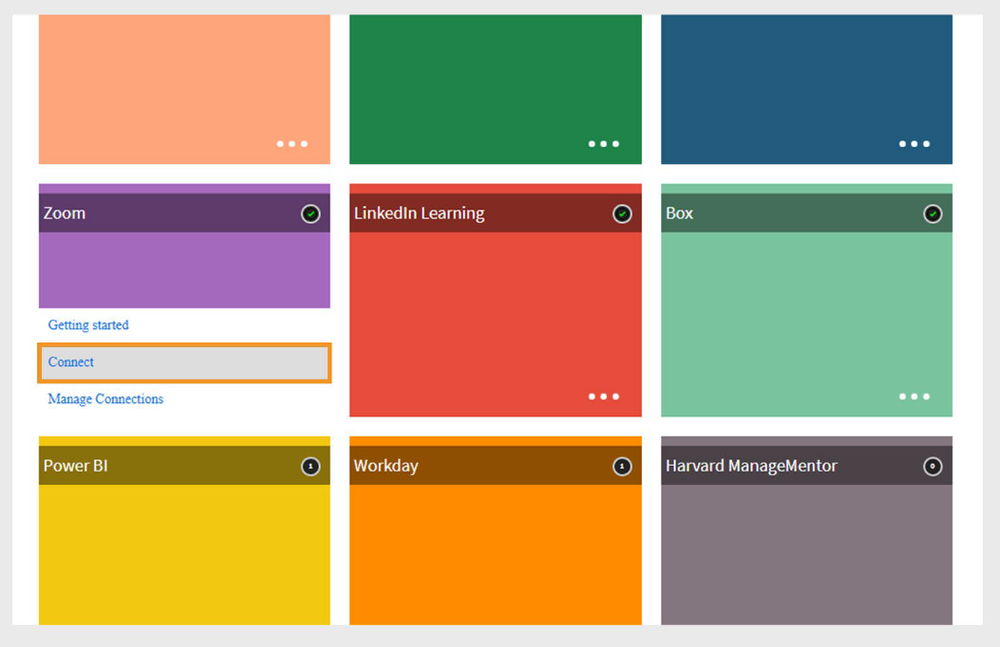

# Verbindung in Adobe Learning Manager zoomen

## Einführung

Die Zoom-Verbindung in Adobe Learning Manager ermöglicht die nahtlose Integration in Zoom, um virtuelle Live-Klassenzimmersitzungen bereitzustellen. Mit dieser Integration können Kursleiter Zoom-Meetings direkt über den Lernmanager hosten, Teilnehmer registrieren und die Anwesenheit und den Abschluss verfolgen. Teilnehmer erhalten automatisch Einladungen und können über ihre Adobe Learning Manager-Konten an Sitzungen teilnehmen. Nach der Sitzung werden die Anwesenheits- und Leistungsdaten wieder mit Adobe Learning Manager synchronisiert, um Berichte und Nachverfolgung zu erstellen.

## Einrichten der Zoom-Verbindung

So konfigurieren Sie die Zoom-Verbindung:

1. Melden Sie sich bei Adobe Learning Manager als Integrationsadministrator an.
2. Bewegen Sie den Mauszeiger über die Kachel **Zoom**.

   
   _Zoom-Verbindung in Adobe Learning Manager konfigurieren_

3. Wählen Sie **Verbinden**. Die Einrichtungsseite der Zoom-Verbindung wird geöffnet.
4. Geben Sie die folgenden Kontodetails in die entsprechenden Felder ein. Sie können diese Anmeldedaten von Ihrem Zoom-Kontoadministrator erhalten:

   * Name der Verbindung
   * Konto-ID zoomen
   * Client-ID
   * Client-Geheimnis
   * E-Mail-Adresse des Super-Administrators

   
   _Geben Sie die Konfigurationsdetails zum Einrichten der Zoom-Verbindung ein_

5. Wählen Sie **Verbinden**, um die Integration einzurichten.

>[!NOTE]
>
>Wenn Sie die Verbindung aktivieren, müssen **Teilnehmer die gleiche E-Mail-Adresse** für ihre Zoom- und Adobe Learning Manager-Konten verwenden, um sicherzustellen, dass die Benutzerdaten ordnungsgemäß synchronisiert werden.

## Zoom-Kurse erstellen

Sobald die Verbindung hergestellt ist:

1. Melden Sie sich als **Autor** an und erstellen Sie einen neuen Kurs für virtuelle Klassenzimmer.
2. Wählen Sie während der Kurserstellung **Zoom** als Konferenzsystem aus.
3. Weisen Sie dem Kurs Teilnehmer über Administratoren, Manager oder durch Selbsteinschreibung zu.
4. Nach der Registrierung erhalten die Teilnehmer eine E-Mail mit Kursdetails.
5. Teilnehmer können sich bei ihrem Adobe Learning Manager-Konto anmelden, um auf den Kurs zuzugreifen und an der Zoom-Sitzung teilzunehmen.

## Anwesenheit und Abschluss verfolgen

Nach dem Ende der virtuellen Sitzung:

* Adobe Learning Manager erhält automatisch den Abschlussstatus von Zoom.
* Administratoren können Anwesenheits- und Bewertungsberichte in Adobe Learning Manager anzeigen, um die Teilnahme und Leistung der Teilnehmer zu verfolgen.

## Erstellen einer Zoom-OAuth-Anwendung von Server zu Server

Um die Zoom-Verbindung mit Adobe Learning Manager verwenden zu können, müssen Sie eine Zoom-Server-zu-Server-OAuth-App erstellen und die erforderlichen Geltungsbereiche konfigurieren.

### Erforderliche OAuth-Geltungsbereiche

Stellen Sie beim Erstellen der Anwendung in Zoom sicher, dass die folgenden Bereiche ausgewählt sind:

| Was du willst | Dieses Schlüsselwort suchen | Dann wählen |
|---|---|---|
| Alle Benutzermeetings anzeigen | Versammlung | `meeting:read:meeting:admin, meeting:read:list_meetings:admin` |
| Alle Benutzermeetings anzeigen/verwalten | Versammlung | `meeting:update:meeting:admin, meeting:delete:meeting:admin, meeting:write:meeting:admin` |
| Berichtsdaten anzeigen | Bericht | `report:read:meeting:admin, report:read:user:admin` (Wählen Sie den Punkt aus, der Ihrem Endpunkt entspricht.) |
| Alle Benutzerinformationen anzeigen | Benutzer | `user:read:user:admin, user:read:list_users:admin` |
| Verwalten von Benutzenden | Benutzer | `user:update:user:admin, user:write:user:admin` |
| Meetingregistrierten hinzufügen | Registrant | `meeting:write:registrant:admin` |
| Alle Meetingteilnehmer auflisten | Registrant | `meeting:read:list_registrants:admin` |
| Unterkontensitzungen | Meeting + nach :master suchen | `meeting:write:meeting:master` |
| Bericht über Meetingteilnehmer | Teilnehmerin | `report:read:list_meeting_participants:admin` |

