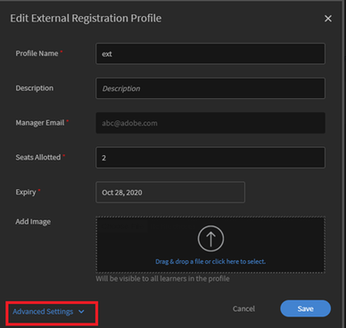

# Benutzer wird automatisch in Learning Manager gelöscht {#user-gets-auto-deleted-in-learning-manager}

## Problem

A **Anwender** wird aus dem Lern-Manager gelöscht, der Administrator hat jedoch nie eine solche Aktion ausgeführt.

## Ursache

In Adobe Learning Manager gibt es eine Option, mit der Sie Benutzer löschen können, wenn diese sich für eine bestimmte Zeit nicht im System angemeldet haben.

## Wie kann ich die Einstellung ändern/anwenden?

### Für interne Teilnehmer

1. Melden Sie sich als ein **Administrator** an.
1. Unter **Konfigurieren** auf **Einstellungen** > **Allgemein**.
1. Auf der Seite „Allgemeine Einstellungen“ finden Sie die Option **Interne Benutzer automatisch löschen**.
1. Klicken **[!UICONTROL Bearbeiten]** , um die Anzahl der Tage in das Feld einzugeben, um einen Teilnehmer automatisch zu löschen, wenn er nicht auf das System zugegriffen hat.

   

   *Anzahl der Tage bearbeiten*

>[!NOTE]
>
>   Lassen Sie das Feld leer, wenn Sie Benutzer nicht automatisch löschen möchten.

1. Klicken **[!UICONTROL Speichern]** , um die vorgenommenen Einstellungen beizubehalten.

### Für externe Teilnehmer:

1. Melden Sie sich als ein **Administrator** an.
1. Unter **Verwalten** auf **[!UICONTROL Benutzer]** > **[!UICONTROL Extern]**.
1. Klicken Sie auf den Namen eines externen Benutzers, auf den die Einstellung angewendet werden soll.

   Dadurch wird das Fenster **Externes Registrierungsprofil bearbeiten** geöffnet.

1. Klicken **[!UICONTROL Erweiterte Einstellungen]** in der linken unteren Ecke.

   

   *Wählen Sie die Option Erweiterte Einstellungen .*

1. Im Dialogfeld &quot; **Anmeldeanforderung** die Anzahl der Tage ein, nach denen Teilnehmer automatisch gelöscht werden, wenn sie nicht auf das System zugegriffen haben.
1. Klicken **[!UICONTROL Speichern]** , um die vorgenommenen Einstellungen beizubehalten.
