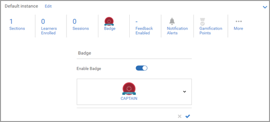

# Abzeichen kann nicht zugewiesen werden

## Problem

Auch nach Abschluss eines Kurses oder einer Schulung wird ein Abzeichen nicht wie erwartet vergeben.

## Beschreibung

Nachdem ein Teilnehmer einen Kurs/ein Lernprogramm/eine Zertifizierung abgeschlossen hat, wird das Abzeichen nicht an den Teilnehmer vergeben.

## Ursache

Das Abzeichen, das dem Lernobjekt zugewiesen ist, wird hinzugefügt, nachdem der Teilnehmer das Lernobjekt abgeschlossen hat.

In der früheren Version konnte später kein Abzeichen hinzugefügt werden, wenn zum Zeitpunkt des Abschlusses des Lernobjekts durch den Teilnehmer einem Lernobjekt kein Abzeichen zugewiesen war.

In aktuellen Versionen ist die Funktion verfügbar.

## Lösung

Wenn das Problem bei einem Teilnehmer auftritt, führen Sie die folgenden Schritte aus:

## Kurs/Lernprogramm

1. Melden Sie sich als Administrator an.

1. Öffnen Sie das entsprechende Lernobjekt (Kurs/Lernprogramm).

1. Klicken Sie auf **[!UICONTROL Instanzen]** > **[!UICONTROL Abzeichen]**.

   

1. Entfernen Sie das Abzeichen aus dem Lernobjekt und klicken Sie auf **[!UICONTROL Speichern]**.

   

1. Weisen Sie das Abzeichen dem Lernobjekt erneut zu und klicken Sie auf **[!UICONTROL Speichern]**.

   Bei diesem Schritt wird das Abzeichen allen Teilnehmern zugewiesen, die für das Lernobjekt registriert sind.

## Zertifizierung

1. Melden Sie sich als Administrator an.
1. Öffnen Sie die Zertifizierung.
1. Klicken Sie auf **[!UICONTROL Übersicht]** > **[!UICONTROL Abzeichen]**.
1. Entfernen Sie das Abzeichen aus der Zertifizierung und klicken Sie auf **[!UICONTROL Speichern]**.

   

1. Weisen Sie das Abzeichen der Zertifizierung erneut zu und klicken Sie auf **[!UICONTROL Speichern]**.
