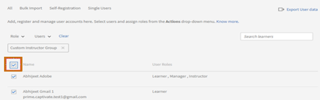

# Standardzuweisung von Kursleiterrollen zu Benutzergruppen in Learning Manager

## Problem

Allen Benutzern, die einer Sitzung zugewiesen sind, wird die Rolle eines Kursleiters zugewiesen.

## Beschreibung

Es gibt Szenarien, in denen eine Sitzung mehrere Kursleiter erfordern kann oder ein Administrator/Autor einer Sitzung eine Benutzergruppe zuweist. Dies führt dazu, dass allen Benutzern in der Benutzergruppe die Rolle eines Kursleiters zugewiesen wird.

## Ursache

Da Rollen während der Massenzuweisung von Benutzern in einer Benutzergruppe nicht verzweigt werden können, wird die Kursleiterrolle allen Benutzern zugewiesen.

## Lösung

Erstellen Sie benutzerdefinierte Benutzergruppen, um die Benutzerrollen zu filtern, die einer Sitzung zugewiesen sind. Führen Sie die folgenden Schritte aus, um die zugewiesenen Kursleiterrollen in einer Benutzergruppe zu entfernen:

1. Melden Sie sich als ein Administrator an. Klicken Sie im linken Bedienfeld auf **[!UICONTROL E-Mail-Vorlagen]**.
1. Um E-Mail-Trigger für die vorzunehmenden Änderungen zu vermeiden, klicken Sie auf **[!UICONTROL Alle deaktivieren]**.

   

1. Navigieren Sie zu **Benutzer** > **Benutzergruppe**. Klicken Sie auf **[!UICONTROL Hinzufügen]**.

   

1. Erstellen Sie im Fenster &quot;Benutzergruppe hinzufügen&quot; eine benutzerdefinierte Benutzergruppe wie folgt:

   * Geben Sie im Feld **[!UICONTROL Name]** ein.
   * Unter **[!UICONTROL Teilnehmer einschließen]** die Benutzergruppe hinzu, für die Sie die Kursleiter filtern möchten.
   * Unter **[!UICONTROL Teilnehmer ausschließen]** die Benutzer hinzu, für die Sie die Kursleiterrolle beibehalten möchten.

   

   Mit den obigen Schritten wird eine Liste von Benutzern erstellt, die dem Einbeziehungsset hinzugefügt werden sollen, und bestimmte Benutzer (Kursleiter), die im Ausschlussset erwähnt werden, werden entfernt.

1. Klicken **[!UICONTROL Speichern]** die vorgenommenen Änderungen.
1. Suchen Sie in der Datei &quot; **[!UICONTROL Benutzer]** > **[!UICONTROL Intern]**.

   

1. Aktivieren Sie das Kontrollkästchen, um alle Benutzer in der Gruppe auszuwählen.

   

1. Klicken **[!UICONTROL Aktionen]** > **[!UICONTROL Rolle entfernen]** > **[!UICONTROL Kursleiter entfernen]**.

Stellen Sie sicher, dass alle E-Mail-Trigger, die in Schritt 2 deaktiviert wurden, nach Abschluss erneut aktiviert werden.
