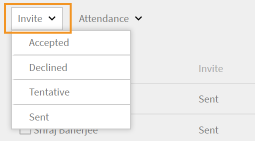

# Antwort des Teilnehmers auf eine Outlook-Kalendereinladung anzeigen am [!DNL Learning Manager]

Erfahren Sie, wie ein Administrator und ein Kursleiter die Antwort eines Teilnehmers auf eine Kalendereinladung anzeigen können.

Wenn sich ein Teilnehmer im Lern-Manager für eine virtuelle Klassen-/Klassenzimmersitzung in einem Kurs registriert, erhält der Teilnehmer eine detaillierte Einladung zu einem Outlook-Kalender.

Die Antwort eines Teilnehmers auf die Sitzungseinladung wird im Lern-Manager aufgezeichnet, und der Administrator und der Kursleiter können die Details anzeigen.

Wenn ein Teilnehmer mehrmals auf dieselbe Einladung antwortet, wird die neueste Antwort berücksichtigt und die vorherige überschrieben. Wenn die Sitzungszeiten geändert werden, werden alle Einladungsantworten gelöscht und die Teilnehmer müssen die Anfrage erneut beantworten.

## Aktivieren der Funktion zum Verfolgen von Einladungen und Antworten {#enablingtheinvitereplytrackingfeature}

* Wenden Sie sich an den Adobe Learning Manager Support , um die Funktion zum Nachverfolgen der Einladungen und Antworten zu aktivieren.
* Sobald die Funktion für das Konto aktiviert ist, können alle zukünftigen virtuellen Klassen-/Klassenzimmersitzungen, die von einem Autor erstellt werden, die Antwort des Teilnehmers auf die Kalendereinladung aufzeichnen.

Wenn Teilnehmer für eine virtuelle Klassen-/Klassenzimmersitzung registriert sind, die vor der Aktivierung der Funktion zum Verfolgen der Einladungs-Antwort erstellt wurde, werden die Antworten des Teilnehmers auf die Kalendereinladung nicht aufgezeichnet.

## Anzeigen von Einladungsantworten als Administrator {#viewinginviteresponsesasanadmin}

Wenn für eine virtuelle Klassen-/Klassenzimmersitzung die Funktion zum Verfolgen von Einladungen und Antworten aktiviert ist, kann der Administrator die Antworten des Teilnehmers auf die Einladung zusammen mit anderen Berechtigungen wie folgt anzeigen:

1. Klicken **[!UICONTROL Kurs]** im linken Navigationsbereich und zeigen Sie den Kurs an, der nach der Aktivierung der Funktion &quot;Einladungs-Antwort-Tracking&quot; erstellt wurde.
1. Klicken **[!UICONTROL Anwesenheit und Punktzahl]** im linken Navigationsbereich.
1. Um unten eine Tabelle mit den Namen der Teilnehmer und ihren Antworten auf die Kalendereinladung anzuzeigen, wählen Sie die Option **Instanz** und **[!UICONTROL Modul]** auf der Seite Anwesenheit und Punktzahl .
1. Verwenden Sie die **[!UICONTROL Einladen]** Filter zum Anzeigen von Teilnehmern basierend auf den folgenden Optionen: alle Antworten, akzeptiert, abgelehnt, vorläufig und gesendet

   

1. Um E-Mails nur an ausgewählte Teilnehmer zu senden, klicken Sie auf **[!UICONTROL Aktionen]** > **[!UICONTROL E-Mail an ausgewählte senden]** in der oberen rechten Ecke der Seite &quot;Anwesenheit und Punktzahl&quot;.

   Um E-Mails an alle Teilnehmer zu senden, die auf der Seite Anwesenheit und Punktzahl angezeigt werden, klicken Sie auf **[!UICONTROL Aktionen]** > **[!UICONTROL E-Mail an alle senden].**

1. Um einen CSV-Bericht mit den Sitzungsdetails des Teilnehmers herunterzuladen, der auf der Seite Teilnahme und Punktzahl angezeigt wird, klicken Sie auf **[!UICONTROL Aktionen]** > **[!UICONTROL Exportieren].**

## Anzeigen von Einladungsantworten als Kursleiter {#viewinginviteresponsesasaninstructor}

Wenn die Funktion zum Verfolgen der Antwort auf Einladungen für das Konto aktiviert ist, führen Sie die folgenden Schritte aus, um die Antworten des Teilnehmers auf die Kalendereinladung anzuzeigen:

1. Klicken **[!UICONTROL Bevorstehende Sitzungen]** im linken Navigationsbereich und wählen Sie einen Kurs aus.
1. Klicken **[!UICONTROL Teilnehmer]** im linken Navigationsbereich, um eine detaillierte Ansicht der Teilnehmer zu erhalten, die auf die Kalendereinladung geantwortet haben.
1. Verwenden Sie die **[!UICONTROL Einladen]** Filtern Sie die Namen der Teilnehmer nach folgenden Optionen: Akzeptiert, Abgelehnt, Vorsichtig und Gesendet

   

1. Anhand der angezeigten Teilnehmerinformationen können Sie E-Mails an die Teilnehmer senden.

   Um E-Mails nur an ausgewählte Teilnehmer zu senden, klicken Sie auf **[!UICONTROL Aktionen]** > **[!UICONTROL E-Mail an ausgewählte]**.

   Um E-Mails an alle Teilnehmer in der angezeigten Tabelle zu senden, klicken Sie auf **[!UICONTROL Aktionen]** > **[!UICONTROL E-Mail an alle]**.

   

