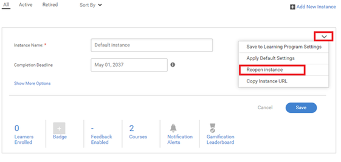

# Probleme beim Einstellen eines Lernprogramms

## Problem

Ein Lernprogramm wird automatisch eingestellt.

## Ursache

Es gibt Situationen, in denen ein Lernprogramm eingestellt wurde, ohne dass ein Administrator/Autor das Lernprogramm explizit eingestellt hat.

Dieses Problem tritt auf, weil ein Lernprogramm eine Sammlung von Kursen ist. Die Schulungen mit höherer Reihenfolge werden eingestellt, wenn einer der darin enthaltenen Kurse eine eingestellte Instanz enthält oder die Kursinstanz eingestellt wird.

## Auflösung

Um den Kurs zu überprüfen, der eine eingestellte Instanz enthält, führen Sie die folgenden Schritte aus:

1. Melden Sie sich als Administrator an und starten Sie das entsprechende Lernprogramm.

1. Klicken **[!UICONTROL Instanzen]** > **CKurse**. Auf der Seite werden alle Kurse aufgelistet, die Teil dieses Lernprogramms sind. Sie können den Kurs sehen, der eine eingestellte Instanz enthält.

   

   *Liste aller Kurse anzeigen*

1. Nachdem Sie die Kursinstanz gefunden haben, die eingestellt wurde, klicken Sie auf **[!UICONTROL Kurse]** > **[!UICONTROL Kurs öffnen]**.

1. Klicken **[!UICONTROL Instanzen]**. Klicken Sie in der eingestellten Instanz auf **[!UICONTROL Bearbeiten]** und ändern dann das Abschlussdatum in ein zukünftiges Datum, zu dem die Instanz eingestellt werden soll.

   

   *Bearbeiten des Abschlussdatums eines Kurses*

1. Klicken Sie nach Abschluss auf das Dropdown-Menü, wie in der Abbildung unten gezeigt. Klicken Sie anschließend auf **[!UICONTROL Instanz erneut öffnen]**.

   

   *Instanz eines Kurses erneut öffnen*

1. Besuchen Sie das entsprechende Lernprogramm. Klicken **[!UICONTROL Instanzen]** und führen Sie den vorherigen Schritt aus, um die Instanz des Lernprogramms erneut zu öffnen.
