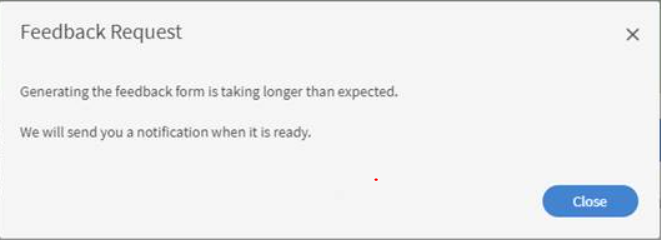

# Das automatische Popup mit L1-Feedback wird nicht angezeigt

## Ein Problem

Das automatische Popup mit L1-Feedback wird nach Abschluss des Kurses für einen Teilnehmer nicht angezeigt.

## Ursache

Manchmal kann es vorkommen, dass einem Teilnehmer das L1-Feedback nach Abschluss eines bestimmten Kurses nicht angezeigt wird oder er die folgende Meldung erhält:

*L1-Feedback kann nicht empfangen werden*

Dies kann aus folgenden Gründen passieren:

1. Das Feedback ist nicht für die Anzeige nach Kursabschluss festgelegt.
1. Erinnerungen sind deaktiviert.
1. Eine Erinnerung wird so geplant, dass sie nach einer bestimmten Zeit angezeigt wird.

## Lösung

1. Stellen Sie sicher, dass die Option &quot;Fragebogen sofort nach Kursabschluss anzeigen&quot; in **Kurs** > **Instanzen** > **L1-Feedback** aktiviert ist.
   <!---->
1. Navigieren Sie als Administrator zu **Einstellungen > Feedback**. Überprüfen Sie, für wann die Erinnerung geplant ist. Wenn Sie für **Nach Kursabschluss** geplant ist, ändern Sie die Option in **Bei Abschluss des Kurses**.
1. Aktivieren Sie die folgenden E-Mail-Vorlagen: **E-Mail-Vorlagen > Erinnerungen und Updates > Teilnehmer-Feedback für Kurs anfordern**. Falls die Option deaktiviert ist, aktivieren Sie sie und testen Sie sie dann.
1. Wenn die oben genannten Schritte nicht funktionieren, löschen Sie die Erinnerung unter **Administrator > Einstellungen > Feedback**. Erstellen Sie eine für „Bei Abschluss des Kurses“ und legen Sie die Wiederholung entsprechend den Anforderungen fest.
