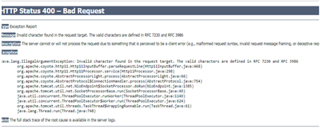

# E-Mail-Links, die von geänderten Vorlagen ausgelöst werden, führen zu einem Fehler in Learning Manager

## Problem

Ein Fehler tritt auf, nachdem Sie auf einen Link für eine automatische E-Mail/Begrüßungs-E-Mail/Einschreibungs-E-Mail geklickt haben.

**Fehler**

HTTP Status 400 - Bad request

## Ursache

Dies geschieht in der Regel, wenn die E-Mail-Vorlagen falsch angepasst wurden.

**Lösung**

Führen Sie die folgenden Schritte aus, um Fehler zu vermeiden, die durch beschädigte Links verursacht werden und aufgrund der Anpassung angezeigt werden können:

1. Melden Sie sich als ein Administrator an.
1. Klicken Sie im linken Bereich auf **[!UICONTROL E-Mail-Vorlagen]**.

1. Navigieren Sie zu der gewünschten Vorlage und klicken Sie darauf, um sie zu ändern.

   Dies öffnet das Fenster **Vorlagevorschau**.

   

   Beachten Sie die Punkte beim Bearbeiten einer E-Mail-Vorlage:

   * Es wird empfohlen, eine E-Mail-Vorlage in der Learning Manager-Oberfläche zu ändern.
   * Kopieren Sie die geänderte Vorlage in eine Notepad/Word-Datei, um eine Kopie der vorgenommenen Änderungen zu speichern.
   * Ersetzen Sie keinen dynamischen Text in der Vorlage, der blau hervorgehoben ist. Beispiel: &quot;**OrganizationName**&quot;, &quot;**Learner**&quot;, &quot;**Klicken Sie hier**&quot;, &quot;**CertificateName**&quot; usw.

1. Klicken Sie auf **[!UICONTROL Speichern]**, um die Änderungen an der Vorlage zu bestätigen.
1. Lösen Sie die E-Mail aus, um zu überprüfen, ob die Links wie erwartet funktionieren.
1. Setzen Sie die Einstellungen auf das Original zurück, indem Sie auf die Option **Auf Original zurücksetzen** für die geänderte Vorlage klicken.
