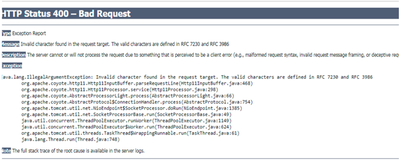

# E-Mail-Links, die von geänderten Vorlagen ausgelöst werden, lösen einen Fehler im Learning Manager aus

## Problem

Nach dem Klicken auf einen Link für eine automatisierte E-Mail/Begrüßungs-E-Mail/Registrierungs-E-Mail tritt ein Fehler auf.

**Fehler**

HTTP-Status 400 - Fehlerhafte Anforderung

## Ursache

Dies geschieht in der Regel, wenn die E-Mail-Vorlagen falsch angepasst wurden.

**Lösung**

Führen Sie die folgenden Schritte aus, um Fehler zu vermeiden, die durch beschädigte Links verursacht werden und aufgrund der Anpassung angezeigt werden können:

1. Melden Sie sich als Administrator an.
1. Klicken Sie im linken Bedienfeld auf **[!UICONTROL E-Mail-Vorlagen]**.

1. Navigieren Sie zur gewünschten Vorlage und klicken Sie auf , um sie zu ändern.

   Dadurch wird das Fenster &quot; **Vorlagenvorschau** &quot; anzuzeigen.

   

   Beachten Sie die Punkte beim Bearbeiten einer E-Mail-Vorlage:

   * Es wird empfohlen, eine E-Mail-Vorlage in der Lern-Manager-Oberfläche zu ändern.
   * Kopieren Sie die geänderte Vorlage und fügen Sie sie in eine Notepad/Word-Datei ein, um eine Kopie der vorgenommenen Änderungen zu speichern.
   * Vermeiden Sie es, dynamischen Text in der Vorlage zu ersetzen, der blau hervorgehoben ist. Beispiel: &quot;**OrganizationName**&quot;, &quot;**Teilnehmer**&quot;, &quot;**hier klicken**&quot;, &quot;**CertificateName**&quot; usw.

1. Klicken **[!UICONTROL Speichern]** , um die an der Vorlage vorgenommenen Änderungen zu bestätigen.
1. Lösen Sie die E-Mail aus, um zu überprüfen, ob die Links wie erwartet funktionieren.
1. Wiederherstellen der ursprünglichen Einstellungen durch Klicken auf die Option **Auf Original zurücksetzen** für die geänderte Vorlage aus.
