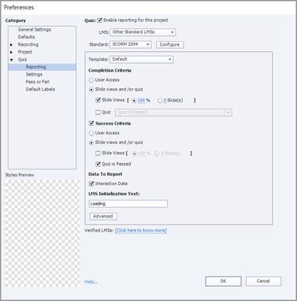

# Modul wird nach Kursabschluss in Adobe Learning Manager als unvollständig markiert

## Problem

Auch nachdem ein Teilnehmer einen Kurs in Adobe Learning Manager abgeschlossen hat, wird das Modul als unvollständig markiert.

## Ursache

SCORM 2004 definiert die Erfolgs- und Abschlusskriterien und sendet die Anweisungen für beide separat.

Geben Sie beispielsweise einen Inhaltssatz mit **Abschlusskriterien** von 100 % Folienansichten und **Erfolgskriterien** als &quot;Quiz bestanden&quot; an.

Ein Teilnehmer schließt den Kurs ab, besteht jedoch nicht das Quiz. In diesem Fall beträgt der Fortschritt 100 %, das Modul wird jedoch als unvollständig markiert, da der Teilnehmer das **Erfolgskriterium** nicht erfüllt.

## Lösung

Das Problem bezieht sich auf die **Voreinstellungen** zur Berichterstattung, die für das Projekt festgelegt sind. Der Autor muss die Kriterien für den Abschluss und den Erfolg des Kurses überprüfen.

Wenn Änderungen erforderlich sind, kann der Autor dies mit einem Werkzeug zum Erstellen von Inhalten tun, z. B. Adobe Captivate Classic. So kann der Autor das Modul entsprechend aktualisieren.

*Captivate Classic Reporting-Voreinstellungen anzeigen*
