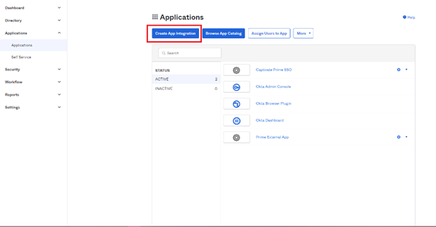
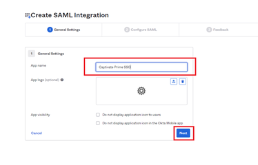

# Okta Active Directory-Integration in Adobe Learning Manager {#okta-active-directory-integration-with-adobe-learning-manager}

In diesem Dokument erfahren Sie, wie Sie den Adobe Learning Manager mit Okta Active Directory (AD) integrieren. Wenn Sie den Adobe Learning Manager mit Okta AD integrieren, können Sie:

* Überprüfen und steuern Sie den Zugriff von Learning Manager-Benutzern in Okta AD.
* Ermöglichen Sie den Benutzern die automatische Anmeldung bei Adobe Learning Manager über ihre Okta AD-Konten.
* Verwalten Sie Ihre Konten an einem zentralen Ort – dem Okta-Portal.

Adobe Learning Manager unterstützt einmaliges Anmelden (SSO) über Identitätsanbieter (IdP) und Serviceanbieter (SP).

## Anwendung in OKTA erstellen

1. Melden Sie sich bei Okta AD als Administrator an.
1. Klicken Sie auf **[!UICONTROL Anwendungen]**. Dadurch wird der Anwendungsspeicher in Okta geöffnet.

   

   *Anwendungsspeicher in Okta anzeigen*

1. Klicken **[!UICONTROL Appintegration erstellen]**.

   

   *Wählen Sie Appintegration erstellen .*

1. Auswählen **[!UICONTROL SAML 2.0]** im Fenster der neuen Programmintegration.

   

   *SAML2.0-Option auswählen*

1. Auswählen **[!UICONTROL SAML-Integration erstellen]** > **[!UICONTROL Seite &quot;Allgemeine Einstellungen&quot;]**. Geben Sie einen Anwendungsnamen ein.

   Beachten Sie, dass dies ein beliebiger Name sein kann, um Ihre Anwendung eindeutig zu identifizieren. Klicken Sie abschließend auf **[!UICONTROL Weiter]**.

   

   *Geben Sie den Namen der Anwendung ein*

1. Führen Sie auf der Seite „SAML-Einstellungen konfigurieren“ folgende Schritte aus:

   **Für die IdP-Einrichtung:**

   1. Geben Sie im Feld &quot;URL für einmalige Anmeldung&quot; diese URL ein: [https://learningmanager.adobe.com/saml/SSO](https://learningmanager.adobe.com/saml/SSO)
   1. Geben Sie im Feld &quot;Zielgruppen-URL&quot; die URL ein: [https://learningmanager.adobe.com](https://learningmanager.adobe.com/)
   1. Im Dialogfeld &quot; **Name ID Format** &quot; die Option **E-Mail Adresse**.
   1. Wählen Sie im Dropdownmenü **Anwendungsbenutzername** „Okta-Benutzername“ aus.
   1. Wenn Sie zusätzliche Attribute übergeben möchten, können Sie die Attribute unter **Attributanweisung** (optional) hinzufügen.

   

   *SAML-Attribute hinzufügen*

   **Für SP-Setup:**

   1. Geben Sie im Feld &quot;URL für einmalige Anmeldung&quot; diese URL ein: [https://learningmanager.adobe.com/saml/SSO](https://learningmanager.adobe.com/saml/SSO)
   1. Geben Sie im Feld &quot;Zielgruppen-URL&quot; die URL ein: [https://learningmanager.adobe.com](https://learningmanager.adobe.com/)
   1. Wählen Sie im Dropdownfeld „Namens-ID-Format“ **E-Mail-Adresse** aus.
   1. Wählen Sie im Dropdownmenü „Anwendungsbenutzername“ „Okta-Benutzername“ aus.
   1. Klicken Sie auf **Erweiterte Einstellungen anzeigen**.
   1. Wählen Sie unter **Signaturalgorithmus** RSA-SHA256 aus.
   1. Wählen Sie im **Assertionsalgorithmus** SHA256 aus.
   1. Wählen Sie im Dropdownfeld **Assertionsverschlüsselung** **Verschlüsselt** aus.

   1. Laden Sie unter der Option **Verschlüsselungszertifikat** die von Adobe freigegebene Zertifikatsdatei hoch.
   1. Wenn Sie zusätzliche Attribute übergeben möchten, können Sie die Attribute unter **Attributanweisung** (optional) hinzufügen.

   

   *Zusätzliche Attribute hinzufügen*

   Klicken Sie abschließend auf **[!UICONTROL Weiter]**.

1. Die **Feedback**  ist optional. Nachdem Sie die Optionen ausgewählt und Ihr Feedback abgegeben haben, klicken Sie auf **[!UICONTROL Fertigstellung]**.

   

   *SAML-Einrichtung abschließen*

## Vom IdP initiierte URL- und Metadatendatei extrahieren

Führen Sie die folgenden Schritte aus, um die vom IdP/SP initiierte URL- und Metadatendatei anzuzeigen:

1. Öffnen Sie die von Ihnen erstellte Anwendung.
1. Unter der Registerkarte **Single Sign-on** &quot; auf **[!UICONTROL Anweisungen anzeigen]**.

   

   *Registerkarte &quot;SSO&quot; auswählen*

   **Für IdP:**

   1. Die URL für die einmalige Anmeldung beim Identitätsanbieter ist die vom IdP initiierte URL.
   1. Kopieren Sie den gesamten Text, der sich unter dem **Optional** ein.
   1. Öffnen Sie ein neues Notepad-Dokument und fügen Sie den kopierten Text ein.
   1. Klicken **[!UICONTROL Datei]** > **[!UICONTROL Speichern unter]** > &quot;filename.xml&quot;. Dies ist die Metadatendatei.

   **Für SP:**

   1. Die URL für die einmalige Anmeldung beim Identitätsanbieter ist die vom IdP initiierte URL.
   1. Der Herausgeber des Identitätsanbieters ist die Entitäts-ID.
   1. Kopieren Sie den gesamten Text, der sich unter dem **Optional** ein.
   1. Öffnen Sie ein neues Notepad-Dokument und fügen Sie den kopierten Text ein.
   1. Klicken **[!UICONTROL Datei]** > **[!UICONTROL Speichern unter]** > **[!UICONTROL filename.xml]**. Dies ist die Metadatendatei.

   

   *SP-XML-Datei speichern*

   Sie müssen diese Datei im XML-Format speichern.

## Konfigurieren von Adobe Learning Manager-SSO

Um Adobe Learning Manager-SSO zu konfigurieren, führen Sie die im folgenden Artikel beschriebenen Schritte aus.

<!--

article not in TOC

[SSO Authentication](/help/migrated/kb/sso-authentication-for-learning-manager.md)
-->