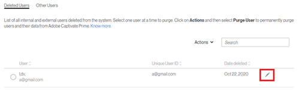

# Registrierung als externer Benutzer nicht möglich

## Problem

Externe Teilnehmer können sich nicht bei einem Profil registrieren.

## Fehler

Die E-Mail-ID ist bereits registriert. Bitte verwenden Sie eine andere E-Mail.

*Fehlermeldung einer bereits registrierten E-Mail*

## Beschreibung

Es gibt Szenarien, in denen ein Benutzer sich nicht bei einem externen Profil registrieren kann. Der Benutzer erhält den oben genannten Fehler während der Registrierung.

## Ursache

Dieses Problem tritt bei einem der folgenden Szenarien auf:

* Der Benutzer ist bereits bei einem anderen externen Profil registriert.
* Der Benutzer ist bereits ein interner Teilnehmer.
* Der Benutzer befindet sich in einem gelöschten Status.

## Lösung:

**Szenario 1:** Der Benutzer ist bereits bei einem anderen externen Profil registriert.

1. Melden Sie sich als ein Administrator an.
1. Klicken Sie unter **Verwalten** auf **[!UICONTROL Benutzer]** > **[!UICONTROL Extern]**.
1. Öffnen Sie das Profil, zu dem der Benutzer bereits gehört, indem Sie auf „Verwendete Lizenzen“ klicken

   

   *Profil von Benutzer öffnen*

1. Wählen Sie den Benutzer aus und klicken Sie auf **[!UICONTROL Aktionen]** > **[!UICONTROL Profil ändern]**.

   

   *Profil von Benutzer ändern*

   Daraufhin wird ein Fenster geöffnet, in dem Sie ein neues Profil auswählen können, wie unten zu sehen.

   

   *Benutzerprofil auswählen*

1. Klicken Sie nach der Auswahl auf **[!UICONTROL Ändern]**.

**Szenario 2:** Der Benutzer ist als interner Teilnehmer vorhanden.

1. Melden Sie sich als ein Administrator an.
1. Klicken Sie unter **Verwalten** auf **[!UICONTROL Benutzer]** > **[!UICONTROL Intern]**.
1. Klicken Sie, um ein Teilnehmerprofil zu öffnen, und klicken Sie auf das Symbol „Bearbeiten“.

   

   *Ein internes Teilnehmerprofil öffnen*

1. Ändern Sie die E-Mail-Adresse des Teilnehmers oder fügen Sie *_old* zur vorhandenen E-Mail-Adresse hinzu. Dadurch wird die E-Mail-Adresse freigegeben.

   Beispiel: Wenn die E-Mail-Adresse des Teilnehmers *<abc@adobe.com>ist,* ändern Sie sie in *<abc_old@adobe.com>*

1. Klicken Sie auf **Speichern**, um die vorgenommenen Änderungen beizubehalten.

**Szenario 3**: Der Benutzer befindet sich in einem gelöschten Status.

1. Melden Sie sich als ein Administrator an.
1. Klicken Sie unter **Verwalten** auf **[!UICONTROL Benutzer]** > **[!UICONTROL Benutzerbereinigung]**.
1. Wählen Sie den Teilnehmer aus und klicken Sie auf das Symbol „Bearbeiten“.

   

   *E-Mail-Adresse des Benutzers bearbeiten*

1. Ändern Sie die E-Mail-Adresse des Teilnehmers oder fügen Sie *_old* zur vorhandenen E-Mail-Adresse hinzu. Dadurch wird die E-Mail-Adresse freigegeben.

   Beispiel: Wenn die E-Mail-Adresse des Teilnehmers **<abc@adobe.com>** ist, ändern Sie sie in **<abc_old@adobe.com>**.
