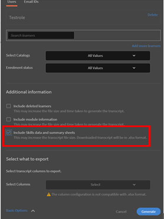

# Eine Kenntnis kann nach Abschluss eines Kurses nicht abgerufen werden

## Problem

Ein Teilnehmer erhält auch nach Abschluss eines Kurses keinen Kenntnisnachweis. Die Kenntnisse, die diesem Kurs zugewiesen sind, behalten für den Teilnehmer den Status **In Bearbeitung**.

## Ursache

Dieses Problem tritt auf, wenn der Wert für **Erforderliche Credits** zum Erreichen dieser Kenntnisse höher ist als der Wert **Verdiente Credits** des Teilnehmers nach Abschluss des Kurses.

## Lösung

Überprüfen Sie die aktuellen **Qualifikationsgutschriften** und **Punkt** erforderlichen Informationen, um die Qualifikation zu erreichen. Führen Sie die unten genannten Schritte aus:

1. Generieren Sie für den Teilnehmer einen Bericht **Teilnehmertranskript**.
1. Klicken Sie beim Generieren des Teilnehmertranskripts auf **[!UICONTROL Erweiterte Optionen]** und aktivieren Sie die Option **[!UICONTROL Kenntnisdaten und Zusammenfassungsblätter einschließen]**.

   

   *Wählen Sie die Option Qualifikationsdaten und Zusammenfassungsblätter einschließen*

1. Öffnen Sie den heruntergeladenen Teilnehmertranskriptbericht.
1. Navigieren Sie zur Seite **[!UICONTROL Kenntnistranskript]**. Hier können Sie **[!UICONTROL Erforderliche Credits]** und **[!UICONTROL Verdiente Credits]** für den Teilnehmer anzeigen.

   Im folgenden Beispiel sind zum Erlangen des Kenntnisnachweises für einen Kurs 50 Credits erforderlich. Der Teilnehmer hat jedoch nur einen Credit erzielt.

   

   *Erforderliche Credits anzeigen*

1. Um Credits zu überprüfen, die bestimmten Kenntnissen zugewiesen sind, melden Sie sich als Administrator an und navigieren Sie zur Registerkarte **Kenntnisse**, wie unten gezeigt:

   

   *Registerkarte &quot;Kenntnisse starten&quot;*

1. Um die Anzahl der einem Kurs zugewiesenen Credits zu überprüfen, melden Sie sich als Autor an und öffnen Sie den Kurs. Klicken Sie auf **[!UICONTROL Einstellungen]** > **Kurskenntnisse**, wie unten gezeigt:

   

   *Kurskenntnisse anzeigen*
