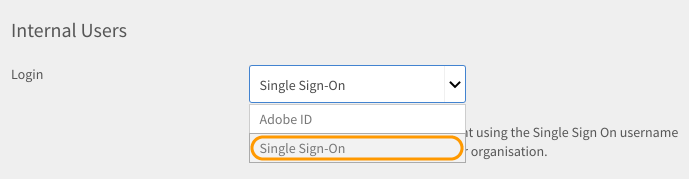

# Anmelden bei Learning Manager über die SSO-Authentifizierung

Dieses Dokument hilft Ihnen bei der Konfiguration der SSO-Authentifizierung für die Anmeldung bei Ihrem Learning Manager-Konto.

Führen Sie für die Konfiguration der SSO-Authentifizierung folgende Schritte durch:

1. Öffnen Sie **[!UICONTROL Einstellungen]** > **[!UICONTROL Anmeldungs-Methoden.]**

   

1. Wählen Sie je nach benötigter Option **[!UICONTROL Interne Benutzer]** oder **[!UICONTROL Externe Benutzer]**.
1. Klicken Sie auf das Dropdownmenü neben der Option **[!UICONTROL Anmeldung]** und wählen Sie **[!UICONTROL Single Sign-On]** aus.

   

1. Um die Einstellungen für Single Sign-On (SSO) anzupassen, klicken Sie auf **[!UICONTROL Ändern.]**

   

1. Geben Sie die von Ihrem Dienstanbieter angegebene **[!UICONTROL IDP-initiierte Authentifizierungs-URL]** ein und laden Sie Ihre XML-Datei hoch, indem Sie auf **[!UICONTROL IDP-Metadaten-XML-Datei]** klicken.

   

   Die SSO, die Sie in Learning Manager konfigurieren, muss SAML 2.0 unterstützen.

   Jetzt können Sie sich über die SSO-Authentifizierung bei Learning Manager anmelden.
