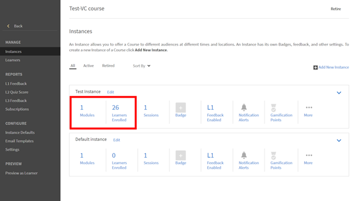

# Dateiübermittlungen können nicht in Adobe Learning Manager angezeigt werden

## Ein Problem

Ein Ausbilder kann die von einem Teilnehmer hochgeladenen Dateien nicht anzeigen.

## Beschreibung

Ausbilder können keine Dateien anzeigen, die Teilnehmer im **Einreichungsaktivitätsmodul** hochgeladen haben.

Beispielsweise hatte sich ein Teilnehmer für eine Instanz mit dem Namen **Testinstanz** eines Kurses, wie unten gezeigt:

*Instanz anzeigen*

Der Teilnehmer öffnet dann den Kurs und lädt eine Datei im Aktivitätsmodul hoch.

Wenn der Ausbilder versucht, die Übermittlung zu genehmigen, kann der Ausbilder dies nicht tun.

*Hochladen einer Datei im Aktivitätsmodul*

## Ursache

Wenn es in der Kursinstanz keinen Kursleiter gibt, bei dem sich der Teilnehmer registriert hat, wird das Problem angezeigt.

## Auflösung

Um zu überprüfen, ob der Kursinstanz ein Ausbilder hinzugefügt wurde, führen Sie die folgenden Schritte aus:

1. Navigieren Sie zu den Kurseinstellungen.
1. Im Dialogfeld &quot; **Verwalten** klicken Sie auf **[!UICONTROL Instanzen].**
1. Klicken Sie in der Instanz, in der sich der Teilnehmer registriert hat, auf **[!UICONTROL Sessions]**.

   

   *Sessions in der Instanz auswählen*

   Dieser Sitzung ist kein Kursleiter zugewiesen.

1. Klicken **[!UICONTROL Bearbeiten]**. Fügen Sie den Kursleiter hinzu, der die Dateiübermittlung genehmigt.

   

   *Kursleiter hinzufügen*
1. Speichern Sie die Änderungen.

