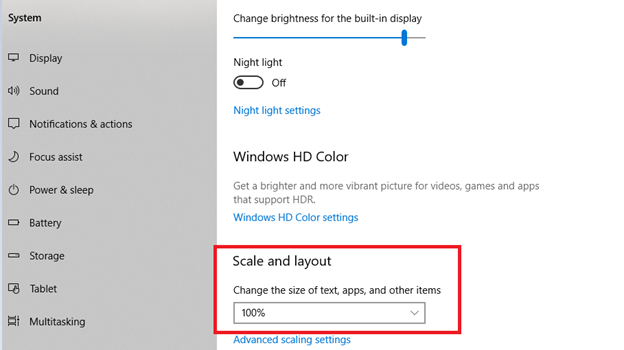

# Kalender kann nicht angezeigt werden

## Problem

Sie können den Kalender nicht anzeigen lassen, während Sie das Ablaufdatum eines externen Profils bearbeiten.

## Beschreibung

Wenn ein Administrator versucht, das Ablaufdatum eines externen Registrierungsprofils zu bearbeiten, und auf den Kalender klickt, um das Ablaufdatum zu bearbeiten, wird der Kalender nicht angezeigt.

## Ursache

Das Problem tritt aus folgenden Gründen auf:

* Der Zoomfaktor des Browsers beträgt mehr als 100 %.
* Die Skalierung und das Layout in den Anzeigeeinstellungen beträgt mehr als 100 %.

## Auflösung

### Browser

1. Starten Sie den Browser.
1. Melden Sie sich bei Adobe Learning Manager an.
1. Klicken Sie in der Adressleiste auf das Zoomsymbol.
1. Klicken Sie auf **[!UICONTROL Zurücksetzen]**.
1. Ändern Sie das Ablaufdatum des Registrierungsprofils.

### Anzeigeeinstellungen

1. Klicken **[!UICONTROL Start]** > **[!UICONTROL Einstellungen]** > **[!UICONTROL System]**.
1. Klicken Sie auf **[!UICONTROL Anzeige]**.
1. Verwenden Sie unter dem Abschnitt **[!UICONTROL Skalierung und Anordnung]** die Dropdownliste. Ändern Sie die Einstellungen zu 100 %.

   

   *Ändern der Anzeigeeinstellungen*

1. Starten Sie den Computer neu.
