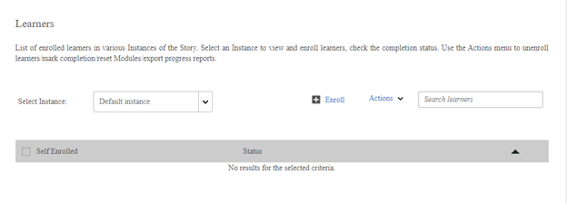

# Teilnehmer in einem Kurs können nicht angezeigt werden

## Problem

Sie können die Teilnehmer, die für einen Kurs registriert sind, nicht anzeigen lassen.

## Beschreibung

Die Registerkarte „Teilnehmer“ eines Kurses zeigt keine registrierten Teilnehmer an. Wenn Sie jedoch einen Bericht generieren, können Sie die registrierten Teilnehmer im Bericht anzeigen lassen.

*Kein Teilnehmer angezeigt*

## Ursache

Wenn sich ein Teilnehmer über ein höheres Lernobjekt (Lernprogramm oder Zertifizierung) registriert hat, wird der Teilnehmer auf der Registerkarte &quot;Teilnehmer&quot; des höheren Lernobjekts angezeigt. Der Teilnehmer kann nicht auf der Registerkarte &quot;Teilnehmer&quot; des Kurses gesucht werden.

**Wie kann ich sehen, bei welchem höheren Lernobjekt der Teilnehmer registriert ist?**

Sie können diese Informationen im Teilnehmertranskript überprüfen. Um das Teilnehmertranskript zu generieren, führen Sie die folgenden Schritte aus:

1. Melden Sie sich als ein Administrator an.
1. Klicken **[!UICONTROL Berichte]** > **[!UICONTROL Benutzerdefinierte Berichte]** > **[!UICONTROL Excel-Berichte]** > **[!UICONTROL Teilnehmertranskript]**.

1. Geben Sie den Namen des **[!UICONTROL Teilnehmer]** und geben Sie den Befehl **[!UICONTROL Datum]** Bereich.
1. Erweitern Sie den Abschnitt **[!UICONTROL Erweiterte Optionen]** und wählen Sie die Option **[!UICONTROL Modulebeneninformationen aktivieren]** aus.
1. Klicken Sie auf **[!UICONTROL Erstellen]**.

   Anhand des Teilnehmertranskripts können Sie sehen, bei welchem höheren Lernobjekt der Teilnehmer registriert ist.
