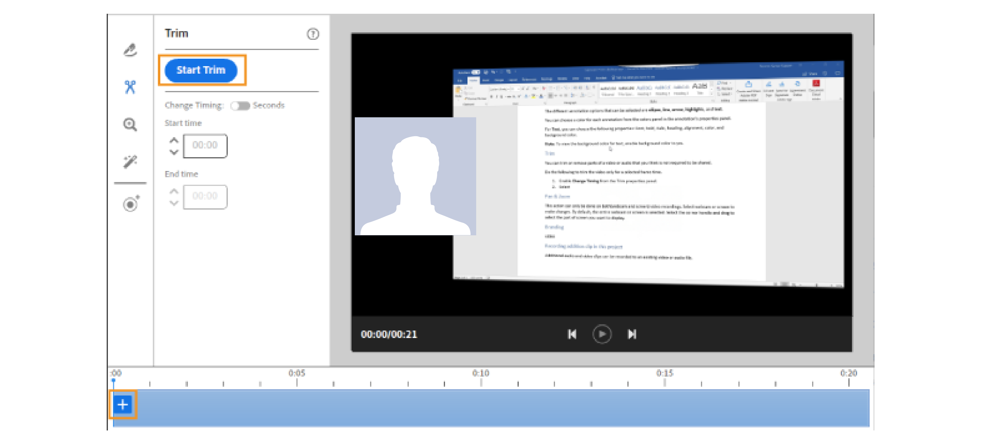

# Adobe Learning Manager-Desktop-Anwendung

Erfahren Sie, wie Sie die Desktop-Anwendung von Adobe Learning Manager verwenden, um Inhalte zu erstellen und anzureichern, die für Soziales Lernen freigegeben werden können.

Die Adobe Learning Manager-Desktop-Anwendung ist in erster Linie für Teilnehmende gedacht, die Soziales Lernen von Learning Manager verwenden. Nach der Installation auf einem Desktop können Teilnehmende Inhalte erstellen und diese in Learning Manager posten, um informelles, kollaboratives und soziales Lernen zwischen Kollegen zu erleichtern. Darüber hinaus stellt die Desktop-Anwendung auch sicher, dass Teilnehmende Benachrichtigungen für Soziales Lernen auf ihrem Desktop erhalten, auch wenn sie nicht unbedingt in der Webanwendung von Learning Manager angemeldet sind.

Teilnehmer können umfangreiche Inhalte wie Video, Audio und Screenshots erstellen und mit anderen Teilnehmern teilen. Dabei kann es sich um alles handeln - eine Software-Demo oder einen Kurzüberblick, eine Präsentation, einen Podcast oder einen kommentierten Screenshot von etwas, das geteilt werden kann.

Klicken Sie auf der Learning Manager-Webseite für Soziales Lernen auf „Neuer Beitrag“ und wählen Sie Videoaufzeichnung, Audioaufzeichnung, Erstellen eines Screenshots oder Learning Manager-Galerie, um die Desktop-Anwendung zu starten. Für weitere Informationen über Soziales Lernen [klicken Sie hier](feature-summary/social-learning-web-user.md).

Wenn Benutzende nicht über die Desktop-Anwendung verfügen, können Sie sie von der Adobe Learning Manager-Desktop-Seite herunterladen. Wenn Sie nicht den Download nicht durchführen können, [klicken Sie hier](../kb/troubleshooting-issues-with-adobe-learning-manager-desktop-app.md).

Nachdem die Benutzenden die Installation der Anwendung abgeschlossen haben, müssen sie sich mit ihren Learning Manager-Teilnehmer-Anmeldedaten anmelden. Die Startseite sieht wie der folgende Screenshot aus.

>[!NOTE]
>
>Teilnehmer können die Desktop-Anwendung nicht verwenden, wenn für ihr Konto Soziales Lernen deaktiviert ist.

<!---->
<!--*Home page*-->

## Video erstellen {#creatingavideo}

Die Desktop-Anwendung ermöglicht es einem Benutzer, Web, Bildschirm und beides aufzuzeichnen.

<!---->
<!--*Record web, screen, or both*-->

Führen Sie folgende Schritte aus, um ein Video aufzuzeichnen und auf der Web-Plattform für Soziales Lernen zu veröffentlichen:

1. Stellen Sie sicher, dass die Hardware- und Softwareanforderungen erfüllt sind. Siehe [Systemvoraussetzungen](../system-requirements.md) für Informationen.
1. Um eine Aufzeichnung über Soziales Lernen zu starten, wählen Sie das Symbol für die Videoaufzeichnung (Web, Bildschirm, beides), wodurch die Learning Manager-Desktop-Anwendung geöffnet wird. In der Desktop-Anwendung, bei der der Benutzer angemeldet ist, kann der Inhalt erstellt und anschließend veröffentlicht werden.
1. Um die Aufnahme von der Desktop-Anwendung aus zu starten, melden Sie sich mit Ihren Teilnehmer-Anmeldedaten für Learning Manager bei der Anwendung an.
1. Die Startseite wird angezeigt.
1. Um einen Beitrag zu erstellen, können Sie eine der drei Optionen auf der Startseite auswählen. Um das Aufnahmefenster zu starten, klicken Sie auf das Symbol „Video aufzeichnen“.
1. Wählen Sie wie gewünscht die Webcam, den Bildschirm oder beides.

   **Webcam** Die Webcam erfasst den Erzähler, der ein Projekt oder eine Anwendung mit Audio vorführt oder präsentiert. Wählen Sie aus den oben genannten Optionen das Webcam-Symbol aus, damit das Live-Fenster angezeigt wird.

   **Bildschirm** Zeichnen Sie die auf dem Bildschirm ausgeführten Aktionen auf. Durch Auswahl des Bildschirmsymbols erscheint ein Aufzeichnungsdialogfeld in der Mitte des Bildschirms.

   **Beide** Zeichnet sowohl die Erzähler- als auch die Bildschirmaktionen auf. Wenn Sie das letzte Symbol auswählen, wird der Bildschirm hervorgehoben und der Benutzer erhält ein Live-Fenster mit diesem Symbol.

1. Aufzeichnungseinstellungen festlegen

   **Kamera wählen** Klicken Sie auf das Videokamerasymbol unten im Videoaufzeichnungsfenster. Wählen Sie aus den angegebenen Optionen eine Kamera aus, die der Benutzer verwenden möchte.

   **Mikrofon auswählen** Klicken Sie auf das Mikrofonsymbol am unteren Rand des Video- oder Audiofensters und wählen Sie aus den angegebenen Optionen ein Mikrofon aus, das der Benutzer verwenden möchte.

   >[!NOTE]
   >
   >Wenn der Benutzer kein Audio mit Bildschirm oder Video aufnehmen möchte, wählen Sie die Option **Keine** aus der Dropdown-Liste aus, die beim Klicken auf das Audiosymbol angezeigt wird.
   >
   >Wenn Benutzer mit der Aufzeichnung ihres Bildschirms oder sich selbst beginnen, wird ein Popup-Dialogfeld mit der Frage angezeigt, ob sie ohne Audiounterstützung weiter aufnehmen möchten. Klicken Sie auf „Ja“, um fortzufahren.

1. Verwenden Sie die Aufnahmetaste, um die Aufnahme zu starten. Die Aufnahme beginnt nach dem Countdown (3 Sekunden).
1. Klicken Sie auf die Schaltfläche „Pause“ oder „Fortsetzen“, um die Aufnahme anzuhalten und bei Bedarf fortzusetzen. Informationen zum Bearbeiten der Aufnahme finden Sie unter [Bearbeiten einer Aufnahme](adobe-learning-manager-app-for-desktop.md#Editing) und zum Veröffentlichen siehe [Veröffentlichen einer Aufnahme](adobe-learning-manager-app-for-desktop.md#Publishing).

## Audio erstellen {#creatinganaudio}

<!---->
*Audio aufzeichnen*

So nehmen Sie Audio auf:

1. Klicken Sie im Startfenster der Learning Manager-Desktop-Anwendung auf das Symbol zur Audioaufzeichnung.
1. Stellen Sie sicher, dass die Mikrofonlautstärke aktiviert ist, indem Sie auf das Symbol für die Mikrofonlautstärke klicken und die Lautstärke anpassen.
1. Verwenden Sie die Schaltfläche „Aufzeichnen“, um die Aufnahme zu starten.
1. Wenn Sie mit der Audioaufnahme fertig sind, klicken Sie auf die Schaltfläche „Pause“, um die Aufnahme zu beenden.
1. Klicken Sie auf „Wiedergabe“, um eine Vorschau der Aufnahme anzuzeigen.
1. Wenn Benutzer zusätzliches Audio in derselben Datei aufnehmen möchten, klicken Sie auf **[!UICONTROL Fortsetzen]**. Sobald die gewünschte Aufzeichnung erreicht wurde, klicken Sie auf **[!UICONTROL Weiter]**, um die Datei an dem gewünschten Speicherort zu speichern. Die Aufzeichnung wird in der Adobe Learning Manager-App für die Desktop-Galerie gespeichert, in der Benutzer ihre Aufzeichnungen und Screenshots anzeigen können.
1. Informationen zum Bearbeiten der Aufnahme finden Sie unter [Bearbeiten einer Aufnahme](adobe-learning-manager-app-for-desktop.md#Editing) und zum Veröffentlichen siehe [Veröffentlichen einer Aufnahme](adobe-learning-manager-app-for-desktop.md#Publishing).

## Screenshot erstellen {#creatingascreenshot}

So machen Sie einen Screenshot:

1. Klicken Sie auf der Startseite der Learning Manager-Desktop-Anwendung auf das Screenshotsymbol.
1. Um nur einen Teil des Bildschirms zu erfassen, klicken Sie auf das Symbol für den Bildschirmausschnitt. Um den gesamten Bildschirm zu erfassen, klicken Sie auf das Symbol für den Vollbildmodus.

   <!--
   *Capture a screenshot*-->

1. Damit andere Teilnehmer die Präsentation oder den statischen Inhalt besser verstehen und beibehalten können, fügen Sie Anmerkungen zum Inhalt hinzu.
1. Um den Screenshot zu bearbeiten, [klicken Sie hier](adobe-learning-manager-app-for-desktop.md#Editing), und um einen Screenshot zu veröffentlichen [klicken Sie hier](adobe-learning-manager-app-for-desktop.md#Publishing).

## Bearbeiten eines Videos, eines Audios und eines Screenshots {#editing}

Sobald eine Datei gespeichert ist, wird das Bearbeitungsfenster sofort auf dem System angezeigt, in dem Aufnahmen mit den folgenden Optionen perfekt und professionell aussehen können:

## Anmerkungen (Videoaufnahmen und Screenshots) {#annotationsvideorecordingsandscreenshots}

Anmerkungen können für Videoaufnahmen und Screenshots verwendet werden, um bestimmte Details hervorzuheben oder Text zu schreiben, den andere Benutzer lesen können.

>[!NOTE]
>
>Für Video können Benutzer nur auf dem Bildschirm Anmerkungen hinzufügen.

* Die verschiedenen Annotationen, die ausgewählt werden können, sind **Ellipse**, **Line**, **Pfeil**, **Hervorheben** und **Text**.

* Wählen Sie eine Farbe für jede Anmerkung im Farbbedienfeld im Eigenschaftenbedienfeld der Anmerkung.
* Für **Text**, wählen Sie die folgenden Eigenschaften: Schriftart, fett, kursiv, Überschrift, Ausrichtung, Farbe und Hintergrundfarbe.

>[!NOTE]
>
>Um die Hintergrundfarbe für Text anzuzeigen, aktivieren Sie die Hintergrundfarbe, indem Sie „Ja“ wählen.

## Zuschneiden (alle Arten von Video- und Audioaufnahmen) {#trimalltypesofvideoandaudiorecordings}

Verwenden Sie zum Zuschneiden oder Entfernen von Teilen eines Videos oder Audio, Teile, die nicht erforderlich sind, indem Sie das Zuschneidewerkzeug verwenden.

Klicken Sie zum Zuschneiden auf die Schaltfläche **[!UICONTROL Zuschneiden starten]** oder klicken Sie auf das Pluszeichen in der Zeitleiste, um mit dem Zuschneiden zu beginnen. Klicken Sie dann auf die „Schaltfläche „Pause“ auf dem Player, um das Zuschneiden zu stoppen. Klicken Sie auf die Schaltfläche **[!UICONTROL Bestätigen]**, um das Zuschneiden abzuschließen.

Aufzeichnungen können zugeschnitten werden, indem Sie die Zeit in die Eingabefelder **[!UICONTROL Startzeit]** und **[!UICONTROL Endzeit]** eingeben, nachdem Sie **[!UICONTROL Timing ändern]** aktiviert haben.

*Trim starten*

*Trim bestätigen*

## Schwenk/Zoom (beliebige Videoaufnahme) {#panampzoomanyvideorecording}

Die Aktion &quot;Schwenken und Zoomen&quot; kann nur für **beide** (Webcam und Bildschirm) Videoaufzeichnungen ausgeführt werden. Standardmäßig ist die gesamte Webcam oder der gesamte Bildschirm ausgewählt. Wählen Sie den Eckpunkt und ziehen Sie, um den Teil des Bildschirms auszuwählen, der angezeigt oder fokussiert werden soll. Doppelklicken Sie auf das Fenster, um den Vollbildmodus zu aktivieren.

*Schwenken und Zoomen*

## Branding (alle Arten von Videoaufnahmen) {#brandingalltypesofvideorecordings}

Um einen eindeutigen Namen für ein Video mit einem konsistenten Thema zu erstellen, wählen Sie das Branding-Tool aus. Das Branding zielt darauf ab, eine signifikante und differenzierte Präsenz im Lernmanagementsystem zu etablieren, durch die die Teilnehmer angezogen werden, um das gesamte Video zu schauen.

So fügen Sie einem Video ein Branding oder ein Thema hinzu:

1. Klicken Sie im Bearbeitungsfenster im linken Navigationsbereich auf das Branding-Symbol.
1. Wählen Sie ein **Theme** aus den angegebenen Optionen aus, oder Benutzer können ihr eigenes Design anpassen, indem sie ein **start**-, **background,**- und **end**-Video von ihrem System hinzufügen.

   >[!NOTE]
   >
   >Um weitere Themen herunterzuladen, klicken Sie auf die Schaltfläche **Weiter Assets abrufen**.

1. Fügen Sie einen Videotiteltext hinzu und wählen Sie im Raster **Anzeigen unter** einen Speicherort aus, an dem er angezeigt werden soll.

   >[!NOTE]
   >
   >Titeltext kann nur als Teil eines Branding-Videos hinzugefügt werden. Bevor Sie dem Branding-Video einen Titel geben können, ist ein Thema erforderlich.

1. Fügen Sie dem Video gegebenenfalls einen Moderatorennamen und einen Moderatorentitel hinzu. Geben Sie im Feld „Anzeige im Abspielkopf“ eine Nummer innerhalb des Videozeitbereichs ein, die den Namen und den Titel des Moderators während der Wiedergabe des Videos anzeigt.
1. Fügen Sie ggf. ein Branding-Symbol auf der linken oder rechten Seite des Videobildschirms hinzu. Um ein Branding-Symbol auszuwählen, klicken Sie auf **[!UICONTROL Auswählen]** > **[!UICONTROL Aus System durchsuchen]**.
1. Um eine Vorschau des Videos anzuzeigen, klicken Sie auf die Wiedergabeschaltfläche im Vorschaubildschirm.

   

   *Branding*

## Aufzeichnen zusätzlicher Clips (alle Arten von Video- und Audioaufnahmen) {#recordingadditionalclipsalltypesofvideoandaudiorecordings}

Zusätzliche Audio- und Videoclips können in eine vorhandene Video- oder Audiodatei aufgenommen werden.

Um eine neue Aufnahme zu starten, klicken Sie auf das Symbol zum Aufzeichnen zusätzlicher Clips. Die neue Aufnahme wird an der Abspielkopfposition in der Aufnahme eingefügt, die bearbeitet wird.

## Veröffentlichen einer Videoaufnahme, einer Audioaufnahme und eines Screenshots {#publishing}

Nachdem alle Änderungen und Bearbeitungen vorgenommen wurden, klicken Sie auf **[!UICONTROL Freigeben]** > geben Sie ein oder suchen Sie nach einer **Qualifikation oder einem Board**, die sich am besten auf den Beitrag bezieht > **Beitrag**.

<!---->
*Veröffentlichen im Web*

## Durchsuchen der Desktopgalerie von Learning Manager {#browsingcaptivateprimedesktopgallery}

Alle Aufnahmen und Screenshots werden in der Adobe Learning Manager-Desktop-Anwendung gespeichert. Um diese Dateien zu durchsuchen, klicken Sie auf der Startseite im linken Navigationsbereich auf **[!UICONTROL Galerie]**.

>[!NOTE]
>
>Die Galerie kann auch über &quot;Soziales Lernen&quot; gestartet werden, indem Sie beim Erstellen eines Beitrags auf das Symbol **Lernmanager-Galerie** klicken.

Geben Sie im Galerie-Fenster den Namen der gesuchten Datei in das Suchfeld ein.

Um eine neue Aufnahme im Galeriefenster zu erstellen, klicken Sie auf die Schaltfläche **Neu aufzeichnen**.

Um eine Datei aus der Galerie zu bearbeiten oder zu löschen, klicken Sie auf die drei Punkte unten in der Datei und wählen Sie Ihre Option aus der Popup-Liste aus.

## Benachrichtigungen {#notifications}

Benachrichtigungen in Learning Manager werden im Benachrichtigungsfenster angezeigt, unabhängig davon, ob die Teilnehmenden bei der Learning Manager-Webanwendung angemeldet sind. Benachrichtigungen umfassen Beiträge oder Foren, die von Benutzern erstellt wurden oder denen sie folgen oder an denen sie teilgenommen haben. Durch Klicken auf die Benachrichtigung werden die Benutzenden zum Soziales Lernen-Web von Learning Manager weitergeleitet.

Um Benachrichtigungen stummzuschalten, klicken Sie auf das **[!UICONTROL Profilmenü*]* > **[!UICONTROL Einstellungen] > **[!UICONTROL Benachrichtigungen stummschalten]**.

## Einstellungen in der Adobe Learning Manager-Desktop-Anwendung {#settingsinadobecaptivateprimedesktopapplication}

Ändern Sie auf der Seite **Einstellungen** die folgenden Einstellungen:

Benachrichtigungen stummschalten, Anwendung automatisch starten, Anwendung automatisch aktualisieren, Produktverbesserung aktivieren.

Benutzer können den Speicherort der Galerie auch ändern, indem Sie auf den Hyperlink **Ändern** klicken.

*Adobe Learning Manager-App-Einstellungen*
