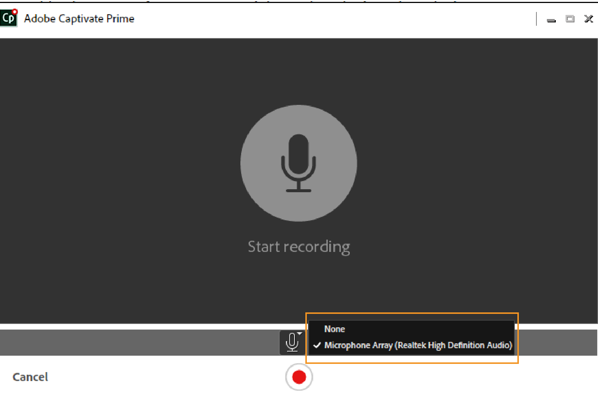

# Adobe Learning Manager Desktop-Anwendung

Erfahren Sie, wie Sie die Desktopanwendung des Adobe Learning Manager verwenden, um Inhalte zu erstellen und anzureichern, die in Soziales Lernen freigegeben werden können.

Die Adobe Learning Manager-Desktopanwendung ist in erster Linie für Teilnehmer gedacht, die Learning Manager Social Learning verwenden. Nach der Installation auf einem Desktop ermöglicht die Anwendung Teilnehmern, Inhalte zu erstellen und in Boards in Learning Manager zu posten, um informelle, gemeinsame und soziale Lernerfahrungen unter Kollegen zu erleichtern. Darüber hinaus stellt die Desktop-Anwendung auch sicher, dass Teilnehmer Social-Learning-Benachrichtigungen auf ihrem Desktop erhalten, auch wenn sie nicht unbedingt in der Web-Anwendung des Lern-Managers angemeldet sind.

Teilnehmer können umfangreiche Inhalte wie Videos, Audio und Screenshots erstellen und sie mit anderen Teilnehmern teilen. Dabei kann es sich um alles handeln - eine Software-Demo oder einen Kurzüberblick, eine Präsentation, einen Podcast oder einen kommentierten Screenshot von etwas, das geteilt werden kann.

Klicken Sie auf der Seite &quot;Soziales Lernen&quot; des Lernmanagers auf &quot;Neuer Beitrag&quot; und wählen Sie &quot;Video aufzeichnen&quot; oder &quot;Audio aufzeichnen&quot; oder nehmen Sie einen Screenshot auf bzw. klicken Sie auf &quot;Lernmanager-Galerie&quot;, um die Desktop-Anwendung zu starten. Weitere Informationen zu Social Learning finden Sie unter [hier klicken](feature-summary/social-learning-web-user.md).

Wenn Benutzer nicht über die Desktopanwendung verfügen, können Sie sie von der Adobe Learning Manager-Desktopseite herunterladen. Wenn Sie das Programm nicht herunterladen können, [hier klicken](../kb/troubleshooting-issues-with-adobe-learning-manager-desktop-app.md).

Sobald der Benutzer die Installation der Anwendung abgeschlossen hat, muss er sich mit seinen Lern-Manager-Teilnehmeranmeldeinformationen anmelden. Die Startseite wird wie im folgenden Screenshot angezeigt.

>[!NOTE]
>
>Teilnehmer können die Desktop-Anwendung nicht verwenden, wenn Soziales Lernen für ihr Konto deaktiviert ist.

<!---->
<!--*Home page*-->

## Erstellen eines Videos {#creatingavideo}

Die Desktop-Anwendung ermöglicht es einem Benutzer, Web, Bildschirm und beides aufzuzeichnen.

<!---->
<!--*Record web, screen, or both*-->

Gehen Sie wie folgt vor, um ein Video aufzunehmen und es auf der Social-Learning-Web-Plattform zu posten:

1. Stellen Sie sicher, dass die Hardware- und Softwareanforderungen erfüllt sind. Siehe [Systemanforderungen](../system-requirements.md) für weitere Informationen.
1. Um eine Aufzeichnung aus Soziales Lernen zu starten, wählen Sie das Symbol für den Videoaufzeichnungsdatensatz (Web, Bildschirm, beide) aus, über das die Learning Manager-Desktop-Anwendung geöffnet wird. In der Desktop-Anwendung, in der der Benutzer angemeldet ist, kann der Inhalt erstellt und dann veröffentlicht werden.
1. Um die Aufzeichnung von der Desktop-Anwendung aus zu starten, melden Sie sich mit Ihren Learning Manager-Anmeldedaten als Teilnehmer bei der Anwendung an.
1. Die Startseite wird angezeigt.
1. Um einen Beitrag zu erstellen, können Sie eine der drei Optionen auf der Startseite auswählen. Um das Aufzeichnungsfenster zu starten, klicken Sie auf das Symbol Video aufzeichnen .
1. Entsprechend den Anforderungen können Sie Webcam, Bildschirm oder beides auswählen.

   **Webcam** Die Webcam erfasst den Erzähler, der ein Projekt oder eine Anwendung einschließlich Audio vorführt oder präsentiert. Wählen Sie aus den oben genannten Optionen das Webcam-Symbol aus, damit das Live-Fenster angezeigt wird.

   **Bildschirm** Zeichnen Sie Aktionen auf, die auf dem Bildschirm ausgeführt werden. Durch Auswahl des Bildschirmsymbols wird der Bildschirm mit einem Datensatzdialog in der Mitte des Bildschirms hervorgehoben.

   **Beide** Zeichnet sowohl den Erzähler als auch die Bildschirmaktionen auf. Wenn Sie das letzte Symbol auswählen, wird der Bildschirm hervorgehoben und der Benutzer erhält ein Live-Fenster mit diesem Symbol.

1. Festlegen von Aufzeichnungseinstellungen.

   **Kamera auswählen** Klicken Sie auf das Videokamerasymbol am unteren Rand des Fensters &quot;Video aufzeichnen&quot;. Wählen Sie aus den angegebenen Optionen eine Kamera aus, die der Benutzer verwenden möchte.

   **Mikrofon auswählen** Klicken Sie auf das Mikrofonsymbol unten im Video- oder Audiofenster und wählen Sie aus den angegebenen Optionen ein Mikrofon aus, das der Benutzer verwenden möchte.

   >[!NOTE]
   >
   >Wenn der Benutzer kein Audio mit Bildschirm oder Video aufzeichnen möchte, wählen Sie die Option **Ohne** aus der Dropdown-Liste aus, die beim Klicken auf das Audiosymbol angezeigt wird.
   >
   >Wenn Benutzer beginnen, ihren Bildschirm oder sich selbst aufzuzeichnen, wird ein Popup-Dialogfeld angezeigt, in dem sie aufgefordert werden, zu bestätigen, ob sie die Aufnahme ohne Audiounterstützung fortsetzen möchten. Klicken Sie auf Ja, um fortzufahren.

1. Verwenden Sie die Aufnahmetaste, um die Aufnahme zu starten. Die Aufzeichnung beginnt nach dem Countdown (3 Sekunden).
1. Klicken Sie auf die Schaltfläche &quot;Anhalten&quot; oder &quot;Fortsetzen&quot;, um die Aufzeichnung anzuhalten und bei Bedarf fortzufahren. Informationen zum Bearbeiten der Aufzeichnung finden Sie unter [Bearbeiten einer Aufzeichnung](adobe-learning-manager-app-for-desktop.md#Editing) und zur Veröffentlichung siehe [Veröffentlichen einer Aufzeichnung](adobe-learning-manager-app-for-desktop.md#Publishing).

## Erstellen von Audiodaten {#creatinganaudio}

<!---->
*Audio aufzeichnen*

Um ein Audio aufzuzeichnen, gehen Sie wie folgt vor:

1. Klicken Sie im Startfenster der Learning Manager-Desktop-Anwendung auf das Symbol &quot;Audio aufzeichnen&quot;.
1. Stellen Sie sicher, dass die Mikrofonlautstärke aktiviert ist, indem Sie auf das Symbol für die Mikrofonlautstärke klicken und die Lautstärke anpassen.
1. Klicken Sie auf die Aufnahmeschaltfläche, um die Aufnahme zu starten.
1. Sobald die Benutzer die Audioaufnahme abgeschlossen haben, klicken Sie auf die Schaltfläche &quot;Anhalten&quot;, um die Aufnahme anzuhalten.
1. Um eine Vorschau der Aufnahme anzuzeigen, klicken Sie auf die Schaltfläche &quot;Wiedergabe&quot;.
1. Wenn Benutzer ein zusätzliches Audio in derselben Datei aufzeichnen möchten, klicken Sie auf **[!UICONTROL Fortsetzen]**. Sobald die gewünschte Aufnahme erreicht ist, klicken Sie auf **[!UICONTROL Weiter]** , um die Datei an einem gewünschten Speicherort zu speichern. Die Aufzeichnung wird in der Adobe Learning Manager-App für die Desktopgalerie gespeichert, in der Benutzer ihre Aufzeichnungen und Screenshots anzeigen können.
1. Informationen zum Bearbeiten der Aufzeichnung finden Sie unter [Bearbeiten einer Aufzeichnung](adobe-learning-manager-app-for-desktop.md#Editing) und zur Veröffentlichung siehe [Veröffentlichen einer Aufzeichnung](adobe-learning-manager-app-for-desktop.md#Publishing).

## Erstellen eines Screenshots {#creatingascreenshot}

Gehen Sie wie folgt vor, um einen Screenshot zu erstellen:

1. Klicken Sie auf das Screenshot-Symbol auf der Startseite der Learning Manager-Desktop-Anwendung.
1. Um nur einen Teil des Bildschirms zu erfassen, klicken Sie auf das Symbol &quot;Ausschnitt - Teilbildschirm&quot; . Um den gesamten Bildschirm zu erfassen, klicken Sie auf das Symbol für den Vollbildmodus.

   <!--
   *Capture a screenshot*-->

1. Damit andere Teilnehmer die Präsentation oder den statischen Inhalt besser verstehen und beibehalten können, fügen Sie Anmerkungen zum Inhalt hinzu.
1. Um den Screenshot zu bearbeiten, [hier klicken](adobe-learning-manager-app-for-desktop.md#Editing), und um einen Screenshot zu veröffentlichen [hier klicken](adobe-learning-manager-app-for-desktop.md#Publishing).

## Bearbeiten von Video, Audio und Screenshot {#editing}

Nachdem eine Datei gespeichert wurde, wird das Bearbeitungsfenster sofort auf einem System angezeigt, in dem Aufzeichnungen mithilfe der folgenden Optionen perfekt und professionell aussehen können:

## Anmerkungen (Videoaufzeichnungen und Screenshots) {#annotationsvideorecordingsandscreenshots}

Anmerkungen können für Videoaufzeichnungen und Screenshots verwendet werden, um bestimmte Details hervorzuheben oder Text für die anderen Benutzer zu schreiben.

>[!NOTE]
>
>Bei Videos können Benutzer nur am oberen Rand des Bildschirms Anmerkungen hinzufügen.

* Die verschiedenen Anmerkungen, die ausgewählt werden können, sind **Ellipse**, **Falte**, **Pfeil**, **hervorheben** und **Text**.

* Wählen Sie eine Farbe für jede Anmerkung im Farbbedienfeld im Eigenschaftenbedienfeld der Anmerkung.
* Für **Text**&quot; die folgenden Eigenschaften aus: Schriftart, Fett, Kursiv, Überschrift, Ausrichtung, Farbe und Hintergrundfarbe.

>[!NOTE]
>
>Um die Hintergrundfarbe für Text anzuzeigen, aktivieren Sie die Hintergrundfarbe &quot;Ja&quot;.

## Zuschneiden (alle Arten von Video- und Audioaufzeichnungen) {#trimalltypesofvideoandaudiorecordings}

Mit dem Zuschneidewerkzeug können Sie Teile eines Video- oder Audioinhalts zuschneiden oder entfernen, die nicht benötigt werden.

Klicken Sie zum Zuschneiden auf **[!UICONTROL Trim starten]** oder klicken Sie auf das Pluszeichen in der Zeitleiste, um mit dem Zuschneiden zu beginnen. Klicken Sie dann auf die Pause-Schaltfläche im Player, um das Zuschneiden zu beenden. Klicken Sie auf **[!UICONTROL Bestätigen]** , um das Zuschneiden abzuschließen.

Aufzeichnungen können zugeschnitten werden, indem Sie die Zeit in das Feld **[!UICONTROL Startzeit]** und **[!UICONTROL Endzeit]** Eingabefelder nach der Aktivierung **[!UICONTROL Timing ändern]**.

*Trim starten*

*Zuschneiden bestätigen*

## Schwenken und Zoomen (jede Videoaufzeichnung) {#panampzoomanyvideorecording}

Die Aktion &quot;Schwenken und Zoomen&quot; kann nur auf dem **Beide** (Webcam und Bildschirm) Videoaufzeichnungen. Standardmäßig ist die gesamte Webcam oder der gesamte Bildschirm ausgewählt. Wählen Sie den Eckgriff aus, und ziehen Sie, um den Teil des Bildschirms auszuwählen, der angezeigt oder fokussiert werden soll. Doppelklicken Sie auf das Fenster, um den Vollbildmodus zu aktivieren.

*Schwenken und Zoomen*

## Branding (alle Arten von Videoaufzeichnungen) {#brandingalltypesofvideorecordings}

Um einen eindeutigen Namen für ein Video zusammen mit einem einheitlichen Design zu erstellen, wählen Sie das Branding-Tool aus. Das Branding zielt darauf ab, eine bedeutende und differenzierte Präsenz im Learning-Management-System herzustellen, die Teilnehmer dazu anzieht und hält, das gesamte Video anzusehen.

Gehen Sie wie folgt vor, um einem Video ein Branding oder ein Design hinzuzufügen:

1. Klicken Sie im linken Navigationsfenster des Bearbeitungsfensters auf das Branding-Symbol.
1. Wählen Sie ein **Design** aus den angegebenen Optionen auswählen oder Benutzer können ihr eigenes Design anpassen, indem sie ein **anlassen**, **Hintergrund,** und **Ende** von ihrem System importieren.

   >[!NOTE]
   >
   >Klicken Sie auf das Symbol **Weitere Elemente abrufen** klicken.

1. Fügen Sie einen Videotiteltext hinzu und wählen Sie im Fenster &quot; **Anzeigen unter** -Raster angezeigt werden.

   >[!NOTE]
   >
   >Titeltext kann nur als Teil eines Branding-Videos hinzugefügt werden. Bevor Sie dem Branding-Video einen Titel verleihen, ist ein Design erforderlich.

1. Fügen Sie bei Bedarf einen Namen und einen Titel für den Moderator hinzu. Geben Sie im Feld Anzeige am Abspielkopf eine Zahl innerhalb des Video-Zeitbereichs für den Namen und Titel des Moderators ein, der während der Wiedergabe des Videos angezeigt werden soll.
1. Fügen Sie bei Bedarf ein Branding-Symbol auf der linken oder rechten Seite des Videobildschirms hinzu. Um ein Branding-Symbol auszuwählen, klicken Sie auf **[!UICONTROL Auswählen]** > **[!UICONTROL Vom System aus suchen]**.
1. Um eine Vorschau des Videos anzuzeigen, klicken Sie im Vorschaubildschirm auf die Schaltfläche &quot;Abspielen&quot;.

   

   *Branding*

## Aufzeichnen zusätzlicher Clips (alle Arten von Video- und Audioaufzeichnungen) {#recordingadditionalclipsalltypesofvideoandaudiorecordings}

Zusätzliche Audio- und Video-Clips können in einer vorhandenen Video- oder Audiodatei aufgezeichnet werden.

Um eine neue Aufzeichnung zu starten, klicken Sie auf das Symbol &quot;Zusätzlichen Clip aufzeichnen&quot;. Die neue Aufnahme wird an der Abspielkopfposition in der Aufnahme eingefügt, die bearbeitet wird.

## Veröffentlichen einer Videoaufnahme, einer Audioaufnahme und eines Screenshots {#publishing}

Nachdem alle Änderungen und Änderungen vorgenommen wurden, klicken Sie auf **[!UICONTROL Freigeben]** > geben Sie ein oder suchen Sie nach einem **Geschicklichkeit oder Vorstand** der sich am besten auf den Beitrag bezieht > **Post**.

<!---->
*Veröffentlichen im Web*

## Durchsuchen der Desktopgalerie von Learning Manager {#browsingcaptivateprimedesktopgallery}

Alle Aufzeichnungen und Screenshots werden in der Adobe Learning Manager-Desktopanwendung gespeichert. Zum Durchsuchen dieser Dateien klicken Sie auf **[!UICONTROL Galerie]** im linken Navigationsbereich auf der Startseite.

>[!NOTE]
>
>Die Galerie kann auch über Soziales Lernen gestartet werden, indem Sie auf das Symbol **Learning Manager-Galerie** Symbol beim Erstellen eines Beitrags.

Geben Sie im Galeriefenster den Namen der gesuchten Datei in das Suchfeld ein.

Um eine neue Aufnahme über das Galeriefenster zu erstellen, klicken Sie auf das Symbol **Neu aufzeichnen** klicken.

Um eine Datei in der Galerie zu bearbeiten oder zu löschen, klicken Sie unten in der Datei auf die drei Punkte und wählen Sie die entsprechende Option in der Popup-Liste aus.

## Benachrichtigungen {#notifications}

Benachrichtigungen im Lern-Manager werden im Benachrichtigungsfenster angezeigt, unabhängig davon, ob der Teilnehmer bei der Lern-Manager-Webanwendung angemeldet ist. Benachrichtigungen umfassen Beiträge oder Boards, die Benutzer erstellt haben, denen sie folgen oder an denen sie teilgenommen haben. Durch Klicken auf die Benachrichtigung navigiert der Benutzer zum Learning Manager Social Learning-Web.

Um Benachrichtigungen stummzuschalten, klicken Sie auf **[!UICONTROL Profilmenü*]* > **[!UICONTROL Einstellungen] > **[!UICONTROL Benachrichtigungen stummschalten]**.

## Einstellungen in der Adobe Learning Manager-Desktopanwendung {#settingsinadobecaptivateprimedesktopapplication}

Im Dialogfeld &quot; **Einstellungen** &quot; die folgenden Einstellungen:

Stummschalten von Benachrichtigungen, Anwendung für den automatischen Start, Anwendung für automatische Aktualisierung, Produktverbesserung aktivieren

Benutzer können den Speicherort der Galerie auch ändern, indem sie auf das Symbol **Ändern** Hyperlink.

*Adobe Learning Manager-App-Einstellungen*
