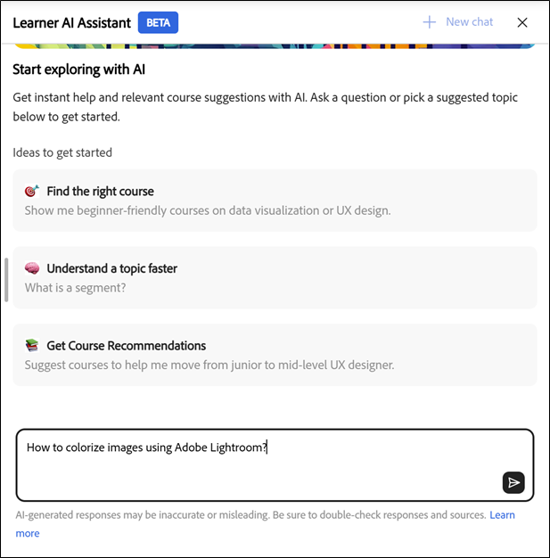
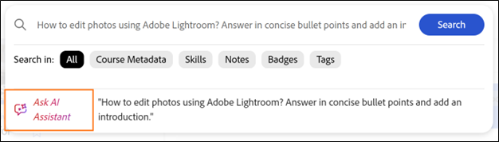

# Einführung

Mit dem AI Assistant (Beta) für Teilnehmer können sie schnell Antworten auf die zugewiesenen Lerninhalte finden, ohne sich durch ganze Kurse bewegen zu müssen. Sie können Fragen in verständlicher Sprache stellen und erhalten präzise, zielgerichtete Antworten mit Quell-Links zu den relevanten Kursinhalten.

>[!IMPORTANT]
>
>Teilnehmer-KI-Assistent befindet sich derzeit in der Betaversion und wird nach einer schrittweisen Einführung veröffentlicht. Der Zugriff kann je nach Benutzer variieren.

## Was ist der KI-Assistent?

AI Assistant ist ein Gen-KI-gestützter Chat-Begleiter in Adobe Learning Manager, der schnelle, präzise Antworten auf Teilnehmerfragen bietet, indem er die vertrauenswürdigen Lerninhalte verwendet, die ihm in Adobe Learning Manager zur Verfügung stehen. Es enthält auch Zitate, sodass die Teilnehmer immer wissen, aus welcher Quelle die Informationen stammen.

## Warum es verwenden?

* Die Teilnehmer sind mit Überlastungen konfrontiert und wissen oft nicht, wo sie anfangen sollen oder welche Ressource sie verwenden sollen.

* Katalog- und Zugriffsregeln erschweren die Ermittlung der für sie verfügbaren Inhalte.

* Customer Journeys sind über mehrere Formate und Schulungstypen verteilt, z. B. Kurse, virtuelle Klassenzimmer, Arbeitshilfen und Bewertungen.

* Es gibt keine einfache, einheitliche Möglichkeit, bestimmte Informationen aus verschiedenen Formaten wie SCORM, PDF, Dokumenten, Videos oder Transkripten abzurufen.

* Unterschiedliche Teilnehmerrollen und Branchen (z. B. Vertrieb, Marketing, Support, Betrieb) haben jeweils eigene Informationsanforderungen, die schnelle, kontextbezogene Antworten erfordern.

## Welche Arten von Inhalten kann der AI Assistant transkribieren?

Der AI Assistant kann Informationen zu allen Arten von Lerninhalten finden, die Ihnen zugewiesen wurden, einschließlich:

* **Dokumente:** PDF, Word, PowerPoint, Excel, HTML

* **Medien:** Audio (mp3, wav, m4a), Video (mp4, mov, wmv)

* **Interaktiver Inhalt:** SCORM 1.2, SCORM 2004,

* **Lernobjekttyp:** Kurse, Lernpfade, Zertifizierungen, Arbeitshilfen

Adobe transkribiert Ihre Lerninhalte sicher mithilfe vertrauenswürdiger Verarbeitungsdienste von Drittanbietern, die in der privaten VPC-Umgebung von Adobe gehostet werden.

**WICHTIG**

Der AI Assistant nutzt nur Inhalte, die:

* Verfügbar in den Katalogen, die von Administratoren für den Teilnehmerassistenten konfiguriert wurden, und

* Bestandteil interner Kataloge in Adobe Learning Manager.

Freigegebene, erworbene, externe oder andere nicht interne Kataloge werden in der aktuellen Version nicht als Inhaltsquellen für den AI-Assistenten unterstützt.

Wenn Sie keinen Zugriff auf einen Kurs haben, sind die entsprechenden Zitat-Links nicht für Sie verfügbar. Bibliotheken von Drittanbietern (z. B. LinkedIn Learning oder Go1) sind nicht für das Abrufen von Antworten enthalten.

## Gesprächsfähigkeiten

Der AI Assistant unterstützt sowohl einzelne Fragen als auch Multi-Turn-Gespräche. Hierdurch werden Ihre vorherigen Abfragen in derselben Sitzung erinnert.

**Beispielunterhaltung:**

Sie: &quot;Wie lautet die Rückerstattungsrichtlinie?&quot;
Assistent: Übersicht
Sie: &quot;Wie wäre es mit Rückerstattungen nach 30 Tagen?&quot;
Assistent: Gibt genauere Informationen zurück.

## Nutzungsszenarien für AI Assistant

### Just-in-time-Lernunterstützung (alle Teilnehmer)

Teilnehmer benötigen oft schnelle Antworten, während sie arbeiten, nicht vollständige Kurswiederholungen. Der KI-Assistent ermöglicht den sofortigen Abruf präziser Informationen aus zugewiesenen Lerninhalten.

**Hilfreiche Funktionen:**

* Erhalten Sie direkte Antworten auf spezifische Fragen aus Kursen, Arbeitshilfen und Dokumenten

* Wechseln zu exakt referenzierten Abschnitten mithilfe von Zitaten

* Reduzieren des Zeitaufwands für die Suche über mehrere Lernobjekte

### Aktivierung des Vertriebs und Kundengespräche

Die Vertriebsteams benötigen schnelle, präzise Produkt- und Prozessinformationen während der Live-Interaktion mit den Kunden. Der KI-Assistent fungiert als bedarfsorientierter Wissensbegleiter.

**Hilfreiche Funktionen:**

* Abrufen aktueller Produktfunktionen und Positionierung

* Schnelle Verkaufsskripte oder Diskussionspunkte aus Schulungsinhalten generieren

* Produktversionen oder Angebote mit zugewiesenem Lernmaterial vergleichen

* Stärkung des Vertriebswissens ohne Wiederholung ganzer Kurse

**Beispiel 2**

**Zweck:** Zeigen Sie, dass der AI Assistant Vertriebsmitarbeitern dabei helfen kann, Kundenvergleichsfragen sofort zu beantworten.

**Empfohlene Eingabeaufforderung:** Vergleichen Sie Adobe Learning Manager und ein herkömmliches LMS für Unternehmensschulungen. Zeigen Sie den Vergleich in einem Tabellenformat an.

### Marketing- und Kampagnenbereitschaft.

Marketing-Teams benötigen häufig schnelle Auffrischungen, bevor sie Überprüfungen, Starts oder Stakeholder-Diskussionen durchführen können. Der KI-Assistent fasst komplexe Lerninhalte in verwertbaren Erkenntnissen zusammen.

**Hilfreiche Funktionen:**

* Zusammenfassung langer Kurse oder Videos zu wichtigen Themen

* Aktualisieren von Prozess- oder Produktkenntnissen vor Meetings

* Entdecken Sie verwandte Lerninhalte, um das Fachwissen zu vertiefen

### Betriebs- und Prozessklarheit

Betrieb, Support und interne Teams verlassen sich auf eine genaue Prozessdokumentation. Der AI Assistant hilft bei der sofortigen Klärung von Richtlinien und Workflows.

**Hilfreiche Funktionen:**

* Hier finden Sie Antworten auf interne Prozesse, SOPs und Compliance-Richtlinien.

* Klären Sie Details auf Schrittebene, ohne lange Dokumente zu durchsuchen

* Geringere Abhängigkeit von KMU bei wiederkehrenden Fragen

### Schnelleres Onboarding und Rollenübergänge

Neue Mitarbeiter und Mitarbeiter, die in neue Rollen wechseln, haben oft Schwierigkeiten, in großen Lernkatalogen zu navigieren. Der KI-Assistent beschleunigt den Projekteinstieg, indem er ihn zu relevanten Antworten führt.

**Hilfreiche Funktionen:**

* Antworten auf häufige Onboarding-Fragen zu zugewiesenen Inhalten

* Kurze Erläuterung rollenspezifischer Konzepte

* Unterstützung von selbstgesteuertem Lernen ohne Informationsüberlastung

### Wissensaktualisierung und kontinuierliches Lernen

Erfahrene Teilnehmer benötigen schnelle Auffrischungen anstatt einer vollständigen Umschulung. Der KI-Assistent unterstützt kontinuierliches Lernen im Arbeitsablauf.

**Hilfreiche Funktionen:**

* Aktualisieren Sie Ihr Wissen nach Bedarf, ohne die Kurse erneut anzuschauen

* Verbessern der Lernergebnisse nach Abschluss der Schulung

* Förderung einer häufigen, mühelosen Interaktion mit Lerninhalten

## Verwendung von Inhalten durch den Teilnehmer-KI-Assistenten

Der KI-Assistent für Teilnehmer hilft Ihnen dabei, während des Lernens schnell richtige Antworten zu finden. Damit Sie sie effektiv einsetzen können, sollten Sie wissen, welche Inhalte die Assistenzkraft verwendet, welche Inhalte sie nicht verwendet und wie sie Antworten generiert.

### Welche Inhalte nutzt der AI Assistant?

Der AI-Assistent für Teilnehmer beantwortet Fragen nur mit den Lerninhalten, die Ihnen in Adobe Learning Manager zugewiesen wurden.

* Der Assistent verwendet Inhalte aus internen Katalogen, die Ihr Administrator für den Teilnehmer-AI-Assistenten aktiviert.

* Der Assistent respektiert Ihre Rolle, Gruppenmitgliedschaft und Katalogberechtigungen beim Abrufen von Informationen.

### Welche Inhalte nutzt der AI Assistant nicht?

Der AI-Assistent für Teilnehmer beschränkt Antworten auf Ihren zugewiesenen Lernbereich.

* Es werden keine Inhalte aus den Katalogen &quot;Standard&quot;, &quot;Freigegeben&quot;, &quot;Erworben&quot;, &quot;Extern&quot; oder anderen nicht internen Katalogen verwendet.

* Es ruft keine Informationen aus Inhaltsbibliotheken von Drittanbietern wie LinkedIn Learning oder Go1 ab.

* Es durchsucht nicht das Internet oder greift auf externe Websites zu, um Antworten zu generieren.

### Wie der KI-Assistent Antworten generiert

Der Teilnehmer-KI-Assistent analysiert Ihre zugewiesenen Lerninhalte, um zielgerichtete und kontextbezogene Antworten zu generieren.

* Jede Antwort enthält Zitate, die auf den ursprünglichen Quellinhalt verweisen.

* Sie können eine Erwähnung auswählen, um direkt zum entsprechenden Kurs, Modul oder Dokument zu navigieren.

* Zitate helfen Ihnen dabei, Informationen zu verifizieren und bei Bedarf zusätzlichen Kontext zu erkunden.

### Verantwortungsbewusste Nutzung des KI-Assistenten

Verwenden Sie den AI-Assistenten für Teilnehmer als Lernhilfe, um Wissen zu erforschen, zu aktualisieren und zu vertiefen.

* Behandeln Sie Antworten als Anleitung basierend auf verfügbaren Lerninhalten.

* Vollständige und maßgebliche Informationen finden Sie im zitierten Quellmaterial.

### Zugriffskontrolle durch Administratoren.

Administratoren verwalten den Zugriff auf den AI-Assistenten für Teilnehmer und steuern die verwendeten Inhalte.

* Administratoren weisen den Assistenten bestimmten Benutzergruppen zu.

* Administratoren wählen aus, welche internen Kataloge der Assistent als Inhaltsquellen verwenden kann.

* Diese Steuerelemente stellen sicher, dass der Assistent nur genehmigte und relevante Lerninhalte anzeigt.

## Integrierte Eingabeaufforderungen

Der AI-Assistent für Teilnehmer enthält eine Reihe integrierter Eingabeaufforderungen, die den Teilnehmern den schnellen Einstieg in häufige Fragen und Szenarien erleichtern. Diese Anweisungen leiten die Teilnehmer dazu, wie sie mit dem Assistenten interagieren, und zeigen die Arten von Fragen an, die sie stellen können.

Integrierte Eingabeaufforderungen können pro Konto angepasst werden. Unternehmen können diese Eingabeaufforderungen an ihre Lernziele, Teilnehmerrollen, Terminologie oder spezifischen Anwendungsfälle anpassen.

Administratoren können mit ihrem Customer Success Manager (CSM) die integrierten Eingabeaufforderungen für ihr Konto konfigurieren, ändern oder aktualisieren. Die Eingabeaufforderung wird auf Kontoebene verwaltet und kann in der aktuellen Version nicht direkt in der Adobe Learning Manager-Benutzeroberfläche konfiguriert werden.

Die den Teilnehmern angezeigten Eingabeaufforderungen können je nach Konto und der mit Adobe definierten Konfiguration variieren.

## KI-Assistenten für Teilnehmer aktivieren

Der AI Assistant (Beta) bietet KI-gestützte Unterstützung, damit Teilnehmer Inhalte effektiver entdecken und damit interagieren können. Administratoren steuern den Zugriff, indem sie die Funktion bestimmten Benutzergruppen und Katalogen zuweisen. Bei der Konfiguration des AI Assistant sollten nur interne Kataloge verwendet werden. Inhalte aus freigegebenen, erworbenen, externen oder anderen nicht internen Katalogen werden für die Anzeige in Antworten und Zitaten von AI Assistant nicht unterstützt.

Administratoren wählen aus, welche Benutzergruppen und internen Kataloge auf die AI Assistant-Funktion zugreifen können. Sie sollten sicherstellen, dass die zugewiesenen Kataloge nur die Lerninhalte enthalten, die für die Anzeige durch AI-Antworten und Zitate geeignet sind, und dass diese Kataloge intern, nicht freigegeben, erworben oder extern sind.

Bevor Sie den AI-Assistenten (Beta) konfigurieren, vergewissern Sie sich, dass Sie über Administratoranmeldeinformationen verfügen und identifiziert haben, welche Benutzergruppen und Kataloge Zugriff auf die Funktion haben sollen.

### Konfigurieren des Zugriffs auf den Teilnehmerassistenten

So aktivieren Sie den AI-Assistenten für Teilnehmer:

&#x200B;1. Melden Sie sich bei Adobe Learning Manager als Administrator an.

&#x200B;2. Wählen Sie **Einstellungen** auf der Startseite aus.

&#x200B;3. Wählen Sie im Menü **Einstellungen** die Option **Teilnehmer-AI-Assistent (Beta)**.

&#x200B;4. Wählen Sie den Umschalter, um den **Teilnehmer-AI-Assistenten (Beta)** zu aktivieren.

&#x200B;5. Wählen Sie eine oder mehrere Benutzergruppen aus der Option **Berechtigte Benutzergruppen** aus.

&#x200B;6. Wählen Sie **Speichern**, um die Benutzergruppeneinstellungen anzuwenden.

&#x200B;7. Wählen Sie einen oder mehrere Kataloge aus der Option **Berechtigte Kataloge**.

&#x200B;8. Wählen Sie **Speichern**, um die Katalogeinstellungen anzuwenden.

>[!IMPORTANT]
>
>Nur interne Kataloge werden vom AI Assistant unterstützt. Wenn ein freigegebener, erworbener, externer oder anderer nicht interner Katalog ausgewählt ist, wird sein Inhalt nicht vom AI-Assistenten angezeigt, auch wenn der Katalog in der Liste der zulässigen Kataloge angezeigt wird.

## Zugriff auf den Teilnehmer-KI-Assistenten in Adobe Learning Manager

Mit dem KI-Assistenten für Lernende (Beta) von Adobe Learning Manager können Sie Antworten schnell finden, während Sie lernen. Dieses intelligente Tool antwortet direkt auf Ihre Fragen zu Kursen, Inhalten und Plattformfunktionen aus Ihrem Teilnehmerkonto.

Der AI-Assistent kann nur Inhalte aus internen Katalogen verwenden, die Ihr Administrator für den Teilnehmer-Assistenten aktiviert hat. Inhalte, die nur in freigegebenen, erworbenen oder externen Katalogen vorhanden sind, werden nicht einbezogen.

Der Teilnehmer-KI-Assistent (Beta) ist nur für ausgewählte Teilnehmer verfügbar.

### Starten des AI-Assistenten

So starten Sie den Teilnehmer-KI-Assistenten:

&#x200B;1. Melden Sie sich als Teilnehmer bei Adobe Learning Manager an.

&#x200B;2. Wählen Sie auf der Startseite **AI Assistant fragen**.

&#x200B;3. Wenn der Bildschirm **Teilnehmer-AI-Assistent (Beta)** angezeigt wird, wählen Sie **Erste Schritte**.

>[!NOTE]
>
>Wenn Sie den AI Assistant zum ersten Mal starten, müssen Sie Ihre Zustimmung geben, bevor Sie ihn verwenden können. Das Zustimmungsdialogfeld wird nur während dieses ersten Starts angezeigt. Für alle nachfolgenden Starts werden Sie direkt zum AI Assistant weitergeleitet, wo Sie Ihre Eingabeaufforderungen eingeben können.

&#x200B;4. Geben Sie die Eingabeaufforderung in das Textfeld ein.

5.Drücken Sie **Enter**, um eine Antwort zu erhalten. Prüft eure Antworten, Quellen und Empfehlungen.

Adobe ermöglicht eine sofortige Anpassung auf Kontoebene. Um integrierte Eingabeaufforderungen zu konfigurieren oder zu aktualisieren, wenden Sie sich an Ihren Adobe Customer Success Manager (CSM).

AI Assistant-Antworten enthalten Zitate zu jeder Antwort, sodass Teilnehmer ganz einfach überprüfen können, woher die Informationen stammen. Jede genannte Referenz verweist auf das ursprüngliche Kursmodul, die Arbeitshilfe oder andere Lerninhalte.

Teilnehmer können:

* Wählen Sie die Zitatnummer inline aus, um zum exakt referenzierten Abschnitt zu springen.

* Öffnen Sie die vollständige Liste der Quellen, indem Sie unten in der Antwort **Quellen anzeigen** auswählen.

Der Teilnehmerassistent enthält Zitate mit allen Antworten, um anzuzeigen, woher die Informationen stammen. Jede Erwähnung wird direkt mit dem ursprünglichen Kurs, Modul oder Lernobjekt verknüpft, mit dem die Antwort generiert wurde.

Sie können ein beliebiges Zitat auswählen, um die Kursseite im Adobe Learning Manager zu öffnen und den gesamten Inhalt im Kontext zu überprüfen. Zitate helfen Ihnen dabei, Informationen zu verifizieren, zusätzliche Details zu erkunden und weiterhin von der maßgeblichen Quelle zu lernen.

## Zugriff auf den AI-Assistenten über die Suche

Administratoren können den AI-Assistenten auch direkt über die Suchleiste starten. Geben Sie einfach Ihre Frage ein und wählen Sie **AI-Assistenten fragen** aus den unten angezeigten Optionen aus, um Antworten auf die zugewiesenen Lerninhalte zu erhalten.

## Feedback zu den Antworten des Teilnehmer-KI-Assistenten (Beta) geben

Ihr Feedback zu den vom Teilnehmer-KI-Assistenten (Beta) generierten Antworten trägt dazu bei, die Genauigkeit, Relevanz und die Gesamtleistung zu verbessern.

### Antwort mögen oder ablehnen

* Wählen Sie **Minimieren**, wählen Sie aus, was Ihnen in der Antwort hilfreich war, fügen Sie optional Kommentare hinzu, und wählen Sie dann **Senden** aus.

* Wählen Sie **Minimieren**, wählen Sie den Grund aus, aus dem die Antwort nicht hilfreich war, fügen Sie Kommentare hinzu, und wählen Sie dann **Senden** aus.

## Neuen Chat im AI Assistant starten

Teilnehmer können die aktuelle Unterhaltung löschen und jederzeit einen neuen Chat starten.

* Wählen Sie im Bildschirm des AI-Assistenten **Neuer Chat** aus und wählen Sie dann **Ja** aus.

