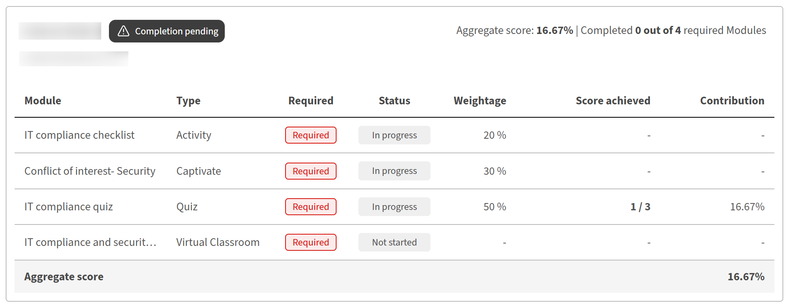

# Schulungskalender für Teilnehmer

## Kurs mit Schulungsunterlagen beginnen

Wenn das Schulungsbuch für einen Kurs in Adobe Learning Manager aktiviert und sichtbar ist, wird auf der Kursübersichtsseite eine Registerkarte **Schulungsbuch** angezeigt. Verwenden Sie diese Option, um Ihre gewichtete Punktzahl für jedes Modul, Ihre aktuelle Gesamtpunktzahl und ob Sie einen größeren Teil des Kurses bestanden haben oder noch absolvieren müssen, anzuzeigen.

## Wenn das Schulungsbuch verfügbar ist

Die Registerkarte **Gradebook** wird im Kurs-Player neben **Modulen**, **Anmerkungen** und **Diskussionen** angezeigt, wenn Ihr Autor oder Administrator die Gradebook-Sichtbarkeit für den Kurs aktiviert hat. Wenn die Registerkarte nicht angezeigt wird, wurde das Schulungsbuch für diesen Kurs nicht aktiviert oder der Administrator hat die Sichtbarkeit der Teilnehmer deaktiviert. Punktzahlen können weiterhin aufgezeichnet und für den Administrator sichtbar sein.

Sie können die Registerkarte **Gradebook** während der Registrierung jederzeit öffnen:

* **Bevor Sie beginnen:** Nach der Registrierung sehen Sie die vollständige Liste der bewertbaren Module mit ihren Gewichtungsprozentsätzen, den Höchstwerten für jedes Modul und den vom Autor festgelegten Kriterien für das Bestehen. Dies zeigt Ihnen genau, wie der Kurs bewertet wird, bevor Sie beginnen.
* **In Bearbeitung:** Während Ihre Module und Ergebnisse aufgezeichnet werden, wird das Notenbuch aktualisiert, um Ihre Ergebnisse neben den Modulen anzuzeigen, die noch nicht getestet wurden oder auf eine Bewertung warten.
* **Nach Abschluss:** Das Schulungsbuch zeigt alle endgültigen Modulergebnisse, Ihre berechnete Gesamtkursbewertung und ein **Ergebnis mit bestandenen** Ergebnissen im Header an.

## Schulungskalender anzeigen

* Wählen Sie unter **Eigenes Lernen** Ihren Kurs aus.
* Wählen Sie die Registerkarte **Gradebook** auf der Kursseite.

  Der Gradebook-Header zeigt Folgendes:

  

* Die **Kriterien für das Bestehen:** Die erforderliche Mindestgesamtpunktzahl und Anzahl von Modulen
* Die Anzahl der erforderlichen Module, die Sie von der Gesamtzahl abgeschlossen haben
* Ihr aktuelles **Aggregatergebnis** in Prozent
* Ihr aktueller Kursstatus: **Nicht gestartet**, **Abschluss ausstehend**, **Bestanden** oder **Nicht bestanden**

Die Modultabelle unter der Kopfzeile zeigt die folgenden Spalten für jedes Modul an:

| **Spalte** | **Was angezeigt wird** |
|------------|-------------------|
| **Modul** | Modulname und -typ |
| **Status** | Ihr Abschluss- oder Punktestatus für dieses Modul (siehe Statusreferenz unten) |
| **Gewicht** | Der Prozentsatz, den dieses Modul zu Ihrer Gesamtpunktzahl beiträgt |
| **Ergebnis** | Ihr Ergebnis für dieses Modul (z. B. 40/100) |
| **Beitrag** | Die tatsächlichen Prozentpunkte, die dieses Modul bisher zu Ihrer Gesamtpunktzahl hinzugefügt hat |

## Modulgewicht auf der Registerkarte &quot;Module&quot; anzeigen

Sie können die Gewichtung jedes Moduls auch auf der Registerkarte **Module** anzeigen, ohne das Schulungsbuch zu öffnen.

Wählen Sie auf der Kursseite die Registerkarte **Module**.

Auf der Registerkarte **Module** werden der Gewichtungsprozentsatz für jedes Modul und die Anzahl der Module angezeigt, die zum Abschließen des Kurses erforderlich sind.

## Modulbewertungen mit mehreren Versuchen

Wenn ein Modul mehrere Versuche zulässt, hängt die in Ihrem Notizbuch angezeigte Punktzahl davon ab, wie der Kursverfasser es konfiguriert hat:

* **Höchste Punktzahl:** Die beste Punktzahl aus jedem Versuch wird angezeigt. Eine niedrigere Punktzahl bei einem späteren Versuch verringert Ihre aufgenommene Punktzahl nicht.
* **Aktuell:** Die Punktzahl aus Ihrem letzten Versuch wird immer angezeigt. Ein niedrigerer Wert bei einem späteren Versuch ersetzt den vorherigen.

## Modulstatus verstehen

Jedes Modul im Notenbuch zeigt einen der folgenden Status:

| **Status** | **Was es bedeutet** |
|------------|-------------------|
| **Abgeschlossen** | Modul beendet und Punktzahl aufgezeichnet |
| **Wird ausgeführt** | Modul gestartet, aber noch nicht beendet |
| **Nicht gestartet** | Modul noch nicht geöffnet |
| **Fehler** | Das Modul wurde bewertet und die Punktzahl erfüllte nicht den Mindestwert zum Bestehen des Moduls. |
| **Überprüfung ausstehend** | Modul abgeschlossen, aber es wird auf eine Punktzahl von einem Kursleiter oder Administrator gewartet |
| **Keine Gewichtung** | Der Modultyp unterstützt keine Bewertung (PDF, Video und Ähnliches). trägt nicht zum Aggregat bei |

## Berechnung der Gesamtpunktzahl

Ihre Gesamtpunktzahl ist die Summe des gewichteten Beitrags jedes bewerteten Moduls:

(Punktzahl erreicht ÷ Höchstpunktzahl) × Gewicht % = Modulanteil

Die Spalte **Beitrag** im Gradebook zeigt den Beitrag jedes Moduls zu Ihrem aktuellen Aggregat an. Module, die mit **Keine Gewichtung** markiert sind, werden von dieser Berechnung ausgeschlossen.

Die Bewertungsskala muss nicht in allen Modulen gleich sein. Ein Modul hat einen Wert von 100, und ein Modul hat einen Wert von 10, beide tragen richtig bei. Die Formel normalisiert jede einzelne vor Anwendung der Gewichtung.

## Anzeigen und Berichten von Notenbuchbewertungen

Administratoren in Adobe Learning Manager können gewichtete Notizbuchergebnisse für alle registrierten Teilnehmer in einem Kurs anzeigen, die Leistung der einzelnen Teilnehmer nach Modul anzeigen, ein gefiltertes Teilnehmertranskript herunterladen und die Konfigurationsänderungen des Notizbuchs im Bericht &quot;Inhaltsprüfpfad&quot; verfolgen.

## Schulungskalender für einen Kurs anzeigen

Wenn das Notizbuch für einen Kurs aktiviert ist, wird in der linken Navigation unter **Berichte** ein neuer Abschnitt **L2 Feedback - Notizbuch** angezeigt, wenn Sie den Kurs öffnen.

* Melden Sie sich bei Adobe Learning Manager als Administrator an.
* Wählen Sie in der linken Navigation **Kurse** aus und öffnen Sie den Kurs, den Sie überprüfen möchten.
* Wählen Sie in der Kursnavigation unter **Berichte** die Option **L2 Feedback - Schulungsbuch**. Die Seite **Gradebook für aktives Feedback** wird geöffnet.

Es zeigt:

1. Die Kriterien für das Bestehen des Kurses (erforderliche Mindestmodule und minimale Gesamtpunktzahl)
2. Eine Filterzeile, um Teilnehmer nach Stufe anzuzeigen: **Übergeben**, **Fehlgeschlagen** oder **Abschluss ausstehend**
3. Die Formel für die Gesamtpunktzahl: Gesamtpunktzahl = ÷ (Punktzahl erreicht Höchstpunktzahl) × Gewicht für jedes Modul
4. Eine Teilnehmerliste, die die **Gesamtpunktzahl des Teilnehmers** und seine Punktzahl für jedes bewertete Modul anzeigt
5. Dropdown-Liste mit Instanzen, um zwischen Kursinstanzen zu wechseln, wenn ein Kurs mehrere Instanzen hat

Teilnehmer, die noch keine bewerteten Module ausprobiert haben, zeigen in den Punktzahlspalten Bindestriche an. Module, die keine Bewertung, PDF, Video, Audio und Ähnliches unterstützen, werden nicht als Bewertungsspalten angezeigt.

## Anzeigen der Punktzahlen eines einzelnen Teilnehmers

Wählen Sie im **Gradebook für aktives Feedback** den Namen eines Teilnehmers aus.

In der Ansicht &quot;Einzelner Teilnehmer&quot; wird Folgendes angezeigt:

1. Name, E-Mail-Adresse und Status des Teilnehmers (**Abschluss ausstehend**, **Bestanden** oder **Nicht bestanden**)
2. Die Gesamtpunktzahl und die Anzahl der erforderlichen Module, die der Teilnehmer abgeschlossen hat
3. Eine Modultabelle, die Folgendes zeigt: Modulname, Typ, ob erforderlich, Status, Gewichtung, erreichte Punktzahl und Beitrag zum Aggregat

Die Modultabelle enthält alle bewertbaren und nicht bewertbaren Module. Bewertungsmodule zeigen ihre Punktzahl und ihren Beitrag an. Nicht bewertbare Module zeigen Bindestriche in den Spalten &quot;Punktzahl&quot; und &quot;Beitrag&quot;.

## Bewertungsmodule

Das Bewertungsverhalten für Administratoren und Kursleiter bleibt gegenüber dem aktuellen Arbeitsablauf unverändert:

* **SCORM-, AICC-, xAPI- und native Quizmodule** werden automatisch bewertet, wenn der zugrunde liegende Inhalt eine Punktzahl meldet.
* **Klassenzimmersitzungen, virtuelle Klassenzimmersitzungen und Aktivitätsmodule** werden von Kursleitern oder Administratoren auf der Seite **Anwesenheit und Punktzahl** bewertet.

## Teilnehmertranskript für einen Kurs herunterladen

Sie können ein in diesen Kurs gefiltertes Teilnehmertranskript auf eine der beiden folgenden Arten direkt von der Schulbuchseite herunterladen:

* Wählen Sie im **Gradebook für aktives Feedback** in der oberen rechten Ecke der Seite die Option **Teilnehmertranskript herunterladen**.
* Wählen Sie auf der Startseite des Administrators **Berichte** und anschließend **Benutzerdefinierte Berichte** aus. Wählen Sie **Teilnehmertranskripte** aus der Liste der verfügbaren Berichte aus.

Weitere Informationen finden Sie unter Melden von Änderungen in der Version .

## Inhaltsprüfpfadereignisse

Der Inhaltsprüfpfad erfasst zwei gradebook-spezifische Konfigurationsereignisse:

| **Ereignis** | **Wenn sie angezeigt wird** |
|-----------|---------------------|
| **Gradebook aktualisiert** | Wenn ein Autor ein Schulungsbuch für einen Kurs aktiviert oder deaktiviert |
| **Modulgewicht aktualisiert** | Wenn ein Autor den Gewichtungsprozentsatz für ein Modul ändert |

Weitere Informationen finden Sie unter Melden von Änderungen in der Version .

Verwenden Sie diese Einträge, um zu verfolgen, wer die Gradebook-Konfiguration und wann geändert hat, insbesondere in Umgebungen, in denen mehrere Autoren am selben Kurs zusammenarbeiten.

## Fehlerbehebung

**Der Abschnitt L2 Feedback - Gradebook wird in der Kursnavigation nicht angezeigt**

Das Schulungsbuch muss vom Kursautor aktiviert werden, wenn er den Kurs erstellt. Vergewissern Sie sich, dass der Autor das Schulungsbuch für die Kurserstellung aktiviert hat. Wenn der Kurs erstellt wurde, bevor das Schulungsbuch verfügbar war, kann er nicht rückwirkend hinzugefügt werden. Eine neue Kursversion ist erforderlich.

**Die Gesamtpunktzahl eines Teilnehmers ist trotz abgeschlossener Module 0**

Vergewissern Sie sich, dass dem Kurs mindestens ein bewertbares Modul mit einem zugewiesenen Gewichtungswert zugeordnet ist. Wenn alle vom Teilnehmer abgeschlossenen Module nicht bewertbar sind (PDF, Video, Audio), wird keine Gesamtpunktzahl berechnet. Bestätigen Sie außerdem, dass die bewerteten Module noch nicht den Status &quot;**Ausstehende Überprüfung**&quot; aufweisen. Unbewertete Module werden aus der Aggregation ausgeschlossen, bis ein Kursleiter eine Punktzahl eingibt.

**Die Gewichtungsspalte fehlt im heruntergeladenen Teilnehmertranskript**

Diese Spalte wird nur angezeigt, wenn das Notenbuch aktiviert ist und in mindestens einem Modul ein Gewichtungswert gespeichert ist. Bestätigen Sie, dass der Autor das Notenbuch aktiviert und die Gewichtungswerte auf insgesamt 100 % gespeichert hat.

**Ein Teilnehmer hat alle erforderlichen Module abgeschlossen, zeigt jedoch &quot;Abschluss ausstehend&quot; an**

Ein oder mehrere Module warten möglicherweise noch auf eine Punktzahl von einem Kursleiter oder Administrator (**Status &quot;Überprüfung ausstehend&quot;**). Der Kurs kann erst abgeschlossen werden, wenn in allen erforderlichen Modulen sowohl ein Abschluss als auch eine Punktzahl aufgezeichnet wurden. Geben Sie die ausstehende Punktzahl aus **Anwesenheit und Punktzahl** ein, um den ausstehenden Status zu löschen.
